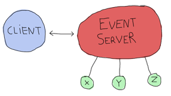
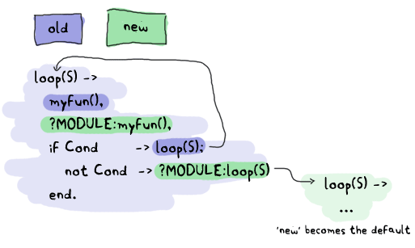

# Designing a Concurrent Application


All fine and dandy. You understand the concepts, but then again, all we've had since the beginning of the book were toy examples: calculators, trees, Heathrow to London, etc. It's time for something more fun and more educational. We'll write a small application in concurrent Erlang. The application's going to be small and line-based, but still useful and moderately extensible.

I'm a somewhat unorganized person. I'm lost with homework, things to do around the apartment, this book, work, meetings, appointments, etc. I end up having a dozen of lists everywhere with tasks I still forget to do or look over. Hopefully you still need reminders of what to do (but you don't have a mind that wanders as much as mine does), because we're going to write one of these event reminder applications that prompt you to do stuff and remind you about appointments.

## [Understanding the Problem]

The first step is to know what the hell we're doing. \"A reminder app,\" you say. \"Of course,\" I say. But there's more. How do we plan on interacting with the software? What do we want it to do for us? How do we represent the program with processes? How do we know what messages to send?

As the quote goes, \"Walking on water and developing software from a specification are easy if both are frozen.\" So let's get a spec and stick to it. Our little piece of software will allow us to do the following:

-   Add an event. Events contain a deadline (the time to warn at), an event name and a description.
-   Show a warning when the time has come for it.
-   Cancel an event by name.
-   No persistent disk storage. It's not needed to show the architectural concepts we'll see. It will suck for a real app, but I'll instead just show where it could be inserted if you wanted to do it and also point to a few helpful functions.
-   Given we have no persistent storage, we have to be able to update the code while it is running.
-   The interaction with the software will be done via the command line, but it should be possible to later extend it so other means could be used (say a GUI, web page access, instant messaging software, email, etc.)

Here's the structure of the program I picked to do it:



Where the client, event server and x, y and z are all processes. Here's what each of them can do:

### Event Server

-   Accepts subscriptions from clients
-   Forwards notifications from event processes to each of the subscribers
-   Accepts messages to add events (and start the x, y, z processes needed)
-   Can accept messages to cancel an event and subsequently kill the event processes
-   Can be terminated by a client
-   Can have its code reloaded via the shell.

### client

-   Subscribes to the event server and receive notifications as messages. As such it should be easy to design a bunch of clients all subscribing to the event server. Each of these could potentially be a gateway to the different interaction points mentioned above (GUI, web page, instant messaging software, email, etc.)
-   Asks the server to add an event with all its details
-   Asks the server to cancel an event
-   Monitors the server (to know if it goes down)
-   Shuts down the event server if needed

### x, y and z:

-   Represent a notification waiting to fire (they're basically just timers linked to the event server)
-   Send a message to the event server when the time is up
-   Receive a cancellation message and die

Note that all clients (IM, mail, etc. which are not implemented in this book) are notified about all events, and a cancellation is not something to warn the clients about. Here the software is written for you and me, and it's assumed only one user will run it.

Here's a more complex graph with all the possible messages:


This represents every process we'll have. By drawing all the arrows there and saying they're messages, we've written a high level protocol, or at least its skeleton.

It should be noted that using one process per event to be reminded of is likely going to be overkill and hard to scale in a real world application. However, for an application you are going to be the sole user of, this is good enough. A different approach could be using functions such as [timer:send_after/2-3](http://erldocs.com/18.0/stdlib/timer.html#send_after/2) to avoid spawning too many processes.

## [Defining the Protocol]

Now that we know what each component has to do and to communicate, a good idea would be to make a list of all messages that will be sent and specify what they will look like. Let's first start with the communication between the client and the event server:

![The client can send 

Here I chose to use two monitors because there is no obvious dependency between the client and the server. I mean, of course the client doesn't work without the server, but the server can live without a client. A link could have done the job right here, but because we want our system to be extensible with many clients, we can't assume other clients will all want to crash when the server dies. And neither can we assume the client can really be turned into a system process and trap exits in case the server dies. Now to the next message set:

![The client can send the message 

This adds an event to the event server. A confirmation is sent back under the form of the `ok` atom, unless something goes wrong (maybe the TimeOut is in the wrong format.) The inverse operation, removing events, can be done as follows:

![The client can send the message 

The event server can then later send a notification when the event is due:

![The event server forwards a 

Then we only need the two following special cases for when we want to shut the server down or when it crashes:

![When the client sends the 'shutdown' atom to the event server, it dies and returns 

No direct confirmation is sent when the server dies because the monitor will already warn us of that. That's pretty much all that will happen between the client and the event server. Now for the messages between the event server and the event processes themselves.

A thing to note here before we start is that it would be very useful to have the event server linked to the events. The reason for this is that we want all events to die if the server does: they make no sense without it.

Ok, so back to the events. When the event server starts them, it gives each of them a special identifier (the event's name). Once one of these events' time has come, it needs to send a message saying so:


And that should be it. One last message will be needed for our protocol, the one that lets us upgrade the server:


No reply is necessary. We'll see why when we actually program that feature and you'll see it makes sense.

Having both the protocol defined and the general idea of how our process hierarchy will look in place, we can actually start working on the project.

## [Lay Them Foundations]


To begin with it all, we should lay down a standard Erlang directory structure, which looks like this:

``` expand
ebin/
include/
priv/
src/
```

The `ebin/` directory is where files will go once they are compiled. The `include/` directory is used to store `.hrl` files that are to be included by other applications; the private `.hrl` files are usually just kept inside the `src/` directory. The `priv/` directory is used for executables that might have to interact with Erlang, such as specific drivers and whatnot. We won't actually use that directory for this project. Then the last one is the `src/` directory, where all `.erl` files stay.

In standard Erlang projects, this directory structure can vary a little. A `conf/` directory can be added for specific configuration files, `doc/` for documentation and `lib/` for third party libraries required for your application to run. Different Erlang product on the market often use different names than these, but the four ones mentioned above usually stay the same given they're part of the [standard OTP practices](http://www.erlang.org/doc/design_principles/applications.html#id71171 "Reference page only, don't expect to understand everything out of it").

## [An Event Module]

Get into the `src/` directory and start an [event.erl](static/erlang/event.erl.html) module, which will implement the x, y and z events in the earlier drawings. I'm starting with this module because it's the one with the fewest dependencies: we'll be able to try to run it without needing to implement the event server or client functions.

Before really writing code, I have to mention that the protocol is incomplete. It helps represent what data will be sent from process to process, but not the intricacies of it: how the addressing works, whether we use references or names, etc. Most messages will be wrapped under the form ` is a unique message identifier to help know what reply came from who. If we were to send many messages before looking for replies, we would not know what reply went with what message without a reference.

So here we go. The core of the processes that will run `event.erl`'s code will be the function `loop/1`, which will look a bit like the following skeleton if you remember the protocol:

```erl
loop(State) ->
    receive
         ->
            ...
    after Delay ->
        ...
    end.
```

This shows the timeout we have to support to announce an event has come to term and the way a server can call for the cancellation of an event. You'll notice a variable `State``.) It will also need to know the event server's pid in order to send it notifications.

This is all stuff that's fit to be held in the loop's state. So let's declare a `state` record on the top of the file:

```erl
-module(event).
-compile(export_all).
-record(state, {server,
                name="",
                to_go=0}).
```

With this state defined, it should be possible to refine the loop a bit more:

```erl
loop(S = #state) ->
    receive
         ->
            Server ! 
    after S#state.to_go*1000 ->
        Server ! 
    end.
```

Here, the multiplication by a thousand is to change the `to_go` value from seconds to milliseconds.

::: 
**Don't drink too much Kool-Aid:**\
Language wart ahead! The reason why I bind the variable 'Server' in the function head is because it's used in pattern matching in the receive section. Remember, [records are hacks!](a-short-visit-to-common-data-structures.html#records) The expression `S#state.server` is secretly expanded to `element(2, S)`, which isn't a valid pattern to match on.

This still works fine for `S#state.to_go` after the `after` part, because that one can be an expression left to be evaluated later.
:::

Now to test the loop:

```eshell
6> c(event).

7> rr(event, state).
[state]
8> spawn(event, loop, [#state]).
<0.60.0>
9> flush().
ok
10> flush().
Shell got 
ok
11> Pid = spawn(event, loop, [#state]).
<0.64.0>
12> ReplyRef = make_ref().
#Ref<0.0.0.210>
13> Pid ! .

14> flush().
Shell got 
ok
```

Lots of stuff to see here. Well first of all, we import the record from the event module with `rr(Mod)`. Then, we spawn the event loop with the shell as the server (`self()`). This event should fire after 5 seconds. The 9th expression was run after 3 seconds, and the 10th one after 6 seconds. You can see we did receive the `` message on the second try.

Right after that, I try the cancel feature (with an ample 500 seconds to type it). You can see I created the reference, sent the message and got a reply with the same reference so I know the `ok` I received was coming from this process and not any other on the system.

The reason why the cancel message is wrapped with a reference but the `done` message isn't is simply because we don't expect it to come from anywhere specific (any place will do, we won't match on the receive) nor should we want to reply to it. There's another test I want to do beforehand. What about an event happening next year?

```eshell
15> spawn(event, loop, [#state]).
<0.69.0>
16> 
=ERROR REPORT==== DD-MM-YYYY::HH:mm:SS ===
Error in process <0.69.0> with exit value: 
```

Ouch. It seems like we hit an implementation limit. It turns out Erlang's timeout value is limited to about 50 days in milliseconds. It might not be significant, but I'm showing this error for three reasons:

1.  It bit me in the ass when writing the module and testing it, halfway through the chapter.
2.  Erlang is certainly not perfect for every task and what we're seeing here is the consequences of using timers in ways not intended by the implementers.
3.  That's not really a problem; let's work around it.

The fix I decided to apply for this one was to write a function that would split the timeout value into many parts if turns out to be too long. This will request some support from the `loop/1` function too. So yeah, the way to split the time is basically divide it in equal parts of 49 days (because the limit is about 50), and then put the remainder with all these equal parts. The sum of the list of seconds should now be the original time:

```erl
%% Because Erlang is limited to about 49 days (49*24*60*60*1000) in
%% milliseconds, the following function is used
normalize(N) ->
    Limit = 49*24*60*60,
    [N rem Limit | lists:duplicate(N div Limit, Limit)].
```

The function `lists:duplicate/2` will take a given expression as a second argument and reproduce it as many times as the value of the first argument (`[a,a,a] = lists:duplicate(3, a)`). If we were to send `normalize/1` the value `98*24*60*60+4`, it would return `[4,4233600,4233600]`. The `loop/1` function should now look like this to accommodate the new format:

```erl
%% Loop uses a list for times in order to go around the ~49 days limit
%% on timeouts.
loop(S = #state) ->
    receive
         ->
            Server ! 
    after T*1000 ->
        if Next =:= [] ->
            Server ! ;
           Next =/= [] ->
            loop(S#state)
        end
    end.
```

You can try it, it should work as normal, but now support years and years of timeout. How this works is that it takes the first element of the `to_go` list and waits for its whole duration. When this is done, the next element of the timeout list is verified. If it's empty, the timeout is over and the server is notified of it. Otherwise, the loop keeps going with the rest of the list until it's done.

It would be very annoying to have to manually call something like `event:normalize(N)` every time an event process is started, especially since our workaround shouldn't be of concern to programmers using our code. The standard way to do this is to instead have an `init` function handling all initialization of data required for the loop function to work well. While we're at it, we'll add the standard `start` and `start_link` functions:

```erl
start(EventName, Delay) ->
    spawn(?MODULE, init, [self(), EventName, Delay]).

start_link(EventName, Delay) ->
    spawn_link(?MODULE, init, [self(), EventName, Delay]).

%%% Event's innards
init(Server, EventName, Delay) ->
    loop(#state{server=Server,
                name=EventName,
                to_go=normalize(Delay)}).
```

The interface is now much cleaner. Before testing, though, it would be nice to have the only message we can send, cancel, also have its own interface function:

```erl
cancel(Pid) ->
    %% Monitor in case the process is already dead
    Ref = erlang:monitor(process, Pid),
    Pid ! ,
    receive
         ->
            erlang:demonitor(Ref, [flush]),
            ok;
         ->
            ok
    end.
```

Oh! A new trick! Here I'm using a monitor to see if the process is there or not. If the process is already dead, I avoid useless waiting time and return `ok` as specified in the protocol. If the process replies with the reference, then I know it will soon die: I remove the reference to avoid receiving them when I no longer care about them. Note that I also supply the `flush` option, which will purge the `DOWN` message if it was sent before we had the time to demonitor.

Let's test these:

```eshell
17> c(event).

18> f().
ok
19> event:start("Event", 0).
<0.103.0>
20> flush().
Shell got 
ok
21> Pid = event:start("Event", 500).
<0.106.0>
22> event:cancel(Pid).
ok
```

And it works! The last thing annoying with the event module is that we have to input the time left in seconds. It would be much better if we could use a standard format such as Erlang's datetime (``). Just add the following function that will calculate the difference between the current time on your computer and the delay you inserted:

```erl
time_to_go(TimeOut=) ->
    Now = calendar:local_time(),
    ToGo = calendar:datetime_to_gregorian_seconds(TimeOut) -
           calendar:datetime_to_gregorian_seconds(Now),
    Secs = if ToGo > 0  -> ToGo;
              ToGo =< 0 -> 0
           end,
    normalize(Secs).
```

Oh, yeah. The [calendar module](http://erldocs.com/18.0/stdlib/calendar.html) if you want the names to be more descriptive:

```erl
init(Server, EventName, DateTime) ->
    loop(#state{server=Server,
                name=EventName,
                to_go=time_to_go(DateTime)}).
```

Now that this is done, we can take a break. Start a new event, go drink a pint (half-litre) of milk/beer and come back just in time to see the event message coming in.

## [The Event Server]

Let's deal with the [event server](static/erlang/evserv.erl.html). According to the protocol, the skeleton for that one should look a bit like this:

```erl
-module(evserv).
-compile(export_all).

loop(State) ->
    receive
         ->
            ...
         ->
            ...
         ->
            ...
         ->
            ...
        shutdown ->
            ...
         ->
            ...
        code_change ->
            ...
        Unknown ->
            io:format("Unknown message: ~p~n",[Unknown]),
            loop(State)
    end.
```

You'll notice I have wrapped calls that require replies with the same ``. The idea here is to have as little traffic as necessary and only have the event processes care about what is strictly necessary. So yeah, list of clients and list of events:

```erl
-record(state,  records
                clients}). %% list of Pids

-record(event, {name="",
                description="",
                pid,
                timeout=).
```

And the loop now has the record definition in its head:

```erl
loop(S = #state) ->
    receive
        ...
    end.
```

It would be nice if both events and clients were orddicts. We're unlikely to have many hundreds of them at once. If you recall the chapter on [data structures](a-short-visit-to-common-data-structures.html#key-value-stores), orddicts fit that need very well. We'll write an `init` function to handle this:

```erl
init() ->
    %% Loading events from a static file could be done here.
    %% You would need to pass an argument to init telling where the
    %% resource to find the events is. Then load it from here.
    %% Another option is to just pass the events straight to the server
    %% through this function.
    loop(#state{events=orddict:new(),
                clients=orddict:new()}).
```

With the skeleton and initialization done, I'll implement each message one by one. The first message is the one about subscriptions. We want to keep a list of all subscribers because when an event is done, we have to notify them. Also, the protocol above mentions we should monitor them. It makes sense because we don't want to hold onto crashed clients and send useless messages for no reason. Anyway, it should look like this:

```erl
 ->
    Ref = erlang:monitor(process, Client),
    NewClients = orddict:store(Ref, Client, S#state.clients),
    Pid ! ,
    loop(S#state);
```


So what this section of `loop/1` does is start a monitor, and store the client info in the orddict under the key `Ref`. The reason for this is simple: the only other time we'll need to fetch the client ID will be if we receive a monitor's `EXIT` message, which will contain the reference (which will let us get rid of the orddict's entry).

The next message to care about is the one where we add events. Now, it is possible to return an error status. The only validation we'll do is check the timestamps we accept. While it's easy to subscribe to the `` layout, we have to make sure we don't do things like accept events on February 29 when we're not in a leap year, or any other date that doesn't exist. Moreover, we don't want to accept impossible date values such as \"5 hours, minus 1 minute and 75 seconds\". A single function can take care of validating all of that.

The first building block we'll use is the function `calendar:valid_date/1`. This one, as the name says, checks if the date is valid or not. Sadly, the weirdness of the calendar module doesn't stop at funky names: there is actually no function to confirm that `` has valid values. We'll have to implement that one too, following the funky naming scheme:

```erl
valid_datetime() ->
    try
        calendar:valid_date(Date) andalso valid_time(Time)
    catch
        error:function_clause -> %% not in  format
            false
    end;
valid_datetime(_) ->
    false.

valid_time() -> valid_time(H,M,S).
valid_time(H,M,S) when H >= 0, H < 24,
                       M >= 0, M < 60,
                       S >= 0, S < 60 -> true;
valid_time(_,_,_) -> false.
```

The `valid_datetime/1` function can now be used in the part where we try to add the message:

```erl
 ->
    case valid_datetime(TimeOut) of
        true ->
            EventPid = event:start_link(Name, TimeOut),
            NewEvents = orddict:store(Name,
                                      #event{name=Name,
                                             description=Description,
                                             pid=EventPid,
                                             timeout=TimeOut},
                                      S#state.events),
            Pid ! ,
            loop(S#state);
        false ->
            Pid ! ,
            loop(S)
    end;
```

If the time is valid, we spawn a new event process, then store its data in the event server's state before sending a confirmation to the caller. If the timeout is wrong, we notify the client rather than having the error pass silently or crashing the server. Additional checks could be added for name clashes or other restrictions (just remember to update the protocol documentation!)

The next message defined in our protocol is the one where we cancel an event. Canceling an event never fails on the client side, so the code is simpler there. Just check whether the event is in the process' state record. If it is, use the `event:cancel/1` function we defined to kill it and send ok. If it's not found, just tell the user everything went right anyway \-- the event is not running and that's what the user wanted.

```erl
 ->
    Events = case orddict:find(Name, S#state.events) of
                  ->
                     event:cancel(E#event.pid),
                     orddict:erase(Name, S#state.events);
                  error ->
                     S#state.events
             end,
    Pid ! ,
    loop(S#state);
```

Good, good. So now all voluntary interaction coming from the client to the event server is covered. Let's deal with the stuff that's going between the server and the events themselves. There are two messages to handle: canceling the events (which is done), and the events timing out. That message is simply ``:

```erl
 ->
    case orddict:find(Name, S#state.events) of
         ->
            send_to_clients(,
                            S#state.clients),
            NewEvents = orddict:erase(Name, S#state.events),
            loop(S#state);
        error ->
            %% This may happen if we cancel an event and
            %% it fires at the same time
            loop(S)
    end;
```

And the function `send_to_clients/2` does as its name says and is defined as follows:

```erl
send_to_clients(Msg, ClientDict) ->
    orddict:map(fun(_Ref, Pid) -> Pid ! Msg end, ClientDict).
```

That should be it for most of the loop code. What's left is the set different status messages: clients going down, shutdown, code upgrades, etc. Here they come:

```erl
shutdown ->
    exit(shutdown);
 ->
    loop(S#state);
code_change ->
    ?MODULE:loop(S);
Unknown ->
    io:format("Unknown message: ~p~n",[Unknown]),
    loop(S)
```

The first case (`shutdown`) is pretty explicit. You get the kill message, let the process die. If you wanted to save state to disk, that could be a possible place to do it. If you wanted safer save/exit semantics, this could be done on every `add`, `cancel` or `done` message. Loading events from disk could then be done in the `init` function, spawning them as they come.

The `'DOWN'` message's actions are also simple enough. It means a client died, so we remove it from the client list in the state.

Unknown messages will just be shown with `io:format/2` for debugging purposes, although a real production application would likely use a dedicated logging module

And here comes the code change message. This one is interesting enough for me to give it its own section.

## [Hot Code Loving]

In order to do hot code loading, Erlang has a thing called the *code server*. The code server is basically a VM process in charge of an [ETS table](http://erldocs.com/18.0/stdlib/ets.html).

A concept to understand is that Erlang has both *local* and *external* calls. Local calls are those function calls you can make with functions that might not be exported. They're just of the format `Atom(Args)`. An external call, on the other hand, can only be done with exported functions and has the form `Module:Function(Args)`.

When there are two versions of a module loaded in the VM, all local calls are done through the currently running version in a process. However, external calls are **always** done on the newest version of the code available in the code server. Then, if local calls are made from within the external one, they are in the new version of the code.



Given that every process/actor in Erlang needs to do a recursive call in order to change its state, it is possible to load entirely new versions of an actor by having an external recursive call.

::: note
**Note:** If you load a third version of a module while a process still runs with the first one, that process gets killed by the VM, which assumes it was an orphan process without a supervisor or a way to upgrade itself. If nobody runs the oldest version, it is simply dropped and the newest ones are kept instead.
:::

There are ways to bind yourself to a system module that will send messages whenever a new version of a module is loaded. By doing this, you can trigger a module reload only when receiving such a message, and always do it with a code upgrade function, say `MyModule:Upgrade(CurrentState)`, which will then be able to transform the state data structure according to the new version's specification. This 'subscription' handling is done automatically by the OTP framework, which we'll start studying soon enough. For the reminder application, we won't use the code server and will instead use a custom `code_change` message from the shell, doing very basic reloading. That's pretty much all you need to know to do hot code loading. Nevertheless, here's a more generic example:

```erl
-module(hotload).
-export([server/1, upgrade/1]).

server(State) ->
    receive
        update ->
            NewState = ?MODULE:upgrade(State),
            ?MODULE:server(NewState);  %% loop in the new version of the module
        SomeMessage ->
            %% do something here
            server(State)  %% stay in the same version no matter what.
    end.

upgrade(OldState) ->
    %% transform and return the state here.
```

As you can see, our `?MODULE:loop(S)` fits this pattern.

## [I Said, Hide Your Messages]

Hiding messages! If you expect people to build on your code and processes, you must hide the messages in interface functions. Here's what we used for the `evserv` module:

```erl
start() ->
    register(?MODULE, Pid=spawn(?MODULE, init, [])),
    Pid.

start_link() ->
    register(?MODULE, Pid=spawn_link(?MODULE, init, [])),
    Pid.

terminate() ->
    ?MODULE ! shutdown.
```

I decided to register the server module because, for now, we should only have one running at a time. If you were to expand the reminder use to support many users, it would be a good idea to instead register the names with the [global module](http://erldocs.com/18.0/stdlib/global.html). For the sake of this example app, this will be enough.

The first message we wrote is the next we should abstract away: how to subscribe. The little protocol or specification I wrote above called for a monitor, so this one is added there. At any point, if the reference returned by the subscribe message is in a `DOWN` message, the client will know the server has gone down.

```erl
subscribe(Pid) ->
    Ref = erlang:monitor(process, whereis(?MODULE)),
    ?MODULE ! ,
    receive
         ->
            ;
         ->
            
    after 5000 ->
        
    end.
```

The next one is the event adding:

```erl
add_event(Name, Description, TimeOut) ->
    Ref = make_ref(),
    ?MODULE ! ,
    receive
         -> Msg
    after 5000 ->
        
    end.
```

Note that I choose to forward the `` message that could be received to the client. I could have also decided to crash the client by raising `erlang:error(bad_timeout)`. Whether crashing the client or forwarding the error message is the thing to do is still debated in the community. Here's the alternative crashing function:

```erl
add_event2(Name, Description, TimeOut) ->
    Ref = make_ref(),
    ?MODULE ! ,
    receive
         -> erlang:error(Reason);
         -> Msg
    after 5000 ->
        
    end.
```

Then there's event cancellation, which just takes a name:

```erl
cancel(Name) ->
    Ref = make_ref(),
    ?MODULE ! ,
    receive
         -> ok
    after 5000 ->
        
    end.
```

Last of all is a small nicety provided for the client, a function used to accumulate all messages during a given period of time. If messages are found, they're all taken and the function returns as soon as possible:

```erl
listen(Delay) ->
    receive
        M =  ->
            [M | listen(0)]
    after Delay*1000 ->
        []
    end.
```

## [A Test Drive]

You should now be able to compile the application and give it a test run. To make things a bit simpler, we'll write a specific Erlang makefile to build the project. Open a file named `Emakefile` and put it in the project's base directory. The file contains Erlang terms and gives the Erlang compiler the recipe to cook wonderful and crispy `.beam` files:


``` expand
{'src/*', [debug_info,
           ,
           ,
           .
```

This tells the compiler to add debug_info to the files (this is rarely an option you want to give up), to look for files in the `src/` and `include/` directory and to output them in `ebin/`.

Now, by going in your command line and running `erl -make`, the files should all be compiled and put inside the `ebin/` directory for you. Start the Erlang shell by doing `erl -pa ebin/`. The `-pa <directory>` option tells the Erlang VM to add that path to the places it can look in for modules.

Another option is to start the shell as usual and call `make:all([load])`. This will look for a file named 'Emakefile' in the current directory, recompile it (if it changed) and load the new files.

You should now be able to track thousands of events (just replace the `DateTime` variables with whatever makes sense when you're writing the text):

```eshell
1> evserv:start().
<0.34.0>
2> evserv:subscribe(self()).

3> evserv:add_event("Hey there", "test", FutureDateTime).
ok
4> evserv:listen(5).
[]
5> evserv:cancel("Hey there").
ok
6> evserv:add_event("Hey there2", "test", NextMinuteDateTime).
ok
7> evserv:listen(2000).
[]
```

Nice nice nice. Writing any client should now be simple enough given the few basic interface functions we have created.

## [Adding Supervision]

In order to be a more stable application, we should write another 'restarter' as we did in the [last chapter](errors-and-processes.html#naming-processes) where our supervisor will be:

```erl
-module(sup).
-export([start/2, start_link/2, init/1, loop/1]).

start(Mod,Args) ->
    spawn(?MODULE, init, []).

start_link(Mod,Args) ->
    spawn_link(?MODULE, init, []).

init() ->
    process_flag(trap_exit, true),
    loop().

loop() ->
    Pid = apply(M,F,A),
    receive
         ->
            exit(shutdown); % will kill the child too
         ->
            io:format("Process ~p exited for reason ~p~n",[Pid,Reason]),
            loop()
    end.
```

This is somewhat similar to the 'restarter', although this one is a tad more generic. It can take any module, as long as it has a `start_link` function. It will restart the process it watches indefinitely, unless the supervisor itself is terminated with a shutdown exit signal. Here it is in use:

```eshell
1> c(evserv), c(sup).

2> SupPid = sup:start(evserv, []).
<0.43.0>
3> whereis(evserv).
<0.44.0>
4> exit(whereis(evserv), die).
true
Process <0.44.0> exited for reason die
5> exit(whereis(evserv), die).
Process <0.48.0> exited for reason die
true
6> exit(SupPid, shutdown).
true
7> whereis(evserv).
undefined
```

As you can see, killing the supervisor will also kill its child.

::: note
**Note:** We'll see much more advanced and flexible supervisors in the chapter about OTP supervisors. Those are the ones people are thinking of when they mention *supervision trees*. The supervisor demonstrated here is only the most basic form that exists and is not exactly fit for production environments compared to the real thing.
:::

## [Namespaces (or lack thereof)]


Because Erlang has a flat module structure (there is no hierarchy), It is frequent for some applications to enter in conflict. One example of this is the frequently used `user` module that almost every project attempts to define at least once. This clashes with the `user` module shipped with Erlang. You can test for any clashes with the function `code:clash/0`.

Because of this, the common pattern is to prefix every module name with the name of your project. In this case, our reminder application's modules should be renamed to `reminder_evserv`, `reminder_sup` and `reminder_event`.

Some programmers then decide to add a module, named after the application itself, which wraps common calls that programmers could use when using their own application. Example calls could be functions such as starting the application with a supervisor, subscribing to the server, adding and cancelling events, etc.

It's important to be aware of other namespaces, too, such as registered names that must not clash, database tables, etc.

That's pretty much it for a very basic concurrent Erlang application. This one showed we could have a bunch of concurrent processes without thinking too hard about it: supervisors, clients, servers, processes used as timers (and we could have thousands of them), etc. No need to synchronize them, no locks, no real main loop. Message passing has made it simple to compartmentalize our application into a few modules with separated concerns and tasks.

The basic calls inside [evserv.erl](static/erlang/evserv.erl.html) could now be used to construct clients that would allow to interact with the event server from somewhere outside of the Erlang VM and make the program truly useful.

Before doing that, though, I suggest you read up on the OTP framework. The next few chapters will cover some of its building blocks, which will allow for much more robust and elegant applications. A huge part of Erlang's power comes from using it. It's a carefully crafted and well-engineered tool that any self-respecting Erlang programmer has to know.
