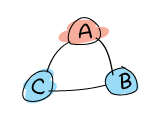
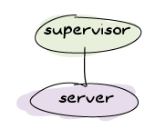

# Distributed OTP Applications

Although Erlang leaves us with a lot of work to do, it still provided a few solutions. One of these is the concept of *distributed OTP applications*. Distributed OTP applications, or just *distributed applications* when in the context of OTP, allow to define *takeover* and *failover* mechanisms. We'll see what that means, how that works, and write a little demo app to go with it.

## [Adding More to OTP]

If you recall the chapter on OTP applications, we briefly saw the structure of an application as something using a central application controller, dispatching to application masters, each monitoring a top-level supervisor for an application:


In standard OTP applications, the application can be loaded, started, stopped or unloaded. In distributed applications, we change how things work; now the application controller shares its work with the *[distributed application controller](http://www.erlang.org/doc/design_principles/distributed_applications.html)*, another process sitting next to it (usually called *dist_ac*):


Depending on the application file, the ownership of the application will change. A dist_ac will be started on all nodes, and all dist_acs will communicate together. What they talk about is not too relevant, except for one thing. As mentioned earlier, the four application statuses were being loaded, started, stopped, and unloaded; distributed applications split the idea of a started application into *started* and *running*.

The difference between both is that you could define an application to be global within a cluster. An application of this kind can only run on one node at a time, while regular OTP applications don't care about whatever's happening on other nodes.

As such a distributed application will be started on all nodes of a cluster, but only running on one.

What does this mean for the nodes where the application is started without being run? The only thing they do is wait for the node of the running application to die. This means that when the node that runs the app dies, another node starts running it instead. This can avoid interruption of services by moving around different subsystems.

Let's see what this means in more detail.

## [Taking and Failing Over]

There are two important concepts handled by distributed applications. The first one is the idea of a *failover*. A failover is the idea described above of restarting an application somewhere else than where it stopped running.

This is a particularly valid strategy when you have redundant hardware. You run something on a 'main' computer or server, and if it fails, you move it to a backup one. In larger scale deployments, you might instead have 50 servers running your software (all at maybe 60-70% load) and expect the running ones to absorb the load of the failing ones. The concept of failing over is mostly important in the former case, and somewhat least interesting in the latter one.

The second important concept of distributed OTP applications is the *takeover*. Taking over is the act of a dead node coming back from the dead, being known to be more important than the backup nodes (maybe it has better hardware), and deciding to run the application again. This is usually done by gracefully terminating the backup application and starting the main one instead.

::: note
**Note:** In terms of distributed programming fallacies, distributed OTP applications assume that when there is a failure, it is likely due to a hardware failure, and not a netsplit. If you deem netsplits more likely than hardware failures, then you have to be aware of the possibility that the application is running both as a backup and main one, and that funny things could happen when the network issue is resolved. Maybe distributed OTP applications aren't the right mechanism for you in these cases.
:::

Let's imagine that we have a system with three nodes, where only the first one is running a given application:


The nodes `B` and `C` are declared to be backup nodes in case `A` dies, which we pretend just happened:


For a brief moment, there's nothing running. After a while, `B` realizes this and decides to take over the application:


That's a failover. Then, if `B` dies, the application gets restarted on `C`:


Another failover and all is well and good. Now, suppose that `A` comes back up. `C` is now running the app happily, but `A` is the node we defined to be the main one. This is when a takeover occurs: the app is willingly shut down on `C` and restarted on `A`:


And so on for all other failures.

One obvious problem you can see is how terminating applications all the time like that is likely to be losing important state. Sadly, that's your problem. You'll have to think of places where to put and share all that vital state away before things break down. The OTP mechanism for distributed applications makes no special case for that.

Anyway, let's move on to see how we could practically make things work.

## [The Magic 8-Ball]

A magic 8-ball is a simple toy that you shake randomly in order to get divine and helpful answers. You ask questions like \"Will my favorite sports team win the game tonight?\" and the ball you shake replies something like \"Without a doubt\"; you can then safely bet your house's value on the final score. Other questions like \"Should I make careful investments for the future\" could return \"That is unlikely\" or \"I'm not sure\". The magic 8-ball has been vital in the western world's political decision making in the last decades and it is only normal we use it as an example for fault-tolerance.

Our implementation won't make use of real-life switching mechanisms used to automatically find servers such as DNS round-robins or load balancers. We'll rather stay within pure Erlang and have three nodes (denoted below as `A`, `B`, and `C`) part of a distributed OTP application. The `A` node will represent the main node running the magic 8-ball server, and the `B` and `C` nodes will be the backup nodes:



Whenever `A` fails, the 8-ball application should be restarted on either `B` or `C`, and both nodes will still be able to use it transparently.

Before setting things up for distributed OTP applications, we'll first build the application itself. It's going to be mind bogglingly naive in its design:



And in total we'll have 3 modules: the supervisor, the server, and the application callback module to start things. The supervisor will be rather trivial. We'll call it `m8ball_sup` (as in *Magic 8 Ball Supervisor*) and we'll put it in the `src/` directory of a standard OTP application:

```erl
-module(m8ball_sup).
-behaviour(supervisor).
-export([start_link/0, init/1]).

start_link() ->
    supervisor:start_link(, ?MODULE, []).

init([]) ->
    ,
          [{m8ball,
            ,
            permanent,
            5000,
            worker,
            [m8ball_server]
          }]}}.
```

This is a supervisor that will start a single server (`m8ball_server`), a permanent worker process. It's allowed one failure every 10 seconds.

The magic 8-ball server will be a little bit more complex. We'll build it as a gen_server with the following interface:

```erl
-module(m8ball_server).
-behaviour(gen_server).
-export([start_link/0, stop/0, ask/1]).
-export([init/1, handle_call/3, handle_cast/2, handle_info/2,
         code_change/3, terminate/2]).

%%%%%%%%%%%%%%%%%
%%% INTERFACE %%%
%%%%%%%%%%%%%%%%%
start_link() ->
    gen_server:start_link(, ?MODULE, [], []).

stop() ->
    gen_server:call(, stop).

ask(_Question) -> % the question doesn't matter!
    gen_server:call(, question).
```

Notice how the server is started using `` as a name and how it's accessed with the same tuple for each call. That's the `global` module we've seen in the last chapter, applied to behaviours.

Next come the callbacks, the real implementation. Before I show how we build it, I'll mention how I want it to work. The magic 8-ball should randomly pick one of many possible replies from some configuration file. I want a configuration file because it should be easy to add or remove answers as we wish.

First of all, if we want to do things randomly, we'll need to set up some randomness as part of our init function:

```erl
%%%%%%%%%%%%%%%%%
%%% CALLBACKS %%%
%%%%%%%%%%%%%%%%%
init([]) ->
    <<A:32, B:32, C:32>> = crypto:rand_bytes(12),
    random:seed(A,B,C),
    .
```

We've seen that pattern before in the [Sockets chapter](buckets-of-sockets.html): we're using 12 random bytes to set up the initial random seed to be used with the `random:uniform/1` function.

The next step is to read the answers from the configuration file and pick one. If you recall the [OTP application chapter](building-otp-applications.html), the easiest way to set up some configuration is to use the `app` file to do it (in the `env` tuple). Here's how we're gonna do this:

```erl
handle_call(question, _From, State) ->
     = application:get_env(m8ball, answers),
    Answer = element(random:uniform(tuple_size(Answers)), Answers),
    ;
handle_call(stop, _From, State) ->
    ;
handle_call(_Call, _From, State) ->
    .
```

The first clause shows what we want to do. I expect to have a tuple with all the possible answers within the `answers` value of the `env` tuple. Why a tuple? Simply because accessing elements of a tuple is a constant time operation while obtaining it from a list is linear (and thus takes longer on larger lists). We then send the answer back.

::: note
**Note:** the server reads the answers with `application:get_env(m8ball, answers)` on each question asked. If you were to set new answers with a call like `application:set_env(m8ball, answers, )`, the three answers would instantly be the possible choices for future calls.

Reading them once at startup should be somewhat more efficient in the long run, but it will mean that the only way to update the possible answers is to restart the application.
:::

You should have noticed by now that we don't actually care about the question asked --- it's not even passed to the server. Because we're returning random answers, it is entirely useless to copy it from process to process. We're just saving work by ignoring it entirely. We still leave the answer there because it will make the final interface feel more natural. We could also trick our magic 8-ball to always return the same answer for the same question if we felt like it, but we won't bother with that for now.

The rest of the module is pretty much the same as usual for a generic gen_server doing nothing:

```erl
handle_cast(_Cast, State) ->
    .

handle_info(_Info, State) ->
    .

code_change(_OldVsn, State, _Extra) ->
    .

terminate(_Reason, _State) ->
    ok.
```

Now we can get to the more serious stuff, namely the application file and the callback module. We'll begin with the latter, `m8ball.erl`:

```erl
-module(m8ball).
-behaviour(application).
-export([start/2, stop/1]).
-export([ask/1]).

%%%%%%%%%%%%%%%%%
%%% CALLBACKS %%%
%%%%%%%%%%%%%%%%%

start(normal, []) ->
    m8ball_sup:start_link().

stop(_State) ->
    ok.

%%%%%%%%%%%%%%%%%
%%% INTERFACE %%%
%%%%%%%%%%%%%%%%%
ask(Question) ->
    m8ball_server:ask(Question).
```

That was easy. Here's the associated `.app` file, `m8ball.app`:

```erl
{application, m8ball,
 [,
  ,
  ,
  ,
  ,
  ,
  {env, [
    {answers, {<<"Yes">>, <<"No">>, <<"Doubtful">>,
               <<"I don't like your tone">>, <<"Of course">>,
               <<"Of course not">>, <<"*backs away slowly and runs away*">>}}
  ]}
 ]}.
```

We depend on `stdlib` and `kernel`, like all OTP applications, and also on `crypto` for our random seeds in the server. Note how the answers are all in a tuple: that matches the tuples required in the server. In this case, the answers are all binaries, but the string format doesn't really matter --- a list would work as well.

## [Making the Application Distributed]

So far, everything was like a perfectly normal OTP application. We have very few changes to add to our files to make it work for a distributed OTP application; in fact, only one function clause to add, back in the `m8ball.erl` module:

```erl
%%%%%%%%%%%%%%%%%
%%% CALLBACKS %%%
%%%%%%%%%%%%%%%%%

start(normal, []) ->
    m8ball_sup:start_link();
start(, []) ->
    m8ball_sup:start_link().
```

The `` argument is passed to `start/2` when a more important node takes over a backup node. In the case of the magic 8-ball app, it doesn't really change anything and we can just start the supervisor all the same.

Recompile your code and it's pretty much ready. But hold on, how do we define what nodes are the main ones and which ones are backups? The answer is in configuration files. Because we want a system with three nodes (`a`, `b`, and `c`), we'll need three configuration files (I named them [a.config](static/erlang/m8ball/config/a.config.html), then put them all in `config/` inside the application directory):

```erl
[{kernel,
  [{distributed, [{m8ball,
                   5000,
                  [a@ferdmbp, ,
   ,
   
  ]}].
```

```erl
[{kernel,
  [{distributed, [{m8ball,
                   5000,
                  [a@ferdmbp, ,
   ,
   
  ]}].
```

```erl
[{kernel,
  [{distributed, [{m8ball,
                   5000,
                  [a@ferdmbp, ,
   ,
   
  ]}].
```

Don't forget to rename the nodes to fit your own host. Otherwise the general structure is always the same:

```erl
[{kernel,
  [{distributed, [{AppName,
                   TimeOutBeforeRestart,
                   NodeList}]},
   ,
   ,
   
 ]}].
```

The `NodeList` are equal secondary backups, then the other ones, etc.


The `sync_nodes_mandatory` tuple will work in conjunction with `sync_nodes_timeout`. When you start a distributed virtual machine with values set for this, it will stay locked up until all the mandatory nodes are also up and locked. Then they get synchronized and things start going. If it takes more than `MaxTime` to get all the nodes up, then they will all crash before starting.

There are way more options available, and I recommend looking into the [kernel application documentation](http://www.erlang.org/doc/man/kernel_app.html) if you want to know more about them.

We'll try things with the `m8ball` application now. If you're not sure 30 seconds is enough to boot all three VMs, you can increase the `sync_nodes_timeout` as you wish. Then, start three VMs:

```eshell
$ erl -sname a -config config/a -pa ebin/
```

```eshell
$ erl -sname b -config config/b -pa ebin/
```

```eshell
$ erl -sname c -config config/c -pa ebin/
```

As you start the third VM, they should all unlock at once. Go into each of the three virtual machines, and turn by turn, start both `crypto` and `m8ball` with `application:start(AppName)`.

You should then be able to call the magic 8-ball from any of the connected nodes:

```eshell
(a@ferdmbp)3> m8ball:ask("If I crash, will I have a second life?").
<<"I don't like your tone">>
(a@ferdmbp)4> m8ball:ask("If I crash, will I have a second life, please?").
<<"Of Course">>
```

```erl
(c@ferdmbp)3> m8ball:ask("Am I ever gonna be good at Erlang?").
<<"Doubtful">>
```

How motivational. To see how things are, call `application:which_applications()` on all nodes. Only node `a` should be running it:

```erl
(b@ferdmbp)3> application:which_applications().
[,
 ,
 ]
```

```erl
(a@ferdmbp)5> application:which_applications().
[,
 ,
 ,
 ]
```

The `c` node should show the same thing as the `b` node in that case. Now if you kill the `a` node (just ungracefully close the window that holds the Erlang shell), the application should obviously no longer be running there. Let's see where it is instead:

```erl
(c@ferdmbp)4> application:which_applications().
[,
 ,
 ]
(c@ferdmbp)5> m8ball:ask("where are you?!").
<<"I don't like your tone">>
```

That's expected, as `b` is higher in the priorities. After 5 seconds (we set the timeout to 5000 milliseconds), `b` should be showing the application as running:

```erl
(b@ferdmbp)4> application:which_applications().
[,
 ,
 ,
 ]
```

It runs fine, still. Now kill `b` in the same barbaric manner that you used to get rid of `a`, and `c` should be running the application after 5 seconds:

```erl
(c@ferdmbp)6> application:which_applications().
[,
 ,
 ,
 ]
```

If you restart the node `a` with the same command we had before, it will hang. The config file specifies we need `b` back for `a` to work. If you can't expect nodes to all be up that way, you'll need to make maybe `b` or `c` optional, for example. So if we start both `a` and `b`, then the application should automatically come back, right?

```erl
(a@ferdmbp)4> application:which_applications().
[,
 ,
 ]
(a@ferdmbp)5> m8ball:ask("is the app gonna move here?").
<<"Of course not">>
```

Aw, shucks. The thing is, for the mechanism to work, the application needs to be started *as part of the boot procedure of the node*. You could, for instance, start `a` that way for things to work:

```erl
erl -sname a -config config/a -pa ebin -eval 'application:start(crypto), application:start(m8ball)'
...
(a@ferdmbp)1> application:which_applications().
[,
 ,
 ,
 ]
```

And from `c`'s side:

```erl
=INFO REPORT==== 8-Jan-2012::19:24:27 ===
    application: m8ball
    exited: stopped
    type: temporary
```

That's because the `-eval` option gets evaluated as part of the boot procedure of the VM. Obviously, a cleaner way to do it would be to use releases to set things up right, but the example would be pretty cumbersome if it had to combine everything we had seen before.

Just remember that in general, distributed OTP applications work best when working with releases that ensure that all the relevant parts of the system are in place.

As I mentioned earlier, in the case of many applications (the magic 8-ball included), it's sometimes simpler to just have many instances running at once and synchronizing data rather than forcing an application to run only at a single place. It's also simpler to scale it once that design has been picked. If you need some failover/takeover mechanism, distributed OTP applications might be just what you need.
