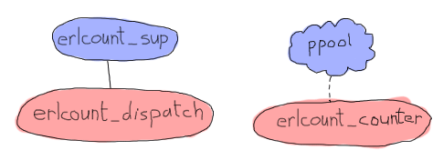
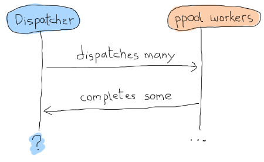

# The Count of Applications

## [From OTP Application to Real Application]


Our ppool app has become a valid OTP application and we are now able to understand what this means. It would be nice to build something that actually uses our process pool to do anything useful, though. To push our knowledge of applications a bit further, we will write a second application. This one will depend on `ppool`, but will be able to benefit from some more automation than our 'nagger'.

This application, that I will name `erlcount`, will have a somewhat simple objective: recursively look into some directory, find all Erlang files (ending in `.erl`) and then run a regular expression over it to count all instances of a given string within the modules. The results are then accumulated to give the final result, which will be output to the screen.

This specific application will be relatively simple, relying heavily on our process pool instead. It will have a structure as follows:



In the diagram above, `ppool` represents the whole application, but only means to show that `erlcount_counter` will be the worker for the process pool. This one will open files, run the regular expression and return the count. The process/module `erlcount_sup` will be our supervisor, and `erlcount_dispatch` will be a single server in charge of browsing the directories, asking `ppool` to schedule workers and compiling the results. We'll also add an `erlcount_lib` module, taking charge of hosting all the functions to read directories, compile data and whatnot, leaving the other modules with the responsibility of coordinating these calls. Last will be an `erlcount` module with the single purpose of being the application callback module.

The first step, as for our last app, is to create the directory structure needed. You can also add a few file stubs if you feel like doing so:

``` expand
ebin/
 - erlcount.app
include/
priv/
src/
 - erlcount.erl
 - erlcount_counter.erl
 - erlcount_dispatch.erl
 - erlcount_lib.erl
 - erlcount_sup.erl
test/
Emakefile
```

Nothing too different from what we had before, you can even copy the Emakefile we had before.

We can probably start writing most parts of the application pretty quickly. The `.app` file, the counter, library and supervisor should be relatively simple. On the other hand, the dispatch module will have to accomplish some complex tasks if we want things to be worth it. Let's start with [the app file](static/erlang/erlcount-1.0/ebin/erlcount.app.html):

```erl
{application, erlcount,
 [,
  {modules, [erlcount, erlcount_sup, erlcount_lib,
             erlcount_dispatch, erlcount_counter]},
  ,
  ,
  ,
  {env,
   [,
    ,
    
 ]}.
```

This app file is a bit more complex than the `ppool` one. We can still recognize some of the fields as being the same: this app will also be in version 1.0.0, the modules listed are all the same as above. The next part is something we didn't have: an application dependency. As explained earlier, the `applications` tuple gives a list of all the applications that should be started before `erlcount`. If you try to start it without that, you'll get an error message. We then have to count the registered processes with ``. Technically none of our modules started as part of the `erlcount` app will need a name. Everything we do can be anonymous. However, because we know `ppool` registers the `ppool_serv` to the name we give it and because we know we will use a process pool, then we're going to call it `erlcount` and note it there. If all applications that use `ppool` do the same, we should be able to detect conflicts in the future. The `mod` tuple is similar as before; we define the application behaviour callback module there.


The last new thing in here is the `env` tuple. As seen earlier, this entire tuple gives us a key/value store for application-specific configuration variables. These variables will be accessible from all the processes running within the application, stored in memory for your convenience. They can basically be used as substitute configuration file for your app.

In this case, we define three variables: `directory`, which tells the app where to look for `.erl` files (assuming we run the app from the erlcount-1.0 directory, this means the [`learn-you-some-erlang` root](static/erlang/learn-you-some-erlang.zip)), then we have `max_files` telling us how many file descriptors should be opened at once. We don't want to open 10,000 files at once if we end up have that many, so this variable will match the maximum number of workers in `ppool`. Then the most complex variable is `regex`. This one will contain a list of all regular expressions we want to run over each of the files to count the results.

I won't get into the long explaining of the syntax of [Perl Compatible Regular Expressions](http://en.wikipedia.org/wiki/PCRE) (if you're interested, the `re` module contains some documentation), but will still explain what we're doing here. In this case, the first regular expression says \"look for a string that contains 'if' followed by any single white space character (`\s`, with a second backslash for escaping purposes), and finishes with `->`. Moreover there can be anything in between the 'if' and the `->` (`.+`)\". The second regular expression says \"look for a string that contains 'case' followed by any single whitespace character (`\s`), and finishes with 'of' preceded by single whitespace character. Between the 'case ' and the ' of', there can be anything (`.+`)\". To make things simple, we'll try to count how many times we use `case ... of` vs. how many times we use `if ... end` in our libraries.

::: 
**Don't Drink Too Much Kool-Aid:**\
Using regular expressions is not an optimal choice to analyse Erlang code. The problem is there are lots of cases that will make our results inaccurate, including strings in the text and comments that match the patterns we're looking for but are technically not code.

To get more accurate results, we would need to look at the parsed and the expanded version of our modules, directly in Erlang. While more complex (and outside the scope of this text), this would make sure that we handle everything like macros, exclude comments, and just generally do it the right way.
:::

With this file out of the way, we can start the [application callback module](static/erlang/erlcount-1.0/src/erlcount.erl.html). It won't be complex, basically only starting the supervisor:

```erl
-module(erlcount).
-behaviour(application).
-export([start/2, stop/1]).

start(normal, _Args) ->
    erlcount_sup:start_link().

stop(_State) ->
    ok.
```

And now [the supervisor itself](static/erlang/erlcount-1.0/src/erlcount_sup.erl.html):

```erl
-module(erlcount_sup).
-behaviour(supervisor).
-export([start_link/0, init/1]).

start_link() ->
    supervisor:start_link(?MODULE, []).

init([]) ->
    MaxRestart = 5,
    MaxTime = 100,
    ,
     [{dispatch,
       ,
        transient,
        60000,
        worker,
        [erlcount_dispatch]}]}}.
```

This is a standard supervisor, which will be in charge of only `erlcount_dispatch`, as it was shown on the previous little schema. The `MaxRestart` and the 60 seconds value for shutdown were chosen pretty randomly, but in real cases you'd want to study the needs you have. Because this is a demo application, it didn't seem that important at the time. The author keeps himself the right to laziness.

We can get to the next process and module in the chain, the dispatcher. The dispatcher will have a few complex requirements to fulfill for it to be useful:

-   When we go through directories to find files ending in `.erl`, we should only go through the whole list of directories once, even when we apply multiple regular expressions;
-   We should be able to start scheduling files for result counting as soon as we find there's one that matches our criteria. We should not need to wait for a complete list to do so.
-   We need to hold a counter per regular expression so we can compare the results in the end
-   It is possible we start getting results from the `erlcount_counter` workers before we're done looking for `.erl` files
-   It is possible that many `erlcount_counter`s will be running at once
-   It is likely we will keep getting result after we finished looking files up in the directories (especially if we have many files or complex regular expressions).

The two big points we have to consider right now is how we're going to go through a directory recursively while still being able to get results from there in order to schedule them, and then accept results back while that goes on, without getting confused.


At a first look, the way that looks the simplest to gain the ability to return results while in the middle of recursion would be to use a process to do it. However, it's a bit annoying to change our previous structure just to be able to add another process to the supervision tree, then to get them working together. There is, in fact, a simpler way to do things.

This is a style of programming called *Continuation-Passing Style*. The basic idea behind it is to take one function that's usually deeply recursive and break every step down. We return each step (which would usually be the accumulator), and then a function that will allow us to keep going after that. In our case, our function will basically have two possible return values:

``` expand

done
```

Whenever we receive the first one, we can schedule `FileName`:

```erl
-module(erlcount_lib).
-export([find_erl/1]).
-include_lib("kernel/include/file.hrl").

%% Finds all files ending in .erl
find_erl(Directory) ->
    find_erl(Directory, queue:new()).
```

Ah, something new there! What a surprise, my heart is racing and my blood is pumping. The include file up there is something given to us by the `file` module. It contains a record (`#file_info`) with a bunch of fields explaining details about the file, including its type, size, permissions, and so on.

Our design here includes a queue. Why is that? Well it is entirely possible that a directory contains more than one file. So when we hit a directory and it contains something like 15 files, we want to handle the first one (and if it's a directory, open it, look inside, etc.) and then handle the 14 others later. In order to do so, we will just store their names in memory until we have the time process them. We use a queue for that, but a stack or any other data structure would still be fine given we don't really care about the order in which we read files. Anyway, the point is, this queue acts a bit like a to-do list for files in our algorithm.

Alright so let's start by reading the first file passed from the first call:

```erl
%%% Private
%% Dispatches based on file type
find_erl(Name, Queue) ->
     = file:read_file_info(Name),
    case F#file_info.type of
        directory -> handle_directory(Name, Queue);
        regular -> handle_regular_file(Name, Queue);
        _Other -> dequeue_and_run(Queue)
    end.
```

This function tells us few things: we only want to deal with regular files and directories. In each case we will write ourselves a function to handle these specific occurrences (`handle_directory/2` and `handle_regular_file/2`). For other files, we will dequeue anything we had prepared before with the help of `dequeue_and_run/1` (we'll see what this one is about soon). For now, we first start dealing with directories:

```erl
%% Opens directories and enqueues files in there
handle_directory(Dir, Queue) ->
    case file:list_dir(Dir) of
         ->
            dequeue_and_run(Queue);
         ->
            dequeue_and_run(enqueue_many(Dir, Files, Queue))
    end.
```

So if there are no files, we keep searching with `dequeue_and_run/1`, and if there are many, we enqueue them before doing so. Let me explain this. The function `dequeue_and_run` will take the queue of file names and get one element out of it. The file name it fetches out from there will be used by calling `find_erl(Name, Queue)` and we just keep going as if we were just getting started:

```erl
%% Pops an item from the queue and runs it.
dequeue_and_run(Queue) ->
    case queue:out(Queue) of
         -> done;
         -> find_erl(File, NewQueue)
    end.
```

Note that if the queue is empty (``), the function considers itself `done` (a keyword chosen for our CPS function), otherwise we keep going over again.

The other function we had to consider was `enqueue_many/3`. This one is designed to enqueue all the files found in a given directory and works as follows:

```erl
%% Adds a bunch of items to the queue.
enqueue_many(Path, Files, Queue) ->
    F = fun(File, Q) -> queue:in(filename:join(Path,File), Q) end,
    lists:foldl(F, Queue, Files).
```

Basically, we use the function `filename:join/2` to merge the directory's path to each file name (so that we get a complete path). We then add this new full path to a file to the queue. We use a fold to repeat the same procedure with all the files in a given directory. The new queue we get out of it is then used to run `find_erl/2` again, but this time with all the new files we found added to the to-do list.

Whoa, we digressed a bit. Where were we? Oh yes, we were handling directories and now we're done with them. We then need to check for regular files and whether they end in `.erl` or not.

```erl
%% Checks if the file finishes in .erl
handle_regular_file(Name, Queue) ->
    case filename:extension(Name) of
        ".erl" ->
            ;
        _NonErl ->
            dequeue_and_run(Queue)
    end.
```

You can see that if the name matches (according to `filename:extension/1`), we return our continuation. The continuation gives the `Name` to the caller, and then wraps the operation `dequeue_and_run/1` with the queue of files left to visit into a fun. That way, the user can call that fun and keep going as if we were still in the recursive call, while still getting results in the mean time. In the case where the file name doesn't end in `.erl`, then the user has no interest in us returning yet and we keep going by dequeuing more files. That's it.

Hooray, the CPS thing is done. We can then focus on the other issue. How are we going to design the dispatcher so that it can both dispatch and receive at once? My suggestion, which you will no doubt accept because I'm the one writing the text, is to use a finite state machine. It will have two states. The first one will be the 'dispatching' state. It's the one used whenever we're waiting for our `find_erl` CPS function to hit the `done` entry. While we're in there, we will never think about us being done with the counting. That will only happen in the second and final state, 'listening', but we will still receive notices from ppool all the time:


This will thus require us to have:

1.  A dispatching state with an asynchronous event for when we get new files to dispatch
2.  A dispatching state with an asynchronous event for when we are done getting new files
3.  A listening state with an asynchronous event for when we're done getting new files
4.  A global event to be sent by the ppool workers when they're done running their regular expression.

We'll slowly start building [our gen_fsm](static/erlang/erlcount-1.0/src/erlcount_dispatch.erl.html):

```erl
-module(erlcount_dispatch).
-behaviour(gen_fsm).
-export([start_link/0, complete/4]).
-export([init/1, dispatching/2, listening/2, handle_event/3,
        handle_sync_event/4, handle_info/3, terminate/3, code_change/4]).

-define(POOL, erlcount).
```

Our API will thus have two functions: one for the supervisor (`start_link/0`) and one for the ppool callers (`complete/4`, we'll see the arguments when we get there). The other functions are the standard gen_fsm callbacks, including our `listening/2` and `dispatching/2` asynchronous state handlers. I also defined a `?POOL` macro, used to give our ppool server the name 'erlcount'.

What should the gen_fsm's data look like, though? Because we're going asynchronous and we are going to always call `ppool:run_async/2` instead of anything else, we will have no real way of knowing if we're ever done scheduling files or not. Basically we could have a timeline like this:



One way to solve the problem could be to use a timeout, but this is always annoying: is the timeout too long or too short? Has something crashed? This much uncertainty is probably as fun as a toothbrush made of lemon. Instead, we could use a concept where each worker is given some kind of identity, which we can track and associate with a reply, a bit like a secret password to enter the private club of 'workers who succeeded'. This concept will let us match one-on-one whatever message we get and let us know when we are absolutely done. We now know what our state data might look like this:

```erl
-record(data, ).
```

The first list will be tuples of the form ``, while the second will be a list of some kind of references to the messages. Anything will do, as long as it's unique. We can then add the two following API functions:

```erl
%%% PUBLIC API
start_link() ->
    gen_fsm:start_link(?MODULE, [], []).

complete(Pid, Regex, Ref, Count) ->
    gen_fsm:send_all_state_event(Pid, ).
```

And here is our secret `complete/4` function. Unsurprisingly, the workers will only have to send back 3 pieces of data: what regular expression they were running, what their associated score was, and then the reference mentioned above. Awesome, we can get into the real interesting stuff!

```erl
init([]) ->
    %% Move the get_env stuff to the supervisor's init.
     = application:get_env(regex),
     = application:get_env(directory),
     = application:get_env(max_files),
    ppool:start_pool(?POOL, MaxFiles, ),
    case lists:all(fun valid_regex/1, Re) of
        true ->
            self() ! ,
            ;
        false ->
           
    end.
```

The init function first loads all the info we need to run from the application file. Once that's done, we plan on starting the process pool with `erlcount_counter` as a callback module. The last step before actually going is to make sure all regular expressions are valid. The reason for this is simple. If we do not check it right now, then we will have to add error handling call somewhere else instead. This is likely going to be in the `erlcount_counter` worker. Now if it happens there, we now have to define what do we do when the workers start crashing because of that and whatnot. It's just simpler to handle when starting the app. Here's the `valid_regex/1` function:

```erl
valid_regex(Re) ->
    try re:run("", Re) of
        _ -> true
    catch
        error:badarg -> false
    end.
```

We only try to run the regular expression on an empty string. This will take no time and let the `re` module try and run things. So the regexes are valid and we start the app by sending ourselves `]`, the idea being to add a counter to each of the regular expressions.

The first message we have to handle is `` in `handle_info/2`. Remember, because Erlang's behaviours are pretty much all based on messages, we have to do the ugly step of sending ourselves messages if we want to trigger a function call and do things our way. Annoying, but manageable:

```erl
handle_info(, State, Data) ->
    gen_fsm:send_event(self(), erlcount_lib:find_erl(Dir)),
    .
```

We send ourselves the result of `erlcount_lib:find_erl(Dir)`. It will be received in the `dispatching`, given that's the value of `State``. We will also be in the 'dispatching' state, because that's what we put as the initial state in the init function:

```erl
dispatching() ->
    F = fun(, NewRefs) ->
        Ref = make_ref(),
        ppool:async_queue(?POOL, [self(), Ref, File, Regex]),
        [Ref|NewRefs]
    end,
    NewRefs = lists:foldl(F, Refs, Re),
    gen_fsm:send_event(self(), Continuation()),
    ;
```

That's a bit ugly. For each of the regular expressions, we create a unique reference, schedule a ppool worker that knows this reference, and then store this reference (to know if a worker has finished). I chose to do this in a foldl in order to make it easier to accumulate all the new references. Once that dispatching is done, we call the continuation again to get more results, and then wait for the next message with the new references as our state.

What's the next kind of message we can get? We have two choices here. Either none of the workers have given us our results back (even though they have not been implemented yet) or we get the `done` message because all files have been looked up. Let's go the second type to finish implementing the `dispatching/2` function:

```erl
dispatching(done, Data) ->
    %% This is a special case. We can not assume that all messages have NOT
    %% been received by the time we hit 'done'. As such, we directly move to
    %% listening/2 without waiting for an external event.
    listening(done, Data).
```

The comment is pretty explicit as to what is going on, but let me explain anyway. When we schedule jobs, we can receive results while in `dispatching/2` or while in `listening/2`. This can take the following form:


In this case, the 'listening' state can just wait for results and declare everything is in. But remember, this is Erlang Land (*Erland*) and we work in parallel and asynchronously! This scenario is as probable:


Ouch. Our application would then be hanging forever, waiting for messages. This is the reason why we need to manually call `listening/2`: we will force it to do some kind of result detection to make sure everything has been received, just in case we already have all the results. Here's what this looks like:

```erl
listening(done, #data) -> % all received!
    [io:format("Regex ~s has ~p results~n", [R,C]) ||  <- Re],
    ;
listening(done, Data) -> % entries still missing
    .
```

If no *refs* are left, then everything was received and we can output the results. Otherwise, we can keep listening to messages. If you take another look at `complete/4` and this diagram:


The result messages are global, because they can be received in either 'dispatching' or 'listening' states. Here's the implementation:

```erl
handle_event() ->
     = lists:keyfind(Regex, 1, Re),
    NewRe = lists:keyreplace(Regex, 1, Re, ),
    NewData = Data#data,
    case State of
        dispatching ->
            ;
        listening ->
            listening(done, NewData)
    end.
```

The first thing this does is find the regular expression that just completed in the `Re` of the worker, and then send ourselves to the next state.

In normal FSMs, we would just have done ``, but here, because of the problem mentioned with regards to knowing when we're done or not, we have to manually call `listening/2` again. Such a pain, but alas, a necessary step.

And that's it for the dispatcher. We just add in the rest of the filler behaviour functions:

```erl
handle_sync_event(Event, _From, State, Data) ->
    io:format("Unexpected event: ~p~n", [Event]),
    .

terminate(_Reason, _State, _Data) ->
    ok.

code_change(_OldVsn, State, Data, _Extra) ->
    .
```

And we can then move on to the counter. You might want to take a little break before then. Hardcore readers can go bench press their own weight a few times to relax themselves and then come back for more.

### The Counter

The counter is simpler than the dispatcher. While we still need a behaviour to do things (in this case, a gen_server), it will be quite minimalist. We only need it to do three things:

1.  Open a file
2.  Run a regex on it and count the instances
3.  Give the result back.

For the first point, we have plenty of functions in `file` to help us do that. For the number 3, we defined `erlcount_dispatch:complete/4` to do it. For the number 2, we can use the `re` module with `run/2-3`, but it doesn't quite do what we need:

```eshell
1> re:run(<<"brutally kill your children (in Erlang)">>, "a"). 

2> re:run(<<"brutally kill your children (in Erlang)">>, "a", [global]).

3> re:run(<<"brutally kill your children (in Erlang)">>, "a", [global, ]).

4> re:run(<<"brutally kill your children (in Erlang)">>, "child", [global, ]).

```

While it does take the arguments we need (`re:run(String, Pattern, Options)`), it doesn't give us the correct count. Let's add the following function to [erlcount_lib](static/erlang/erlcount-1.0/src/erlcount_lib.erl.html) so we can start writing the counter:

```erl
regex_count(Re, Str) ->
    case re:run(Str, Re, [global]) of
        nomatch -> 0;
         -> length(List)
    end.
```

This one basically just counts the results and returns that. Don't forget to add it to the export form.

Ok, on with [the worker](static/erlang/erlcount-1.0/src/erlcount_counter.erl.html):

```erl
-module(erlcount_counter).
-behaviour(gen_server).
-export([start_link/4]).
-export([init/1, handle_call/3, handle_cast/2, handle_info/2,
        terminate/2, code_change/3]).

-record(state, ).

start_link(DispatcherPid, Ref, FileName, Regex) ->
    gen_server:start_link(?MODULE, [DispatcherPid, Ref, FileName, Regex], []).

init([DispatcherPid, Ref, FileName, Regex]) ->
    self() ! start,
    {ok, #state{dispatcher=DispatcherPid,
                ref = Ref,
                file = FileName,
                re = Regex}}.

handle_call(_Msg, _From, State) ->
    .

handle_cast(_Msg, State) ->
    .

handle_info(start, S = #state) ->
     = file:read_file(S#state.file),
    Count = erlcount_lib:regex_count(Re, Bin),
    erlcount_dispatch:complete(S#state.dispatcher, Re, Ref, Count),
    .

terminate(_Reason, _State) ->
    ok.

code_change(_OldVsn, State, _Extra) ->
    .
```

The two interesting sections here are the `init/1` callback, where we order ourselves to start, and then a single `handle_info/2` clause where we open the file (`file:read_file(Name)`), get a binary back, which we pass to our new `regex_count/2` function, and then send it back with `complete/4`. We then stop the worker. The rest is just standard OTP callback stuff.

We can now compile and run the whole thing!

```eshell
$ erl -make
Recompile: src/erlcount_sup
Recompile: src/erlcount_lib
Recompile: src/erlcount_dispatch
Recompile: src/erlcount_counter
Recompile: src/erlcount
Recompile: test/erlcount_tests
```

Hell yes. Pop the champagne because we have no whine!

## [Run App Run]

There are many ways to get our app running. Make sure you're in a directory where you somehow have these two directories next to each other:

``` expand
erlcount-1.0
ppool-1.0
```

Now start Erlang the following way:

``` expand
$ erl -env ERL_LIBS "."
```

The `ERL_LIBS` variable is pretty useful, especially when installing libraries, so try to remember it!

With the VM we started, we can test that the modules are all there:

```eshell
1> application:load(ppool).
ok
```

This function will try to load all the application modules in memory if they can be found. If you don't call it, it will be done automatically when starting the application, but this provides an easy way to test our paths. We can start the apps:

```eshell
2> application:start(ppool), application:start(erlcount).
ok
Regex if\s.+-> has 20 results
Regex case\s.+\sof has 26 results
```

Your results may vary depending on what you have in your directories. Note that depending how many files you have, this can take longer.


What if we want different variables to be set for our applications, though? Do we need to change the application file all the time? No we don't! Erlang also supports that. So let's say I wanted to see how many times the Erlang programmers are angry in their source files?

The `erl` executable supports a special set of arguments of the form `-AppName Key1 Val1 Key2 Val2 ... KeyN ValN`. In this case, we could then run the following regular expression over the Erlang source code from the R14B02 distribution with 2 regular expressions as follows:

```eshell
$ erl -env ERL_LIBS "." -erlcount directory '"/home/ferd/otp_src_R14B02/lib/"' regex '["shit","damn"]'
...
1> application:start(ppool), application:start(erlcount).
ok
Regex shit has 3 results
Regex damn has 1 results
2> q().
ok
```

Note that in this case, all expressions I give as arguments are wrapped in single quotation marks (`'`). That's because I want them to be taken literally by my Unix shell. Different shells might have different rules.

We could also try our search with more general expressions (allowing values to start with capital letters) and with more file descriptors allowed:

```eshell
$ erl -env ERL_LIBS "." -erlcount directory '"/home/ferd/otp_src_R14B02/lib/"' regex '["[Ss]hit","[Dd]amn"]' max_files 50
...
1> application:start(ppool), application:start(erlcount).
ok
Regex [Ss]hit has 13 results
Regex [Dd]amn has 6 results
2> q().
ok
```

Oh, OTP programmers. What makes you so angry? (\"Working with Erlang\" not being an acceptable answer)

This one might take even longer to run due to the more complex checks required over the hundreds of files there. This all works pretty good, but there are a few annoying things there. Why are we always manually starting both applications? isn't there something better?

## [Included Applications]

Included applications are one way to get things working. The basic idea of an included application is that you define an application (in this case `ppool`) as an application that is part of another one (`erlcount`, here). To do this, a bunch of changes need to be made to both applications.

The gist of it is that you modify your application file a bit, and then you need to add something called *start phases* to them, etc.


It is more and more recommended **not** to use included applications for a simple reason: they seriously limit code reuse. Think of it this way. We've spent a lot of time working on ppool's architecture to make it so anybody can use it, get their own pool and be free to do whatever they want with it. If we were to push it into an included application, then it can no longer be included in any other application on this VM, and if erlcount dies, then ppool will be taken down with it, ruining the work of any third party application that wanted to use ppool.

For these reasons, included applications are usually excluded from many Erlang programmers' toolbox. As we will see in the following chapter, releases can basically help us do the same (and much more) in a more generic manner.

Before that, we have a one more topic left to discuss in applications though.

## [Complex Terminations]

There are cases where we need more steps to be done before terminating our application. The `stop/1` function from the application callback module might not be enough, especially since it gets called **after** the application has already terminated. What do we do if we need to clean things up before the application is actually gone?

The trick is simple. Just add a function `prep_stop(State)` to your application callback module. `State` will be the state returned by your `start/2` function, and whatever `prep_stop/1` returns will be passed to `stop/1`. The function `prep_stop/1` thus technically inserts itself between `start/2` and `stop/1` and is executed while your application is still alive, but just before it shuts down.

This is the kind of callback that you will know when you need to use it, but that we don't require for our application right now.

::: 
**Don't drink too much Kool-Aid:**\
A real world use case of the `prep_stop/1` callback came to me when I was helping [Yurii Rashkosvkii (yrashk)](http://about.me/yrashk), a package manager for Erlang. The problems encountered are a bit complex and have to do with weird interactions between `simple_one_for_one` supervisors and the application master, so feel free to skip this part of the text.

Agner is basically structured in a way where the application is started, starts a top-level supervisor, which starts a server and another supervisor, which in turn spawns the dynamic children


Now the thing is that the documentation says the following:

> Important note on simple-one-for-one supervisors: The dynamically created child processes of a simple-one-for-one supervisor are not explicitly killed, regardless of shutdown strategy, but are expected to terminate when the supervisor does (that is, when an exit signal from the parent process is received).

And indeed they are not. The supervisor just kills its regular children and then disappears, leaving it to the simple-one-for-one children's behaviours to catch the exit message and leave. This, alone is fine.

As seen earlier, for each application, we have an application master. This application master acts as a group leader. As a reminder, the application master is linked both to its parent (the application controller) and its direct child (the app's top-level supervisor) and monitors both of them. When any of them fails, the master terminates its own execution, using its status as a group leader to terminate all of the leftover children. Again, this alone is fine.

However, if you mix in both features, and then decide to shut the application down with `application:stop(agner)`, you end up in a very troublesome situation:


At this precise point in time, both supervisors are dead, as well as the regular worker in the app. The simple-one-for-one workers are currently dying, each catching the `EXIT` signal sent by their direct ancestor.

At the same time, though, The application master gets wind of its direct child dying and ends up killing every one of the simple-one-for-one workers that weren't dead yet.

The result is a bunch of workers which managed to clean up after themselves, and a bunch of others that didn't manage to do so. This is highly timing dependent, hard to debug and easy to fix.

Yurii and I basically fixed this by using the `ApplicationCallback:prep_stop(State)` function to fetch a list of all the dynamic simple-one-for-one children, monitor them, and then wait for all of them to die in the `stop(State)` callback function. This forces the application controller to stay alive until all of the dynamic children were dead. You can see the actual file on [Agner's github repository](https://github.com/agner/agner/blob/db2527cfa2133a0679d8da999d1c37567151b49f/src/agner_app.erl)
:::


What an ugly thing! Hopefully, people very rarely run into this kind of issue and you hopefully won't. You can go put some soap in your eyes to wash away the terrible pictures of using `prep_stop/1` to get things working, even though it sometimes makes sense and is desirable. When you're back, we're going to start thinking about packaging our applications into releases.

::: 
**update:**\
Since version R15B, the issue above has been resolved. The termination of dynamic children appears to be synchronous in the case of a supervisor shutdown.
:::
