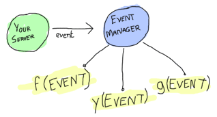
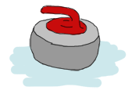

# Event Handlers

## [Handle This! \*pumps shotgun\*]

There is a certain thing that I've avoided getting into in a few of the previous examples. If you look back at the [reminder app](designing-a-concurrent-application.html), our trading system used `io:format/2` to notify people of what was going on.

You can probably see the common link between both cases. They're all about letting people (or some process or application) know about an event that happened at some point in time. In one case, we only output the results while in the other, we took the Pid of subscribers before sending them a message.

The output approach is minimalist and can not be extended with ease. The one with subscribers is certainly valid. In fact, it's pretty useful when each of the subscribers has a long-running operation to do after receiving an event. In simpler cases, where you do not necessarily want a standby process waiting for events for each of the callbacks, a third approach can be taken.

This third approach simply takes a process which accepts functions and lets them run on any incoming event. This process is usually called an *event manager* and it might end up looking a bit like this:



Doing things that way has a few advantages:

-   If your server has many subscribers, it can keep going because it only needs to forward events once
-   If there is a lot of data to be transferred, it's only done once and all callbacks operate on that same instance of the data
-   You don't need to spawn processes for short lived tasks

And of course there are a few downsides too:

-   If all functions need to run for a long time, they're going to block each other. This can be prevented by actually having the function forward the event to a process, basically turning the event manager as an event forwarder (something similar to what we did for the reminder app)
-   In fact, a function that loops indefinitly can prevent any new event from being handled until something crashes.

There is a way to solve these downsides, which is a bit underwhelming. Basically, you have to turn the event manager approach into the subscriber one. Luckily, the event manager approach is flexible enough to do it with ease and we'll see how to do it later in this chapter.

I usually write a very basic version of the OTP behaviour we'll see in pure Erlang beforehand, but in this case, I'll instead come straight to the point. Here comes `gen_event`.

## [Generic Event Handlers]

The `gen_event` behaviour differs quite a bit from the `gen_server` and `gen_fsm` behaviours in that you are never really starting a process. The whole part I've described above about 'accepting a callback' is the reason for this. The `gen_event` behaviour basically runs the process that accepts and calls functions, and you only provide a module with these functions. This is to say, you have nothing to do with regards to event manipulation except give your callback functions in a format that pleases the *event manager*. All managing is done for free; you only provide what's specific to your application. This is not really surprising given OTP is, again, all about separating what's generic from specific.

This separation, however, means that the standard `spawn -> init -> loop -> terminate` pattern will only be applied to event handlers. Now if you recall what has been said before, event handlers are a bunch of functions running in the manager. This means the currently presented model:


Switches to something more like this for the programmer:


Each event handler can hold its own state, carried around by the manager for them. Each event handler can then take the form:


This is nothing too complex so let's get it on with the event handlers' callbacks themselves.

### init and terminate

The init and terminate functions are similar to what we've seen in the previous behaviours with servers and finit state machines. `init/1` takes a list of arguments and returns ``. Whatever happens in `init/1` should have its counterpart in `terminate/2`.

### handle_event

The `handle_event(Event, State)` function is more or less the core of `gen_event`'s callback modules. It works like `gen_server`'s `handle_cast/2` in that it works asynchronously. It differs with regards to what it can return though:

-   ``
-   ``, which puts the event manager itself into hibernation until the next event
-   `remove_handler`
-   ``


The tuple ``. This one is not used too frequently, but what it does is remove the current event handler and replace it with a new one. This is done by first calling `CurrentHandler:terminate(Args1, NewState)` and removing the current handler, then adding a new one by calling `NewHandler:init(Args2, ResultFromTerminate)`. This can be useful in the cases where you know some specific event happened and you're better of giving control to a new handler. This is likely the kind of thing where you'll simply know when you need it. Again, it's not that frequently used.

All incoming events can come from `gen_event:notify/2` which is asynchronous like `gen_server:cast/2` is. There is also `gen_event:sync_notify/2` which is synchronous. This is a bit funny to say, because `handle_event/2` remains asynchronous. The idea here is that the function call only returns once all event handlers have seen and treated the new message. Until then, the event manager will keep blocking the calling process by not replying.

### handle_call

This is similar to a `gen_server`'s `handle_call` callback, except that it can return ``. The `gen_event:call/3-4` function is used to make the call.

This raises a question. How does this work when we have something like 15 different event handlers? Do we expect 15 replies or just one that contains them all? Well, in fact we'll be forced to choose only one handler to reply to us. We'll get into the details of how this is done when we actually see how to attach handlers to our event manager, but if you're impatient, you can look at how the function `gen_event:add_handler/3` works to try to figure it out.

### handle_info

The `handle_info/2` callback is pretty much the same as `handle_event` (same return values and everything), with the exception that it only treats out of band messages, such as exit signals, messages sent directly to the event manager with the `!` operator, etc. It has use cases similar to those of `handle_info` in `gen_server` and in `gen_fsm`.

### code_change

Code change works in exactly the same manner as it does for `gen_server`s, except it's for each individual event handler. It takes 3 arguments, `OldVsn``.

## [It's Curling Time!]

With the callbacks seen, we can start looking at implementing something with `gen_event`. For this part of the chapter, I've chosen to make a set of event handlers used to track game updates of one of the most entertaining sports in the world: curling.

If you've never seen or played curling before (which is a shame!), the rules are relatively simple:


You have two teams and they try to send a [curling stone](../img/curling-stone.png) sliding on the ice, trying to get to the middle of the red circle. They do this with 16 stones and the team with the stone closest to the center wins a point at the end of the round (called an *end*). If the team has the two closest stones, it earns two points, and so on. There are 10 ends and the team with the most points at the end of the 10 ends wins the game.

There are more rules making the game more fascinating, but this is a book on Erlang, not extremely fascinating winter sports. If you want to learn more about the rules, I suggest you head up to the [Wikipedia article on curling](http://en.wikipedia.org/wiki/Curling).

For this entirely real-world-relevant scenario, we'll be working for the next winter Olympic Games. The city where everything happens are just done building the arena where the matches will take place and they're working on getting the scoreboard ready. It turns out that we have to program a system that will let some official enter game events, such as when a stone has been thrown, when a round ends or when a game is over, and then route these events to the scoreboard, a stats system, news reporters' feeds, etc.

Being as clever as we are, we know this is a chapter on gen_event and deduce we will likely use it to accomplish our task. We won't implement all the rules given this is more of an example, but feel free to do so when we're done with the chapter. I promise not to be mad.

We'll start with the scoreboard. Because they're installing it right now, we'll make use of a fake module that would usually let us interact with it, but for now it'll only use standard output to show what's going on. This is where [curling_scoreboard_hw.erl](static/erlang/curling_scoreboard_hw.erl.html) comes in:

```erl
-module(curling_scoreboard_hw).
-export([add_point/1, next_round/0, set_teams/2, reset_board/0]).

%% This is a 'dumb' module that's only there to replace what a real hardware
%% controller would likely do. The real hardware controller would likely hold
%% some state and make sure everything works right, but this one doesn't mind.

%% Shows the teams on the scoreboard.
set_teams(TeamA, TeamB) ->
    io:format("Scoreboard: Team ~s vs. Team ~s~n", [TeamA, TeamB]).

next_round() ->
    io:format("Scoreboard: round over~n").

add_point(Team) ->
    io:format("Scoreboard: increased score of team ~s by 1~n", [Team]).

reset_board() ->
    io:format("Scoreboard: All teams are undefined and all scores are 0~n").
```

So this is all the functionality the scoreboard has. They usually have a timer and other awesome functionalities, but whatever. Seems like the Olympics committee didn't feel like having us implementing trivialities for a tutorial.

This hardware interface lets us have a little bit of design time to ourselves. We know that there are a few events to handle for now: adding teams, going to the next round, setting the number of points. We will only use the `reset_board` functionality when starting a new game and won't need it as part of our protocol. The events we need might take the following form in our protocol:

-   ``, where this is translated to a single call to `curling_scoreboard_hw:set_teams(TeamA, TeamB)`;
-   ` calls to `curling_scoreboard_hw:add_point(Team)`;
-   `next_round`, which gets translated to a single call with the same name.

We can start our implementation with this basic event handler skeleton:

```erl
-module(curling_scoreboard).
-behaviour(gen_event).

-export([init/1, handle_event/2, handle_call/2, handle_info/2, code_change/3,
   terminate/2]).

init([]) ->
    .

handle_event(_, State) ->
    .

handle_call(_, State) ->
    .

handle_info(_, State) ->
    .

code_change(_OldVsn, State, _Extra) ->
    .

terminate(_Reason, _State) ->
    ok.
```

This is a skeleton that we can use for every `gen_event` callback module out there. For now, the scoreboard event handler itself won't need to do anything special except forward the calls to the hardware module. We expect the events to come from `gen_event:notify/2`, so the handling of the protocol should be done in `handle_event/2`. The file [curling_scoreboard.erl](static/erlang/curling_scoreboard.erl.html) shows the updates:

```erl
-module(curling_scoreboard).
-behaviour(gen_event).

-export([init/1, handle_event/2, handle_call/2, handle_info/2, code_change/3,
   terminate/2]).

init([]) ->
    .

handle_event(, State) ->
    curling_scoreboard_hw:set_teams(TeamA, TeamB),
    ;
handle_event(, State) ->
    [curling_scoreboard_hw:add_point(Team) || _ <- lists:seq(1,N)],
    ;
handle_event(next_round, State) ->
    curling_scoreboard_hw:next_round(),
    ;
handle_event(_, State) ->
    .

handle_call(_, State) ->
    .

handle_info(_, State) ->
    .
```

You can see the updates done to the `handle_event/2` function. Trying it:

```eshell
1> c(curling_scoreboard_hw).

2> c(curling_scoreboard).

3>  = gen_event:start_link().

4> gen_event:add_handler(Pid, curling_scoreboard, []).
ok
5> gen_event:notify(Pid, ).
Scoreboard: Team Pirates vs. Team Scotsmen
ok
6> gen_event:notify(Pid, ). 
ok
Scoreboard: increased score of team Pirates by 1
Scoreboard: increased score of team Pirates by 1
Scoreboard: increased score of team Pirates by 1
7> gen_event:notify(Pid, next_round). 
Scoreboard: round over
ok
8> gen_event:delete_handler(Pid, curling_scoreboard, turn_off).
ok
9> gen_event:notify(Pid, next_round). 
ok
```

A few things are going on here. The first of them is that we're starting the `gen_event` process as a standalone thing. We then attach our event handler to it dynamically with `gen_event:add_handler/3`. This can be done as many times as you want. However, as mentioned in the `handle_call` part earlier, this might cause problems when you want to work with a particular event handler. If you want to call, add or delete a specific handler when there's more than one instance of it, you'll have to find a way to uniquely identify it. My favorite way of doing it (one that works great if you don't have anything more specific in mind) is to just use `make_ref()` as a unique value. To give this value to the handler, you add it by calling `add_handler/3` as `gen_event:add_handler(Pid, ` to talk to that specific handler. Problem solved.



Anyway, you can then see that we send messages to the event handler, which successfully calls the hardware module. We then remove the handler. Here, `turn_off` is an argument to the `terminate/2` function, which our implementation currently doesn't care about. The handler is gone, but we can still send events to the event manager. Hooray.

One awkward thing with the code snippet above is that we're forced to call the `gen_event` module directly and show everyone what our protocol looks like. A better option would be to provide an [abstraction module](static/erlang/curling.erl.html "curling abstraction module") on top of it that just wraps all we need. This will look a lot nicer to everyone using our code and will, again, let us change the implementation if (or when) we need to do it. It will also let us specify what handlers are necessary to include for a standard curling game:

```erl
-module(curling).
-export([start_link/2, set_teams/3, add_points/3, next_round/1]).

start_link(TeamA, TeamB) ->
     = gen_event:start_link(),
    %% The scoreboard will always be there
    gen_event:add_handler(Pid, curling_scoreboard, []),
    set_teams(Pid, TeamA, TeamB),
    .

set_teams(Pid, TeamA, TeamB) ->
    gen_event:notify(Pid, ).

add_points(Pid, Team, N) ->
    gen_event:notify(Pid, ).

next_round(Pid) ->
    gen_event:notify(Pid, next_round).
```

And now running it:

```eshell
1> c(curling).

2>  = curling:start_link("Pirates", "Scotsmen").
Scoreboard: Team Pirates vs. Team Scotsmen

3> curling:add_points(Pid, "Scotsmen", 2). 
Scoreboard: increased score of team Scotsmen by 1
Scoreboard: increased score of team Scotsmen by 1
ok
4> curling:next_round(Pid). 
Scoreboard: round over
ok
```


This doesn't look like much of an advantage, but it's really about making it nicer to use that code (and reduces the possibilities of writing the messages wrong).

## [Alert the Press!]

We've got the basic scoreboard done, now we want international reporters to be able to get live data from our official in charge of updating our system. Because this is an example program, we won't go through the steps of setting up a socket and writing a protocol for the updates, but we'll put the system in place to do it by putting an intermediary process in charge of it.

Basically, whenever a news organization feels like getting into the game feed, they'll register their own handler that just forwards them the data they need. We'll effectively going to turn our gen_event server into some kind of message hub, just routing them to whoever needs them.

The first thing to do is update the [curling.erl](static/erlang/curling.erl.html) module with the new interface. Because we want things to be easy to use, we'll only add two functions, `join_feed/2` and `leave_feed/2`. Joining the feed should be doable just by inputting the right Pid for the event manager and the Pid to forward all the events to. This should return a unique value that can then be used to unsubscribe from the feed with `leave_feed/2`:

```erl
%% Subscribes the pid ToPid to the event feed.
%% The specific event handler for the newsfeed is
%% returned in case someone wants to leave
join_feed(Pid, ToPid) ->
    HandlerId = ,
    gen_event:add_handler(Pid, HandlerId, [ToPid]),
    HandlerId.

leave_feed(Pid, HandlerId) ->
    gen_event:delete_handler(Pid, HandlerId, leave_feed).
```

Note that I'm using the technique described earlier for multiple handlers (` press leaving the place won't disconnect a journalist from *The Economist* (no idea why they'd do a report on curling, but what do you know). Anyway, here is the implementation I've made of the `curling_feed` module:

```erl
-module(curling_feed).
-behaviour(gen_event).

-export([init/1, handle_event/2, handle_call/2, handle_info/2, code_change/3,
   terminate/2]).

init([Pid]) ->
    .

handle_event(Event, Pid) ->
    Pid ! ,
    .

handle_call(_, State) ->
    .

handle_info(_, State) ->
    .

code_change(_OldVsn, State, _Extra) ->
    .

terminate(_Reason, _State) ->
    ok.
```

The only interesting thing here is still the `handle_event/2` function, which blindly forwards all events to the subscribing Pid. Now when we use the new modules:

```eshell
1> c(curling), c(curling_feed).

2>  = curling:start_link("Saskatchewan Roughriders", "Ottawa Roughriders").
Scoreboard: Team Saskatchewan Roughriders vs. Team Ottawa Roughriders

3> HandlerId = curling:join_feed(Pid, self()). 

4> curling:add_points(Pid, "Saskatchewan Roughriders", 2). 
Scoreboard: increased score of team Saskatchewan Roughriders by 1
ok
Scoreboard: increased score of team Saskatchewan Roughriders by 1
5> flush().
Shell got 
ok
6> curling:leave_feed(Pid, HandlerId).
ok
7> curling:next_round(Pid). 
Scoreboard: round over
ok
8> flush().
ok
```

And we can see that we added ourselves to the feed, got the updates, then left and stopped receiving them. You can actually try to add many processes many times and it will work fine.

This introduces a problem though. What if one of the curling feed subscribers crashes? Do we just keep the handler going on there? Ideally, we wouldn't have to. In fact, we don't have to. All that needs to be done is to change the call from `gen_event:add_handler/3` to `gen_event:add_sup_handler/3`. If you crash, the handler is gone. Then on the opposite end, if the `gen_event` manager crashes, the message `` is sent back to you so you can handle it. Easy enough, right? Think again.

### Don't Drink Too Much Kool-Aid


It might have happened at some time in your childhood that you went to your aunt or grandmother's place for a party or something. If you were mischievous in any way, you would have several adults looking over you, on top of your parents. Now if you ever did something wrong, you would get scolded by your mom, dad, aunt, grandmother and then everyone would keep telling you after that even though you already clearly knew you had done something wrong. Well `gen_event:add_sup_handler/3` is a bit like that; no, seriously.

Whenever you use `gen_event:add_sup_handler/3`, a link is set up between your process and the event manager so both of them are supervised and the handler knows if its parent process fails. If you recall the [Errors and Processes](errors-and-processes.html#monitors) chapter and its section on monitors, I have mentioned that monitors are great for writing libraries which need to know what's going on with other processes because they can be stacked, at the opposite of links. Well `gen_event` predates the appearance of monitors in Erlang and a strong commitment to backwards compatibility introduced this pretty bad wart. Basically, because you could have the same process acting as the parent of many event handlers, so the library doesn't ever unlink the processes (except when it terminates for good) just in case. Monitors would actually solve the problem, but they aren't being used there.

This mean that everything goes alright when your own process crashes: the supervised handler is terminated (with the call to `YourModule:terminate(`. When the event manager is shut down though, you will either:

-   Receive the `` message then crash because you're not trapping exits;
-   Receive the `` message, then a standard `'EXIT'` message that is either superfluous or confusing.

That's quite a wart, but at least you know about it. You can try and switch your event handler to a supervised one if you feel like it. It'll be safer even if it risks being more annoying in some cases. Safety first.

We're not done yet! what happens if some member of the media is not there on time? We need to be able to tell them from the feed what the current state of the game is. For this, we'll write an additional event handler named [curling_accumulator](static/erlang/curling_accumulator.erl.html). Again, before writing it entirely, we might want to add it to the `curling` module with the few calls we want:

```erl
-module(curling).
-export([start_link/2, set_teams/3, add_points/3, next_round/1]).
-export([join_feed/2, leave_feed/2]).
-export([game_info/1]).

start_link(TeamA, TeamB) ->
     = gen_event:start_link(),
    %% The scoreboard will always be there
    gen_event:add_handler(Pid, curling_scoreboard, []),
    %% Start the stats accumulator
    gen_event:add_handler(Pid, curling_accumulator, []),
    set_teams(Pid, TeamA, TeamB),
    .

%% skipping code here

%% Returns the current game state.
game_info(Pid) ->
    gen_event:call(Pid, curling_accumulator, game_data).
```

A thing to notice here is that the `game_info/1` function uses only `curling_accumulator` as a handler id. In the cases where you have many versions of the same handler, the hint about using `make_ref()` (or any other means) to ensure you write to the right handler still holds. Also note that I made the `curling_accumulator` handler start automatically, much like the scoreboard. Now for the module itself. It should be able to hold state for the curling game: so far we have teams, score and rounds to track. This can all be held in a state record, changed on each event received. Then, we will only need to reply to the `game_data` call, as below:

```erl
-module(curling_accumulator).
-behaviour(gen_event).

-export([init/1, handle_event/2, handle_call/2, handle_info/2, code_change/3,
   terminate/2]).

-record(state, ).

init([]) ->
    .

handle_event() ->
    Teams = orddict:store(TeamA, 0, orddict:store(TeamB, 0, T)),
    ;
handle_event() ->
    Teams = orddict:update_counter(Team, N, T),
    ;
handle_event(next_round, S=#state) ->
    ;
handle_event(_Event, Pid) ->
    .

handle_call(game_data, S=#state) ->
    ;
handle_call(_, State) ->
    .

handle_info(_, State) ->
    .

code_change(_OldVsn, State, _Extra) ->
    .

terminate(_Reason, _State) ->
    ok.
```

So you can see we basically just update the state until someone asks for game details, at which point we'll be sending them back. We did this in a very basic way. A perhaps smarter way to organize the code would have been to simply keep a list of all the events to ever happen in the game so we could send them back at once each time a new process subscribes to the feed. This won't be needed here to show how things work, so let's focus on using our new code:

```eshell
1> c(curling), c(curling_accumulator).

2>  = curling:start_link("Pigeons", "Eagles").
Scoreboard: Team Pigeons vs. Team Eagles

3> curling:add_points(Pid, "Pigeons", 2).
Scoreboard: increased score of team Pigeons by 1
ok
Scoreboard: increased score of team Pigeons by 1
4> curling:next_round(Pid).
Scoreboard: round over
ok
5> curling:add_points(Pid, "Eagles", 3).
Scoreboard: increased score of team Eagles by 1
ok
Scoreboard: increased score of team Eagles by 1
Scoreboard: increased score of team Eagles by 1
6> curling:next_round(Pid).
Scoreboard: round over
ok
7> curling:game_info(Pid).

```

Enthralling! Surely the Olympic committee will love our code. We can pat ourselves on the back, cash in a fat check and go play videogames all night now.

We haven't seen all there is to do with gen_event as a module. In fact, we haven't seen the most common use of event handlers: logging and system alarms. I decided against showing them because pretty much any other source on Erlang out there uses `gen_event` strictly for that. If you're interested in going there, check out [error_logger](http://www.erlang.org/doc/man/error_logger.html "Erlang's default logging application") first.

Even if we've not seen the most common uses of `gen_event`, it's important to say that we've seen all the concepts necessary to understanding them, building our own and integrating them into our applications. More importantly, we've finally covered the three main OTP behaviours used in active code development. We still have a few behaviours left to visit---those that act as a bunch of glue between all of our worker processes---such as the supervisor.
