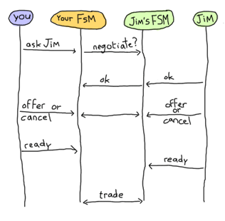
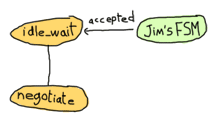
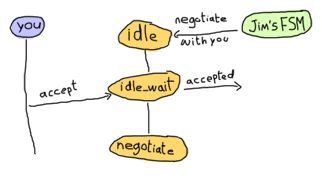
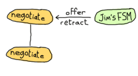

# Rage Against The Finite-State Machines

## [What Are They?]

A finite-state machine (FSM) is not really a machine, but it does have a finite number of states. I've always found finite-state machines easier to understand with graphs and diagrams. For example, the following would be a simplistic diagram for a (very dumb) dog as a state machine:


Here the dog has 3 states: sitting, barking or wagging its tail. Different events or inputs may force it to change its state. If a dog is calmly sitting and sees a squirrel, it will start barking and won't stop until you pet it again. However, if the dog is sitting and you pet it, we have no idea what might happen. In the Erlang world, the dog could crash (and eventually be restarted by its supervisor). In the real world that would be a freaky event, but your dog would come back after being ran over by a car, so it's not all bad.

Here's a cat's state diagram for a comparison:


This cat has a single state, and no event can ever change it.

Implementing the [cat state machine](static/erlang/cat_fsm.erl.html) in Erlang is a fun and simple task:

```erl
-module(cat_fsm).
-export([start/0, event/2]).

start() ->
    spawn(fun() -> dont_give_crap() end).

event(Pid, Event) ->
    Ref = make_ref(), % won't care for monitors here
    Pid ! ,
    receive
        
    after 5000 ->
        
    end.

dont_give_crap() ->
    receive
        ;
        _ -> ok
    end,
    io:format("Switching to 'dont_give_crap' state~n"),
    dont_give_crap().
```

We can try the module to see that the cat really never gives a crap:

```eshell
1> c(cat_fsm).

2> Cat = cat_fsm:start().
<0.67.0>
3> cat_fsm:event(Cat, pet).
Switching to 'dont_give_crap' state

4> cat_fsm:event(Cat, love).
Switching to 'dont_give_crap' state

5> cat_fsm:event(Cat, cherish).
Switching to 'dont_give_crap' state

```

The same can be done for the [dog FSM](static/erlang/dog_fsm.erl.html), except more states are available:

```erl
-module(dog_fsm).
-export([start/0, squirrel/1, pet/1]).

start() ->
    spawn(fun() -> bark() end).

squirrel(Pid) -> Pid ! squirrel.

pet(Pid) -> Pid ! pet.

bark() ->
    io:format("Dog says: BARK! BARK!~n"),
    receive
        pet ->
            wag_tail();
        _ ->
            io:format("Dog is confused~n"),
            bark()
    after 2000 ->
        bark()
    end.

wag_tail() ->
    io:format("Dog wags its tail~n"),
    receive
        pet ->
            sit();
        _ ->
            io:format("Dog is confused~n"),
            wag_tail()
    after 30000 ->
        bark()
    end.

sit() ->
    io:format("Dog is sitting. Gooooood boy!~n"),
    receive
        squirrel ->
            bark();
        _ ->
            io:format("Dog is confused~n"),
            sit()
    end.
```

It should be relatively simple to match each of the states and transitions to what was on the diagram above. Here's the FSM in use:

```eshell
6> c(dog_fsm).

7> Pid = dog_fsm:start().
Dog says: BARK! BARK!
<0.46.0>
Dog says: BARK! BARK!
Dog says: BARK! BARK!
Dog says: BARK! BARK!
8> dog_fsm:pet(Pid).
pet
Dog wags its tail
9> dog_fsm:pet(Pid).
Dog is sitting. Gooooood boy!
pet
10> dog_fsm:pet(Pid).
Dog is confused
pet
Dog is sitting. Gooooood boy!
11> dog_fsm:squirrel(Pid).
Dog says: BARK! BARK!
squirrel
Dog says: BARK! BARK!    
12> dog_fsm:pet(Pid).
Dog wags its tail
pet
13> %% wait 30 seconds
Dog says: BARK! BARK!
Dog says: BARK! BARK!
Dog says: BARK! BARK!     
13> dog_fsm:pet(Pid).     
Dog wags its tail
pet
14> dog_fsm:pet(Pid).
Dog is sitting. Gooooood boy!
pet
```

You can follow along with the schema if you want (I usually do, it helps being sure that nothing's wrong).

That's really the core of FSMs implemented as Erlang processes. There are things that could have been done differently: we could have passed state in the arguments of the state functions in a way similar to what we do with servers' main loop. We could also have added an `init` and `terminate` functions, handled code updates, etc.

Another difference between the dog and cat FSMs is that the cat's events are *synchronous* and the dog's events are *asynchronous*. In a real FSM, both could be used in a mixed manner, but I went for the simplest representation out of pure untapped laziness. There are other forms of event the examples do not show: global events that can happen in any state.

One example of such an event could be when the dog gets a sniff of food. Once the `smell food` event is triggered, no matter what state the dog is in, he'd go looking for the source of food.

Now we won't spend too much time implementing all of this in our 'written-on-a-napkin' FSM. Instead we'll move directly to the `gen_fsm` behaviour.

## [Generic Finite-State Machines]

The `gen_fsm` behaviour is somewhat similar to `gen_server` in that it is a specialised version of it. The biggest difference is that rather than handling *calls* and *casts*, we're handling *synchronous* and *asynchronous* *events*. Much like our dog and cat examples, each state is represented by a function. Again, we'll go through the callbacks our modules need to implement in order to work.

### init

This is the same [init/1](http://erldocs.com/18.0/stdlib/gen_fsm.html#init/1) keep the same semantics.

What's new here is that `StateName` is an atom and represents the next callback function to be called.


### StateName

The functions [StateName/2](http://erldocs.com/18.0/stdlib/gen_fsm.html#StateName/2)`. This means the finite state machine will be in a `sitting` state. This is not the same kind of state as we had seen with `gen_server`; it is rather equivalent to the `sit`, `bark` and `wag_tail` states of the previous dog FSM. These states dictate a context in which you handle a given event.

An example of this would be someone calling you on your phone. If you're in the state 'sleeping on a Saturday morning', your reaction might be to yell in the phone. If your state is 'waiting for a job interview', chances are you'll pick the phone and answer politely. On the other hand, if you're in the state 'dead', then I am surprised you can even read this text at all.

Back to our FSM. The `init/1` function said we should be in the `sitting` state. Whenever the `gen_fsm` process receives an event, either the function `sitting/2` or `sitting/3` will be called. The `sitting/2` function is called for asynchronous events and `sitting/3` for synchronous ones.

The arguments for `sitting/2` (or generally `StateName/2`) are `Event``.

The arguments for `sitting/3` are similar, except there is a `From`. The `StateName/3` functions can return the following tuples:

``` expand


```

Note that there's no limit on how many of these functions you can have, as long as they are exported. The atoms returned as `NextStateName` in the tuples will determine whether the function will be called or not.

### handle_event

In the last section, I mentioned global events that would trigger a specific reaction no matter what state we're in (the dog smelling food will drop whatever it is doing and will instead look for food). For these events that should be treated the same way in every state, the [handle_event/3](http://erldocs.com/18.0/stdlib/gen_fsm.html#handle_event/3) variable in between them, telling you what the state was when the event was received. It returns the same values as `StateName/2`.

### handle_sync_event

The [handle_sync_event/4](http://erldocs.com/18.0/stdlib/gen_fsm.html#handle_sync_event/4) callback is to `StateName/3` what `handle_event/2` is to `StateName/2`. It handles synchronous global events, takes the same parameters and returns the same kind of tuples as `StateName/3`.

Now might be a good time to explain how we know whether an event is global or if it's meant to be sent to a specific state. To determine this we can look at the function used to send an event to the FSM. Asynchronous events aimed at any `StateName/2` function are sent with [send_event/2](http://erldocs.com/18.0/stdlib/gen_fsm.html#send_event/2).

The two equivalent functions for global events are [send_all_state_event/2](http://erldocs.com/18.0/stdlib/gen_fsm.html#send_all_state_event/2) (quite a long name).

### code_change

This works exactly the same as it did for `gen_server`s except that it takes an extra state parameter when called like `code_change(OldVersion, StateName, Data, Extra)`, and returns a tuple of the form ``.

### terminate

This should, again, act a bit like what we have for generic servers. [terminate/3](http://erldocs.com/18.0/stdlib/gen_fsm.html#terminate/3) should do the opposite of `init/1`.

## [A Trading System Specification]

It's time to put all of this in practice. Many Erlang tutorials about finite-state machines use examples containing telephone switches and similar things. It's my guess that most programmers will rarely have to deal with telephone switches for state machines. Because of that, we're going to look at an example which is more fitting for many developers: we'll design and implement an item trading system for some fictional and non-existing video game.

The design I have picked is somewhat challenging. Rather than using a broker through which players route items and confirmations (which, frankly, would be easier), we're going to implement a server where both players speak to each other directly (which would have the advantage of being distributable).

Because the implementation is tricky, I'll spend a good while describing it, the kind of problems to be faced and the ways to fix them.

First of all, we should define the actions that can be done by our players when trading. The first is asking for a trade to be set up. The other user should also be able to accept that trade. We won't give them the right to deny a trade, though, because we want to keep things simple. It will be easy to add this feature once the whole thing is done.

Once the trade is set up, our users should be able to negotiate with each other. This means they should be able to make offers and then retract them if they want. When both players are satisfied with the offer, they can each declare themselves as ready to finalise the trade. The data should then be saved somewhere on both sides. At any point in time, it should also make sense for any of the players to cancel the whole trade. Some [pleb] could be offering only items deemed unworthy to the other party (who might be very busy) and so it should be possible to backhand them with a well-deserved cancellation.

In short, the following actions should be possible:

-   ask for a trade
-   accept a trade
-   offer items
-   retract an offer
-   declare self as ready
-   brutally cancel the trade

Now, when each of these actions is taken, the other player's FSM should be made aware of it. This makes sense, because when Jim tells his FSM to send an item to Carl, Carl's FSM has to be made aware of it. This means both players can talk to their own FSM, which will talk to the other's FSM. This gives us something a bit like this:


The first thing to notice when we have two identical processes communicating with each other is that we have to avoid synchronous calls as much as possible. The reason for this is that if Jim's FSM sends a message to Carl's FSM and then waits for its reply while at the same time Carl's FSM sends a message over to Jim's FSM and waits for its own specific reply, both end up waiting for the other without ever replying. This effectively freezes both FSMs. We have a deadlock.

One solution to this is to wait for a timeout and then move on, but then there will be leftover messages in both processes' mailboxes and the protocol will be messed up. This certainly is a can of worms, and so we want to avoid it.

The simplest way to do it is to avoid all synchronous messages and go fully asynchronous. Note that Jim might still make a synchronous call to his own FSM; there's no risk here because the FSM won't need to call Jim and so no deadlock can occur between them.

When two of these FSMs communicate together, the whole exchange might look a bit like this:



Both FSMs are in an idle state. When you ask Jim to trade, Jim has to accept before things move on. Then both of you can offer items or withdraw them. When you are both declaring yourself ready, the trade can take place. This is a simplified version of all that can happen and we'll see all possible cases with more detail in the next paragraphs.

Here comes the tough part: defining the state diagram and how state transitions happen. Usually a good bit of thinking goes into this, because you have to think of all the small things that could go wrong. Some things might go wrong even after having reviewed it many times. Because of this, I'll simply put the one I decided to implement here and then explain it.


At first, both finite-state machines start in the `idle` state. At this point, one thing we can do is ask some other player to negotiate with us:


We go into `idle_wait` mode in order to wait for an eventual reply after our FSM forwarded the demand. Once the other FSM sends the reply, ours can switch to `negotiate`:



The other player should also be in `negotiate` state after this. Obviously, if we can invite the other, the other can invite us. If all goes well, this should end up looking like this:



So this is pretty much the opposite as the two previous state diagrams bundled into one. Note that we expect the player to accept the offer in this case. What happens if by pure luck, we ask the other player to trade with us at the same time he asks us to trade?


What happens here is that both clients ask their own FSM to negotiate with the other one. As soon as the *ask negotiate* messages are sent, both FSMs switch to `idle_wait` state. Then they will be able to process the negotiation question. If we review the previous state diagrams, we see that this combination of events is the only time we'll receive *ask negotiate* messages while in the `idle_wait` state. Consequently, we know that getting these messages in `idle_wait` means that we hit the race condition and can assume both users want to talk to each other. We can move both of them to `negotiate` state. Hooray.

So now we're negotiating. According to the list of actions I listed earlier, we must support users offering items and then retracting the offer:


All this does is forward our client's message to the other FSM. Both finite-state machines will need to hold a list of items offered by either player, so they can update that list when receiving such messages. We stay in the `negotiate` state after this; maybe the other player wants to offer items too:



Here, our FSM basically acts in a similar manner. This is normal. Once we get tired of offering things and think we're generous enough, we have to say we're ready to officialise the trade. Because we have to synchronise both players, we'll have to use an intermediary state, as we did for `idle` and `idle_wait`:


What we do here is that as soon as our player is ready, our FSM asks Jim's FSM if he's ready. Pending its reply, our own FSM falls into its `wait` state. The reply we'll get will depend on Jim's FSM state: if it's in `wait` state, it'll tell us that it's ready. Otherwise, it'll tell us that it's not ready yet. That's precisely what our FSM automatically replies to Jim if he asks us if we are ready when in `negotiate` state:


Our finite state machine will remain in `negotiate` mode until our player says he's ready. Let's assume he did and we're now in the `wait` state. However, Jim's not there yet. This means that when we declared ourselves as ready, we'll have asked Jim if he was also ready and his FSM will have replied 'not yet':


He's not ready, but we are. We can't do much but keep waiting. While waiting after Jim, who's still negotiating by the way, it is possible that he will try to send us more items or maybe cancel his previous offers:


Of course, we want to avoid Jim removing all of his items and then clicking \"I'm ready!\", screwing us over in the process. As soon as he changes the items offered, we go back into the `negotiate` state so we can either modify our own offer, or examine the current one and decide we're ready. Rinse and repeat.

At some point, Jim will be ready to finalise the trade too. When this happens, his finite-state machine will ask ours if we are ready:


What our FSM does is reply that we indeed are ready. We stay in the waiting state and refuse to move to the `ready` state though. Why is this? Because there's a potential race condition! Imagine that the following sequence of events takes place, without doing this necessary step:

![You send 'ready' to your FSM while in negotiate at the same time the other player makes an offer (also in negotiate state). Your FSM turns to 'wait'. The other player declares himself ready slightly before your 'are you ready?' message is sent. At the same time as your FSM goes to 'wait', it receives the other player's offer and switches back to 'negotiate' state. Meanwhile, the other player (now in 'wait') receives your 'are you ready?' message and assumes it's a race condition. It automatically switches to 'ready'. Your FSM then receives the other's 'are you ready?' message, replies 'not yet', which is caught by the other player's FSM in 'ready' state. Nothing can happen from now on](../img/fsm_race_wait.png)

This is a bit complex, so I'll explain. Because of the way messages are received, we could possibly only process the item offer *after* we declared ourselves ready and also *after* Jim declared himself as ready. This means that as soon as we read the offer message, we switch back to `negotiate` state. During that time, Jim will have told us he is ready. If he were to change states right there and move on to `ready` (as illustrated above), he'd be caught waiting indefinitely while we wouldn't know what the hell to do. This could also happen the other way around! Ugh.

One way to solve this is by adding one layer of indirection (Thanks to [David Wheeler](http://en.wikipedia.org/wiki/David_Wheeler_(computer_scientist))). This is why we stay in `wait` mode and send 'ready!' (as shown in our previous state diagram). Here's how we deal with that 'ready!' message, assuming we were already in the `ready` state because we told our FSM we were ready beforehand:


When we receive 'ready!' from the other FSM, we send 'ready!' back again. This is to make sure that we won't have the 'double race condition' mentioned above. This will create a superfluous 'ready!' message in one of the two FSMs, but we'll just have to ignore it in this case. We then send an 'ack' message (and the Jim's FSM will do the same) before moving to `ready` state. The reason why this 'ack' message exists is due to some implementation details about synchronising clients. I've put it in the diagram for the sake of being correct, but I won't explain it until later. Forget about it for now. We finally managed to synchronise both players. Whew.

So now there's the `ready` state. This one is a bit special. Both players are ready and have basically given the finite-state machines all the control they need. This lets us implement a bastardized version of a [two-phase commit](http://en.wikipedia.org/wiki/Two-phase_commit) to make sure things go right when making the trade official:


Our version (as described above) will be rather simplistic. Writing a truly correct two-phase commit would require a lot more code than what is necessary for us to understand finite-state machines.

Finally, we only have to allow the trade to be cancelled at any time. This means that somehow, no matter what state we're in, we're going to listen to the 'cancel' message from both sides and quit the transaction. It should also be common courtesy to let the other side know we're gone before leaving.

Alright! It's a whole lot of information to absorb at once. Don't worry if it takes a while to fully grasp it. It took a bunch of people to look over my protocol to see if it was right, and even then we all missed a few race conditions that I then caught a few days later when reviewing the code while writing this text. It's normal to need to read it more than once, especially if you are not used to asynchronous protocols. If this is the case, I fully encourage you to try and design your own protocol. Then ask yourself \"what happens if two people do the same actions very fast? What if they chain two other events quickly? What do I do with messages I don't handle when changing states?\" You'll see that the complexity grows real fast. You might find a solution similar to mine, possibly a better one (let me know if this is the case!) No matter the outcome, it's a very interesting thing to work on and our FSMs are still relatively simple.

Once you've digested all of this (or before, if you're a rebel reader), you can go to the next section, where we implement the gaming system. For now you can take a nice coffee break if you feel like doing so.


## [Game trading between two players]

The first thing that needs to be done to implement our protocol with OTP's `gen_fsm` is to create the interface. There will be 3 callers for our module: the player, the `gen_fsm` behaviour and the other player's FSM. We will only need to export the player function and `gen_fsm` functions, though. This is because the other FSM will also run within the [trade_fsm](static/erlang/trade_fsm.erl.html) module and can access them from the inside:

```erl
-module(trade_fsm).
-behaviour(gen_fsm).

%% public API
-export([start/1, start_link/1, trade/2, accept_trade/1, 
         make_offer/2, retract_offer/2, ready/1, cancel/1]).
%% gen_fsm callbacks
-export([init/1, handle_event/3, handle_sync_event/4, handle_info/3,
         terminate/3, code_change/4,
         % custom state names
         idle/2, idle/3, idle_wait/2, idle_wait/3, negotiate/2,
         negotiate/3, wait/2, ready/2, ready/3]).
```

So that's our API. You can see I'm planning on having some functions being both synchronous and asynchronous. This is mostly because we want our client to call us synchronously in some cases, but the other FSM can do it asynchronously. Having the client synchronous simplifies our logic a whole lot by limiting the number of contradicting messages that can be sent one after the other. We'll get there. Let's first implement the actual public API according to the protocol defined above:

```erl
%%% PUBLIC API
start(Name) ->
    gen_fsm:start(?MODULE, [Name], []).

start_link(Name) ->
    gen_fsm:start_link(?MODULE, [Name], []).

%% ask for a begin session. Returns when/if the other accepts
trade(OwnPid, OtherPid) ->
    gen_fsm:sync_send_event(OwnPid, , 30000).

%% Accept someone's trade offer.
accept_trade(OwnPid) ->
    gen_fsm:sync_send_event(OwnPid, accept_negotiate).

%% Send an item on the table to be traded
make_offer(OwnPid, Item) ->
    gen_fsm:send_event(OwnPid, ).

%% Cancel trade offer
retract_offer(OwnPid, Item) ->
    gen_fsm:send_event(OwnPid, ).

%% Mention that you're ready for a trade. When the other
%% player also declares being ready, the trade is done
ready(OwnPid) ->
    gen_fsm:sync_send_event(OwnPid, ready, infinity).

%% Cancel the transaction.
cancel(OwnPid) ->
    gen_fsm:sync_send_all_state_event(OwnPid, cancel).
```

This is rather standard; all these 'gen_fsm' functions have been covered before (except [start/3-4](http://erldocs.com/18.0/stdlib/gen_fsm.html#start/3) which I believe you can figure out) in this chapter.

Next we'll implement the FSM to FSM functions. The first ones have to do with trade setups, when we first want to ask the other user to join us in a trade:

```erl
%% Ask the other FSM's Pid for a trade session
ask_negotiate(OtherPid, OwnPid) ->
    gen_fsm:send_event(OtherPid, ).

%% Forward the client message accepting the transaction
accept_negotiate(OtherPid, OwnPid) ->
    gen_fsm:send_event(OtherPid, ).
```

The first function asks the other pid if they want to trade, and the second one is used to reply to it (asynchronously, of course).

We can then write the functions to offer and cancel offers. According to our protocol above, this is what they should be like:

```erl
%% forward a client's offer
do_offer(OtherPid, Item) ->
    gen_fsm:send_event(OtherPid, ).

%% forward a client's offer cancellation
undo_offer(OtherPid, Item) ->
    gen_fsm:send_event(OtherPid, ).
```

So, now that we've got these calls done, we need to focus on the rest. The remaining calls relate to being ready or not and handling the final commit. Again, given our protocol above, we have three calls: `are_you_ready`, which can have the replies `not_yet` or `ready!`:

```erl
%% Ask the other side if he's ready to trade.
are_you_ready(OtherPid) ->
    gen_fsm:send_event(OtherPid, are_you_ready).

%% Reply that the side is not ready to trade
%% i.e. is not in 'wait' state.
not_yet(OtherPid) ->
    gen_fsm:send_event(OtherPid, not_yet).

%% Tells the other fsm that the user is currently waiting
%% for the ready state. State should transition to 'ready'
am_ready(OtherPid) ->
    gen_fsm:send_event(OtherPid, 'ready!').
```

The only functions left are those which are to be used by both FSMs when doing the commit in the `ready` state. Their precise usage will be described more in detail later, but for now, the names and the sequence/state diagram from earlier should be enough. Nonetheless, you can still transcribe them to your own version of [trade_fsm](static/erlang/trade_fsm.erl.html):

```erl
%% Acknowledge that the fsm is in a ready state.
ack_trans(OtherPid) ->
    gen_fsm:send_event(OtherPid, ack).

%% ask if ready to commit
ask_commit(OtherPid) ->
    gen_fsm:sync_send_event(OtherPid, ask_commit).

%% begin the synchronous commit
do_commit(OtherPid) ->
    gen_fsm:sync_send_event(OtherPid, do_commit).
```

Oh and there's also the courtesy function allowing us to warn the other FSM we cancelled the trade:

```erl
notify_cancel(OtherPid) ->
    gen_fsm:send_all_state_event(OtherPid, cancel).
```

We can now move to the really interesting part: the `gen_fsm` callbacks. The first callback is `init/1`. In our case, we'll want each FSM to hold a name for the user it represents (that way, our output will be nicer) in the data it keeps passing on to itself. What else do we want to hold in memory? In our case, we want the other's pid, the items we offer and the items the other offers. We're also going to add the reference of a monitor (so we know to abort if the other dies) and a `from` field, used to do delayed replies:

```erl
-record(state, {name="",
                other,
                ownitems=[],
                otheritems=[],
                monitor,
                from}).
```

In the case of `init/1`, we'll only care about our name for now. Note that we'll begin in the `idle` state:

```erl
init(Name) ->
    . 
```

The next callbacks to consider would be the states themselves. So far I've described the state transitions and calls that can be made, but We'll need a way to make sure everything goes alright. We'll write a few utility functions first:

```erl
%% Send players a notice. This could be messages to their clients
%% but for our purposes, outputting to the shell is enough.
notice(#state, Str, Args) ->
    io:format("~s: "++Str++"~n", [N|Args]).

%% Unexpected allows to log unexpected messages
unexpected(Msg, State) ->
    io:format("~p received unknown event ~p while in state ~p~n",
              [self(), Msg, State]).
```

And we can start with the idle state. For the sake of convention, I'll cover the asynchronous version first. This one shouldn't need to care for anything but the other player asking for a trade given our own player, if you look at the API functions, will use a synchronous call:

```erl
idle() ->
    Ref = monitor(process, OtherPid),
    notice(S, "~p asked for a trade negotiation", [OtherPid]),
    ;
idle(Event, Data) ->
    unexpected(Event, idle),
    .
```


A monitor is set up to allow us to handle the other dying, and its ref is stored in the FSM's data along with the other's pid, before moving to the `idle_wait` state. Note that we will report all unexpected events and ignore them by staying in the state we were already in. We can have a few out of band messages here and there that could be the result of race conditions. It's usually safe to ignore them, but we can't easily get rid of them. It's just better not to crash the whole FSM on these unknown, but somewhat expected messages.

When our own client asks the FSM to contact another player for a trade, it will send a synchronous event. The `idle/3` callback will be needed:

```erl
idle() ->
    ask_negotiate(OtherPid, self()),
    notice(S, "asking user ~p for a trade", [OtherPid]),
    Ref = monitor(process, OtherPid),
    ;
idle(Event, _From, Data) ->
    unexpected(Event, idle),
    .
```

We proceed in a way similar to the asynchronous version, except we need to actually ask the other side whether they want to negotiate with us or not. You'll notice that we do *not* reply to the client yet. This is because we have nothing interesting to say, and we want the client locked and waiting for the trade to be accepted before doing anything. The reply will only be sent if the other side accepts once we're in `idle_wait`.

When we're there, we have to deal with the other accepting to negotiate and the other asking to negotiate (the result of a race condition, as described in the protocol):

```erl
idle_wait() ->
    gen_fsm:reply(S#state.from, ok),
    notice(S, "starting negotiation", []),
    ;
%% The other side has accepted our offer. Move to negotiate state
idle_wait() ->
    gen_fsm:reply(S#state.from, ok),
    notice(S, "starting negotiation", []),
    ;
idle_wait(Event, Data) ->
    unexpected(Event, idle_wait),
    .
```

This gives us two transitions to the `negotiate` state, but remember that we must use `gen_fsm:reply/2` reply to our client to tell it it's okay to start offering items. There's also the case of our FSM's client accepting the trade suggested by the other party:

```erl
idle_wait(accept_negotiate, _From, S=#state) ->
    accept_negotiate(OtherPid, self()),
    notice(S, "accepting negotiation", []),
    ;
idle_wait(Event, _From, Data) ->
    unexpected(Event, idle_wait),
    .
```

Again, this one moves on to the `negotiate` state. Here, we must handle asynchronous queries to add and remove items coming both from the client and the other FSM. However, we have not yet decided how to store items. Because I'm somewhat lazy and I assume users won't trade that many items, simple lists will do it for now. However, we might change our mind at a later point, so it would be a good idea to wrap item operations in their own functions. Add the following functions at the bottom of the file with `notice/3` and `unexpected/2`:

```erl
%% adds an item to an item list
add(Item, Items) ->
    [Item | Items].

%% remove an item from an item list
remove(Item, Items) ->
    Items -- [Item].
```

Simple, but they have the role of isolating the actions (adding and removing items) from their implementation (using lists). We could easily move to proplists, arrays or whatever data structure without disrupting the rest of the code.

Using both of these functions, we can implement offering and removing items:

```erl
negotiate() ->
    do_offer(S#state.other, Item),
    notice(S, "offering ~p", [Item]),
    ;
%% Own side retracting an item offer
negotiate() ->
    undo_offer(S#state.other, Item),
    notice(S, "cancelling offer on ~p", [Item]),
    ;
%% other side offering an item
negotiate() ->
    notice(S, "other player offering ~p", [Item]),
    ;
%% other side retracting an item offer
negotiate() ->
    notice(S, "Other player cancelling offer on ~p", [Item]),
    ;
```

This is an ugly aspect of using asynchronous messages on both sides. One set of message has the form 'make' and 'retract', while the other has 'do' and 'undo'. This is entirely arbitrary and only used to differentiate between player-to-FSM communications and FSM-to-FSM communications. Note that on those coming from our own player, we have to tell the other side about the changes we're making.

Another responsibility is to handle the `are_you_ready` message we mentioned in the protocol. This one is the last asynchronous event to handle in the `negotiate` state:

```erl
negotiate(are_you_ready, S=#state) ->
    io:format("Other user ready to trade.~n"),
    notice(S,
           "Other user ready to transfer goods:~n"
           "You get ~p, The other side gets ~p",
           [S#state.otheritems, S#state.ownitems]),
    not_yet(OtherPid),
    ;
negotiate(Event, Data) ->
    unexpected(Event, negotiate),
    .
```

As described in the protocol, whenever we're not in the `wait` state and receive this message, we must reply with `not_yet`. Were also outputting trade details to the user so a decision can be made.

When such a decision is made and the user is ready, the `ready` event will be sent. This one should be synchronous because we don't want the user to keep modifying his offer by adding items while claiming he's ready:

```erl
negotiate(ready, From, S = #state) ->
    are_you_ready(OtherPid),
    notice(S, "asking if ready, waiting", []),
    ;
negotiate(Event, _From, S) ->
    unexpected(Event, negotiate),
    .
```

At this point a transition to the `wait` state should be made. Note that just waiting for the other is not interesting. We save the `From` variable so we can use it with `gen_fsm:reply/2` when we have something to tell to the client.

The `wait` state is a funny beast. New items might be offered and retracted because the other user might not be ready. It makes sense, then, to automatically rollback to the negotiating state. It would suck to have great items offered to us, only for the other to remove them and declare himself ready, stealing our loot. Going back to negotiation is a good decision:

```erl
wait() ->
    gen_fsm:reply(S#state.from, offer_changed),
    notice(S, "other side offering ~p", [Item]),
    ;
wait() ->
    gen_fsm:reply(S#state.from, offer_changed),
    notice(S, "Other side cancelling offer of ~p", [Item]),
    ;
```

Now that's something meaningful and we reply to the player with the coordinates we stored in `S#state.from` The next set of messages we need to worry about are those related to with synchronising both FSMs so they can move to the `ready` state and confirm the trade. For this one we should really focus on the protocol defined earlier.

The three messages we could have are `are_you_ready` (because the other user just declared himself ready), `not_yet` (because we asked the other if he was ready and he was not) and `ready!` (because we asked the other if he was ready and he was).

We'll start with `are_you_ready`. Remember that in the protocol we said that there could be a race condition hidden there. The only thing we can do is send the `ready!` message with `am_ready/1` and deal with the rest later:

```erl
wait(are_you_ready, S=#state) ->
    am_ready(S#state.other),
    notice(S, "asked if ready, and I am. Waiting for same reply", []),
    ;
```

We'll be stuck waiting again, so it's not worth replying to our client yet. Similarly, we won't reply to the client when the other side sends a `not_yet` to our invitation:

```erl
wait(not_yet, S = #state) ->
    notice(S, "Other not ready yet", []),
    ;
```

On the other hand, if the other is ready, we send an extra `ready!` message to the other FSM, reply to our own user and then move to the `ready` state:

```erl
wait('ready!', S=#state) ->
    am_ready(S#state.other),
    ack_trans(S#state.other),
    gen_fsm:reply(S#state.from, ok),
    notice(S, "other side is ready. Moving to ready state", []),
    ;
%% DOn't care about these!
wait(Event, Data) ->
    unexpected(Event, wait),
    .
```

You might have noticed that I've used `ack_trans/1`. In fact, both FSMs should use it. Why is this? To understand this we have to start looking at what goes on in the `ready!` state.


When in the ready state, both players' actions become useless (except cancelling). We won't care about new item offers. This gives us some liberty. Basically, both FSMs can freely talk to each other without worrying about the rest of the world. This lets us implement our bastardization of a two-phase commit. To begin this commit without either player acting, we'll need an event to trigger an action from the FSMs. The `ack` event from `ack_trans/1` is used for that. As soon as we're in the ready state, the message is treated and acted upon; the transaction can begin.

Two-phase commits require synchronous communications, though. This means we can't have both FSMs starting the transaction at once, because they'll end up deadlocked. The secret is to find a way to decide that one finite state machine should initiate the commit, while the other will sit and wait for orders from the first one.

It turns out that the engineers and computer scientists who designed Erlang were pretty smart (well, we knew that already). The pids of any process can be compared to each other and sorted. This can be done no matter when the process was spawned, whether it's still alive or not, or if it comes from another VM (we'll see more about this when we get into distributed Erlang).

Knowing that two pids can be compared and one will be greater than the other, we can write a function `priority/2` that will take two pids and tell a process whether it's been elected or not:

```erl
priority(OwnPid, OtherPid) when OwnPid > OtherPid -> true;
priority(OwnPid, OtherPid) when OwnPid < OtherPid -> false.
```

And by calling that function, we can have one process starting the commit and the other following the orders.

Here's what this gives us when included in the `ready` state, after receiving the `ack` message:

```erl
ready(ack, S=#state) ->
    case priority(self(), S#state.other) of
        true ->
            try 
                notice(S, "asking for commit", []),
                ready_commit = ask_commit(S#state.other),
                notice(S, "ordering commit", []),
                ok = do_commit(S#state.other),
                notice(S, "committing...", []),
                commit(S),
                
            catch Class:Reason -> 
                %% abort! Either ready_commit or do_commit failed
                notice(S, "commit failed", []),
                
            end;
        false ->
            
    end;
ready(Event, Data) ->
    unexpected(Event, ready),
    .
```

This big `try ... catch` expression is the leading FSM deciding how the commit works. Both `ask_commit/1` and `do_commit/1` are synchronous. This lets the leading FSM call them freely. You can see that the other FSM just goes and wait. It will then receive the orders from the leading process. The first message should be `ask_commit`. This is just to make sure both FSMs are still there; nothing wrong happened, they're both dedicated to completing the task:

```erl
ready(ask_commit, _From, S) ->
    notice(S, "replying to ask_commit", []),
    ;
```

Once this is received, the leading process will ask to confirm the transaction with `do_commit`. That's when we must commit our data:

```erl
ready(do_commit, _From, S) ->
    notice(S, "committing...", []),
    commit(S),
    ;
ready(Event, _From, Data) ->
    unexpected(Event, ready),
    .
```

And once it's done, we leave. The leading FSM will receive `ok` as a reply and will know to commit on its own end afterwards. This explains why we need the big `try ... catch`: if the replying FSM dies or its player cancels the transaction, the synchronous calls will crash after a timeout. The commit should be aborted in this case.

Just so you know, I defined the commit function as follows:

```erl
commit(S = #state) ->
    io:format("Transaction completed for ~s. "
              "Items sent are:~n~p,~n received are:~n~p.~n"
              "This operation should have some atomic save "
              "in a database.~n",
              [S#state.name, S#state.ownitems, S#state.otheritems]).
```

Pretty underwhelming, eh? It's generally not possible to do a true safe commit with only two participants---a third party is usually required to judge if both players did everything right. If you were to write a true commit function, it should contact that third party on behalf of both players, and then do the safe write to a database for them or rollback the whole exchange. We won't go into such details and the current `commit/1` function will be enough for the needs of this book.

We're not done yet. We have not yet covered two types of events: a player cancelling the trade and the other player's finite state machine crashing. The former can be dealt with by using the callbacks `handle_event/3` and `handle_sync_event/4`. Whenever the other user cancels, we'll receive an asynchronous notification:

```erl
%% The other player has sent this cancel event
%% stop whatever we're doing and shut down!
handle_event(cancel, _StateName, S=#state) ->
    notice(S, "received cancel event", []),
    ;
handle_event(Event, StateName, Data) ->
    unexpected(Event, StateName),
    .
```

When we do it we must not forget to tell the other before quitting ourselves:

```erl
%% This cancel event comes from the client. We must warn the other
%% player that we have a quitter!
handle_sync_event(cancel, _From, _StateName, S = #state) ->
    notify_cancel(S#state.other),
    notice(S, "cancelling trade, sending cancel event", []),
    ;
%% Note: DO NOT reply to unexpected calls. Let the call-maker crash!
handle_sync_event(Event, _From, StateName, Data) ->
    unexpected(Event, StateName),
    .
```

And voilà! The last event to take care of is when the other FSM goes down. Fortunately, we had set a monitor back in the `idle` state. We can match on this and react accordingly:

```erl
handle_info() ->
    notice(S, "Other side dead", []),
    ;
handle_info(Info, StateName, Data) ->
    unexpected(Info, StateName),
    .
```

Note that even if the `cancel` or `DOWN` events happen while we're in the commit, everything should be safe and nobody should get its items stolen.

::: note
**Note:** we used `io:format/2` for most of our messages to let the FSMs communicate with their own clients. In a real world application, we might want something more flexible than that. One way to do it is to let the client send in a Pid, which will receive the notices sent to it. That process could be linked to a GUI or any other system to make the player aware of the events. The `io:format/2` solution was chosen for its simplicity: we want to focus on the FSM and the asynchronous protocols, not the rest.
:::

Only two callbacks left to cover! They're `code_change/4` and `terminate/3`. For now, we don't have anything to do with `code_change/4` and only export it so the next version of the FSM can call it when it'll be reloaded. Our terminate function is also really short because we didn't handle real resources in this example:

```erl
code_change(_OldVsn, StateName, Data, _Extra) ->
 .

%% Transaction completed.
terminate(normal, ready, S=#state) ->
    notice(S, "FSM leaving.", []);
terminate(_Reason, _StateName, _StateData) ->
    ok.
```

Whew.

We can now try it. Well, trying it is a bit annoying because we need two processes to communicate to each other. To solve this, I've written the tests in the file [trade_calls.erl](static/erlang/trade_calls.erl.html), which can run 3 different scenarios. The first one is `main_ab/0`. It will run a standard trade and output everything. The second one is `main_cd/0` and will cancel the transaction halfway through. The last one is `main_ef/0` and is very similar to `main_ab/0`, except it contains a different race condition. The first and third tests should succeed, while the second one should fail (with a crapload of error messages, but that's how it goes). You can try it if you feel like it.

## [That Was Quite Something]


If you've found this chapter a bit harder than the others, I must remind you that it's entirely normal. I've just gone crazy and decided to make something hard out of the generic finite-state machine behaviour. If you feel confused, ask yourself these questions: Can you understand how different events are handled depending on the state your process is in? Do you understand how you can transition from one state to the other? Do you know when to use `send_event/2` and `sync_send_event/2-3` as opposed to `send_all_state_event/2` and `sync_send_all_state_event/3`? If you answered yes to these questions, you understand what `gen_fsm` is about.

The rest of it with the asynchronous protocols, delaying replies and carrying the `From` variable, giving a priority to processes for synchronous calls, bastardized two-phase commits and whatnot *are not essential to understand*. They're mostly there to show what can be done and to highlight the difficulty of writing truly concurrent software, even in a language like Erlang. Erlang doesn't excuse you from planning or thinking, and Erlang won't solve your problems for you. It'll only give you tools.

That being said, if you understood everything about these points, you can be proud of yourself (especially if you had never written concurrent software before). You are now starting to really think concurrently.

## [Fit for the Real World?]

In a real game, there is a lot more stuff going on that could make trading even more complex. Items could be worn by the characters and damaged by enemies while they're being traded. Maybe items could be moved in and out of the inventory while being exchanged. Are the players on the same server? If not, how do you synchronise commits to different databases?

Our trade system is sane when detached from the reality of any game. Before trying to fit it in a game (if you dare), make sure everything goes right. Test it, test it, and test it again. You'll likely find that testing concurrent and parallel code is a complete pain. You'll lose hair, friends and a piece of your sanity. Even after this, you'll have to know your system is always as strong as its weakest link and thus potentially very fragile nonetheless.

::: 
**Don't Drink Too Much Kool-Aid:**\
While the model for this trade system seems sound, subtle concurrency bugs and race conditions can often rear their ugly heads a long time after they were written, and even if they've been running for years. While my code is generally bullet proof (yeah, right), you sometimes have to face swords and knives. Beware the dormant bugs.
:::

Fortunately, we can put all of this madness behind us. We'll next see how OTP allows you to handle various events, such as alarms and logs, with the help of the `gen_event` behaviour.
