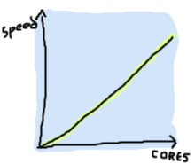

# Introduction

## [About this tutorial]

This is the beginning of Learn You Some Erlang for Great Good! Reading this tutorial should be one of your first steps in learning Erlang, so let's talk about it a bit.


First of all, I began growing the idea of writing this after reading Miran Lipovača's [Learn You a Haskell for great Good! (LYAH)](http://learnyouahaskell.com/ "Free Book!") tutorial; I thought he did a great job making the language attractive and the learning experience friendly. As I already knew him, I asked him how he felt about me writing an Erlang version of his book. He liked the idea, being somewhat interested in Erlang.

So here I am typing this. Of course there were other sources to my motivation: I mainly find the entry to the language to be hard (the web has sparse documentation and otherwise you need to buy books), and I thought the community would benefit from a LYAH-like guide. Less importantly, I've seen people attributing Erlang too much or not enough merit sometimes based on sweeping generalizations. Then there are people who sure as hell believe Erlang is nothing but hype. If I'd like to convince them otherwise, I know they're not likely to read this in the first place.

This book thus wants itself to be a way to learn Erlang for people who have basic knowledge of programming in imperative languages (such as C/C++, Java, Python, Ruby, etc) and may or may not know functional programming (Haskell, Scala, Erlang, Clojure, OCaml\...). I also want to write this book in a honest manner, selling Erlang for what it is, acknowledging its weaknesses and strengths.

## [So what's Erlang?]

First of all, Erlang is a functional programming language. If you have ever worked with imperative languages, statements such as `i++` may be normal to you; in functional programming they are not allowed. In fact, changing the value of any variable is strictly forbidden! This may sound weird at first, but if you remember your math classes, it's in fact how you've learned it:

```eshell
y = 2
x = y + 3
x = 2 + 3
x = 5
```

Had I added the following:

```eshell
x = 5 + 1
x = x
∴ 5 = 6
```

You would have been very confused. Functional programming recognizes this: If I say `x` is 5, then I can't logically claim it is also 6! This would be dishonest. This is also why a function with the same parameter should always return the same result:

```eshell
x = add_two_to(3) = 5
∴ x = 5
```

Functions always returning the same result for the same parameter is called referential transparency. It's what lets us replace `add_two_to(3)` with 5, as the result of `3+2` will always be 5. That means we can then glue dozens of functions together in order to resolve more complex problems while being sure nothing will break. Logical and clean isn't it? There's a problem though:

```eshell
x = today() = 2009/10/22
  -- wait a day --
x = today() = 2009/10/23
x = x
∴ 2009/10/22 = 2009/10/23
```

Oh no! My beautiful equations! They suddenly all turned wrong! How come my function returns a different result every day?

Obviously, there are some cases where it's useful to break referential transparency. Erlang has this very pragmatic approach with functional programming: obey its purest principles (referential transparency, avoiding mutable data, etc), but break away from them when real world problems pop up.


Now, we defined Erlang as a functional programming language, but there's also a large emphasis on concurrency and high reliability. To be able to have dozens of tasks being performed at the same time, Erlang uses the [actor model](http://en.wikipedia.org/wiki/Actor_model "A more technical definition"), and each actor is a separate process in the virtual machine. In a nutshell, if you were an actor in Erlang's world, you would be a lonely person, sitting in a dark room with no window, waiting by your mailbox to get a message. Once you get a message, you react to it in a specific way: you pay the bills when receiving them, you respond to Birthday cards with a \"Thank you\" letter and you ignore the letters you can't understand.

Erlang's actor model can be imagined as a world where everyone is sitting alone in their own room and can perform a few distinct tasks. Everyone communicates strictly by writing letters and that's it. While it sounds like a boring life (and a new age for the postal service), it means you can ask many people to perform very specific tasks for you, and none of them will ever do something wrong or make mistakes which will have repercussions on the work of others; they may not even know the existence of people other than you (and that's great).

To escape this analogy, Erlang forces you to write actors (processes) that will share no information with other bits of code unless they pass messages to each other. Every communication is explicit, traceable and safe.

When we defined Erlang, we did so at a language level, but in a broader sense, this is not all there is to it: Erlang is also a development environment as a whole. The code is compiled to bytecode and runs inside a virtual machine. So Erlang, much like Java and kids with ADD, can run anywhere. The standard distribution includes (among others) development tools (compiler, debugger, profiler, test framework), the Open Telecom Platform (OTP) Framework, a web server, a parser generator, and the mnesia database, a key-value storage system able to replicate itself on many servers, supporting nested transactions and letting you store any kind of Erlang data.

The VM and the libraries also allow you to update the code of a running system without interrupting any program, distribute your code with ease on many computers and manage errors and faults in a simple but powerful manner.


We'll see how to use most of these tools and achieve safety later on, but for now, I'll tell you about a related general policy in Erlang: Let it crash. Not like a plane with dozens of passengers dying, but more like a tightrope walker with a safety net under him. While you should avoid making mistakes, you won't need to check for every type or error condition in most cases.

Erlang's ability to recover from errors, organize code with actors and making it scale with distribution and concurrency all sound awesome, which brings us to the next section\...

## [Don't drink too much Kool-Aid]

There may be many little yellowish-orange sections named like this one around the book (you'll recognize them when you see them). Erlang is currently gaining lots of popularity due to zealous talks which may lead people to believe it's more than what it really is. These reminders will be there to help you keep your feet on the ground if you're one of these overenthusiastic learners.

The first case of this is related to Erlang's massive scaling abilities due to its lightweight processes. It is true that Erlang processes are very light: you can have hundreds of thousands of them existing at the same time, but this doesn't mean you have to use it that way just because you can. For example, creating a shooter game where everything including bullets is its own actor is madness. The only thing you'll shoot with a game like this is your own foot. There is still a small cost in sending a message from actor to actor, and if you divide tasks too much, *you will make things slower*!

I'll cover this with more depth when we're far enough into the learning to actually worry about it, but just keep in mind that randomly throwing parallelism at a problem is not enough to make it go fast. Don't be sad; there are times when using hundreds of processes will both be possible and useful! It's just not happening all the time.

Erlang is also said to be able to scale in a directly proportional manner to how many cores your computer has, but this is usually not true: 
it is possible, but most problems do not behave in a way that lets you just run everything at the same time.

There's something else to keep in mind: while Erlang does some things very well, it's technically still possible to get the same results from other languages. The opposite is also true; evaluate each problem as it needs to be, and choose the right tool according to the problem being addressed. Erlang is no silver bullet and will be particularly bad at things like image and signal processing, operating system device drivers, etc. and will shine at things like large software for server use (i.e.: queues, map-reduce), doing some lifting coupled with other languages, higher-level protocol implementation, etc. Areas in the middle will depend on you. You should not necessarily wall yourself in server software with Erlang: there have been cases of people doing unexpected and surprising things. One example is IANO, a robot created by the UNICT team, which uses Erlang for its artificial intelligence and won the silver medal at the 2009 [eurobot competition](http://eurobot.dmi.unict.it/). Another example is Wings 3D, an open source 3D modeler (but not a renderer) written in Erlang and thus cross-platform.

## [What you need to dive in]

All you need to get started is a text editor and the Erlang environment. You can get the source code and the Windows binaries from [the official Erlang website](http://erlang.org/download.html "official Erlang download page") system variable to be able to access it from the command line.

On Debian-based Linux distributions, you should be able to install the package by doing `$ apt-get install erlang`. On Fedora (if you have 'yum' installed), you can achieve the same by typing `# yum install erlang`. However, these repositories often hold outdated versions of the Erlang packages; Using an outdated version could give you some differences with what you'll get from this tutorial and a hit in performance with certain applications. I thus encourage you to compile from source. Consult the README file within the package and Google to get all the installing details you'll need, they'll do a far better job than I ever will.

On FreeBSD, many options are available to you. If you're using portmaster, you can do `portmaster lang/erlang`. For standard ports, it should be `cd /usr/ports/lang/erlang; make install clean`. Finally, if you want to use packages, run `pkg_add -rv erlang`.

If you're on OSX, you can install Erlang with `$ brew install erlang` (with [Homebrew](https://github.com/Homebrew/homebrew).)

Alternatively, Erlang Solutions Ltd. offers [packages for all major OSes](https://www.erlang-solutions.com/resources/download.html), which generally work pretty well (pick a 'Standard' distribution).

::: note
**Note:** at the time of this writing, I'm using Erlang version R13B+, but for best results, you should use newer ones.
:::

## [Where to get Help]

There are a few places where you can get help. If you're using linux, you can access the man pages for good technical documentation. Erlang has a lists module (which we'll soon see): to get the documentation on lists, just type in `$ erl -man lists`.

On Windows, the installation should include HTML documentation. You can download it at any time from the [official erlang site](http://erlang.org/doc/ "Official Erlang HTML documentation").

Good coding practices can be found [here](http://www.erlang.se/doc/programming_rules.shtml) once you feel you need to get everything clean. The code in this book will attempt to follow these guidelines, too.

Now, there are times where just getting the technical details isn't enough. When that happens, I tend to turn to two main sources: the official [mailing list](http://www.erlang.org/static/doc/mailinglist.html).

Oh and if you're the type of person to go for cookbooks and pre-made recipes, [trapexit](http://trapexit.org/ "trapexit, an Erlang community site") is the place you're looking for. They also mirror the mailing lists as a forum and a general wiki, which can always be helpful.
