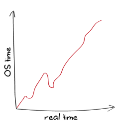
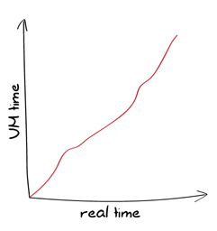
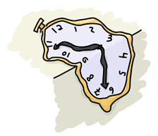

# Postscript: Time Goes On

## [On Time for Time]

Time is a very, very tricky thing. In the physical every day world, we at least have one certainty: time moves forward, and generally at a constant rate. If we start looking at fancypants physics (anything where relativity is involved, so not *that* fancypants), then time starts drifting and shifting around. A clock on a plane goes slower than a clock on the ground, and someone nearing a black hole ages at a different speed from someone orbiting the moon.


Unfortunately for programmers and computer people, there is no need for nifty phenomena like that to be involved for time to go weird; clocks on computers are just not that great. They spring forwards, spring backwards, stall or accelerate, get [leap seconds](https://en.wikipedia.org/wiki/Leap_second) will play around with time corrections but may crash at any time.

There is therefore no need to leave the room for computer time to dilate and ruin your understanding of the world. Even on a single computer, it is possible for time to move in frustrating ways. It's just not very reliable.

In the context of Erlang, we care a lot about time. We want low latencies, and we can specify timeouts and delays in milliseconds on almost every operation out there: sockets, message receiving, event scheduling, and so on. We also want fault tolerance and to be able to write reliable systems. The question is how can we make something solid out of such unreliable things? Erlang takes a somewhat unique approach, and since release 18, it has seen some very interesting evolution.

## [How Things Were]

Before release 18, Erlang time works in one of two major ways:

1.  The operating system's clock, represented as a tuple of the form `` (`os:timestamp()`)
2.  The virtual machine's clock, represented as a tuple of the form `` (`erlang:now()`, auto-imported as `now()`)

The operating system clock can follow any pattern whatsoever:



It can move however the OS feels like moving it.

The VM's clock can only move forward, and can never return the same value twice. This is a property named being *strictly monotonic*:



In order for `now()` to respect such properties, it requires coordinated access by all Erlang processes. Whenever it is called twice in a row at close intervals or while time has gone backwards, the VM will increment microseconds to make sure the same value isn't returned twice. This coordination mechanism (acquiring locks and whatnot) can act as a bottleneck in a busy system.

::: note
**Note:** monotonicity comes in two main flavors: strict and non-strict.

Strict monotonic counters or clocks are guaranteed to return always increasing values (or always decreasing values). The sequence `1, 2, 3, 4, 5` is strictly monotonic.

Regular (non-strict) monotonic counters otherwise only require to return non-decreasing values (or non-increasing values). The sequence `1, 2, 2, 2, 3, 4` is monotonic, but not strictly monotonic.
:::

Now, having time that never goes back is a useful property, but there are many cases when that is not enough. One of them is a common one encountered by people programming Erlang on their home laptop. You're sitting at the computer, running Erlang tasks at frequent intervals. This works well and has never failed you. But one day, you hear the chime of an ice cream truck outdoors, and put your computer to sleep before running outdoors to grab something to eat. After 15 minutes, you come back, wake your laptop up, and everything starts exploding in your program. What happened?

The answer depends on how time is accounted for. If it's counted in cycles (\"I have seen `N` instructions fly by on the CPU, that's 12 seconds!\"), you could be fine. If it's counted by looking at the clock on the wall and going \"gee golly, it's 6:15 now and it was 4:20 last time! that's 1h55 that went past!\", then going to sleep would hurt a lot for tasks that are expected to run every few seconds or so.

On the other hand, if you use cycles and keep them stable, you'll never really see the clock from the program synchronize up with the underlying operating systems. This means that either we can get an accurate `now()` value, or accurate intervals, but not both at once.

For this reason, the Erlang VM introduces *time correction*. Time correction makes it so the VM, for timers having to do with `now()`, `after` bits in `receive`, `erlang:start_timer/3` and `erlang:send_after/3` along with the `timer` module, will dampen sudden changes by adjusting the clock frequency to go slightly faster or slower.

So instead of seeing either of these curves:


We would see:


Time correction in versions prior to 18.0, if undesired, can be turned off by passing the `+c` argument to the Erlang VM.

## [How Things Are (18.0+)]

The model seen for versions prior to 18.0 was fairly good, but it ended up being annoying in a few specific ways:

-   Time correction was a compromise between skewed clocks and inaccurate clock frequencies. We would trade some accelerated or slowed frequency in order to get closer to the proper OS time. To avoid breaking events, the clock can only be corrected very slowly, so we could have both inaccurate clocks *and* inaccurate intervals for very long periods of time
-   People used `now()` when they wanted monotonic *and* strictly monotonic time (useful to order events)
-   people used `now()` when they wanted unique values (for the lifetime of a given node)
-   Having the time as `` is annoying and a remnant of times when bigger integers were impractical for the VM to represent and converting to proper time units is a pain. There is no good reason to use this format when Erlang integers can be of any size.
-   Backwards leap in time would stall the Erlang clock (it would only progress microseconds at a time, between each call)

In general, the problem is that there were two tools (`os:timestamp()` and `now()`) to fill all of the following tasks:

-   Find the system's time
-   Measure time elapsed between two events
-   Determine the order of events (by tagging each event with `now()`)
-   Create unique values

All of these are made clearer by exploding the time in Erlang into multiple components, starting in 18.0:

-   OS system time, also known as the POSIX time.
-   OS Monotonic time; some operating systems provide it, some don't. It tends to be fairly stable when available, and avoids leaps in time.
-   Erlang system time. It's the VM's take on POSIX time. The VM will try to align it with POSIX, but it may move around a bit depending on the chosen strategy (the strategies are described in [Time Warp](time.html#time-warp)).
-   Erlang monotonic time. This is Erlang's view of the OS monotonic time if available, or the VM's own monotonic version of the system time if not available. This is the adjusted clock that is used for events, timers, and so on. Its stability makes it ideal to count a time interval. Do note that this time is *monotonic*, but not *strictly monotonic*, meaning that the clock can't go backwards, but it can return the same value many times!
-   Time offset; because the Erlang Monotonic time is a stable source of authority, the Erlang system time will be calculated by having a given offset relative to the Erlang monotonic time. The reason for this is that it will allow Erlang to adjust the system time without modifying the monotonic time frequency.

Or more visually:


If the offset is a constant 0, then the VM's monotonic and system times will be the same. If the offset is modified positively or negatively, the Erlang system time may be made to match the OS system time while the Erlang monotonic time is left independent. In practice, it is possible for the monotonic clock to be some large negative number, and the system clock to be modified by the offset to represent the positive POSIX timestamp.

With all these new components, another use case remains: unique values that *always* increment. The high cost of the `now()` function was due to this necessity that it never returns the same number twice. As mentioned earlier, the Erlang monotonic time is not *strictly* monotonic: it will possibly return the same number twice if it's called at the same time on two different cores, for example. By comparison, `now()` wouldn't. To compensate for this, a strictly monotonic number generator was added to the VM, so that time and unique integers could be handled separately.

The new components of the VM are exposed to the user with the following functions:

-   [`erlang:monotonic_time()`](http://erldocs.com/18.0/erts/erlang.html#monotonic_time/0) for the Erlang monotonic time. It may return very low negative numbers, but they'll never get more negative.
-   [`erlang:system_time()`](http://erldocs.com/18.0/erts/erlang.html#system_time/0), for the Erlang system time (after the offset has been applied)
-   [`erlang:timestamp()`](http://erldocs.com/18.0/erts/erlang.html#timestamp/0)` format for backwards compatibility
-   [`erlang:time_offset()`](http://erldocs.com/18.0/erts/erlang.html#time_offset/0) to figure out the difference between the Erlang monotonic and Erlang system clocks
-   [`erlang:unique_integer()`](http://erldocs.com/18.0/erts/erlang.html#unique_integer/0) defaults to `[]`, which means that while the integers are unique, they might be positive or negative, and greater or smaller than previous ones given.
-   [`erlang:system_info(os_system_time_source)`](http://erldocs.com/18.0/erts/erlang.html#system_info/1), which gives access to the tolerance, intervals, and values of the OS system time.
-   [`erlang:system_info(os_monotonic_time_source)`](http://erldocs.com/18.0/erts/erlang.html#system_info/1): if the OS has a monotonic clock, its tolerance, intervals, and values can be fetched there.

The `Unit` option in all the functions above can be either `seconds`, `milli_seconds`, `micro_seconds`, `nano_seconds`, or `native`. By default, the type of timestamp returned is in the `native` format. The unit is determined at run time, and a function to convert between time units may be used to convert between them:

```eshell
1> erlang:convert_time_unit(1, seconds, native).
1000000000
```

Meaning that my linux VPS has a unit in nanoseconds. The actual resolution may be lower than that (it's possible that only milliseconds are accurate), but nonetheless, it natively works in nanoseconds.

The last tool in the arsenal is a new type of monitor, usable to detect when the time offset jumps. It can be called as `erlang:monitor(time_offset, clock_service)`. It returns a reference and when time drifts, the message received will be ``.

So how does time get adjusted? Get ready for time warp!

## [Time Warp]



The old style Erlang stuff would just make clocks drifts faster and slower until they matched whatever the OS gave. This was okay to keep some semblance of real time when clocks jumped around, but also meant that over time, events and timeouts would occur faster and slower by a small percentage across multiple nodes. You also had a single switch for the VM, `+c`, which disabled time correction altogether.

Erlang 18.0 introduces a distinction between how things are done and makes it a lot more powerful and complex. Whereas versions prior to 18.0 only had time drift, meaning the clocks would accelerate or slow down, 18.0 introduced both time correction and a thing called *time warp*.

Basically, *time warp*, configured with `+C`, is about choosing how the *offset* (and therefore the *Erlang system time*) jumps around to stay aligned with the OS. Time warp is a time jump. Then there's *time correction*, configured with `+c`, which is how the *Erlang monotonic time* behaves when the OS monotonic clock jumps.

There's only two strategies for time correction, but there's three for time warp. The problem is that the time warp strategy chosen impacts the time correction impact, and therefore we end up with a stunning *6* possible behaviours. To make sense out of this the following table might help:

+-----------------------------------+-----------------------------------+
| `+C no_time_warp`                 |   ------------ ------             |
|                                   | --------------------------------- |
|                                   | --------------------------------- |
|                                   | --------------------------------- |
|                                   | --------------------------------- |
|                                   | --------------------------------- |
|                                   |   `+c true`    Work               |
|                                   | s exactly as it did before 18.0.  |
|                                   | Time does not warp (does not jump |
|                                   | ), but clock frequency is adjuste |
|                                   | d to compensate. This is the defa |
|                                   | ult, for backwards compatibility. |
|                                   |   `+c false`   If the OS          |
|                                   |  system time jumps backwards, the |
|                                   |  Erlang Monotonic clock stalls un |
|                                   | til the OS system time jumps back |
|                                   |  forward, which can take a while. |
|                                   |   ------------ ------             |
|                                   | --------------------------------- |
|                                   | --------------------------------- |
|                                   | --------------------------------- |
|                                   | --------------------------------- |
|                                   | --------------------------------- |
+-----------------------------------+-----------------------------------+
| `+C multi_time_warp`              |   ------------ --------------     |
|                                   | --------------------------------- |
|                                   | --------------------------------- |
|                                   | --------------------------------- |
|                                   | --------------------------------- |
|                                   | --------------------------------- |
|                                   |   `+c true`    The                |
|                                   |  Erlang system time is adjusted b |
|                                   | ackwards and forwards via the off |
|                                   | set to match the OS system time.  |
|                                   | The monotonic clock can remain as |
|                                   |  stable and accurate as possible. |
|                                   |   `+c false`   The Erlang s       |
|                                   | ystem time is adjusted backwards  |
|                                   | and forwards via the offset, but  |
|                                   | because there's no time correcti |
|                                   | on, the monotonic clock may pause |
|                                   |  briefly (without freezing long). |
|                                   |   ------------ --------------     |
|                                   | --------------------------------- |
|                                   | --------------------------------- |
|                                   | --------------------------------- |
|                                   | --------------------------------- |
|                                   | --------------------------------- |
+-----------------------------------+-----------------------------------+
| `+C single_time_warp`             | This is a special hybrid mode to  |
|                                   | be used on embedded hardware when |
|                                   | you know Erlang boots before the  |
|                                   | OS clock is synchronized. It      |
|                                   | works in two phases:              |
|                                   |                                   |
|                                   | 1.  a.  (with `+c true`) When the |
|                                   |         system boots, the         |
|                                   |         monotonic clock is kept   |
|                                   |         as stable as possible,    |
|                                   |         but no system time        |
|                                   |         adjustments are made      |
|                                   |     b.  (with `+c false`) Same as |
|                                   |         `no_time_warp`            |
|                                   |                                   |
|                                   | 2.  The user calls                |
|                                   |     `erlang:sys                   |
|                                   | tem_flag(time_offset, finalize)`, |
|                                   |     the Erlang system time warps  |
|                                   |     once to match the OS system   |
|                                   |     time, and then the clocks     |
|                                   |     become equivalent to those    |
|                                   |     under `no_time_warp`.         |
+-----------------------------------+-----------------------------------+

Whew. In short, the best course of action is to make sure your code can deal with time warping, and go into multi time warp mode. If your code isn't safe, stick to no time warp.

## [How to Survive Time Warps]

-   To find system time: `erlang:system_time/0-1`
-   To measure time differences: call `erlang:monotonic_time/0-1` twice and subtract them
-   To define an absolute order between events on a node: `erlang:unique_integer([monotonic])`
-   Measure time *and* make sure an absolute order is defined: ``
-   Create a unique name: `erlang:unique_integer([positive])`. Couple it with a node name if you want the value to be unique in a cluster, or try using [UUIDv1](https://github.com/okeuday/uuid)s.

By following these concepts, your code should be fine to use in multi time warp mode with time correction enabled, and benefit from its better accuracy and lower overhead.

With all this information in hand, you should now be able to drift and warp through time!
