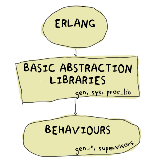

# What is OTP?

## [It's The Open Telecom Platform!]


OTP stands for *Open Telecom Platform*, although it's not that much about telecom anymore (it's more about software that has the property of telecom applications, but yeah.) If half of Erlang's greatness comes from its concurrency and distribution and the other half comes from its error handling capabilities, then the OTP framework is the third half of it.

During the previous chapters, we've seen a few examples of common practices on how to write concurrent applications with the languages' built-in facilities: links, monitors, servers, timeouts, trapping exits, etc. There were a few 'gotchas' here and there on the order things need to be done, on how to avoid race conditions or to always remember that a process could die at any time. There was also hot code loading, naming processes and adding supervisors, to name a few.

Doing all of this manually is time consuming and sometimes prone to error. There are corner cases to be forgotten about and pits to fall into. The OTP framework takes care of this by grouping these essential practices into a set of libraries that have been carefully engineered and battle-hardened over years. Every Erlang programmer should use them.

The OTP framework is also a set of modules and standards designed to help you build applications. Given most Erlang programmers end up using OTP, most Erlang applications you'll encounter in the wild will tend to follow these standards.

## [The Common Process, Abstracted]

One of the things we've done many times in the previous process examples is divide everything in accordance to very specific tasks. In most processes, we had a function in charge of spawning the new process, a function in charge of giving it its initial values, a main loop, etc.

These parts, as it turns out, are usually present in all concurrent programs you'll write, no matter what the process might be used for.


The engineers and computer scientists behind the OTP framework spotted these patterns and included them in a bunch of common libraries. These libraries are built with code that is equivalent to most of the abstractions we used (like using references to tag messages), with the advantage of being used for years in the field and also being built with far more caution than we were with our implementations. They contain functions to safely spawn and initialize processes, send messages to them in a fault-tolerant manner and many other things. Funnily enough, you should rarely need to use these libraries yourself. The abstractions they contain are so basic and universal that a lot more interesting things were built on top of them. Those libraries are the ones we'll use.



In the following chapters we'll see a few of the common uses of processes and then how they can be abstracted, then made generic. Then for each of these we'll also see the corresponding implementation with the OTP framework's behaviours and how to use each of them.

## [The Basic Server]

The first common pattern I'll describe is one we've already used. When writing the [event server](designing-a-concurrent-application.html), we had what could be called a *client-server model*. The event server would receive calls from the client, act on them and then reply to it if the protocol said to do so.

For this chapter, we'll use a very simple server, allowing us to focus on the essential properties of it. Here's the [kitty_server](static/erlang/kitty_server.erl.html):

```erl
%%%%% Naive version
-module(kitty_server).

-export([start_link/0, order_cat/4, return_cat/2, close_shop/1]).

-record(cat, ).

%%% Client API
start_link() -> spawn_link(fun init/0).

%% Synchronous call
order_cat(Pid, Name, Color, Description) ->
    Ref = erlang:monitor(process, Pid),
    Pid ! ,
    receive
         ->
            erlang:demonitor(Ref, [flush]),
            Cat;
         ->
            erlang:error(Reason)
    after 5000 ->
        erlang:error(timeout)
    end.

%% This call is asynchronous
return_cat(Pid, Cat = #cat) ->
    Pid ! ,
    ok.

%% Synchronous call
close_shop(Pid) ->
    Ref = erlang:monitor(process, Pid),
    Pid ! ,
    receive
         ->
            erlang:demonitor(Ref, [flush]),
            ok;
         ->
            erlang:error(Reason)
    after 5000 ->
        erlang:error(timeout)
    end.
    
%%% Server functions
init() -> loop([]).

loop(Cats) ->
    receive
         ->
            if Cats =:= [] ->
                Pid ! ,
                loop(Cats); 
               Cats =/= [] -> % got to empty the stock
                Pid ! ,
                loop(tl(Cats))
            end;
         ->
            loop([Cat|Cats]);
         ->
            Pid ! ,
            terminate(Cats);
        Unknown ->
            %% do some logging here too
            io:format("Unknown message: ~p~n", [Unknown]),
            loop(Cats)
    end.

%%% Private functions
make_cat(Name, Col, Desc) ->
    #cat.

terminate(Cats) ->
    [io:format("~p was set free.~n",[C#cat.name]) || C <- Cats],
    ok.
```

So this is a kitty server/store. The behavior is extremely simple: you describe a cat and you get that cat. If someone returns a cat, it's added to a list and is then automatically sent as the next order instead of what the client actually asked for (we're in this kitty store for the money, not smiles):

```eshell
1> c(kitty_server).

2> rr(kitty_server).
[cat]
3> Pid = kitty_server:start_link().
<0.57.0>
4> Cat1 = kitty_server:order_cat(Pid, carl, brown, "loves to burn bridges").
#cat{name = carl,color = brown,
     description = "loves to burn bridges"}
5> kitty_server:return_cat(Pid, Cat1).
ok
6> kitty_server:order_cat(Pid, jimmy, orange, "cuddly").
#cat{name = carl,color = brown,
     description = "loves to burn bridges"}
7> kitty_server:order_cat(Pid, jimmy, orange, "cuddly").
#cat
8> kitty_server:return_cat(Pid, Cat1).
ok
9> kitty_server:close_shop(Pid).
carl was set free.
ok
10> kitty_server:close_shop(Pid).
** exception error: no such process or port
     in function  kitty_server:close_shop/1
```

Looking back at the source code for the module, we can see patterns we've previously applied. The sections where we set monitors up and down, apply timers, receive data, use a main loop, handle the init function, etc. should all be familiar. It should be possible to abstract away these things we end up repeating all the time.

Let's first take a look at the client API. The first thing we can notice is that both synchronous calls are extremely similar. These are the calls that would likely go in abstraction libraries as mentioned in the previous section. For now, we'll just abstract these away as a single function in a [new module](static/erlang/my_server.erl.html) which will hold all the generic parts of the kitty server:

```erl
-module(my_server).
-compile(export_all).

call(Pid, Msg) ->
    Ref = erlang:monitor(process, Pid),
    Pid ! ,
    receive
         ->
            erlang:demonitor(Ref, [flush]),
            Reply;
         ->
            erlang:error(Reason)
    after 5000 ->
        erlang:error(timeout)
    end.
```

This takes a message and a PID, sticks them into in the function, then forwards the message for you in a safe manner. From now on, we can just substitute the message sending we do with a call to this function. So if we were to rewrite a new kitty server to be paired with the abstracted `my_server`, it could begin like this:

```erl
-module(kitty_server2).
-export([start_link/0, order_cat/4, return_cat/2, close_shop/1]).

-record(cat, ).

%%% Client API
start_link() -> spawn_link(fun init/0).

%% Synchronous call
order_cat(Pid, Name, Color, Description) ->
    my_server:call(Pid, ).

%% This call is asynchronous
return_cat(Pid, Cat = #cat) ->
    Pid ! ,
    ok.

%% Synchronous call
close_shop(Pid) ->
    my_server:call(Pid, terminate).
```

The next big generic chunk of code we have is not as obvious as the `call/2` function. Note that every process we've written so far has a loop where all the messages are pattern matched. This is a bit of a touchy part, but here we have to separate the pattern matching from the loop itself. One quick way to do it would be to add:

```erl
loop(Module, State) ->
    receive
        Message -> Module:handle(Message, State)
    end.
```

And then the specific module can look like this:

```erl
handle(Message1, State) -> NewState1;
handle(Message2, State) -> NewState2;
...
handle(MessageN, State) -> NewStateN.
```

This is better. There are still ways to make it even cleaner. If you paid attention when reading the `kitty_server` module (and I hope you did!), you will have noticed we have a specific way to call synchronously and another one to call asynchronously. It would be pretty helpful if our generic server implementation could provide a clear way to know which kind of call is which.

In order to do this, we will need to match different kinds of messages in `my_server:loop/2`. This means we'll need to change the `call/2` function a little bit so synchronous calls are made obvious by adding the atom `sync` to the message on the function's second line:

```erl
call(Pid, Msg) ->
    Ref = erlang:monitor(process, Pid),
    Pid ! ,
    receive
         ->
            erlang:demonitor(Ref, [flush]),
            Reply;
         ->
            erlang:error(Reason)
    after 5000 ->
        erlang:error(timeout)
    end.
```

We can now provide a new function for asynchronous calls. The function `cast/2` will handle this:

```erl
cast(Pid, Msg) ->
    Pid ! ,
    ok.
```

With this done, the loop can now look like this:

```erl
loop(Module, State) ->
    receive
         ->
             loop(Module, Module:handle_cast(Msg, State));
         ->
             loop(Module, Module:handle_call(Msg, Pid, Ref, State))
    end.
```


And then you could also add specific slots to handle messages that don't fit the sync/async concept (maybe they were sent by accident) or to have your debug functions and other stuff like hot code reloading in there.

One disappointing thing with the loop above is that the abstraction is leaking. The programmers who will use `my_server` will still need to know about references when sending synchronous messages and replying to them. That makes the abstraction useless. To use it, you still need to understand all the boring details. Here's a quick fix for it:

```erl
loop(Module, State) ->
    receive
         ->
             loop(Module, Module:handle_cast(Msg, State));
         ->
             loop(Module, Module:handle_call(Msg, , State))
    end.
```

By putting both variables `Pid` contains:

```erl
reply(, Reply) ->
    Pid ! .
```

What is left to do is specify the starter functions (`start`, `start_link` and `init`) that pass around the module names and whatnot. Once they're added, the module should look like this:

```erl
-module(my_server).
-export([start/2, start_link/2, call/2, cast/2, reply/2]).

%%% Public API
start(Module, InitialState) ->
    spawn(fun() -> init(Module, InitialState) end).

start_link(Module, InitialState) ->
    spawn_link(fun() -> init(Module, InitialState) end).

call(Pid, Msg) ->
    Ref = erlang:monitor(process, Pid),
    Pid ! ,
    receive
         ->
            erlang:demonitor(Ref, [flush]),
            Reply;
         ->
            erlang:error(Reason)
    after 5000 ->
        erlang:error(timeout)
    end.

cast(Pid, Msg) ->
    Pid ! ,
    ok.

reply(, Reply) ->
    Pid ! .

%%% Private stuff
init(Module, InitialState) ->
    loop(Module, Module:init(InitialState)).

loop(Module, State) ->
    receive
         ->
             loop(Module, Module:handle_cast(Msg, State));
         ->
             loop(Module, Module:handle_call(Msg, , State))
    end.
```

The next thing to do is reimplement the kitty server, now `kitty_server2` as a callback module that will respect the interface we defined for `my_server`. We'll keep the same interface as the previous implementation, except all the calls are now redirected to go through `my_server`:

```erl
-module(kitty_server2).

-export([start_link/0, order_cat/4, return_cat/2, close_shop/1]).
-export([init/1, handle_call/3, handle_cast/2]).

-record(cat, ).

%%% Client API
start_link() -> my_server:start_link(?MODULE, []).

%% Synchronous call
order_cat(Pid, Name, Color, Description) ->
    my_server:call(Pid, ).

%% This call is asynchronous
return_cat(Pid, Cat = #cat) ->
    my_server:cast(Pid, ).

%% Synchronous call
close_shop(Pid) ->
    my_server:call(Pid, terminate).
```

Note that I added a second `-export()` at the top of the module. Those are the functions `my_server` will need to call to make everything work:

```erl
%%% Server functions
init([]) -> []. %% no treatment of info here!

handle_call(, From, Cats) ->
    if Cats =:= [] ->
        my_server:reply(From, make_cat(Name, Color, Description)),
        Cats;
       Cats =/= [] ->
        my_server:reply(From, hd(Cats)),
        tl(Cats)
    end;

handle_call(terminate, From, Cats) ->
    my_server:reply(From, ok),
    terminate(Cats).

handle_cast(, Cats) ->
    [Cat|Cats].
```

And then what needs to be done is to re-add the private functions:

```erl
%%% Private functions
make_cat(Name, Col, Desc) ->
    #cat.

terminate(Cats) ->
    [io:format("~p was set free.~n",[C#cat.name]) || C <- Cats],
    exit(normal).
```

Just make sure to replace the `ok` we had before by `exit(normal)` in `terminate/1`, otherwise the server will keep going on.

The code should be compilable and testable, and run in exactly the same manner as it was before. The code is quite similar, but let's see what changed.

## [Specific Vs. Generic]

What we've just done is get an understanding the core of OTP (conceptually speaking). This is what OTP really is all about: taking all the generic components, extracting them in libraries, making sure they work well and then reusing that code when possible. Then all that's left to do is focus on the specific stuff, things that will always change from application to application.

Obviously, there isn't much to save by doing things that way with only the kitty server. It looks a bit like abstraction for abstraction's sake. If the app we had to ship to a customer were nothing but the kitty server, then the first version might be fine. If you're going to have larger applications then it might be worth it to separate generic parts of your code from the specific sections.

Let's imagine for a moment that we have some Erlang software running on a server. Our software has a few kitty servers running, a veterinary process (you send your broken kitties and it returns them fixed), a kitty beauty salon, a server for pet food, supplies, etc. Most of these can be implemented with a client-server pattern. As time goes, your complex system becomes full of different servers running around.

Adding servers adds complexity in terms of code, but also in terms of testing, maintenance and understanding. Each implementation might be different, programmed in different styles by different people, and so on. However, if all these servers share the same common `my_server` abstraction, you substantially reduce that complexity. You understand the basic concept of the module instantly (\"oh, it's a server!\"), there's a single generic implementation of it to test, document, etc. The rest of the effort can be put on each specific implementation of it.


This means you reduce a lot of time tracking and solving bugs (just do it at one place for all servers). It also means that you reduce the number of bugs you introduce. If you were to re-write the `my_server:call/3` or the process' main loop all the time, not only would it be more time consuming, but chances of forgetting one step or the other would skyrocket, and so would bugs. Fewer bugs mean fewer calls during the night to go fix something, which is definitely good for all of us. Your mileage may vary, but I'll bet you don't appreciate going to the office on days off to fix bugs either.

Another interesting thing about what we did when separating the generic from the specific is that we instantly made it much easier to test our individual modules. If you wanted to unit test the old kitty server implementation, you'd need to spawn one process per test, give it the right state, send your messages and hope for the reply you expected. On the other hand, our second kitty server only requires us to run the function calls over the 'handle_call/3' and 'handle_cast/2' functions and see what they output as a new state. No need to set up servers, manipulate the state. Just pass it in as a function parameter. Note that this also means the generic aspect of the server is much easier to test given you can just implement very simple functions that do nothing else than let you focus on the behaviour you want to observe, without the rest.

A much more 'hidden' advantage of using common abstractions in that way is that if everyone uses the exact same backend for their processes, when someone optimizes that single backend to make it a little bit faster, every process using it out there will run a little bit faster too. For this principle to work in practice, it's usually necessary to have a whole lot of people using the same abstractions and putting effort on them. Luckily for the Erlang community, that's what happens with the OTP framework.

Back to our modules. There are a bunch of things we haven't yet addressed: named processes, configuring the timeouts, adding debug information, what to do with unexpected messages, how to tie in hot code loading, handling specific errors, abstracting away the need to write most replies, handling most ways to shut a server down, making sure the server plays nice with supervisors, etc. Going over all of this is superfluous for this text, but would be necessary in real products that need to be shipped. Again, you might see why doing all of this by yourself is a bit of a risky task. Luckily for you (and the people who'll support your applications), the Erlang/OTP team managed to handle all of that for you with the gen_server behaviour. `gen_server` is a bit like `my_server` on steroids, except it has years and years of testing and production use behind it.
