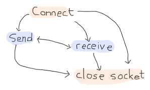

# Buckets of Sockets


So far we've had some fun dealing with Erlang itself, barely communicating to the outside world, if only by text files that we read here and there. As much of relationships with yourself might be fun, it's time to get out of our lair and start talking to the rest of the world.
到目前为止，我们已经在处理Erlang本身时获得了一些乐趣，几乎无法与外部世界通信，哪怕只是通过我们在这里和那里阅读的文本文件。与你自己的很多关系可能都很有趣，现在是时候离开我们的巢穴，开始与世界其他地方交谈了。

This chapter will cover three components of using sockets: IO lists, UDP sockets and TCP sockets. IO lists aren't extremely complex as a topic. They're just a clever way to efficiently build strings to be sent over sockets and other Erlang drivers.
本章将介绍使用套接字的三个组件：IO列表、UDP套接字和TCP套接字。IO列表并不是一个非常复杂的主题。它们只是一种聪明的方法，可以有效地构建通过套接字和其他Erlang驱动程序发送的字符串。

## [IO Lists]

I've mentioned earlier in this guide that for text, we could use either strings (lists of integers) or binaries (a binary data structure holding data). Sending things over the wire such as \"Hello World\" can be done as a string as `"Hello World"`, and as a binary as `<<"Hello World">>`. Similar notation, similar results.
我在本指南前面提到，对于文本，我们可以使用字符串（整数列表）或二进制文件（保存数据的二进制数据结构）。通过网络发送诸如“Hello World”之类的内容可以作为字符串“Hello World”，也可以作为二进制文件“Hello World”>>`。相似的符号，相似的结果。

The difference lies in how you can assemble things. A string is a bit like a linked list of integers: for each character, you've got to store the character itself plus a link towards the rest of the list. Moreover, if you want to add elements to a list, either in the middle or at the end, you have to traverse the whole list up to the point you're modifying and then add your elements. This isn't the case when you prepend, however:
区别在于你如何组装东西。字符串有点像整数的链表：对于每个字符，必须存储字符本身以及指向列表其余部分的链接。此外，如果要向列表中添加元素，无论是在中间还是在末尾，都必须遍历整个列表直到修改的点，然后添加元素。然而，当你准备时，情况并非如此：

``` expand
A = [a]
B = [b|A] = [b,a]
C = [c|B] = [c,b,a]
```

In the case of prepending, as above, whatever is held into `A`. Here's how it looks with appending:

``` expand
A = [a]
B = A ++ [b] = [a] ++ [b] = [a|[b]]
C = B ++ [c] = [a|[b]] ++ [c] = [a|[b|[c]]]
```

Do you see all that rewriting? When we create `B`. Over long strings, this becomes way too inefficient, and it creates a lot of garbage left to be cleaned up by the Erlang VM.
你看到那些重写了吗？当我们创建'B'`。在长字符串中，这会变得效率太低，并且会产生大量垃圾，留给Erlang VM清理。

With binaries, things are not exactly as bad:

``` expand
A = <<"a">>
B = <<A/binary, "b">> = <<"ab">>
C = <<B/binary, "c">> = <<"abc">>
```

In this case, binaries know their own length and data can be joined in constant time. That's good, much better than lists. They're also more compact. For these reasons, we'll often try to stick to binaries when using text in the future.
在这种情况下，二进制文件知道自己的长度，数据可以在固定时间内连接。这很好，比列表好多了。它们也更紧凑。出于这些原因，我们在将来使用文本时通常会坚持使用二进制文件。

There are a few downsides, however. Binaries were meant to handle things in certain ways, and there is still a cost to modifying binaries, splitting them, etc. Moreover, sometimes we'll work with code that uses strings, binaries, and individual characters interchangeably. Constantly converting between types would be a hassle.
然而，也有一些缺点。二进制文件是用来以某种方式处理事情的，修改二进制文件、拆分二进制文件等仍然需要付出代价。此外，有时我们会使用交替使用字符串、二进制文件和单个字符的代码。不断地在类型之间转换会很麻烦。

In these cases, *IO lists* are our saviour. IO lists are a weird type of data structure. They are lists of either bytes (integers from 0 to 255), binaries, or other IO lists. This means that functions that accept IO lists can accept items such as `[$H, $e, [$l, <<"lo">>, " "], [[["W","o"], <<"rl">>]] | [<<"d">>]]`. When this happens, the Erlang VM will just flatten the list as it needs to do it to obtain the sequence of characters `Hello World`.
在这些情况下，*IO列表*是我们的救星。IO列表是一种奇怪的数据结构。它们是字节（从0到255的整数）、二进制文件或其他IO列表的列表。这意味着接受IO列表的函数可以接受诸如“[$H、$e、[$l、<<“lo”>>、”“]、[[[[“W”、“o”]、<<“rl”>>]”等项`。当这种情况发生时，Erlang虚拟机只会将列表展平，因为它需要这样做才能获得字符序列“Hello World”`。

What are the functions that accept such IO Lists? Most of the functions that have to do with outputting data do. Any function from the [io](http://erldocs.com/18.0/stdlib/io.html) (for *r*egular *e*xpressions) module will also handle them, to name a few.
哪些函数可以接受这样的IO列表？大多数与输出数据有关的函数。来自[io]的任何函数(http://erldocs。com/18。0/stdlib/io。html）（用于*r*egular*e*xpressions）模块也将处理它们，举几个例子。

Try the previous `Hello World` IO List in the shell with `io:format("~s~n", [IoList])` just to see. It should work without a problem.
在shell中使用“IO:format”（~s~n“，[IoList]）”尝试前面的“Hello World”IO列表，只需查看一下。它应该可以正常工作。


. UDP is a protocol built on top of the IP layer that provides a few abstractions on top of it such as port numbers. UDP is said to be a stateless protocol. The data that is received from UDP port is broken in small parts, untagged, without a session, and there is no guarantee that the fragments you received were sent in the same order as you got them. In fact, there is no guarantee that if someone sends a packet, you'll receive it at all. For these reasons, people tend to use UDP when the packets are small, can sometimes be lost with little consequences, when there aren't too many complex exchanges taking place or when low latency is absolutely necessary.
我们可以在Erlang中使用的第一种套接字基于[UDP协议](http://en。维基百科。org/wiki/User_数据报_协议）。UDP是建立在IP层之上的协议，它在IP层之上提供了一些抽象，例如端口号。UDP被称为无状态协议。从UDP端口接收的数据被分成小块，没有标记，没有会话，并且不能保证您收到的片段是按照与您收到的片段相同的顺序发送的。事实上，不能保证如果有人发送了一个数据包，你会收到它。由于这些原因，当数据包很小时，人们倾向于使用UDP，有时数据包丢失的后果很小，当没有太多复杂的交换发生时，或者当绝对需要低延迟时。

This is something to be seen in opposition to stateful protocols like [TCP](http://en.wikipedia.org/wiki/Transmission_Control_Protocol), where the protocol takes care of handling lost packets, re-ordering them, maintaining isolated sessions between multiple senders and receivers, etc. TCP will allow reliable exchange of information, but will risk being slower and heavier to set up. UDP will be fast, but less reliable. Choose carefully depending on what you need.
这与[TCP]等有状态协议相反(http://en。维基百科。org/wiki/Transmission_Control_Protocol），协议负责处理丢失的数据包、重新排序数据包、维护多个发送方和接收方之间的隔离会话等。TCP将允许可靠的信息交换，但设置起来可能会更慢、更重。UDP将很快，但不太可靠。根据需要仔细选择。

In any case, using UDP in Erlang is relatively simple. We set up a socket over a given port, and that socket can both send and receive data:
在任何情况下，在Erlang中使用UDP都相对简单。我们在给定端口上设置了一个套接字，该套接字可以发送和接收数据：


 and receiving tiny slips of paper in each of them with small messages. They can have any content, from \"I like how you look in these pants\" down to \"The slip is coming from *inside* the house!\". When some messages are too large for a slip of paper, then many of them are dropped in the mailbox. It's your job to reassemble them in a way that makes sense, then drive up to some house, and drop slips after that as a reply. If the messages are purely informative (\"hey there, your door is unlocked\") or very tiny (\"What are you wearing? -Ron\"), it should be fine and you could use one mailbox for all of the queries. If they were to be complex, though, we might want to use one port per session, right? Ugh, no! Use TCP!
打个不好的比方，这就像你家里有一堆邮箱（每个邮箱都是一个端口），每个邮箱里都有小纸条和小信息。他们可以有任何内容，从“我喜欢你穿这条裤子的样子”到“纸条是从房子里传来的！”。当一些邮件对于纸条来说太大时，它们中的许多会被扔进邮箱。你的工作是以一种合理的方式重新组装它们，然后开车去某个房子，然后把纸条扔下来作为回答。如果这些信息纯粹是信息性的（“嘿，你的门没锁”）或非常小的（“你穿什么？-Ron\”），应该没问题，你可以使用一个邮箱来进行所有查询。但是，如果它们很复杂，我们可能希望每个会话使用一个端口，对吗？啊，不！使用TCP！

In the case of TCP, the protocol is said to be stateful, connection-based. Before being able to send messages, you have to do a handshake. This means that someone's taking a mailbox (similar to what we have in the UDP analogy), and sends a message saying 'hey dude, this is IP 94.25.12.37 calling. Wanna chat?', to which you reply something a bit similar to 'Sure. Tag your messages with number N and then add an increasing number to them'. From that point on, when you or IP 92.25.12.37 want to communicate with each other, it'll be possible to order slips of paper, ask for missing ones, reply to them and so on in a meaningful manner.
在TCP的情况下，该协议被称为有状态的、基于连接的。在发送信息之前，你必须先握手。这意味着有人正在接收一个邮箱（类似于我们在UDP中的类比），并发送一条消息说“嘿，伙计，这是IP 94。”。25。12。37呼叫。想聊天吗？'，你的回答有点像“确定”。用数字N标记你的邮件，然后在邮件中增加一个数字。从那时起，当你或IP 92。25。12。37.想要相互交流，可以订购纸条，索要遗失的纸条，以有意义的方式回复纸条等等。

That way, we can use a single mailbox (or port) and keep all our communications fine. That's the neat thing of TCP. It adds some overhead, but makes sure that everything is ordered, properly delivered, and so on.
这样，我们就可以使用一个邮箱（或端口），并保持所有通信正常。这就是TCP的精妙之处。它增加了一些开销，但确保所有东西都已订购、正确交付，等等。

If you're not a fan of these analogies, do not despair because we'll cut to the chase by seeing how to use TCP and UDP sockets with Erlang right now. This should be simpler.
如果你不喜欢这些类比，请不要绝望，因为我们现在就来看看如何在Erlang中使用TCP和UDP套接字。这应该更简单。

## [UDP Sockets]

There are only a few basic operations with UDP: setting up a socket, sending messages, receiving messages and closing a connection. The possibilities are a bit like this:
UDP只有几个基本操作：设置套接字、发送消息、接收消息和关闭连接。可能性有点像这样：


`.
不管怎样，第一个操作就是打开插座。这可以通过调用'gen_udp:open/1-2'来完成`。最简单的形式是调用`=gen_udp:open（端口号）`。

The port number will be any integer between 1 and 65535. From 0 to 1023, the ports are known as *system ports*. Most of the time, your operating system will make it impossible to listen to a system port unless you have administrative rights. Ports from 1024 through 49151 are registered ports. They usually require no permissions and are free to use, although some of them are [registered to well known services](http://www.iana.org/assignments/service-names-port-numbers/service-names-port-numbers.xml), unlikely to be taken.
端口号将是1到65535之间的任意整数。从0到1023，这些端口称为*系统端口*。大多数情况下，除非您拥有管理权限，否则操作系统将无法监听系统端口。1024到49151之间的端口是注册端口。它们通常不需要权限，可以自由使用，尽管其中一些是[注册到知名服务](http://www。伊安娜。组织/分配/服务名称端口号/服务名称端口号。xml），不太可能被采用。

But before that, what about `gen_udp:open/2`? The second argument can be a list of options, specifying in what type we want to receive data (`list` or `binary`), how we want them received; as messages (``), the size of buffers, etc. There are more options available, but we'll stick to the simple stuff for now because understanding the rest is rather up to you to learn. The topic can become complex fast and this guide is about Erlang, not TCP and UDP, unfortunately.
但在此之前，“gen_udp:open/2”呢？第二个参数可以是选项列表，指定我们希望接收数据的类型（“list”或“binary”），以及我们希望接收数据的方式；如消息（``）、缓冲区大小等。有更多的选择，但我们现在将坚持简单的东西，因为理解其余的是由你来学习。这个主题很快就会变得复杂，不幸的是，本指南是关于Erlang的，而不是关于TCP和UDP的。

So let's open a socket. First start a given Erlang shell:

```eshell
1> ]). 

2> gen_udp:open(8789, [binary, ]).

```

In the first command, I open the socket, order it to return me binary data, and I want it to be active. You can see a new data structure being returned: `#Port<0.676>`. This is the representation of the socket we have just opened. They can be used a lot like Pids: you can even set up links to them so that failure is propagated to the sockets in case of a crash! The second function call tries to open the same socket over again, which is impossible. That's why ` socket is still open.
首先，我希望以二进制顺序打开套接字。您可以看到一个新的数据结构被返回：`#端口<0。676>`。这是我们刚刚打开的套接字的表示。它们可以像PID一样使用：您甚至可以设置到它们的链接，以便在崩溃时将故障传播到套接字！第二个函数调用尝试再次打开同一个套接字，这是不可能的。这就是插座仍然打开的原因。

In any case, we'll start a second Erlang shell. In that one we'll open a second UDP socket, with a different port number:
无论如何，我们将启动第二个Erlang shell。在其中，我们将打开第二个UDP套接字，其端口号不同：

```eshell
1>  = gen_udp:open(8790).

2> gen_udp:send(Socket, , 8789, "hey there!").
ok
```

Ah, a new function! In the second call, `gen_udp:send/4` is used to send messages (what a wonderfully descriptive name). The arguments are, in order: `gen_udp:send(OwnSocket, RemoteAddress, RemotePort, Message)`. The `RemoteAddress` can be either a string or an atom containing a domain name (\"example.org\"), a 4-tuple describing an IPv4 address or a 8-tuple describing an IPv6 address. Then we specify the receiver's port number (in what mailbox are we going to drop our slip of paper?), and then the message, which can be a string, a binary, or an IO list.
啊，一个新功能！在第二个调用中，“gen_udp:send/4”用于发送消息（这是一个非常好的描述性名称）。参数的顺序是：`gen_udp:send（OwnSocket、RemoteAddress、RemotePort、Message）`。“RemoteAddress”可以是字符串，也可以是包含域名的原子（\”示例）。org\”），描述IPv4地址的4元组或描述IPv6地址的8元组。然后我们指定接收者的端口号（我们要把纸条放在哪个邮箱？），然后是消息，可以是字符串、二进制或IO列表。

Did the message ever get sent? Go back to your first shell and try to flush the data:

```eshell
3> flush().
Shell got 
ok
```

Fantastic. The process that opened the socket will receive messages of the form ``. Using these fields, we'll be able to know where a message is from, what socket it went through, and what the contents were. So we've covered opening sockets, sending data, and receiving it in an active mode. What about passive mode? For this, we need to close the socket from the first shell and open a new one:
好极了。打开套接字的进程将接收表单的消息``。使用这些字段，我们将能够知道消息来自何处，它通过了什么套接字，以及内容是什么。所以我们已经讨论了打开套接字、发送数据和以活动模式接收数据。被动模式呢？为此，我们需要从第一个外壳关闭插座，然后打开一个新的：

```eshell
4> gen_udp:close(Socket).
ok
5> f(Socket).
ok
6> ]).

```

So here, we close the socket, unbind the `Socket` variable, then bind it as we open a socket again, in passive mode this time. Before sending a message back, try the following:
在这里，我们关闭套接字，解除绑定'socket'变量，然后在再次打开套接字时绑定它，这一次是在被动模式下。在发回邮件之前，请尝试以下操作：

```eshell
7> gen_udp:recv(Socket, 0).
```

And your shell should be stuck. The function here is `recv/2`. This is the function used to poll a passive socket for messages. The `0` here is the length of the message we want. The funny thing is that the length is completely ignored with `gen_udp`. `gen_tcp` has a similar function, and in that case, it does have an impact. Anyway, if we never send a message, `recv/2` is never going to return. Get back to the second shell and send a new message:
你的壳应该被卡住了。这里的函数是“recv/2”`。此函数用于轮询被动套接字中的消息。“0”是我们想要的消息长度。有趣的是，“gen_udp”完全忽略了长度`。`gen_tcp`也有类似的功能，在这种情况下，它确实会产生影响。无论如何，如果我们再也不发消息，`recv/2`就永远不会回来了。返回第二个shell并发送新消息：

```eshell
3> gen_udp:send(Socket, , 8789, "hey there!").
ok
```

Then the first shell should have printed `` as the return value. What if you don't want to wait forever? Just add a time out value:
那么第一个shell应该打印出``作为返回值。如果你不想永远等待呢？只需添加一个超时值：

```eshell
8> gen_udp:recv(Socket, 0, 2000).

```

And that's most of it for UDP. No, really!

## [TCP Sockets]

While TCP sockets share a large part of their interface with UDP sockets, there are some vital differences in how they work. The biggest one is that clients and servers are two entirely different things. A client will behave with the following operations:
虽然TCP套接字与UDP套接字共享很大一部分接口，但它们的工作方式存在一些重大差异。最大的一点是，客户机和服务器是两个完全不同的东西。客户端将执行以下操作：


 or to a close state.](../img/tcp-server.png)
`:
首先，我们打开一个新的shell，启动一个名为“监听套接字”的程序，使用“gen_tcp:listen（Port，Options）”：

```eshell
1> , binary]).

```

The listen socket is just in charge of waiting for connection requests. You can see that I used similar options as I did with gen_udp. That's because most options are going to be similar for all IP sockets. The TCP ones do have a few more specific options, including a connection backlog (` is the length of each packet's header to be stripped and parsed for you), etc.
侦听套接字只负责等待连接请求。您可以看到，我使用了与gen_udp类似的选项。这是因为对于所有IP套接字，大多数选项都是相似的。TCP协议确实有一些更具体的选项，包括一个连接待办事项（“是要为您剥离和解析的每个数据包的头的长度”）等。

Once the listen socket is open, any process (and more than one) can take the listen socket and fall into an 'accepting' state, locked up until some client asks to talk with it:
一旦listen套接字打开，任何进程（以及多个进程）都可以使用listen套接字并进入“接受”状态，并锁定，直到有客户端请求与它对话：

```eshell
2>  = gen_tcp:accept(ListenSocket, 2000).
** exception error: no match of right hand side value 
3>  = gen_tcp:accept(ListenSocket).
** exception error: no match of right hand side value 
```

Damn. We timed out and then crashed. The listen socket got closed when the shell process it was associated with disappeared. Let's start over again, this time without the 2 seconds (2000 milliseconds) timeout:
该死。我们超时了，然后坠毁了。与之关联的shell进程消失后，侦听套接字关闭。让我们重新开始，这次没有2秒（2000毫秒）的超时：

```eshell
4> f().
ok
5> , binary]).

6>  = gen_tcp:accept(ListenSocket).
```

And then the process is locked. Great! Let's open a second shell:

```eshell
1> ]). 

```

This one still takes the same options as usual, and you can add a `Timeout``. From that point on, the accept socket and the client socket can communicate on a one-on-one basis, similarly to `gen_udp`. Take the second shell and send messages to the first one:
这一个仍然采用与往常相同的选项，您可以添加一个“超时”``。从那时起，accept套接字和client套接字可以一对一地通信，类似于“gen_udp”`。获取第二个shell并向第一个shell发送消息：

```eshell
3> gen_tcp:send(Socket, "Hey there first shell!").
ok
```

And from the first shell:

```eshell
7> flush().
Shell got 
ok
```

Both sockets can send messages in the same way, and can then be closed with `gen_tcp:close(Socket)`. Note that closing an accept socket will close that socket alone, and closing a listen socket will close none of the related and established accept sockets, but will interrupt currently running accept calls by returning ``.
两个套接字都可以以相同的方式发送消息，然后可以使用“gen_tcp:close（Socket）”关闭`。请注意，关闭accept套接字将单独关闭该套接字，关闭listen套接字将不会关闭任何相关的和已建立的accept套接字，但会通过返回来中断当前正在运行的accept调用``。

That's it for most of TCP sockets in Erlang! But is it really?

Ah yes, of course, there is more that can be done. If you've experimented with sockets a bit on your own, you might have noticed that there is some kind of ownership to sockets.
啊，是的，当然，还有更多的事情可以做。如果你自己尝试过一点套接字，你可能已经注意到套接字有某种所有权。

By this, I mean that UDP sockets, TCP client sockets and TCP accept sockets can all have messages sent through them from any process in existence, but messages received can only be read by the process that started the socket:
我的意思是，UDP套接字、TCP客户端套接字和TCP接受套接字都可以通过它们从现有的任何进程发送消息，但接收到的消息只能由启动套接字的进程读取：


`. This function has to be called by the current socket owner. Then the process tells Erlang 'you know what? Just let this `Pid` in the function is the one that can read and receive messages from the socket. That's it.
这是诀窍。gen_tcp和gen_udp都包含一个名为“控制进程（套接字、Pid）”的函数`。此函数必须由当前套接字所有者调用。然后这个过程告诉Erlang你知道吗？只需让函数中的'Pid'可以从套接字读取和接收消息。就这样。

## [More Control With Inet]

So now we understand how to open sockets, send messages through them, change ownership, and so on. We also know how to listen to messages both in passive and active mode. Back in the UDP example, when I wanted to switch from active to passive mode, I restarted the socket, flushed variables and went on. This is rather unpractical, especially when we desire to do the same while using TCP because we'd have to break an active session.
现在我们了解了如何打开套接字、通过它们发送消息、更改所有权等等。我们也知道如何在被动和主动模式下倾听信息。回到UDP示例中，当我想从主动模式切换到被动模式时，我重新启动了套接字，刷新了变量，然后继续。这是非常不实际的，尤其是当我们希望在使用TCP时也这样做，因为我们必须中断一个活动会话。

Fortunately, there's a module named `inet` that takes care of handling all operations that can be common to both gen_tcp and gen_udp sockets. For our problem at hand, which was changing between active and passive modes, there's a function named `inet:setopts(Socket, Options)`. The option list can contain any terms used at the setup of a socket.
幸运的是，有一个名为“inet”的模块，负责处理gen_tcp和gen_udp套接字共同的所有操作。对于我们手头的问题，在主动和被动模式之间切换，有一个名为'inet:setopts（Socket，Options）的函数`。选项列表可以包含设置套接字时使用的任何术语。

::: note
**Note:** be careful! There exists a module named `inet` and a module named `inets`. `inet` is the module we want here. `inets` is an OTP application that contains a bunch of pre-written services and servers (including FTP, Trivial FTP (TFTP), HTTP, etc.)
**注意：*小心！存在一个名为'inet'的模块和一个名为'inets'的模块`。`inet是我们想要的模块。`iNet`是一个OTP应用程序，包含一系列预先编写的服务和服务器（包括FTP、普通FTP（TFTP）、HTTP等）。)

An easy trick to differentiate them is that `inets` is about **s**ervices built on top of `inet`, or if you prefer, `inet` + **s**(ervices).
区分它们的一个简单技巧是，`inets`是在`inet`之上构建的**s**服务，或者如果您喜欢，`inet`+**s**（服务）。
:::

Start a shell to be a TCP server:

```eshell
1> ]).

2>  = gen_tcp:accept(Listen).
```

And in a second shell:

```eshell
1> , 8088, []).

2> gen_tcp:send(Socket, "hey there").
ok
```

Then back to the first shell, the socket should have been accepted. We flush to see if we got anything:
然后回到第一个外壳，插座应该已经被接受。我们冲过去看看有没有什么发现：

```eshell
3> flush().
ok
```

Of course not, we're in passive mode. Let's fix this:

```eshell
4> inet:setopts(Accept, []).
ok
5> flush().
Shell got 
ok
```

Yes! With full control over active and passive sockets, the power is ours. How do we pick between active and passive modes?
对通过对主动和被动插座的完全控制，电源是我们的。我们如何在主动模式和被动模式之间进行选择？


Well there are many points. In general, if you're waiting for a message right away, passive mode will be much faster. Erlang won't have to toy with your process' mailbox to handle things, you won't have to scan said mailbox, fetch messages, etc. Using `recv` will be more efficient. However, `recv` changes your process from something event-driven to active polling --- if you've got to play middle-man between a socket and some other Erlang code, this might make things a bit complex.
有很多要点。一般来说，如果你正在等待信息，被动模式会快得多。Erlang将不必玩弄你的“处理”邮箱来处理事情，你也不必扫描所说的邮箱、获取消息等等。使用“recv”会更有效率。然而，`recv`将您的过程从事件驱动更改为活动轮询——如果您必须在套接字和其他Erlang代码之间扮演中间人的角色，这可能会让事情变得有点复杂。

In that case, switching to active mode will be a good idea. If packets are sent as messages, you just have to wait in a receive (or a gen_server's `handle_info` function) and play with messages. The downside of this, apart from speed, has to do with rate limiting.
在这种情况下，切换到主动模式将是一个好主意。如果数据包以消息的形式发送，你只需等待接收（或gen_服务器的“handle_info”功能）并播放消息即可。除了速度之外，这种做法的缺点还与利率限制有关。

The idea is that if all packets coming from the outside world are blindly accepted by Erlang and then converted to messages, it is somewhat easy for someone outside of the VM to flood it and kill it. Passive mode has the advantage of restricting how and when messages can be put into the Erlang VM, and delegating the task of blocking, queuing up, and dropping messages to the lower-level implementations.
这个想法是，如果来自外部世界的所有数据包都被Erlang盲目地接受，然后转换为消息，那么对于VM之外的人来说，淹没并杀死它有点容易。被动模式的优点是限制消息如何以及何时可以放入Erlang VM，并将阻塞、排队和丢弃消息的任务委托给较低级别的实现。

So what if we need active mode for the semantics, but passive mode for the safety? We could try to quickly switch between passive and active with [inet:setopts/2](http://erldocs.com/18.0/kernel/inet.html#setopts/2)`. Let's try it to see how it works.
那么，如果我们需要语义上的主动模式，而安全上的被动模式呢？我们可以尝试使用[inet:setopts/2]在被动和主动之间快速切换(http://erldocs。com/18。0/kernel/inet。html#setopts/2）`。让我们试试看它是如何工作的。

Keep the shell with the server from earlier:

```eshell
6> inet:setopts(Accept, []).
ok
```

Now get to the client shell and run two more `send/2` calls:

```eshell
3> gen_tcp:send(Socket, "one").
ok
4> gen_tcp:send(Socket, "two").
ok
```

And back to server shell:

```eshell
7> flush().
Shell got 
ok
8> flush().
ok
9> inet:setopts(Accept, []).
ok
10> flush().
Shell got 
ok
```

See? Until we ask for `` a second time, the message `"two"` hasn't been converted to a message, which means the socket was back to passive mode. So the active once mode allows us to do that back-and-forth switch between active and passive in a safe way. Nice semantics, plus the safety.
看见直到我们请求第二次，消息“two”还没有被转换成消息，这意味着套接字回到了被动模式。因此，主动一次模式允许我们以安全的方式在主动和被动之间来回切换。很好的语义，还有安全性。

There are other nice functions part of inet. Stuff to read statistics, get current host information, inspect sockets and so on.
inet还有其他一些不错的功能。阅读统计数据、获取当前主机信息、检查套接字等等。

Well that's most of it for sockets. Now's time to put this into practice.

::: note
**Note:** out in the wilderness of the Internet, you have libraries to do so with a truckload of protocols: HTTP, 0mq, raw unix sockets, etc. They're all available. The standard Erlang distribution, however, comes with two main options, TCP and UDP sockets. It also comes with some HTTP servers and parsing code, but it's not the most efficient thing around.
**注意：*在互联网的荒野中，你可以使用大量的协议库来实现这一点：HTTP、0mq、原始unix套接字等等。他们都有空。然而，标准的Erlang发行版有两个主要选项，TCP和UDP套接字。它还附带了一些HTTP服务器和解析代码，但这并不是最有效的方法。
:::

::: 
**Update:**\
Starting with version 17.0, it is now possible to tell a port to be active for `N` packets.
The `` for UDP.

When calling the function multiple times, each new value is added to the total counter. Calling it with ` value can also be negative to force decrementing the counter. If the final value would be below 0, Erlang silently sets it to 0 and transitions to passive mode.
多次调用函数时，每个新值都会添加到总计数器中。用'value'调用它也可以是负数，从而强制递减计数器。如果最终值低于0，Erlang会自动将其设置为0，并转换为被动模式。
:::


![一杯带饼干和勺子的咖啡]。短信上写着“休息一下”(。。/静态/模拟/休息。png“你现在要休息的时间真多！”）

## [Sockserv, Revisited]

I won't be introducing that much new code for this chapter. Instead, we'll look back at the [sockserv](static/erlang/processquest/apps/sockserv-1.0.1/src/sockserv_serv.erl.html) server from Process Quest, in the last chapter. It's a perfectly viable server and we'll see how to deal with serving TCP connections within an OTP supervision trees, in a gen_server.
我不会为本章介绍那么多新代码。相反，我们将回顾[sockserv]（static/erlang/processquest/apps/sockserv-1）。0。1/src/sockserv_serv。呃。在最后一章中，来自Process Quest的html）服务器。这是一个完全可行的服务器，我们将在gen_服务器上看到如何在OTP监控树中处理TCP连接服务。

A naive implementation of a TCP server might look a bit like this:

```erl
-module(naive_tcp).
-compile(export_all).

start_server(Port) ->
    Pid = spawn_link(fun() ->
        ]),
        spawn(fun() -> acceptor(Listen) end),
        timer:sleep(infinity)
    end),
    .

acceptor(ListenSocket) ->
     = gen_tcp:accept(ListenSocket),
    spawn(fun() -> acceptor(ListenSocket) end),
    handle(Socket).

%% Echoing back whatever was obtained
handle(Socket) ->
    inet:setopts(Socket, []),
    receive
         ->
            gen_tcp:close(Socket);
         ->
            gen_tcp:send(Socket, Msg),
            handle(Socket)
    end.
```

To understand how this works, a little graphical representation might be helpful:


![显示产生侦听套接字的第一个进程（P1）和第一个接受进程（P2）的图表]。第一个接受者可以接受请求、处理消息，然后生成一个新的接受者进程（P3），该进程的作用与P2相同](。。/静态/img/顺序服务器。（巴布亚新几内亚）

So the `start_server` function opens a listen socket, spawns an acceptor and then just idles forever. The idling is necessary because the listen socket is bound to the process that opened it, so that one needs to remain alive as long as we want to handle connections. Each acceptor process waits for a connection to accept. Once one connection comes in, the acceptor process starts a new similar process and shares the listen socket to it. Then it can move on and do some processing while the new guy's working. Each handler will repeat all messages it gets until one of them starts with `"quit"` --- then the connection is closed.
因此，“start_server”函数会打开一个监听套接字，生成一个接受器，然后永远闲置。空闲是必要的，因为侦听套接字绑定到打开它的进程，所以只要我们想处理连接，就需要保持活动状态。每个接受进程都等待连接接受。一旦一个连接进入，接受者进程就会启动一个新的类似进程，并与之共享侦听套接字。然后，它可以在新员工工作时继续进行处理。每个处理程序都会重复收到的所有消息，直到其中一条消息以“quit”开头——然后连接关闭。

::: note
**Note:** the pattern `<<"quit", _/binary>>` means that we first want to match on a binary string containing the characters `q`, `u`, `i`, and `t`, plus some binary data we don't care about (`_`).
**注意：*模式“<<”退出“，uz/binary>>”意味着我们首先要匹配一个二进制字符串，其中包含字符'q'、'u'、'i'和't'，再加上一些我们不关心的二进制数据（'uz'）。
:::

Start the server in an Erlang shell by doing `naive_tcp:start_server(8091).` Then open up a telnet client (remember, telnet clients are technically not for raw TCP, but act as good clients to test servers without having to write one) to localhost and you can see the following taking place:
通过执行'naive_tcp:Start_server（8091）在Erlang shell中启动服务器。`然后打开一个telnet客户端（请记住，telnet客户端在技术上不适用于原始TCP，但可以作为良好的客户端来测试服务器，而无需编写一个）到localhost，您可以看到以下情况：

``` expand
$ telnet localhost 8091
Trying 127.0.0.1...
Connected to localhost.
Escape character is '^]'.
hey there
hey there
that's what I asked
that's what I asked
stop repeating >:(
stop repeating >:(
quit doing that!
Connection closed by foreign host.
```

Hooray. Time to start a new company called *Poople Inc.* and launch a few social networks with such a server. Except that as the name of the module mentions it, this is a naive implementation. The code is simple, but wasn't thought with parallelism in mind. If all the requests come one by one, then the naive server works fine. What happens if we have a queue of 15 people wanting to connect to the server at once, though?
好极了。是时候成立一家名为“Poople Inc”的新公司了。*并用这样的服务器启动一些社交网络。除此之外，正如模块名称所述，这是一个幼稚的实现。代码很简单，但没有考虑到并行性。如果所有请求一个接一个地出现，那么naive服务器就可以正常工作。但是，如果我们有一个15人的队列想要同时连接到服务器，会发生什么呢？

Then only one query at a time can be replied to, and this has to do with each process first waiting for the connection, setting it up, then spawning a new acceptor. The 15th request in the queue will have had to wait for 14 other connections to have been set up to even get the chance of asking for a right to discuss with our server. If you're working with production servers, it might be closer to, I don't know, five hundred to a thousand queries per second. That's impractical.
然后一次只能回复一个查询，这与每个进程有关，首先等待连接，设置连接，然后生成一个新的接受程序。队列中的第15个请求将不得不等待其他14个连接被设置，以便有机会请求与我们的服务器进行讨论的权利。如果你使用的是生产服务器，我不知道它可能更接近每秒500到1000个查询。那是不切实际的。

What we'd need would be to change the sequential workflow we have:


 torrent client.
通过让许多接受者准备就绪，我们将减少回答新问题的大量延迟。现在，我们将研究[sockserv-1]，而不是进行另一个演示实现。0。1] （static/erlang/sockserv-1）。0。1.。zip）torrent客户端。

To build this Process Quest's sockserv, we'll go top-down. The scheme we'll need will have to be a supervisor with many workers. If we look at the parallel drawing above, the supervisor should hold the listen socket and share it to all workers, which will be in charge of accepting things.
要构建这个过程Quest的sockserv，我们将采用自上而下的方式。我们需要的计划必须是一个有许多工人的主管。如果我们看上面的平行图，主管应该持有监听插座，并将其分享给所有工人，这些工人将负责接收物品。

How do we write a supervisor that can share things across all workers? There is no way to do it with regular supervision: all children are entirely independent, no matter if you use `one_for_one`, `one_for_all` or `rest_for_one` supervision. A natural reflex could be to turn to some global state: a registered process that just holds the listen socket and hands it over to the handlers. You must fight this reflex and be clever. Use the force (and the ability to read back into the [supervisors chapter](supervisors.html)). You've got 2 minutes to think of a solution (the timing of the two minutes is based on the honor system. Time it yourself.)
我们如何编写一个能让所有员工分享信息的主管？常规的监督是无法做到这一点的：所有的孩子都是完全独立的，不管你是使用“一对一”、“一对所有”还是“休息对一”的监督。一种自然的反射可能是转向某个全局状态：一个注册的进程，它只持有listen套接字并将其交给处理程序。你必须克服这种反射并变得聪明。使用原力（以及读回[supervisors]一章的能力]（supervisors。html）。你有2分钟的时间来考虑解决方案（这两分钟的时间是基于荣誉制度的）。自己计时。)

The secret is in using a `simple_one_for_one` supervisor. Because the `simple_one_for_one` supervisors share the child specification with all of its children, all we need to do is shove the listen socket in there for all the children to access it!
秘密在于使用“简单的”主管。因为“simple_one_for_one”监管者与它的所有孩子共享子规范，所以我们需要做的就是将监听插座插入其中，让所有孩子都能访问它！

So here's the supervisor in all its glory:

```erl
%%% The supervisor in charge of all the socket acceptors.
-module(sockserv_sup).
-behaviour(supervisor).

-export([start_link/0, start_socket/0]).
-export([init/1]).

start_link() ->
    supervisor:start_link(, ?MODULE, []).

init([]) ->
     = application:get_env(port),
    %% Set the socket into  mode.
    %% See sockserv_serv comments for more details
    ]),
    spawn_link(fun empty_listeners/0),
    ,
         [{socket,
          , % pass the socket!
          temporary, 1000, worker, [sockserv_serv]}
         ]}}.

start_socket() ->
    supervisor:start_child(?MODULE, []).

%% Start with 20 listeners so that many multiple connections can
%% be started at once, without serialization. In best circumstances,
%% a process would keep the count active at all times to insure nothing
%% bad happens over time when processes get killed too much.
empty_listeners() ->
    [start_socket() || _ <- lists:seq(1,20)],
    ok.
```

So what is going on in here. The standard `start_link/0` and `init/1` functions are there. You can see sockserv getting the `simple_one_for_one` restart strategy, and the child specification having `ListenSocket` passed around. Every child started with `start_socket/0` will have it as an argument by default. Magic!
这是怎么回事。标准的'start_link/0'和'init/1'函数都存在。您可以看到sockserv获得了“simple_one_for_one”重启策略，并且子规范传递了“ListenSocket”。默认情况下，以“start_socket/0”开头的每个孩子都会将其作为参数。魔术

Just having that won't be enough. We want the application to be able to serve queries as soon as possible. That's why I added that call to `spawn_link(fun empty_listeners/0)`. The `empty_listeners/0` function will start 20 handlers to be locked and waiting for incoming connections. I've put it inside a `spawn_link/1` call for a simple reason: the supervisor process is in its `init/1` phase and cannot answer any messages. If we were to call ourselves from within the init function, the process would deadlock and never finish running. An external process is needed just for this reason.
仅仅拥有这些是不够的。我们希望应用程序能够尽快提供查询服务。这就是为什么我在'spawn_link（有趣的空侦听器/0）中添加了这个调用`。“empty_listeners/0”函数将启动20个处理程序以锁定并等待传入连接。我把它放在一个'spawn_link/1'调用中，原因很简单：主管进程处于'init/1'阶段，无法应答任何消息。如果我们从init函数中调用自己，进程就会死锁，永远无法完成运行。正是出于这个原因，需要一个外部过程。

::: note
**Note:** In the snippet above, you'll notice I pass the option `` to gen_tcp. This option will make it so all received packets will be broken into separate lines and queued up based on that (the line ends will still be part of the received strings). This will help make sure things work better with telnet clients in our case. Be aware, however, that lines longer than the receive buffer may be split over many packets, so it is possible for two packets to represent a single line. Verifying that the received content ends in a newline will let you know if the line is over or not.
**注意：*在上面的代码片段中，您会注意到我将选项``传递给gen_tcp。此选项将使所有接收到的数据包被分成单独的行，并在此基础上排队（行尾仍将是接收字符串的一部分）。这将有助于确保在我们的情况下，telnet客户端能够更好地工作。但是，请注意，比接收缓冲区长的行可能会被拆分为多个数据包，因此两个数据包可能代表一行。验证接收到的内容是否以换行结束将让您知道该行是否结束。
:::

So yeah, that was the whole tricky part. We can now focus on writing the workers themselves.

If you recall the Process Quest sessions from last chapter, things went this way:

1.  The user connects to the server

2.  The server asks for the character's name

3.  The user sends in a character name

4.  The server suggests stats

5.  1.  the user refuses, go back to point 4
    2.  the user accepts, go to point 6

6.  The game sends event to the player, until:

7.  The user sends `quit` to the server or the socket is forced close

This means we will have two kinds of input to our server processes: input coming from the Process Quest application and input coming from the user. Data coming from the user will be doing so from a socket and so will be handled in our gen_server's `handle_info/2` function. Data coming from Process Quest can be sent in a way we control, and so a cast handled by `handle_cast` will make sense there. First, we must start the server:
这意味着我们的服务器进程将有两种输入：来自Process Quest应用程序的输入和来自用户的输入。来自用户的数据将通过套接字进行处理，因此将在gen_服务器的“handle_info/2”功能中进行处理。来自Process Quest的数据可以通过我们控制的方式发送，因此由“handle_cast”处理的cast在这里是有意义的。首先，我们必须启动服务器：

```erl
-module(sockserv_serv).
-behaviour(gen_server).

-record(state, {name, % player's name
                next, % next step, used when initializing
                socket}). % the current socket

-export([start_link/1]).
-export([init/1, handle_call/3, handle_cast/2, handle_info/2,
         code_change/3, terminate/2]).
```

First of all is a pretty standard gen_server callback module. The only special thing here is the state containing the character's name, the socket, and a field called `next`. The `next` part is a bit of a catch-all field to store temporary information related to the state of the server. A gen_fsm could have possibly been used here without too much trouble.
首先是一个非常标准的gen_服务器回调模块。这里唯一特别的是包含字符名称、套接字和名为“next”的字段的状态`。“next”部分是一个有点全面的字段，用于存储与服务器状态相关的临时信息。gen_fsm本可以在这里使用，不会有太多麻烦。

For the actual server startup:

```erl
-define(TIME, 800).
-define(EXP, 50).

start_link(Socket) ->
    gen_server:start_link(?MODULE, Socket, []).

init(Socket) ->
    %% properly seeding the process
    <<A:32, B:32, C:32>> = crypto:rand_bytes(12),
    random:seed(),
    %% Because accepting a connection is a blocking function call,
    %% we can not do it in here. Forward to the server loop!
    gen_server:cast(self(), accept),
    .

%% We never need you, handle_call!
handle_call(_E, _From, State) ->
    .
```

The two macros defined above (`?TIME`) are special parameters that make it possible to set the baseline delay between actions (800 milliseconds) and the amount of experience required to reach the second level (50, doubled after each level).
上面定义的两个宏（“时间”）是特殊参数，可以设置操作之间的基线延迟（800毫秒）和达到第二级所需的经验量（50，每级后加倍）。

You'll notice that the `start_link/1` function takes a socket. That's the listen socket passed in from `sockserv_sup`.
你会注意到'start_link/1'函数需要一个套接字。这是从'sockserv_sup'传入的侦听套接字`。

The first bit about the random seed is about making sure a process is properly seeded to later generate character statistics. Otherwise, some default value will be used across many processes and we don't want that. The reason why we're initializing in the `init/1` function rather than in whatever library that uses random numbers is because seeds are stored at a process-level (damn it! mutable state!) and we wouldn't want to set a new seed on each library call.
关于随机种子的第一点是确保一个进程被正确地播种，以便以后生成字符统计信息。否则，许多进程都会使用一些默认值，我们不希望这样。我们之所以在'init/1'函数中初始化，而不是在任何使用随机数的库中初始化，是因为种子存储在进程级别（该死！可变状态！）我们也不想在每次图书馆电话中设定一个新的种子。

In any case, the real important bit there is that we're casting a message to ourselves. The reason for this is that `gen_tcp:accept/1-2` is a blocking operation, combined with the fact that all `init` functions are synchronous. If we wait 30 seconds to accept a connection, the supervisor starting the process will also be locked 30 seconds. So yeah, we cast a message to ourselves, then add the listen socket to the state's `socket` field.
在任何情况下，真正重要的一点是我们在向自己传递信息。原因是'gen_tcp:accept/1-2'是一个阻塞操作，再加上所有'init'函数都是同步的。如果我们等待30秒以接受连接，启动该进程的主管也将被锁定30秒。所以，是的，我们向自己发送一条消息，然后将listen套接字添加到state的'socket'字段中。

::: 
**Don't Drink Too Much Kool-Aid:**\
If you read code from other people, you will often see people calling `random:seed/1` with the result of `now()`. `now()` is a nice function because it returns monotonic time (always increasing, never twice the same). However, it's a bad seed value for the random algorithm used in Erlang. For this reason, it's better to use `crypto:rand_bytes(12)` to generate 12 crypto-safe random bytes (use `crypto:strong_rand_bytes(12)` if you're on R14B03+). By doing `<<A:32, B:32, C:32>>`, we're casting the 12 bytes to 3 integers to be passed in.
如果你阅读别人的代码，你会经常看到人们调用'random:seed/1'，结果是'now（）`。`now（）`是一个很好的函数，因为它返回单调的时间（总是增加，从不两倍相同）。然而，对于Erlang中使用的随机算法来说，这是一个糟糕的种子值。出于这个原因，最好使用'crypto:rand_bytes（12）'来生成12个加密安全的随机字节（如果您使用的是R14B03+，请使用'crypto:strong_rand_bytes（12）'）。通过执行“<A:32，B:32，C:32>”，我们将12个字节转换为3个整数，以便传入。
:::

::: 
**Update:**\
Starting with version 18.0, the [rand](http://erldocs.com/18.0/stdlib/rand.html) module has been introduced, containing better pseudo-random algorithms than the random module, and without needing to be seeded.
从版本18开始。0，[rand](http://erldocs。com/18。0/stdlib/rand。html）模块，包含比随机模块更好的伪随机算法，并且不需要种子。
:::

We need to accept that connection. Enough fooling around:

```erl
handle_cast(accept, S = #state) ->
     = gen_tcp:accept(ListenSocket),
    %% Remember that thou art dust, and to dust thou shalt return.
    %% We want to always keep a given number of children in this app.
    sockserv_sup:start_socket(), % a new acceptor is born, praise the lord
    send(AcceptSocket, "What's your character's name?", []),
    ;
```

We accept the connection, start a replacement acceptor (so that we always have about 20 acceptors ready to handle new connections), then store the accept socket as a replacement to `ListenSocket` and note that the next message we receive through a socket is about a name with the 'next' field.
我们接受连接，启动一个替换的接受器（这样我们总是有大约20个接受器准备好处理新的连接），然后将接受套接字作为替换存储到“ListenSocket”，并注意，我们通过套接字收到的下一条消息是关于带有“next”字段的名称的。

But before moving on, we send a question to the client through the `send` function, defined as follows:
但在继续之前，我们通过“发送”功能向客户发送一个问题，定义如下：

```erl
send(Socket, Str, Args) ->
    ok = gen_tcp:send(Socket, io_lib:format(Str++"~n", Args)),
    ok = inet:setopts(Socket, []),
    ok.
```

Trickery! Because I expect us to pretty much always have to reply after receiving a message, I do the *active once* routine within that function, and also add line breaks in there. Just laziness locked in a function.
诡计！因为我希望我们几乎总是在收到消息后回复，所以我在该函数中执行“活动一次”例程，并在其中添加换行符。只是懒惰被锁在一个函数中。

We've completed steps 1 and 2, and now we have to wait for user input coming from the socket:

```erl
handle_info() ->
    Name = line(Str),
    gen_server:cast(self(), roll_stats),
    ;
```

We have no idea what's going to be in the `Str` string, but that's alright because the `next` field of the state lets us know whatever we receive is a name. Because I was expecting users to use telnet for the demo application, all bits of text we're going to receive will contain line ends. The `line/1` function, defined as follows, strips them away:
我们不知道'Str'字符串中会出现什么，但这没关系，因为州的'next'字段让我们知道我们收到的任何东西都是一个名字。因为我希望用户在演示应用程序中使用telnet，所以我们将收到的所有文本位都将包含行尾。“line/1”函数的定义如下，它将它们剥离：

```erl
%% Let's get rid of the white space and ignore whatever's after.
%% makes it simpler to deal with telnet.
line(Str) ->
    hd(string:tokens(Str, "\r\n ")).
```

Once we've received that name, we store it and then cast a message to ourselves (`roll_stats`) to generate stats for the player, the next step in line.
一旦我们收到了这个名字，我们将其存储起来，然后向我们自己发送一条消息（“roll_stats”），为玩家生成统计信息，接下来就是这个步骤。

::: note
**Note:** if you look in the file, you'll see that instead of matching on entire messages, I've used a shorter `?SOCK(Var)` macro. The macro is defined as `-define(SOCK(Msg), ).` and is just a quick way for someone as lazy as I am to match on strings with slightly less typing.
**注意：**如果你查看文件，你会发现我使用了一个较短的“？SOCK（Var）`macro。宏被定义为`-define（SOCK（Msg），）。`对于像我这样懒惰的人来说，这只是一种快速匹配字符串的方法，只需稍微少输入一些。
:::

The stats rolling comes back into a `handle_cast` clause:

```erl
handle_cast(roll_stats, S = #state) ->
    Roll = pq_stats:initial_roll(),
    send(Socket,
         "Stats for your character:~n"
         "  Charisma: ~B~n"
         "  Constitution: ~B~n"
         "  Dexterity: ~B~n"
         "  Intelligence: ~B~n"
         "  Strength: ~B~n"
         "  Wisdom: ~B~n~n"
         "Do you agree to these? y/n~n",
         [Points ||  <- lists:sort(Roll)]),
    ;
```


The [pq_stats](static/erlang/processquest/apps/processquest-1.0.0/src/pq_stats.erl.html) module contains functions to roll stats, and the whole clause is only being used to output the stats there. The `~B` format parameters means we want an integer to be printed out. The `next` part of the state is a bit overloaded here. Because we ask the user whether they agree or not, we will have to wait for them to tell us so, and either drop the stats and generate new ones, or pass them to the Process Quest character we'll no doubt start very soon.
[pq_stats]（static/erlang/processquest/apps/processquest-1）。0。0/src/pq_统计数据。呃。html）模块包含滚动统计数据的函数，整个子句只用于输出那里的统计数据。“~B”格式参数意味着我们希望打印出一个整数。这个州的“下一个”部分在这里有点超载。因为我们询问用户是否同意，我们将不得不等待他们告诉我们，要么删除统计数据并生成新的统计数据，要么将它们传递给流程任务角色。毫无疑问，我们很快就会开始。

Let's listen to the user input, this time in the `handle_info` function:

```erl
handle_info() ->
    case line(Str) of
        "y" ->
            gen_server:cast(self(), stats_accepted);
        "n" ->
            gen_server:cast(self(), roll_stats);
        _ -> % ask again because we didn't get what we wanted
            send(Socket, "Answer with y (yes) or n (no)", [])
    end,
    ;
```

It would have been tempting to start the character in this direct function clause, but I decided against it: `handle_info` is to handle user input, `handle_cast` for Process Quest things. Separation of concerns! If the user denies the stats, we just call `roll_stats` again. Nothing new. When the user accepts, then we can start the Process Quest character and start waiting for events from there:
在这个direct function子句中开始这个字符很有诱惑力，但我决定不这样做：`handle_info`是用来处理用户输入的，`handle_cast`是用来处理进程任务的。分离关注点！如果用户拒绝统计数据，我们只需再次调用“roll_stats”。没什么新鲜事。当用户接受后，我们可以启动流程任务角色，并从那里开始等待事件：

```erl
%% The player has accepted the stats! Start the game!
handle_cast(stats_accepted, S = #state) ->
    processquest:start_player(Name, [,
                                     ]),
    processquest:subscribe(Name, sockserv_pq_events, self()),
    ;
```

Those are regular calls I defined for the game. You start a player, and subscribe to the events with the [sockserv_pq_events](static/erlang/processquest/apps/sockserv-1.0.1/src/sockserv_pq_events.erl.html) event handler. The next state is `playing`, which means that all messages received are more than likely to be from the game:
这些是我为游戏定义的常规通话。您启动一个播放器，并使用[sockserv_pq_events]（static/erlang/processquest/apps/sockserv-1）订阅事件。0。1/src/sockserv_pq_事件。呃。html）事件处理程序。下一个状态是“正在玩”，这意味着收到的所有消息都很可能来自游戏：

```erl
%% Events coming in from process quest
%% We know this because all these events' tuples start with the
%% name of the player as part of the internal protocol defined for us
handle_cast(Event, S = #state) when element(1, Event) =:= N ->
    [case E of
        -> timer:sleep(Time);
       IoList -> send(Sock, IoList, [])
     end || E <- sockserv_trans:to_str(Event)], % translate to a string
    .
```

I won't get into the details of how this works too much. Just know that `sockserv_trans:to_str(Event)` convert some game event to lists of IO lists or ` messages a bit before showing what the item dropped by the enemy is).
我不会过多地讨论它的工作原理。只需知道“sockserv_trans:to_str（Event）`将一些游戏事件转换为IO列表或消息列表，然后再显示敌人扔下的物品）。

If you recall the list of steps to follow, we've covered them all except one. Quitting when a user tells us they want to. Put the following clause as the top one in `handle_info`:
如果你还记得要遵循的步骤列表，我们已经涵盖了所有步骤，只有一个除外。当用户告诉我们他们想退出时退出。将以下子句作为“handle_info”中的第一个：

```erl
handle_info(, S) ->
    processquest:stop_player(S#state.name),
    gen_tcp:close(S#state.socket),
    ;
```

Stop the character, close the socket, terminate the process. Hooray. Other reasons to quit include the TCP socket being closed by the client:
停止角色，关闭套接字，终止进程。好极了。退出的其他原因包括客户端正在关闭TCP套接字：

```erl
handle_info(, S) ->
    ;
handle_info(, S) ->
    ;
handle_info(E, S) ->
    io:format("unexpected: ~p~n", [E]),
    .
```

I also added an extra clause to handle unknown messages. If the user types in something we don't expect, we don't want to crash. Only the `terminate/2` and `code_change/3` functions are left to do:
我还添加了一个额外的子句来处理未知消息。如果用户输入了我们不期望的内容，我们就不想崩溃。只剩下“终止/2”和“代码更改/3”功能：

```erl
code_change(_OldVsn, State, _Extra) ->
    .

terminate(normal, _State) ->
    ok;
terminate(_Reason, _State) ->
    io:format("terminate reason: ~p~n", [_Reason]).
```

If you followed through the whole thing, you can try compiling this file and substituting it for the corresponding beam file in the release we had and see if it runs well. It should, if you copied things right (and if I did too).
如果您遵循了整个过程，您可以尝试编译这个文件，并将其替换为我们发布的相应beam文件，看看它是否运行良好。如果你把东西抄对了（如果我也抄对了），应该是这样的。

## [Where to go From Now?]

Your next assignment, if you are to accept it, is to add a few more commands of your choice to the client: why not add things like 'pause' that will queue up actions for a while and then output them all once you resume the server? Or if you're bad ass enough, noting the levels and stats you have so far in the [sockserv_serv](static/erlang/processquest/apps/sockserv-1.0.1/src/sockserv_serv.erl.html) module, and adding commands to fetch them from the client side. I always hated exercises left to the reader, but sometimes it's just too tempting to drop one here and there, so enjoy!
如果你要接受它，你的下一个任务是向客户端添加一些你选择的命令：为什么不添加“暂停”之类的东西，让操作排队等待一段时间，然后在恢复服务器后将它们全部输出？或者，如果你够笨的话，记下你目前在[sockserv_serv]（static/erlang/processquest/apps/sockserv-1）中的级别和统计数据。0。1/src/sockserv_serv。呃。html）模块，并添加命令从客户端获取它们。我一直不喜欢留给读者的练习，但有时在这里或那里放一个练习太诱人了，所以尽情享受吧！

Otherwise, reading the source of existing server implementations, programming some yourself and whatnot will all be good exercises. Rare are the languages where doing things like writing a web server is an exercise for amateurs, but Erlang is one of them. Practice a bit and it'll become like a second nature. Erlang communicating to the outside world is just one of the many steps we've done towards writing useful software.
否则，阅读现有服务器实现的源代码，自己编程等等都是很好的练习。对于业余爱好者来说，编写web服务器之类的工作是一种练习，但Erlang就是其中之一。练习一下，它就会变成第二天性。Erlang与外部世界的通信只是我们为编写有用软件所做的许多步骤之一。
