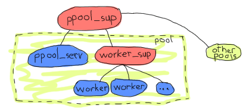
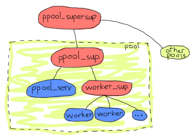
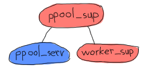
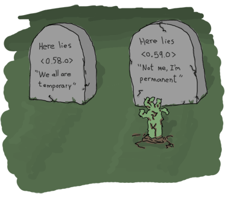

# Building an Application With OTP

We've now seen how to use generic servers, finite state machine, event handlers and supervisors. We've not exactly seen how to use them together to build applications and tools, though.
我们现在已经了解了如何使用通用服务器、有限状态机、事件处理程序和监控器。不过，我们还没有看到如何将它们结合起来构建应用程序和工具。

An Erlang application is a group of related code and processes. An *OTP application* specifically uses OTP behaviours for its processes, and then wraps them in a very specific structure that tells the VM how to set everything up and then tear it down.
Erlang应用程序是一组相关的代码和进程。一个*OTP应用程序*专门为其进程使用OTP行为，然后将它们封装在一个非常特定的结构中，告诉VM如何设置所有内容，然后将其拆除。

So in this chapter, we're going to build an application with OTP components, but not a full OTP one because we won't do the whole wrapping up just now. The details of complete OTP applications are a bit complex and warrant their own chapter (the next one). This one's going to be about implementing a process pool. The idea behind such a process pool is to manage and limit resources running in a system in a generic manner.
所以在本章中，我们将用OTP组件构建一个应用程序，但不是一个完整的OTP组件，因为我们现在不会完成整个包装。完整的OTP申请的细节有点复杂，需要有自己的章节（下一章）。这将是关于实现一个进程池。这种进程池背后的想法是以通用方式管理和限制系统中运行的资源。

## [A Pool of Processes]


So yes, a pool allows to limit how many processes run at once. A pool can also queue up jobs when the running workers limit is hit. The jobs can then be ran as soon as resources are freed up or simply block by telling the user they can't do anything else. Despite real world pools doing nothing similar to actual process pools, there are reasons to want to use the latter. A few of them could include:
是的，一个池允许限制一次运行多少个进程。当达到运行工人限制时，池还可以将作业排队。然后，一旦资源被释放，就可以运行这些作业，或者简单地告诉用户他们不能做任何其他事情来阻止这些作业。尽管现实世界的池与实际的进程池没有任何相似之处，但有理由使用后者。其中一些可能包括：

-   Limiting a server to N concurrent connections at most;
-   Limiting how many files can be opened by an application;
-   Giving different priorities to different subsystems of a release by allowing more resources for some and less for others. Let's say allowing more processes for client requests than processes in charge of generating reports for management.
-通过允许一些人拥有更多资源，而另一些人拥有更少资源，为发布的不同子系统赋予不同的优先级。比方说，与负责生成管理报告的流程相比，允许更多的客户请求流程。
-   Allowing an application under occasional heavy loads coming in bursts to remain more stable during its entire life by queuing the tasks.
-通过对任务进行排队，允许应用程序在其整个生命周期中，在偶尔爆发的重载下保持更稳定。

Our process pool application will thus need to support a few functions:

-   Starting and stopping the application
-   Starting and stopping a particular process pool (all the pools sit within the process pool application)
-启动和停止特定进程池（所有池都位于进程池应用程序中）
-   Running a task in the pool and telling you it can't be started if the pool is full
-   Running a task in the pool if there's room, otherwise keep the calling process waiting while the task is in the queue. Free the caller once the task can be run.
-如果有空间，则在池中运行任务，否则在任务处于队列中时让调用进程等待。一旦任务可以运行，释放调用者。
-   Running a task asynchronously in the pool, as soon as possible. If no place is available, queue it up and run it whenever.
-尽快在池中异步运行任务。如果没有空位，请排队并随时运行。

These needs will help drive our program design. Also keep in mind that we can now use supervisors. And of course we want to use them. The thing is, if they give us new powers in term of robustness, they also impose a certain limit on flexibility. Let's explore that.
这些需求将有助于推动我们的项目设计。还要记住，我们现在可以使用监管者。当然，我们想要使用它们。问题是，如果它们在稳健性方面赋予我们新的权力，它们也会对灵活性施加一定的限制。让我们来探索一下。

## [The Onion Layer Theory]

[
[！[一个很酷的洋葱（它有太阳镜和山羊胡）](。。/静态/图像/洋葱。png“OTP：洋葱理论平台，理论借用自一篇博客帖子，链接在这张图片下。")

To help ourselves design an application with supervisors, it helps to have an idea of what needs supervision and how it needs to be supervised. You'll recall we have different strategies with different settings; these will fit for different kinds of code with different kinds of errors. A rainbow of mistakes can be made!
为了帮助我们自己设计一个有监督的应用程序，了解什么需要监督以及如何监督是很有帮助的。你会记得我们在不同的环境下有不同的策略；这些将适用于具有不同错误的不同类型的代码。可能会犯很多错误！

One thing newcomers and even experienced Erlang programmers have trouble dealing with is usually how to cope with the loss of state. Supervisors kill processes, state is lost, woe is me. To help with this, we will identify different kinds of state:
新来者甚至有经验的Erlang程序员都很难处理的一件事通常是如何应对状态的丢失。监管者扼杀进程，国家消失，我有祸了。为此，我们将确定不同类型的状态：

-   Static state. This type can easily be fetched from a config file, another process or the supervisor restarting the application.
-静态。这种类型可以很容易地从配置文件、另一个进程或重新启动应用程序的主管获取。
-   Dynamic state, composed of data you can re-compute. This includes state that you had to transform from its initial form to get where it is right now
-动态状态，由可以重新计算的数据组成。这包括你必须从最初的形式转换到现在的状态
-   Dynamic data you can not recompute. This might include user input, live data, sequences of external events, etc.
-无法重新计算的动态数据。这可能包括用户输入、实时数据、外部事件序列等。

Now, static data is somewhat easy to deal with. Most of the time you can get it straight from the supervisor. Same for the dynamic but re-computable data. In this case you might want to grab it and compute it within the `init/1` function, or anywhere else in your code, really.
现在，静态数据有点容易处理。大多数时候，你可以直接从主管那里得到。对于动态但可重新计算的数据也是如此。在这种情况下，您可能想要获取它并在`init/1`函数中或代码中的任何其他地方计算它，真的。

The most problematic kind of state is the dynamic data you can't recompute and that you can basically just hope not to lose. In some cases you'll be pushing that data to a database although that won't always be a good option.
最有问题的一种状态是无法重新计算的动态数据，基本上你只希望不会丢失。在某些情况下，你会将数据推送到数据库中，尽管这并不总是一个好的选择。

The idea of an onion layered system is to allow all of these different states to be protected correctly by isolating different kinds of code from each other. It's process segregation.
洋葱分层系统的想法是通过将不同类型的代码彼此隔离，允许所有这些不同的状态得到正确的保护。这是过程隔离。

The static state can be handled by supervisors, the system being started up, etc. Each time a child dies, the supervisor restarts them and can inject them with some form of static state, always being available. Because most supervisor definitions are rather static by nature, each layer of supervision you add acts as a shield protecting your application against their failure and the loss of their state.
静态状态可由主管、系统启动等进行处理。每次孩子死后，监管者都会重新启动他们，并向他们注入某种形式的静态，始终可用。因为大多数监管者定义本质上都是静态的，所以您添加的每一层监管者都充当了一个盾牌，保护您的应用程序免受失败和状态丢失的影响。

The dynamic state that can be recomputed has a whole lot of available solutions: build it from the static data sent by the supervisors, go fetch it back from some other process, database, text file, the current environment or whatever. It should be relatively easy to get it back on each restart. The fact that you have supervisors that do a restarting job can be enough to help you keep that state alive.
可以重新计算的动态状态有很多可用的解决方案：从主管发送的静态数据构建它，从其他进程、数据库、文本文件、当前环境或其他任何地方获取它。每次重启都应该相对容易恢复。你有负责重启工作的主管，这一事实足以帮助你保持这种状态。

The dynamic non-recomputable kind of state needs a more thoughtful approach. The real nature of an onion-layered approach takes shape here. The idea is that the most important data (or the hardest to find back) has to be the most protected type. The places where you are actually not allowed to fail is called the *error kernel* of your application.
这种动态的不可重新计算的状态需要一种更深思熟虑的方法。洋葱分层方法的真正本质在这里形成。其理念是，最重要的数据（或最难找到的数据）必须是最受保护的类型。实际上不允许失败的地方被称为应用程序的“错误内核”。


![模仿《如果你能抓住我》的介绍图片，改为《如果你能抓住我就撞车》。那架小飞机正在爆炸。](。。/如果可以的话，给我打个电话。png“一部好电影！”）

The error kernel is likely the place where you'll want to use `try ... catch`es more than anywhere else, where handling exceptional cases is vital. This is what you want to be error-free. Careful testing has to be done around there, especially in cases where there is no way to go back. You don't want to lose a customer's order halfway through processing it, do you? Some operations are going to be considered safer than others. Because of this, we want to keep vital data in the safest core possible, and keeping everything somewhat dangerous outside of it. In specific terms, this means that all kinds of operations related together should be part of the same supervision trees, and the unrelated ones should be kept in different trees. Within the same tree, operations that are failure-prone but not vital can be in a separate sub-tree. When possible, only restart the part of the tree that needs it. We'll see an example of this when designing our actual process pool's supervision tree.
错误内核可能是您想要使用“try”的地方。。。在处理例外情况至关重要的地方，捕获比其他任何地方都多。这就是你想要的无错误。必须在附近进行仔细的测试，尤其是在无法返回的情况下。你不想在处理客户订单的过程中半途而废，是吗？一些操作将被认为比其他操作更安全。正因为如此，我们希望将重要数据保存在尽可能安全的核心中，并将所有有点危险的数据保存在核心之外。具体来说，这意味着所有相关的操作都应该是同一个监管树的一部分，而不相关的操作应该保存在不同的树中。在同一棵树中，容易发生故障但不重要的操作可以放在单独的子树中。如果可能，只重新启动树中需要它的部分。在设计实际流程池的监控树时，我们将看到一个例子。

## [A Pool's Tree]

So how should we organise these process pools? There are two schools of thought here. One tells people to design bottom-up (write all individual components, put them together as required) and another one tells us to write things top-down (design as if all the parts were there, then build them). Both approaches are equally valid depending on the circumstances and your personal style. For the sake of making things understandable, we're going to do things top-down here.
那么，我们应该如何组织这些流程池呢？这里有两个学派。一个告诉人们自下而上设计（编写所有单独的组件，根据需要将它们组合在一起），另一个告诉我们自上而下地编写东西（设计时就好像所有的部件都在那里，然后构建它们）。根据具体情况和个人风格，这两种方法同样有效。为了让事情变得易懂，我们将在这里自上而下地做一些事情。

So what should our tree look like? Well our requirements include: being able to start the pool application as a whole, having many pools and each pool having many workers that can be queued. This already suggests a few possible design constraints.
那么我们的树应该是什么样子呢？我们的要求包括：能够作为一个整体启动池应用程序，拥有多个池，每个池都有许多可以排队的工作人员。这已经表明了一些可能的设计约束。

We will need one `gen_server` per pool. The server's job will be to maintain the counter of how many workers are in the pool. For convenience, the same server should also hold the queue of tasks. Who should be in charge of overlooking each of the workers, though? The server itself?
我们需要每个泳池配备一台gen_服务器。服务器的工作将是维护池中有多少工人的计数器。为了方便起见，同一台服务器还应该保留任务队列。但是，谁应该负责俯瞰每个工人？服务器本身？

Doing it with the server is interesting. After all, it needs to track the processes to count them and supervising them itself is a nifty way to do it. Moreover neither the server nor the processes can crash without losing the state of all the others (otherwise the server can't track the tasks after it restarted). It has a few disadvantages too: the server has many responsibilities, can be seen as more fragile and duplicates the functionality of existing, better tested modules.
用服务器做这件事很有趣。毕竟，它需要跟踪流程来统计它们，而监督它们本身就是一种很好的方法。此外，服务器和进程都不能在不丢失所有其他进程的状态的情况下崩溃（否则服务器重启后无法跟踪任务）。它也有一些缺点：服务器有很多责任，可能被视为更脆弱，重复了现有的、经过更好测试的模块的功能。

A good way to make sure all workers are properly accounted for would be to use a supervisor just for them
一个确保所有工人都得到妥善安置的好方法是只为他们安排一名主管


![一个名为'ppool_sup'的过程管理两个孩子：'ppool_serv'和'worker_sup'。\“worker_sup”有很多“worker”孩子。\“ppool\u serv\”、“worker\u sup\”及其子项组成一个池。“pool_sup”还管理其他类似的池。](。。/静态/img/ppool\u sup。（巴布亚新几内亚）

The one above, for example would have a single supervisor for all of the pools. Each pool is in fact a set of a pool server and a supervisor for workers. The pool server knows the existence of its worker supervisor and asks it to add items. Given adding children is a very dynamic thing with unknown limits so far, a `simple_one_for_one` supervisor shall be used.
例如，上面的一个将为所有池设置一个单独的主管。实际上，每个池都是一组池服务器和一个工人管理器。池服务器知道其工作管理器的存在，并要求其添加项。考虑到添加孩子是一件非常动态的事情，到目前为止还没有明确的限制，因此应该使用“简单的一对一”的监督。

::: note
**Note:** the name `ppool` is chosen because the Erlang standard library already has a `pool` module. Plus it's a terrible pool-related pun.
**注意：*之所以选择“ppool”这个名称，是因为Erlang标准库已经有了一个“pool”模块。而且这是一个糟糕的泳池双关语。
:::

The advantage of doing things that way is that because the `worker_sup` supervisor will need to track only OTP workers of a single type, each pool is guaranteed to be about a well defined kind of worker, with simple management and restart strategies that are easy to define. This right here is one example of an error kernel being better defined. If I'm using a pool of sockets for web connections and another pool of servers in charge of log files, I am making sure that incorrect code or messy permissions in the log file section of my application won't be drowning out the processes in charge of the sockets. If the log files' pool crashes too much, they'll be shut down and their supervisor will stop. Oh wait!
这样做的好处是，由于“worker_sup”主管只需要跟踪单一类型的OTP员工，因此每个人才库都有一个定义明确的员工类型，具有简单的管理和易于定义的重启策略。这里是一个更好地定义错误内核的例子。如果我正在使用一个用于web连接的套接字池和另一个负责日志文件的服务器池，我将确保我的应用程序的日志文件部分中的错误代码或混乱权限不会淹没负责套接字的进程。如果日志文件“池”崩溃过多，它们将被关闭，其主管将停止。等等！

Right. Because all pools are under the same supervisor, a given pool or server restarting too many times in a short time span can take all the other pools down. This means what we might want to do is add one level of supervision. This will also make it much simpler to handle more than one pool at a time, so let's say the following will be our application architecture:
正当。因为所有池都在同一个管理器下，一个给定的池或服务器在短时间内重启太多次可能会导致所有其他池停机。这意味着我们可能想做的是增加一个级别的监督。这也将使一次处理多个池变得更加简单，因此我们的应用程序架构如下所示：


![与上一个带有'ppool_sup'的监督树相同，只是'ppool_sup'现在是池本身的一部分。一位名为ppool_supersup的主管负责检查新泳池和其他泳池。](。。/静态/img/ppool\u supersup。（巴布亚新几内亚）

And that makes a bit more sense. From the onion layer perspective, all pools are independent, the workers are independent from each other and the `ppool_serv` server is going to be isolated from all the workers. That's good enough for the architecture, everything we need seems to be there. We can start working on the implementation, again, top to bottom.
这就更有意义了。从洋葱层的角度来看，所有池都是独立的，工作线程彼此独立，“ppool_serv”服务器将与所有工作线程隔离。这对建筑来说已经足够好了，我们需要的一切似乎都在那里。我们可以从头到脚开始实施。

## [Implementing the Supervisors]

We can start with just the top level supervisor, `ppool_supersup`. All this one has to do is start the supervisor of a pool when required. We'll give it a few functions: `start_link/0`, which starts the whole application, `stop/0`, which stops it, `start_pool/3`, which creates a specific pool and `stop_pool/1` which does the opposite. We also can't forget `init/1`, the only callback required by the supervisor behaviour:
我们可以从最高层的主管开始，`ppool_supersup`。这只需要在需要的时候启动泳池管理员。我们将给它一些函数：`start_link/0`，它启动整个应用程序，`stop/0`，它停止应用程序，`start_pool/3`，它创建一个特定的池，而`stop_pool/1`则相反。我们也不能忘记“init/1”，这是主管行为所需的唯一回调：

```erl
-module(ppool_supersup).
-behaviour(supervisor).
-export([start_link/0, stop/0, start_pool/3, stop_pool/1]).
-export([init/1]).

start_link() ->
    supervisor:start_link(, ?MODULE, []).
```

Here we gave the top level process pool supervisor the name `ppool` (this explains the use of ``, an OTP convention about registering `gen_`\* processes on a node; another one exists for distributed registration). This is because we know we will only have one `ppool` per Erlang node and we can give it a name without worrying about clashes. Fortunately, the same name can then be used to stop the whole set of pools:
在这里，我们给顶级进程池主管起了一个名为“ppool”（这解释了“`”的用法，这是一种关于在节点上注册“gen\\*进程”的OTP约定；另一个用于分布式注册）。这是因为我们知道每个Erlang节点只有一个'ppool'，我们可以给它起个名字，而不用担心冲突。幸运的是，可以使用相同的名称来阻止整个池：

```erl
%% technically, a supervisor can not be killed in an easy way.
%% Let's do it brutally!
stop() ->
    case whereis(ppool) of
        P when is_pid(P) ->
            exit(P, kill);
        _ -> ok
    end.
```

As the comments in the code explain it, we can not terminate a supervisor gracefully. The reason for this is that the OTP framework provides a well-defined shutdown procedure for all supervisors, but we can't use it from where we are right now. We'll see how to do it in the next chapter, but for now, brutally killing the supervisor is the best we can do.
正如代码中的注释所解释的，我们不能优雅地终止主管。原因是OTP框架为所有监管人员提供了一个定义良好的关闭程序，但我们无法从现在的位置使用它。我们将在下一章中看到如何做到这一点，但就目前而言，残忍地杀害主管是我们能做的最好的事情。

What is the top level supervisor exactly? Well its only task is to hold pools in memory and supervise them. In this case, it will be a childless supervisor:
最高级别的主管到底是什么？它唯一的任务就是在内存中保存池并监督它们。在这种情况下，它将是一个无子女的主管：

```erl
init([]) ->
    MaxRestart = 6,
    MaxTime = 3600,
    .
```

We can now focus on starting each individual pool's supervisor and attaching them to `ppool`. Given our initial requirements, we can determine that we'll need two parameters: the number of workers the pool will accept, and the `` tuple that the worker supervisor will need to start each worker. We'll also add a name for good measure. We then pass this childspec to the process pool's supervisor as we start it:
我们现在可以专注于启动每个泳池的管理员，并将其连接到“ppool”`。根据我们的初始需求，我们可以确定我们需要两个参数：池将接受的工人数量，以及工人主管启动每个工人所需的``元组。我们还将为good measure添加一个名称。然后，我们在启动时将此childspec传递给流程池的主管：

```erl
start_pool(Name, Limit, MFA) ->
    ChildSpec = {Name,
                 ,
                  permanent, 10500, supervisor, [ppool_sup]},
    supervisor:start_child(ppool, ChildSpec).
```

You can see each pool supervisor is asked to be permanent, has the arguments needed (notice how we're be changing programmer-submitted data into static data this way). The name of the pool is both passed to the supervisor and used as an identifier in the child specification. There's also a maximum shutdown time of `10500`. There is no easy way to pick this value. Just make sure it's large enough that all the children will have time to stop. Play with them according to your needs and test and adapt yourself. You might as well try the `infinity` option if you just don't know.
您可以看到，每个池管理器都被要求是永久的，具有所需的参数（请注意，我们是如何以这种方式将程序员提交的数据更改为静态数据的）。池的名称会传递给主管，并在子规范中用作标识符。还有一个最大关机时间是10500`。没有简单的方法来选择这个值。只要确保它足够大，所有的孩子都有时间停下来。根据你的需要和他们一起玩，测试和调整你自己。如果你不知道，不妨试试“无限”选项。

To stop the pool, we need to ask the `ppool` super supervisor (the *supersup*!) to kill its matching child:
要停止游泳池，我们需要询问“ppool”超级主管（超级主管！）要杀死匹配的孩子：

```erl
stop_pool(Name) ->
    supervisor:terminate_child(ppool, Name),
    supervisor:delete_child(ppool, Name).
```

This is possible because we gave the pool's `Name` as the childspec identifier. Great! We can now focus on each pool's direct supervisor!
这是可能的，因为我们将池的'Name'作为childspec标识符。太棒了我们现在可以关注每个泳池的直接主管了！

Each `ppool_sup` will be in charge of the pool server and the worker supervisor.



Can you see the funny thing here? The `ppool_serv` process should be able to contact the `worker_sup` process. If we're to have them started by the same supervisor at the same time, we won't have any way to let `ppool_serv` know about `worker_sup`, unless we were to do some trickery with `supervisor:which_children/1` (which would be sensitive to timing and somewhat risky), or giving a name to both the `ppool_serv` process (so that users can call it) and the supervisor. Now we don't want to give names to the supervisors because:
你能看到有趣的事吗？'ppool_serv'流程应该能够联系'worker_sup'流程。如果我们让同一个主管同时启动它们，我们就没有办法让“ppool_serv”知道“worker_sup”，除非我们对“supervisor:which_children/1”（这对时间很敏感，有点风险），或者给“ppool_serv”进程（以便用户可以调用）和主管都起一个名字。现在我们不想给主管起名字，因为：

1.  The users don't need to call them directly
2.  We would need to dynamically generate atoms and that makes me nervous
3.  There is a better way.

The way to do it is basically to get the pool server to dynamically attach the worker supervisor to its `ppool_sup`. If this is vague, you'll get it soon. For now we only start the server:
实现这一点的方法基本上是让池服务器动态地将worker supervisor附加到其“ppool\u sup”上`。如果这是模糊的，你会很快得到它。目前我们只启动服务器：

```erl
-module(ppool_sup).
-export([start_link/3, init/1]).
-behaviour(supervisor).

start_link(Name, Limit, MFA) ->
    supervisor:start_link(?MODULE, ).

init() ->
    MaxRestart = 1,
    MaxTime = 3600,
    ,
          [{serv,
             ,
             permanent,
             5000, % Shutdown time
             worker,
             [ppool_serv]}]}}.
```

And that's about it. Note that the `Name` variable will be used in that call to let the `simple_one_for_one` supervisor know what kind of workers to run.
仅此而已。请注意，`Name`变量将在该调用中使用，以让`simple_one_for_one`主管知道要运行哪种工作人员。

We'll get to how the server handles everything, but for now we'll finish writing all of the application's supervisors by writing `ppool_worker_sup`, in charge of all the workers:
我们将了解服务器如何处理一切，但现在我们将通过编写“ppool_worker_sup”来完成应用程序的所有监控程序的编写，负责所有的工作人员：

```erl
-module(ppool_worker_sup).
-export([start_link/1, init/1]).
-behaviour(supervisor).

start_link(MFA = ) ->
    supervisor:start_link(?MODULE, MFA).

init() ->
    MaxRestart = 5,
    MaxTime = 3600,
    ,
          [{ppool_worker,
            ,
            temporary, 5000, worker, [M]}]}}.
```

Simple stuff there. We picked a `simple_one_for_one` because workers could be added in very high number with a requirement for speed, plus we want to restrict their type. All the workers are temporary, and because we use an `` tuple to start the worker, we can use any kind of OTP behaviour there.
简单的东西。我们选择了一个“简单的一个一个”来代替“一个一个”，因为工人的数量可能会非常大，而且对速度有要求，而且我们想限制他们的类型。所有的worker都是临时的，因为我们使用一个``元组来启动worker，所以我们可以在那里使用任何类型的OTP行为。


!【两块墓碑，一块挨着一块。】。第一个说“这里躺着”。58。“我们都是临时的”。第二个说“这里躺着”。59。0\>'并说“不是我，我是永久的”。一只僵尸手正从这只手前面的地上伸出来](。。/静态/img/僵尸。png“只有通过头部的适当“出口”才能杀死Erlang系统进程”）

The reason to make the workers temporary is twofold. First of all, we can not know for sure whether they need to be restarted or not in case of failure or what kind of restart strategy would be required for them. Secondly, the pool might only be useful if the worker's creator can have an access to the worker's pid, depending on the use case. For this to work in any safe and simple manner, we can't just restart workers as we please without tracking its creator and sending it a notification. This would make things quite complex just to grab a pid. Of course, you are free to write your own `ppool_worker_sup` that doesn't return pids but restarts them. There's nothing inherently wrong in that design.
让工人成为临时工的原因有两个。首先，我们无法确定它们在发生故障时是否需要重启，或者需要什么样的重启策略。其次，池可能只有在工作者的创建者可以访问工作者的pid时才有用，具体取决于用例。为了让它以任何安全、简单的方式工作，我们不能随心所欲地重新启动工人，而不跟踪其创建者并向其发送通知。这将使事情变得相当复杂，只是为了抓住一个pid。当然，您可以自由编写自己的“ppool_worker_sup”，它不返回PID，而是重新启动它们。这种设计没有本质上的错误。

## [Working on the Workers]

The [pool server](static/erlang/ppool_serv.erl.html) is the most complex part of the application, where all the clever business logic happens. Here's a reminder of the operations we must support.
[pool server]（static/erlang/ppool_serv）。呃。html）是应用程序中最复杂的部分，所有聪明的业务逻辑都发生在这里。以下是我们必须支持的行动的提醒。

-   Running a task in the pool and telling you it can't be started if the pool is full
-   Running a task in the pool if there's place, otherwise keep the calling process waiting while the task is in the queue, until it can be run.
-如果有位置，则在池中运行任务，否则在任务处于队列中时让调用进程等待，直到可以运行为止。
-   Running a task asynchronously in the pool, as soon as possible. If no place is available, queue it up and run it whenever.
-尽快在池中异步运行任务。如果没有空位，请排队并随时运行。

The first one will be done by a function named `run/2`, the second by `sync_queue/2` and the last one by `async_queue/2`:
第一个由名为“run/2”的函数完成，第二个由“sync_queue/2”完成，最后一个由“async_queue/2”完成：

```erl
-module(ppool_serv).
-behaviour(gen_server).
-export([start/4, start_link/4, run/2, sync_queue/2, async_queue/2, stop/1]).
-export([init/1, handle_call/3, handle_cast/2, handle_info/2,
         code_change/3, terminate/2]).

start(Name, Limit, Sup, MFA) when is_atom(Name), is_integer(Limit) ->
    gen_server:start(, []).

start_link(Name, Limit, Sup, MFA) when is_atom(Name), is_integer(Limit) ->
    gen_server:start_link(, []).

run(Name, Args) ->
    gen_server:call(Name, ).

sync_queue(Name, Args) ->
    gen_server:call(Name, , infinity).

async_queue(Name, Args) ->
    gen_server:cast(Name, ).

stop(Name) ->
    gen_server:call(Name, stop).
```

For `start/4` and `start_link/4`, `Args`` triple sent to the supervisor. Note that for the synchronous queue, I've set the waiting time to `infinity`.
对于'start/4'和'start_link/4'，'Args``三重发送给主管。请注意，对于同步队列，我已将等待时间设置为“无限”`。

As mentioned earlier, we have to start the supervisor from within the server. If you're adding the code as we go, you might want to include an empty gen_server template (or use the [completed file](static/erlang/ppool_serv.erl.html)) to follow along, because we'll do things on a per-feature basis rather than just reading the server from top to bottom.
如前所述，我们必须从服务器内部启动监控程序。如果您正在添加代码，您可能希望包含一个空的gen_服务器模板（或使用[completed file]（static/erlang/ppool_serv）。呃。html），因为我们将根据每个功能进行操作，而不仅仅是从上到下读取服务器。

The first thing we do is handle the creation of the supervisor. If you remember last chapter's bit on [dynamic supervision](supervisors.html#dynamic-supervision), we do not need a `simple_one_for_one` for cases where we need few children added, so `supervisor:start_child/2` ought to do it. We'll first define the child specification of the worker supervisor:
我们要做的第一件事是处理主管的创建。如果你还记得上一章关于[dynamic supervision]的内容的话。html#动态监控），我们不需要一个简单的_one _for _one _one _one _one _one _one _one _one _one _one _one _one _one _one _one _ _one _ _one _。我们将首先定义工人主管的子规范：

```erl
%% The friendly supervisor is started dynamically!
-define(SPEC(MFA),
        {worker_sup,
         ,
          temporary,
          10000,
          supervisor,
          [ppool_worker_sup]}).
```

Nothing too special there. We can then define the inner state of the server. We know we will have to track a few pieces of data: the number of process that can be running, the pid of the supervisor and a queue for all the jobs. To know when a worker's done running and to fetch one from the queue to start it, we will need to track each worker from the server. The sane way to do this is with monitors, so we'll also add a `refs` field to our state record to keep all the monitor references in memory:
没什么特别的。然后我们可以定义服务器的内部状态。我们知道我们必须跟踪一些数据：可以运行的进程数、主管的pid和所有作业的队列。要知道某个工作进程何时完成运行，并从队列中获取一个工作进程以启动它，我们需要跟踪服务器中的每个工作进程。实现这一点的明智方法是使用监视器，因此我们还将在状态记录中添加一个'refs'字段，以将所有监视器引用保存在内存中：

```erl
-record(state, {limit=0,
                sup,
                refs,
                queue=queue:new()}).
```

With this ready, we can start implementing the init function. The natural thing to try is the following:
准备好之后，我们就可以开始实现init函数了。尝试的自然方式如下：

```erl
init() ->
     = supervisor:start_child(Sup, ?SPEC(MFA)),
    link(Pid),
    .
```

and get going. However, this code is wrong. The way things work with `gen_*` behaviours is that the process that spawns the behaviour waits until the `init/1` function returns before resuming its processing. This means that by calling `supervisor:start_child/2` in there, we create the following deadlock:
走吧。然而，这个代码是错误的。“gen_*`行为的工作方式是，生成该行为的进程等待“init/1”函数返回，然后再恢复其处理。这意味着，通过在其中调用'supervisor:start_child/2'，我们会创建以下死锁：


:
这两个进程将一直等待对方，直到崩溃。解决这一问题的最干净的方法是创建一条特殊消息，服务器将在返回后立即发送给自己，以便能够在“handle_info/2”中处理它（并且池管理器已释放）：

```erl
init() ->
    %% We need to find the Pid of the worker supervisor from here,
    %% but alas, this would be calling the supervisor while it waits for us!
    self() ! ,
    .
```

This one is cleaner. We can then head out to the `handle_info/2` function and add the following clauses:
这个更干净。然后，我们可以开始使用“handle_info/2”函数并添加以下子句：

```erl
handle_info() ->
     = supervisor:start_child(Sup, ?SPEC(MFA)),
    link(Pid),
    ;
handle_info(Msg, State) ->
    io:format("Unknown msg: ~p~n", [Msg]),
    .
```

The first clause is the interesting one here. We find the message we sent ourselves (which will necessarily be the first one received), ask the pool supervisor to add the worker supervisor, track this Pid and voilà! Our tree is now fully initialized. Whew. You can try compiling everything to make sure no mistake has been made so far. Unfortunately we still can't test the application because too much stuff is missing.
第一条很有趣。我们找到了我们自己发送的消息（这必然是第一个收到的消息），请池主管添加工人主管，跟踪这个Pid，瞧！我们的树现在已完全初始化。呼。您可以尝试编译所有内容，以确保到目前为止没有出现错误。不幸的是，我们仍然无法测试应用程序，因为缺少太多内容。

::: note
**Note:** Don't worry if you do not like the idea of building the whole application before running it. Things are being done this way to show a cleaner reasoning of the whole thing. While I did have the general design in mind (the same one I illustrated earlier), I started writing this pool application in a little test-driven manner with [a few tests here and there](static/erlang/ppool_tests.erl.html) and a bunch of refactorings to get everything to a functional state.
**注意：*如果您不喜欢在运行之前构建整个应用程序，请不要担心。这样做是为了更清晰地解释整个事件。虽然我确实考虑到了总体设计（与我之前演示的相同），但我开始以一种测试驱动的方式编写这个池应用程序，其中包括[这里和那里的一些测试]（static/erlang/ppool_测试）。呃。html）和一系列重构，以使所有内容都处于功能状态。

Few Erlang programmers (much like programmers of most other languages) will be able to produce production-ready code on their first try, and the author is not as clever as the examples might make it look like.
很少有Erlang程序员（与大多数其他语言的程序员非常相似）能够在第一次尝试时生成可用于生产的代码，而且作者并不像示例所显示的那样聪明。
:::

Alright, so we've got this bit solved. Now we'll take care of the `run/2` function. This one is a synchronous call with the message of the form `` and works as follows:
好了，我们已经解决了这个问题。现在我们将处理'run/2'函数。这是一个同步调用，消息形式为``，其工作原理如下：

```erl
handle_call() when N > 0 ->
     = supervisor:start_child(Sup, Args),
    Ref = erlang:monitor(process, Pid),
    ;
handle_call() when N =< 0 ->
    ;
```

A long function head, but we can see most of the management taking place there. Whenever there are places left in the pool (the original limit `N` being decided by the programmer adding the pool in the first place), we accept to start the worker. We then set up a monitor to know when it's done, store all of this in our state, decrement the counter and off we go.
一个很长的职能部门负责人，但我们可以看到大部分管理工作都在那里进行。只要池中还有剩余的位置（最初的限制'N'由首先添加池的程序员决定），我们就接受启动worker。然后我们设置了一个监视器来知道它什么时候完成，将所有这些存储在我们的状态中，减少计数器，然后我们就可以开始了。

In the case no space is available, we simply reply with `noalloc`.

The calls to `sync_queue/2` will give a very similar implementation:

```erl
handle_call() when N > 0 ->
     = supervisor:start_child(Sup, Args),
    Ref = erlang:monitor(process, Pid),
    ;
handle_call() ->
    ;
```

If there is space for more workers, then the first clause is going to do exactly the same as we did for `run/2`. The difference comes in the case where no workers can run. Rather than replying with `noalloc` as we did last time, this one doesn't reply to the caller, keeps the `From` information and enqueues it for a later time when there is space for the worker to be run. We'll see how we dequeue them and handle them soon enough, but for now, we'll finish the `handle_call/3` callback with the following clauses:
如果有足够的空间容纳更多的工人，那么第一个条款的作用将与“run/2”完全相同`。不同之处在于没有工人可以跑步。而不是像上次那样用“noalloc”回复，这个不会回复调用者，会保留“From”信息，并将其排在队列中，等待稍后有空间让工作人员运行。我们将看到如何尽快将它们出列并处理它们，但现在，我们将用以下子句完成“handle_call/3”回调：

```erl
handle_call(stop, _From, State) ->
    ;
handle_call(_Msg, _From, State) ->
    .
```

Which handle the unknown cases and the `stop/1` call. We can now focus on getting `async_queue/2` working. Because `async_queue/2` basically does not care when the worker is ran and expects absolutely no reply, it was decided to make it a cast rather than a call. You'll find the logic of it to be awfully similar to the two previous options:
处理未知案件和“停止/1”电话。我们现在可以集中精力让“异步队列/2”工作。因为'async_queue/2'基本上不关心工作进程何时运行，并且完全不需要回复，所以决定将其设置为强制转换，而不是调用。你会发现它的逻辑与前面的两个选项非常相似：

```erl
handle_cast() when N > 0 ->
     = supervisor:start_child(Sup, Args),
    Ref = erlang:monitor(process, Pid),
    ;
handle_cast() when N =< 0 ->
    ;
%% Not going to explain this one!
handle_cast(_Msg, State) ->
    .
```

Again, the only big difference apart from not replying is that when there is no place left for a worker it is queued. This time though, we have no `From` information and just send it to the queue without it; the limit doesn't change in this case.
同样，除了不回复之外，唯一的区别是，当没有地方留给员工时，员工会排队。不过这一次，我们没有“From”信息，只需将其发送到队列中，而不需要它；在这种情况下，限制不会改变。

When do we know it's time to dequeue something? Well, we have monitors set all around the place and we're storing their references in a `gb_sets`. Whenever a worker goes down, we're notified of it. Let's work from there:
我们什么时候知道是时候把东西排出来了？嗯，我们在这个地方设置了监视器，我们将它们的引用存储在一个“gb”集中`。每当工人下楼，我们都会接到通知。让我们从这里开始：

```erl
handle_info() ->
    io:format("received down msg~n"),
    case gb_sets:is_element(Ref, Refs) of
        true ->
            handle_down_worker(Ref, S);
        false -> %% Not our responsibility
            
    end;
handle_info() ->
    ...
handle_info(Msg, State) ->
    ...
```

What we do in the snippet is make sure the `'DOWN'` message we get comes from a worker. If it doesn't come from one (which would be surprising), we just ignore it. However, if the message really is what we want, we call a function named `handle_down_worker/2`:
我们在代码片段中所做的是确保我们收到的“DOWN”消息来自一名员工。如果它不是来自一个（这将是令人惊讶的），我们就忽略它。然而，如果消息真的是我们想要的，我们调用一个名为“handle\u down\u worker/2”的函数：

```erl
handle_down_worker(Ref, S = #state) ->
    case queue:out(S#state.queue) of
         ->
             = supervisor:start_child(Sup, Args),
            NewRef = erlang:monitor(process, Pid),
            NewRefs = gb_sets:insert(NewRef, gb_sets:delete(Ref,Refs)),
            gen_server:reply(From, ),
            ;
         ->
             = supervisor:start_child(Sup, Args),
            NewRef = erlang:monitor(process, Pid),
            NewRefs = gb_sets:insert(NewRef, gb_sets:delete(Ref,Refs)),
            ;
         ->
            
    end.
```

Quite a complex one. Because our worker is dead, we can look in the queue for the next one to run. We do this by popping one element out of the queue, and looking what the result is. If there is at least one element in the queue, it will be of the form ``, it means this came from `sync_queue/2` and that it came from `async_queue/2` otherwise.
相当复杂。因为我们的工人死了，我们可以在队列中寻找下一个要运行的工人。我们通过从队列中弹出一个元素，然后查看结果。如果队列中至少有一个元素，则其形式为“`”，这意味着它来自“sync_queue/2”，否则它来自“async_queue/2”。

Both cases where the queue has tasks in it will behave roughly the same: a new worker is attached to the worker supervisor, the reference of the old worker's monitor is removed and replaced with the new worker's monitor reference. The only different aspect is that in the case of the synchronous call, we send a manual reply while in the other we can remain silent. That's about it.
队列中包含任务的两种情况的行为大致相同：一个新工人被附加到工人主管，旧工人的监视器的引用被删除并替换为新工人的监视器引用。唯一不同的是，在同步呼叫的情况下，我们发送一个手动回复，而在另一个情况下，我们可以保持沉默。就这样。

In the case the queue was empty, we need to do nothing but increment the worker limit by one.

The last thing to do is add the standard OTP callbacks:

```erl
code_change(_OldVsn, State, _Extra) ->
    .

terminate(_Reason, _State) ->
    ok.
```

That's it, our pool is ready to be used! It is a very unfriendly pool, though. All the functions we need to use are scattered around the place. Some are in `ppool_supersup`, some are in `ppool_serv`. Plus the module names are long for no reason. To make things nicer, add the following [API module](static/erlang/ppool.erl.html) (just abstracting the calls away) to the application's directory:
就这样，我们的游泳池准备好了！不过，这是一个非常不友好的泳池。我们需要使用的所有功能都分散在这个地方。有些在'ppool\u supersup'中，有些在'ppool\u serv'中`。此外，模块名称很长，没有任何原因。为了让事情变得更好，添加以下[API模块]（static/erlang/ppool。呃。html（只是将调用抽象出来）到应用程序的目录：

```erl
%%% API module for the pool
-module(ppool).
-export([start_link/0, stop/0, start_pool/3,
         run/2, sync_queue/2, async_queue/2, stop_pool/1]).

start_link() ->
    ppool_supersup:start_link().

stop() ->
    ppool_supersup:stop().

start_pool(Name, Limit, ) ->
    ppool_supersup:start_pool(Name, Limit, ).

stop_pool(Name) ->
    ppool_supersup:stop_pool(Name).

run(Name, Args) ->
    ppool_serv:run(Name, Args).

async_queue(Name, Args) ->
    ppool_serv:async_queue(Name, Args).

sync_queue(Name, Args) ->
    ppool_serv:sync_queue(Name, Args).
```

And now we're done for real!

::: note
**Note:** you'll have noticed that our process pool doesn't limit the number of items that can be stored in the queue. In some cases, a real server application will need to put a ceiling on how many things can be queued to avoid crashing when too much memory is used, although the problem can be circumvented if you only use `run/2` and `sync_queue/2` with a fixed number of callers (if all content producers are stuck waiting for free space in the pool, they stop producing so much content in the first place).
**注意：*您会注意到，我们的流程池并没有限制队列中可以存储的项目数。在某些情况下，一个真正的服务器应用程序将需要对可排队的内容数量设定上限，以避免在使用太多内存时崩溃，尽管如果只对固定数量的呼叫者使用“run/2”和“sync_queue/2”，这个问题是可以避免的（如果所有内容制作者都在池中等待空闲空间，他们首先会停止生成这么多内容）。

Adding a limit to the queue size is left as an exercise to the reader, but fear not because it is relatively simple to do; you will need to pass a new parameter to all functions up to the server, which will then check the limit before any queuing.
给队列大小增加一个限制留给读者作为练习，但这并不是因为它相对简单；您需要向服务器上的所有函数传递一个新参数，然后服务器将在任何排队之前检查限制。

Additionally, to control the load of your system, you sometimes want to impose limits closer to their source by using synchronous calls. Synchronous calls allow to block incoming queries when the system is getting swamped by producers faster than consumers; this generally helps keep it more responsive than a free-for-all load.
此外，为了控制系统的负载，有时需要通过使用同步调用在更接近其源的地方施加限制。同步调用允许在系统被生产者比消费者更快地淹没时阻止传入查询；这通常有助于保持它比所有负载的空闲状态更灵敏。
:::

## [Writing a Worker]

Look at me go, I'm lying all the time! The pool isn't really ready to be used. We don't have a worker at the moment. I forgot. This is a shame because we all know that in the [chapter about writing a concurrent application](designing-a-concurrent-application.html), we've written ourselves a nice task reminder. It apparently wasn't enough for me, so for this one right here, I'll have us writing a *nagger*.
看着我走吧，我一直在撒谎！游泳池还没有准备好使用。我们现在没有工人。我忘了。这是一个遗憾，因为我们都知道在[编写并发应用程序的章节]（设计并发应用程序）中。html），我们给自己写了一个很好的任务提醒。显然，这对我来说还不够，所以对于这一个，我会让我们写一篇唠叨的文章*。

It will basically be a worker for each task, and the worker will keep nagging us by sending repeated messages until a given deadline. It'll be able to take:
基本上，每个任务都由一名工作人员负责，工作人员会不断地通过发送重复消息来唠叨我们，直到给定的截止日期。它将能够：

-   a time delay for which to nag,
-   an address (pid) to say where the messages should be sent
-   a nagging message to be sent in the process mailbox, including the nagger's own pid to be able to call\...
-要在流程邮箱中发送的唠叨消息，包括唠叨者自己能够调用的pid\。。。
-   \... a stop function to say the task is done and that the nagger can stop nagging

Here we go:

```erl
%% demo module, a nagger for tasks,
%% because the previous one wasn't good enough
-module(ppool_nagger).
-behaviour(gen_server).
-export([start_link/4, stop/1]).
-export([init/1, handle_call/3, handle_cast/2,
         handle_info/2, code_change/3, terminate/2]).

start_link(Task, Delay, Max, SendTo) ->
    gen_server:start_link(?MODULE,  , []).

stop(Pid) ->
    gen_server:call(Pid, stop).
```

Yes, we're going to be using yet another `gen_server`. You'll find out that people use them all the time, even when sometimes not appropriate! It's important to remember that our pool can accept any OTP compliant process, not just `gen_servers`.
是的，我们将使用另一台“gen_”服务器`。你会发现人们一直在使用它们，即使有时不合适！重要的是要记住，我们的池可以接受任何符合OTP的流程，而不仅仅是“gen_服务器”`。

```erl
init() ->
    .
```

This just takes the basic data and forwards it. Again, `Task` milliseconds.

Given our API above, most of the server is rather straightforward:

```erl
%%% OTP Callbacks
handle_call(stop, _From, State) ->
    ;
handle_call(_Msg, _From, State) ->
    .

handle_cast(_Msg, State) ->
    .

handle_info(timeout, ) ->
    SendTo ! ,
    if Max =:= infinity ->
        ;
       Max =< 1 ->
        ;
       Max > 1  ->
        
    end.
%% We cannot use handle_info below: if that ever happens,
%% we cancel the timeouts (Delay) and basically zombify
%% the entire process. It's better to crash in this case.
%% handle_info(_Msg, State) ->
%%    .

code_change(_OldVsn, State, _Extra) ->
    .

terminate(_Reason, _State) -> ok.
```

The only somewhat complex part here lies in the `handle_info/2` function. As seen back in the [`gen_server` chapter](clients-and-servers.html) milliseconds), the `timeout` message is sent to the process. Based on this, we check how many nags were sent to know if we have to send more or just quit. With this worker done, we can actually try this process pool!
这里唯一有点复杂的部分是“handle_info/2”函数。如[`gen_server`一章]（客户端和服务器）所示。html）毫秒），将“超时”消息发送到进程。基于此，我们检查发送了多少NAG，以了解我们是否必须发送更多或只是退出。完成这个工作后，我们就可以尝试这个进程池了！

## [Run Pool Run]

We can now play with the pool compile all the files and start the pool top-level supervisor itself:

```eshell
$ erlc *.erl
$ erl
Erlang R14B02 (erts-5.8.3) [source] [64-bit] [smp:4:4] [rq:4] [async-threads:0] [hipe] [kernel-poll:false]
Erlang R14B02（erts-5。8.。3） [source][64位][smp:4:4][rq:4][async threads:0][hipe][kernel poll:false]

Eshell V5.8.3  (abort with ^G)
1> ppool:start_link().

```

From this point, we can try a bunch of different features of the nagger as a pool:

```eshell
2> ppool:start_pool(nagger, 2, ).

3> ppool:run(nagger, ["finish the chapter!", 10000, 10, self()]).

4> ppool:run(nagger, ["Watch a good movie", 10000, 10, self()]).

5> flush().
Shell got 
Shell got 
ok
6> ppool:run(nagger, ["clean up a bit", 10000, 10, self()]).
noalloc
7> flush().
Shell got 
Shell got 
Shell got 
Shell got 
Shell got 
...
```

Everything seems to work rather well for the synchronous non-queued runs. The pool is started, tasks are added and messages are sent to the right destination. When we try to run more tasks than allowed, allocation is denied to us. No time for cleaning up, sorry! The others still run fine though.
对于同步的非排队运行，一切似乎都很好。启动池，添加任务，并将消息发送到正确的目标。当我们试图运行超出允许范围的任务时，分配被拒绝。没时间打扫了，抱歉！但其他人仍然运转良好。

::: note
**Note:** the `ppool` is started with `start_link/0`. If at any time you make an error in the shell, you take down the whole pool and have to start over again. This issue will be addressed in the next chapter.
**注：*“ppool”以“start_link/0”开头`。如果在任何时候你在壳中出错，你就把整个池拆掉，必须重新开始。这个问题将在下一章讨论。
:::

::: note
**Note:** of course a cleaner nagger would probably call an event manager used to forward messages correctly to all appropriate media. In practice though, many products, protocols and libraries are prone to change and I always hated books that are no longer good to read once external dependencies have passed their time. As such, I tend to keep all external dependencies rather low, if not entirely absent from this tutorial.
**注：*当然，一个更干净的唠叨者可能会呼叫一个事件管理器，用于将消息正确转发到所有适当的媒体。但在实践中，许多产品、协议和库都很容易发生变化，我一直讨厌那些一旦外部依赖过时就不再适合阅读的书。因此，我倾向于将所有外部依赖性保持在较低的水平，如果不是完全不在本教程中的话。
:::

We can try the queuing facilities (asynchronous), just to see:

```eshell
8> ppool:async_queue(nagger, ["Pay the bills", 30000, 1, self()]).
ok
9> ppool:async_queue(nagger, ["Take a shower", 30000, 1, self()]).
ok
10> ppool:async_queue(nagger, ["Plant a tree", 30000, 1, self()]).
ok
<wait a bit>
received down msg
received down msg
11> flush().
Shell got 
Shell got 
<wait some more>
received down msg
12> flush().
Shell got 
ok
```

Great! So the queuing works. The log here doesn't show everything in a very clear manner, but what happens there is that the two first naggers run as soon as possible. Then, the worker limit is hit and we need to queue the third one (planting a tree). When the nags for paying the bills are done for, the tree nagger is scheduled and sends the message a bit later.
太棒了所以排队是有效的。这里的日志并没有以一种非常清晰的方式显示所有内容，但是这里发生的事情是，前两个唠叨者尽快运行。然后，工人人数达到限制，我们需要排队等待第三个（植树）。当支付账单的唠叨完成后，树唠叨者被安排在稍后发送消息。

The synchronous one will behave differently:

```eshell
13> ppool:sync_queue(nagger, ["Pet a dog", 20000, 1, self()]).

14> ppool:sync_queue(nagger, ["Make some noise", 20000, 1, self()]).

15> ppool:sync_queue(nagger, ["Chase a tornado", 20000, 1, self()]).
received down msg

received down msg
16> flush().
Shell got 
Shell got 
ok
received down msg
17> flush().
Shell got 
ok
```

Again, the log isn't as clear as if you tried it yourself (which I encourage). The basic sequence of events is that two workers are added to the pool. They aren't done running and when we try to add a third one, the shell gets locked up until `ppool_serv` (under the process name `nagger`) receives a worker's down message (`received down msg`). After this, our call to `sync_queue/2` can return and give us the pid of our brand new worker.
再说一遍，日志并不像你自己尝试过的那样清晰（我鼓励）。事件的基本顺序是向池中添加两个worker。它们还没有运行完，当我们尝试添加第三个时，shell会被锁定，直到“ppool_serv”（进程名为“nagger”）收到一个worker的down消息（“received down msg”）。在此之后，我们对“sync_queue/2”的调用可以返回，并给我们提供新员工的pid。

We can now get rid of the pool as a whole:

```eshell
18> ppool:stop_pool(nagger).
ok
19> ppool:stop().
** exception exit: killed
```

All pools will be terminated if you decide to just call `ppool:stop()`, but you'll receive a bunch of error messages. This is because we brutally kill the `ppool_supersup` process rather than taking it down correctly (which in turns crashes all child pools), but next chapter will cover how to do that cleanly.
如果您决定只调用“ppool:stop（）”，所有池都将被终止，但您将收到一系列错误消息。这是因为我们残忍地杀死了'ppool_supersup'进程，而不是正确地将其取下（这反过来会使所有子池崩溃），但下一章将介绍如何干净地完成这项工作。

## [Cleaning the Pool]


Looking back on everything, we've managed to write a process pool to do some resource allocation in a somewhat simple manner. Everything can be handled in parallel, can be limited, and can be called from other processes. Pieces of your application that crash can, with the help of supervisors, be replaced transparently without breaking the entirety of it. Once the pool application was ready, we even rewrote a surprisingly large part of our reminder app with very little code.
回顾过去，我们已经成功地编写了一个进程池，以某种简单的方式进行资源分配。一切都可以并行处理，可以限制，也可以从其他进程调用。在主管的帮助下，应用程序崩溃的部分可以被透明地替换，而不会破坏整个应用程序。一旦池应用程序准备好了，我们甚至用很少的代码重写了提醒应用程序的很大一部分。

Failure isolation for a single computer has been taken into account, concurrency is handled, and we now have enough architectural blocks to write some pretty solid server-side software, even though we still haven't really seen good ways to run them from the shell\...
我们考虑了单台计算机的故障隔离，处理了并发性，现在我们有足够的体系结构块来编写一些非常可靠的服务器端软件，尽管我们还没有真正看到从shell运行它们的好方法\。。。

The next chapter will show how to package the `ppool` application into a real OTP application, ready to be shipped and use by other products. So far we haven't seen all the advanced features of OTP, but I can tell you that you're now on a level where you should be able to understand most intermediate to early advanced discussions on OTP and Erlang (the non-distributed part, at least). That's pretty good!
下一章将展示如何将“ppool”应用程序打包成一个真正的OTP应用程序，供其他产品使用。到目前为止，我们还没有看到OTP的所有高级功能，但我可以告诉你，你现在的水平应该能够理解关于OTP和Erlang的大多数中级到早期高级讨论（至少是非分布式部分）。那太好了！
