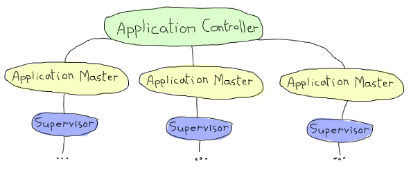

# Building OTP Applications

## [Why Would I Want That?]


. However, as for most abstractions made by programmers and engineers, OTP applications are the result of many ad-hoc systems being generalised and made clean. If you were to make an array of scripts and commands to start your supervision trees as described above, and that other developers you work with had their own, you'd quickly run into massive issues. Then someone would ask something like \"Wouldn't it be nice if everyone used the same kind of system to start everything? And wouldn't it even be nicer if they all had the same kind of application structure?\"
这是完全正确的，是的。这是一种可以接受的做事方式（尤其是关于云的部分，因为现在一切都与云计算有关）。然而，对于程序员和工程师所做的大多数抽象来说，OTP应用程序是许多特定系统被泛化并变得清晰的结果。如果你像上面所描述的那样制作一系列脚本和命令来启动你的监控树，并且与你一起工作的其他开发人员也有他们自己的，那么你很快就会遇到大量问题。然后有人会问这样的问题：“如果每个人都使用相同的系统来启动一切，那不是很好吗？如果他们都有相同的应用程序结构，那不是更好吗？”

OTP applications attempt to solve this exact type of problem. They give a directory structure, a way to handle configurations, a way to handle dependencies, create environment variables and configuration, ways to start and stop applications, and a lot of safe control in detecting conflicts and handling live upgrades them without shutting your applications down.
OTP应用程序试图解决这类问题。它们提供了目录结构、处理配置的方法、处理依赖关系的方法、创建环境变量和配置的方法、启动和停止应用程序的方法，以及在不关闭应用程序的情况下检测冲突和处理实时升级的大量安全控制。

So unless you don't want these aspects (nor the niceties they give, like consistent structures and tools developed for it), this chapter should be of some interest to you.
因此，除非你不想看到这些方面（也不想看到它们提供的细节，比如为其开发的一致的结构和工具），否则这一章应该会让你感兴趣。

## [My Other Car is a Pool]

We're going to reuse the `ppool` application we wrote for last chapter and turn it into a real OTP application.
我们将重用我们为上一章编写的“ppool”应用程序，并将其转化为一个真正的OTP应用程序。

The first step in doing so is to copy all the `ppool` related files into a neat directory structure:

``` expand
ebin/
include/
priv/
src/
 - ppool.erl
 - ppool_sup.erl
 - ppool_supersup.erl
 - ppool_worker_sup.erl
 - ppool_serv.erl
 - ppool_nagger.erl
test/
 - ppool_tests.erl
```

Most directories will for now remain empty. As explained in the [Designing a Concurrent Application](designing-a-concurrent-application.html#lay-them-foundation) chapter, the `ebin/` directory will hold compiled files, the `include/` directory will contain Erlang header (`.hrl`) files, `priv/` will hold executables, other programs, and various specific files needed for the application to work and `src/` will hold the Erlang source files you will need.
大多数目录目前仍为空。如[设计并发应用程序]（设计并发应用程序）中所述。html#奠定基础）第章，`ebin/`目录将保存已编译的文件，`include/`目录将包含Erlang头(`。hrl`）文件，`priv/`将保存应用程序运行所需的可执行文件、其他程序和各种特定文件，`src/`将保存您需要的Erlang源文件。


You'll note that I added a `test/` directory just for the test file I had before. The reason for this is that tests are somewhat common, but you don't necessarily want them distributed as part of your application --- you just need them when developing your code and justifying yourself to your manager (\"tests pass, I don't understand why the app killed people\"). Other directories like that end up being added as required, depending on the case. One example is the `doc/` directory, added whenever you have [EDoc](http://www.erlang.org/doc/apps/edoc/chapter.html) documentation to add to your application.
您会注意到，我只是为之前的测试文件添加了一个'test/'目录。这是因为测试有些常见，但你不一定希望它们作为应用程序的一部分分发——你只需要在开发代码和向经理证明自己的正当性时使用它们（“测试通过，我不明白为什么应用程序会杀人”）。其他类似的目录最终会根据需要添加，具体取决于具体情况。例如，`doc/`目录，只要有[EDoc]就可以添加(http://www。二郎。org/doc/apps/edoc/chapter。要添加到应用程序中的html）文档。

The four basic directories to have are `ebin/`, `include/`, `priv/` and `src/` and they'll be common to pretty much every OTP application you get, although only `ebin/` and `priv/` are going to be exported when real OTP systems are deployed.
四个基本目录分别是'ebin/'、'include/'、'priv/'和'src/'，它们在几乎所有OTP应用程序中都很常见，不过在部署真正的OTP系统时，只有'ebin/'和'priv/'会被导出。

## [The Application Resource File]

Where do we go from here? Well the first thing to do is to add an application file. This file will tell the Erlang VM what the application is, where it begins and where it ends. This file lives on in the `ebin/` directory, along with all the compiled modules.
我们该怎么办？首先要做的是添加一个应用程序文件。这个文件将告诉Erlang VM应用程序是什么，从哪里开始，从哪里结束。该文件与所有编译的模块一起保存在'ebin/'目录中。

This file is usually named `<yourapp>.app` (in our case `ppool.app`) and contains a bunch of Erlang terms defining the application in terms the VM can understand (the VM is pretty bad at guessing stuff!)
此文件通常命名为“<yourapp>。app`（在我们的例子中是'ppool。app`）并包含一系列Erlang术语，用VM可以理解的术语定义应用程序（VM在猜测方面非常糟糕！）

::: note
**Note:** some people prefer to keep this file outside of `ebin/` and instead have a file named `<myapp>.app.src` as part of `src/`. Whatever build system they use then copies this file over to `ebin/` or even generates one in order to keep everything clean.
**注意：*有些人更喜欢将此文件保存在“ebin/”之外，而使用名为“<myapp>。应用程序。src`作为'src'的一部分/`。他们使用的任何构建系统都会将该文件复制到“ebin/”甚至生成一个文件，以保持所有内容的整洁。
:::

The basic structure of the application file is simply:

### .

Where `ApplicationName`` tuples describing the application. They're used by OTP to figure out what your application does and whatnot, they're all optional, but might always be useful to carry around and necessary for some tools. In fact, we'll only look at a subset of them for now and introduce the others as we need them:
其中，`ApplicationName``描述应用程序的元组。OTP使用它们来了解你的应用程序做什么，等等，它们都是可选的，但可能总是有用的，对于某些工具来说是必要的。事实上，我们现在只看其中的一部分，并在需要时介绍其他部分：

### 

This gives the system a short description of what the application is. The field is optional and defaults to an empty string. I would suggest always defining a description, if only because it makes things easier to read.
这为系统提供了应用程序的简短描述。该字段是可选的，默认为空字符串。我建议总是定义一个描述，哪怕只是因为它让事情更容易阅读。

### 

Tells what's the version of your application. The string takes any format you want. It's usually a good idea to stick to a scheme of the form `<major>.<minor>.<patch>` or something like that. When we get to tools to help with upgrades and downgrades, the string is used to identify your application's version.
说明应用程序的版本。字符串可以采用您想要的任何格式。坚持一个“专业”的计划通常是个好主意。<minor>。或者类似的东西。当我们使用工具来帮助升级和降级时，字符串用于标识应用程序的版本。

### 

Contains a list of all the modules that your application introduces to the system. A module always belongs to at most one application and can not be present in two applications' app files at once. This list lets the system and tools look at dependencies of your application, making sure everything is where it needs to be and that you have no conflicts with other applications already loaded in the system. If you're using a standard OTP structure and are using a build tool like *rebar3*, this is handled for you.
包含应用程序引入系统的所有模块的列表。一个模块最多只能属于一个应用程序，不能同时出现在两个应用程序的应用程序文件中。此列表允许系统和工具查看应用程序的依赖关系，确保所有内容都在需要的位置，并且与系统中已加载的其他应用程序没有冲突。如果您使用的是标准的OTP结构，并且使用的是像*rebar3*这样的构建工具，那么这是为您处理的。

### 

Contains a list of all the names registered by the application. This lets OTP know when there will be name clashes when you try to bundle a bunch of applications together, but is entirely based on trusting the developers to give good data. We all know this isn't always the case, so blind faith shouldn't be used in this case.
包含应用程序注册的所有名称的列表。这让OTP知道，当你试图将一堆应用程序捆绑在一起时，什么时候会出现名称冲突，但这完全是基于信任开发人员提供良好的数据。我们都知道情况并非总是如此，所以在这种情况下不应该盲目相信。

### 

This is a list of key/values that can be used as a configuration for your application. They can be obtained at run time by calling `application:get_env(Key)` or `application:get_env(AppName, Key)`. The first one will try to find the value in the application file of whatever application you are in at the moment of the call, the second allows you to specify an application in particular. This stuff can be overwritten as required (either at boot time or by using `application:set_env/3-4`.
这是可以用作应用程序配置的键/值列表。它们可以在运行时通过调用'application:get_env（Key）'或'application:get_env（AppName，Key）'获得`。第一种方法将尝试在应用程序文件中查找调用时所处应用程序的值，第二种方法允许您指定特定的应用程序。可以根据需要覆盖这些内容（在启动时或使用'application:set_env/3-4'`。

All in all this is a pretty useful place to store configuration data rather than having a bunch of config files to read in whatever format, without really knowing where to store them and whatnot. People often tend to roll their own system over it anyway, given not everyone is a fan of using Erlang syntax in configuration files.
总而言之，这是一个非常有用的存储配置数据的地方，而不是有一堆配置文件以任何格式读取，而不知道在哪里存储它们等等。考虑到并非所有人都喜欢在配置文件中使用Erlang语法，人们通常倾向于在其上运行自己的系统。

### 

This is the maximum time that the application can run, after which it will be shut down. This is a rather rarely used item and `Milliseconds` defaults to `infinity`, so you often don't need to bother with this one at all.
这是应用程序可以运行的最长时间，之后将关闭。这是一个很少使用的项目，“毫秒”默认为“无穷大”，所以你通常根本不需要为这个项目操心。

### 

A list of applications on which yours depends. The application system of Erlang will make sure they were loaded and/or started before allowing yours to do so. All applications depend at least on `kernel` and `stdlib`, but if your application were to depend on `ppool` being started, then you should add `ppool` to the list.
你所依赖的应用程序列表。Erlang的应用系统将确保在允许您这样做之前加载和/或启动它们。所有应用程序都至少依赖于'kernel'和'stdlib'，但如果您的应用程序依赖于正在启动的'ppool'，那么您应该将'ppool'添加到列表中。

::: note
**Note:** yes, the standard library and the VM's kernel are applications themselves, which means that Erlang is a language used to build OTP, but whose runtime environment depends on OTP to work. It's circular. This gives you some idea of why the language is officially named 'Erlang/OTP'.
**注意：*是的，标准库和VM的内核本身就是应用程序，这意味着Erlang是一种用于构建OTP的语言，但其运行时环境依赖于OTP。它是圆形的。这让您了解了为什么该语言被正式命名为“Erlang/OTP”。
:::

### 

Defines a callback module for the application, using the application behaviour (which we will see in the [next section](building-otp-applications.html#the-application-behaviour) after their application.
使用应用程序行为（我们将在[下一节]（构建otp应用程序）中看到）为应用程序定义回调模块。html#应用程序行为）在应用程序之后。

And this covers most of what we might need for now (and for most applications you'll ever write).

### Converting the Pool

How about we put this into practice? We'll turn the `ppool` set of processes from last chapter into a basic OTP application. The first step for this is to redistribute everything under the right directory structure. Just create five directories and distribute the files as follows:
我们把它付诸实践怎么样？我们将把上一章中的“ppool”过程集变成一个基本的OTP应用程序。第一步是在正确的目录结构下重新分配所有内容。只需创建五个目录并按如下方式分发文件：

``` expand
ebin/
include/
priv/
src/
    - ppool.erl
    - ppool_serv.erl
    - ppool_sup.erl
    - ppool_supersup.erl
    - ppool_worker_sup.erl
test/
    - ppool_tests.erl
    - ppool_nagger.erl
```

You'll notice I moved the `ppool_nagger` to the test directory. This is for a good reason --- it was not much more than a demo case and would have nothing to do with our application, but is still necessary for the tests. We can actually try it later on once the app has all been packaged so we can make sure everything still works, but for the moment it's kind of useless.
你会注意到我把'ppool_nagger'移到了测试目录。这是一个很好的理由——它只不过是一个演示案例，与我们的应用程序无关，但对于测试来说仍然是必要的。实际上，我们可以在应用程序打包后再尝试，这样我们就可以确保一切正常，但目前它还没用。

We'll add an Emakefile (appropriately named `Emakefile`, placed in the app's base directory) to help us compile and run things later on:
我们将添加一个Emakefile（适当地命名为“Emakefile”，放在应用程序的基本目录中），以帮助我们以后编译和运行：

```erl
.
.
```

This just tells the compiler to include `debug_info` for all files in `src/` and `test/`, tells it to go look in the `include/` directory (if it's ever needed) and then shove the files up its `ebin/` directory.
这只是告诉编译器在'src/'和'test/'中包含所有文件的'debug_info'，告诉它去查找'include/'目录（如果需要的话），然后将文件推到'ebin/'目录。

Speaking of which, let's add the [app file](static/erlang/ppool-1.0/ebin/ppool.app.html) in the `ebin/` directory:
说到这里，让我们添加[app file]（static/erlang/ppool-1）。0/ebin/ppool。应用程序。html）在`ebin/`目录中：

```erl
{application, ppool,
 [,
  ,
  ,
  
 ]}.
```

This one only contains fields we find necessary; `env`, `maxT` and `applications` are not used. We now need to change how the callback module (`ppool`) works. How do we do that exactly?
这只包含我们认为必要的字段`不使用env`、`maxT`和`applications`。我们现在需要更改回调模块（`ppool`）的工作方式。我们到底该怎么做？

First, let's see the application behaviour.

::: note
**Note:** even though all applications depend on the `kernel` and the `stdlib` applications, I haven't included them. `ppool` will still work because starting the Erlang VM starts these applications automatically. You might feel like adding them for the sake of expliciteness, but there's no *need* for it right now.
**注意：*尽管所有应用程序都依赖于“kernel”和“stdlib”应用程序，但我没有包括它们。`由于启动Erlang虚拟机会自动启动这些应用程序，所以ppool`仍然可以工作。你可能想添加它们是为了明确起见，但现在没有必要这样做。
:::


!【模仿印第安纳·琼斯的场景，他用宝藏代替假体重】。金币上写着“通用”，假重量上写着“特定”。](。。/静态/img/印第安纳州。（gif）

## [The Application Behaviour]

As for most OTP abstractions we've seen, what we want is a pre-built implementation. Erlang programmers are not happy with design patterns as a convention, they want a solid abstraction for them. This gives us a behaviour for applications. Remember that behaviours are always about splitting generic code away from specific code. They denote the idea that your specific code gives up its own execution flow and inserts itself as a bunch of callbacks to be used by the generic code. In simpler words, behaviours handle the boring parts while you connect the dots. In the case of applications, this generic part is quite complex and not nearly as simple as other behaviours.
对于我们看到的大多数OTP抽象，我们想要的是一个预构建的实现。Erlang程序员不喜欢将设计模式作为惯例，他们希望为其提供一个坚实的抽象。这为我们提供了应用程序的行为。记住，行为总是关于将通用代码与特定代码分开。它们表示您的特定代码放弃了自己的执行流，并将自己作为一组回调插入到通用代码中。简单地说，当你连接这些点时，行为会处理那些无聊的部分。在应用程序中，这一通用部分相当复杂，不像其他行为那么简单。

Whenever the VM first starts up, a process called the *application controller* is started (with the name `application_controller`). It starts all other applications and sits on top of most of them. In fact, you could say the application controller acts a bit like a supervisor for all applications. We'll see what kind of supervision strategies there are in the [From Chaos to Application](building-otp-applications.html#from-chaos-to-application) section.
每当VM第一次启动时，就会启动一个名为“应用程序控制器”的进程（名为“应用程序控制器”）。它启动所有其他应用程序，并位于大多数应用程序之上。实际上，您可以说应用程序控制器的行为有点像所有应用程序的主管。我们将看看[从混乱到应用]（构建otp应用程序）中有什么样的监管策略。html#从混乱到应用）部分。

::: note
**Note:** the Application Controller technically doesn't sit over all the applications. One exception is the kernel application, which itself starts a process named `user`. The `user` process in fact acts as a group leader to the application controller and the kernel application thus needs some special treatment. We don't have to care about this, but I felt like it should be included for the sake of precision.
**注意：*从技术上讲，应用程序控制器并不能覆盖所有的应用程序。一个例外是内核应用程序，它本身启动一个名为“user”的进程`。“用户”进程实际上是应用程序控制器的组长，因此内核应用程序需要特殊处理。我们不必关心这个，但我觉得为了精确起见，应该把它包括在内。

In Erlang, the IO system depends on a concept called a *group leader*. The group leader represents standard input and output and is inherited by all processes. There is a hidden [IO protocol](http://erlang.org/doc/apps/stdlib/io_protocol.html) that the group leader and any process calling IO functions communicate with. The group leader then takes the responsibility of forwarding these messages to whatever input/output channels there are, weaving some magic that doesn't concern us within the confines of this text.
在Erlang中，IO系统依赖于一个名为*组长的概念*。组长代表标准的输入和输出，并由所有流程继承。有一个隐藏的[IO协议](http://erlang。org/doc/apps/stdlib/io_协议。组组长和任何调用IO函数的进程与之通信。然后，组长负责将这些消息转发到任何输入/输出通道，在本文的范围内编织一些与我们无关的魔法。
:::

Anyway, when someone decides they want to start an application, the application controller (often noted *AC* in OTP parlance) starts an *application master*. The application master is in fact two processes taking charge of each individual application: they set it up and act like a middleman in between your application's top supervisor and the application controller. OTP is a bureaucracy, and we have many layers of middle-management! I won't get into the details of what happens in there as most Erlang developers will never actually need to care about that and very little documentation exists (the code is the documentation). Just know that the application master acts a bit like the app's nanny (well, a pretty insane nanny). It looks over its children and grandchildren, and when things go awry, it goes berserk and terminates its whole family tree. Brutally killing children is a common topic among Erlangers.
无论如何，当有人决定要启动一个应用程序时，应用程序控制器（在OTP术语中通常被称为*AC*）会启动一个*application master*。应用程序主程序实际上是两个进程，负责每个应用程序：它们设置应用程序，并充当应用程序的最高主管和应用程序控制器之间的中间人。OTP是一个官僚机构，我们有许多中层管理人员！我不会详细介绍其中发生的事情，因为大多数Erlang开发人员根本不需要关心这一点，而且几乎没有文档（代码就是文档）。nanny应用程序有点疯狂（nanny应用程序有点疯狂）。它会照顾自己的孩子和孙子，当事情发生差错时，它会发疯，终止它的整个家谱。残忍地杀害儿童是爱尔兰人的共同话题。

An Erlang VM with a bunch of applications might look a bit like this:


`. For now, the `Type`, it simply defaults to `[]`.
第一个是'YourMod:start（Type，Args）`。目前，“Type”只是默认为“[]`。

The `stop/1` function takes the state returned by `start/2` as an argument. It runs after the application is done running and only does the necessary cleanup.
'stop/1'函数将'start/2'返回的状态作为参数。它在应用程序运行完毕后运行，只进行必要的清理。

That's it. A huge generic part, a tiny specific one. Be thankful for that, because you wouldn't want to write the rest of things too often (just look at the source if you feel like it!) There are a few more functions that you can optionally use to have more control over the application, but we don't need them for now. This means we can move forward with our `ppool` application!
就这样。一个巨大的通用部分，一个微小的特定部分。对此要心存感激，因为你不想太频繁地写剩下的东西（如果你喜欢，只需查看源代码！）您还可以选择使用其他一些函数来更好地控制应用程序，但我们目前不需要它们。这意味着我们可以继续使用“ppool”应用程序！

## [From Chaos to Application]

We have the app file and a general idea of how applications work. Two simple callbacks. Opening [ppool.erl](static/erlang/ppool-1.0/src/ppool.erl.html "this is the resulting file"), we change the following lines:
我们有应用程序文件和应用程序工作原理的一般概念。两个简单的回调。打开[ppool]。erl]（静态/erlang/ppool-1）。0/src/ppool。呃。html“这是结果文件”），我们更改以下行：

```erl
-export([start_link/0, stop/0, start_pool/3,
         run/2, sync_queue/2, async_queue/2, stop_pool/1]).

start_link() ->
    ppool_supersup:start_link().

stop() ->
    ppool_supersup:stop().
```

To the following ones instead:

```erl
-behaviour(application).
-export([start/2, stop/1, start_pool/3,
         run/2, sync_queue/2, async_queue/2, stop_pool/1]).

start(normal, _Args) ->
    ppool_supersup:start_link().

stop(_State) ->
    ok.
```

We can then make sure the tests are still valid. Pick the old [ppool_tests.erl](static/erlang/ppool-1.0/test/ppool_tests.erl.html "this is the resulting file") file (I wrote it for the previous chapter and am bringing it back here) and replace the single call to `ppool:start_link/0` to `application:start(ppool)` as follows:
然后我们可以确保测试仍然有效。选择旧的[ppool_]测试。erl]（静态/erlang/ppool-1）。0/测试/ppool_测试。呃。html“这是结果文件”）文件（我为上一章编写了它，并将其带回这里），并将对`ppool:start_link/0`的单个调用替换为`application:start（ppool）`如下所示：

```erl
find_unique_name() ->
    application:start(ppool),
    Name = list_to_atom(lists:flatten(io_lib:format("~p",[now()]))),
    ?assertEqual(undefined, whereis(Name)),
    Name.
```

You should also take the time to remove `stop/0` from [`ppool_supersup`](static/erlang/ppool-1.0/src/ppool_supersup.erl.html) (and remove the export), because the OTP application tools will take care of that for us.
您还应该花时间从[`ppool_supersup`]（static/erlang/ppool-1）中删除`stop/0`。0/src/ppool\u supersup。呃。（并删除导出），因为OTP应用程序工具将为我们解决这一问题。

We can finally recompile the code and run all the tests to make sure everything still works (we'll see how that *eunit* thing works later on, don't worry):
我们最终可以重新编译代码并运行所有测试，以确保一切正常（稍后我们将看到*eunit*的工作原理，别担心）：

```eshell
$ erl -make
Recompile: src/ppool_worker_sup
Recompile: src/ppool_supersup
...
$ erl -pa ebin/
...
1> make:all([load]).
Recompile: src/ppool_worker_sup
Recompile: src/ppool_supersup
Recompile: src/ppool_sup
Recompile: src/ppool_serv
Recompile: src/ppool
Recompile: test/ppool_tests
Recompile: test/ppool_nagger
up_to_date
2> eunit:test(ppool_tests).
  All 14 tests passed.
ok
```

The tests take a while to run due to `timer:sleep(X)` being used to synchronise everything in a few places, but it should tell you everything works, as shown above. Good news, our app is healthy.
由于“timer:sleep（X）”被用来在几个地方同步所有内容，测试需要一段时间才能运行，但它应该告诉您所有内容都是有效的，如上图所示。好消息，我们的应用程序是健康的。

We can now study the wonders of OTP applications by using our new awesome callbacks:

```eshell
3> application:start(ppool).
ok
4> ppool:start_pool(nag, 2, ).

5> ppool:run(nag, [make_ref(), 500, 10, self()]).

6> ppool:run(nag, [make_ref(), 500, 10, self()]).

7> ppool:run(nag, [make_ref(), 500, 10, self()]).
noalloc
9> flush().
Shell got 
Shell got 
...
received down msg
received down msg
```

The magic command here is `application:start(ppool)`. This tells the application controller to launch our ppool application. It starts the `ppool_supersup` supervisor and from that point on, everything can be used as normal. We can see all the applications currently running by calling `application:which_applications()`:
这里的神奇命令是'application:start（ppool）`。这会告诉应用程序控制器启动我们的ppool应用程序。它启动了“ppool_supersup”管理器，从那时起，一切都可以正常使用。我们可以通过调用“application:which_applications（）”来查看当前运行的所有应用程序：

```eshell
10> application:which_applications().
[,
 ,
 ]
```

What a surprise, `ppool` is running. As mentioned earlier, we can see that all applications depend on `kernel` and `stdlib`, which are both running. If we want to close the pool:
多么令人惊讶，'ppool'正在运行。如前所述，我们可以看到所有应用程序都依赖于“kernel”和“stdlib”，它们都在运行。如果我们想关闭游泳池：

```eshell
11> application:stop(ppool).

=INFO REPORT==== DD-MM-YYYY::23:14:50 ===
    application: ppool
    exited: stopped
    type: temporary
ok
```

And it is done. You should notice that we now get a clean shutdown with a little informative report rather than the messy `** exception exit: killed` from last chapter.
事情就这样结束了。你应该注意到，我们现在得到了一个干净的关机，有一个信息量小的报告，而不是上一章中混乱的“**异常退出：killed”。

::: note
**Note:** You'll sometimes see people do something like `MyApp:start(...)` instead of `application:start(MyApp)`. While this works for testing purposes, it's ruining a lot of the advantages of actually having an application: it's no longer part of the VM's supervision tree, can not access its environment variables, will not check dependencies before being started, etc. Try to stick to `application:start/1` if possible.
**注意：*你有时会看到人们做一些类似“MyApp:start”的事情(。。。)`而不是“应用程序：开始（MyApp）”`。虽然这可以用于测试目的，但它破坏了实际拥有应用程序的许多优势：它不再是VM的监控树的一部分，无法访问其环境变量，在启动之前不会检查依赖关系，等等。如果可能的话，尽量坚持“应用程序：开始/1”。
:::

Look at this! What's that thing about our app being *temporary*? We write Erlang and OTP stuff because it's supposed to run forever, not just for a while! How dare the VM say this? The secret is that we can give different arguments to `application:start`. Depending on the arguments, the VM will react differently to termination of one of its applications. In some cases, the VM will be a loving beast ready to die for its children. In other cases, it's rather a cold heartless and pragmatic machine willing to tolerate many of its children dying for the survival of its species.
看看这个！我们的应用程序是临时的，这是什么意思？我们写Erlang和OTP的东西是因为它应该永远运行，而不仅仅是一段时间！虚拟机怎么敢这么说？秘密在于，我们可以为“application:start”提供不同的参数`。根据参数的不同，VM对终止其一个应用程序的反应会有所不同。在某些情况下，虚拟机将是一个充满爱的野兽，随时准备为自己的孩子而死。在其他情况下，它是一台冷酷无情、务实的机器，愿意容忍许多儿童为其物种的生存而死去。

Application started with: `application:start(AppName, temporary)`
:   Ends normally: Nothing special happens, the application has stopped.
:   Ends abnormally: The error is reported, and the application terminates without restarting.

Application started with: `application:start(AppName, transient)`
:   Ends normally: Nothing special happens, the application has stopped.
:   Ends abnormally: The error is reported, all the other applications are stopped and the VM shuts down.
：异常结束：报告错误，所有其他应用程序停止，VM关闭。

Application started with: `application:start(AppName, permanent)`
:   Ends normally: All other applications are terminated and the VM shuts down.
:   Ends abnormally: Same; all applications are terminated, the VM shuts down.

You can see something new in the supervision strategies when it comes to applications. No longer will the VM try to save you. At this point, something has had to go very, very wrong for it to go up the whole supervision tree of one of its vital applications, enough to crash it. When this does happen, the VM has lost all hope in your program. Given the definition of insanity is to do the same thing all over again while expecting different outcomes each time, the VM prefers to die sanely and just give up. Of course the real reason has to do with something being broken that needs to be fixed, but you catch my drift. Take note that all applications can be terminated by calling `application:stop(AppName)` without affecting others as if a crash had occurred.
当涉及到应用程序时，你可以在监督策略中看到一些新的东西。虚拟机将不再试图拯救你。在这一点上，它必须出非常非常大的问题，才能进入它的一个重要应用程序的整个监控树，足以使它崩溃。当这种情况发生时，虚拟机已经对您的程序失去了所有希望。考虑到精神错乱的定义是一遍又一遍地做同样的事情，同时每次都期待着不同的结果，虚拟机更愿意理智地死去，然后放弃。当然，真正的原因与一些需要修复的损坏有关，但你明白我的意思。请注意，所有应用程序都可以通过调用“application:stop（AppName）`来终止，而不会像发生崩溃一样影响其他应用程序。

## [Library Applications]

What happens when we want to wrap flat modules in an application but we have no process to start and thus no need for an application callback module?
当我们想在应用程序中封装平面模块，但我们没有流程启动，因此不需要应用程序回调模块时，会发生什么？

After pulling our hair and crying in rage for a few minutes, the only other thing left to do is to remove the tuple `` from the application file. That's it. This is called a *library application*. If you want an example of one, the Erlang `stdlib` (standard library) application is one of these.
拉扯头发，愤怒地哭了几分钟后，剩下的唯一一件事就是从应用程序文件中删除元组``。就这样。这被称为*库应用程序*。如果您想要一个例子，Erlang`stdlib`（标准库）应用程序就是其中之一。

If you have the source package of Erlang, you can go to `otp_src_<release>/lib/stdlib/src/stdlib.app.src` and see the following:
如果你有Erlang的源代码包，你可以去'otp_src_u2;<release>/lib/stdlib/src/stdlib。应用程序。src`并参见以下内容：

```erl
{application, stdlib,
 [,
  ,
  {modules, [array,
     ...
     gen_event,
     gen_fsm,
     gen_server,
     io,
     ...
     lists,
     ...
     zip]},
  {registered,[timer_server,rsh_starter,take_over_monitor,pool_master,
               dets]},
  ,
  .
```

You can see it's a pretty standard application file, but without the callback module. A library application.
你可以看到它是一个非常标准的应用程序文件，但是没有回调模块。图书馆应用程序。

How about we go deeper with applications?
