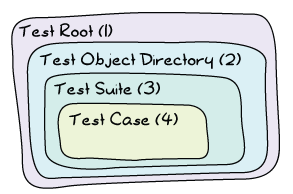

# Common Test for Uncommon Tests

A few chapters ago, we've seen how to use EUnit to do unit and module testing, and even some concurrent testing. At that point, EUnit started to show its limits. Complex setups and longer tests that needed to interact between each other became problematic. Plus, there was nothing in there to handle our new knowledge of distributed Erlang and all of its power. Fortunately, there's another test framework that exists, this one more appropriate to the heavy lifting we now want to do.
几章前，我们已经看到了如何使用EUnit进行单元和模块测试，甚至一些并发测试。在那一点上，尤尼特开始展示自己的极限。复杂的设置和需要彼此交互的较长测试成为问题。此外，这里没有任何东西可以处理我们对分布式Erlang及其所有功能的新知识。幸运的是，还有另一个测试框架，这个框架更适合我们现在想要做的繁重工作。


## [What is Common Test]

As programmers, we enjoy treating our programs as black boxes. Many of us would define the core principle behind a good abstraction as being able to replace whatever it is we've written by an anonymous black box. You put something in the box, you get something out of it. You don't care how it works on the inside, as long as you get what you want.
作为程序员，我们喜欢把程序当作黑匣子。我们中的许多人都会将一个好的抽象背后的核心原则定义为能够用一个匿名的黑盒来替换我们所写的任何东西。你把东西放进盒子里，你就能从里面得到东西。只要你得到你想要的，你不在乎它在里面是如何工作的。

In the testing world, this has an important connection to how we like to test systems. When we were working with EUnit, we've seen how to treat a module as a *black box*: you only test the exported functions and none of the ones inside, which are not exported. I've also given examples on testing items as a *white box*, like in the case of the process quest player module's tests, where we looked at the innards of the module to make its testing simpler. This was necessary because the interaction of all the moving parts inside the box made testing it from the outside very complex.
在测试领域，这与我们喜欢如何测试系统有着重要的联系。当我们与EUnit合作时，我们已经看到了如何将模块视为一个“黑匣子”：您只测试导出的函数，而不测试内部的函数，这些函数不会导出。我还以“白盒”的形式给出了测试项目的例子，比如在process quest player模块的测试中，我们查看了模块的内部结构，以简化测试。这是必要的，因为盒子内所有运动部件的相互作用使得从外部进行测试非常复杂。

That was for modules and functions. What if we zoom out a bit? Let's fiddle with our scope in order to see the broader picture. What if what we want to test is a library? What if it's an application? Even broader, what if it's a complete system? Then what we need is a tool that's more adept at doing something called *system testing*.
这是针对模块和函数的。如果我们缩小一点呢？让我们摆弄一下我们的范围，以便看到更广阔的前景。如果我们要测试的是一个库呢？如果它是一个应用程序呢？更广泛地说，如果它是一个完整的系统呢？那么我们需要的是一个更擅长做系统测试的工具*。

EUnit is a pretty good tool for white box testing at a module level. It's a decent tool to test libraries and OTP applications. It's possible to do system testing and black box testing, but it's not optimal.
EUnit是一个非常好的模块级白盒测试工具。这是一个测试库和OTP应用程序的好工具。可以进行系统测试和黑盒测试，但这不是最优的。

Common Test, however, is pretty damn good at system testing. It's decent for testing libraries and OTP applications, and it's possible, but not optimal, to use it to test individual modules. So the smaller what you test is, the more appropriate (and flexible, and fun) EUnit will be. The larger your test is, the more appropriate (and flexible, and, uh, somewhat fun) Common Test will be.
然而，普通测试非常擅长系统测试。它非常适合测试库和OTP应用程序，而且使用它来测试单个模块是可能的，但不是最佳的。因此，你测试的内容越小，EUnit就越合适（灵活、有趣）。你的测试越大，普通测试就越合适（也更灵活，而且，嗯，有点有趣）。

You might have heard of Common Test before and tried to understand it from the documentation given with Erlang/OTP. Then you likely gave up real quick. Don't worry. The problem is that Common Test is very powerful and has an accordingly long user guide, and that at the time of this writing, most of its documentation appears to be coming from internal documentation from the days when it was used only within the walls of Ericsson. In fact, its documentation is more of a reference manual for people who already understand it than a tutorial.
您以前可能听说过Common Test，并试图从Erlang/OTP提供的文档中理解它。然后你很可能很快就放弃了。别担心。问题在于，Common Test功能强大，用户指南也很长，在撰写本文时，它的大部分文档似乎都来自内部文档，而这些文档都是在爱立信内部使用的。事实上，它的文档对于已经理解它的人来说，更像是一本参考手册，而不是教程。

In order to properly learn Common Test, we'll have to start from the simplest parts of it and slowly grow our way to system tests.
为了正确地学习通用测试，我们必须从最简单的部分开始，慢慢发展到系统测试。

## [Common Test Cases]

Before even getting started, I have to give you a little overview of how Common Test organises its things. First of all, because Common Test is appropriate for system testing, it will assume two things:
在开始之前，我必须向你们简要介绍一下Common Test是如何组织工作的。首先，因为通用测试适用于系统测试，所以它将假设两件事：

1.  We will need data to instantiate our stuff
2.  We will need a place to store all that side-effecty stuff we do, because we're messy people.

Because of this, Common Test will regularly be organized as follows:


![显示嵌套框的图表]。最外层是测试根，标记为（1）。其中一个是测试对象目录，标记为（2）。里面（2）是测试套件（3），套件中最里面的盒子是测试用例（4）。](。。/静态/img/ct结构。（巴布亚新几内亚）

The test case is the simplest one. It's a bit of code that either fails or succeeds. If the case crashes, the test is unsuccessful (how surprising). Otherwise, the test case is thought to be successful. In Common Test, test cases are single functions. All these functions live in a test suite (3), a module that takes care of regrouping related test cases together. Each test suite will then live in a directory, the Test Object Directory (2). The test root (1) is a directory that contains many test object directories, but due to the nature of OTP applications often being developed individually, many Erlang programmers tend to omit that layer.
测试用例是最简单的。这是一段要么失败，要么成功的代码。如果案例崩溃，测试将失败（多么令人惊讶）。否则，测试用例被认为是成功的。在普通测试中，测试用例是单个函数。所有这些功能都存在于一个测试套件（3）中，这是一个负责将相关测试用例重新组合在一起的模块。然后，每个测试套件将位于一个目录中，即测试对象目录（2）。测试根目录（1）是一个包含许多测试对象目录的目录，但由于OTP应用程序通常是单独开发的，因此许多Erlang程序员倾向于忽略该层。

In any case, now that we understand that organisation, we can go back to our two assumptions (we need to instantiate stuff, and then mess stuff up). Each test suite is a module that ends with `_SUITE`. If I were to test the magic 8-ball application from last chapter, I might thus call my suite `m8ball_SUITE`. Related to that one is a directory called the *data directory*. Each suite is allowed to have one such directory, usually named `Module_SUITE_data/`. In the case of the magic 8-ball app, it would have been `m8ball_SUITE_data/`. That directory contains anything you want.
在任何情况下，既然我们了解了这个组织，我们可以回到我们的两个假设（我们需要实例化一些东西，然后把它们搞砸）。每个测试套件都是一个以`_套件结尾的模块`。如果我要测试上一章中的魔法8球应用程序，我可能会因此将我的套件命名为“m8ball_套件”`。与之相关的是一个名为*数据目录的目录*。每个套件都可以有一个这样的目录，通常名为“模块套件数据”/`。在magic 8-ball应用程序中，它应该是“m8ball_SUITE_数据”/`。这个目录包含你想要的任何东西。

What about the side-effects? Well because we might run tests many times, Common Test develops its structure a bit more:
副作用呢？因为我们可能会多次运行测试，所以Common Test会进一步发展其结构：


. When doing so, it will create a unique directory where you can store your data. That directory (*Priv Dir* above), along with the data directory, will be passed as part of some initial state to each of your tests. You're then free to write whatever you want in that private directory, and then inspect it later, without running the risk of overwriting something important or the results of former test runs.
无论何时运行测试，Common Test都会找到一些地方来记录内容（通常是当前目录，但稍后我们将看到如何配置它）。这样做时，它将创建一个唯一的目录，您可以在其中存储数据。该目录（*Priv Dir*上图）以及数据目录将作为初始状态的一部分传递给每个测试。然后，您可以自由地在该私有目录中写入任何您想要的内容，然后在以后检查它，而不必冒着覆盖重要内容或以前测试运行结果的风险。

Enough with this architectural material; we're ready to write our first simple test suite. Create a directory named `ct/` (or whatever you'd like, this is hopefully a free country, after all). That directory will be our test root. Inside of it, we can then make a directory named `demo/` for the simpler tests we'll use as examples. This will be our test object directory.
这种建筑材料已经够了；我们已经准备好编写第一个简单的测试套件。创建一个名为“ct/”的目录（或者不管你喜欢什么，这毕竟是一个自由的国家）。该目录将成为我们的测试根目录。在其中，我们可以创建一个名为“demo/”的目录，用于我们将用作示例的更简单的测试。这将是我们的测试对象目录。

Inside the test object directory, we'll begin with a module named [basic_SUITE.erl](static/erlang/ct/demo/basic_SUITE.erl.html), to see the most basic stuff possible. You can omit creating the `basic_SUITE_data/` directory --- we won't need it for this run. Common Test won't complain.
在测试对象目录中，我们将从名为[basic_SUITE]的模块开始。erl]（静态/erlang/ct/demo/basic_套件）。呃。html），以查看最基本的内容。您可以省略创建'basic_SUITE_data/'目录——我们在这次运行中不需要它。普通测试不会抱怨。

Here's what the module looks like:

```erl
-module(basic_SUITE).
-include_lib("common_test/include/ct.hrl").
-export([all/0]).
-export([test1/1, test2/1]).

all() -> [test1,test2].

test1(_Config) ->
    1 = 1.

test2(_Config) ->
    A = 0,
    1/A.
```

Let's study it step by step. First of all, we've got to include the file `"common_test/include/ct.hrl"`. That file gives a few useful macros, and even though `basic_SUITE` doesn't use them, it's usually a good habit of including that file.
让我们一步一步地研究它。首先，我们必须包含文件“common_test/include/ct”。hrl“`。该文件提供了一些有用的宏，尽管“basic_SUITE”不使用它们，但通常包含该文件是一个好习惯。

Then we have the function `all/0`. That function returns a list of test cases. It's basically what tells Common Test \"hey, I want to run these test cases!\". EUnit would do it based on the name (`*_test()` or `*_test_()`); Common Test does it with an explicit function call.
然后我们有函数'all/0`。该函数返回测试用例列表。它基本上是告诉普通测试“嘿，我想运行这些测试用例！”。EUnit会根据名称（`*\u test（）`或`*\u test（）`）来做这件事；公共测试通过显式函数调用来实现。


![文件夹放在地板上，到处都是纸。其中一个文件夹的标签是“数据”，另一个文件夹的标签是“非色情”(。。/静态/img/priv_dir。（巴布亚新几内亚）

What about these `_Config` variables? They're unused for now, but for your own personal knowledge, they contain the initial state your test cases will require. That state is literally a proplist, and it initially contains two values, `data_dir` and `priv_dir`, the two directories we have for our static data and the one where we can mess around.
那么这些变量呢？它们目前尚未使用，但就您个人而言，它们包含测试用例所需的初始状态。这个状态实际上是一个proplist，它最初包含两个值，'data_dir'和'priv_dir'，这两个目录是我们用于静态数据的，也是我们可以随意处理的。

We can run the tests either from the command line or from an Erlang shell. If you use the command line, you can call `$ ct_run -suite Name_SUITE`. In Erlang/OTP versions before R15 (released around December 2011), the default command was `run_test` instead of `ct_run` (although some systems had both already). The name was changed with the objective of minimizing the risk of name clashes with other applications by moving to a slightly less generic name. Running it, we find:
我们可以从命令行或Erlang shell运行测试。如果使用命令行，可以调用“$ct\u run-suite Name\u suite”`。在R15之前的Erlang/OTP版本（2011年12月左右发布）中，默认命令是“run_test”，而不是“ct_run”（尽管有些系统已经同时使用了这两个命令）。更改名称的目的是通过使用稍微不那么通用的名称，将名称与其他应用程序冲突的风险降至最低。运行它，我们发现：

```eshell
ct_run -suite basic_SUITE
...
Common Test: Running make in test directories...
Recompile: basic_SUITE
...
Testing ct.demo.basic_SUITE: Starting test, 2 test cases

- - - - - - - - - - - - - - - - - - - - - - - - - -
basic_SUITE:test2 failed on line 13
Reason: badarith
- - - - - - - - - - - - - - - - - - - - - - - - - -

Testing ct.demo.basic_SUITE: *** FAILED *** test case 2 of 2
Testing ct.demo.basic_SUITE: TEST COMPLETE, 1 ok, 1 failed of 2 test cases

Updating /Users/ferd/code/self/learn-you-some-erlang/ct/demo/index.html... done
Updating /Users/ferd/code/self/learn-you-some-erlang/ct/demo/all_runs.html... done
```

And we find that one of our two test cases fails. We also see that we apparently inherited a bunch of HTML files. Before looking to know what this is about, let's see how to run the tests from the Erlang shell:
我们发现我们的两个测试用例中有一个失败了。我们还看到，我们显然继承了一堆HTML文件。在了解这是怎么回事之前，让我们先看看如何从Erlang shell运行测试：

```eshell
$ erl
...
1> ct:run_test([]).
...
Testing ct.demo.basic_SUITE: Starting test, 2 test cases

- - - - - - - - - - - - - - - - - - - - - - - - - -
basic_SUITE:test2 failed on line 13
Reason: badarith
- - - - - - - - - - - - - - - - - - - - - - - - - -
...
Updating /Users/ferd/code/self/learn-you-some-erlang/ct/demo/index.html... done
Updating /Users/ferd/code/self/learn-you-some-erlang/ct/demo/all_runs.html... done
ok
```

I've removed a bit of the output above, but it gives exactly the same result as the command line version. Let's see what's going on with these HTML files:
我删除了上面的一些输出，但它给出的结果与命令行版本完全相同。让我们看看这些HTML文件是怎么回事：

```eshell
$ ls
all_runs.html
basic_SUITE.beam
basic_SUITE.erl
ct_default.css
ct_run.NodeName.YYYY-MM-DD_20.01.25/
ct_run.NodeName.YYYY-MM-DD_20.05.17/
index.html
variables-NodeName
```

Oh what the hell did Common Test do to my beautiful directory? It is a shameful thing to look at. We've got two directories there. Feel free to explore them if you feel adventurous, but all the cowards like me will prefer to instead look at either the `all_runs.html` or the `index.html` files. The former will link to indexes of all iterations of the tests you ran while the latter will link to the newest runs only. Pick one, and then click around in a browser (or press around if you don't believe in mice as an input device) until you find the test suite with its two tests:
哦，普通测试对我美丽的目录做了什么？这是一件可耻的事情。我们有两个目录。如果你觉得有冒险精神，可以自由探索它们，但像我这样的懦夫会更喜欢看“所有跑步”。html`或`索引。html文件。前者将链接到您运行的所有测试迭代的索引，而后者将只链接到最新的运行。选择一个，然后在浏览器中四处点击（如果你不相信鼠标是一种输入设备，也可以按左右键），直到找到包含两个测试的测试套件：


You see that `test2` failed. if you click on the underlined line number, you'll see a raw copy of the module. If you instead click on the `test2` link, you'll see a detailed log of what happened:
你看到test2失败了吗。如果你点击带下划线的行号，你会看到模块的原始副本。如果你点击“test2”链接，你会看到一个详细的日志：

```eshell
=== source code for basic_SUITE:test2/1 
=== Test case started with:
basic_SUITE:test2(ConfigOpts)
=== Current directory is "Somewhere on my computer"
=== Started at 2012-01-20 20:05:17
[Test Related Output]
=== Ended at 2012-01-20 20:05:17
=== location [,
              ,
              ,
              ]
=== reason = bad argument in an arithmetic expression
  in function  basic_SUITE:test2/1 (basic_SUITE.erl, line 13)
  in call from test_server:ts_tc/3 (test_server.erl, line 1635)
  in call from test_server:run_test_case_eval1/6 (test_server.erl, line 1182)
  in call from test_server:run_test_case_eval/9 (test_server.erl, line 1123)
```

The log lets you know precisely what failed, and it is much more detailed than whatever we had in the Erlang shell. This is important to remember because if you're a shell user, you'll find Common Test extremely painful to use. If you're a person more prone to use GUIs anyway, then it'll be pretty fun for you.
日志让您准确地知道失败的原因，它比我们在Erlang shell中拥有的更详细。记住这一点很重要，因为如果你是一个shell用户，你会发现使用普通测试非常痛苦。如果你是一个更倾向于使用GUI的人，那么这对你来说会很有趣。

But enough wandering around pretty HTML files, let's see how to test with some more state.

::: note
**Note:** if you ever feel like traveling back in time without the help of a time machine, download a version of Erlang prior to R15B and use Common Test with it. You'll be astonished to see that your browser and the logs' style brought you back into the late 1990s.
**注：*如果你想在没有时间机器的帮助下回到过去，请下载R15B之前的Erlang版本，并使用通用测试。你会惊讶地发现，你的浏览器和日志风格让你回到了20世纪90年代末。
:::

## [Testing With State]

If you have read the EUnit chapter (and haven't skipped around), you'll remember that EUnit had these things called *fixtures*, where we'd give a test case some special instantiation (setup) and teardown code to be called before and after the case, respectively.
如果你读过EUnit一章（没有跳过），你会记得EUnit有一个叫做*fixtures*的东西，我们会给一个测试用例一些特殊的实例化（设置）和拆卸代码，分别在用例之前和之后调用。

Common Test follows that concept. Instead of having EUnit-style fixtures, it instead relies on two functions. The first is the setup function, called `init_per_testcase/2` and the second one is the teardown function, called `end_per_testcase/2`. To see how they're used, create a new test suite called [state_SUITE](static/erlang/ct/demo/state_SUITE.erl.html) (still under the `demo/` directory), add the following code:
普通测试遵循这个概念。它没有EUnit风格的固定装置，而是依赖于两个功能。第一个是setup函数，名为'init_per_testcase/2'，第二个是teardown函数，名为'end_per_testcase/2'`。要查看它们是如何使用的，请创建一个名为[state_suite]（static/erlang/ct/demo/state_suite）的新测试套件。呃。html）（仍在'demo/`目录下），添加以下代码：

```erl
-module(state_SUITE).
-include_lib("common_test/include/ct.hrl").

-export([all/0, init_per_testcase/2, end_per_testcase/2]).
-export([ets_tests/1]).

all() -> [ets_tests].

init_per_testcase(ets_tests, Config) ->
    TabId = ets:new(account, [ordered_set, public]),
    ets:insert(TabId, ),
    ets:insert(TabId, ),
    ets:insert(TabId, ),
    [ | Config].

end_per_testcase(ets_tests, Config) ->
    ets:delete(?config(table, Config)).

ets_tests(Config) ->
    TabId = ?config(table, Config),
    [] = ets:lookup(TabId, david),
    steve = ets:last(TabId),
    true = ets:insert(TabId, ),
    zachary = ets:last(TabId).
```

This is a little normal ETS test checking a few `ordered_set` concepts. What's interesting about it is the two new functions, `init_per_testcase/2` and `end_per_testcase/2`. Both functions need to be exported in order to be called. If they're exported, the functions are going to be called for *all* test cases in a module. You can separate them based on the arguments. The first one is the name of the test case (as an atom), and the second one is the `Config` proplist that you can modify.
这是一个普通的ETS测试，检查一些“有序集合”概念。有趣的是两个新函数，`init_per_testcase/2`和`end_per_testcase/2'`。两个函数都需要导出才能调用。如果导出了这些函数，则会为模块中的*all*测试用例调用这些函数。你可以根据论点把它们分开。第一个是测试用例的名称（作为atom），第二个是可以修改的`Config`proplist。

::: note
**Note:** to read from `Config` as a proplist without worrying about it ever breaking.
:::

As an example, if I had tests `a`, `b`, and `c` and only wanted a setup and teardown function for the first two tests, my init function might look like this:
举个例子，如果我有测试'a'、'b'和'c'，并且在前两个测试中只需要一个setup和teardown函数，那么我的init函数可能如下所示：

```erl
init_per_testcase(a, Config) ->
    [ | Config];
init_per_testcase(b, Config) ->
    [ | Config];
init_per_testcase(_, Config) ->
    %% ignore for all other cases
    Config.
```

And similarly for the `end_per_testcase/2` function.

Looking back at `state_SUITE`, you can see the test case, but what's interesting to note is how I instantiate the ETS table. I specify no heir, and yet, the tests run without a problem after the init function is done.
回顾一下“state_SUITE”，你可以看到测试用例，但有趣的是我是如何实例化ETS表的。我没有指定继承人，但是在init函数完成后，测试运行没有问题。

You'll remember that we've seen, in the [ETS chapter](ets.html), that ETS tables are usually owned by the process that started them. In this case, we leave the table as it is. If you run the tests, you'll see the suite succeeds.
你会记得我们在[ETS章节]（ETS）中看到的。ETS表通常由启动它们的进程拥有。在这种情况下，我们让桌子保持原样。如果运行测试，您将看到套件成功。

What we can infer from this is that the `init_per_testcase` and `end_per_testcase` functions run in the same process as the test case itself. You can thus safely do things like set links, start tables and whatnot without worrying about different processes breaking your things. What about errors in the test case? Fortunately, crashing in your test case won't stop Common Test from cleaning up and calling the `end_per_testcase` function, with the exception of `kill` exit signals.
我们可以由此推断，`init_per_testcase`和`end_per_testcase`函数与测试用例本身在同一个过程中运行。因此，您可以安全地执行设置链接、启动表等操作，而不用担心不同的流程会破坏您的东西。测试用例中的错误呢？幸运的是，测试用例中的崩溃不会阻止普通测试清理和调用'end_per_testcase'函数，但'kill'退出信号除外。

We're now pretty much equal to EUnit with Common Test, at least in terms of flexibility, if not more. Although we haven't got all the nice assertion macros, we have fancier reports, similar fixtures, and that private directory where we can write stuff from scratch. What more do we want?
在普通测试方面，我们现在几乎与EUnit持平，至少在灵活性方面，如果不是更多的话。虽然我们还没有所有好的断言宏，但我们有更高级的报告、类似的装置，以及我们可以从头开始编写东西的私有目录。我们还想要什么？

::: note
**Note:** if you end up feeling like outputting stuff to help you debug things or just show progress in your tests, you'll quickly find out that `io:format/1-2` prints only in the HTML logs but not the Erlang shell. If you want to do both (with free time stamps included), use the function `ct:pal/1-2`. It works like `io:format/1-2`, but prints to both the shell and logs.
**注意：**如果你最终想输出一些东西来帮助你调试东西，或者只是在测试中显示进度，你会很快发现“io:format/1-2”只在HTML日志中打印，而不会在Erlang shell中打印。如果你想同时做这两件事（包括自由时间戳），请使用“ct:pal/1-2”功能`。它的工作原理类似于'io:format/1-2'，但同时打印到shell和日志中。
:::

## [Test Groups]

Right now, our test structure within a suite might look at best like this:

![Sequence of \[init\]-\>\[test\]-\>\[end\] in a column](../img/ct-cases.png)

What if we have many test cases with similar needs in term of some init functions, but some different parts in them? Well, the easy way to do it is to copy/paste and modify, but this will be a real pain to maintain.
如果我们有很多测试用例，在一些init函数方面有相似的需求，但其中有一些不同的部分，那会怎么样？嗯，简单的方法是复制/粘贴和修改，但这将是一个真正的痛苦维护。

Moreover, what if what we want to do with many tests is to run them in parallel or in random order instead of one after the other? Then there's no easy way to do that based on what we've seen so far. This was pretty much the same kind of problem that could limit our use of EUnit, too.
此外，如果我们想对许多测试进行并行或随机运行，而不是一个接一个地运行，该怎么办？那么，根据我们目前所看到的情况，没有简单的方法可以做到这一点。这和限制我们使用EUnit的问题差不多。

To solve these issues, we've got something called test groups. Common Test test groups allow us to regroup some tests hierarchically. Even more, they can regroup some groups within other groups:
为了解决这些问题，我们有了一个叫做测试组的东西。公共测试组允许我们按层次重新组合一些测试。更重要的是，他们可以在其他群体中重组一些群体：

![The sequence of \[init\]-\>\[test\]-\>\[end\] from the previous illustration is now integrated within a \[group init\]-\>\[previous picture\]-\>\[group end\]](../img/ct-groups.png)
![上图中的\[init\]-\>\[test\]-\>\[end\]序列现在集成在\[group init\]-\>\[previous picture\]-\>\[group end\]]中](。。/静态/img/ct组。（巴布亚新几内亚）

To make this work, we need to be able to declare the groups. The way to do it is to add a group function to declare all of them:
为了实现这一点，我们需要能够声明组。方法是添加一个组函数来声明所有这些函数：

```erl
groups() -> ListOfGroups.
```

Well, there's a `groups()` function. Here's what `ListOfGroups` should be:

```erl
[]
```

And more in detail, here's what this could look like:

```erl
[{test_case_street_gang,
  [],
  [simple_case, more_complex_case]}].
```

That's a tiny test case street gang. Here's a more complex one:

```erl
[{test_case_street_gang,
  [shuffle, sequence],
  [simple_case, more_complex_case,
   emotionally_complex_case,
   ].
```

That one specifies two properties, `shuffle` and `sequence`. We'll see what they mean soon. The example also shows a group including another group. This assumes that the group function might be a bit like this:
其中一个指定了两个属性，'shuffle'和'sequence'`。我们很快就会明白他们的意思。该示例还显示了一个包含另一个组的组。这假设组函数可能有点像这样：

```erl
groups() ->
    [{test_case_street_gang,
      [shuffle, sequence],
      [simple_case, more_complex_case, emotionally_complex_case,
       ,
     {name_of_another_test_group,
      [],
      [case1, case2, case3]}].
```

What you can do is also define the group inline within another group:

```erl
[{test_case_street_gang,
  [shuffle, sequence],
  [simple_case, more_complex_case,
   emotionally_complex_case,
   {name_of_another_test_group,
    [],
    [case1, case2, case3]}
  ]}].
```

That's getting a bit complex, right? Read them carefully, it should be simpler with time. In any case, nested groups are not a mandatory thing and you can avoid them if you find them confusing.
这有点复杂了，对吧？仔细阅读，随着时间的推移应该会更简单。在任何情况下，嵌套组都不是必须的，如果您发现它们令人困惑，可以避免使用它们。

But wait, how do you use such a group? Well, by putting them in the `all/0` function:

```erl
all() -> [some_case, , other_case].
```

And that way, Common Test will be able to know whether it needs to run a test case or not.

I've quickly skipped over the group properties. We've seen `shuffle`, `sequence` and an empty list. Here's what they stand for:
我很快跳过了组属性。我们看到了“shuffle”、“sequence”和一个空列表。以下是它们的代表：

empty list / no option
:   The test cases in the group are run one after the other. If a test fails, the others after it in the list are run.
：组中的测试用例一个接一个地运行。如果某个测试失败，则运行列表中该测试之后的其他测试。

shuffle
:   Runs the test in a random order. The random seed (the initialization value) used for the sequence will be printed in the HTML logs, of the form ``. That way you can reproduce random runs in their precise order if you ever need to.
：以随机顺序运行测试。用于序列的随机种子（初始化值）将打印在表单的HTML日志中``。这样，如果需要的话，你可以按照精确的顺序复制随机运行。

parallel
:   The tests are run in different processes. Be careful because if you forget to export the `init_per_group` and `end_per_group` functions, Common Test will silently ignore this option.
：测试在不同的进程中运行。要小心，因为如果忘记导出'init_per_group'和'end_per_group'函数，Common Test将自动忽略此选项。

sequence
:   Doesn't necessarily mean that the tests are run in order, but rather that if a test fails in the group's list, then all the other subsequent tests are skipped. This option can be combined with `shuffle` if you want any random test failing to stop the ones after.
：不一定意味着测试是按顺序运行的，而是如果组列表中的某个测试失败，则跳过所有其他后续测试。如果您想让任何随机测试在测试结束后无法停止，可以将此选项与“shuffle”结合使用。


:   Repeats the group `Times` can also have the value `forever`, although 'forever' is a bit of a lie as it can't defeat concepts such as hardware failure or heat death of the Universe (ahem).
：重复组“Times”也可以有“forever”的值，尽管“forever”有点像谎言，因为它无法击败硬件故障或宇宙热死亡（ahem）等概念。


:   Runs all the tests until one of them fails or they have been run `N` can also be `forever`.


:   Same as above, but the tests may run until all cases fail.


:   Same as before, except the tests may run until at least one case succeeds.


:   I think you can guess this one by yourself now, but just in case, it's the same as before except that the test cases may run until they all succeed.
：我想你现在可以自己猜这个了，不过以防万一，它和以前一样，只是测试用例可能会一直运行，直到它们都成功。

Well, that's something. Honestly, that's quite a bit of content for test groups and I feel an example would be appropriate here.
好吧，这很重要。老实说，这对于测试小组来说是相当多的内容，我觉得在这里举个例子是合适的。


.
-export([rent_projector/1, use_chairs/1, book_room/1,
         get_all_bookings/0, start/0, stop/0]).
-record(bookings, ).

start() ->
    Pid = spawn(fun() -> loop(#bookings) end),
    register(?MODULE, Pid).

stop() ->
    ?MODULE ! stop.

rent_projector(Group) ->
    ?MODULE ! .

book_room(Group) ->
    ?MODULE ! .

use_chairs(Group) ->
    ?MODULE ! .
```

These basic functions will call a central registry process. They'll do things like allowing us to book the room, rent a projector, and put dibs on chairs. For the sake of the exercise, we're in a large organization with one hell of a corporate structure. Because of this, there are three different people responsible for the projector, the room and the chairs, but one central registry. As such, you can't book all items at once, but must do it by sending three different messages.
这些基本函数将调用中央注册表进程。他们会允许我们预定房间，租投影仪，还可以在椅子上自由支配。为了练习，我们在一个大型组织中，公司结构非常糟糕。因此，有三个不同的人负责投影仪、房间和椅子，但只有一个中央登记处。因此，你不能一次预订所有物品，但必须发送三条不同的信息。

To know who booked what, we can send a message to the registry in order to get all the values:

```erl
get_all_bookings() ->
    Ref = make_ref(),
    ?MODULE ! ,
    receive
         ->
            Reply
    end.
```

The registry itself looks like this:

```erl
loop(B = #bookings) ->
    receive
        stop -> ok;
         ->
            From ! ,
                          ,
                          ,
            loop(B);
         ->
            loop(B#bookings);
         ->
            loop(B#bookings);
         ->
            loop(B#bookings)
    end.
```

And that's it. To book everything for a successful meeting, we'd need to successively call:

```eshell
1> c(meeting).

2> meeting:start().
true
3> meeting:book_room(erlang_group).

4> meeting:rent_projector(erlang_group).

5> meeting:use_chairs(erlang_group).

6> meeting:get_all_bookings().
[,
 ,
 ]
```

Great. This does seem wrong, though. You've possibly got this lingering feeling that things could go wrong. In many cases, if we make the three calls fast enough, we should obtain everything we want from the room without a problem. If two people do it at once and there are short pauses between the calls, it seems possible that two (or more) groups might try to rent the same equipment at once.
太棒了。不过，这似乎是错的。你可能会有一种挥之不去的感觉，觉得事情可能会出差错。在很多情况下，如果我们打三个电话足够快，我们应该可以毫无问题地从房间里得到我们想要的一切。如果两个人同时这么做，并且通话之间有短暂的停顿，那么两个（或更多）小组可能会试图同时租用相同的设备。

Oh no! Suddenly, the programmers might end up having the projector, while the board of directors has the room, and the human resources department managed to rent all chairs at once. All resources are tied up, but nobody can do anything useful!
哦不！突然之间，程序员可能会拥有投影仪，而董事会拥有房间，人力资源部设法一次租下所有椅子。所有的资源都被占用了，但没有人能做任何有用的事情！

We won't worry about fixing that problem. Instead we'll work on trying to demonstrate that it's present with a Common Test suite.
我们不会担心解决那个问题。相反，我们将努力证明它在一个通用测试套件中存在。

The suite, named [meeting_SUITE.erl](static/erlang/ct/meeting/meeting_SUITE.erl.html), will be based on the simple idea of trying to provoke a race condition that will mess up with the registration. We'll thus have three test cases, each representing a group. Carla will represent women, Mark will represent men, and a dog will represent a group of animals that somehow decided it wanted to hold a meeting with human-made tools:
名为[meeting_suite]的套房。erl]（静态/erlang/ct/meeting/meeting_套件）。呃。html），将基于一个简单的想法，即试图挑起一个会扰乱注册的种族条件。因此，我们将有三个测试用例，每个代表一个组。卡拉将代表女性，马克将代表男性，一只狗将代表一群不知何故决定要用人造工具举行会议的动物：

```erl
-module(meeting_SUITE).
-include_lib("common_test/include/ct.hrl").

...

carla(_Config) ->
    meeting:book_room(women),
    timer:sleep(10),
    meeting:rent_projector(women),
    timer:sleep(10),
    meeting:use_chairs(women).

mark(_Config) ->
    meeting:rent_projector(men),
    timer:sleep(10),
    meeting:use_chairs(men),
    timer:sleep(10),
    meeting:book_room(men).

dog(_Config) ->
    meeting:rent_projector(animals),
    timer:sleep(10),
    meeting:use_chairs(animals),
    timer:sleep(10),
    meeting:book_room(animals).
```

We don't care whether these tests actually test something or not. They are just there to use the `meeting` module (which we'll see how to put in place for the tests soon) and try to generate wrong reservations.
我们不在乎这些测试是否真的测试了一些东西。他们只是在那里使用“会议”模块（我们将很快看到如何为测试设置该模块），并尝试生成错误的预订。

To find out if we had a race condition or not between all of these tests, we'll make use of the `meeting:get_all_bookings()` function in a fourth and final test:
为了查明在所有这些测试之间是否存在竞争条件，我们将在第四个也是最后一个测试中使用“meeting:get_all_bookings（）”函数：

```erl
all_same_owner(_Config) ->
    [] = meeting:get_all_bookings().
```


 -> [, all_same_owner].

groups() -> [{clients,
              [parallel, ],
              [carla, mark, dog]}].
```

This creates a `clients` group of tests, with the individual tests being `carla`, `mark`, and `dog`. They're going to run in parallel, 10 times each.
这将创建一组“客户机”测试，其中单个测试为“卡拉”、“马克”和“狗”`。它们将并行运行，每次运行10次。

You see that I include the group in the `all/0` function, and then put `all_same_owner`. That's because by default, Common Test will run the tests and groups in `all/0` in the order they were declared.
你看，我在'all/0'函数中包含了这个组，然后把'all_same_owner'放进去`。这是因为默认情况下，Common Test将按照声明的顺序运行'all/0'中的测试和组。

But wait. We forgot to start and stop the `meeting` process itself. To do it, we'll need to have a way to keep a process alive for all tests, regardless of whether they're in the 'clients' group or not. The solution to this problem is to nest things one level deeper, in another group:
但是等等。我们忘了启动和停止“会议”过程本身。要做到这一点，我们需要有一种方法来保持所有测试的进程都处于活动状态，不管它们是否在“客户机”组中。解决这个问题的办法是把东西放在另一个组中更深一层：

```erl
all() -> [].

groups() -> [{session,
              [],
              [,
             {clients,
              [parallel, ],
              [carla, mark, dog]}].

init_per_group(session, Config) ->
    meeting:start(),
    Config;
init_per_group(_, Config) ->
    Config.

end_per_group(session, _Config) ->
    meeting:stop();
end_per_group(_, _Config) ->
    ok.
```

We use the `init_per_group` and `end_per_group` functions to specify that the `session` group (which now runs `` and `all_same_owner`) will work with an active meeting. Don't forget to export the two setup and teardown functions, otherwise nothing will run in parallel.
我们使用'init_per_group'和'end_per_group'函数指定'session'组（现在运行''和'all_same_owner'）将与活动会议一起工作。不要忘记导出这两个设置和拆卸功能，否则任何功能都不会并行运行。

Alright, let's run the tests and see what we get:

```eshell
1> ct_run:run_test([]).
...
Common Test: Running make in test directories...
...
TEST INFO: 1 test(s), 1 suite(s)

Testing ct.meeting.meeting_SUITE: Starting test (with repeated test cases)

- - - - - - - - - - - - - - - - - - - - - - - - - -
meeting_SUITE:all_same_owner failed on line 50
Reason: 
- - - - - - - - - - - - - - - - - - - - - - - - - -

Testing ct.meeting.meeting_SUITE: *** FAILED *** test case 31
Testing ct.meeting.meeting_SUITE: TEST COMPLETE, 30 ok, 1 failed of 31 test cases
...
ok
```

Interesting. The problem is a badmatch with three tuples with different items owned by different people. Moreover, the output tells us it's the `all_same_owner` test that failed. I think that's a pretty good sign that `all_same_owner` crashed as planned.
有趣的。问题是三个元组的不匹配，不同的人拥有不同的项。此外，输出告诉我们是“所有所有者”测试失败了。我认为这是一个很好的迹象，表明“同一个所有者”按计划坠毁了。

If you go look at the HTML log, you'll be able to see all the runs with the exact test that failed, and for what reason. Click on the test name and you'll get the right test run.
如果您查看HTML日志，您将能够看到所有测试失败的运行，以及失败的原因。单击测试名称，您将获得正确的测试运行。

::: note
**Note:** one last (and very important) thing to know about before moving on from test groups is that while the init functions of test cases ran in the same process as the test case, the init functions of groups run in distinct processes from the tests. This means that whenever you initialize actors that get linked to the process that spawned them, you have to make sure to first unlink them. In the case of ETS tables, you have to define a heir to make sure it doesn't disappear. And so on for all other concepts that get attached to a process (sockets, file descriptors, etc.).
**注意：*在从测试组开始之前，需要了解的最后一件事（也是非常重要的）是，虽然测试用例的init函数与测试用例在同一个进程中运行，但组的init函数在与测试不同的进程中运行。这意味着，无论何时初始化链接到生成它们的进程的参与者，都必须确保首先取消它们的链接。在ETS表格中，您必须定义继承人，以确保其不会消失。对于附加到进程的所有其他概念（套接字、文件描述符等）。)。
:::

## [Test Suites]

What can we add to our test suites that is better than nesting of groups and manipulations of how one runs things in terms of hierarchy? Not much, but we'll add another level anyway with the test suite itself:
我们可以向测试套件中添加哪些内容，这些内容比组嵌套和按照层次结构运行的操作更好？虽然不多，但我们还是会为测试套件本身添加另一个级别：

![Similar to the earlier groups and test cases nesting illustrations, this one shows groups being wrapped in suites: \[suite init\] -\> \[group\] -\> \[suite end\]](../img/ct-suite.png)
![与前面的组和测试用例嵌套插图类似，这幅插图显示了组被包装在套件中：\[suite init\]-\>\[group\]-\>\[suite end\]](。。/静态/img/ct套件。（巴布亚新几内亚）

We have two additional functions, `init_per_suite(Config)` and `end_per_suite(Config)`. These, like all the other init and end functions, aim to give more control over initialization of data and processes.
我们有两个附加函数，`init_per_suite（Config）`和`end_per_suite（Config）``。与所有其他init和end函数一样，这些函数旨在对数据和进程的初始化提供更多控制。

The `init_per_suite/1` and `end_per_suite/1` functions will run only once, respectively before and after all of the groups or test cases. They'll be mostly useful when dealing with general state and dependencies that will be required for all tests. This can include manually starting applications you depend on, for example.
“init\u per\u suite/1”和“end\u per\u suite/1”函数将仅在所有组或测试用例之前和之后运行一次。在处理所有测试所需的一般状态和依赖关系时，它们最有用。例如，这可能包括手动启动您所依赖的应用程序。

## [Test Specifications]

There's a thing you might have found pretty annoying if you looked at your test directory after running tests. There's a ton of files scattered around the directory for your logs. CSS files, HTML logs, directories, test run histories, etc. It would be pretty neat to have a nice way to store these files in a single directory.
如果在运行测试后查看测试目录，您可能会发现有一件事非常烦人。目录中散落着大量文件，供您记录日志。CSS文件、HTML日志、目录、测试运行历史记录等。如果有一个很好的方法将这些文件存储在一个目录中，那将是非常好的。

Another thing is that so far we've run tests from a test suite. We've not really seen a good way to do it with many test suites at once, or even ways to only run one or two cases, or groups from a suite (or from many suites).
另一件事是，到目前为止，我们已经从测试套件中运行了测试。我们还没有看到一种同时使用多个测试套件的好方法，甚至没有看到只运行一个或两个用例的方法，或者一个套件（或多个套件）中的组的方法。

Of course, if I'm saying this, it's because I've got a solution for these issues. There are ways to do it both from the command line and from the Erlang shell, and you can find them in the documentation for [ct_run](http://www.erlang.org/doc/man/ct_run.html). However, instead of going into ways to manually specify everything for each time you run the tests, we'll see something called *test specifications*.
当然，如果我这么说，那是因为我已经找到了解决这些问题的办法。在命令行和Erlang shell中都有实现这一点的方法，您可以在[ct_run]的文档中找到它们(http://www。二郎。org/doc/man/ct_run。（html）。然而，我们将看到一种叫做*测试规范的东西，而不是每次运行测试时手动指定所有内容*。


Test specifications are special files that let you detail everything about how you want to have the tests run, and they work with the Erlang shell and the command line. The test specification can be put in a file with any extension you want (although I personally fancy `.spec` files). The spec files will contain Erlang tuples, much like a consult file. Here's a few of the items it can have:
测试规范是一种特殊的文件，可以让您详细了解如何运行测试，它们与Erlang shell和命令行配合使用。测试规范可以放入一个带有任何扩展名的文件中（尽管我个人喜欢）`。规格（文件）。spec文件将包含Erlang元组，很像一个consult文件。以下是它可以拥有的几个项目：

``
:   When Common Test automatically compiles suites, this option lets you specify where it should look for include files in order to make sure they're there. The `IncludeDirectories` value has to be a string (list) or a list of strings (list of lists).
：当Common Test自动编译套件时，此选项允许您指定它应该在哪里查找包含文件，以确保它们在那里。“IncludeDirectories”值必须是字符串（列表）或字符串列表（列表列表）。

``
:   When logging, all logs should be moved to the `LoggingDirectory`, a string. Note that the directory must exist before the tests are run, otherwise Common Test will complain.
：记录日志时，所有日志都应移动到“LoggingDirectory”中，这是一个字符串。请注意，在运行测试之前，该目录必须存在，否则公共测试将出现问题。

``
:   Finds the given suites in `Directory` can be an atom (`some_SUITE`), a list of atoms, or the atom `all` to run all the suites in a directory.
：在'Directory'中查找给定的套件可以是一个原子（'some_SUITE'）、一个原子列表，也可以是运行目录中所有套件的原子'all'。

``
:   This subtracts a list of suites from those previously declared and skips them. The `Comment` contained.
：这将从之前声明的套件列表中减去套件列表，并跳过它们。“评论”中包含。

``
:   This is an option to pick only a few groups from a given suite. The `Groups`'s options for `parallel`, without needing to recompile tests.
：这是一个仅从给定套件中选择几个组的选项。“Groups”的“parallel”选项，无需重新编译测试。

``
:   Similar to the one above, but it lets you specify some test cases to include in the tests by substituting `Cases` by a single case name (an atom), a list of names, or the atom `all`.
：与上面的一个类似，但它允许您通过用单个案例名称（一个atom）、名称列表或atom“all”替换“cases”，来指定要包含在测试中的一些测试案例`。

``
:   This command was only added in R15B and documented in R15B01. It allows one to skip test groups, much like the `skip_suites` for suites. There is no explanation as to why it wasn't there before then.
：该命令仅在R15B中添加，并记录在R15B01中。它允许一个人跳过测试组，就像“跳过套件”一样。没有解释为什么它在那之前不在那里。

``
:   Similar to the one above, but with specific test cases to skip on top of it. Also only available since R15B.
：与上面的一个类似，但需要跳过特定的测试用例。也仅从R15B起提供。

``
:   Runs specific test cases from a given suite. `Cases` can be an atom, a list of atoms, or `all`.

``
:   This is similar to `skip_suites`, except we choose specific test cases to avoid with this one.

``
:   Because it gets very annoying to write all these directory names (especially if they're full names), Common Test lets you substitute them with aliases (atoms). This is pretty useful in order to be concise.
：测试原子（尤其是用它们的全名来代替它们）。为了简洁起见，这非常有用。

Before showing a simple example, you should add a `logs/` directory above the `demo/` one (`ct/` in my files). Unsurprisingly, that's where our Common Test logs will be moved to. Here's what a possible test specification could look like for all our tests so far, under the imaginative name of `spec.spec`:
在展示一个简单的示例之前，应该在`demo/`one（`ct/`in my files）的上方添加一个`logs/`目录。不出所料，这就是我们的通用测试日志将被移动到的地方。以下是迄今为止我们所有测试中可能出现的测试规范，以“spec”这个富有想象力的名字命名。规格`:

```erl
.
.
.

.
.
.
```

This spec file declares two aliases, `demo` and `meeting`, which point to the two test directories we have. We put the logs inside `ct/logs/`, our newest directory. Then we ask to run all suites in the meeting directory, which, coincidentally is the `meeting_SUITE` suite. Next on the list are the two suites inside the demo directory. Moreover, we ask to skip `test2` from the `basic_SUITE` suite, given it contains a division by zero that we know will fail.
这个规范文件声明了两个别名“demo”和“meeting”，它们指向我们拥有的两个测试目录。我们把日志放在最新的目录“ct/logs/”中。然后我们要求运行会议目录中的所有套件，巧合的是，这是“meeting_SUITE”套件。下面是演示目录中的两个套件。此外，我们要求从“basic_SUITE”套件中跳过“test2”，因为它包含一个我们知道会失败的零除法。

To run the tests, you can either use `$ ct_run -spec spec.spec` (or `run_test` for versions of Erlang before R15), or you can use the function `ct:run_test([]).` from the Erlang shell:
要运行测试，可以使用“$ct_run-spec”。spec`（对于R15之前的Erlang版本，可以使用'run_test'，也可以使用'ct:run_test（[]）函数。`从Erlang shell：

```eshell
Common Test: Running make in test directories...
...
TEST INFO: 2 test(s), 3 suite(s)

Testing ct.meeting: Starting test (with repeated test cases)

- - - - - - - - - - - - - - - - - - - - - - - - - -
meeting_SUITE:all_same_owner failed on line 51
Reason: 
- - - - - - - - - - - - - - - - - - - - - - - - - -

Testing ct.meeting: *** FAILED *** test case 31
Testing ct.meeting: TEST COMPLETE, 30 ok, 1 failed of 31 test cases

Testing ct.demo: Starting test, 3 test cases
Testing ct.demo: TEST COMPLETE, 2 ok, 0 failed, 1 skipped of 3 test cases

Updating /Users/ferd/code/self/learn-you-some-erlang/ct/logs/index.html... done
Updating /Users/ferd/code/self/learn-you-some-erlang/ct/logs/all_runs.html... done
```

If you take the time to look at the logs, you'll see two directories for the different test runs. One of them will have a failure; that's the meeting that fails as expected. The other one will have one success, and one skipped case, of the form `1 (1/0)`. Generally, the format is `TotalSkipped (IntentionallySkipped/SkippedDueToError)`. In this case the skip happened from the spec file, so it goes on the left. If it happened because one of the many init functions failed, then it'd be on the right.
如果您花时间查看日志，您将看到不同测试运行的两个目录。其中一个会失败；这是一次如预期般失败的会议。另一个将有一个成功案例和一个跳过案例，形式为'1（1/0）`。通常，格式为“TotalSkipped”（故意跳过/跳过DuetoError）`。在本例中，跳过发生在spec文件中，因此它位于左侧。如果它是因为许多init函数中的一个失败而发生的，那么它就在右边。

Common Test is starting to look like a pretty decent testing framework, but it'd be pretty nice to be able to use our distributed programming knowledge and apply it.
Common Test开始看起来像一个相当不错的测试框架，但如果能够使用我们的分布式编程知识并应用它，那就太好了。


!【马戏团骑乘式天平，上面有一张卡片，上面写着‘你必须这么高才能测试’】(。。/静态/img/ct大范围。（巴布亚新几内亚）

## [Large Scale Testing]

Common Test does support having distributed tests. Before going hog wild and writing a bunch of code, let's see what's offered. Well, there isn't *that* much. The gist of it is that Common Test lets you start tests on many different nodes, but also has ways to dynamically start these nodes and have them watch each other.
公共测试确实支持分布式测试。在开始疯狂地编写一系列代码之前，让我们看看它提供了什么。嗯，没有那么多。它的要点是，Common Test允许您在许多不同的节点上启动测试，但也有方法动态启动这些节点并让它们相互监视。

As such, the distributed features of Common Test are really useful when you have large test suites that should be run in parallel on many nodes. This is often worth it to save time or because the code will run in production environments that are on different computers --- automated tests that reflect this are desired.
因此，当您拥有大型测试套件，并且这些套件应该在多个节点上并行运行时，Common Test的分布式功能非常有用。这通常是值得的，以节省时间，或者因为代码将在不同计算机上的生产环境中运行——需要反映这一点的自动化测试。

When tests go distributed, Common Test requires the presence of a central node (the *CT master*) in charge of all the other ones. Everything's going to be directed from there, from starting nodes, ordering tests to be run, gathering logs, etc.
当测试被分发时，公共测试需要一个中心节点（CT主节点）来管理所有其他节点。一切都将从那里开始，从启动节点、安排要运行的测试、收集日志等等。

The first step to get things going that way is to expand our test specifications so they become distributed. We're going to add a few new tuples:
让事情朝这个方向发展的第一步是扩展我们的测试规范，使它们成为分布式的。我们将添加几个新元组：

``
:   Much like ` needs to be a long node name, and in some cases this can be quite long.

``
:   This is a more complex one. This is the option that lets you start nodes. `NodeAlias` are those available to the `ct_slave` module:
：这是一个更复杂的问题。这是用于启动节点的选项。`NodeAlias是可用于“ct_从属”模块的组件：

Here are a few of the options available:

``
:   Using the host part of the node given by `NodeAlias`, Common Test will try to connect to the given host over SSH (on port 22) using the user name and password and run from there.
：使用“NodeAlias”给定的节点的主机部分，Common Test将尝试使用用户名和密码通过SSH（在端口22上）连接到给定的主机，并从那里运行。

``
:   This option defines a list of functions to be called as soon as the other node has booted.

``
:   This sets standard flags that we'd want to pass to the `erl` application when we start it. For example, if we wanted to start a node with `erl -env ERL_LIBS ../ -config conf_file`, the option would be ``.
：这设置了启动“erl”应用程序时希望传递给它的标准标志。例如，如果我们想用`erl-env erl_LIBS启动一个节点。。/-config conf_file`，选项为``。

``
:   If the CT master stops running and the option is set to `true`, then the slave node will also be taken down. I do recommend using this option if you're spawning the remote nodes; otherwise they'll keep running in the background if the master dies. Moreover, if you run tests again, Common Test will be able to connect to these nodes, and there will be some state attached to them.
：如果CT主节点停止运行且选项设置为“true”，则从属节点也将被取下。如果您正在生成远程节点，我建议您使用此选项；否则，如果主人死了，他们将继续在后台运行。此外，如果您再次运行测试，Common Test将能够连接到这些节点，并且它们将附加一些状态。

``,\
``,\
``
:   These three options let you wait for different parts of the starting of a remote node. The boot timeout is about how long it takes before the node becomes pingable, with a default value of 3 seconds. The init timeout is an internal timer where the new remote node calls back the CT master to tell it it's up. By default, it lasts one second. Finally, the startup timeout tells Common Test how long to wait for the functions we defined earlier as part of the `startup_functions` tuple.
：这三个选项允许您等待远程节点启动的不同部分。引导超时是指节点变为可ping状态所需的时间，默认值为3秒。init timeout是一个内部计时器，新的远程节点在该计时器中回调CT主节点，告知其已启动。默认情况下，它持续一秒钟。最后，启动超时告诉Common Test等待函数的时间，这些函数是我们之前定义的'startup_functions'元组的一部分。

``
:   This option will react to one of the three timeouts above. If any of them are triggered, Common Test will abort the connection, skip tests, etc. but not necessarily kill the node, unless the option is set to `true`. Fortunately, that's the default value.
：此选项将对上述三个超时之一做出反应。如果其中任何一个被触发，公共测试将中止连接、跳过测试等。除非'kill'选项不一定设置为true`。幸运的是，这是默认值。

::: note
**Note:** all these options are provided by the `ct_slave` module. It is possible to define your own module to start slave nodes, as long as it respects the right interface.
**注：*所有这些选项均由“ct_从”模块提供。可以定义自己的模块来启动从属节点，只要它遵循正确的接口。
:::

That makes for quite a lot of options for remote nodes, but that's partially what gives Common Test its distributed power; you're able to boot nodes with pretty much as much control as what you'd get doing it by hand in the shell. Still, there are more options for distributed tests, although they're not for booting nodes:
这为远程节点提供了很多选择，但这部分是Common Test分布式电源的原因；您可以用与在shell中手动操作一样多的控制来引导节点。尽管如此，分布式测试仍有更多选项，尽管它们不适用于引导节点：

``` expand


```

These are pretty much the same as what we've already seen, except that they can optionally take a node argument to add more detail. That way you can decide to run some suites on a given node, others on different nodes, etc. This could be useful when doing system testing with different nodes running different environments or parts of the system (such as databases, external applications, etc.)
这些与我们已经看到的基本相同，只是它们可以选择使用节点参数来添加更多细节。这样，您可以决定在给定节点上运行一些套件，在不同节点上运行其他套件，等等。当使用运行不同环境或系统部分（如数据库、外部应用程序等）的不同节点进行系统测试时，这可能很有用。)

As a simple way to see how this works, let's turn the previous `spec.spec` file into a distributed one. Copy it as `dist.spec` and then change it until it looks like this:
作为了解其工作原理的简单方法，我们来看看前面的“规范”。将文件转换为分布式文件。复制为'dist'。然后更改它，直到它看起来像这样：

```erl
.
.

.

.
.

.
.

.
.
.
```

This changes it a bit. We define two slave nodes, `a` and `b`, that need to be started for the tests. They do nothing special but make sure to die if the master dies. The aliases for directories remain the same as they were.
这改变了一点。我们定义了两个从节点'a'和'b'，需要为测试启动它们。他们没有做什么特别的事，但如果主人死了，他们一定会死。目录的别名保持不变。

The `logdir` values are interesting. We declared no node alias as `all_nodes` or `master`, but yet, here they are. The `all_nodes` alias stands for all non-master nodes for Common Test, while `master` stands for the master node itself. To truly include all nodes, both `all_nodes` and `master` are required. No clear explanation as to why these names were picked.
“logdir”值很有趣。我们没有将节点别名声明为'all_nodes'或'master'，但它们在这里。'all_nodes'别名代表用于公共测试的所有非主节点，而'master'代表主节点本身。要真正包含所有节点，需要“所有_节点”和“主节点”。没有明确解释为什么选择这些名字。


 for each of the slave nodes, and it will also generate a master set of logs, referring to the slave ones. I don't want any of these in directories other than `logs/`. Note that the logs for the slave nodes will be stored on each of the slave nodes individually. In that case, unless all nodes share the same filesystem, the HTML links in the master's logs won't work and you'll have to access each of the nodes to get their respective logs.
我之所以把所有值都放在这里，是因为Common Test将为每个从节点生成日志（和目录），它还将生成一组主日志，即从节点。除了“日志”之外，我不想在其他目录中使用这些内容/`。请注意，从属节点的日志将分别存储在每个从属节点上。在这种情况下，除非所有节点共享同一个文件系统，否则主节点日志中的HTML链接将无法工作，您必须访问每个节点才能获取各自的日志。

Last of all are the `suites` and `skip_cases` entries. They're pretty much the same as the previous ones, but adapted for each node. This way, you can skip some entries only on given nodes (which you know might be missing libraries or dependencies), or maybe more intensive ones where the hardware isn't up to the task.
最后是“suites”和“skip_cases”条目。它们与之前的基本相同，但适用于每个节点。通过这种方式，您可以只跳过给定节点上的一些条目（您知道这些节点可能缺少库或依赖项），或者跳过硬件无法完成任务的更密集的节点。

To run distributed tests of the sort, we must start a distributed node with `-name` and use `ct_master` to run the suites:
要运行此类分布式测试，我们必须启动一个名为“-name”的分布式节点，并使用“ct_master”运行套件：

```eshell
$ erl -name ct
Erlang R15B (erts-5.9) [source] [64-bit] [smp:4:4] [async-threads:0] [hipe] [kernel-poll:false]

Eshell V5.9  (abort with ^G)
(ct@ferdmbp.local)1> ct_master:run("dist.spec").
=== Master Logdir ===
/Users/ferd/code/self/learn-you-some-erlang/ct/logs
=== Master Logger process started ===
<0.46.0>
Node 'a@ferdmbp.local' started successfully with callback ct_slave
Node 'b@ferdmbp.local' started successfully with callback ct_slave
=== Cookie ===
'PMIYERCHJZNZGSRJPVRK'
=== Starting Tests ===
Tests starting on: ['b@ferdmbp.local','a@ferdmbp.local']
=== Test Info ===
Starting test(s) on 'b@ferdmbp.local'...
=== Test Info ===
Starting test(s) on 'a@ferdmbp.local'...
=== Test Info ===
Test(s) on node 'a@ferdmbp.local' finished.
=== Test Info ===
Test(s) on node 'b@ferdmbp.local' finished.
=== TEST RESULTS ===
a@ferdmbp.local_________________________finished_ok
b@ferdmbp.local_________________________finished_ok

=== Info ===
Updating log files
Updating /Users/ferd/code/self/learn-you-some-erlang/ct/logs/index.html... done
Updating /Users/ferd/code/self/learn-you-some-erlang/ct/logs/all_runs.html... done
Logs in /Users/ferd/code/self/learn-you-some-erlang/ct/logs refreshed!
=== Info ===
Refreshing logs in "/Users/ferd/code/self/learn-you-some-erlang/ct/logs"... ok
[]
```

There is no way to run such tests using `ct_run`. Note that CT will show all results as `ok` whether or not the tests actually succeeded. That is because `ct_master` only shows if it could contact all the nodes. The results themselves are actually stored on each individual node.
使用“ct_run”无法运行此类测试`。请注意，无论测试是否成功，CT都会将所有结果显示为“ok”。这是因为'ct_master'仅显示它是否可以联系所有节点。结果本身实际上存储在每个单独的节点上。

You'll also note that CT shows that it started nodes, and with what cookies it did so. If you try running tests again without first terminating the master, the following warnings are shown instead:
您还将注意到，CT显示它启动了节点，并且使用了什么cookies来启动节点。如果在不首先终止主机的情况下再次尝试运行测试，则会显示以下警告：

```eshell
WARNING: Node 'a@ferdmbp.local' is alive but has node_start option
WARNING: Node 'b@ferdmbp.local' is alive but has node_start option
```

That's alright. It only means that Common Test is able to connect to remote nodes, but it found no use in calling our `init` tuple from the test specification, given the nodes are already alive. There is no need for Common Test to actually start any remote nodes it will run tests on, but I usually find it useful to do so.
没关系。这只意味着Common Test能够连接到远程节点，但它发现从测试规范调用我们的'init'元组没有用，因为节点已经处于活动状态。公共测试不需要实际启动它将在其上运行测试的任何远程节点，但我通常发现这样做很有用。

That's really the gist of distributed spec files. Of course you can get into more complex cases, where you set up more complex clusters and write amazing distributed tests, but as the tests become more complex, the less confidence you can have in their ability to successfully demonstrate properties of your software, simply because tests themselves might contain more and more errors as they become convoluted.
这就是分布式规范文件的要点。当然，您可以进入更复杂的情况，在这些情况下，您可以设置更复杂的集群并编写惊人的分布式测试，但随着测试变得更复杂，您对它们成功演示软件属性的能力的信心就越低，这仅仅是因为随着测试变得复杂，测试本身可能包含越来越多的错误。


![rockem sockem（或其他名字）的小机器人]。一个是通用测试机器人，另一个是Eunit机器人。在一部类似政治漫画的讽刺作品中，这枚戒指被清楚地贴上了“系统测试”的标签，而普通的测试机器人将EUnit机器人的头敲下来。](。。/静态/img/机器人。（巴布亚新几内亚）

## [Integrating EUnit within Common Test]

Because sometimes EUnit is the best tool for the job, and sometimes Common Test is, it might be desirable for you to include one into the other.
因为有时候EUnit是完成这项工作的最佳工具，有时候是常见的测试，所以您可能希望将其中一项包含在另一项中。

While it's difficult to include Common Test suites within EUnit ones, the opposite is quite easy to do. The trick is that when you call `eunit:test(SomeModule)`, the function can return either `ok` when things work, or `error` in case of any failure.
虽然很难在EUnit测试套件中包含通用测试套件，但要做到这一点却很容易。诀窍在于，当调用'eunit:test（SomeModule）'时，函数可以在工作时返回'ok'，或者在出现任何故障时返回'error'。

This means that to integrate EUnit tests to a Common Test suite, all you need to do is have a function a bit like this:
这意味着，要将EUnit测试集成到一个通用测试套件中，您只需具备以下功能：

```erl
run_eunit(_Config) ->
    ok = eunit:test(TestsToRun).
```

And all your EUnit tests that can be found by the `TestsToRun` description will be run. If there's a failure, it'll appear in your Common Test logs and you'll be able to read the output to see what went wrong. It's that simple.
所有可以通过“TestsToRun”描述找到的EUnit测试都将运行。如果出现故障，它将出现在您的常见测试日志中，您将能够读取输出以查看出了什么问题。就这么简单。

## [Is There More?]

You bet there's more. Common Test is a very complex beast. There are ways to add configuration files for some variables, add hooks that run at many points during the test executions, use callbacks on events during the suites, modules to test over `SSH`, `Telnet`, `SNMP`, and `FTP`.
当然还有更多。普通测试是一个非常复杂的问题。有几种方法可以为一些变量添加配置文件，在测试执行期间添加在多个点上运行的挂钩，在套件期间使用事件回调，通过“SSH”、“Telnet”、“SNMP”和“FTP”测试模块`。

This chapter only scratched the surface, but it is enough to get you started if you want to explore in more depth. A more complete document about Common Test is the [user's guide](http://www.erlang.org/doc/apps/common_test/users_guide.html) coming with Erlang/OTP. It is hard to read on its own, but understanding the material covered in this very chapter will help you figure out the documentation, without a doubt.
这一章只触及了表面，但如果你想更深入地探索，它足以让你开始。关于通用测试的更完整文档是[用户指南](http://www。二郎。org/doc/apps/common_test/users_guide。html）与Erlang/OTP一起推出。这本书本身很难阅读，但毫无疑问，理解本章所涵盖的内容将有助于您理解文档。
