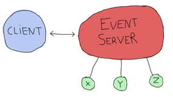
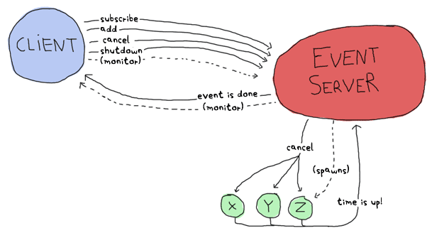

# Designing a Concurrent Application


All fine and dandy. You understand the concepts, but then again, all we've had since the beginning of the book were toy examples: calculators, trees, Heathrow to London, etc. It's time for something more fun and more educational. We'll write a small application in concurrent Erlang. The application's going to be small and line-based, but still useful and moderately extensible.
一切都很好。你理解这些概念，但话说回来，从这本书开始，我们所拥有的只是玩具示例：计算器、树木、希思罗机场到伦敦等等。是时候做些更有趣、更有教育意义的事情了。我们将用并发Erlang编写一个小应用程序。该应用程序将是小型的、基于行的，但仍然有用，并且具有适度的可扩展性。

I'm a somewhat unorganized person. I'm lost with homework, things to do around the apartment, this book, work, meetings, appointments, etc. I end up having a dozen of lists everywhere with tasks I still forget to do or look over. Hopefully you still need reminders of what to do (but you don't have a mind that wanders as much as mine does), because we're going to write one of these event reminder applications that prompt you to do stuff and remind you about appointments.
我是一个有点杂乱无章的人。我对家庭作业、公寓周围要做的事情、这本书、工作、会议、约会等感到迷茫。最后，我到处都有一打清单，上面都是我仍然忘记做或查看的任务。希望你仍然需要提醒你该做什么（但你的思维不像我的一样游移不定），因为我们将编写一个事件提醒应用程序，提示你做事情，提醒你约会。

## [Understanding the Problem]

The first step is to know what the hell we're doing. \"A reminder app,\" you say. \"Of course,\" I say. But there's more. How do we plan on interacting with the software? What do we want it to do for us? How do we represent the program with processes? How do we know what messages to send?
第一步是知道我们到底在做什么。\“一个提醒应用程序，\”你说。\“当然，”我说。但还有更多。我们如何计划与软件交互？我们希望它为我们做什么？我们如何用过程来表示程序？我们如何知道要发送什么消息？

As the quote goes, \"Walking on water and developing software from a specification are easy if both are frozen.\" So let's get a spec and stick to it. Our little piece of software will allow us to do the following:
正如这句话所说，“如果两者都被冻结，那么在水上行走和根据规范开发软件是很容易的。”。\“所以，让我们制定一个规范，并坚持下去。”。我们的小软件将允许我们执行以下操作：

-   Add an event. Events contain a deadline (the time to warn at), an event name and a description.
-   Show a warning when the time has come for it.
-   Cancel an event by name.
-   No persistent disk storage. It's not needed to show the architectural concepts we'll see. It will suck for a real app, but I'll instead just show where it could be inserted if you wanted to do it and also point to a few helpful functions.
-没有永久性磁盘存储。不需要展示我们将要看到的架构概念。对于一个真正的应用程序来说，它会很糟糕，但我会告诉你，如果你想的话，它可以被插入到哪里，并指出一些有用的功能。
-   Given we have no persistent storage, we have to be able to update the code while it is running.
-   The interaction with the software will be done via the command line, but it should be possible to later extend it so other means could be used (say a GUI, web page access, instant messaging software, email, etc.)
-与软件的交互将通过命令行完成，但以后应该可以扩展它，以便使用其他方式（例如GUI、网页访问、即时消息软件、电子邮件等）。)

Here's the structure of the program I picked to do it:



-   Can accept messages to cancel an event and subsequently kill the event processes
-   Can be terminated by a client
-   Can have its code reloaded via the shell.

### client

-   Subscribes to the event server and receive notifications as messages. As such it should be easy to design a bunch of clients all subscribing to the event server. Each of these could potentially be a gateway to the different interaction points mentioned above (GUI, web page, instant messaging software, email, etc.)
-订阅事件服务器并以消息形式接收通知。因此，设计一组订阅事件服务器的客户端应该很容易。其中每一个都可能是通往上述不同交互点（GUI、网页、即时消息软件、电子邮件等）的网关。)
-   Asks the server to add an event with all its details
-   Asks the server to cancel an event
-   Monitors the server (to know if it goes down)
-   Shuts down the event server if needed

### x, y and z:

-   Represent a notification waiting to fire (they're basically just timers linked to the event server)
-表示等待触发的通知（它们基本上只是链接到事件服务器的计时器）
-   Send a message to the event server when the time is up
-   Receive a cancellation message and die

Note that all clients (IM, mail, etc. which are not implemented in this book) are notified about all events, and a cancellation is not something to warn the clients about. Here the software is written for you and me, and it's assumed only one user will run it.
请注意，所有客户端（IM、邮件等）。（本书中未实现的）通知所有事件，取消并不是警告客户的事情。这里的软件是为你和我编写的，假设只有一个用户会运行它。

Here's a more complex graph with all the possible messages:



This represents every process we'll have. By drawing all the arrows there and saying they're messages, we've written a high level protocol, or at least its skeleton.
这代表了我们将拥有的每一个过程。通过在那里画出所有的箭头并说它们是消息，我们已经编写了一个高级协议，或者至少是它的框架。

It should be noted that using one process per event to be reminded of is likely going to be overkill and hard to scale in a real world application. However, for an application you are going to be the sole user of, this is good enough. A different approach could be using functions such as [timer:send_after/2-3](http://erldocs.com/18.0/stdlib/timer.html#send_after/2) to avoid spawning too many processes.
应该注意的是，在实际应用程序中，对每个要提醒的事件使用一个进程可能会有点过头，而且很难扩展。然而，对于一个你将成为其唯一用户的应用程序来说，这已经足够好了。另一种方法是使用[timer:send_after/2-3]等函数(http://erldocs。com/18。0/stdlib/定时器。html#发送_after/2）以避免产生太多进程。

## [Defining the Protocol]

Now that we know what each component has to do and to communicate, a good idea would be to make a list of all messages that will be sent and specify what they will look like. Let's first start with the communication between the client and the event server:
现在我们知道了每个组件必须做什么和通信，一个好主意是列出将要发送的所有消息，并指定它们的外观。让我们首先从客户端和事件服务器之间的通信开始：

![The client can send 

Here I chose to use two monitors because there is no obvious dependency between the client and the server. I mean, of course the client doesn't work without the server, but the server can live without a client. A link could have done the job right here, but because we want our system to be extensible with many clients, we can't assume other clients will all want to crash when the server dies. And neither can we assume the client can really be turned into a system process and trap exits in case the server dies. Now to the next message set:
在这里，我选择使用两个监视器，因为客户端和服务器之间没有明显的依赖关系。我的意思是，没有服务器，客户端当然不能工作，但是服务器可以没有客户端。一个链接就可以完成这项工作，但因为我们希望我们的系统可以扩展到许多客户端，所以我们不能假设其他客户端都希望在服务器死机时崩溃。我们也不能假设客户机真的可以变成一个系统进程，并在服务器死亡的情况下退出陷阱。现在转到下一个消息集：

![The client can send the message 

This adds an event to the event server. A confirmation is sent back under the form of the `ok` atom, unless something goes wrong (maybe the TimeOut is in the wrong format.) The inverse operation, removing events, can be done as follows:
事件服务器会将事件添加到。确认将以“ok”原子的形式发回，除非出现问题（可能超时的格式错误）。)反向操作（删除事件）可按如下方式进行：

![The client can send the message 

The event server can then later send a notification when the event is due:

![The event server forwards a 

Then we only need the two following special cases for when we want to shut the server down or when it crashes:
那么，当我们想关闭服务器或服务器崩溃时，我们只需要以下两种特殊情况：

![When the client sends the 'shutdown' atom to the event server, it dies and returns 

No direct confirmation is sent when the server dies because the monitor will already warn us of that. That's pretty much all that will happen between the client and the event server. Now for the messages between the event server and the event processes themselves.
服务器死机时不会发送直接确认，因为监视器已经警告我们了。这几乎就是客户端和事件服务器之间发生的所有事情。现在来看一下事件服务器和事件进程之间的消息。

A thing to note here before we start is that it would be very useful to have the event server linked to the events. The reason for this is that we want all events to die if the server does: they make no sense without it.
在我们开始之前需要注意的一点是，将事件服务器链接到事件将非常有用。这样做的原因是，如果服务器停止运行，我们希望所有事件都停止运行：没有服务器，它们就没有意义。

Ok, so back to the events. When the event server starts them, it gives each of them a special identifier (the event's name). Once one of these events' time has come, it needs to send a message saying so:
好的，回到事件上来。当事件服务器启动它们时，它会为每个事件提供一个特殊的标识符（事件的名称）。一旦这些事件中的一个时间到了，它需要发送一条信息，这样说：


To begin with it all, we should lay down a standard Erlang directory structure, which looks like this:
首先，我们应该制定一个标准的Erlang目录结构，如下所示：

``` expand
ebin/
include/
priv/
src/
```

The `ebin/` directory is where files will go once they are compiled. The `include/` directory is used to store `.hrl` files that are to be included by other applications; the private `.hrl` files are usually just kept inside the `src/` directory. The `priv/` directory is used for executables that might have to interact with Erlang, such as specific drivers and whatnot. We won't actually use that directory for this project. Then the last one is the `src/` directory, where all `.erl` files stay.
“ebin/”目录是文件编译后的存放位置。`is/'用于包含目录`。hrl `其他应用程序将包含的文件；二等兵`。hrl`文件通常只保存在`src/`目录中。“priv/”目录用于可能必须与Erlang交互的可执行文件，例如特定的驱动程序等等。我们不会在这个项目中使用这个目录。最后一个是'src/'目录，其中`。呃，文件留下来了。

In standard Erlang projects, this directory structure can vary a little. A `conf/` directory can be added for specific configuration files, `doc/` for documentation and `lib/` for third party libraries required for your application to run. Different Erlang product on the market often use different names than these, but the four ones mentioned above usually stay the same given they're part of the [standard OTP practices](http://www.erlang.org/doc/design_principles/applications.html#id71171 "Reference page only, don't expect to understand everything out of it").
在标准的Erlang项目中，这个目录结构可能会有一些变化。可以为特定的配置文件添加`conf/`目录，为文档添加`doc/`目录，为应用程序运行所需的第三方库添加`lib/`目录。市场上不同的Erlang产品通常使用不同的名称，但上面提到的四种产品通常保持不变，因为它们是[标准OTP实践]的一部分(http://www。二郎。组织/文件/设计原则/应用。html#id71171“仅供参考页，不要期望了解其中的所有内容”）。

## [An Event Module]

Get into the `src/` directory and start an [event.erl](static/erlang/event.erl.html) module, which will implement the x, y and z events in the earlier drawings. I'm starting with this module because it's the one with the fewest dependencies: we'll be able to try to run it without needing to implement the event server or client functions.
进入'src/'目录并启动一个[event]。erl]（静态/erlang/事件。呃。html）模块，该模块将实现早期图形中的x、y和z事件。我从这个模块开始，因为它是依赖性最少的模块：我们可以尝试运行它，而无需实现事件服务器或客户端功能。

Before really writing code, I have to mention that the protocol is incomplete. It helps represent what data will be sent from process to process, but not the intricacies of it: how the addressing works, whether we use references or names, etc. Most messages will be wrapped under the form ` is a unique message identifier to help know what reply came from who. If we were to send many messages before looking for replies, we would not know what reply went with what message without a reference.
在真正编写代码之前，我必须指出协议是不完整的。它有助于表示将从一个进程发送到另一个进程的数据，但不代表数据的复杂性：地址如何工作，我们是否使用引用或名称，等等。大多数邮件将包装在“是唯一的邮件标识符”表格下，以帮助了解来自谁的回复。如果我们在寻找回复之前发送了很多信息，我们就不知道在没有参考的情况下，什么回复和什么消息是一致的。

So here we go. The core of the processes that will run `event.erl`'s code will be the function `loop/1`, which will look a bit like the following skeleton if you remember the protocol:
我们开始吧。将运行“事件”的流程的核心。erl`'的代码将是函数“loop/1”，如果您还记得协议的话，它看起来有点像下面的框架：

```erl
loop(State) ->
    receive
         ->
            ...
    after Delay ->
        ...
    end.
```

This shows the timeout we have to support to announce an event has come to term and the way a server can call for the cancellation of an event. You'll notice a variable `State``.) It will also need to know the event server's pid in order to send it notifications.
这显示了我们必须支持的超时，以宣布事件已经结束，以及服务器可以调用取消事件的方式。你会注意到一个变量状态``。)它还需要知道事件服务器的pid，以便向其发送通知。

This is all stuff that's fit to be held in the loop's state. So let's declare a `state` record on the top of the file:
这是所有适合保持在循环状态的东西。因此，让我们在文件顶部声明一个“state”记录：

```erl
-module(event).
-compile(export_all).
-record(state, {server,
                name="",
                to_go=0}).
```

With this state defined, it should be possible to refine the loop a bit more:

```erl
loop(S = #state) ->
    receive
         ->
            Server ! 
    after S#state.to_go*1000 ->
        Server ! 
    end.
```

Here, the multiplication by a thousand is to change the `to_go` value from seconds to milliseconds.

::: 
**Don't drink too much Kool-Aid:**\
Language wart ahead! The reason why I bind the variable 'Server' in the function head is because it's used in pattern matching in the receive section. Remember, [records are hacks!](a-short-visit-to-common-data-structures.html#records) The expression `S#state.server` is secretly expanded to `element(2, S)`, which isn't a valid pattern to match on.
语言障碍在前面！我之所以在函数头中绑定变量“Server”，是因为它用于接收部分的模式匹配。记住，[记录就是黑客！]（a）对公共数据结构的短期访问。html#记录）表达式的#状态。服务器`被秘密扩展为`元素（2，S）`，这不是一个有效的匹配模式。

This still works fine for `S#state.to_go` after the `after` part, because that one can be an expression left to be evaluated later.
这对“S#state”仍然有效。to_go`在'after'部分之后，因为那一部分可以是一个表达式，留待以后计算。
:::

Now to test the loop:

```eshell
6> c(event).

7> rr(event, state).
[state]
8> spawn(event, loop, [#state]).
<0.60.0>
9> flush().
ok
10> flush().
Shell got 
ok
11> Pid = spawn(event, loop, [#state]).
<0.64.0>
12> ReplyRef = make_ref().
#Ref<0.0.0.210>
13> Pid ! .

14> flush().
Shell got 
ok
```

Lots of stuff to see here. Well first of all, we import the record from the event module with `rr(Mod)`. Then, we spawn the event loop with the shell as the server (`self()`). This event should fire after 5 seconds. The 9th expression was run after 3 seconds, and the 10th one after 6 seconds. You can see we did receive the `` message on the second try.
这里有很多东西要看。首先，我们用'rr（Mod）从事件模块导入记录`。然后，我们以shell作为服务器生成事件循环（`self（）`）。此事件应在5秒后触发。第9个表达式在3秒后运行，第10个表达式在6秒后运行。您可以看到，我们在第二次尝试时确实收到了``消息。

Right after that, I try the cancel feature (with an ample 500 seconds to type it). You can see I created the reference, sent the message and got a reply with the same reference so I know the `ok` I received was coming from this process and not any other on the system.
紧接着，我尝试取消功能（有足够的500秒时间来输入）。你可以看到，我创建了引用，发送了消息，收到了一个带有相同引用的回复，所以我知道我收到的“ok”来自这个过程，而不是系统上的任何其他过程。

The reason why the cancel message is wrapped with a reference but the `done` message isn't is simply because we don't expect it to come from anywhere specific (any place will do, we won't match on the receive) nor should we want to reply to it. There's another test I want to do beforehand. What about an event happening next year?
取消消息用引用包装，但“完成”消息没有包装，原因很简单，因为我们不希望它来自任何特定的地方（任何地方都可以，我们在接收时不会匹配），也不希望回复它。我想提前做另一个测试。明年的活动怎么样？

```eshell
15> spawn(event, loop, [#state]).
<0.69.0>
16> 
=ERROR REPORT==== DD-MM-YYYY::HH:mm:SS ===
Error in process <0.69.0> with exit value: 
```

Ouch. It seems like we hit an implementation limit. It turns out Erlang's timeout value is limited to about 50 days in milliseconds. It might not be significant, but I'm showing this error for three reasons:
哎哟。我们似乎达到了执行限制。事实证明，Erlang的超时值被限制在大约50天（以毫秒为单位）。这可能并不重要，但我展示这个错误有三个原因：

1.  It bit me in the ass when writing the module and testing it, halfway through the chapter.
2.  Erlang is certainly not perfect for every task and what we're seeing here is the consequences of using timers in ways not intended by the implementers.
2.。Erlang当然不适合所有任务，我们在这里看到的是以实现者不希望的方式使用计时器的后果。
3.  That's not really a problem; let's work around it.

The fix I decided to apply for this one was to write a function that would split the timeout value into many parts if turns out to be too long. This will request some support from the `loop/1` function too. So yeah, the way to split the time is basically divide it in equal parts of 49 days (because the limit is about 50), and then put the remainder with all these equal parts. The sum of the list of seconds should now be the original time:
我决定应用的修复方法是编写一个函数，如果超时值太长，它会将超时值分成许多部分。这也将要求'loop/1'函数提供一些支持。所以是的，分割时间的方法基本上是把时间分成49天的等分（因为限制大约是50天），然后把剩余的时间和所有这些等分放在一起。现在，秒列表的总和应为原始时间：

```erl
%% Because Erlang is limited to about 49 days (49*24*60*60*1000) in
%% milliseconds, the following function is used
normalize(N) ->
    Limit = 49*24*60*60,
    [N rem Limit | lists:duplicate(N div Limit, Limit)].
```

The function `lists:duplicate/2` will take a given expression as a second argument and reproduce it as many times as the value of the first argument (`[a,a,a] = lists:duplicate(3, a)`). If we were to send `normalize/1` the value `98*24*60*60+4`, it would return `[4,4233600,4233600]`. The `loop/1` function should now look like this to accommodate the new format:
函数'lists:duplicate/2'将给定的表达式作为第二个参数，并将其复制为第一个参数的值（`a，a，a]=lists:duplicate（3，a）`）。如果我们发送'normalize/1'值'98*24*60*60+4'，它将返回'[442336004233600]`。“loop/1”函数现在应该是这样的，以适应新的格式：

```erl
%% Loop uses a list for times in order to go around the ~49 days limit
%% on timeouts.
loop(S = #state) ->
    receive
         ->
            Server ! 
    after T*1000 ->
        if Next =:= [] ->
            Server ! ;
           Next =/= [] ->
            loop(S#state)
        end
    end.
```

You can try it, it should work as normal, but now support years and years of timeout. How this works is that it takes the first element of the `to_go` list and waits for its whole duration. When this is done, the next element of the timeout list is verified. If it's empty, the timeout is over and the server is notified of it. Otherwise, the loop keeps going with the rest of the list until it's done.
你可以试试，它应该正常工作，但现在支持多年的超时。它的工作原理是，它使用“to_go”列表的第一个元素，并等待整个持续时间。完成后，将验证超时列表的下一个元素。如果为空，则超时结束，并通知服务器。否则，循环将继续执行列表的其余部分，直到完成为止。

It would be very annoying to have to manually call something like `event:normalize(N)` every time an event process is started, especially since our workaround shouldn't be of concern to programmers using our code. The standard way to do this is to instead have an `init` function handling all initialization of data required for the loop function to work well. While we're at it, we'll add the standard `start` and `start_link` functions:
每次启动事件进程时，都必须手动调用类似‘event:normalize（N）’之类的东西，这将非常烦人，尤其是因为使用我们的代码的程序员不应该关心我们的变通方法。实现这一点的标准方法是使用'init'函数处理循环函数正常工作所需的所有初始化数据。我们将添加标准的“开始”和“开始链接”功能：

```erl
start(EventName, Delay) ->
    spawn(?MODULE, init, [self(), EventName, Delay]).

start_link(EventName, Delay) ->
    spawn_link(?MODULE, init, [self(), EventName, Delay]).

%%% Event's innards
init(Server, EventName, Delay) ->
    loop(#state{server=Server,
                name=EventName,
                to_go=normalize(Delay)}).
```

The interface is now much cleaner. Before testing, though, it would be nice to have the only message we can send, cancel, also have its own interface function:
现在界面更干净了。不过，在测试之前，最好有我们唯一可以发送的消息，cancel，还有它自己的接口功能：

```erl
cancel(Pid) ->
    %% Monitor in case the process is already dead
    Ref = erlang:monitor(process, Pid),
    Pid ! ,
    receive
         ->
            erlang:demonitor(Ref, [flush]),
            ok;
         ->
            ok
    end.
```

Oh! A new trick! Here I'm using a monitor to see if the process is there or not. If the process is already dead, I avoid useless waiting time and return `ok` as specified in the protocol. If the process replies with the reference, then I know it will soon die: I remove the reference to avoid receiving them when I no longer care about them. Note that I also supply the `flush` option, which will purge the `DOWN` message if it was sent before we had the time to demonitor.
哦新把戏！在这里，我使用一个监视器来查看这个过程是否存在。如果进程已经死了，我会避免无用的等待时间，并按照协议中的规定返回“ok”。如果流程回复了引用，那么我知道它很快就会消失：我删除引用以避免在我不再关心它们时收到它们。请注意，我还提供了'flush'选项，如果'DOWN'消息是在我们有时间解除监视之前发送的，它将清除该消息。

Let's test these:

```eshell
17> c(event).

18> f().
ok
19> event:start("Event", 0).
<0.103.0>
20> flush().
Shell got 
ok
21> Pid = event:start("Event", 500).
<0.106.0>
22> event:cancel(Pid).
ok
```

And it works! The last thing annoying with the event module is that we have to input the time left in seconds. It would be much better if we could use a standard format such as Erlang's datetime (``). Just add the following function that will calculate the difference between the current time on your computer and the delay you inserted:
而且很有效！事件模块最讨厌的一件事是，我们必须以秒为单位输入剩余的时间。如果我们可以使用标准格式，比如Erlang的datetime（``），那就更好了。只需添加以下函数，即可计算计算机上的当前时间与插入的延迟之间的差值：

```erl
time_to_go(TimeOut=) ->
    Now = calendar:local_time(),
    ToGo = calendar:datetime_to_gregorian_seconds(TimeOut) -
           calendar:datetime_to_gregorian_seconds(Now),
    Secs = if ToGo > 0  -> ToGo;
              ToGo =< 0 -> 0
           end,
    normalize(Secs).
```

Oh, yeah. The [calendar module](http://erldocs.com/18.0/stdlib/calendar.html) if you want the names to be more descriptive:
哦，是的。[日历模块](http://erldocs。com/18。0/stdlib/日历。html）如果希望名称更具描述性：

```erl
init(Server, EventName, DateTime) ->
    loop(#state{server=Server,
                name=EventName,
                to_go=time_to_go(DateTime)}).
```

Now that this is done, we can take a break. Start a new event, go drink a pint (half-litre) of milk/beer and come back just in time to see the event message coming in.
既然这样做了，我们可以休息一下了。开始一项新活动，喝一品脱（半升）牛奶/啤酒，然后及时回来观看活动消息。

## [The Event Server]

Let's deal with the [event server](static/erlang/evserv.erl.html). According to the protocol, the skeleton for that one should look a bit like this:
让我们来处理[event server]（static/erlang/evserv）。呃。（html）。根据协议，这个人的骨架应该是这样的：

```erl
-module(evserv).
-compile(export_all).

loop(State) ->
    receive
         ->
            ...
         ->
            ...
         ->
            ...
         ->
            ...
        shutdown ->
            ...
         ->
            ...
        code_change ->
            ...
        Unknown ->
            io:format("Unknown message: ~p~n",[Unknown]),
            loop(State)
    end.
```

You'll notice I have wrapped calls that require replies with the same ``. The idea here is to have as little traffic as necessary and only have the event processes care about what is strictly necessary. So yeah, list of clients and list of events:
你会注意到，我已经打包了需要回复相同内容的通话``。这里的想法是尽可能减少必要的流量，只让事件流程关注严格必要的内容。是的，客户名单和活动列表：

```erl
-record(state,  records
                clients}). %% list of Pids

-record(event, {name="",
                description="",
                pid,
                timeout=).
```

And the loop now has the record definition in its head:

```erl
loop(S = #state) ->
    receive
        ...
    end.
```

It would be nice if both events and clients were orddicts. We're unlikely to have many hundreds of them at once. If you recall the chapter on [data structures](a-short-visit-to-common-data-structures.html#key-value-stores), orddicts fit that need very well. We'll write an `init` function to handle this:
如果事件和客户都是命令式的，那就太好了。我们不太可能同时拥有数百个。如果你还记得[data structures]一章（对common-data-structures的短期访问）。html#键值存储），orddicts非常适合这种需求。我们将编写一个'init'函数来处理这个问题：

```erl
init() ->
    %% Loading events from a static file could be done here.
    %% You would need to pass an argument to init telling where the
    %% resource to find the events is. Then load it from here.
    %% Another option is to just pass the events straight to the server
    %% through this function.
    loop(#state{events=orddict:new(),
                clients=orddict:new()}).
```

With the skeleton and initialization done, I'll implement each message one by one. The first message is the one about subscriptions. We want to keep a list of all subscribers because when an event is done, we have to notify them. Also, the protocol above mentions we should monitor them. It makes sense because we don't want to hold onto crashed clients and send useless messages for no reason. Anyway, it should look like this:
框架和初始化完成后，我将逐个实现每条消息。第一条消息是关于订阅的。我们想保留所有订阅者的列表，因为当一个活动结束时，我们必须通知他们。此外，上述协议提到我们应该监控他们。这是有道理的，因为我们不想抓住崩溃的客户端，无缘无故地发送无用的消息。无论如何，它应该是这样的：

```erl
 ->
    Ref = erlang:monitor(process, Client),
    NewClients = orddict:store(Ref, Client, S#state.clients),
    Pid ! ,
    loop(S#state);
```


So what this section of `loop/1` does is start a monitor, and store the client info in the orddict under the key `Ref`. The reason for this is simple: the only other time we'll need to fetch the client ID will be if we receive a monitor's `EXIT` message, which will contain the reference (which will let us get rid of the orddict's entry).
因此，'loop/1'的这一部分所做的是启动一个监视器，并将客户机信息存储在orddict中的'Ref'键下`。原因很简单：我们需要获取客户端ID的唯一其他时间是，如果我们收到监视器的“退出”消息，该消息将包含引用（这将使我们摆脱orddict的条目）。

The next message to care about is the one where we add events. Now, it is possible to return an error status. The only validation we'll do is check the timestamps we accept. While it's easy to subscribe to the `` layout, we have to make sure we don't do things like accept events on February 29 when we're not in a leap year, or any other date that doesn't exist. Moreover, we don't want to accept impossible date values such as \"5 hours, minus 1 minute and 75 seconds\". A single function can take care of validating all of that.
下一个需要关注的消息是我们添加事件的消息。现在，可以返回错误状态。我们要做的唯一验证就是检查我们接受的时间戳。虽然订阅“布局”很容易，但我们必须确保不要在2月29日接受不在闰年的活动，或任何其他不存在的日期。此外，我们不想接受不可能的日期值，例如“5小时，减去1分75秒”。一个函数可以验证所有这些。

The first building block we'll use is the function `calendar:valid_date/1`. This one, as the name says, checks if the date is valid or not. Sadly, the weirdness of the calendar module doesn't stop at funky names: there is actually no function to confirm that `` has valid values. We'll have to implement that one too, following the funky naming scheme:
我们将使用的第一个构建块是函数“calendar:valid_date/1”`。这个，正如名字所说，检查日期是否有效。遗憾的是，日历模块的古怪之处并不止于时髦的名称：实际上没有函数来确认“是否有有效的值”。我们也必须按照时髦的命名方案来实现这一点：

```erl
valid_datetime() ->
    try
        calendar:valid_date(Date) andalso valid_time(Time)
    catch
        error:function_clause -> %% not in  format
            false
    end;
valid_datetime(_) ->
    false.

valid_time() -> valid_time(H,M,S).
valid_time(H,M,S) when H >= 0, H < 24,
                       M >= 0, M < 60,
                       S >= 0, S < 60 -> true;
valid_time(_,_,_) -> false.
```

The `valid_datetime/1` function can now be used in the part where we try to add the message:

```erl
 ->
    case valid_datetime(TimeOut) of
        true ->
            EventPid = event:start_link(Name, TimeOut),
            NewEvents = orddict:store(Name,
                                      #event{name=Name,
                                             description=Description,
                                             pid=EventPid,
                                             timeout=TimeOut},
                                      S#state.events),
            Pid ! ,
            loop(S#state);
        false ->
            Pid ! ,
            loop(S)
    end;
```

If the time is valid, we spawn a new event process, then store its data in the event server's state before sending a confirmation to the caller. If the timeout is wrong, we notify the client rather than having the error pass silently or crashing the server. Additional checks could be added for name clashes or other restrictions (just remember to update the protocol documentation!)
如果时间有效，我们将生成一个新的事件进程，然后将其数据存储在事件服务器的状态中，然后再向调用方发送确认。如果超时错误，我们会通知客户机，而不是让错误静静地通过或使服务器崩溃。可以添加其他检查，以检查名称冲突或其他限制（只需记住更新协议文档！）

The next message defined in our protocol is the one where we cancel an event. Canceling an event never fails on the client side, so the code is simpler there. Just check whether the event is in the process' state record. If it is, use the `event:cancel/1` function we defined to kill it and send ok. If it's not found, just tell the user everything went right anyway \-- the event is not running and that's what the user wanted.
协议中定义的下一条消息是取消事件的消息。在客户端取消事件永远不会失败，因此那里的代码更简单。只需检查事件是否在进程的状态记录中。如果是，使用我们定义的'event:cancel/1'函数终止它并发送ok。如果没有找到，只需告诉用户一切正常\--事件没有运行，这是用户想要的。

```erl
 ->
    Events = case orddict:find(Name, S#state.events) of
                  ->
                     event:cancel(E#event.pid),
                     orddict:erase(Name, S#state.events);
                  error ->
                     S#state.events
             end,
    Pid ! ,
    loop(S#state);
```

Good, good. So now all voluntary interaction coming from the client to the event server is covered. Let's deal with the stuff that's going between the server and the events themselves. There are two messages to handle: canceling the events (which is done), and the events timing out. That message is simply ``:
很好，很好。现在，所有从客户机到事件服务器的自愿交互都包括在内。让我们来处理服务器和事件本身之间的事情。有两条消息需要处理：取消事件（已完成）和事件超时。这条信息就是：

```erl
 ->
    case orddict:find(Name, S#state.events) of
         ->
            send_to_clients(,
                            S#state.clients),
            NewEvents = orddict:erase(Name, S#state.events),
            loop(S#state);
        error ->
            %% This may happen if we cancel an event and
            %% it fires at the same time
            loop(S)
    end;
```

And the function `send_to_clients/2` does as its name says and is defined as follows:

```erl
send_to_clients(Msg, ClientDict) ->
    orddict:map(fun(_Ref, Pid) -> Pid ! Msg end, ClientDict).
```

That should be it for most of the loop code. What's left is the set different status messages: clients going down, shutdown, code upgrades, etc. Here they come:
大多数循环代码都应该是这样。剩下的是设置不同的状态消息：客户端关闭、关闭、代码升级等。他们来了：

```erl
shutdown ->
    exit(shutdown);
 ->
    loop(S#state);
code_change ->
    ?MODULE:loop(S);
Unknown ->
    io:format("Unknown message: ~p~n",[Unknown]),
    loop(S)
```

The first case (`shutdown`) is pretty explicit. You get the kill message, let the process die. If you wanted to save state to disk, that could be a possible place to do it. If you wanted safer save/exit semantics, this could be done on every `add`, `cancel` or `done` message. Loading events from disk could then be done in the `init` function, spawning them as they come.
第一种情况（“shutdown”）非常明确。你得到了杀戮的信息，就让这个过程死去吧。如果您想将状态保存到磁盘，这可能是一个可行的地方。如果您想要更安全的保存/退出语义，可以在每个“添加”、“取消”或“完成”消息上执行此操作。然后可以在'init'函数中从磁盘加载事件，并在事件发生时生成它们。

The `'DOWN'` message's actions are also simple enough. It means a client died, so we remove it from the client list in the state.
“DOWN”消息的操作也很简单。这意味着一个客户死了，所以我们将其从该州的客户列表中删除。

Unknown messages will just be shown with `io:format/2` for debugging purposes, although a real production application would likely use a dedicated logging module
出于调试目的，未知消息将仅显示为'io:format/2'，尽管实际的生产应用程序可能会使用专用的日志模块

And here comes the code change message. This one is interesting enough for me to give it its own section.
下面是代码更改消息。这本书很有趣，我可以给它自己的部分。

## [Hot Code Loving]

In order to do hot code loading, Erlang has a thing called the *code server*. The code server is basically a VM process in charge of an [ETS table](http://erldocs.com/18.0/stdlib/ets.html).
为了进行热代码加载，Erlang有一个叫做*代码服务器的东西*。代码服务器基本上是一个VM进程，负责[ETS表](http://erldocs。com/18。0/stdlib/ets。（html）。

A concept to understand is that Erlang has both *local* and *external* calls. Local calls are those function calls you can make with functions that might not be exported. They're just of the format `Atom(Args)`. An external call, on the other hand, can only be done with exported functions and has the form `Module:Function(Args)`.
需要理解的一个概念是，Erlang既有“本地”调用，也有“外部”调用。本地调用是那些可以使用可能无法导出的函数进行的函数调用。它们只是原子格式（Args）`。另一方面，外部调用只能通过导出的函数完成，其形式为`Module:Function（Args）`。

When there are two versions of a module loaded in the VM, all local calls are done through the currently running version in a process. However, external calls are **always** done on the newest version of the code available in the code server. Then, if local calls are made from within the external one, they are in the new version of the code.
当VM中加载了两个版本的模块时，所有本地调用都通过进程中当前运行的版本完成。但是，外部调用**始终**在代码服务器中可用的最新版本的代码上完成。然后，如果本地调用是从外部调用中发出的，则它们位于新版本的代码中。


`, which will then be able to transform the state data structure according to the new version's specification. This 'subscription' handling is done automatically by the OTP framework, which we'll start studying soon enough. For the reminder application, we won't use the code server and will instead use a custom `code_change` message from the shell, doing very basic reloading. That's pretty much all you need to know to do hot code loading. Nevertheless, here's a more generic example:
有几种方法可以将自己绑定到一个系统模块，该模块将在加载新版本的模块时发送消息。通过这样做，您可以仅在收到此类消息时触发模块重新加载，并始终使用代码升级功能，例如“MyModule:upgrade（CurrentState）”，这样就可以根据新版本的规范转换状态数据结构。这种“订阅”处理是由OTP框架自动完成的，我们很快就会开始研究它。对于提醒应用程序，我们不会使用代码服务器，而是使用来自shell的自定义“code_change”消息，进行非常基本的重新加载。这就是进行热代码加载所需的全部知识。然而，这里有一个更一般的例子：

```erl
-module(hotload).
-export([server/1, upgrade/1]).

server(State) ->
    receive
        update ->
            NewState = ?MODULE:upgrade(State),
            ?MODULE:server(NewState);  %% loop in the new version of the module
        SomeMessage ->
            %% do something here
            server(State)  %% stay in the same version no matter what.
    end.

upgrade(OldState) ->
    %% transform and return the state here.
```

As you can see, our `?MODULE:loop(S)` fits this pattern.

## [I Said, Hide Your Messages]

Hiding messages! If you expect people to build on your code and processes, you must hide the messages in interface functions. Here's what we used for the `evserv` module:
隐藏信息！如果您希望人们基于您的代码和流程进行构建，则必须将消息隐藏在接口函数中。下面是我们用于“evserv”模块的内容：

```erl
start() ->
    register(?MODULE, Pid=spawn(?MODULE, init, [])),
    Pid.

start_link() ->
    register(?MODULE, Pid=spawn_link(?MODULE, init, [])),
    Pid.

terminate() ->
    ?MODULE ! shutdown.
```

I decided to register the server module because, for now, we should only have one running at a time. If you were to expand the reminder use to support many users, it would be a good idea to instead register the names with the [global module](http://erldocs.com/18.0/stdlib/global.html). For the sake of this example app, this will be enough.
我决定注册服务器模块，因为目前我们一次只能运行一个。如果要扩展提醒使用以支持多个用户，最好改为在[global module]中注册名称(http://erldocs。com/18。0/stdlib/global。（html）。对于这个示例应用程序来说，这就足够了。

The first message we wrote is the next we should abstract away: how to subscribe. The little protocol or specification I wrote above called for a monitor, so this one is added there. At any point, if the reference returned by the subscribe message is in a `DOWN` message, the client will know the server has gone down.
我们写的第一条信息是下一条我们应该抽象掉的信息：如何订阅。我在上面写的小协议或规范需要一个监视器，所以这里添加了这个。在任何时候，如果subscribe消息返回的引用位于“DOWN”消息中，客户机都会知道服务器已停机。

```erl
subscribe(Pid) ->
    Ref = erlang:monitor(process, whereis(?MODULE)),
    ?MODULE ! ,
    receive
         ->
            ;
         ->
            
    after 5000 ->
        
    end.
```

The next one is the event adding:

```erl
add_event(Name, Description, TimeOut) ->
    Ref = make_ref(),
    ?MODULE ! ,
    receive
         -> Msg
    after 5000 ->
        
    end.
```

Note that I choose to forward the `` message that could be received to the client. I could have also decided to crash the client by raising `erlang:error(bad_timeout)`. Whether crashing the client or forwarding the error message is the thing to do is still debated in the community. Here's the alternative crashing function:
请注意，我选择将可能接收到的``消息转发给客户端。我也可以决定通过抛出`erlang:error（bad_timeout）使客户端崩溃`。究竟是让客户端崩溃还是转发错误消息是社区中仍有争议的事情。下面是另一种崩溃功能：

```erl
add_event2(Name, Description, TimeOut) ->
    Ref = make_ref(),
    ?MODULE ! ,
    receive
         -> erlang:error(Reason);
         -> Msg
    after 5000 ->
        
    end.
```

Then there's event cancellation, which just takes a name:

```erl
cancel(Name) ->
    Ref = make_ref(),
    ?MODULE ! ,
    receive
         -> ok
    after 5000 ->
        
    end.
```

Last of all is a small nicety provided for the client, a function used to accumulate all messages during a given period of time. If messages are found, they're all taken and the function returns as soon as possible:
最后是为客户端提供的一个小细节，一个用于在给定时间段内累积所有消息的函数。如果找到消息，它们都会被接收，函数会尽快返回：

```erl
listen(Delay) ->
    receive
        M =  ->
            [M | listen(0)]
    after Delay*1000 ->
        []
    end.
```

## [A Test Drive]

You should now be able to compile the application and give it a test run. To make things a bit simpler, we'll write a specific Erlang makefile to build the project. Open a file named `Emakefile` and put it in the project's base directory. The file contains Erlang terms and gives the Erlang compiler the recipe to cook wonderful and crispy `.beam` files:
您现在应该能够编译应用程序并对其进行测试运行。为了让事情变得更简单，我们将编写一个特定的Erlang makefile来构建项目。打开一个名为“Emakefile”的文件，并将其放在项目的基本目录中。该文件包含Erlang术语，并为Erlang编译器提供了制作美味脆饼的食谱`。beam`文件：


``` expand
{'src/*', [debug_info,
           ,
           ,
           .
```

This tells the compiler to add debug_info to the files (this is rarely an option you want to give up), to look for files in the `src/` and `include/` directory and to output them in `ebin/`.
这会告诉编译器向文件中添加调试信息（这很少是您想要放弃的选项），在'src/'和'include/'目录中查找文件，并在'ebin'中输出它们/`。

Now, by going in your command line and running `erl -make`, the files should all be compiled and put inside the `ebin/` directory for you. Start the Erlang shell by doing `erl -pa ebin/`. The `-pa <directory>` option tells the Erlang VM to add that path to the places it can look in for modules.
现在，通过进入命令行并运行`erl-make`，所有文件都应该被编译并放入`ebin/`目录中。通过执行'erl-pa ebin'来启动Erlang shell/`。“-pa<directory>”选项告诉Erlang VM将该路径添加到它可以查找模块的位置。

Another option is to start the shell as usual and call `make:all([load])`. This will look for a file named 'Emakefile' in the current directory, recompile it (if it changed) and load the new files.
另一个选项是像往常一样启动shell并调用'make:all（[load]）`。这将在当前目录中查找名为“Emakefile”的文件，重新编译（如果更改）并加载新文件。

You should now be able to track thousands of events (just replace the `DateTime` variables with whatever makes sense when you're writing the text):
您现在应该能够跟踪数千个事件（只需在编写文本时用任何有意义的变量替换“DateTime”变量即可）：

```eshell
1> evserv:start().
<0.34.0>
2> evserv:subscribe(self()).

3> evserv:add_event("Hey there", "test", FutureDateTime).
ok
4> evserv:listen(5).
[]
5> evserv:cancel("Hey there").
ok
6> evserv:add_event("Hey there2", "test", NextMinuteDateTime).
ok
7> evserv:listen(2000).
[]
```

Nice nice nice. Writing any client should now be simple enough given the few basic interface functions we have created.
很好很好。考虑到我们创建的几个基本接口函数，编写任何客户机都应该足够简单。

## [Adding Supervision]

In order to be a more stable application, we should write another 'restarter' as we did in the [last chapter](errors-and-processes.html#naming-processes) where our supervisor will be:
为了成为一个更稳定的应用程序，我们应该像在[上一章]（错误和过程）中那样编写另一个“重启程序”。html#命名流程），我们的主管将：

```erl
-module(sup).
-export([start/2, start_link/2, init/1, loop/1]).

start(Mod,Args) ->
    spawn(?MODULE, init, []).

start_link(Mod,Args) ->
    spawn_link(?MODULE, init, []).

init() ->
    process_flag(trap_exit, true),
    loop().

loop() ->
    Pid = apply(M,F,A),
    receive
         ->
            exit(shutdown); % will kill the child too
         ->
            io:format("Process ~p exited for reason ~p~n",[Pid,Reason]),
            loop()
    end.
```

This is somewhat similar to the 'restarter', although this one is a tad more generic. It can take any module, as long as it has a `start_link` function. It will restart the process it watches indefinitely, unless the supervisor itself is terminated with a shutdown exit signal. Here it is in use:
这有点类似于“重启器”，尽管这一个更通用。它可以使用任何模块，只要它具有“启动链接”功能。它将无限期地重新启动它所监视的进程，除非监控程序本身被关闭退出信号终止。现在正在使用：

```eshell
1> c(evserv), c(sup).

2> SupPid = sup:start(evserv, []).
<0.43.0>
3> whereis(evserv).
<0.44.0>
4> exit(whereis(evserv), die).
true
Process <0.44.0> exited for reason die
5> exit(whereis(evserv), die).
Process <0.48.0> exited for reason die
true
6> exit(SupPid, shutdown).
true
7> whereis(evserv).
undefined
```

As you can see, killing the supervisor will also kill its child.

::: note
**Note:** We'll see much more advanced and flexible supervisors in the chapter about OTP supervisors. Those are the ones people are thinking of when they mention *supervision trees*. The supervisor demonstrated here is only the most basic form that exists and is not exactly fit for production environments compared to the real thing.
**注：*我们将在关于OTP监督员的章节中看到更先进、更灵活的监督员。当人们提到树木时，就会想到这些*。这里演示的主管只是存在的最基本的形式，与实际情况相比，并不完全适合生产环境。
:::

## [Namespaces (or lack thereof)]


Because Erlang has a flat module structure (there is no hierarchy), It is frequent for some applications to enter in conflict. One example of this is the frequently used `user` module that almost every project attempts to define at least once. This clashes with the `user` module shipped with Erlang. You can test for any clashes with the function `code:clash/0`.
因为Erlang有一个扁平的模块结构（没有层次结构），所以一些应用程序经常发生冲突。其中一个例子是经常使用的“用户”模块，几乎每个项目都会尝试至少定义一次。这与Erlang附带的“用户”模块冲突。您可以使用“代码：clash/0”功能测试是否存在任何冲突`。

Because of this, the common pattern is to prefix every module name with the name of your project. In this case, our reminder application's modules should be renamed to `reminder_evserv`, `reminder_sup` and `reminder_event`.
因此，常见的模式是在每个模块名称前加上项目名称。在这种情况下，我们的提醒应用程序的模块应该被重命名为'rementer_evserv'、'rementer_sup'和'rementer_event'`。

Some programmers then decide to add a module, named after the application itself, which wraps common calls that programmers could use when using their own application. Example calls could be functions such as starting the application with a supervisor, subscribing to the server, adding and cancelling events, etc.
然后，一些程序员决定添加一个以应用程序本身命名的模块，该模块封装了程序员在使用自己的应用程序时可以使用的常见调用。示例调用可以是一些函数，例如使用主管启动应用程序、订阅服务器、添加和取消事件等。

It's important to be aware of other namespaces, too, such as registered names that must not clash, database tables, etc.
了解其他名称空间也很重要，例如注册的名称不能冲突、数据库表等。

That's pretty much it for a very basic concurrent Erlang application. This one showed we could have a bunch of concurrent processes without thinking too hard about it: supervisors, clients, servers, processes used as timers (and we could have thousands of them), etc. No need to synchronize them, no locks, no real main loop. Message passing has made it simple to compartmentalize our application into a few modules with separated concerns and tasks.
对于一个非常基本的并发Erlang应用程序来说，这差不多就是它。这一点表明，我们可以拥有一系列并发进程，而不必过多地考虑它：监管者、客户机、服务器、用作计时器的进程（我们可以拥有数千个进程），等等。不需要同步它们，没有锁，没有真正的主循环。消息传递使得我们可以简单地将应用程序划分为几个模块，其中包含独立的关注点和任务。

The basic calls inside [evserv.erl](static/erlang/evserv.erl.html) could now be used to construct clients that would allow to interact with the event server from somewhere outside of the Erlang VM and make the program truly useful.
[evserv]中的基本调用。erl]（静态/erlang/evserv）。呃。html）现在可以用来构造客户端，允许从Erlang VM之外的某个地方与事件服务器交互，并使程序真正有用。

Before doing that, though, I suggest you read up on the OTP framework. The next few chapters will cover some of its building blocks, which will allow for much more robust and elegant applications. A huge part of Erlang's power comes from using it. It's a carefully crafted and well-engineered tool that any self-respecting Erlang programmer has to know.
不过，在这样做之前，我建议你先阅读一下OTP框架。接下来的几章将介绍它的一些构建模块，这将允许更健壮、更优雅的应用程序。Erlang很大一部分的能量来自于使用它。这是一个精心制作和精心设计的工具，任何自尊的Erlang程序员都必须知道。
