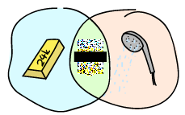

# Type Specifications and Erlang

## [PLTs Are The Best Sandwiches]


Back in [Types (or lack thereof)](types-or-lack-thereof.html#for-type-junkies), I introduced Dialyzer, a tool to find type errors in Erlang. This chapter puts its full focus on Dialyzer and how to actually find some type errors with Erlang, and how to use the tool to find other types of discrepancies. We'll start by seeing why Dialyzer was created, then what the guiding principles behind it are and its capabilities to find type-related errors, and finally, a few examples of it in use.
回到[类型（或缺乏]）（类型或缺乏。html（对于喜欢打字的人来说），我介绍了Dialyzer，一种在Erlang中查找打字错误的工具。本章将重点介绍透析器，以及如何使用Erlang查找某些类型的错误，以及如何使用该工具查找其他类型的差异。我们将首先了解透析器的诞生原因，然后了解它背后的指导原则，以及它发现与类型相关错误的能力，最后是它在使用中的几个例子。

Dialyzer is a very effective tool when it comes to analyzing Erlang code. It's used to find all kinds of discrepancies, such as code that will never be executed, but its main use is usually centered around finding type errors in your Erlang code base.
在分析Erlang代码时，透析器是一个非常有效的工具。它用于查找各种差异，例如永远不会执行的代码，但它的主要用途通常是在Erlang代码库中查找类型错误。

Before seeing much of it, we'll create Dialyzer's *Persistent Lookup Table* (*PLT*), which is a compilation of all the details Dialyzer can identify about the applications and modules that are part of your standard Erlang distribution, and code outside of OTP too. It takes quite a while to compile everything, especially if you're running it on a platform that has no native compilation through HiPE (namely Windows), or on older versions of Erlang. Fortunately things tend to get faster with time, and the newest versions of Erlang in newer releases (R15B02 onward) are getting parallel Dialyzer to make things even faster. Enter the following command into a terminal, and let it run as long as it needs:
在了解更多内容之前，我们将创建Dialyzer的*持久查找表*（*PLT*），这是Dialyzer可以识别的有关标准Erlang发行版中的应用程序和模块的所有详细信息的汇编，以及OTP之外的代码。编译所有内容需要相当长的时间，尤其是在没有通过HiPE（即Windows）进行本机编译的平台上运行，或者在旧版本的Erlang上运行。幸运的是，随着时间的推移，事情往往会变得更快，最新版本的Erlang（R15B02之后）正在使用并行透析器，使事情变得更快。在终端中输入以下命令，并让其运行所需的时间：

```eshell
$ dialyzer --build_plt --apps erts kernel stdlib crypto mnesia sasl common_test eunit
Compiling some key modules to native code... done in 1m19.99s
Creating PLT /Users/ferd/.dialyzer_plt ...
eunit_test.erl:302: Call to missing or unexported function eunit_test:nonexisting_function/0
Unknown functions:
compile:file/2
compile:forms/2
...
xref:stop/1
Unknown types:
compile:option/0
done in 6m39.15s
done (warnings were emitted)
```

This command builds the PLT by specifying which OTP applications we want to include in it. You can ignore the warnings if you want, as Dialyzer can deal with unknown functions when looking for type errors. We'll see why when we get to discuss how its type inference algorithm works, later in the chapter. Some Windows users will see an error message saying \"The HOME environment variable needs to be set so that Dialyzer knows where to find the default PLT\". This is because Windows doesn't always come with the `HOME` environment variable set, and Dialyzer doesn't know where to dump the PLT. Set the variable to wherever you want Dialyzer to place its files.
此命令通过指定要包含在其中的OTP应用程序来构建PLT。如果你想的话，你可以忽略这些警告，因为在寻找类型错误时，透析器可以处理未知的功能。我们将在本章后面讨论其类型推断算法的工作原理时了解原因。一些Windows用户会看到一条错误消息，称“需要设置HOME环境变量，以便透析器知道在哪里可以找到默认PLT”。这是因为Windows并不总是带有“HOME”环境变量集，透析器也不知道将PLT转储到哪里。将变量设置为需要透析器放置文件的位置。

If you want, you can add applications like `ssl` or `reltool` by adding them to the sequence that follows `--apps`, or if your PLT is already built, by calling:
如果需要，您可以通过将“ssl”或“reltool”等应用程序添加到“--apps”之后的序列中，或者如果您的PLT已经生成，则可以通过调用：

```eshell
$ dialyzer --add_to_plt --apps ssl reltool
```

If you want to add your own applications or modules to the PLT, you can do so by using `-r Directories`, which will look for all `.erl` or `.beam` files (as long as they're compiled with `debug_info`) to add them to the PLT.
如果您想将自己的应用程序或模块添加到PLT中，可以使用`-r目录`，该目录将查找所有应用程序或模块`。呃`或者`。beam`文件（只要它们是用'debug_info'编译的）将它们添加到PLT中。

Moreover, Dialyzer lets you have many PLTs by specifying them with the `--plt Name` option in any of the commands you do, and pick a specific PLT. Alternatively, if you built many *disjoint PLTs* where none of the included modules are shared between PLTs, you can 'merge' them by using `--plts Name1 Name2 ... NameN`. This is especially useful when you want to have different PLTs in your system for different projects or different Erlang versions. The downside of this is that information obtained from merged PLTs is not as precise as if all information was contained in a single one to begin with.
此外，Dialyzer通过在任何命令中使用“-plt Name”选项指定多个plt，并选择一个特定的plt，让您拥有多个plt。或者，如果您构建了许多*不相交的PLT*，其中包含的模块没有在PLT之间共享，那么您可以使用“-PLTs Name1 Name2”来“合并”它们。。。纳曼`。当您希望在系统中为不同的项目或不同的Erlang版本使用不同的PLT时，这一点尤其有用。这样做的缺点是，从合并的PLT获得的信息并不像一开始所有信息都包含在一个PLT中那样精确。

While the PLT is still building, we should get acquainted with Dialyzer's mechanism to find type errors.
当PLT还在建立时，我们应该了解透析器发现类型错误的机制。

## [Success Typing]

As it is the case with most other dynamic programming languages, Erlang programs are always at risk of suffering from type errors. A programmer passes in some arguments to a function he shouldn't have, and maybe he forgot to test things properly. The program gets deployed, and everything seems to be going okay. Then at four in the morning, your company's operations guy's cell phone starts ringing because your piece of software is repeatedly crashing, enough that the supervisors can't cope with the sheer weight of your mistakes.
与大多数其他动态编程语言一样，Erlang程序总是有遭受类型错误的风险。程序员将一些参数传递给一个他不应该拥有的函数，也许他忘记了正确地测试东西。程序部署完毕，一切似乎都进展顺利。然后在凌晨四点，你公司的运营人员的手机开始响起来，因为你的软件正在反复崩溃，以至于主管无法应对你的错误。


![Atlas用“无测试”、“打字错误”、“大消息”、“错误”等不好的实践术语搬起石头。](。。/静态/img/atlas。png“阿特拉斯耸耸肩，重写代码”）

The next morning, you get at the office, and you find your computer has been reformatted, your car gets keyed, and your commit rights have been revoked, all by the operations guy who has had enough of you accidentally controlling his work schedule.
第二天早上，你到了办公室，你发现你的电脑被重新格式化了，你的车被锁上了钥匙，你的提交权被吊销了，所有这些都是由运营部的家伙造成的，他受够了你不小心控制了他的工作日程。

That entire debacle could have been prevented by a compiler that has a static type analyzer to verify programs before they run. While Erlang doesn't crave a type system as much as other dynamic languages, thanks to its reactive approach to run-time errors, it is definitely nice to benefit from the additional safety usually provided by early type-related error discovery.
如果有一个编译器，它有一个静态类型分析器，可以在程序运行之前对其进行验证，那么整个崩溃本来是可以避免的。尽管Erlang不像其他动态语言那样渴望类型系统，但由于其对运行时错误的反应性方法，它确实很高兴能从早期类型相关错误发现通常提供的额外安全性中获益。

Usually, languages with static type systems get to be designed that way. The semantics of the language is heavily influenced by their type systems in what they allow and don't allow. For example, a function such as:
通常，带有静态类型系统的语言就是这样设计的。语言的语义在很大程度上受其类型系统的影响，即它们允许什么和不允许什么。例如，一个函数，例如：

```erl
foo(X) when is_integer(X) -> X + 1;
foo(X) -> list_to_atom(X).
```

Most type systems are unable to properly represent the types of the function above. They can see that it can take an integer or a list and return an integer or an atom, but they won't track the dependency between the input type of the function and its output type (conditional types and intersection types are able to, but they can be verbose). This means that writing such functions, which is entirely normal in Erlang, can result in some uncertainty for the type analyzer when these functions get used later on in the code.
大多数类型系统无法正确表示上述函数的类型。他们可以看到，它可以接受一个整数或一个列表，并返回一个整数或一个原子，但他们不会跟踪函数的输入类型和输出类型之间的依赖关系（条件类型和交集类型可以，但它们可以是详细的）。这意味着编写这样的函数在Erlang中是完全正常的，当这些函数稍后在代码中使用时，可能会给类型分析器带来一些不确定性。

Generally speaking, analyzers will want to actually *prove* that there will be no type errors at run time, as in mathematically prove. This means that in a few circumstances, the type checker will disallow certain practically valid operations for the sake of removing uncertainty that could lead to crashes.
一般来说，分析人员希望实际证明在运行时不会出现类型错误，就像数学证明一样。这意味着在少数情况下，类型检查器将不允许某些实际有效的操作，以消除可能导致崩溃的不确定性。

Implementing such a type system would likely mean forcing Erlang to change its semantics. The problem is that by the time Dialyzer came around, Erlang was already well in use for very large projects. For any tool like Dialyzer to be accepted, it needed to respect Erlang's philosophies. If Erlang allows pure nonsense in its types that can only be solved at run time, so be it. The type checker doesn't have a right to complain. No programmer likes a tool that tells him his program cannot run when it has been doing so in production for a few months already!
实现这样一个类型系统可能意味着迫使Erlang更改其语义。问题是，当透析器出现时，Erlang已经在非常大的项目中得到了很好的使用。任何像透析器这样的工具都需要尊重Erlang的哲学才能被接受。如果Erlang允许其类型中只有在运行时才能解决的纯无意义问题，那就这样吧。打字员无权投诉。没有一个程序员喜欢这样一个工具：当他的程序已经在生产中运行了几个月后，它会告诉他程序无法运行！

The other option is then to have a type system that will not *prove* the absence of errors, but will do a best effort at detecting whatever it can. You can make such detection really good, but it will never be perfect. It's a tradeoff to be made.
另一个选择是使用一个不会“证明”没有错误的类型系统，但会尽最大努力检测任何可能的错误。你可以让这样的检测非常好，但它永远不会完美。这是一个需要权衡的问题。

Dialyzer's type system thus made the decision not to prove that a program is error-free when it comes to types, but only to find as many errors as possible without ever contradicting what happens in the real world:
透析器的类型系统因此决定不证明程序在类型方面是无错误的，而只是尽可能多地发现错误，而不与现实世界中发生的情况相矛盾：

> Our main goal is to make uncover the implicit type information in Erlang code and make it explicitly available in programs. Because of the sizes of typical Erlang applications, the type inference should be completely automatic and faithfully respect the operational semantics of the language. Moreover, it should impose no code rewrites of any kind. The reason for this is simple. Rewriting, often safety critical, applications consisting of hundreds of thousand lines of code just to satisfy a type inferencer is not an option which will enjoy much success. However, large software applications have to be maintained, and often not by their original authors. By automatically revealing the type information that is already present, we provide automatic documentation that can evolve together with the program and will not rot. We also think that it is important to achieve a balance between precision and readability. Last but not least, the inferred typings should never be wrong.
>我们的主要目标是揭示Erlang代码中的隐式类型信息，并使其在程序中显式可用。由于典型Erlang应用程序的规模，类型推断应该是完全自动的，并且忠实地尊重语言的操作语义。此外，它不应该强制执行任何类型的代码重写。原因很简单。重写由数十万行代码组成的应用程序（通常是安全关键的应用程序），只是为了满足类型推断器的要求，这不是一个会获得很大成功的选项。然而，大型软件应用程序必须维护，而且通常不是由其原始作者维护。通过自动显示已经存在的类型信息，我们提供了自动文档，可以与程序一起发展，不会腐烂。我们还认为，在精确度和可读性之间取得平衡是很重要的。最后但并非最不重要的一点是，推断的打字永远不应该是错误的。

As the [Success Typings paper](http://www.it.uu.se/research/group/hipe/papers/succ_types.pdf) behind Dialyzer explains it, a type checker for a language like Erlang should work without type declarations being there (although it accepts hints), should be simple and readable, should adapt to the language (and not the other way around), and only complain on type errors that would guarantee a crash.
作为[成功打字论文](http://www。信息技术。uu。se/研究/小组/hipe/论文/成功类型。pdf）Dialyzer解释说，像Erlang这样的语言的类型检查器应该在没有类型声明的情况下工作（尽管它接受提示），应该简单易读，应该适应该语言（而不是相反），并且只抱怨会导致崩溃的类型错误。

Dialyzer thus begins each analysis optimistically assuming that all functions are good. It will see them as always succeeding, accepting anything, and possibly returning anything. No matter how an unknown function is used, it's a good way to use it. This is why warnings about unknown functions are not a big deal when generating PLTs. It's all good anyway; Dialyzer is a natural optimist when it comes to type inference.
因此，透析器乐观地开始每次分析，假设所有功能都良好。它将看到他们总是成功，接受任何东西，并可能回报任何东西。无论未知函数如何使用，这都是一种很好的使用方法。这就是为什么在生成PLT时，有关未知功能的警告不是什么大问题。反正一切都很好；在类型推断方面，透析器是天生的乐观主义者。

As the analysis goes, Dialyzer gets to know your functions better and better. As it does so, it can analyze the code and see some interesting things. Say one of your functions has a `+` operator between both of its arguments and that it returns the value of the addition. Dialyzer no longer assumes that the function takes anything and returns anything, but will now expect the arguments to be numbers (either integers or floating point values), and the returned values will similarly be numbers. This function will have a basic type associated to it saying that it accepts two numbers and returns a number.
随着分析的进行，透析器越来越了解你的功能。当它这样做时，它可以分析代码并看到一些有趣的东西。假设其中一个函数的两个参数之间都有一个“+”运算符，并且它返回加法的值。Dialyzer不再假设函数接受任何内容并返回任何内容，而是现在希望参数是数字（整数或浮点值），并且返回的值将类似地是数字。此函数将有一个与之关联的基本类型，表示它接受两个数字并返回一个数字。

Now let's say one of your functions calls the one described above with an atom and a number. Dialyzer will think about the code and say \"wait a minute, you can't use an atom and a number with the `+` operator!\" It will then freak out because where the function could return a number before, it can not return anything given how you use it.
现在让我们假设你的一个函数用一个原子和一个数字调用上面描述的函数。透析器会思考代码，然后说“等一下，你不能在“+”操作符中使用原子和数字！”然后它会崩溃，因为在函数可以返回数字之前，它不能返回任何给定使用方式的数字。

In more general circumstances, though, you might see Dialyzer keep silent on many things that you know will *sometimes* cause an error. Take for example a snippet of code looking a bit like this:
不过，在更一般的情况下，你们可能会看到透析器对许多你们知道有时会导致错误的事情保持沉默。例如，一段代码看起来有点像这样：

```erl
main() ->
    X = case fetch() of
        1 -> some_atom;
        2 -> 3.14
    end,
    convert(X).

convert(X) when is_atom(X) -> .
```

This bit of code assumes the existence of a `fetch/0` function that returns either `1`. Based on this, we either return an atom or a floating point number.
这段代码假设存在一个'fetch/0'函数，该函数返回'1'中的任何一个`。基于此，我们要么返回一个原子，要么返回一个浮点数。

From our point of view, it appears that at some point in time, the call to `convert/1` will fail. We'd likely expect a type error there whenever `fetch()` returns 2, which sends a floating point value to `convert/1`. Dialyzer doesn't think so. Remember, Dialyzer is optimistic. It has figurative faith in your code, and because there is the *possibility* that the function call to `convert/1` succeeds at some point, Dialyzer will keep silent. No type error is reported in this case.
从我们的角度来看，似乎在某个时间点，对“convert/1”的调用将失败。只要'fetch（）'返回2，就会向'convert/1发送一个浮点值，我们很可能会在那里看到一个类型错误`。透析器不这么认为。记住，透析器是乐观的。它对你的代码有着象征性的信任，而且因为“convert/1”的函数调用有可能在某个时刻成功，透析器将保持沉默。本例中未报告类型错误。

## [Type Inference and Discrepancies]

For a practical example of the principles above, let's try Dialyzer on a few modules. The modules are [discrep1.erl](static/erlang/discrep1.erl.html). They're evolutions of each other. Here's the first one:
关于上述原理的一个实际例子，让我们在几个模块上试用透析器。模块是[1]。erl]（静态/erlang/离散）。呃。（html）。它们是彼此的进化。第一个是：

```erl
-module(discrep1).
-export([run/0]).

run() -> some_op(5, you).

some_op(A, B) -> A + B.
```

The error in that one is kind of obvious. You can't add `5` to the `you` atom. We can try Dialyzer on that piece of code, assuming the PLT has been created:
其中的错误是显而易见的。你不能把'5'加到'You'原子上。假设PLT已创建，我们可以在该代码段上试用透析器：

```erl
$ dialyzer discrep1.erl
  Checking whether the PLT /home/ferd/.dialyzer_plt is up-to-date... yes
  Proceeding with analysis...
discrep1.erl:4: Function run/0 has no local return
discrep1.erl:4: The call discrep1:some_op(5,'you') will never return since it differs in the 2nd argument from the success typing arguments: (number(),number())
谨慎的。erl:4:调用discrep1:some_op（5，'you'）将永远不会返回，因为它在第二个参数中与成功键入的参数不同：（number（），number（））
discrep1.erl:6: Function some_op/2 has no local return
discrep1.erl:6: The call erlang:'+'(A::5,B::'you') will never return since it differs in the 2nd argument from the success typing arguments: (number(),number())
谨慎的。erl:6:调用erlang:“+”（A:：5，B:：“you”）将永远不会返回，因为它在第二个参数中与成功键入的参数不同：（number（），number（））
 done in 0m0.62s
done (warnings were emitted)
```

Oh bloody fun, Dialyzer found stuff. What the hell does it mean? The first one is an error you will see happening a *lot* of times using Dialyzer. 'Function Name/Arity has no local return' is the standard Dialyzer warning emitted whenever a function provably doesn't return anything (other than perhaps raising an exception) because one of the function it calls happens to trip Dialyzer's type error detector or raises an exception itself. When such a thing happens, the set of possible types of values the function could return is empty; it doesn't actually return. This error propagates to the function that called it, giving us the 'no local return' error.
真有趣透析器找到了东西。这到底是什么意思？第一个是一个错误，你会发现使用透析器会发生很多次。\“Function Name/Arity has no local return”（函数名/算术无本地返回）是当函数可证明不返回任何内容（可能引发异常除外）时发出的标准透析器警告，因为它调用的函数之一碰巧触发透析器的类型错误检测器或自身引发异常。发生这种情况时，函数可能返回的可能类型的值集为空；它实际上不会回来。此错误会传播到调用它的函数，从而导致“无本地返回”错误。

The second error is somewhat more understandable. It says that calling `some_op(5, 'you')` breaks what Dialyzer detected would be the types required to make the function work, which is two numbers (`number()` and `number()`). Granted the notation is a bit foreign for now, but we'll see it in more details soon enough.
第二个错误更容易理解。它说，调用'some_op（5，'you'）'会破坏透析器检测到的使函数工作所需的类型，即两个数字（'number（）'和'number（）'））。虽然现在这个符号有点陌生，但我们很快就会看到更多细节。

The third error is yet again a no local return. The first one was because `some_op/2` would fail, this one is because the `+` call that will fail. This is what the fourth and last error is about. The plus operator (actually the function `erlang:'+'/2` can't add the number `5` to the atom `you`.
第三个错误是没有本地返回。第一个是因为'some_op/2'会失败，这一个是因为`+'调用会失败。这就是第四个也是最后一个错误。加号运算符（实际上是函数'erlang:'+'/2'不能将数字'5'添加到原子'you'中）`。

What about [discrep2.erl](static/erlang/discrep2.erl.html)? Here's what it looks like:

```erl
-module(discrep2).
-export([run/0]).

run() ->
    Tup = money(5, you),
    some_op(count(Tup), account(Tup)).

money(Num, Name) -> .
count() -> Num.
account() -> X.

some_op(A, B) -> A + B.
```

If you run Dialyzer over that file again, you'll get similar errors to before:

```erl
$ dialyzer discrep2.erl
  Checking whether the PLT /home/ferd/.dialyzer_plt is up-to-date... yes
  Proceeding with analysis...
discrep2.erl:4: Function run/0 has no local return
discrep2.erl:6: The call discrep2:some_op(5,'you') will never return since it differs in the 2nd argument from the success typing arguments: (number(),number())
谨慎的。erl:6:调用discrep2:some_op（5，'you'）将永远不会返回，因为它在第二个参数中不同于成功键入的参数：（number（），number（））
discrep2.erl:12: Function some_op/2 has no local return
discrep2.erl:12: The call erlang:'+'(A::5,B::'you') will never return since it differs in the 2nd argument from the success typing arguments: (number(),number())
谨慎的。erl:12:调用erlang:“+”（A:：5，B:：“you”）将永远不会返回，因为它在第二个参数中与成功键入的参数不同：（number（），number（））
 done in 0m0.69s
done (warnings were emitted)
```

During its analysis, Dialyzer can see the types right through the `count/1` and `account/1` functions. It infers the types of each of the elements of the tuple and then figures out the values they pass. It can then find the errors again, without a problem.
在分析过程中，透析器可以通过'count/1'和'account/1'功能正确地看到类型。它推断元组中每个元素的类型，然后计算它们传递的值。然后它可以毫无问题地再次找到错误。

Let's push it a bit further, with [discrep3.erl](static/erlang/discrep3.erl.html):

```erl
-module(discrep3).
-export([run/0]).

run() ->
    Tup = money(5, you),
    some_op(item(count, Tup), item(account, Tup)).

money(Num, Name) -> .

item(count, ) -> X;
item(account, ) -> X.

some_op(A, B) -> A + B.
```

This version introduces a new level of indirection. Instead of having a function clearly defined for the count and the account values, this one works with atoms and switches to different function clauses. If we run Dialyzer on it, we get this:
这个版本引入了一个新的间接层次。它没有为count和account值定义一个明确的函数，而是使用原子并切换到不同的函数子句。如果我们在上面运行透析器，我们会得到：

```erl
$ dialyzer discrep3.erl
  Checking whether the PLT /home/ferd/.dialyzer_plt is up-to-date... yes
  Proceeding with analysis... done in 0m0.70s
done (passed successfully)
```


Uh oh. Somehow the new change to the file made things complex enough that Dialyzer got lost in our type definitions. The error is still there though. We'll get back to understanding why Dialyzer doesn't find the errors in this file and how to fix it in a while, but for now, there are still a few more ways to run Dialyzer that we need to explore.
哦。不知何故，对文件的新修改使事情变得足够复杂，以至于透析器在我们的类型定义中丢失了。但错误仍然存在。我们将继续了解为什么透析器在这个文件中找不到错误，以及如何在一段时间内修复它，但是现在，我们还需要探索更多运行透析器的方法。

If we wanted to run Dialyzer over, say, our [Process Quest release](static/erlang/processquest.zip), we could do it as follows:
如果我们想运行透析器，比如我们的[Process Quest release]（static/erlang/processquest）。zip），我们可以按如下方式进行：

```eshell
$ cd processquest/apps
$ ls
processquest-1.0.0  processquest-1.1.0  regis-1.0.0  regis-1.1.0  sockserv-1.0.0  sockserv-1.0.1
```

So we've got a bunch of libraries. Dialyzer wouldn't like it if we had many modules with the same names, so we'll need to specify directories manually:
所以我们有很多图书馆。如果我们有许多同名的模块，透析器将不喜欢它，因此我们需要手动指定目录：

```eshell
$ dialyzer -r processquest-1.1.0/src regis-1.1.0/src sockserv-1.0.1/src
Checking whether the PLT /home/ferd/.dialyzer_plt is up-to-date... yes
Proceeding with analysis...
dialyzer: Analysis failed with error:
No .beam files to analyze (no --src specified?)
```

Oh right. By default, dialyzer will look for `.beam` files. We need to add the `--src` flag to tell Dialyzer to use `.erl` files for its analysis:
哦，对了。默认情况下，透析器将查找`。梁文件。我们需要添加“--src”标志来告诉透析器使用`。erl的分析文件：

```eshell
$ dialyzer -r processquest-1.1.0/src regis-1.1.0/src sockserv-1.0.1/src --src
Checking whether the PLT /home/ferd/.dialyzer_plt is up-to-date... yes
Proceeding with analysis... done in 0m2.32s
done (passed successfully)
```

You'll note that I chose to add the `src` directory to all requests. You could have done the same search without it, but then Dialyzer would have complained about a bunch of errors related to EUnit tests, based on how some of the assertion macros work with regard to the code analysis --- we do not really care about these. Plus, if you sometimes test for failures and make your software crash on purpose inside of tests, Dialyzer will pick on that and you might not want it to.
您会注意到，我选择将'src'目录添加到所有请求中。如果没有它，您也可以进行同样的搜索，但Dialyzer会根据一些断言宏在代码分析方面的工作方式，抱怨与EUnit测试相关的一系列错误——我们并不真正关心这些。另外，如果你有时测试失败，并在测试过程中故意让你的软件崩溃，透析器会发现这一点，你可能不希望它这样做。

## [Typing About Types of Types]

As seen with [discrep3.erl](static/erlang/discrep3.erl.html), Dialyzer will sometimes not be able to infer all the types in the way we intended it. That's because Dialyzer cannot read our minds. To help out Dialyzer in its task (and mostly help ourselves), it is possible to declare types and annotate functions in order to both document them and help formalize the implicit expectations about types we put in our code.
如[3]所示。erl]（静态/erlang/discrep3）。呃。html），透析器有时无法按照我们预期的方式推断出所有类型。那是因为透析器不能读懂我们的思想。为了帮助Dialyzer完成任务（主要是帮助我们自己），可以声明类型和注释函数，以便记录它们，并帮助形式化我们在代码中对类型的隐含期望。

Erlang types can be things simple as say, the number 42, noted `42` as a type (nothing different from usual), or specific atoms such as `cat`, or maybe `molecule`. Those are called *singleton types* as they refer to a value itself. The following singleton types exist:
Erlang类型可以是一些简单的东西，比如说，数字42，以'42'作为一种类型（与通常没有什么不同），或者特定的原子，比如'cat'，或者可能是'molecular'`。这些被称为“单例类型”，因为它们指的是一个值本身。存在以下单例类型：

  --------------- -----------------------------------------
  `'some atom'`   Any atom can be its own singleton type.
  `42`            A given integer.
  `[]`            An empty list.
  ``            An empty tuple.
  `<<>>`          An empty binary.
  --------------- -----------------------------------------

You can see that it could be annoying to program Erlang using only these types. There is no way to express things such as ages, or much less \"all the integers\" for our programs by using singleton types. And then, even if we had a way to specify many types at once, it would be awfully annoying to express things such as 'any integer' without writing them all by hand, which isn't exactly possible anyway.
您可以看到，仅使用这些类型编程Erlang可能会很烦人。对于我们的程序来说，没有办法用单例类型来表达诸如年龄之类的东西，更不用说“所有整数”。然后，即使我们有一种方法可以同时指定许多类型，但如果不手工编写诸如“任意整数”之类的内容，这将是非常烦人的，无论如何这是不可能的。

Because of this, Erlang has *union types*, which allow you to describe a type that has two atoms in it, and *built-in types*, which are pre-defined types, not necessarily possible to build by hand, and they're generally useful. Union types and built-in types generally share a similar syntax, and they're noted with the form `TypeName()`. For example, the type for all possible integers would be noted `integer()`. The reason why parentheses are used is that they let us differentiate between, say the type `atom()` for all atoms, and `atom` for the specific `atom` atom. Moreover, to make code clearer, many Erlang programmers choose to quote all atoms in type declarations, giving us `'atom'` instead of `atom`. This makes it explicit that `'atom'` was meant to be a singleton type, and not a built-in type where the programmer forgot the parentheses.
因此，Erlang有*联合类型*，允许您描述一个包含两个原子的类型，以及*内置类型*，它们是预定义的类型，不一定可以手工构建，而且通常很有用。联合类型和内置类型通常具有相似的语法，它们以`TypeName（）的形式出现`。例如，所有可能整数的类型都将被标注为“integer（）`。之所以使用括号，是因为它们让我们能够区分所有原子的类型“atom（）”，以及特定的“atom”原子的类型“atom”。此外，为了让代码更清晰，许多Erlang程序员选择在类型声明中引用所有原子，将“atom”改为“atom”`。这就明确了“atom”是一个单例类型，而不是程序员忘记括号的内置类型。

Following is a table of built-in types provided with the language. Note that they do not all have the same syntax as union types do. Some of them, like binaries and tuples, have a special syntax to make them friendlier to use.
下面是该语言提供的内置类型表。请注意，它们的语法并不都与联合类型相同。其中一些，比如二进制和元组，有一种特殊的语法，使它们更易于使用。

  ------------------------------------------- -------------------------------------------------------------------------------------------------------------------------------------------------------------------------------------------------------------------------------------------------------------------------------------------------------------------------------------------------------------------------------------------------------------------------------------------------------------------------------------------------------------------------------------------------------------------------------------------------------------------------------------------------------------------------------
------------------------------------------- -------------------------------------------------------------------------------------------------------------------------------------------------------------------------------------------------------------------------------------------------------------------------------------------------------------------------------------------------------------------------------------------------------------------------------------------------------------------------------------------------------------------------------------------------------------------------------------------------------------------------------------------------------------------------------
  `any()`                                     Any Erlang term at all.
  `none()`                                    This is a special type that means that no term or type is valid. Usually, when Dialyzer boils down the possible return values of a function to `none()`, it means the function should crash. It is synonymous with \"this stuff won't work.\"
`none（）`这是一种特殊类型，意味着没有有效的术语或类型。通常，当透析器将函数的可能返回值归结为“none（）”时，这意味着函数应该崩溃。它是“这东西行不通”的同义词。\"
  `pid()`                                     A process identifier.
  `port()`                                    A port is the underlying representation of file descriptors (which we rarely see unless we go dig deep inside the innards of Erlang libraries), sockets, or generally things that allow Erlang to communicate with the outside world, such as the `erlang:open_port/2` function. In the Erlang shell, they look like `#Port<0.638>`.
`port（）`端口是文件描述符（除非深入研究Erlang库的内部，否则我们很少看到）的底层表示形式、套接字，或者通常是允许Erlang与外部世界通信的东西，例如`Erlang:open_port/2`函数。在Erlang shell中，它们看起来像`#Port<0。638>`。
  `reference()`                               Unique values returned by `make_ref()` or `erlang:monitor/2`.
`reference（）`由`make_ref（）`或`erlang:monitor/2返回的唯一值`。
  `atom()`                                    Atoms in general.
  `binary()`                                  A blob of binary data.
  `<<_:Integer>>`                             A binary of a known size, where `Integer` is the size.
  `<<_:_*Integer>>`                           A binary that has a given unit size, but of unspecified length.
`<<<：*Integer>>一种二进制文件，具有给定的单位大小，但长度未指定。
  `<<_:Integer, _:_*OtherInteger>>`           A mix of both previous forms to specify that a binary can have a minimum length.
`<<整数，:*OtherInteger>>混合使用前两种形式，指定二进制文件可以具有最小长度。
  `integer()`                                 Any integer.
  `N..M`                                      A range of integers. For example, if you wanted to represent a number of months in a year, the range `1..12` could be defined. Note that Dialyzer reserves the right to expand this range into a bigger one.
`N。。一系列整数。例如，如果要表示一年中的月数，则范围为`1。。12 `可以定义。请注意，透析器保留将此范围扩大到更大范围的权利。
  `non_neg_integer()`                         Integers that are greater or equal to 0.
  `pos_integer()`                             Integers greater than 0.
  `neg_integer()`                             Integers up to -1
  `float()`                                   Any floating point number.
  `fun()`                                     Any kind of function.
  `fun((...) -> Type)`                        An anonymous function of any arity that returns a given type. A given function that returns lists could be noted as `fun((...) -> list())`.
`有趣的((。。。)->Type）`返回给定类型的任意一个匿名函数。返回列表的给定函数可以称为“fun”((。。。)->list（））`。
  `fun(() -> Type)`                           An anonymous function with no arguments, returning a term of a given type.
`fun（（）->Type）`一个没有参数的匿名函数，返回给定类型的项。
  `fun((Type1, Type2, ..., TypeN) -> Type)`   An anonymous function taking a given number of arguments of a known type. An example could be a function that handles an integer and a floating point value, which could be declared as `fun((integer(), float()) -> any())`.
`有趣（（类型1，类型2，。。。，TypeN）->Type）`一个匿名函数，具有给定数量的已知类型的参数。例如，一个处理整数和浮点值的函数，可以声明为'fun（（integer（），float（））->any（））`。
  `[]`                                        An empty list.
  `[Type()]`                                  A list containing a given type. A list of integers could be defined as `[integer()]`. Alternatively, it can be written as `list(Type())`. The type `list()` is shorthand for `[any()]`. Lists can sometimes be improper (like `[1, 2 | a]`). As such, Dialyzer has types declared for improper lists with `improper_list(TypeList, TypeEnd)`. The improper list `[1, 2 | a]` could be typed as `improper_list(integer(), atom())`, for example. Then, to make matters more complex, it is possible to have lists where we are not actually sure whether the list will be proper or not. In such circumstances, the type `maybe_improper_list(TypeList, TypeEnd)` can be used.
`[Type（）]`包含给定类型的列表。可以定义为整数列表`。或者，它可以写为'list（Type（））`。类型'list（）'是`[any（）]的简写形式`。列表有时可能不合适（比如“[1,2|a]”）。因此，透析器的类型声明为“不正确列表”（TypeList，TypeEnd）`。例如，不正确的列表“[1，2|a]”可以被键入“不正确的_列表（integer（），atom（））”。然后，为了让事情变得更复杂，我们可以列出我们实际上不确定该列表是否正确的列表。在这种情况下，可以使用'maybe_unroperty_list（TypeList，TypeEnd）'类型。
  `[Type(), ...]`                             This special case of `[Type()]` mentions that the list can not be empty.
`[Type（），。。。]`“[Type（）]”的这个特殊情况提到列表不能为空。
  `tuple()`                                   Any tuple.
  ``.
  ------------------------------------------- -------------------------------------------------------------------------------------------------------------------------------------------------------------------------------------------------------------------------------------------------------------------------------------------------------------------------------------------------------------------------------------------------------------------------------------------------------------------------------------------------------------------------------------------------------------------------------------------------------------------------------------------------------------------------------
------------------------------------------- -------------------------------------------------------------------------------------------------------------------------------------------------------------------------------------------------------------------------------------------------------------------------------------------------------------------------------------------------------------------------------------------------------------------------------------------------------------------------------------------------------------------------------------------------------------------------------------------------------------------------------------------------------------------------------


![维恩图]。最左边的圆圈是一个金锭，最右边的是一个淋浴头。中间是一个像素化和经过审查的彩色位](。。/静态/img/venn。png“肮脏的”。。。")

Given the built-in types above, it becomes a bit easier to imagine how we'd define types for our Erlang programs. Some of it is still missing though. Maybe things are too vague, or not appropriate for our needs. You do remember one of the `discrepN` modules' errors mentioning the type `number()`. That type is neither a singleton type, neither a built-in type. It would then be a union type, which means we could define it ourselves.
考虑到上面的内置类型，想象一下我们将如何为Erlang程序定义类型就容易多了。但其中一些仍然缺失。也许事情太模糊了，或者不适合我们的需要。您还记得其中一个“discrepN”modules'错误提到的类型“number（）`。该类型既不是单例类型，也不是内置类型。这将是一种联合类型，这意味着我们可以自己定义它。

The notation to represent the union of types is the pipe (`|`). Basically, this lets us say that a given type `TypeName` is represented as the union of `Type1 | Type2 | ... | TypeN`. As such, the `number()` type, which includes integers and floating point values, could be represented as `integer() | float()`. A boolean value could be defined as `'true' | 'false'`. It is also possible to define types where only one other type is used. Although it looks like a union type, it is in fact an *alias*.
表示类型并集的符号是管道（` |`）。基本上，这让我们可以说，一个给定的类型“TypeName”被表示为“Type1 | Type2”的并集|。。。|TypeN`。因此，包含整数和浮点值的`number（）`类型可以表示为`integer（）| float（）`。布尔值可以定义为“真”|“假”`。也可以定义仅使用一种其他类型的类型。虽然它看起来像一个联合类型，但实际上是一个*别名*。

In fact, many such aliases and type unions are pre-defined for you. Here are some of them:

  -------------------------- -----------------------------------------------------------------------------------------------------------------------------------------------------------------------------------------------------------------------------------------------------------------------------------------------------------------------------------------------------------------
-------------------------- -----------------------------------------------------------------------------------------------------------------------------------------------------------------------------------------------------------------------------------------------------------------------------------------------------------------------------------------------------------------
  `term()`                   This is equivalent to `any()` and was added because other tools used `term()` before. Alternatively, the `_` variable can be used as an alias of both `term()` and `any()`.
`term（）`这相当于'any（）`并且是因为之前其他工具使用了'term（）`而添加的。或者，``变量可以用作`term（）`和`any（）的别名`。
  `boolean()`                `'true' | 'false'`
  `byte()`                   Defined as `0..255`, it's any valid byte in existence.
  `char()`                   It's defined as `0..16#10ffff`, but it isn't clear whether this type refers to specific standards for characters or not. It's extremely general in its approach to avoid conflicts.
`char（）`定义为'0'。。16#10ffff`，但尚不清楚这种类型是否指字符的特定标准。避免冲突的方法非常普遍。
  `number()`                 `integer() | float()`
  `maybe_improper_list()`    This is a quick alias for `maybe_improper_list(any(), any())` for improper lists in general.
`maybe_unposter_list（）`这是maybe_unposter_list（any（），any（））`的一个快速别名，通常用于不正确的列表。
  `maybe_improper_list(T)`   Where `T` is any given type. This is an alias for `maybe_improper_list(T, any())`.
`可能是列表（T）`Where`T`是任何给定的类型。这是'maybe_unroperty_list（T，any（））的别名`。
  `string()`                 A string is defined as `[char()]`, a list of characters. There is also `nonempty_string()`, defined as `[char(), ...]`. Sadly, there is so far no string type for binary strings only, but that's more because they're blobs of data that are to be interpreted in whatever type you choose.
`string（）`字符串被定义为“[char（）]”，一个字符列表。还有“nonempty_string（）”，定义为“[char（）”，。。。]`。遗憾的是，到目前为止，还没有只用于二进制字符串的字符串类型，但这更多是因为它们是数据块，可以用您选择的任何类型进行解释。
  `iolist()`                 Ah, good old iolists. They're defined as `maybe_improper_list(char() | binary() | iolist(), binary() | [])`. you can see that the iolist is itself defined in terms of iolists. Dialyzer does support recursive types, starting with R13B04. Before then you couldn't use them, and types like iolists could only be defined through some arduous gymnastics.
`“啊，好老的暴力主义者。它们被定义为“可能”列表（char（）| binary（）| iolist（），binary（）|[]）`。你可以看到，暴力主义者本身就是用暴力主义者来定义的。透析器确实支持递归类型，从R13B04开始。在那之前，你不能使用它们，像暴力者这样的类型只能通过一些艰苦的体操来定义。
  `module()`                 This is a type standing for module names, and is currently an alias of `atom()`.
`module（）`这是一个代表模块名的类型，目前是'atom（）的别名`。
  `timeout()`                `non_neg_integer() | 'infinity'`
  `node()`                   An Erlang's node name, which is an atom.
  `no_return()`              This is an alias of `none()` intended to be used in the return type of functions. It is particularly meant to annotate functions that loop (hopefully) forever, and thus never return.
`no_return（）`这是'none（）`的别名，用于函数的返回类型。它特别是用来注释那些（希望）永远循环，因此永远不会返回的函数。
  -------------------------- -----------------------------------------------------------------------------------------------------------------------------------------------------------------------------------------------------------------------------------------------------------------------------------------------------------------------------------------------------------------
-------------------------- -----------------------------------------------------------------------------------------------------------------------------------------------------------------------------------------------------------------------------------------------------------------------------------------------------------------------------------------------------------------

Well, that makes a few types already. Earlier, I did mention a type for a tree written as ``. Now that we know a bit more about types, we could declare it in a module.
嗯，已经有几种了。早些时候，我确实提到了一种写为``。现在我们对类型有了更多的了解，我们可以在一个模块中声明它。

The syntax for type declaration in a module is:

```erl
-type TypeName() :: TypeDefinition.
```

As such, our tree could have been defined as:

```erl
-type tree() :: .
```

Or, by using a special syntax that allows to use variable names as type comments:

```erl
-type tree() :: .
```

But that definition doesn't work, because it doesn't allow for a tree to be empty. A better tree definition can be built by thinking recursively, much like we did with our [tree.erl](static/erlang/tree.erl.html)`. Translating this into a type gives us a tree node of the following form:
但这个定义不起作用，因为它不允许树为空。通过递归思考可以建立更好的树定义，就像我们对[tree]所做的那样。erl]（静态/erlang/树）。呃。（html）`。将其转换为一个类型，我们将得到一个如下形式的树节点：

```erl
-type tree() :: 
              | .
```

That way, we have a tree that is either an empty node or a non-empty node. Note that we could have used `'nil'` instead of `` and Dialyzer would have been fine with it. I just wanted to respect the way we had written our `tree` module. There's another piece of Erlang code we might want to give types to but haven't thought of yet\...
这样，我们就有了一棵树，它要么是空节点，要么是非空节点。请注意，我们可以用“nil”代替“and Dialyzer”。我只是想尊重我们写“树”模块的方式。还有另一段Erlang代码，我们可能想为其提供类型，但还没有想到\。。。

What about records? They have a somewhat convenient syntax to declare types. To see it, let's imagine a `#user` record. We want to store the user's name, some specific notes (to use our `tree()` type), the user's age, a list of friends, and some short biography.
唱片呢？它们有一种稍微方便的语法来声明类型。要查看它，让我们想象一个`#用户`记录。我们希望存储用户的姓名、一些特定的注释（使用'tree（）'类型）、用户的年龄、朋友列表和一些简短的传记。

```erl
-record(user, {name="" :: string(),
               notes :: tree(),
               age :: non_neg_integer(),
               friends=[] :: [#user],
               bio :: string() | binary()}).
```

The general record syntax for type declarations is `Field :: Type`, and if there's a default value to be given, it becomes `Field = Default :: Type`. In the record above, we can see that the name needs to be a string, the notes has to be a tree, and the age any integer from 0 to infinity (who knows how old people can get!). An interesting field is `friends`. The `[#user`. The last part tells us that the biography can be either a string or a binary.
类型声明的一般记录语法是'Field:：type'，如果要给定默认值，它将变成'Field=default:：type'`。在上面的记录中，我们可以看到名字必须是字符串，音符必须是树，年龄必须是从0到无穷大的任何整数（谁知道老年人能得到多少！）。一个有趣的领域是“朋友”`。“[#用户”`。最后一部分告诉我们，传记可以是字符串或二进制。

Furthermore, to give a more uniform style to type declarations and definitions, people tend to add an alias such as `-type Type() :: #Record.`. We could also change the `friends` definition to use the `user()` type, ending up as follows:
此外，为了给类型声明和定义提供更统一的样式，人们倾向于添加一个别名，例如`-type type（）：#Record。`。我们还可以将“friends”的定义改为使用“user（）”类型，结果如下：

```erl
-record(user, {name = "" :: string(),
               notes :: tree(),
               age :: non_neg_integer(),
               friends=[] :: [user()],
               bio :: string() | binary()}).

-type user() :: #user.
```

You'll note that I defined types for all fields of the record, but some of them have no default value. If I were to create a user record instance as `#user`, there would be *no* type error. All record field definitions have an implicit `'undefined'` union added to them if no default value is provided for them. For earlier versions, the declaration would have caused type errors.
您会注意到，我为记录的所有字段定义了类型，但其中一些字段没有默认值。如果将用户记录实例创建为`#user`，则会出现*no*类型错误。如果没有为所有记录字段定义提供默认值，则所有记录字段定义都会添加一个隐式的“undefined”并集。对于早期版本，该声明可能会导致类型错误。

## [Typing Functions]

While we could be defining types all day and night, filling files and files with them, then printing the files, framing them and feeling strongly accomplished, they won't automatically be used by Dialyzer's type inference engine. Dialyzer doesn't work from the types you declare to narrow down what is possible or impossible to execute.
虽然我们可以日夜定义类型，用它们填充文件和文件，然后打印文件，构建它们的框架，并感觉非常有成就感，但透析器的类型推理引擎不会自动使用它们。透析器不能从你声明的类型中工作，以缩小可能或不可能执行的范围。

Why the hell would we declare these types then? Documentation? Partially. There is an additional step to making Dialyzer understand the types you declared. We need to pepper type signature declarations over all the functions we want augmented, bridging our type declarations with the functions inside modules.
那我们为什么要声明这些类型呢？文档部分地。还有一个额外的步骤，让透析器了解您声明的类型。我们需要在所有需要扩展的函数上添加类型签名声明，将类型声明与模块内的函数连接起来。


We have spent most of the chapter on things like 'here is the syntax for this and that', but now it's time to get practical. A simple example of things needing to be typed could be playing cards. There are four suits: spades, clubs, hearts, and diamonds. Cards can then be numbered from 1 to 10 (where the ace is 1), and then be a Jack, Queen, or King.
本章的大部分时间我们都在讨论“这里是这个和那个的语法”，但现在是时候开始实践了。需要打字的一个简单例子是扑克牌。有四套西装：黑桃、梅花、红桃和钻石。然后，卡片可以从1到10进行编号（其中a是1），然后是杰克、王后或国王。

In regular times, we'd represent cards probably as ``. Now, instead of just having this up in the air, we can define types to represent this:
在正常情况下，我们可能会将卡片表示为``。现在，我们可以定义类型来表示这一点，而不是将其悬而未决：

```erl
-type suit() :: spades | clubs | hearts | diamonds.
-type value() :: 1..10 | j | q | k.
-type card() :: .
```

The `suit()` type is simply the union of the four atoms that can represent suits. The values can be any card from one to ten (`1..10`), or `j`, `q`, or `k` for the face cards. The `card()` type joins them together as a tuple.
suit（）类型只是四个原子的并集，可以代表suit。值可以是从1到10的任何卡（`1。。10`），或脸卡的“j”、“q”或“k”。'card（）'类型将它们作为一个元组连接在一起。

These three types can now be used to represent cards in regular functions and give us some interesting guarantees. Take the following [cards.erl](static/erlang/cards.erl.html) module for example:
这三种类型现在可以在常规函数中表示卡片，并为我们提供一些有趣的保证。拿下面的牌。erl]（静态/erlang/cards。呃。html）模块，例如：

```erl
-module(cards).
-export([kind/1, main/0]).

-type suit() :: spades | clubs | hearts | diamonds.
-type value() :: 1..10 | j | q | k.
-type card() :: .

kind() when A >= 1, A =< 10 -> number;
kind(_) -> face.

main() ->
    number = kind(),
    face   = kind(),
    number = kind(),
    face   = kind().
```

The `kind/1` function should return whether a card is a face card or a number card. You will notice that the suit is never checked. In the `main/0` function you can see that the third call is made with the `rubies` suit, something we obviously didn't intend in our types, and likely not in the `kind/1` function:
“kind/1”函数应该返回一张卡片是人脸卡还是数字卡。你会注意到这套衣服从来没有检查过。在'main/0'函数中，您可以看到第三个调用是用'rubies'套装进行的，这显然不是我们在类型中的意图，在'kind/1'函数中也可能不是：

```eshell
$ erl
...
1> c(cards).

2> cards:main().
face
```

Everything works fine. That shouldn't be the case. Even running Dialyzer does nothing. However, if we add the following type signature to the `kind/1` function:
一切正常。不应该是这样。甚至连运行透析器都没用。但是，如果我们在'kind/1'函数中添加以下类型签名：

```erl
-spec kind(card()) -> face | number.
kind() when A >= 1, A =< 10 -> number;
kind(_) -> face.
```

Then something more interesting will happen. But before we run Dialyzer, let's see how that works. Type signatures are of the form `-spec FunctionName(ArgumentTypes) -> ReturnTypes.`. In the specification above we say that the `kind/1` function accepts cards as arguments, according to the `card()` type we created. It also says the function either returns the atom `face` or `number`.
然后会有更有趣的事情发生。但在我们运行透析器之前，让我们看看它是如何工作的。类型签名的形式为`-spec FunctionName（ArgumentTypes）->ReturnTypes。`。在上面的规范中，我们说'kind/1'函数根据我们创建的'card（）'类型接受cards作为参数。它还表示，该函数要么返回原子'face'或'number'`。

Running Dialyzer on the module yields the following:

```eshell
$ dialyzer cards.erl
  Checking whether the PLT /home/ferd/.dialyzer_plt is up-to-date... yes
  Proceeding with analysis...
cards.erl:12: Function main/0 has no local return
cards.erl:15: The call cards:kind() breaks the contract (card()) -> 'face' | 'number'
 done in 0m0.80s
done (warnings were emitted)
```


,`). Dialyzer from then on assumes that the type signature is reliable, and that if the code is to be used according to it, it would logically not be valid. This breach in the contract propagates to the `main/0` function, but there isn't much that can be said at that level as to why it fails; just that it does.
在本例中，透析器尊重我们给出的类型签名，当它分析'main/0'函数时，它发现'kind/1'在其中有一个不好的用法。这将提示来自第15行的警告（`number=kind（），`）。从那时起，Dialyzer假定类型签名是可靠的，并且如果根据它使用代码，它在逻辑上是无效的。这种违反合同的行为会传播到“main/0”函数，但在这个级别上，关于它失败的原因，我们没有多少可说的；就是这样。

::: note
**Note:** Dialyzer only complained about this once a type specification was defined. Before a type signature was added, Dialyzer couldn't assume that you planned to use `kind/1` only with `card()` arguments. With the signature in place, it can work with that as its own type definition.
**注：*透析器仅在定义了型号规格后才对此提出投诉。在添加类型签名之前，Dialyzer不能假定您计划只使用带有'card（）'参数的'kind/1'。有了签名，它就可以将其作为自己的类型定义使用。
:::

Here's a more interesting function to type, in [convert.erl](static/erlang/convert.erl.html):

```erl
-module(convert).
-export([main/0]).

main() ->
    [_,_] = convert(),
     = convert([a,b]),
    [_,_] = convert([a,b]),
    ).

convert(Tup) when is_tuple(Tup) -> tuple_to_list(Tup);
convert(L = [_|_]) -> list_to_tuple(L).
```

When reading the code, it is obvious to us that the two last calls to `convert/1` will fail. The function accepts a list and returns a tuple, or a tuple and returns a list. If we run Dialyzer on the code though, it'll find nothing.
在阅读代码时，我们很明显，最后两个对“convert/1”的调用将失败。函数接受一个列表并返回一个元组，或者接受一个元组并返回一个列表。如果我们在代码上运行透析器，它将什么也找不到。

That's because Dialyzer infers a type signature similar to:

```erl
-spec convert(list() | tuple()) -> list() | tuple().
```

Or to put it in words, the function accepts lists and tuples, and returns lists in tuples. This is true, but this is sadly a bit *too* true. The function isn't as permissive as the type signature would imply. This is one of the places where Dialyzer sits back and tries not to say too much without being 100% sure of the problems.
换句话说，该函数接受列表和元组，并返回元组中的列表。这是真的，但遗憾的是，这有点太真实了。该函数并不像类型签名所暗示的那样允许。这是一个透析器坐在后面，在没有100%确定问题的情况下尽量不说太多的地方。

To help Dialyzer a bit, we can send in a fancier type declaration:

```erl
-spec convert(tuple()) -> list();
             (list()) -> tuple().
convert(Tup) when is_tuple(Tup) -> tuple_to_list(Tup);
convert(L = [_|_]) -> list_to_tuple(L).
```

Rather than putting `tuple()` and `list()` types together into a single union, this syntax allows you to declare type signatures with alternative clauses. If you call `convert/1` with a tuple, we expect a list, and the opposite in the other case.
这种语法不需要将'tuple（）'和'list（）'类型放在一个联合中，而是允许您使用可选子句声明类型签名。如果用元组调用'convert/1'，我们需要一个列表，在另一种情况下则相反。

With this more specific information, Dialyzer can now give more interesting results:

```eshell
$ dialyzer convert.erl
  Checking whether the PLT /home/ferd/.dialyzer_plt is up-to-date... yes
  Proceeding with analysis...
convert.erl:4: Function main/0 has no local return
convert.erl:7: The pattern [_, _] can never match the type tuple()
 done in 0m0.90s
done (warnings were emitted)
```

Ah, there it finds the error. Success! We can now use Dialyzer to tell us what we knew. Of course putting it that way sounds useless, but when you type your functions right and make a tiny mistake that you forget to check, Dialyzer will have your back, which is definitely better than an error logging system waking you up at night (or having your car keyed by your operations guy).
啊，它发现了错误。成功我们现在可以用透析器告诉我们所知道的。当然，这样说听起来没用，但当你输入正确的功能，犯了一个你忘记检查的小错误时，透析器就会帮你，这肯定比错误记录系统在晚上叫醒你（或者让你的操作人员给你的车钥匙）要好。

::: note
**Note:** some people will prefer the following syntax for multi-clause type signature:

```erl
-spec convert(tuple()) -> list()
      ;      (list()) -> tuple().
```

which is exactly the same, but puts the semi-colon on another line because it might be more readable. There is no widely accepted standard at the time of this writing.
这是完全相同的，但把分号放在另一行，因为它可能更可读。在撰写本文时，还没有广泛接受的标准。
:::

By using type definitions and specifications in that way, we're in fact able to let Dialyzer find errors with our earlier `discrep` modules. See how [discrep4.erl](static/erlang/discrep4.erl.html) does it.
通过以这种方式使用类型定义和规范，我们实际上能够让透析器发现我们早期“discrep”模块的错误。看看怎么做。erl]（静态/erlang/discrep4）。呃。是吗。

## [Typing Practice]

I've been writing a queue module, for First In, First Out (FIFO) operations. You should know what queues are, given Erlang's mailboxes are queues. The first element added will be the first one to be popped (unless we do selective receives). The module works as explained in this image we've seen a few times already:
我一直在写一个队列模块，用于先进先出（FIFO）操作。考虑到Erlang的邮箱是队列，您应该知道什么是队列。添加的第一个元素将是第一个弹出的元素（除非我们这样做）。该模块的工作原理如图所示，我们已经见过几次了：


, with a few type signatures I added to check it with Dialyzer:
这里是[我的模块]（静态/erlang/fifo_类型。呃。html），并添加了一些类型签名，以便使用透析器进行检查：

```erl
-module(fifo_types).
-export([new/0, push/2, pop/1, empty/1]).
-export([test/0]).

-spec new() -> .
new() -> .

-spec push(.
push(.

-spec pop(.
pop() -> erlang:error('empty fifo');
pop();
pop(.

-spec empty() -> true;
           () -> false.
empty() -> true;
empty() -> false.

test() ->
    N = new(),
     = pop(push(push(new(), 2), 5)),
     = pop(N2),
    N = N3,
    true = empty(N3),
    false = empty(N2),
    pop().
```

I defined a queue as a tuple of the form ``. You'll notice I didn't define a `fifo()` type, mostly because I simply wanted to be able to easily make different clauses for empty queues and filled queues. The `empty(...)` type specification reflects that.
我将队列定义为表单的元组``。你会注意到我没有定义'fifo（）'类型，主要是因为我只是想能够轻松地为空队列和满队列创建不同的子句。“空的”(。。。)`类型规范反映了这一点。

::: note
**Note:** You will notice that in the function `pop/1` that I do not specify the `none()` type even though one of the function clauses calls `erlang:error/1`.
**注意：**您会注意到，在函数'pop/1'中，我没有指定'none（）'类型，即使其中一个函数子句调用'erlang:error/1'`。

The type `none()`, as mentioned earlier, is a type that means a given function will not return. If the function might either fail or return a value, it is useless to type it as returning both a value and `none()`. The `none()` type is always assumed to be there, and as such, the union `Type() | none()` is the same as `Type()` alone.
如前所述，类型`none（）`是一种表示给定函数不会返回的类型。如果函数可能失败或返回值，则将其键入为同时返回值和'none（）`。“none（）”类型总是假定存在，因此，union“type（）|none（）”与单独的“type（）”相同。

The circumstances where `none()` is warranted is whenever you're writing a function that always fails when call, such as if you were implementing `erlang:error/1` yourself.
当你编写一个调用时总是失败的函数时，比如你自己实现了`erlang:error/1`时，就需要使用`none（）。
:::

Now all the type specifications above do appear to make sense. Just to make sure, during code reviewing, I ask you to run Dialyzer with me to see the results:
现在，上面所有的类型规格看起来都是合理的。为了确保，在代码审查期间，我要求您与我一起运行透析器，以查看结果：

```eshell
$ dialyzer fifo_types.erl
  Checking whether the PLT /home/ferd/.dialyzer_plt is up-to-date... yes
  Proceeding with analysis...
fifo_types.erl:16: Overloaded contract has overlapping domains; such contracts are currently unsupported and are simply ignored
fifo_类型。erl:16：超负荷契约有重叠的域；此类合同目前不受支持，完全被忽略
fifo_types.erl:21: Function test/0 has no local return
fifo_types.erl:28: The call fifo_types:pop(
 done in 0m0.96s
done (warnings were emitted)
```

Silly me. We've got a bunch of errors showing up. And curses, they're not so easy to read. The second one, 'Function test/0 has no local return', is at least something we know how to handle --- we will just skip to the next one and it should disappear.
我真傻。我们发现了很多错误。还有诅咒，它们不那么容易读。第二个“Function test/0 has no local return”（函数测试/0没有本地返回）至少是我们知道如何处理的东西——我们将直接跳到下一个，它应该会消失。

For now let's focus on the first one, the one about contracts with overlapping domains. If we go into [fifo_types](static/erlang/fifo_types.erl.html) on line 16, we see this:
现在让我们关注第一个，关于重叠域的契约。如果我们进入[fifo_类型]（静态/erlang/fifo_类型）。呃。html）在第16行，我们看到：

```erl
-spec empty() -> true;
           () -> false.
empty() -> true;
empty() -> false.
```

So what are said overlapping domains? We have to refer to the mathematical concepts of domain and image. To put it simply, the domain is the set of all possible input values to a function, and the image is the set of all possible output values of a function. Overlapping domain thus refer to two sets of input that overlap.
那么什么是重叠域呢？我们必须参考域和图像的数学概念。简单地说，域是一个函数的所有可能输入值的集合，图像是一个函数的所有可能输出值的集合。因此，重叠域指的是两组重叠的输入。


![来自中国的url]http://example。org/404\，箭头指向传统的“断开图像”图标，标题为“无效域导致无效图像”(。。/静态/img/域映像。（巴布亚新几内亚）

To find the source of the problem we have to look at `list()`. If you remember the large tables from earlier, `list()` is pretty much the same as `[any()]`. And you'll also remember that both of these types both also include empty lists. And there's your overlapping domain. When `list()` is specified as a type, it overlaps with `[]`. To fix this, we need to replace the type signature as follows:
要找到问题的根源，我们必须查看`列表（）`。如果您还记得前面的大表，`list（）`与`any（）]几乎相同`。你还会记得，这两种类型都包含空列表。这就是你的重叠领域。将'list（）'指定为类型时，它与`[]重叠`。要解决此问题，我们需要按如下方式替换类型签名：

```erl
-spec empty() -> true;
           () -> false.
```

or alternatively:

```erl
-spec empty() -> true;
           () -> false.
```

Then running Dialyzer again will get rid of the warning. However, this is not enough. What if someone sent in ``? Even if Dialyzer might not complain about it, it is somewhat obvious for human readers that the type specification above doesn't take this into account. The spec doesn't match the intended use of the function. We can instead give more details and take the following approach:
然后再次运行透析器将消除警告。然而，这还不够。如果有人派人进来怎么办？即使透析器可能不会对此抱怨，但对于人类读者来说，上面的类型规范显然没有考虑到这一点。规格与功能的预期用途不匹配。我们可以提供更多细节，并采取以下方法：

```erl
-spec empty() -> true;
           () -> false;
           () -> false;
           () -> false.
```

Which will both work, and have the right meaning.

On to the next error (which I broke into multiple lines):

```eshell
fifo_types.erl:28:
The call fifo_types:pop()
breaks the contract
(
```

Translated into human, this means that on line 28, there's a call to `pop/1` that has inferred types breaking the one I specified in the file:
翻译成human，这意味着在第28行，有一个对'pop/1'的调用，它推断出的类型与我在文件中指定的类型不同：

```erl
pop().
```

That's the call. Now, the error message says that it identified an improper list (that happens to not be empty), which is entirely right; `[a|e]` is an improper list. It also mentions that it breaks a contract. We need to match the type definition that is broken between the following, coming from the error message:
这就是电话。现在，错误消息说它识别了一个不正确的列表（碰巧不是空的），这是完全正确的`[a | e]`是一个不恰当的列表。它还提到它违反了合同。我们需要匹配来自错误消息的以下类型定义：

```erl


```

The issue can be explained in one of three ways:

1.  The type signatures are right, the call is right and the problem is the return value expected.
2.  The type signatures are right, the call is wrong and the problem is the input value given.
3.  The call is right, but the type signatures are wrong.

We can eliminate the first one right away. We're not actually doing anything with the return value. This leaves the second and third option. The decision boils down to whether we wanted improper lists to be used with our queues or not. This is a judgment call to be made by the writer of the library, and I can say without a doubt that I didn't intend improper lists to be used with this code. In fact you very rarely want improper lists. The winner is number 2, the call is wrong. To solve it, drop the call or fix it:
我们可以马上消除第一个。我们实际上并没有对返回值做任何事情。这就剩下了第二和第三种选择。这个决定归根结底是我们是否希望在队列中使用不合适的列表。这是图书馆的作者做出的判断，我可以毫无疑问地说，我并不打算在本代码中使用不恰当的列表。事实上，你很少想要不合适的列表。胜利者是2号，电话错了。要解决此问题，请挂断电话或修复：

```erl
test() ->
    N = new(),
     = pop(push(push(new(), 2), 5)),
    ...
    pop().
```

And running Dialyzer again:

```eshell
$ dialyzer fifo_types.erl
  Checking whether the PLT /home/ferd/.dialyzer_plt is up-to-date... yes
  Proceeding with analysis... done in 0m0.90s
done (passed successfully)
```

That now makes more sense.

## [Exporting Types]

That is all very well. We have types, we have signatures, we have additional safety and verifications. So what would happen if we wanted to use our queue in another module? What about any other module we frequently use, things like `dict`, `gb_trees`, or ETS tables? How can we use Dialyzer to find type errors related to them?
这一切都很好。我们有类型，我们有签名，我们有额外的安全性和验证。那么，如果我们想在另一个模块中使用队列，会发生什么呢？那么我们经常使用的其他模块呢，比如“dict”、“gb_树”或ETS表？我们如何使用透析器来发现与之相关的类型错误？

We can use types coming from other modules. Doing so usually requires rummaging through documentation to find them. For example, the [ets](http://www.erlang.org/doc/man/ets.html) module's documentation has the following entries:
我们可以使用来自其他模块的类型。这样做通常需要翻阅文档才能找到它们。例如，[ets](http://www。二郎。org/doc/man/ets。html）模块的文档包含以下条目：

``` expand
---
DATA TYPES

continuation()
    Opaque continuation used by select/1 and select/3.

match_spec() = []
    A match specification, see above.

match_pattern() = atom() | tuple()

tab() = atom() | tid()

tid()
    A table identifier, as returned by new/2.
---
```

Those are the data types exported by `ets`. If I had a type specification that were to accept ETS tables, a key, and returns a matching entry I could define it maybe like this:
这些是ets导出的数据类型`。如果我有一个接受ETS表、一个键并返回匹配项的类型规范，我可以这样定义它：

```erl
-spec match(ets:tab(), Key::any()) -> Entry::any().
```

And that's about it.

Exporting our own types works pretty much the same as we do for functions. All we need to do is add a module attribute of the form `-export_type([TypeName/Arity]).`. For example, we could have exported the `card()` type from our `cards` module by adding the following line:
导出我们自己的类型与导出函数的工作原理基本相同。我们所需要做的就是添加一个格式为`-export_type（[TypeName/Arity]）的模块属性。`。例如，我们可以通过添加以下行从“cards”模块导出“card（）”类型：

```erl
-module(cards).
-export([kind/1, main/0]).

-type suit() :: spades | clubs | hearts | diamonds.
-type value() :: 1..10 | j | q | k.
-type card() :: .

-export_type([card/0]).
...
```

And from then on, if the module is visible to Dialyzer (either by adding it to the PLT or analyzing it at the same time as any other module), you can reference it from any other bit of code as `cards:card()` in type specifications.
从那时起，如果透析器可以看到该模块（通过将其添加到PLT或与任何其他模块同时分析），则可以从任何其他代码位将其引用为类型规范中的“cards:card（）”。


.
不过，这样做有一个缺点。使用这样的类型并不禁止任何使用卡片模块的人将这些类型拆开并玩弄它们。任何人都可以编写与卡片匹配的代码，有点像`=。。。`。这并不总是一个好主意：它使我们无法在将来更改“cards”模块的实现。这是我们特别希望在表示数据结构的模块中实现的，比如'dict'或'fifo_类型'（如果它导出了类型）。

Dialyzer allows you to export types in a way that tells your users \"you know what? I'm fine with you using my types, but don't you dare look inside of them!\". It's a question of replacing a declaration of the kind:
透析器允许你以一种方式导出类型，告诉你的用户“你知道吗？我对你使用我的类型很好，但你不敢看里面！”。这是一个替换此类声明的问题：

```erl
-type fifo() :: .
```

by:

```erl
-opaque fifo() :: .
```

Then you can still export it as `-export_type([fifo/0])`.

Declaring a type as *opaque* means that only the module that defined the type has the right to look at how it's made and make modifications to it. It forbids other modules from pattern matching on the values other than the whole thing, guaranteeing (if they use Dialyzer) that they will never be bit by a sudden change of implementation.
将一个类型声明为“不透明”意味着只有定义该类型的模块才有权查看它是如何生成的并对其进行修改。它禁止其他模块在整件事情之外的值上进行模式匹配，保证（如果他们使用透析器）它们永远不会被突然改变的实现所咬。

::: 
**Don't Drink Too Much Kool-Aid:**\
Sometimes the implementation of opaque data types is either not strong enough to do what it should or is actually problematic (i.e. buggy). Dialyzer does not take the spec of a function into account until it has first inferred the success typing for the function.
有时，不透明数据类型的实现要么不够强大，无法完成它应该做的事情，要么实际上存在问题（即。E。四轮马车）。透析器在首次推断出函数的成功类型之前，不会考虑函数的规格。

This means that when your type looks rather generic without any `-type` information taken into account, Dialyzer might get confused by some opaque types. For example, Dialyzer analyzing an opaque version of the `card()` data type might see it as `` after inference. Modules using `card()` correctly might see Dialyzer complaining because they're breaking a type contract even if they aren't. This is because the `card()` type itself doesn't contain enough information for Dialyzer to connect the dots and realize what's really going on.
这意味着，当你的类型看起来相当通用，没有考虑任何`-type`信息时，透析器可能会被一些不透明的类型搞糊涂。例如，透析器在分析“card（）”数据类型的不透明版本时，可能会在推断后将其视为“`”。正确使用'card（）'的模块可能会看到透析器抱怨，因为他们正在违反类型约定，即使他们没有。这是因为'card（）'类型本身并没有包含足够的信息，透析器无法连接这些点并了解到底发生了什么。

Usually, if you see errors of that kind, tagging your tuple helps. Moving from a type of the form `-opaque card() :: .` might get Dialyzer to work fine with the opaque type.
通常，如果你看到这种错误，标记元组会有所帮助。正在从一种类型的表单`-不透明卡片（）：：。`可能会让透析器与不透明类型配合使用。

The Dialyzer implementers are currently trying to make the implementation of opaque data types better and strengthen their inference. They're also trying to make user-provided specs more important and to trust them better during Dialyzer's analysis, but this is still a work in progress.
透析器实现人员目前正在努力改进不透明数据类型的实现，并加强其推理能力。他们还试图让用户提供的规格更重要，并在透析器分析期间更好地信任它们，但这仍然是一项正在进行的工作。
:::

## [Typed Behaviours]

Back in [Clients and Servers](clients-and-servers.html#beam-me-up-scotty), we've seen that we could declare behaviours using the `behaviour_info/1` function. The module exporting this function would give its name to the behaviour, and a second module could implement callbacks by adding `-behaviour(ModName).` as a module attribute.
回到[客户端和服务器]（客户端和服务器）。html#把我传给scotty），我们已经看到我们可以使用'Behavior_info/1'函数声明行为。导出此函数的模块将为行为命名，第二个模块可以通过添加`-behavior（ModName）来实现回调。`作为模块属性。

The behaviour definition of the `gen_server` module, for example, is:

```erl
behaviour_info(callbacks) ->
    [,
     ];
behaviour_info(_Other) ->
    undefined.
```

The problem with that one is that there is no way for Dialyzer to check type definitions for that. In fact, there is no way for the behaviour module to specify what kind of types it expects the callback modules to implement, and there's thus no way for Dialyzer to do something about it.
问题是透析器无法检查类型定义。事实上，行为模块无法指定它希望回调模块实现的类型，因此透析器也无法对此做些什么。

Starting with R15B, The Erlang/OTP compiler was upgraded so that it now handles a new module attribute, named `-callback`. The `-callback` module attribute has a similar syntax to `spec`. When you specify function types with it, the `behaviour_info/1` function gets automatically declared for you, and the specifications get added to the module metadata in a way that lets Dialyzer do its work. For example, here's the declaration of the `gen_server` starting with R15B:
从R15B开始，Erlang/OTP编译器进行了升级，现在它可以处理一个名为`-callback的新模块属性`。“-callback”模块属性的语法与“spec”类似`。当您使用它指定函数类型时，“Behavior_info/1”函数会自动为您声明，并且规范会以一种让透析器可以完成其工作的方式添加到模块元数据中。例如，下面是以R15B开头的'gen_server'的声明：

```erl
-callback init(Args :: term()) ->
     |
     | ignore.
-callback handle_call(Request :: term(), From :: ,
                      State :: term()) ->
     |
     |
     |
     |
     |
    .
-callback handle_cast(Request :: term(), State :: term()) ->
     |
     |
    .
-callback handle_info(Info :: timeout() | term(), State :: term()) ->
     |
     |
    .
-callback terminate(Reason :: (normal | shutdown |  |
                               term()),
                    State :: term()) ->
    term().
-callback code_change(OldVsn :: (term() | ), State :: term(),
                      Extra :: term()) ->
    .
```

And none of your code should break from the behaviour changing things. Do realize, however, that a module cannot use both the `-callback` form and the `behaviour_info/1` function at once. Only one or the other. This means if you want to create custom behaviours, there is a rift between what can be used in versions of Erlang prior to R15, and what can be used in latter versions.
你的代码都不应该脱离改变行为的东西。但是，请务必意识到，模块不能同时使用“-callback”窗体和“behavior_info/1”函数。只有一个。这意味着，如果您想创建自定义行为，R15之前的Erlang版本中可以使用的内容与之后的版本中可以使用的内容之间存在分歧。

The upside is that newer modules will have Dialyzer able to do some analysis to check for errors on the types of whatever is returned there to help.
好处是，新的模块将有透析器能够进行一些分析，以检查返回的任何类型的错误。

## [Polymorphic Types]

Oh boy, what a section title. If you've never heard of *polymorphic types* (or alternatively, *parameterized types*), this might sound a bit scary. It's fortunately not as complex as the name would let us believe.
哦，天哪，多棒的片名啊。如果你从未听说过“多态类型”（或者“参数化类型”），这听起来可能有点吓人。幸运的是，它没有名字让我们相信的那么复杂。


The need for polymorphic types comes from the fact that when we're typing different data structures, we might sometimes find ourselves wanting to be pretty specific about what they can store. We might want our queue from earlier in the chapter to sometimes handle anything, sometimes handle only playing cards, or sometimes handle only integers. In these two last cases, the issue is that we might want Dialyzer to be able to complain that we're trying to put floating point numbers in our integer queue, or tarot cards in our playing cards queue.
对多态类型的需求来自这样一个事实：当我们输入不同的数据结构时，我们有时可能会发现自己想要非常具体地说明它们可以存储什么。我们可能希望本章前面的队列有时处理任何事情，有时只处理扑克牌，有时只处理整数。在最后两种情况下，问题是我们可能希望透析器能够抱怨我们试图在整数队列中放入浮点数，或者在扑克牌队列中放入塔罗牌。

This is something impossible to enforce by strictly doing types the way we were doing them. Enter polymorphic types. A polymorphic type is a type that can be 'configured' with other types. Luckily for us, we already know the syntax to do it. When I said we could define a list of integers as `[integer()]` or `list(integer())`, those were polymorphic types. It's a type that accepts a type as an argument.
这是不可能通过严格按照我们的方式来执行的。输入多态类型。多态类型是一种可以与其他类型“配置”的类型。幸运的是，我们已经知道了做这件事的语法。当我说我们可以将整数列表定义为“[integer（）]”或“list（integer（））””时，这些都是多态类型。它是一个接受类型作为参数的类型。

To make our queue accept only integers or cards, we could have defined its type as:

```erl
-type queue(Type) :: .
-export_type([queue/1]).
```

When another module wishes to make use of the `fifo/1` type, it needs to parameterize it. So a new deck of cards in the `cards` module could have had the following signature:
当另一个模块希望使用'fifo/1'类型时，它需要将其参数化。因此，“卡片”模块中的一组新卡片可能有以下签名：

```erl
-spec new() -> fifo:queue(card()).
```

And Dialyzer, if possible, would have tried to analyze the module to make sure that it only submits and expects cards from the queue it handles.
如果可能的话，透析器会尝试分析模块，以确保它只从处理的队列中提交和期望卡片。

For a demonstration, we decided to buy a zoo to congratulate ourselves on being nearly done with Learn You Some Erlang. In our zoo, we have two animals: a red panda and a squid. Granted, it is a rather modest zoo, although that shouldn't keep us from setting the entry fee sky high.
为了演示，我们决定买一个动物园来祝贺自己即将完成与“学习二郎”的合作。在我们的动物园里，我们有两只动物：一只小熊猫和一只乌贼。诚然，这是一个相当普通的动物园，尽管这不应该阻止我们把入场费定得太高。

We've decided to automate the feeding of our animals, because we're programmers, and programmers sometimes like to automate stuff out of laziness. After doing a bit of research, we've found that red pandas can eat bamboo, some birds, eggs, and berries. We've also found that squids can fight with sperm whales, so we decided to feed them just that with our [zoo.erl](static/erlang/zoo.erl.html) module:
我们决定让动物的喂食自动化，因为我们是程序员，程序员有时会因为懒惰而喜欢把东西自动化。在做了一些研究之后，我们发现小熊猫可以吃竹子、一些鸟、蛋和浆果。我们还发现鱿鱼可以与抹香鲸搏斗，所以我们决定用我们的动物园来喂养它们。（静态/二郎/动物园）。呃。html）模块：

```erl
-module(zoo).
-export([main/0]).

feeder(red_panda) ->
    fun() ->
            element(random:uniform(4), )
    end;
feeder(squid) ->
    fun() -> sperm_whale end.

feed_red_panda(Generator) ->
    Food = Generator(),
    io:format("feeding ~p to the red panda~n", [Food]),
    Food.

feed_squid(Generator) ->
    Food = Generator(),
    io:format("throwing ~p in the squid's aquarium~n", [Food]),
    Food.

main() ->
    %% Random seeding
    <<A:32, B:32, C:32>> = crypto:rand_bytes(12),
    random:seed(A, B, C),
    %% The zoo buys a feeder for both the red panda and squid
    FeederRP = feeder(red_panda),
    FeederSquid = feeder(squid),
    %% Time to feed them!
    %% This should not be right!
    feed_squid(FeederRP),
    feed_red_panda(FeederSquid).
```

This code makes use of `feeder/1`, which takes an animal name and returns a feeder (a function that returns food items). Feeding the red panda should be done with a red panda feeder, and feeding the squid should be done with a squid feeder. With function definitions such as `feed_red_panda/1` and `feed_squid/1`, there is no way to be alerted by the wrong use of a feeder. Even with run time checks, it's impossible to do. As soon as we serve food, it's too late:
此代码使用“feeder/1”，它接受动物名称并返回一个feeder（一个返回食物项的函数）。喂小熊猫要用小熊猫喂食器，喂鱿鱼要用鱿鱼喂食器。对于“feed_red_panda/1”和“feed_squid/1”等函数定义，无法通过错误使用喂食器发出警报。即使使用运行时检查，也不可能做到。我们一上菜就太迟了：

```eshell
1> zoo:main().
throwing bamboo in the squid's aquarium
feeding sperm_whale to the red panda
sperm_whale
```

Oh no, our little animals are not meant to eat that way! Maybe types can help. The following type specifications could be devised to help us, using the power of polymorphic types:
哦，不，我们的小动物不该那样吃！也许类型能帮上忙。利用多态类型的力量，可以设计以下类型规范来帮助我们：

```erl
-type red_panda() :: bamboo | birds | eggs | berries.
-type squid() :: sperm_whale.
-type food(A) :: fun(() -> A).

-spec feeder(red_panda) -> food(red_panda());
            (squid) -> food(squid()).
-spec feed_red_panda(food(red_panda())) -> red_panda().
-spec feed_squid(food(squid())) -> squid().
```

The `food(A)` type is the one of interest here. `A` is a free type, to be decided upon later. We then qualify the food type in `feeder/1`'s type specification by doing `food(red_panda())` and `food(squid())`. The food type is then seen as `fun(() -> red_panda())` and `fun(() -> squid())` instead of some abstract function returning something unknown. If you add these specs to the file and then run Dialyzer on it, the following happens:
“食物（A）”类型是这里感兴趣的类型之一。`A`是一种自由类型，以后再决定。然后，我们通过执行'food（red_panda（））'和'food（squid（））来限定'feeder/1'类型规范中的食物类型`。然后，食物类型被视为“fun（（）->red_panda（））”和“fun（（）->squid（））”而不是返回未知内容的抽象函数。如果将这些规格添加到文件中，然后在其上运行Dialyzer，则会发生以下情况：

```eshell
$ dialyzer zoo.erl
  Checking whether the PLT /Users/ferd/.dialyzer_plt is up-to-date... yes
  Proceeding with analysis...
zoo.erl:18: Function feed_red_panda/1 will never be called
zoo.erl:23: The contract zoo:feed_squid(food(squid())) -> squid() cannot be right because the inferred return for feed_squid(FeederRP::fun(() -> 'bamboo' | 'berries' | 'birds' | 'eggs')) on line 44 is 'bamboo' | 'berries' | 'birds' | 'eggs'
动物园。erl:23：合同动物园：第44行的feed_squid（food（squid（））->squid（）不能正确，因为feed_squid（FeederRP:：fun（（）->“bambor”|“berries”|“birds”|“egs”）的推断回报是“bambor”|“berries”|“birds”|“egs”
zoo.erl:29: Function main/0 has no local return
 done in 0m0.68s
done (warnings were emitted)
```

And the error is right. Hooray for polymorphic types!

While the above is pretty useful, minor changes in your code can have unexpected consequences in what Dialyzer is able to find. For example, if the `main/0` function had the following code:
虽然上述内容非常有用，但代码中的微小更改可能会对透析器能够找到的内容产生意想不到的后果。例如，如果'main/0'函数有以下代码：

```erl
main() ->
    %% Random seeding
    <<A:32, B:32, C:32>> = crypto:rand_bytes(12),
    random:seed(A, B, C),
    %% The zoo buys a feeder for both the red panda and squid
    FeederRP = feeder(red_panda),
    FeederSquid = feeder(squid),
    %% Time to feed them!
    feed_squid(FeederSquid),
    feed_red_panda(FeederRP),
    %% This should not be right!
    feed_squid(FeederRP),
    feed_red_panda(FeederSquid).
```

Things would not be the same. Before the functions are called with the wrong kind of feeder, they're first called with the right kind. As of R15B01, Dialyzer would not find an error with this code. This is because Dialyzer does not necessarily keep information regarding whether the anonymous function is being called at all in the feeding functions when some complex module-local refinement is being done.
事情就不一样了。在使用错误类型的进料器调用函数之前，首先使用正确类型调用它们。从R15B01开始，透析器不会发现此代码的错误。这是因为在进行复杂的模块局部优化时，透析器不一定会保留有关馈送函数中是否调用匿名函数的信息。

Even if this is a bit sad for many static typing fans, we have been thoroughly warned. The following quote comes from the paper describing the implementation of success typing for Dialyzer:
即使这对许多静态打字爱好者来说有点悲哀，我们也得到了彻底的警告。下面的引文来自一篇描述透析器成功打字的文章：

> A success typing is a type signature that over-approximates the set of types for which the function can evaluate to a value. The domain of the signature includes all possible values that the function could accept as parameters, and its range includes all possible return values for this domain.
>成功类型化是一种类型签名，它将函数可以计算的类型集过度近似为一个值。签名的域包括函数可以接受为参数的所有可能值，其范围包括该域的所有可能返回值。
>
> However weak this might seem to aficionados of static typing, success typings have the property that they capture the fact that if the function is used in a way not allowed by its success typing (e.g., by applying the function with parameters p ∈/ α) this application will definitely fail. This is precisely the property that a defect detection tool which never "cries wolf" needs. Also, success typings can be used for automatic program documentation because they will never fail to capture some possible --- no matter how unintended --- use of a function.
>无论对静态类型的爱好者来说这似乎有多弱，成功类型都具有这样一个特性：如果函数以成功类型不允许的方式使用（e。G。，通过应用带有参数p的函数∈/ α） 这个应用程序肯定会失败。这正是一个永远不会“大喊大叫”的缺陷检测工具所需要的特性。此外，成功键入可以用于自动程序文档，因为它们永远不会忘记捕获函数的某些可能用途（无论多么意外）。

Again, keeping in mind that Dialyzer is optimistic in its approach is vital to working efficiently with it.
再一次，要记住透析器的方法是乐观的，这对有效地使用它至关重要。

If this still depresses you too much, you can try adding the `-Woverspecs` option to Dialyzer:

```eshell
$ dialyzer zoo.erl -Woverspecs 
   Checking whether the PLT /home/ferd/.dialyzer_plt is up-to-date... yes
     Proceeding with analysis...
     zoo.erl:17: Type specification zoo:feed_red_panda(food(red_panda())) -> red_panda() is a subtype of the success typing: zoo:feed_red_panda(fun(() -> 'bamboo' | 'berries' | 'birds' | 'eggs' | 'sperm_whale')) -> 'bamboo' | 'berries' | 'birds' | 'eggs' | 'sperm_whale'zoo.erl:23: Type specification zoo:feed_squid(food(squid())) -> squid() is a subtype of the success typing: zoo:feed_squid(fun(() -> 'bamboo' | 'berries' | 'birds' | 'eggs' | 'sperm_whale')) -> 'bamboo' | 'berries' | 'birds' | 'eggs' | 'sperm_whale'
动物园。erl:17：类型说明动物园：喂养红色熊猫（食物（红色熊猫（））->红色熊猫（）是成功类型的一个子类型：动物园：喂养红色熊猫（乐趣（（）->“竹子”|“浆果”|“鸟类”|“卵子”|“抹香鲸”）->“竹子”|“浆果”|“鸟类”|“卵子”|“抹香鲸”动物园。erl:23：类型规范动物园：饲料_鱿鱼（食物（squid（））->鱿鱼（）是成功类型的一个子类型：动物园：饲料_鱿鱼（乐趣（（）->“竹子”|“浆果”|“鸟”|“蛋”|“抹香鲸”）->“竹子”|“浆果”|“鸟”|“蛋”|“抹香鲸”
 done in 0m0.94s
done (warnings were emitted)
```

This warns you that in fact, your specification is way too strict for what your code is expected to accept, and tells you (albeit indirectly) that you should either make your type specification looser, or validate your inputs and outputs better in your functions to reflect the type specification.
这提醒您，事实上，您的规范对于您的代码预期接受的内容来说太严格了，并且告诉您（尽管是间接的）您应该使您的类型规范更宽松，或者在函数中更好地验证您的输入和输出，以反映类型规范。


!【一只小熊猫和一只乌贼共享一餐（抹香鲸、竹子、鸡蛋和葡萄】(。。/静态/img/乌贼小熊猫。（巴布亚新几内亚）

## [You're my Type]

Dialyzer will often prove to be a true friend when programming Erlang, although the frequent nags might tempt you to just drop it. One thing to remember is that Dialyzer is practically never wrong, and you will likely be. You might feel like some errors mean nothing, but contrary to many type systems, Dialyzer only speaks out when it knows it's right, and bugs in its code base are rare. Dialyzer might frustrate you, force you to be humble, but it will be very unlikely to be the source of bad, unclean code.
在编程Erlang时，透析器通常会被证明是真正的朋友，尽管频繁的唠叨可能会诱使你放弃它。要记住的一件事是，透析器几乎从来没有错过，你很可能会错。你可能会觉得有些错误毫无意义，但与许多类型的系统相反，Dialyzer只有在知道自己是对的时候才会发声，而且代码库中的错误很少。透析器可能会让你感到沮丧，迫使你保持谦逊，但它不太可能是坏的、不干净的代码的来源。

::: note
**Note:** While writing this chapter, I ended up having some nasty Dialyzer error message when working with a more complete version of the stream module. I was annoyed enough to go complain on IRC about it, how Dialyzer was not good enough to handle my complex use of types.
**注：*在写这一章时，我在使用更完整版本的流模块时，收到了一些令人讨厌的透析器错误消息。我很恼火，于是在IRC上抱怨透析器不够好，无法处理我复杂的打字。

Silly me. It turns out (unsurprisingly so) that *I* was wrong, and Dialyzer was right, all along. It would keep telling me my `-spec` was wrong, and I kept believing it wasn't. I lost my fight, Dialyzer and my code won. This is a good thing, I believe.
我真傻。结果证明（毫不奇怪地是这样）我错了，而透析器一直都是对的。它会一直告诉我我的`-spec`是错的，而我一直认为它不是错的。我输了，透析器和密码赢了。我相信这是件好事。
:::

So hey, that's about it for Learn You Some Erlang for great good! Thanks for reading it. There's not much more to say, but if you feel like getting a list of more topics to explore and some general words from me, you can go read the guide's conclusion. Godspeed! You Concurrent Emperor.
所以，嘿，这是关于它为你学习一些二郎为伟大的好！谢谢你的阅读。没有更多的话要说，但是如果你想从我这里得到更多的主题和一些一般性的词汇，你可以去阅读指南的结论。祝你好运！你是皇帝吗。
