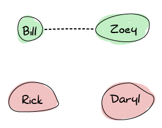

# Distribunomicon

## [Alone in the Dark]

Oh hi! Please have a seat. I was expecting you. When you first heard of Erlang, there were two or three attributes that likely attracted you. Erlang is a functional language, it has great semantics for concurrency, and it supports distribution. We've now seen the first two attributes, spent time exploring a dozen more you possibly didn't expect, and we're now at the last big thing, distribution.
嗨！请坐。我在等你呢。当你第一次听说Erlang时，有两三个特性可能会吸引你。Erlang是一种函数式语言，它有很好的并发语义，并且支持分布式。我们现在已经看到了前两个属性，花时间探索了十几个你可能没有预料到的属性，我们现在看到了最后一个重要的东西，分布。

We've waited quite a while before getting here because it's not exactly useful to get distributed if we can't make things work locally in the first place. We're finally up to the task and have come a long way to get where we are. Like almost every other feature of Erlang, the distributed layer of the language was first added in order to provide fault tolerance. Software running on a single machine is always at risk of having that single machine dying and taking your application offline. Software running on many machines allows easier hardware failure handling, if, and only if the application was built correctly. There is indeed no benefit regarding fault-tolerance if your application runs on many servers, but cannot deal with one of them being taken down.
在到达这里之前，我们已经等了很长时间，因为如果我们不能首先让事情在本地运行，那么分布式就没有什么用处。我们终于完成了这项任务，并且已经走了很长的路。与Erlang的几乎所有其他功能一样，该语言的分布式层最初是为了提供容错性而添加的。在一台机器上运行的软件总是面临着让这台机器死机并使应用程序离线的风险。如果且仅当应用程序正确构建时，在许多机器上运行的软件可以更轻松地处理硬件故障。如果您的应用程序在多台服务器上运行，但无法处理其中一台服务器被关闭的情况，那么在容错方面确实没有任何好处。


See, distributed programming is like being left alone in the dark, with monsters everywhere. It's scary, you don't know what to do or what's coming at you. Bad news: distributed Erlang is still leaving you alone in the dark to fight the scary monsters. It won't do any of that kind of hard work for you. Good news: instead of being alone with nothing but pocket change and a poor sense of aim to kill the monsters, Erlang gives you a flashlight, a machete, and a pretty kick-ass mustache to feel more confident (this also applies to female readers).
你看，分布式编程就像被单独留在黑暗中，到处都是怪物。这很可怕，你不知道该做什么，也不知道会发生什么。坏消息：分布式Erlang仍然让你独自在黑暗中与可怕的怪物战斗。它不会为你做任何那种艰苦的工作。好消息：Erlang给了你一个手电筒、一把弯刀和一把漂亮的大胡子，让你感觉更自信，而不是一个人一个人，除了零钱什么都没有，对杀死怪物的目标也没有什么感觉（这也适用于女性读者）。

That's not especially due to how Erlang is written, but more or less due to the nature of distributed software. Erlang will write the few basic building blocks of distribution: ways to have many nodes (virtual machines) communicating with each other, serializing and deserializing data in communications, extending the concepts of multiple processes to many nodes, ways to monitor network failures, and so on. It will, however, not provide solutions to software-specific problems such as \"what happens when stuff crashes.\"
这并不是因为Erlang的编写方式，而是因为分布式软件的本质。Erlang将编写分发的几个基本构建块：让多个节点（虚拟机）相互通信的方法，在通信中序列化和反序列化数据，将多进程的概念扩展到多个节点，监视网络故障的方法，等等。然而，它不会为特定于软件的问题提供解决方案，比如“东西崩溃时会发生什么”。\"

This is the standard 'tools, not solutions' approach seen before in OTP; you rarely get full-blown software and applications, but you get many components to build systems with. You'll have tools that tell you when parts of the system go up or down, tools to do a bunch of stuff over the network, but hardly any silver bullet that takes care of fixing things for you.
这是以前在OTP中看到的标准“工具，而不是解决方案”方法；你很少有成熟的软件和应用程序，但你有很多组件来构建系统。你会有一些工具，可以告诉你系统的某些部分何时启动或关闭，有一些工具可以在网络上做一些事情，但几乎没有什么灵丹妙药可以帮你解决问题。

Let's see what kind of flexing we can do with these tools.

## [This is my Boomstick]

To tackle all these monsters in the dark, we've been granted a very useful thing: pretty complete network transparency.
为了在黑暗中对付所有这些怪物，我们得到了一个非常有用的东西：相当完整的网络透明度。

An instance of an Erlang virtual machine that is up and running, ready to connect to other virtual machines is called a *node*. Whereas some languages or communities will consider a server to be a node, in Erlang, each VM is a node. You can thus have 50 nodes running on a single computer, or 50 nodes running on 50 computers. It doesn't really matter.
Erlang虚拟机的一个实例已启动并正在运行，可以连接到其他虚拟机，该实例称为*节点*。有些语言或社区将服务器视为节点，而在Erlang中，每个VM都是节点。因此，可以在一台计算机上运行50个节点，或者在50台计算机上运行50个节点。这并不重要。

When you start a node, you give it a name and it will connect to an application called *EPMD* ([Erlang Port Mapper Daemon](http://www.erlang.org/doc/man/epmd.html)), which will run on each of the computers which are part of your Erlang cluster. EPMD will act as a name server that lets nodes register themselves, contact other nodes, and warn you about name clashes if there are any.
当你启动一个节点时，你给它一个名字，它将连接到一个名为*EPMD*（[Erlang Port Mapper Daemon]的应用程序(http://www。二郎。org/doc/man/epmd。html），它将在属于Erlang群集的每台计算机上运行。EPMD将充当一个名称服务器，允许节点注册自己，联系其他节点，并在出现名称冲突时向您发出警告。

From this point on, a node can decide to set up a connection to another one. When it does so, both nodes automatically start monitoring each other, and they can know if the connection is dropped, or if a node disappears. More importantly, when a new node joins another node which is already part of a group of nodes connected together, the new node gets connected to the entire group.
从这一点开始，一个节点可以决定建立与另一个节点的连接。当它这样做时，两个节点都会自动开始相互监控，它们可以知道连接是否断开，或者节点是否消失。更重要的是，当一个新节点加入另一个节点时，该节点已经是连接在一起的一组节点的一部分，该新节点将连接到整个组。

Let's take the idea of a bunch of survivors during a zombie outbreak to illustrate how Erlang nodes set up their connections. We've got Zoey, Bill, Rick, and Daryl. Zoey and Bill know each other and communicate on the same frequency on walkie-talkies. Rick and Daryl are each on their own:
让我们以僵尸爆发期间的一群幸存者为例，来说明Erlang节点是如何建立连接的。我们有佐伊、比尔、里克和达里尔。佐伊和比尔彼此认识，用对讲机以相同的频率交流。里克和达里尔各自独立：



![四名幸存者：比尔、佐伊、里克和达里尔。所有幸存者都联系在一起：比尔与佐伊、里克和达里尔联系，佐伊与比尔、里克和达里尔联系，里克与比尔、佐伊和达里尔联系，达里尔与里克、佐伊和比尔联系。](。。/静态/img/mesh3。（巴布亚新几内亚）

That means that any survivor can contact any other directly. This is useful because in the event of the death of any survivor, nobody's left isolated. Erlang nodes are set up in this exact way: everyone connects to everyone.
这意味着任何幸存者都可以直接联系其他人。这是有用的，因为在任何幸存者死亡的情况下，没有人会被孤立。Erlang节点的设置方式一模一样：每个人都连接到每个人。

::: 
**Don't Drink Too Much Kool-Aid:**\
This way of doing things, while nice for some fault-tolerance reasons, has a pretty bad drawback in how much you can scale. It will be hard to have hundreds and hundreds of nodes part of your Erlang cluster simply because of how many connections and how much chatter is required. In fact, you will require one port per node you're connecting to.
这种方法虽然在某些容错方面很好，但在可扩展性方面有一个非常糟糕的缺点。很难让成百上千个节点成为Erlang集群的一部分，这仅仅是因为需要多少连接和多少聊天。实际上，每个连接到的节点都需要一个端口。

If you were planning on using Erlang to do that kind of heavy setup, please read on in this chapter where we see why things are that way, and what might be done to go around the problem, if possible at all.
如果您计划使用Erlang进行这种繁重的设置，请继续阅读本章，我们将了解为什么会出现这种情况，以及如果可能的话，可以采取哪些措施来解决这个问题。
:::

Once the nodes are connected together, they remain fully independent: they keep their own process registry, their own ETS tables (with their own names for tables), and the modules they load are independent from each other. A connected node that crashes won't bring down the nodes it's connected to.
一旦节点连接在一起，它们就保持完全独立：它们保留自己的进程注册表、自己的ETS表（表有自己的名称），并且它们加载的模块彼此独立。崩溃的已连接节点不会关闭其连接的节点。

Connected nodes can then start exchanging messages. The distribution model of Erlang was designed so that local processes can contact remote processes and send them regular messages. How is this possible if nothing is shared and all the process registries are unique? As we'll see later when we get into the specifics of distribution, there is a way to access registered processes on a particular node. From that point on, a first message can be sent.
然后，连接的节点可以开始交换消息。Erlang的分布模型设计为本地进程可以联系远程进程并向它们发送常规消息。如果没有共享，并且所有进程注册表都是唯一的，那么这怎么可能呢？我们将在稍后讨论分发的细节时看到，有一种方法可以访问特定节点上注册的进程。从那时起，可以发送第一条消息。

Erlang messages are going to be serialized and unserialized automatically for you in a transparent manner. All data structures, including pids, will work the same remotely and locally. This means that we can send pids over the network, and then communicate with them, sending messages, etc. Even better than that, links and monitors can be set up across the network if you can access the pids!
Erlang消息将以透明的方式自动序列化和取消序列化。所有数据结构，包括pids，都将在远程和本地工作。这意味着我们可以通过网络发送PID，然后与它们通信、发送消息等。更棒的是，如果你可以访问pids，可以在网络上设置链接和监视器！

So if Erlang's doing so much to make everything that transparent, why am I saying it's only giving us a machete, a flashlight, and a mustache?
所以，如果Erlang为了让一切都透明化做了这么多，为什么我要说它只给了我们一把弯刀、一个手电筒和一个小胡子？

## [Fallacies of Distributed Computing]

Much like a machete is meant to kill only a given type of monster, Erlang's tools are meant to handle only some kinds of distributed computing. To understand the tools Erlang gives us, it will be useful to first have an idea of what kind of landscape exists in the distributed world, and which assumptions Erlang makes in order to provide fault tolerance.
就像弯刀只能杀死某种特定类型的怪物一样，Erlang的工具只能处理某些类型的分布式计算。为了理解Erlang为我们提供的工具，首先了解一下分布式世界中存在着什么样的环境，以及Erlang为了提供容错性而做出的哪些假设是很有用的。

Some very smart guys took their time in the last few decades to categorize the kind of stuff that goes wrong with distributed computing. They came up with 8 major assumptions people make that ends up biting them in the ass later, some of which Erlang's designers made for various reasons.
在过去几十年里，一些非常聪明的人花时间对分布式计算中出现的问题进行了分类。他们提出了8个主要的假设，人们做出了这些假设，但最终还是咬了他们的屁股，其中一些是Erlang的设计师出于各种原因做出的。

### The Network is Reliable

The first fallacy of distributed computing is assuming that the application can be distributed over the network. That's kind of weird to say, but there will be plenty of times where the network will go down for annoying reasons: power failures, broken hardware, someone tripping a cord, vortex to other dimensions engulfing mission-critical components, headcrabs infestation, copper theft, etc.
分布式计算的第一个谬误是假设应用程序可以通过网络分布。这说起来有点奇怪，但很多时候网络会因为恼人的原因而崩溃：电源故障、硬件损坏、有人绊倒电线、漩涡到其他维度吞噬关键任务组件、头蟹出没、铜盗窃等。

One of the biggest errors you can make, therefore, is to think you can reach remote nodes and talk to them. This is somewhat possible to handle by adding more hardware and gaining redundancy so that if some hardware fails, the application can still be reached somewhere else. The other thing to do is to be ready to suffer a loss of messages and requests, to be ready for things becoming unresponsive. This is especially true when you depend on some kind of third party service that's no longer there, while your own software stack keeps working well.
因此，你可能犯的最大错误之一就是认为你可以到达远程节点并与它们对话。这在某种程度上是可以通过添加更多硬件和获得冗余来处理的，这样，如果某些硬件出现故障，应用程序仍然可以在其他地方访问。要做的另一件事是准备好遭受消息和请求的丢失，准备好应对失去响应的情况。当你依赖某种不再存在的第三方服务，而你自己的软件栈仍能正常工作时，这一点尤其正确。

Erlang doesn't have any special measures to deal with this, as it's usually something where decisions made will be application-specific. After all, who else but you can know how important a specific component will be? Still, you're not totally alone as a distributed Erlang node will be able to detect other nodes getting disconnected (or becoming unresponsive). There are specfic functions to monitor nodes, and links and monitors will also be triggered upon a disconnection.
Erlang没有任何特殊的措施来处理这个问题，因为通常情况下，决策都是针对特定应用程序的。毕竟，除了您之外，还有谁知道特定组件的重要性？尽管如此，分布式Erlang节点将能够检测到其他节点断开连接（或变得无响应），因此您并不完全是孤家寡人。监控节点有特定的功能，断开连接后也会触发链接和监控器。

Even with this, the best thing Erlang has for itself in this case is its asynchronous communication mode. By sending messages asynchronously and forcing developers to send a reply back when things work well, Erlang pushes for all message passing activities to intuitively handle failure. If the process you're talking to is on a node that disappears due to some network failure, we handle it as naturally as any local crash. This is one of the many reasons why Erlang is said to scale well (scaling in performance, but also in design).
即使这样，Erlang在这种情况下最好的东西就是它的异步通信模式。通过异步发送消息，并迫使开发人员在工作正常时发回回复，Erlang推动所有消息传递活动直观地处理失败。如果你正在谈论的进程位于一个因网络故障而消失的节点上，我们会像处理任何本地崩溃一样自然地处理它。这就是为什么Erlang可以很好地扩展的原因之一（在性能和设计上都可以扩展）。

::: 
**Don't Drink Too Much Kool-Aid:**\
Linking and monitoring across nodes can be dangerous. In the case of a network failure, all remote links and monitors are triggered at once. This might then generate thousands and thousands of signals and messages to various processes, which puts a heavy and unexpected load on the system.
跨节点链接和监视可能很危险。在网络故障的情况下，所有远程链路和监视器都会立即触发。这可能会产生成千上万的信号和消息到各个进程，这会给系统带来沉重而意外的负载。

Preparing for an unreliable network also means preparing for sudden failures and making sure your system doesn't get crippled by part of the system suddenly disappearing.
为一个不可靠的网络做准备还意味着为突然出现的故障做好准备，确保你的系统不会因为部分系统突然消失而瘫痪。
:::

### There is no Latency

One of the double-edged aspects of seemingly good distribution systems is that they often end up hiding the fact that the function calls you are making are remote. While you expect some function calls to be really fast, doing them over the network isn't the same at all. It's the difference between ordering a pizza from within the pizzeria and getting one delivered from another city to your house. While there will always be a basic wait time, in one case your pizza might be delivered cold because it just took too long.
看似良好的分发系统有一个双刃剑的方面，那就是它们往往最终隐藏了一个事实，即您正在进行的函数调用是远程的。虽然你期望一些函数调用非常快，但通过网络进行调用却完全不同。这是从比萨店订购比萨和从另一个城市送到你家之间的区别。虽然总是有一个基本的等待时间，但在一种情况下，你的披萨可能是冷送的，因为它太长了。

Forgetting that network communications make things slower even for really small messages can be a costly error if you always expect really fast results. Erlang's model treats us well there. Because of the way we set up our local applications with isolated processes, asynchronous messages, timeouts and always thinking of the possibility for processes to fail, there is very little adaptation required to go distributed: the timeouts, links, monitors and asynchronous patterns remain the same and still are as reliable. We always expected that kind of problem from the beginning and so Erlang implicitly doesn't assume there is no latency.
如果你总是期望非常快的结果，那么忘记网络通信会让事情变得更慢，即使是非常小的消息也可能是一个代价高昂的错误。Erlang的模型在那里对我们很好。由于我们使用隔离进程、异步消息、超时以及始终考虑进程失败的可能性来设置本地应用程序的方式，因此几乎不需要进行分布式调整：超时、链接、监视器和异步模式保持不变，仍然是可靠的。我们从一开始就预计会出现这种问题，因此Erlang隐式地不假设没有延迟。

You, however, might make that assumption in your design and expect replies faster than realistically possible. Just keep an eye open.
然而，您可能会在设计中做出这样的假设，并期望比实际情况更快地得到回复。睁大眼睛。

### Bandwidth is Infinite

Although network transfers are getting faster and faster all the time, and that generally speaking, each byte transferred over the network is cheaper as time goes, it is risky to assume that sending copious amounts of data is simple and easy.
虽然网络传输一直在变得越来越快，而且一般来说，随着时间的推移，通过网络传输的每个字节都会越来越便宜，但假设发送大量数据是简单和容易的，这是有风险的。

Generally speaking, because of how we build applications locally, we won't have too many problems with that in Erlang. Remember, one good trick is to send messages about what is happening rather than moving new state around ('Player X found item Y' rather than sending Player X's entire inventory over and over again).
一般来说，由于我们在本地构建应用程序的方式，在Erlang中不会有太多问题。记住，一个很好的技巧是发送关于正在发生的事情的消息，而不是移动新的状态（'Player X found item Y'而不是反复发送Player X的整个清单）。

If, for some reason, you need to be sending large messages, be extremely careful. The way Erlang distribution and communication works over many nodes is especially sensitive to large messages. If two nodes are connected together, all their communications will tend to happen over a single TCP connection. Because we generally want to maintain message ordering between two processes (even across the network), messages will be sent sequentially over the connection. That means that if you have one very large message, you might be blocking the channel for all the other messages.
如果出于某种原因，您需要发送大量消息，请格外小心。Erlang在许多节点上的分布和通信方式对大型消息特别敏感。如果两个节点连接在一起，它们的所有通信都将通过单个TCP连接进行。因为我们通常希望在两个进程之间（甚至在网络上）保持消息顺序，所以消息将通过连接顺序发送。这意味着，如果你有一条非常大的消息，你可能会阻塞所有其他消息的通道。

Worse than that, Erlang knows whether nodes are alive or not by sending a thing called *heartbeats*. Heartbeats are small messages sent at a regular interval between two nodes basically saying \"I'm still alive, keep on keepin' on!\". They're like our Zombie survivors routinely pinging each other with messages; \"Bill, are you there?\" And if Bill never replies, then you might assume he's dead (our out of batteries) and he won't get your future communications. Anyway, heartbeats are sent over the same channel as regular messages.
更糟糕的是，Erlang通过发送一个名为*heartbeats的东西来知道节点是否处于活动状态*。心跳是在两个节点之间以固定间隔发送的小消息，基本上是说“我还活着，继续开！”。他们就像我们的僵尸幸存者一样，经常用短信互相敲打\“比尔，你在吗？\”如果比尔从不回复，你可能会认为他已经死了（我们的电池没电了），他将无法获得你未来的通信。不管怎样，心跳和普通信息是通过同一渠道发送的。

The problem is that a large message can thus hold heartbeats back. Too many large messages keeping heartbeats at bay for too long and either of the nodes will eventually assume the other is unresponsive and disconnect from each other. That's bad. In any case, the good Erlang design lesson to keep this from happening is to keep your messages small. Everything will be better that way.
问题是，一条大消息可能会抑制心跳。太多的大消息会让心跳停止太长时间，这两个节点中的任何一个最终都会认为另一个没有响应，并且彼此断开连接。那太糟糕了。在任何情况下，防止这种情况发生的好Erlang设计课程都是将消息保持较小。那样一切都会好起来。

### The Network is Secure

When you get distributed, it's often very dangerous to believe that everything is safe, that you can trust messages you receive. It can be simple things like someone unexpected fabricating messages and sending them to you, someone intercepting packets and modifying them (or looking at sensitive data), or in the worst case, someone being able to take over your application or the system it runs on.
当你被分发时，相信一切都是安全的，相信你可以信任你收到的信息，这通常是非常危险的。它可以是一些简单的事情，比如有人意外地捏造消息并发送给你，有人截取数据包并修改它们（或查看敏感数据），或者在最坏的情况下，有人能够接管你的应用程序或它运行的系统。

In the case of distributed Erlang, this is sadly an assumption that was made. Here is what Erlang's security model looks like:
在分布式Erlang的例子中，这是一个令人遗憾的假设。以下是Erlang的安全模型：

::: 
\* this space intentionally left blank \*
:::

Yep. This is because Erlang distribution was initially meant for fault tolerance and redundancy of components. In the old days of the language, back when it was used for telephone switches and other telecommunication applications, Erlang would often be deployed on hardware running in the weirdest places --- very remote locations with weird conditions (engineers sometimes had to attach servers to the wall to avoid wet ground, or install custom heating systems in the woods in order for the hardware to run at optimal temperatures). In these cases, you had failover hardware part of the same physical location as the main one. This is often where distributed Erlang would run, and it explains why Erlang designers assumed a safe network to operate with.
是的。这是因为Erlang发行版最初旨在实现组件的容错和冗余。在语言的旧时代，当它被用于电话交换机和其他电信应用时，Erlang通常被部署在运行在最奇怪地方的硬件上，这些地方非常偏远，条件也很奇怪（工程师有时不得不将服务器安装在墙上，以避免潮湿的地面，或者在树林中安装定制的加热系统，以便硬件在最佳温度下运行）。在这些情况下，故障切换硬件与主硬件位于同一物理位置。这通常是分布式Erlang运行的地方，这也解释了为什么Erlang设计人员假设使用一个安全的网络来运行。

Sadly, this means that modern Erlang applications can rarely be clustered across different data centers. In fact, it isn't recommended to do so. Most of the time, you will want your system to be based on many smaller, walled off clusters of Erlang nodes, usually located in single locations. Anything more complex will need to be left to the developers: either switching to [SSL](http://www.erlang.org/doc/apps/ssl/ssl_distribution.html). Even in these cases, you have to be pretty careful, because someone gaining access to one of the distributed nodes then has access to all of them, and can run any command they can.
遗憾的是，这意味着现代Erlang应用程序很少能跨不同的数据中心进行集群。事实上，不建议这样做。大多数情况下，您会希望系统基于许多较小、隔离的Erlang节点集群，这些节点通常位于单个位置。任何更复杂的事情都需要留给开发人员：要么切换到[SSL](http://www。二郎。org/doc/apps/ssl/ssl_分发。（html）。即使在这些情况下，您也必须非常小心，因为获得对其中一个分布式节点的访问权限的人可以访问所有节点，并且可以运行任何可以运行的命令。

### Topology Doesn't Change

When first designing a distributed application made to run on many servers, it is possible that you will have a given number of servers in mind, and maybe a given list of host names. Maybe you will design things with specific IP addresses in mind. This can be a mistake. Hardware dies, operations people move servers around, new machines are added, some are removed. The topology of your network will constantly change. If your application works with any of these topological details hard-coded, then it won't easily handle these kinds of changes in the network.
当第一次设计一个分布式应用程序，使其在许多服务器上运行时，您可能会考虑到给定数量的服务器，可能还有给定的主机名列表。也许你会在设计时考虑到特定的IP地址。这可能是个错误。硬件死亡，操作人员移动服务器，新机器被添加，一些被移除。网络的拓扑结构将不断变化。如果您的应用程序使用这些硬编码的拓扑细节中的任何一种，那么它将无法轻松处理网络中的此类更改。

In the case of Erlang, there is no explicit assumption made in that way. However, it is very easy to let it creep inside your application. Erlang nodes all have a name and a host name, and they can constantly be changing. With Erlang processes, you not only have to think about how the process is named, but also about where it is now located in a cluster. If you hard code both the names and hosts, you might be in trouble at the next failure. Don't worry too much though, as we'll later see a few interesting libraries that let us forget about node names and topology in general, while still being able to locate specific processes.
在Erlang的例子中，没有以这种方式做出明确的假设。然而，让它在应用程序中爬行是非常容易的。Erlang节点都有一个名称和一个主机名，它们可以不断变化。对于Erlang进程，您不仅需要考虑进程如何命名，还需要考虑它现在在集群中的位置。如果同时对名称和主机进行硬编码，则下次失败时可能会遇到麻烦。不过，不要太担心，因为我们将在后面看到一些有趣的库，它们让我们忘记了节点名称和拓扑结构，同时仍然能够定位特定的进程。

### There is Only One Administrator

This is something a distribution layer of a language or library can't prepare you for, no matter what. The idea of this fallacy is that you do not always have only one main operator for your software and its servers, although it might be designed as if there were only one. If you decide to run many nodes on a single computer, then you might never have to care about this fallacy. However, if you get to run stuff across different locations, or a third party depends on your code, then you have to take care.
这是语言或库的分发层无法为您做好准备的事情，无论发生什么。这种谬误的想法是，您的软件及其服务器并不总是只有一个主操作员，尽管它可能被设计成只有一个主操作员。如果您决定在一台计算机上运行多个节点，那么您可能永远不必关心这个谬误。然而，如果你需要在不同的地方运行东西，或者第三方依赖于你的代码，那么你必须小心。

Things to pay attention to include giving others tooling to diagnose problems on your system. Erlang is somewhat easy to debug when you can manipulate a VM manually --- you can even reload code on the fly if you need to, after all. Someone who cannot access your terminal and sit in front of the node will need different facilities to operate though.
需要注意的事项包括为其他人提供诊断系统问题的工具。当您可以手动操作VM时，Erlang有点容易调试——毕竟，如果需要，您甚至可以动态地重新加载代码。但是，无法访问您的终端且坐在节点前面的人将需要不同的设施来操作。

Another aspect of this fallacy is that things like restarting servers, moving instances between data centers, or upgrading parts of your software stack isn't necessarily something only one person or a single team controls. In very large software projects, it is in fact very likely that many teams, or even many different software companies, take charge of different parts of a greater system.
这种谬误的另一个方面是，重启服务器、在数据中心之间移动实例或升级软件堆栈的某些部分并不一定是由一个人或一个团队控制的。在非常大的软件项目中，实际上很可能有许多团队，甚至许多不同的软件公司，负责一个更大系统的不同部分。

If you're writing protocols for your software stack, being able to handle many versions of that protocol might be necessary depending on how fast or slow your users and partners are to upgrade their code. The protocol might contain information about its versioning from the beginning, or be able to change halfway through a transaction, depending on your needs. I'm sure you can think of more examples of things that can go wrong.
如果你正在为你的软件栈编写协议，根据你的用户和合作伙伴升级他们的代码的速度或慢，能够处理该协议的多个版本可能是必要的。协议可能从一开始就包含有关其版本控制的信息，或者根据您的需要在事务进行一半时进行更改。我相信你能想出更多可能出错的例子。

### Transport Cost is Zero

This is a two-sided assumption. The first one relates to the cost of transporting data in terms of time, and the second one is related to the cost of transporting data in terms of money.
这是一个双面假设。第一个与传输数据的时间成本有关，第二个与传输数据的金钱成本有关。

The first case assumes that doing things like serializing data is nearly free, very fast, and doesn't play a big role. In reality, larger data structures take longer to be serialized than small ones, and then need to be unserialized on the other end of the wire. This will be true no matter what you carry across the network. Small messages will help reduce how noticeable the effect of this is.
第一种情况假设，像序列化数据这样的工作几乎是免费的，速度非常快，并且没有发挥很大作用。实际上，较大的数据结构比较小的数据结构需要更长的时间进行序列化，然后需要在另一端进行非序列化。无论你在网络上携带什么，这都是真实的。小消息将有助于减少这种影响的显著程度。

The second aspect of assuming transport cost is zero has to do with how much it costs to carry data around. In modern server stacks, memory (both in RAM and on disk) is often cheap compared to the cost of bandwidth, something you have to pay for continuously, unless you own the whole network where things run. Optimizing for fewer requests with smaller messages will be rewarding in this case.
假设传输成本为零的第二个方面与传输数据的成本有关。在现代服务器堆栈中，内存（RAM和磁盘中的内存）通常比带宽成本便宜，而带宽成本是你必须持续支付的，除非你拥有整个运行网络。在这种情况下，用较小的消息优化较少的请求将是有益的。

For Erlang, due to its initial use cases, no special care has been taken to do things like compress messages going cross-node (although the functions for it already exist). Instead, the original designers chose to let people implement their own communication layer if they required it. The responsibility is thus on the programmer to make sure small messages are sent and other measures are taken to minimize the costs of transporting data.
对于Erlang，由于其最初的使用情况，在跨节点压缩消息等方面没有特别注意（尽管它的功能已经存在）。相反，最初的设计师选择让人们在需要时实现自己的通信层。因此，程序员有责任确保发送小消息，并采取其他措施来最大限度地降低传输数据的成本。

### The Network is Homogeneous

This last assumption is about thinking that all components of a networked application will speak the same language, or will use the same formats to operate together.
最后一个假设是，网络应用程序的所有组件都将使用相同的语言，或者使用相同的格式一起运行。

For our zombie survivors, this can be a question of not assuming that all survivors will always speak English (or good English) when they lay their plans, or that a word will hold different meanings to different people.
对于我们的僵尸幸存者来说，这可能是一个不假设所有幸存者在制定计划时都会说英语（或流利英语）的问题，或者一个词对不同的人有不同的含义。


In terms of programming, this is usually about not relying on closed standards, but using open ones instead, or being ready to switch from one protocol to another one at any point in time. When it comes to Erlang, the distribution protocol is entirely public, but all Erlang nodes assume that people communicating with them speak the same language. Foreigners trying to integrate themselves to an Erlang cluster either have to learn to speak Erlang's protocol, or Erlang apps need some kind of translation layer for XML, JSON, or whatever.
在编程方面，这通常不是依赖于封闭的标准，而是使用开放的标准，或者随时准备从一个协议切换到另一个协议。说到Erlang，分发协议是完全公开的，但所有Erlang节点都假定与它们通信的人使用相同的语言。试图将自己集成到Erlang集群的外国人要么必须学习使用Erlang的协议，要么Erlang应用程序需要某种XML、JSON或其他的翻译层。

If it quacks like a duck and walks like a duck, then it must be a duck. That's why we have things like [C-nodes](http://www.erlang.org/doc/tutorial/cnode.html). C-nodes (or nodes in other languages than C) are built on the idea that any language and application can implement Erlang's protocol and then pretend it is an Erlang node in a cluster.
如果它像鸭子一样呱呱叫，像鸭子一样走路，那么它一定是鸭子。这就是为什么我们有[C节点](http://www。二郎。org/doc/tutorial/cnode。（html）。C节点（或C以外的其他语言中的节点）基于这样一种理念构建：任何语言和应用程序都可以实现Erlang的协议，然后假装它是集群中的Erlang节点。

Another solution for data exchange is to use something called BERT or [BERT-RPC](http://bert-rpc.org/).
数据交换的另一个解决方案是使用称为BERT或[BERT-RPC]的东西(http://bert-rpc。org/）。

In short, you always have to be careful for the following points:

-   You shouldn't assume the network is reliable. Erlang doesn't have any special measure for that except detecting that something went wrong for you (although that's not too bad as a feature)
-你不应该认为网络是可靠的。Erlang没有任何特别的措施来解决这个问题，除了检测出你出了什么问题（尽管这作为一个功能还不算太糟糕）
-   The network might be slow, from time to time. Erlang gives asynchronous mechanisms and knows about it, but you have to be careful so your application doesn't go against this and ruin it.
-网络可能会时不时地变慢。Erlang提供了异步机制，并且对其了如指掌，但您必须小心，以免应用程序违背这一点并破坏它。
-   Bandwidth isn't infinite. Small, descriptive messages help respect this.
-   The network isn't secure, and Erlang doesn't have anything to offer by default for this.
-   The topology of the network can change. No explicit assumption is made by Erlang, but you might make some about where things are and how they're named.
-网络的拓扑结构可能会发生变化。Erlang没有做出明确的假设，但您可能会对事物的位置和命名方式做出一些假设。
-   You (or your organization) only rarely fully control the structure of things. Parts of your system may be outdated, use different versions, be restarted or down when you don't expect it.
-你（或你的组织）很少完全控制事物的结构。系统的某些部分可能已经过时，使用了不同的版本，在您不希望的情况下重新启动或关闭。
-   Transporting data has a costs. Again, small, short messages help.
-   The network is heterogeneous. Not everything is the same, and data exchange should rely on well-documented formats.
-网络是异构的。并不是所有的东西都是一样的，数据交换应该依赖于记录良好的格式。

::: note
**Note:** The fallacies of distributed computing were introduced in [Fallacies of Distributed Computing Explained](http://www.rgoarchitects.com/Files/fallacies.pdf) by *Arnon Rotem-Gal-Oz*
**注：*分布式计算的谬误在[解释分布式计算的谬误]中介绍(http://www。rgoarchitects。com/文件/谬误。pdf）作者：阿农·罗特姆·加洛兹*
:::

## [Dead or Dead Alive]

Understanding the fallacies of distributed computing should have partially explained why we're fighting monsters in the dark, but with better tools. There are still a lot of issues and things left for us to do. Many of them are design decisions to be careful about (small messages, reducing communication, etc.) regarding the fallacies above. The most problematic issue has to do with nodes dying or the network being unreliable. This one is especially nasty because there is no good way to know whether something is dead or alive (without being able to contact it).
理解分布式计算的谬误应该可以部分解释为什么我们在黑暗中与怪物作战，但要使用更好的工具。我们还有很多问题和事情要做。其中许多都是需要小心的设计决策（小消息、减少沟通等）。)关于上述谬论。最有问题的问题与节点死亡或网络不可靠有关。这一次尤其令人讨厌，因为没有很好的方法可以知道某个东西是死的还是活的（不能够接触到它）。

Let's get back to Bill, Zoey, Rick and Daryl, our 4 Zombie apocalypse survivors. They all met at a safe house, spent a few days resting in there, eating whatever canned food they could find. After a while, they had to move out and split across town to find more resources. They've set a rendez-vous point in a small camp on the limits of the small town they're in.
让我们回到比尔、佐伊、里克和达里尔，我们的4位僵尸启示录幸存者。他们都在安全屋见面，在那里休息了几天，吃着能找到的任何罐头食品。过了一段时间，他们不得不搬出去，在镇上各处寻找更多的资源。他们在一个小镇的边界上的一个小营地里设置了一个rendez-vous点。

During the expedition they keep contact by talking with the walkie-talkies. They announce what they found, clear paths, maybe they find new survivors.
在探险期间，他们用对讲机保持联系。他们宣布他们发现了什么，清除路径，也许他们会找到新的幸存者。

Now suppose that at some point between the safe house and the rendez-vous point, Rick tries to contact his comrades. He manages to call Bill and Zoey, talk to them, but Daryl isn't reachable. Bill and Zoey can't contact him either. The problem is that there is absolutely no way to know if Daryl has been devoured by zombies, if his battery is dead, if he's asleep or if he's just underground.
现在假设在安全屋和rendez-vous点之间的某个点，Rick试图联系他的同志们。他设法打电话给比尔和佐伊，与他们交谈，但无法联系到达里尔。比尔和佐伊也无法联系他。问题是，根本没有办法知道达里尔是否被僵尸吞食，他的电池是否没电，他是否睡着了，或者他是否就在地下。

The group has to decide whether to keep waiting for him, keep calling for a while, or assume he's dead and move forward.
小组必须决定是继续等他，还是继续打电话，还是假设他已经死了，继续前进。

The same dilemma exists with nodes in a distributed system. When a node becomes unresponsive, is it gone because of a hardware failure? Did the application crash? Is there congestion on the network? Is the network down? In some cases, the application is not running anymore and you can simply ignore that node and continue what you're doing. In other cases, the application is still running on the isolated node; from that node's perspective, everything else is dead.
分布式系统中的节点也存在同样的困境。当一个节点变得无响应时，它是否因为硬件故障而消失？应用程序崩溃了吗？网络堵塞了吗？网络断了吗？在某些情况下，应用程序不再运行，您可以简单地忽略该节点并继续您正在做的事情。在其他情况下，应用程序仍在隔离节点上运行；从这个节点的角度来看，其他一切都是死的。

Erlang made the default decision of considering unreachable nodes as dead nodes, and reachable nodes as alive. This is a pessimistic approach that makes sense if you want to very quickly react to catastrophic failures; it assumes that the network is generally less likely to fail than the hardware or the software in the system, which makes sense considering how Erlang was used originally. An optimistic approach (which assumes nodes are still alive) could delay crash-related measures because it assumes that the network is more likely to fail than hardware or the software, and thus have the cluster wait longer for the reintegration of disconnected nodes.
Erlang的默认决定是将不可访问节点视为死节点，将可访问节点视为活动节点。如果你想对灾难性的失败做出快速反应，这是一种悲观的方法，是有意义的；它假设网络故障的可能性通常比系统中的硬件或软件小，考虑到Erlang最初的使用方式，这是有道理的。乐观方法（假设节点仍处于活动状态）可能会延迟与崩溃相关的措施，因为它假设网络比硬件或软件更容易发生故障，因此集群等待断开连接的节点重新整合的时间更长。

This raises a question. In a pessimistic system, what happens when the node we thought dead suddenly comes back again and it turns out it never died? We're caught by surprise by a living dead node, which had a life of its own, isolated from the cluster in every way: data, connections, etc. There are some very annoying things that can happen.
这就提出了一个问题。在一个悲观的系统中，当我们认为已经死亡的节点突然再次出现，结果却从未死亡时，会发生什么？我们惊讶地发现一个活的死节点，它有自己的生命，从各个方面与集群隔离：数据、连接等等。可能会发生一些非常恼人的事情。

Let's imagine for a moment that you have a system with 2 nodes in 2 different data centers. In that system, users have money in their account, with the full amount held on each node. Each transaction then synchronizes the data to all the other nodes. When all the nodes are fine, a user can keep spending money until his account is empty and then nothing can be sold anymore.
让我们想象一下，您的系统在两个不同的数据中心中有两个节点。在该系统中，用户的账户中有资金，每个节点上都持有全部资金。然后，每个事务将数据同步到所有其他节点。当所有节点都正常时，用户可以继续花钱，直到他的帐户为空，然后再也不能出售任何东西。

The software is chugging along fine, but at some point, one of the nodes gets disconnected from the other. There is no way to know if the other side is alive or dead. For all we care, both nodes could still be receiving requests from the public, but without being able to communicate with each other.
软件运行良好，但在某个时刻，其中一个节点与另一个节点断开连接。没有办法知道对方是活着还是死了。尽管我们关心的是，这两个节点仍然可以接收来自公众的请求，但无法相互通信。

There are two general strategies that can be taken: stop all transactions, or don't. The risk of picking the first one is that your product becomes unavailable and you're losing money. The risk of the second one is that a user with \$1000 in his account now has two servers that can accept \$1000 of transactions, for a total of \$2000! Whatever we do, we risk losing money if we don't do things right.
可以采取两种一般策略：停止所有交易，或者不进行交易。选择第一个的风险是，你的产品变得不可用，你正在赔钱。第二种情况的风险是，帐户中有\$1000的用户现在有两台服务器，可以接受\$1000的交易，总共\$2000！无论我们做什么，如果我们做得不对，我们都有赔钱的风险。

Isn't there a way by which we could avoid the issue entirely by keeping the application available during netsplits, without having to lose data in between servers?
有没有一种方法可以让应用程序在netsplits期间保持可用，而不必在服务器之间丢失数据，从而完全避免这个问题？


## [My Other Cap is a Theorem]

A quick answer to the previous question is *no*. There is sadly no way to keep an application alive and correct at the same time during a netsplit.
对上一个问题的快速回答是否定的*。遗憾的是，在netsplit期间，无法同时保持应用程序的活动性和正确性。

This idea is known as the *[CAP Theorem](http://www.julianbrowne.com/article/viewer/brewers-cap-theorem)* too). The CAP Theorem first states that there are three core attributes to all distributed systems that exist: *C*onsistency, *A*vailability, and *P*artition Tolerance.
这个想法被称为*[CAP定理](http://www。朱利安布朗。com/article/viewer/brewers cap定理）*too）。CAP定理首先指出，存在的所有分布式系统都有三个核心属性：*C*一致性、*A*可用性和*P*分区容差。

### Consistency

In the previous example, consistency would be having the ability to have the system, whether there are 2 or 1000 nodes that can answer queries, to see exactly the same amount of money in the account at a given time. This is something usually done by adding transactions (where all nodes must agree to making a change to a database as a single unit before doing so) or some other equivalent mechanism.
在前面的示例中，一致性将使系统（无论有2个或1000个节点可以回答查询）能够在给定时间查看账户中完全相同的金额。这通常是通过添加事务（所有节点在进行更改之前必须同意将数据库作为单个单元进行更改）或其他等效机制来实现的。

By definition, the idea of consistency is that all operations look as if they were completed as a single indivisible block even across many nodes. This is not in terms of time, but in terms of not having two different operations on the same piece of data modifying them in ways that gives multiple different values reported by system during these operations. It should be possible to modify a piece of data and not have to worry about other actors ruining your day by fiddling with it at the same time you do.
根据定义，一致性的概念是，所有操作看起来都像是作为一个不可分割的块完成的，即使跨多个节点。这不是时间的问题，而是不需要对同一数据段进行两次不同的操作，而是在这些操作期间，系统不会以提供多个不同值的方式对它们进行修改。修改一段数据应该是可能的，而不必担心其他参与者在你修改数据的同时摆弄它，从而破坏你的一天。

### Availability

The idea behind availability is that if you ask the system for some piece of data, you're able to get a response back. If you don't get an answer back, the system isn't available to you. Note that a response that says \"sorry I can't figure out results because I'm dead\" isn't really a response, but only a sad excuse for it. There is no more useful information in this response than in no response at all (although academics are somewhat divided on the issue).
可用性背后的理念是，如果你向系统索要某个数据，你就能得到回复。如果你没有得到回复，系统对你不可用。请注意，回答“抱歉，我无法找出结果，因为我死了”并不是一个真正的回答，而只是一个可悲的借口。这篇回复中没有比完全没有回复更有用的信息（尽管学术界在这个问题上存在一些分歧）。

::: note
**Note:** an important consideration in the CAP theorem is that availability is only a concern to nodes that are *not dead*. A dead node cannot send responses because it can't receive queries in the first place. This isn't the same as a node that can't send a reply because a thing it depends on is no longer there! If the node can't take requests, change data or return erroneous results, it isn't technically a threat to the balance of the system in terms of correctness. The rest of the cluster just has to handle more load until it comes back up and can be synchronized.
**注：**CAP定理中的一个重要考虑因素是，可用性只是*没有死的节点所关心的问题*。死节点无法发送响应，因为它首先无法接收查询。这与无法发送回复的节点不同，因为它所依赖的东西已经不存在了！如果节点不能接受请求、更改数据或返回错误结果，从技术上讲，它不会对系统的正确性构成威胁。集群的其余部分只需处理更多负载，直到它恢复并可以同步。
:::

### Partition Tolerance

This is the tricky part of the CAP theorem. Partition tolerance usually means that the system can keep on working (and contain useful information) even when parts of it can no longer communicate together. The whole point of partition tolerance is that the system can work with messages possibly being lost between components. The definition is a bit abstract and open-ended, and we'll see why.
这是CAP定理中棘手的部分。分区容差通常意味着系统可以继续工作（并包含有用的信息），即使它的某些部分不再能够相互通信。分区容差的全部意义在于，系统可以处理组件之间可能丢失的消息。这个定义有点抽象和开放，我们来看看原因。

The CAP Theorem basically specifies that in any distributed system, you can only have two of CAP: either CA, CP, or AP. There is no possible way to have all of them. This is both bad and good news. The bad news is that it's impossible to have everything always going well even with a failing network. The good news is that this is a theorem. If a customer asks you to provide all three of them, you will have the advantage of being able to tell them it is literally impossible to do, and won't have to lose too much time outside of explaining to them what the hell the CAP theorem is.
CAP定理基本上规定，在任何分布式系统中，您只能有两个CAP：CA、CP或AP。不可能所有的都有。这既是坏消息也是好消息。坏消息是，即使网络出现故障，也不可能事事顺利。好消息是这是一个定理。如果客户要求你提供这三个条件，你就可以告诉他们这实际上是不可能的，而且不必浪费太多时间向他们解释到底什么是CAP定理。

Of the three possibilities, one that we can usually dismiss is the idea of CA (Consistency + Availability). The reason for this is that the only time you would really want this is if you dare to say the network will never fail, or that if it does, it does as an atomic unit (if one thing fails, everything does at once).
在这三种可能性中，我们通常可以忽略的一种是CA（一致性+可用性）。这样做的原因是，如果你敢说网络永远不会失败，或者如果它失败了，它会作为一个原子单元失败（如果一件事失败了，一切都会立刻发生），你才会真正想要这样做。

Until someone invents a network and hardware that never fails, or has some way to make all parts of a system fail at once if one of them does, failure is going to be an option. Only two combinations of the CAP theorem remain: AP or CP. A system torn apart by a netsplit can either remain available or consistent, but not both.
除非有人发明了一种永远不会出现故障的网络和硬件，或者有某种方法可以让系统的所有部分同时出现故障，如果其中一个出现故障，那么故障将是一种选择。CAP定理只剩下两种组合：AP或CP。被netsplit撕裂的系统既可以保持可用性，也可以保持一致性，但不能同时保持可用性和一致性。

::: note
**Note:** some systems will choose to have neither 'A' or 'C'. In some cases of high performance, criteria such as throughput (how many queries you can answer at all) or latency (how fast can you answer queries) will bend things in a way such that the CAP theorem isn't about 2 attributes (CA, CP, or AP), but also about 2 and fewer attributes.
**注：*某些系统将选择既不使用“A”也不使用“C”。在某些高性能的情况下，吞吐量（你能回答多少个查询）或延迟（你能回答多快的查询）等标准会使事情变得复杂，以至于CAP定理不是关于两个属性（CA、CP或AP），而是关于两个或更少的属性。
:::

For our group of survivors, time passed and they fended off groups of undead for a good while. Bullets pierced brains, baseball bats shattered skulls and people bit were left behind. Bill, Zoey, Rick and Daryl's batteries eventually ran out and they were unable to communicate. As luck would have it, they all found two survivor colonies populated with computer scientists and engineers enamored with zombie survival. The colony survivors were used to the concepts of distributed programming and were used to communicating with light signals and mirrors with home-made protocols.
对于我们这群幸存者来说，时间一天天过去，他们在很长一段时间里击退了一群群不死族。子弹刺穿了大脑，棒球棒击碎了头骨，被咬的人被留在了后面。比尔、佐伊、里克和达里尔的电池最终耗尽，他们无法通信。幸运的是，他们都发现了两个幸存者聚居地，居住着热爱僵尸生存的计算机科学家和工程师。这些殖民地幸存者习惯了分布式编程的概念，并习惯于使用自制协议与光信号和镜子进行通信。

Bill and Zoey found the 'Chainsaw' colony while Rick and Daryl found the 'Crossbow' camp. Given that our survivors were the newest arrivals in their respective colonies, they were often delegated to go out in the wild, hunt for food and kill Zombies coming too close to the perimeters while the rest of people debated the merits of vim vs. emacs, the only war that couldn't die after a complete Zombie apocalypse.
比尔和佐伊找到了“电锯”营地，里克和达里尔找到了“十字弓”营地。考虑到我们的幸存者是各自殖民地的最新来者，他们经常被委派到野外去寻找食物，杀死离周边太近的僵尸，而其他人则在辩论vim vs。emacs，唯一一场在完全僵尸末日后无法死亡的战争。

On their hundredth day there, our four survivors were sent to meet halfway across the camps to trade goods for each colony.
在那里的第一百天，我们的四名幸存者被派到营地的中间，为每个殖民地交换货物。

Before leaving, a rendez-vous point was decided by the chainsaw and crossbow colonies. If at any point in time the destination or meeting time were to change, Rick and Daryl could message the Crossbow colony or Zoey and Bill could message the Chainsaw colony. Then each colony would communicate the information to the other colony, which would forward the changes to the other survivors:
在离开之前，电锯和弩群决定了一个伦兹-沃斯点。如果目的地或会面时间在任何时候发生变化，里克和达里尔可以通知十字弓殖民地，佐伊和比尔可以通知电锯殖民地。然后每个殖民地将信息传达给另一个殖民地，后者将更改转发给其他幸存者：


!【两个殖民地位于山顶，中间有一个山谷，被第三座山和一条河一分为二。】。里克和达里尔被困在中山以南，比尔和佐伊被困在中山以北。这张地图显示了从每个幸存者身上射出的光束到他们在山顶上的家基地，以及两个家基地与另一束光束的通信](。。/静态/img/zombie-map1。（巴布亚新几内亚）

So knowing this, all four survivors left early on a Sunday morning for a long trip on foot, due to meet on Friday morning before dawn. Everything went fine (except the occasional skirmishes with dead people who had been alive for quite a while now).
所以知道了这一点，所有四名幸存者在一个星期天早上很早就离开了，开始了一次徒步长途旅行，计划在周五黎明前会面。一切都很顺利（除了偶尔与已经活了很长一段时间的死者发生小冲突）。

Unfortunately, on Wednesday, heavy rain and increased zombie activity had Bill and Zoey separated, lost and delayed. The new situation looked a bit like this:
不幸的是，周三，大雨和僵尸活动的增加让比尔和佐伊分居、迷路和耽搁。新形势看起来有点像这样：


![与上一张地图相同，但比尔和佐伊在东西轴线上分开](。。/静态/img/zombie-map2。（巴布亚新几内亚）

To make matters worse, after the rain, the usually clear sky between the two colonies got foggy and it became impossible for the Chainsaw computer scientists to communicate with the Crossbow people.
更糟糕的是，雨后，两个殖民地之间通常晴朗的天空变得有雾，电锯计算机科学家无法与弓弩人交流。

Bill and Zoey communicated their problems to their colony and asked to set new meeting times. This would have been alright without the fog, but now we've got the equivalent of a netsplit.
比尔和佐伊向他们的殖民地传达了他们的问题，并要求设定新的会面时间。如果没有雾，这本来是可以的，但现在我们有了一个netsplit的等价物。

If both camps work under the Consistency + Partition Tolerance approach, they will just keep Zoey and Bill from setting a new meeting time. See, the CP approach is usually all about stopping modifications to the data so it remains consistent, and all survivors can still ask their respective camps for the date from time to time. They will just be denied the right to change it. Doing this will ensure that there is no way for some survivors to mess up the planned meeting time --- any other survivor cut off from any contact could still meet there in time no matter what, independently.
如果两个阵营都采用一致性+分区容忍的方法，那么他们就不会让佐伊和比尔设定新的会面时间。看，CP方法通常都是停止对数据的修改，以便保持一致，所有幸存者仍然可以不时询问各自营地的日期。他们将被剥夺改变它的权利。这样做将确保一些幸存者无法扰乱计划的会面时间——任何其他被切断任何联系的幸存者仍然可以在那里及时会面，无论发生什么情况，都是独立的。

If both camps instead picked Availability + Partition Tolerance, then survivors could have been allowed to change meeting dates. Each of the sides of the partitions would have their own version of the meeting data. So if Bill called for a new meeting for Friday night, the general state becomes:
如果两个阵营都选择了可用性+分区容差，那么幸存者就可以更改会议日期。分区的每一侧都有自己的会议数据版本。因此，如果比尔要求在周五晚上召开新的会议，一般情况下：

``` expand
Chainsaw: Friday night
Crossbow: Friday before dawn
```

As long as the split lasts, Bill and Zoey will get their information from Chainsaw only, and Rick and Daryl from Crossbow only. This lets part of the survivors reorganize themselves if needed.
只要分裂持续下去，比尔和佐伊只能从电锯上获取信息，里克和达里尔只能从十字弓上获取信息。这可以让部分幸存者在需要时重新组织自己。

The interesting problem here is how to handle the different versions of the data when the split is resolved (and the fog goes away). The CP approach to this is pretty straightforward: the data didn't change, there is nothing to do. The AP approach has more flexibility and problems to solve. Usually, different strategies are employed:
这里有趣的问题是，当分割被解决（雾消失）时，如何处理不同版本的数据。CP的方法非常简单：数据没有改变，没有什么可做的。AP方法有更多的灵活性和需要解决的问题。通常会采用不同的策略：

-   *Last Write Wins* is a conflict resolution method where whatever the last update was is the one to be kept. This one can be tricky because in distributed settings, timestamps can be off or things can happen at exactly the same time.
-*Last Write Wins*是一种冲突解决方法，无论上次更新是什么，都要保留。这可能很棘手，因为在分布式设置中，时间戳可能会关闭，或者事情可能会在完全相同的时间发生。
-   A winner can be picked randomly.
-   More sophisticated methods to help reduce conflicts include time-based methods such as last write wins, but with relative clocks. Relative clocks do not work with absolute time values, but with incrementing values every time someone modifies a file. If you want to know more about this, read up on [Lamport clocks](https://secure.wikimedia.org/wikipedia/en/wiki/Lamport_timestamps).
-有助于减少冲突的更复杂的方法包括基于时间的方法，例如最后一次写入的胜利，但有相对的时钟。相对时钟不适用于绝对时间值，但适用于每次有人修改文件时递增的值。如果你想了解更多，请阅读[兰波特时钟](https://secure。维基媒体。org/wikipedia/en/wiki/Lamport_时间戳）。
-   The onus of picking what to do with the conflict can be pushed back to the application (or in our case, to the survivors). The receiving end will just have to choose which of the conflicting entries is the right one. This is a bit what happens when you have merge conflicts with source control with SVN, Mercurial, Git, etc.
-选择如何处理冲突的责任可以推回给应用程序（或者在我们的例子中，推回给幸存者）。接收端只需选择哪个冲突条目是正确的。这是当您与SVN、Mercurial、Git等的源代码管理发生合并冲突时会发生的情况。

Which one's better? The way I've described things kind of led us to believe that we have the choice to be either fully AP or fully CP, like an on/off switch. In the real world, we can have various things like quorum systems where we turn this 'yes/no' question into a dial we can turn to choose how much consistency we want.
哪一个更好？我描述事情的方式让我们相信，我们可以选择完全AP或完全CP，比如开/关开关。在现实世界中，我们可以有各种各样的东西，比如定额系统，我们可以把这个“是/否”的问题变成一个拨号盘，我们可以选择我们想要多少一致性。

A quorum system works by a few very simple rules. You have `N` of them to agree to modify the data to make it possible. A system with a relatively low consistency requirement could ask for only 15% of the nodes to be available to make a change. This means that in cases of splits, even small fragments of the network keep being able to modify the data. A higher consistency rating, set to maybe 75% of the nodes would mean that a larger part of the system needs to be present in order to make changes. In this situation, if a few of the nodes are isolated, they won't have the right to change the data. However, the major part of the system that's still interconnected can work fine.
法定人数制度的运作有几个非常简单的规则。他们中有'N'人同意修改数据，使之成为可能。一致性要求相对较低的系统可能只要求15%的节点可用以进行更改。这意味着，在拆分的情况下，即使是网络的小片段也可以继续修改数据。更高的一致性评级（设置为75%的节点）意味着系统需要更大的一部分才能进行更改。在这种情况下，如果几个节点被隔离，它们将无权更改数据。然而，系统中仍然相互连接的主要部分可以正常工作。

By changing making the `M` the value 1, you have a fully AP system, with no consistency guarantees.

Moreover, you could play with these values on a per-query basis: queries having to do with things of little importance (someone just logged on!) can have lower consistency requirements, while things having to do with inventory and money could require more consistency. Mix this in with different conflict resolution methods for each case and you can get surprisingly flexible systems.
此外，您可以在每个查询的基础上使用这些值：查询必须处理无关紧要的事情（有人刚刚登录！）可以有较低的一致性要求，而与库存和资金有关的事情可能需要更高的一致性。将这一点与每种情况下的不同冲突解决方法相结合，你可以得到令人惊讶的灵活系统。

Combined with all the different conflict resolution solutions available, a lot of options become available to distributed systems, but their implementation remains very complex. We won't use them in detail, but I think it's important to know what's available out there just to be aware of the different options available.
尽管所有的解决方案都很复杂，但它们的许多分布式解决方案仍然可用。我们不会详细地使用它们，但我认为了解外面有什么是很重要的，只是为了了解可用的不同选项。

For now, we can stick to the basics of distributed computing with Erlang.

## [Setting up an Erlang Cluster]

Except for the whole part about handling the fallacies of distributed computing, the hardest part about distributed Erlang is managing to set things up right in the first place. Connecting nodes together across different hosts is a special kind of pain. To avoid this, we'll usually try things out using many nodes on a single computer, which tends to make things easier.
除了关于处理分布式计算谬误的整个部分外，分布式Erlang最难的部分是从一开始就设法将事情设置正确。跨不同主机将节点连接在一起是一种特殊的痛苦。为了避免这种情况，我们通常会在一台计算机上使用多个节点进行尝试，这会使事情变得更容易。

As mentioned earlier, Erlang gives names to each of the nodes to be able to locate and contact them. The names are of the form `Name@Host`, where the host is based on available DNS entries, either over the network or in your computer's host files (`/etc/hosts` on OSX, Linux and other Unix-likes, `C:\Windows\system32\drivers\etc\hosts` for most Windows installs). All names need to be unique to avoid conflicts --- if you try to start a node with the same name as another one on the same exact hostname, you'll get a pretty terrible crash message.
如前所述，Erlang为每个节点提供名称，以便能够定位和联系它们。这些名字都是表格的名字`Name@Host`，其中主机基于网络上或计算机主机文件中的可用DNS条目（在OSX、Linux和其他类似Unix的系统上为`etc/hosts`，在大多数Windows安装中为`C:\Windows\system32\drivers\etc\hosts`）。所有的名称都必须是唯一的，以避免冲突——如果你试图在同一个主机名上用与另一个相同的名称启动一个节点，你会收到一条非常可怕的崩溃消息。

Before starting these shells to provoke a crash, we have to know a bit about the names. There are two types of names: short names and long names. Long names are based on fully qualified domain names (`aaa.bbb.ccc`), and many DNS resolvers consider a domain name to be fully qualified if they have a period (`.`) inside of it. Short names will be based on host names without a period, and are resolved going through your host file or through any possible DNS entry. Because of this, it is generally easier to set up a bunch of Erlang nodes together on a single computer using short names than long names. One last thing: because names need to be unique, nodes with short names cannot communicate with nodes that have long names, and the opposite is also true.
在发射这些炮弹引发坠机之前，我们必须先了解一下它们的名字。有两种类型的名称：短名称和长名称。长名称基于完全限定的域名（`aaa）。bbb。ccc`），许多DNS解析程序认为域名是完全限定的，如果它们有一个句点(`。`)里面。短名称将基于没有句点的主机名，并通过您的主机文件或任何可能的DNS条目解析。因此，在一台计算机上使用短名称比使用长名称更容易设置一组Erlang节点。最后一件事：因为名称必须是唯一的，所以短名称的节点不能与长名称的节点通信，反之亦然。

To pick between long and short names, you can start the Erlang VM with two different options: `erl -sname short_name@domain` or `erl -name long_name@some.domain`. Note that you can also start nodes with only the names: `erl -sname short_name` or `erl -name long_name`. Erlang will automatically attribute a host name based on your operating system's configuration. Lastly, you also have the option of starting a node with a name such as `erl -name name@127.0.0.1` to give a direct IP.
要在长名称和短名称之间进行选择，可以使用两个不同的选项启动Erlang VM：`erl-sname short_name@domain`或者叫“呃，名字长”_name@some。领域`。请注意，您也可以仅使用以下名称启动节点：`erl-sname short_name`或`erl-name long_name'`。Erlang将根据操作系统的配置自动为主机名添加属性。最后，您还可以选择使用“erl-name”等名称启动节点name@127。0。0。1 `提供直接IP。

::: note
**Note:** Windows users should still use `werl` instead of `erl`. However, in order to start distributed nodes and giving them a name, the node should be started from the command line instead of clicking some shortcut or executable.
**注意：*Windows用户仍应使用“werl”而不是“erl”`。但是，为了启动分布式节点并为其命名，应该从命令行启动节点，而不是单击某个快捷方式或可执行文件。
:::

Let's start two nodes:

```eshell
erl -sname ketchup
...
(ketchup@ferdmbp)1>
```

```eshell
erl -sname fries
...
(fries@ferdmbp)1> 
```

To connect fries with ketchup (and make a delicious cluster) go to the first shell and enter the following function:
要将薯条和番茄酱连接起来（并制作一个美味的组合），请转到第一个shell并输入以下功能：

```eshell
(ketchup@ferdmbp)1> net_kernel:connect_node(fries@ferdmbp).
true
```

The `net_kernel:connect_node(NodeName)` function sets up a connection with another Erlang node (some tutorials use `net_adm:ping(Node)`, but I think `net_kernel:connect_node/1` sounds more serious and lends me credence!) If you see `true` as the result from the function call, congratulations, you're in distributed Erlang mode now. If you see `false`, then you're in for a world of hurt trying to get your network to play nice. For a very quick fix, edit your host files to accept whatever host you want. Try again and see if it works.
'net_kernel:connect_node（NodeName）`函数设置与另一个Erlang节点的连接（一些教程使用'net_adm:ping（node）`，但我认为'net_kernel:connect_node/1'听起来更严肃，让我相信！）如果函数调用的结果是'true'，恭喜，您现在处于分布式Erlang模式。如果你看到“false”，那么你正处于一个受伤的世界，试图让你的网络发挥良好的作用。为了快速修复，请编辑主机文件以接受所需的任何主机。再试一次，看看是否有效。

You can see your own node name by calling the BIF `node()` and see who you're connecting to by calling the BIF `nodes()`:
您可以通过调用BIF“node（）”来查看自己的节点名称，并通过调用BIF“nodes（）”来查看您正在连接的用户：

```eshell
(ketchup@ferdmbp)2> node().
ketchup@ferdmbp
(ketchup@ferdmbp)3> nodes().
[fries@ferdmbp]
```

To get the nodes communicating together, we'll try with a very simple trick. Register each shell's process as `shell` locally:
为了让节点通信在一起，我们将尝试一个非常简单的技巧。在本地将每个shell的进程注册为“shell”：

```eshell
(ketchup@ferdmbp)4> register(shell, self()).
true
```

```eshell
(fries@ferdmbp)1> register(shell, self()).
true
```

Then, you'll be able to call the process by name. The way to do it is to send a message to ``. Let's try this on both shells:
然后，您将能够按名称调用该进程。这样做的方法是向``。让我们在两个外壳上都尝试一下：

```eshell
(ketchup@ferdmbp)5> .

```

```eshell
(fries@ferdmbp)2> receive  -> OtherShell ! <<"hey there!">> end.
<<"hey there!">>
```

So the message is apparently received, and we send something to the other shell, which receives it:

```eshell
(ketchup@ferdmbp)6> flush().
Shell got <<"hey there!">>
ok
```

As you can see, we transparently send tuples, atoms, pids, and binaries without a problem. Any other Erlang data structure is fine too. And that's it. You know how to work with distributed Erlang! There is yet another BIF that might be useful: `erlang:monitor_node(NodeName, Bool)`. This function will let the process that calls it with `true` as a value for `Bool`` if the node dies.
如你所见，我们透明地发送元组、原子、PID和二进制文件，没有任何问题。任何其他Erlang数据结构也可以。就这样。你知道如何使用分布式Erlang！还有另一个BIF可能有用：`erlang:monitor_node（NodeName，Bool）`。如果节点死亡，这个函数将允许调用它的进程使用'true'作为'Bool'的值。

Unless you're writing a special library that relies on checking the life of other nodes, you will rarely need to use `erlang:monitor_node/2`. The reason for this is that functions like `link/1` and `monitor/2` still work across nodes.
除非您正在编写一个依赖于检查其他节点寿命的特殊库，否则很少需要使用`erlang:monitor_node/2`。原因是像“link/1”和“monitor/2”这样的功能仍然可以跨节点工作。

If you set up the following from the `fries` node:

```eshell
(fries@ferdmbp)3> process_flag(trap_exit, true).
false
(fries@ferdmbp)4> link(OtherShell).
true
(fries@ferdmbp)5> erlang:monitor(process, OtherShell).
#Ref<0.0.0.132>
```

And then kill the `ketchup` node, the `fries`' shell process should receive an `'EXIT'` and monitor message:
然后杀死'ketchup'节点，'fries''shell进程应该会收到一个'EXIT'并监视消息：

```eshell
(fries@ferdmbp)6> flush().
Shell got 
Shell got 
ok
```

And that's the kind of stuff you'll see. But hey, wait a minute there. Why the hell does the pid look like that? Am I seeing things right?
这就是你会看到的东西。但是嘿，等一下。为什么pid看起来像那样？我看得对吗？

```eshell
(fries@ferdmbp)7> OtherShell.
<6349.52.0>
```

What? Shouldn't this be `<0.52.0>`? Nope. See, that way of displaying a pid is just some kind of visual representation of what a process identifier is really like. The first number represents the node (where `0` means the process is coming from the current node), the second one is a counter, and the third one is a second counter for when you have so many processes created that the first counter is not enough. The true underlying representation of a pid is more like this:
什么这不应该是`<0吗。52。0>`? 不。看，显示pid的方式只是某种过程标识符的视觉表示。第一个数字代表节点（其中“0”表示进程来自当前节点），第二个数字是计数器，第三个数字是第二个计数器，用于创建太多进程，以至于第一个计数器不够时。pid的真正底层表示形式更像这样：

```eshell
(fries@ferdmbp)8> term_to_binary(OtherShell).
<<131,103,100,0,15,107,101,116,99,104,117,112,64,102,101,
  114,100,109,98,112,0,0,0,52,0,0,0,0,3>>
```

The binary sequence `<<107,101,116,99,104,117,112,64,102,101,114,100,109,98,112>>` is in fact a latin-1 (or ASCII) representation of `<<"ketchup@ferdmbp">>`, the name of the node where the process is located. Then we have the two counters, `<<0,0,0,52>>` and `<<0,0,0,0>>`. The last value (3) is some token value to differentiate whether the pid comes from an old node, a dead one, etc. That's why pids can be used transparently anywhere.
二进制序列“<107101116,99104117112,64102101114100109,98112>”实际上是“<ketchup@ferdmbp“>>”，进程所在节点的名称。然后我们有两个计数器，“<0,0,0,52>”和“<0,0,0>>`。最后一个值（3）是一些令牌值，用于区分pid是否来自旧节点、死节点等。这就是为什么pids可以在任何地方透明地使用。

::: note
**Note:** Instead of killing a node to disconnect it, you may also want to try the BIF `erlang:disconnect_node(Node)` to get rid of the node without shutting it down.
**注意：**您可能还想尝试BIF`erlang:disconnect_node（node）`在不关闭节点的情况下删除节点，而不是通过杀死节点来断开连接。
:::

::: note
**Note:** if you're unsure which node a Pid is coming from, you don't need to convert it to a binary to read the node name. Just call `node(Pid)` and the node where it's running on will be returned as a string.
**注意：*如果不确定Pid来自哪个节点，则无需将其转换为二进制文件来读取节点名称。只需调用'node（Pid）'，它运行的节点就会作为字符串返回。
:::

Other interesting BIFs to use are `spawn/2`, `spawn/4`, `spawn_link/2` and `spawn_link/4`. They work exactly like the other `spawn` BIFs except that these let you spawn functions on remote nodes. Try this from the ketchup node:
其他有趣的BIF还有'spawn/2'、'spawn/4'、'spawn_link/2'和'spawn_link/4'`。它们的工作原理与其他“spawn”BIF完全相同，只是它们允许您在远程节点上生成函数。从番茄酱节点试试这个：

```eshell
(ketchup@ferdmbp)6> spawn(fries@ferdmbp, fun() -> io:format("I'm on ~p~n", [node()]) end).
I'm on fries@ferdmbp
<6448.50.0>
```

This is essentially a remote procedure call: we can choose to run arbitrary code on other nodes, without giving ourselves more trouble than that! Interestingly, the function is running on the other node, but we receive the output locally. That's right, even output can be transparently redirected across the network. The reason for this is based on the idea of group leaders. Group leaders are inherited the same way whether they're local or not.
这本质上是一个远程过程调用：我们可以选择在其他节点上运行任意代码，而不会给自己带来更多麻烦！有趣的是，该函数正在另一个节点上运行，但我们在本地接收输出。没错，即使是输出也可以通过网络透明地重定向。这是基于团队领导者的理念。无论是本地人还是非本地人，团队领导者的继承方式都是一样的。

Those are all the tools you need in Erlang to be able to write distributed code. You have just received your machete, flashlight and mustache. You're at a level that would take a very long while to achieve with other languages without such a distribution layer. Now is the time to kill monsters. Or maybe first, we have to learn about the cookie monster.
这些就是在Erlang中编写分布式代码所需的所有工具。你刚刚收到了弯刀、手电筒和胡子。如果没有这样一个分发层，使用其他语言需要很长时间才能达到这个水平。现在是杀死怪物的时候了。或者首先，我们必须了解饼干怪兽。

## [Cookies]


If you recall the beginning of the chapter, I had mentioned the idea that all Erlang nodes are set up as meshes. If someone connects to a node, it gets connected to all the other nodes. There are times where what you want to do is run different Erlang node clusters on the same piece of hardware. In these cases, you do not want to be accidentally connecting two Erlang node clusters together.
如果你还记得本章的开头，我曾经提到过所有Erlang节点都被设置为网格的想法。如果有人连接到一个节点，它就会连接到所有其他节点。有时，您需要在同一块硬件上运行不同的Erlang节点集群。在这些情况下，您不希望意外地将两个Erlang节点集群连接在一起。

Because of this, the designers of Erlang added a little token value called a *cookie*. While documents like the official Erlang documentation put cookies under the topic of security, they're really not security at all. If it is, it has to be seen as a joke, because there's no way anybody serious considers the cookie a safe thing. Why? Simply because the cookie is a little unique value that must be shared between nodes to allow them to connect together. They're closer to the idea of user names than passwords and I'm pretty sure nobody would consider having a username (and nothing else) as a security feature. Cookies make way more sense as a mechanism used to divide clusters of nodes than as an authentication mechanism.
因此，Erlang的设计者添加了一个名为*cookie的小标记值*。虽然像官方Erlang文档这样的文档将Cookie置于安全主题之下，但它们实际上根本就不安全。如果是的话，那就必须被视为一个笑话，因为任何严肃的人都不可能认为饼干是安全的。为什么？这仅仅是因为cookie是一个独特的值，必须在节点之间共享，以允许它们连接在一起。它们更接近于用户名而不是密码的概念，我很确定没有人会考虑将用户名（而不是其他）作为安全功能。Cookie作为一种用于划分节点集群的机制比作为身份验证机制更有意义。

To give a cookie to a node, just start it by adding a `-setcookie Cookie` argument to the command line. Let's try again with two new nodes:
要为节点提供cookie，只需在命令行中添加一个“-setcookie cookie”参数即可。让我们使用两个新节点重试：

```eshell
$ erl -sname salad -setcookie 'myvoiceismypassword'
...
(salad@ferdmbp)1>
```

```eshell
$ erl -sname mustard -setcookie 'opensesame'
...
(mustard@ferdmbp)1>
```

Now both nodes have different cookies and they shouldn't be able to communicate together:

```eshell
(salad@ferdmbp)1> net_kernel:connect_node(mustard@ferdmbp).
false
```

This one has been denied. Not many explanations. However, if we look at the mustard node:

```eshell
=ERROR REPORT==== 10-Dec-2011::13:39:27 ===
** Connection attempt from disallowed node salad@ferdmbp **
```

Good. Now what if we did really want salad and mustard to be together? There's a BIF called `erlang:set_cookie/2` to do what we need. If you call `erlang:set_cookie(OtherNode, Cookie)`, you will use that cookie only when connecting to that other node. If you instead use `erlang:set_cookie(node(), Cookie)`, you'll be changing the node's current cookie for all future connections. To see the changes, use `erlang:get_cookie()`:
好的。如果我们真的想把沙拉和芥末放在一起呢？有一个叫做“erlang:set_cookie/2”的BIF来做我们需要的事情。如果调用“erlang:set_cookie（OtherNode，cookie）”，则只有在连接到另一个节点时才会使用该cookie。如果改为使用“erlang:set_cookie（node（），cookie）”，则将更改节点的当前cookie以用于将来的所有连接。要查看更改，请使用“erlang:get_cookie（）”：

```eshell
(salad@ferdmbp)2> erlang:get_cookie().
myvoiceismypassword
(salad@ferdmbp)3> erlang:set_cookie(mustard@ferdmbp, opensesame).
true
(salad@ferdmbp)4> erlang:get_cookie().
myvoiceismypassword
(salad@ferdmbp)5> net_kernel:connect_node(mustard@ferdmbp).
true
(salad@ferdmbp)6> erlang:set_cookie(node(), now_it_changes).
true
(salad@ferdmbp)7> erlang:get_cookie().
now_it_changes
```

Fantastic. There is one last cookie mechanism to see. If you tried the earlier examples of this chapter, go look into your home directory. There should be a file named `.erlang.cookie` in there. If you read it, you'll have a random string that looks a bit like `PMIYERCHJZNZGSRJPVRK`. Whenever you start a distributed node without a specific command to give it a cookie, Erlang will create one and put it in that file. Then, every time you start a node again without specifying its cookie, the VM will look into your home directory and use whatever is in that file.
好极了。还有最后一个cookie机制要看。如果您尝试了本章前面的例子，请查看您的主目录。应该有一个名为`。二郎。饼干在里面。如果你阅读它，你会得到一个看起来有点像'pmiyerchjznsrzgjpvrk'的随机字符串`。每当启动分布式节点时，如果没有特定命令为其提供cookie，Erlang就会创建一个cookie并将其放入该文件中。然后，每次你在没有指定cookie的情况下再次启动一个节点时，VM都会查看你的主目录并使用该文件中的任何内容。

## [Remote Shells]

One of the first things we've learned in Erlang was how to interrupt running code using `^G` (`CTRL + G`). In there, we had seen a menu for distributed shells:
我们在Erlang中学到的第一件事是如何使用“^G”（`CTRL+G'）中断正在运行的代码。在那里，我们看到了分布式shell的菜单：

```eshell
(salad@ferdmbp)1> 
User switch command
 --> h
  c [nn]            - connect to job
  i [nn]            - interrupt job
  k [nn]            - kill job
  j                 - list all jobs
  s [shell]         - start local shell
  r [node [shell]]  - start remote shell
  q        - quit erlang
  ? | h             - this message
```

The `r [node [shell]]` option is the one we're looking for. We can start a job on the mustard node by doing as follows:
我们正在寻找的是'r[node[shell]`选项。我们可以在芥末节点上启动作业，方法如下：

```eshell
 --> r mustard@ferdmbp
 --> j
   1  
   2* 
 --> c
Eshell V5.8.4  (abort with ^G)
(mustard@ferdmbp)1> node().
mustard@ferdmbp
```

And there you have it. You can now use the remote shell the same way you would with a local one. There are a few differences with older versions of Erlang, where things like auto-completion no longer work. This way of doing things is still very useful whenever you need to change things on a node running with the `-noshell` option. If the `-noshell` node has a name, then you can connect to it to do admin-related things like reloading modules, debugging some code, and so on.
就在这里。现在，您可以像使用本地shell一样使用远程shell。与旧版本的Erlang有一些不同，在旧版本中，自动完成之类的功能不再起作用。当您需要在使用“-noshell”选项运行的节点上更改内容时，这种方法仍然非常有用。如果`-noshell`节点有一个名称，那么您可以连接到它来执行与管理相关的操作，比如重新加载模块、调试一些代码等等。

By using `^G` again, you can go back to your original node. Be careful when you stop your session though. If you call `q()` or `init:stop()`, you'll be terminating the remote node!
再次使用“^G”可以返回到原始节点。但是，当你停止训练时要小心。如果调用'q（）'或'init:stop（）`，将终止远程节点！


## [Hidden Nodes]

Erlang nodes can be connected by calling `net_kernel:connect_node/1`, but you have to be aware that pretty much any interaction between nodes will get them to set up a connection. Calling `spawn/2` or sending a message to a foreign Pid are going to automatically set up connections.
Erlang节点可以通过调用'net_kernel:connect_node/1'来连接，但您必须知道，节点之间的任何交互都会让它们建立连接。调用'spawn/2'或向外国Pid发送消息将自动建立连接。

This might be rather annoying if you have a decent cluster and you want to connect to a single node to change a few things there. You wouldn't want your admin node to suddenly be integrated into the cluster, and having other nodes believing that they've got a new coworker to send tasks to. To do this, you could use the rarely-used `erlang:send(Dest, Message, [noconnect])` function, which sends a message without creating a connection, but this is rather error prone.
如果你有一个像样的集群，你想连接到一个节点来改变那里的一些事情，这可能会很烦人。你不会希望你的管理节点突然被集成到集群中，而让其他节点相信他们有了一个新的同事要向其发送任务。要做到这一点，可以使用很少使用的“erlang:send（Dest，Message，[noconnect]）”函数，它在不创建连接的情况下发送消息，但这很容易出错。

Instead, what you want to do is set up a node with the `-hidden` flag. Let's say you're still running the mustard and salad nodes. We'll start a third node, `olives` that will connect only to `mustard` (make sure the cookies are the same!):
相反，您要做的是设置一个带有“-hidden”标志的节点。假设你还在做芥末和沙拉。我们将启动第三个节点“olives”，它将只连接到“芥末”（确保cookies是相同的！）：

```eshell
$ erl -sname olives -hidden
...
(olives@ferdmbp)1> net_kernel:connect_node(mustard@ferdmbp).
true
(olives@ferdmbp)2> nodes().
[]
(olives@ferdmbp)3> nodes(hidden).
[mustard@ferdmbp]
```

Ah ha! The node didn't connect to salad, and at first sight, it didn't connect with mustard either. However, calling `node(hidden)` shows that we do have a connection there! Let's see what the mustard node sees:
啊哈！节点没有连接到沙拉，乍一看，它也没有连接到芥末。然而，调用'node（hidden）'表明我们确实在那里有联系！让我们看看芥末节点看到了什么：

```eshell
(mustard@ferdmbp)1> nodes().
[salad@ferdmbp]
(mustard@ferdmbp)2> nodes(hidden).
[olives@ferdmbp]
(mustard@ferdmbp)3> nodes(connected).
[salad@ferdmbp,olives@ferdmbp]
```

Similar view, but now we add the `nodes(connected)` BIF that shows all connections, regardless of their type. The salad node will never see any connection to olives, unless especially told to connect there. One last interesting use of `nodes/1` is using `nodes(known)` which will show all nodes that the current node ever connected to.
类似的视图，但现在我们添加了显示所有连接的`nodes（connected）`BIF，不管它们的类型如何。沙拉节点将永远看不到与奥利弗的任何联系，除非特别要求连接到那里。“nodes/1”的最后一个有趣用法是使用“nodes（known）”，它将显示当前节点曾经连接到的所有节点。

With remote shells, cookies, and hidden nodes, managing distributed Erlang system becomes simpler.

## [The Walls are Made of Fire and the Goggles do Nothing]

If you find yourself wanting to go through a firewall with distributed Erlang (and do not want to tunnel), you will likely want to open a few ports here and there for Erlang communication. If you want to do so, you will want to open up port 4369, the default port for EPMD. It's a good idea to use this one, because it's been officially registered for EPMD by Ericsson. This means that any standards-compliant operating-system you use will have that port free, ready for EPMD.
如果你发现自己想要通过分布式Erlang防火墙（并且不想通过隧道），你可能会想在这里和那里为Erlang通信打开几个端口。如果您想这样做，您需要打开端口4369，这是EPMD的默认端口。使用这个是个好主意，因为它已经被爱立信正式注册为EPMD。这意味着，您使用的任何符合标准的操作系统都将具有该端口，可用于EPMD。

Then you will want to open a range of ports for connections between nodes. The problem is that Erlang just assigns random port numbers to inter-node connections. There are, however, two hidden application variables that let you specify a range within which ports can be assigned. The two values are `inet_dist_listen_min` and `inet_dist_listen_max` from the `kernel` application.
然后，您需要为节点之间的连接打开一系列端口。问题是Erlang只是将随机端口号分配给节点间连接。但是，有两个隐藏的应用程序变量，可以让您指定可以分配端口的范围。这两个值是来自“kernel”应用程序的“inet_dist_listen_min”和“inet_dist_listen_max”。

You could, as an example, start Erlang as `erl -name left_4_distribudead -kernel inet_dist_listen_min 9100 -kernel inet_dist_listen_max 9115` in order to set a range of 16 ports to be used for Erlang nodes. You could alternatively have a config file `ports.config` looking a bit like this:
例如，您可以将Erlang启动为“erl-name left_4_distibudead-kernel inet_dist_listen_min 9100-kernel inet_dist_listen_max 9115”，以便为Erlang节点设置16个端口的范围。你也可以有一个配置文件“端口”。config`看起来有点像这样：

```erl
[{kernel,[
  ,
  
]}].
```

And then starting the Erlang node as `erl -name the_army_of_darknodes -config ports`. The variables will be set in the same way.
然后将Erlang节点启动为`erl-命名为_darknodes中的_army _-配置端口`。变量将以相同的方式设置。

## [The Calls from Beyond]

On top of all the BIFs and concepts we've seen, there are a few modules that can be used to help developers work with distribution. The first of these is `net_kernel`, which we used to connect nodes, and, as noted earlier, can be used to disconnect them.
在我们已经看到的所有BIF和概念之上，有几个模块可以用来帮助开发人员使用发行版。第一个是“net_kernel”，我们用它连接节点，如前所述，它可以用来断开节点的连接。

It has some other fancy functionality, such as being able to transform a non-distributed node into a distributed one:
它还有其他一些奇特的功能，比如能够将非分布式节点转换为分布式节点：

```eshell
erl
...
1> net_kernel:start([romero, shortnames]).

(romero@ferdmbp)2>
```

Where you can use either `shortnames` or `longnames` to define whether you want to have the equivalent of `-sname` or `-name`. Moreover, if you know a node is going to be sending large messages and thus might need a large heartbeat time between nodes, a third argument can be passed to the list. This gives `net_kernel:start([Name, Type, HeartbeatInMilliseconds])`. By default, the heartbeat delay is set to 15 seconds, or 15,000 milliseconds. After 4 failed heartbeats, a remote node is considered dead. The heartbeat delay multiplied by 4 is called the *tick time*.
其中，您可以使用'shortnames'或'longnames'来定义您想要的是等效的'-sname'还是'-name'`。此外，如果您知道某个节点将要发送大量消息，因此节点之间可能需要很长的心跳时间，则可以向列表传递第三个参数。这就给出了'net_kernel:start（[Name，Type，heartbeatin毫秒]）`。默认情况下，心跳延迟设置为15秒或15000毫秒。4次心跳失败后，远程节点被视为已死亡。心跳延迟乘以4被称为*滴答时间*。

Other functions of the module include `net_kernel:set_net_ticktime(S)` that lets you change the tick time of the node to avoid disconnections (where `S` is in seconds this time, and because it's a tick time, it must be 4 times the heartbeat delay!), and `net_kernel:stop()` to stop being distributed and go back to being a normal node:
该模块的其他功能包括'net_kernel:set_net_ticktime（S）'，它允许您更改节点的滴答时间以避免断开连接（其中'S'这次以秒为单位，因为它是滴答时间，所以必须是心跳延迟的4倍！），和'net_kernel:stop（）`停止分发并返回正常节点：

```eshell
(romero@ferdmbp)2> net_kernel:set_net_ticktime(5).
change_initiated
(romero@ferdmbp)3> net_kernel:stop().
ok
4>
```

The next useful module for distribution is `global`. The global module is a new alternative process registry. It automatically spreads its data to all connected nodes, replicates data there, handles node failures and supports different conflict resolution strategies when nodes get back online again.
下一个有用的分发模块是“全球”`。全局注册表模块是一个新的过程。它会自动将数据传播到所有连接的节点，在那里复制数据，处理节点故障，并在节点重新联机时支持不同的冲突解决策略。

You register a name by calling `global:register_name(Name, Pid)`, unregister with `global:unregister_name(Name)`. In case you want to do a name transfer without ever having it point to nothing, you can call `global:re_register_name(Name, Pid)`. You can find a process' id with `global:whereis_name(Name)`, and send a message to one by calling `global:send(Name, Message)`. There is everything you need. What's especially nice is that the names you use to register the processes can be *any* term at all.
通过调用'global:register_name（name，Pid）''注册一个名称，使用'global:unregister_name（name）注销`。如果你想在不指向任何内容的情况下进行名称转移，你可以调用'global:re_register_name（name，Pid）`。你可以找到一个进程id为“global:whereis_name（name）”，并通过调用“global:send（name，message）”向进程发送消息`。这里有你需要的一切。特别好的是，您用来注册进程的名称可以是任何术语。

A naming conflict will happen when two nodes get connected and both of them have two different processes sharing the same name. In these cases, global will kill one of them randomly by default. There are ways to override that behaviour. Whenever you register or re-register a name, pass a third argument to the function:
当两个节点连接起来，并且两个节点有两个不同的进程共享同一个名称时，就会发生命名冲突。在这些情况下，global将默认随机杀死其中一个。有很多方法可以克服这种行为。无论何时注册或重新注册名称，都要向函数传递第三个参数：

```eshell
5> Resolve = fun(_Name,Pid1,Pid2) ->
5>     case process_info(Pid1, message_queue_len) > process_info(Pid2, message_queue_len) of
5>         true -> Pid1;
5>         false -> Pid2
5>     end
5> end.
#Fun<erl_eval.18.59269574>
6> global:register_name(, self(), Resolve).
yes
```

The `Resolve` function crashes or returns something else than the pids, the process name is unregistered. For your convenience, the global module already defines three functions for you:
“Resolve”函数崩溃或返回pids以外的内容，进程名称未注册。为方便起见，全局模块已经为您定义了三个功能：

1.  `fun global:random_exit_name/3` will kill a process randomly. This is the default option.
2.  `fun global:random_notify_name/3` will randomly pick one of the two processes as the one to survive, and it will send `` to the process that lost.
2.。`趣味全球：random_notify_name/3`将随机选择两个进程中的一个作为生存进程，并将``发送给丢失的进程。
3.  `fun global:notify_all_name/3` it unregisters both pids, and sends the message `` to both processes and lets them resolve the issue themselves so they re-register again.
3.。`趣味全球：notify_all_name/3`它取消注册两个PID，并将消息``发送到两个进程，让它们自己解决问题，以便重新注册。


The `global` module has one downside in that it is often said to be rather slow to detect name conflicts and nodes going down. Otherwise it is a fine module, and it's even supported by behaviours. Just change all the `gen_Something:start_link(...)` calls that use local names (`` instead of just `Name` and things will be distributed.
“global”模块有一个缺点，即人们通常认为它在检测名称冲突和节点故障方面相当缓慢。除此之外，这是一个很好的模块，它甚至得到了行为学的支持。只需更改所有“gen_Something:start_”链接(。。。)`使用本地名称的呼叫（`Name`而不仅仅是`Name`和内容将被分发。

The next module on the list is `rpc`, which stands for *Remote Procedure Call*. It contains functions that let you execute commands on remote nodes, and a few which facilitate parallel operations. To test these out, let's begin by starting two different nodes and connecting them together. I won't show the steps this time because I assume you now understand how this works. The two nodes are going to be `cthulu` and `lovecraft`.
列表中的下一个模块是“rpc”，它代表*远程过程调用*。它包含允许您在远程节点上执行命令的函数，以及一些有助于并行操作的函数。为了测试这些，让我们首先启动两个不同的节点并将它们连接在一起。这次我不会展示这些步骤，因为我假设你现在已经了解了它的工作原理。这两个节点将是“cthulu”和“lovecraft”`。

The most basic rpc operation is `rpc:call/4-5`. It allows you to run a given operation on a remote node and get the results locally:
最基本的rpc操作是'rpc:call/4-5`。它允许您在远程节点上运行给定的操作，并在本地获取结果：

```eshell
(cthulu@ferdmbp)1> rpc:call(lovecraft@ferdmbp, lists, sort, [[a,e,f,t,h,s,a]]).
[a,a,e,f,h,s,t]
(cthulu@ferdmbp)2> rpc:call(lovecraft@ferdmbp, timer, sleep, [10000], 500).

```

As seen in this Call of the Cthulu node, the function with four arguments takes the form `rpc:call(Node, Module, Function, Args)`. Adding a fifth argument gives a timeout. The rpc call will return whatever was returned by the function it ran, or `` in case of a failure.
正如在Cthulu节点的这个调用中所看到的，带有四个参数的函数采用了“rpc:Call”的形式（节点、模块、函数、Args）`。添加第五个参数会导致超时。rpc调用将返回它运行的函数返回的任何内容，或者在出现故障时返回`。

If you've studied some distributed or parallel computing concepts before, you might have heard of promises. Promises are a bit like remote procedure calls, except that they are asynchronous. The `rpc` module lets us have this:
如果你以前研究过一些分布式或并行计算概念，你可能听说过promises。承诺有点像远程过程调用，只是它们是异步的。“rpc”模块让我们拥有以下功能：

```eshell
(cthulu@ferdmbp)3> Key = rpc:async_call(lovecraft@ferdmbp, erlang, node, []).
<0.45.0>
(cthulu@ferdmbp)4> rpc:yield(Key).
lovecraft@ferdmbp
```

By combining the result of the function `rpc:async_call/4` with the function `rpc:yield(Res)`, we can have asynchronous remote procedure calls and fetch the result later on. This is especially useful when you know the RPC you will make will take a while to return. Under these circumstances, you send it off, get busy doing other stuff in the mean time (other calls, fetching records from a database, drinking tea) and then wait on the results when there's absolutely nothing else left to do. Of course, you can do such calls on your own node if you need to:
通过将函数“rpc:async_call/4”的结果与函数“rpc:yield（Res）”相结合，我们可以进行异步远程过程调用，并在以后获取结果。当您知道要创建的RPC需要一段时间才能返回时，这尤其有用。在这种情况下，你把它发送出去，同时忙于做其他事情（其他电话、从数据库获取记录、喝茶），然后在完全没有其他事情可做时等待结果。当然，如果需要，您可以在自己的节点上执行此类调用：

```eshell
(cthulu@ferdmbp)5> MaxTime = rpc:async_call(node(), timer, sleep, [30000]).
<0.48.0>
(cthulu@ferdmbp)6> lists:sort([a,c,b]).
[a,b,c]
(cthulu@ferdmbp)7> rpc:yield(MaxTime).
... [long wait] ...
ok
```

If by any chance you wanted to use the `yield/1` function with a timeout value, use `rpc:nb_yield(Key, Timeout)` instead. To poll for results, use `rpc:nb_yield(Key)` (which is equivalent to `rpc:nb_yield(Key,0)`):
如果您想使用带有超时值的'yield/1'函数，请使用'rpc:nb_yield（Key，timeout）'”。要轮询结果，请使用'rpc:nb_yield（Key）`（相当于'rpc:nb_yield（Key，0）`）：

```eshell
(cthulu@ferdmbp)8> Key2 = rpc:async_call(node(), timer, sleep, [30000]).
<0.52.0>
(cthulu@ferdmbp)9> rpc:nb_yield(Key2).
timeout
(cthulu@ferdmbp)10> rpc:nb_yield(Key2).
timeout
(cthulu@ferdmbp)11> rpc:nb_yield(Key2).
timeout
(cthulu@ferdmbp)12> rpc:nb_yield(Key2, 1000).
timeout
(cthulu@ferdmbp)13> rpc:nb_yield(Key2, 100000).
... [long wait] ...

```

If you don't care about the result, then you can use `rpc:cast(Node, Mod, Fun, Args)` to send a command to another node and forget about it.
如果你不关心结果，那么你可以使用'rpc:cast（Node，Mod，Fun，Args）`将命令发送到另一个节点，然后忘记它。

The futures are yours, now! But wait, what if what we want is to call more than one node at a time? Let's add three nodes to our little cluster: `minion1`, `minion2` and `minion3`. Those are Cthulu's minions. When we want to ask them questions, we have to send 3 different calls, and when we want to give orders, we have to cast 3 times. That's pretty bad, and it doesn't scale with very large armies.
现在，未来属于你！但是等等，如果我们想一次调用多个节点呢？让我们向我们的小集群添加三个节点：'minion1'、'minion2'和'minion3'`。那些是克丘鲁的手下。当我们想问他们问题时，我们必须给他们打3个不同的电话，当我们想下命令时，我们必须投3次。这很糟糕，而且它不适合大规模的军队。

The trick is to use two RPC functions for calls and casts, respectively `rpc:multicall(Nodes, Mod, Fun, Args)` (with an optional `Timeout` argument) and `rpc:eval_everywhere(Nodes, Mod, Fun, Args)`:
诀窍是对调用和强制转换使用两个RPC函数，分别是“RPC:multicall（Nodes，Mod，Fun，Args）”（带有可选的“Timeout”参数）和“RPC:eval_everywhere（Nodes，Mod，Fun，Args）”：

```eshell
(cthulu@ferdmbp)14> nodes().
[lovecraft@ferdmbp, minion1@ferdmbp, minion2@ferdmbp, minion3@ferdmbp]
(cthulu@ferdmbp)15> rpc:multicall(nodes(), erlang, is_alive, []).

```

This, right there, tells us that all four nodes are alive (and nobody was unavailable for an answer). The left side of the tuple is alive, the right side isn't. Yeah, `erlang:is_alive()` just returns whether the node it runs on is alive or not, which might look a bit weird. Yet again, remember that in a distributed setting, `alive` means 'can be reached', not 'is it running'. Then let's say Cthulu isn't really appreciative of its minions and decides to kill them, or rather, talk them into killing themselves. This is an order, and so it's cast. For this reason, we use `eval_everywhere/4` with a call to `init:stop()` on the minion nodes:
这就告诉我们，所有四个节点都是活动的（没有人能得到答案）。元组的左侧是活动的，右侧不是。是的，`erlang:is_alive（）`只返回它运行的节点是否处于活动状态，这可能看起来有点奇怪。再一次，请记住，在分布式环境中，“alive”表示“可以访问”，而不是“它正在运行”。那么，让我们假设Cthulu并不真的感激它的仆从，并决定杀死他们，或者更确切地说，说服他们自杀。这是一个命令，所以它的演员。因此，我们在minion节点上使用'eval_everywhere/4'并调用'init:stop（）'：

```eshell
(cthulu@ferdmbp)16> rpc:eval_everywhere([minion1@ferdmbp, minion2@ferdmbp, minion3@ferdmbp], init, stop, []).
(cthulu@ferdmbp)16> rpc:eval_无处不在([minion1@ferdmbp, minion2@ferdmbp, minion3@ferdmbp]，初始化，停止，[]）。
abcast
(cthulu@ferdmbp)17> rpc:multicall([lovecraft@ferdmbp, minion1@ferdmbp, minion2@ferdmbp, minion3@ferdmbp], erlang, is_alive, []).
(cthulu@ferdmbp)17> rpc:multicall([lovecraft@ferdmbp, minion1@ferdmbp, minion2@ferdmbp, minion3@ferdmbp]，erlang，你还活着，[]）。

```

When we ask again for who is alive, only one node remains, the Lovecraft node. The minions were obedient creatures. There are a few more interesting functions for RPC in there, but the core uses were covered here. If you want to know more, I suggest you comb through the documentation for the module.
当我们再次询问谁还活着时，只剩下一个节点，即Lovecraft节点。这些奴才是顺从的动物。这里还有一些更有趣的RPC函数，但这里介绍了它的核心用途。如果你想了解更多，我建议你仔细阅读本模块的文档。

## [Burying the Distribunomicon]

Alright, that's it for most of the basics on distributed Erlang. There's a lot of things to think about, a lot of attributes to keep in mind. Whenever you have to develop a distributed application, ask yourself which of the distributed computing fallacies you could potentially run into (if any). If a customer asks you to build a system that handles netsplits while staying consistent *and* available, you know that you need to either calmly explain the CAP theorem or run away (possibly by jumping through a window, for a maximal effect).
好了，这就是分布式Erlang的大部分基础知识。有很多事情需要考虑，有很多属性需要记住。每当你必须开发一个分布式应用程序时，问问自己你可能会遇到哪些分布式计算谬误（如果有的话）。如果客户要求您构建一个处理netsplits的系统，同时保持一致性*和*可用性，那么您知道您需要冷静地解释CAP定理，或者逃跑（可能通过跳窗获得最大效果）。

Generally, applications where a thousand isolated nodes can do their job without communicating or depending on each other will provide the best scalability. The more inter-node dependencies created, the harder it becomes to scale, no matter what kind of distribution layer you have. This is just like zombies (no, really!). Zombies are terrifying because of how many of them there are, and how impossibly difficult to kill they can be as a group. Even though individual zombies can be very slow and far from menacing, a horde can do considerable damage, even if it loses many of its zombie members. Groups of human survivors can do great things by combining their intelligence and communicating together, but each loss they suffer is more taxing on the group and its ability to survive.
一般来说，如果应用程序中有一千个孤立的节点可以在不通信或互不依赖的情况下完成工作，则可以提供最佳的可伸缩性。创建的节点间依赖关系越多，就越难扩展，无论您使用哪种分布层。这就像僵尸一样（不，真的！）。僵尸之所以可怕，是因为僵尸数量之多，而且作为一个群体，要杀死它们是多么困难。尽管单个僵尸的速度非常慢，远离威胁，但一个部落可以造成相当大的伤害，即使它失去了许多僵尸成员。人类幸存者群体可以通过将他们的智力和交流结合在一起做大事，但他们遭受的每一次损失都会对群体及其生存能力造成更大的负担。

That being said, you've got the tools required to get going. The next chapter's going to introduce the concept of distributed OTP applications --- something that provides a takeover and failover mechanism for hardware failures, but not general distribution; it's more like respawning your dead zombie than anything else.
也就是说，你已经具备了开始工作所需的工具。下一章将介绍分布式OTP应用程序的概念——它为硬件故障提供接管和故障转移机制，但不是一般的分发；这更像是复活你死去的僵尸，而不是其他任何东西。
