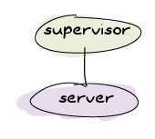

# Distributed OTP Applications

Although Erlang leaves us with a lot of work to do, it still provided a few solutions. One of these is the concept of *distributed OTP applications*. Distributed OTP applications, or just *distributed applications* when in the context of OTP, allow to define *takeover* and *failover* mechanisms. We'll see what that means, how that works, and write a little demo app to go with it.
尽管Erlang留给我们很多工作要做，但它仍然提供了一些解决方案。其中之一就是分布式OTP应用程序的概念*。分布式OTP应用程序，或者在OTP上下文中的“分布式应用程序”，允许定义“接管”和“故障转移”机制。我们将了解这意味着什么，如何工作，并编写一个小的演示应用程序。

## [Adding More to OTP]

If you recall the chapter on OTP applications, we briefly saw the structure of an application as something using a central application controller, dispatching to application masters, each monitoring a top-level supervisor for an application:
如果您还记得关于OTP应用程序的一章，我们简要地将应用程序的结构视为使用中央应用程序控制器、分派给应用程序主控器、每个主控器监控一个应用程序的顶级主管：


*, another process sitting next to it (usually called *dist_ac*):
在标准OTP应用程序中，可以加载、启动、停止或卸载应用程序。在分布式应用中，我们改变事物的工作方式；现在，应用程序控制器与*[分布式应用程序控制器]共享其工作(http://www。二郎。组织/文档/设计原则/分布式应用。html）*，它旁边的另一个进程（通常称为*dist_ac*）：


![应用程序控制器监督两名主控人员，后者反过来监督两名监督员。与应用程序并行的是dist_ac，也监督自己的应用程序](。。/静态/img/dist_ac。（巴布亚新几内亚）

Depending on the application file, the ownership of the application will change. A dist_ac will be started on all nodes, and all dist_acs will communicate together. What they talk about is not too relevant, except for one thing. As mentioned earlier, the four application statuses were being loaded, started, stopped, and unloaded; distributed applications split the idea of a started application into *started* and *running*.
根据应用程序文件的不同，应用程序的所有权将发生变化。将在所有节点上启动dist_ac，所有dist_ac将一起通信。除了一件事，他们谈论的内容并不太相关。如前所述，四种应用程序状态分别为加载、启动、停止和卸载；分布式应用程序将已启动应用程序的概念分为“已启动”和“正在运行”*。

The difference between both is that you could define an application to be global within a cluster. An application of this kind can only run on one node at a time, while regular OTP applications don't care about whatever's happening on other nodes.
两者的区别在于，可以将应用程序定义为集群中的全局应用程序。此类应用程序一次只能在一个节点上运行，而常规OTP应用程序不关心其他节点上发生的任何事情。

As such a distributed application will be started on all nodes of a cluster, but only running on one.
因此，分布式应用程序将在集群的所有节点上启动，但只在一个节点上运行。

What does this mean for the nodes where the application is started without being run? The only thing they do is wait for the node of the running application to die. This means that when the node that runs the app dies, another node starts running it instead. This can avoid interruption of services by moving around different subsystems.
这对应用程序在未运行的情况下启动的节点意味着什么？他们唯一要做的就是等待正在运行的应用程序的节点死亡。这意味着，当运行应用程序的节点死亡时，另一个节点开始运行它。这可以通过移动不同的子系统来避免服务中断。

Let's see what this means in more detail.

## [Taking and Failing Over]

There are two important concepts handled by distributed applications. The first one is the idea of a *failover*. A failover is the idea described above of restarting an application somewhere else than where it stopped running.
分布式应用程序处理两个重要的概念。第一个是故障转移的想法*。故障转移是指在应用程序停止运行的地方以外的地方重新启动应用程序。

This is a particularly valid strategy when you have redundant hardware. You run something on a 'main' computer or server, and if it fails, you move it to a backup one. In larger scale deployments, you might instead have 50 servers running your software (all at maybe 60-70% load) and expect the running ones to absorb the load of the failing ones. The concept of failing over is mostly important in the former case, and somewhat least interesting in the latter one.
当您有冗余硬件时，这是一种特别有效的策略。你在“主”计算机或服务器上运行某个东西，如果失败，你就把它转移到备份计算机或服务器上。在更大规模的部署中，您可能会有50台服务器运行您的软件（所有服务器的负载可能都在60-70%之间），并希望运行的服务器能够承受失败服务器的负载。在前一种情况下，故障转移的概念最为重要，而在后一种情况下，故障转移的概念最不有趣。

The second important concept of distributed OTP applications is the *takeover*. Taking over is the act of a dead node coming back from the dead, being known to be more important than the backup nodes (maybe it has better hardware), and deciding to run the application again. This is usually done by gracefully terminating the backup application and starting the main one instead.
分布式OTP应用程序的第二个重要概念是*接管*。接管是指死掉的节点从死掉中恢复过来，被认为比备份节点更重要（可能它有更好的硬件），然后决定再次运行应用程序。这通常是通过优雅地终止备份应用程序并启动主应用程序来实现的。

::: note
**Note:** In terms of distributed programming fallacies, distributed OTP applications assume that when there is a failure, it is likely due to a hardware failure, and not a netsplit. If you deem netsplits more likely than hardware failures, then you have to be aware of the possibility that the application is running both as a backup and main one, and that funny things could happen when the network issue is resolved. Maybe distributed OTP applications aren't the right mechanism for you in these cases.
**注：*就分布式编程谬误而言，分布式OTP应用程序假定出现故障时，很可能是硬件故障，而不是netsplit。如果您认为netsplits比硬件故障更容易发生，那么您必须意识到应用程序同时作为备份和主应用程序运行的可能性，并且当网络问题得到解决时，可能会发生有趣的事情。在这种情况下，分布式OTP应用程序可能并不适合您。
:::

Let's imagine that we have a system with three nodes, where only the first one is running a given application:
假设我们有一个有三个节点的系统，其中只有第一个节点运行给定的应用程序：


The nodes `B` and `C` are declared to be backup nodes in case `A` dies, which we pretend just happened:
节点'B'和'C'被声明为备份节点，以防'A'死亡，我们假装刚刚发生了这种情况：


For a brief moment, there's nothing running. After a while, `B` realizes this and decides to take over the application:
有那么一小会儿，什么都没有。过了一会儿，`B`意识到这一点，决定接管该应用程序：


That's a failover. Then, if `B` dies, the application gets restarted on `C`:


Another failover and all is well and good. Now, suppose that `A` comes back up. `C` is now running the app happily, but `A` is the node we defined to be the main one. This is when a takeover occurs: the app is willingly shut down on `C` and restarted on `A`:
又一次故障切换，一切都很好。现在，假设'A'再次出现。`C'现在正在愉快地运行应用程序，但A'是我们定义为主要节点的节点。这就是接管发生的时候：应用程序在'C'上自动关闭，在'a'上重新启动：


And so on for all other failures.

One obvious problem you can see is how terminating applications all the time like that is likely to be losing important state. Sadly, that's your problem. You'll have to think of places where to put and share all that vital state away before things break down. The OTP mechanism for distributed applications makes no special case for that.
您可以看到一个明显的问题，就是一直这样终止应用程序可能会失去重要的状态。可悲的是，这就是你的问题。在你把所有重要的东西放在哪里之前。分布式应用程序的OTP机制对此没有特殊要求。

Anyway, let's move on to see how we could practically make things work.

## [The Magic 8-Ball]

A magic 8-ball is a simple toy that you shake randomly in order to get divine and helpful answers. You ask questions like \"Will my favorite sports team win the game tonight?\" and the ball you shake replies something like \"Without a doubt\"; you can then safely bet your house's value on the final score. Other questions like \"Should I make careful investments for the future\" could return \"That is unlikely\" or \"I'm not sure\". The magic 8-ball has been vital in the western world's political decision making in the last decades and it is only normal we use it as an example for fault-tolerance.
一个神奇的8球是一个简单的玩具，你可以随意摇动，以获得神圣而有用的答案。你问一些问题，比如“我最喜欢的运动队今晚会赢吗？”而你摇动的球会回答“毫无疑问”；然后你可以放心地把房子的价值押在最后的分数上。其他问题，如“我是否应该为未来谨慎投资”可能会返回“不太可能”或“我不确定”。在过去的几十年里，神奇的8-球在西方世界的政治决策中至关重要，我们把它作为容错的例子是很正常的。

Our implementation won't make use of real-life switching mechanisms used to automatically find servers such as DNS round-robins or load balancers. We'll rather stay within pure Erlang and have three nodes (denoted below as `A`, `B`, and `C`) part of a distributed OTP application. The `A` node will represent the main node running the magic 8-ball server, and the `B` and `C` nodes will be the backup nodes:
我们的实现不会使用真实的切换机制来自动查找服务器，比如DNS round robins或负载平衡器。我们宁愿呆在纯Erlang中，在分布式OTP应用程序中有三个节点（以下分别表示为'A'、'B'和'C'）。“A”节点将代表运行magic 8-ball服务器的主节点，“B”和“C”节点将是备份节点：


Whenever `A` fails, the 8-ball application should be restarted on either `B` or `C`, and both nodes will still be able to use it transparently.
每当'A'失败时，8-ball应用程序应该在'B'或'C'上重新启动，并且两个节点仍然能够透明地使用它。

Before setting things up for distributed OTP applications, we'll first build the application itself. It's going to be mind bogglingly naive in its design:
在设置分布式OTP应用程序之前，我们将首先构建应用程序本身。它的设计将是令人难以置信的天真：



And in total we'll have 3 modules: the supervisor, the server, and the application callback module to start things. The supervisor will be rather trivial. We'll call it `m8ball_sup` (as in *Magic 8 Ball Supervisor*) and we'll put it in the `src/` directory of a standard OTP application:
我们总共有三个模块：主管、服务器和应用程序回调模块来启动。主管将相当琐碎。我们将其命名为'm8ball_sup'（如*Magic 8 Ball Supervisor*），并将其放入标准OTP应用程序的'src/'目录中：

```erl
-module(m8ball_sup).
-behaviour(supervisor).
-export([start_link/0, init/1]).

start_link() ->
    supervisor:start_link(, ?MODULE, []).

init([]) ->
    ,
          [{m8ball,
            ,
            permanent,
            5000,
            worker,
            [m8ball_server]
          }]}}.
```

This is a supervisor that will start a single server (`m8ball_server`), a permanent worker process. It's allowed one failure every 10 seconds.
这是一个将启动单个服务器（`m8ball_server`）的主管，这是一个永久工作进程。它允许每10秒发生一次故障。

The magic 8-ball server will be a little bit more complex. We'll build it as a gen_server with the following interface:
神奇的8球服务器将稍微复杂一点。我们将通过以下界面将其构建为gen_服务器：

```erl
-module(m8ball_server).
-behaviour(gen_server).
-export([start_link/0, stop/0, ask/1]).
-export([init/1, handle_call/3, handle_cast/2, handle_info/2,
         code_change/3, terminate/2]).

%%%%%%%%%%%%%%%%%
%%% INTERFACE %%%
%%%%%%%%%%%%%%%%%
start_link() ->
    gen_server:start_link(, ?MODULE, [], []).

stop() ->
    gen_server:call(, stop).

ask(_Question) -> % the question doesn't matter!
    gen_server:call(, question).
```

Notice how the server is started using `` as a name and how it's accessed with the same tuple for each call. That's the `global` module we've seen in the last chapter, applied to behaviours.
请注意服务器是如何使用``作为名称启动的，以及每次调用如何使用相同的元组访问它。这是我们在上一章中看到的“全球”模块，适用于行为。

Next come the callbacks, the real implementation. Before I show how we build it, I'll mention how I want it to work. The magic 8-ball should randomly pick one of many possible replies from some configuration file. I want a configuration file because it should be easy to add or remove answers as we wish.
接下来是回调，真正的实现。在我展示如何构建它之前，我会先介绍一下我希望它如何工作。magic 8-ball应该从一些配置文件中随机选择一个可能的回复。我想要一个配置文件，因为它应该很容易添加或删除答案，因为我们希望。

First of all, if we want to do things randomly, we'll need to set up some randomness as part of our init function:
首先，如果我们想随机做一些事情，我们需要设置一些随机性，作为init函数的一部分：

```erl
%%%%%%%%%%%%%%%%%
%%% CALLBACKS %%%
%%%%%%%%%%%%%%%%%
init([]) ->
    <<A:32, B:32, C:32>> = crypto:rand_bytes(12),
    random:seed(A,B,C),
    .
```

We've seen that pattern before in the [Sockets chapter](buckets-of-sockets.html): we're using 12 random bytes to set up the initial random seed to be used with the `random:uniform/1` function.
我们以前在[Sockets（套接字）一章]（套接字的桶）中见过这种模式。html）：我们使用12个随机字节来设置初始随机种子，以便与“random:uniform/1”函数一起使用。

The next step is to read the answers from the configuration file and pick one. If you recall the [OTP application chapter](building-otp-applications.html), the easiest way to set up some configuration is to use the `app` file to do it (in the `env` tuple). Here's how we're gonna do this:
下一步是从配置文件中读取答案并选择一个。如果您还记得[OTP应用程序章节]（构建OTP应用程序。设置一些配置的最简单方法是使用'app'文件（在'env'元组中）。下面是我们将如何做到这一点：

```erl
handle_call(question, _From, State) ->
     = application:get_env(m8ball, answers),
    Answer = element(random:uniform(tuple_size(Answers)), Answers),
    ;
handle_call(stop, _From, State) ->
    ;
handle_call(_Call, _From, State) ->
    .
```

The first clause shows what we want to do. I expect to have a tuple with all the possible answers within the `answers` value of the `env` tuple. Why a tuple? Simply because accessing elements of a tuple is a constant time operation while obtaining it from a list is linear (and thus takes longer on larger lists). We then send the answer back.
第一条说明了我们想做什么。我希望有一个元组，其中所有可能的答案都在'env'元组的'answers'值内。为什么是元组？因为访问元组的元素是一个常数时间操作，而从列表中获取元组是线性的（因此在较大的列表中需要更长的时间）。然后我们把答案寄回来。

::: note
**Note:** the server reads the answers with `application:get_env(m8ball, answers)` on each question asked. If you were to set new answers with a call like `application:set_env(m8ball, answers, )`, the three answers would instantly be the possible choices for future calls.
**注意：**服务器在每个问题上都会使用“应用程序：get_env（m8ball，answers）”阅读答案。如果你要用“应用程序：set_env（m8ball，answers，）”这样的呼叫设置新答案，那么这三个答案将立即成为未来呼叫的可能选择。

Reading them once at startup should be somewhat more efficient in the long run, but it will mean that the only way to update the possible answers is to restart the application.
从长远来看，在启动时读一次应该会更有效率，但这意味着更新可能答案的唯一方法是重新启动应用程序。
:::

You should have noticed by now that we don't actually care about the question asked --- it's not even passed to the server. Because we're returning random answers, it is entirely useless to copy it from process to process. We're just saving work by ignoring it entirely. We still leave the answer there because it will make the final interface feel more natural. We could also trick our magic 8-ball to always return the same answer for the same question if we felt like it, but we won't bother with that for now.
你现在应该已经注意到，我们实际上并不关心所问的问题——它甚至没有传递给服务器。因为我们返回的是随机答案，所以从一个进程复制到另一个进程是完全无用的。我们完全忽略它，只是为了节省工作量。我们仍然保留答案，因为它会让最终的界面感觉更自然。如果我们愿意的话，我们也可以欺骗我们的魔法8号球，让它总是对同一个问题给出相同的答案，但我们现在不想麻烦了。

The rest of the module is pretty much the same as usual for a generic gen_server doing nothing:

```erl
handle_cast(_Cast, State) ->
    .

handle_info(_Info, State) ->
    .

code_change(_OldVsn, State, _Extra) ->
    .

terminate(_Reason, _State) ->
    ok.
```

Now we can get to the more serious stuff, namely the application file and the callback module. We'll begin with the latter, `m8ball.erl`:
现在我们可以讨论更重要的内容，即应用程序文件和回调模块。我们将从后者开始，m8ball。呃`:

```erl
-module(m8ball).
-behaviour(application).
-export([start/2, stop/1]).
-export([ask/1]).

%%%%%%%%%%%%%%%%%
%%% CALLBACKS %%%
%%%%%%%%%%%%%%%%%

start(normal, []) ->
    m8ball_sup:start_link().

stop(_State) ->
    ok.

%%%%%%%%%%%%%%%%%
%%% INTERFACE %%%
%%%%%%%%%%%%%%%%%
ask(Question) ->
    m8ball_server:ask(Question).
```

That was easy. Here's the associated `.app` file, `m8ball.app`:

```erl
{application, m8ball,
 [,
  ,
  ,
  ,
  ,
  ,
  {env, [
    {answers, {<<"Yes">>, <<"No">>, <<"Doubtful">>,
               <<"I don't like your tone">>, <<"Of course">>,
               <<"Of course not">>, <<"*backs away slowly and runs away*">>}}
  ]}
 ]}.
```

We depend on `stdlib` and `kernel`, like all OTP applications, and also on `crypto` for our random seeds in the server. Note how the answers are all in a tuple: that matches the tuples required in the server. In this case, the answers are all binaries, but the string format doesn't really matter --- a list would work as well.
与所有OTP应用程序一样，我们依赖于'stdlib'和'kernel'，服务器中的随机种子也依赖于'crypto'。请注意答案如何都在一个元组中：它与服务器中所需的元组相匹配。在本例中，答案都是二进制文件，但字符串格式并不重要——列表也可以。

## [Making the Application Distributed]

So far, everything was like a perfectly normal OTP application. We have very few changes to add to our files to make it work for a distributed OTP application; in fact, only one function clause to add, back in the `m8ball.erl` module:
到目前为止，一切都像是一个完全正常的OTP应用程序。为了使其适用于分布式OTP应用程序，我们几乎没有需要添加到文件中的更改；实际上，只有一个function子句需要添加，回到'm8ball'中。erl模块：

```erl
%%%%%%%%%%%%%%%%%
%%% CALLBACKS %%%
%%%%%%%%%%%%%%%%%

start(normal, []) ->
    m8ball_sup:start_link();
start(, []) ->
    m8ball_sup:start_link().
```

The `` argument is passed to `start/2` when a more important node takes over a backup node. In the case of the magic 8-ball app, it doesn't really change anything and we can just start the supervisor all the same.
当一个更重要的节点接管一个备份节点时，``参数被传递给`start/2`。在magic 8-ball应用程序中，它并没有真正改变任何事情，我们仍然可以启动supervisor。

Recompile your code and it's pretty much ready. But hold on, how do we define what nodes are the main ones and which ones are backups? The answer is in configuration files. Because we want a system with three nodes (`a`, `b`, and `c`), we'll need three configuration files (I named them [a.config](static/erlang/m8ball/config/a.config.html), then put them all in `config/` inside the application directory):
重新编译你的代码，它已经准备好了。但是等等，我们如何定义哪些节点是主节点，哪些节点是备份节点？答案在配置文件中。因为我们想要一个有三个节点（`a`、`b`和`c`）的系统，所以我们需要三个配置文件（我把它们命名为[a]）。config]（static/erlang/m8ball/config/a）。配置。html），然后将它们全部放入应用程序目录中的`config/`

```erl
[{kernel,
  [{distributed, [{m8ball,
                   5000,
                  [a@ferdmbp, ,
   ,
   
  ]}].
```

```erl
[{kernel,
  [{distributed, [{m8ball,
                   5000,
                  [a@ferdmbp, ,
   ,
   
  ]}].
```

```erl
[{kernel,
  [{distributed, [{m8ball,
                   5000,
                  [a@ferdmbp, ,
   ,
   
  ]}].
```

Don't forget to rename the nodes to fit your own host. Otherwise the general structure is always the same:
别忘了重命名节点以适应自己的主机。否则，总体结构总是相同的：

```erl
[{kernel,
  [{distributed, [{AppName,
                   TimeOutBeforeRestart,
                   NodeList}]},
   ,
   ,
   
 ]}].
```

The `NodeList` are equal secondary backups, then the other ones, etc.


The `sync_nodes_mandatory` tuple will work in conjunction with `sync_nodes_timeout`. When you start a distributed virtual machine with values set for this, it will stay locked up until all the mandatory nodes are also up and locked. Then they get synchronized and things start going. If it takes more than `MaxTime` to get all the nodes up, then they will all crash before starting.
“sync_nodes_mandatory”元组将与“sync_nodes_timeout”一起工作`。当您使用为此设置的值启动分布式虚拟机时，它将保持锁定状态，直到所有必需的节点都已启动并锁定。然后它们同步，事情就开始了。如果需要超过“MaxTime”才能启动所有节点，那么它们在启动之前都会崩溃。

There are way more options available, and I recommend looking into the [kernel application documentation](http://www.erlang.org/doc/man/kernel_app.html) if you want to know more about them.
有更多的选项可用，我建议查看[内核应用程序文档](http://www。二郎。org/doc/man/kernel_app。如果你想了解更多关于他们的信息。

We'll try things with the `m8ball` application now. If you're not sure 30 seconds is enough to boot all three VMs, you can increase the `sync_nodes_timeout` as you wish. Then, start three VMs:
我们现在将尝试使用'm8ball'应用程序。如果您不确定30秒是否足以启动所有三个虚拟机，可以根据需要增加“同步节点超时”。然后，启动三个虚拟机：

```eshell
$ erl -sname a -config config/a -pa ebin/
```

```eshell
$ erl -sname b -config config/b -pa ebin/
```

```eshell
$ erl -sname c -config config/c -pa ebin/
```

As you start the third VM, they should all unlock at once. Go into each of the three virtual machines, and turn by turn, start both `crypto` and `m8ball` with `application:start(AppName)`.
当你启动第三个虚拟机时，它们应该立即解锁。进入三个虚拟机中的每一个，依次启动'crypto'和'm8ball'，使用'application:start（AppName）`。

You should then be able to call the magic 8-ball from any of the connected nodes:

```eshell
(a@ferdmbp)3> m8ball:ask("If I crash, will I have a second life?").
<<"I don't like your tone">>
(a@ferdmbp)4> m8ball:ask("If I crash, will I have a second life, please?").
<<"Of Course">>
```

```erl
(c@ferdmbp)3> m8ball:ask("Am I ever gonna be good at Erlang?").
<<"Doubtful">>
```

How motivational. To see how things are, call `application:which_applications()` on all nodes. Only node `a` should be running it:
多么激励人啊。要了解情况，请在所有节点上调用'application:which_applications（）。只有节点'a'应该运行它：

```erl
(b@ferdmbp)3> application:which_applications().
[,
 ,
 ]
```

```erl
(a@ferdmbp)5> application:which_applications().
[,
 ,
 ,
 ]
```

The `c` node should show the same thing as the `b` node in that case. Now if you kill the `a` node (just ungracefully close the window that holds the Erlang shell), the application should obviously no longer be running there. Let's see where it is instead:
在这种情况下，`c`节点应该显示与`b`节点相同的内容。现在，如果您杀死'a'节点（只是不小心地关闭保存Erlang shell的窗口），应用程序显然就不应该再在那里运行了。让我们看看它在哪里：

```erl
(c@ferdmbp)4> application:which_applications().
[,
 ,
 ]
(c@ferdmbp)5> m8ball:ask("where are you?!").
<<"I don't like your tone">>
```

That's expected, as `b` is higher in the priorities. After 5 seconds (we set the timeout to 5000 milliseconds), `b` should be showing the application as running:
这是意料之中的，因为“b”在优先级中更高。5秒后（我们将超时设置为5000毫秒），`b`应该显示应用程序正在运行：

```erl
(b@ferdmbp)4> application:which_applications().
[,
 ,
 ,
 ]
```

It runs fine, still. Now kill `b` in the same barbaric manner that you used to get rid of `a`, and `c` should be running the application after 5 seconds:
它仍然运行良好。现在，用你用来清除'a'的野蛮方式杀死'b'，而'c'应该在5秒后运行应用程序：

```erl
(c@ferdmbp)6> application:which_applications().
[,
 ,
 ,
 ]
```

If you restart the node `a` with the same command we had before, it will hang. The config file specifies we need `b` back for `a` to work. If you can't expect nodes to all be up that way, you'll need to make maybe `b` or `c` optional, for example. So if we start both `a` and `b`, then the application should automatically come back, right?
如果使用之前的相同命令重新启动节点'a'，它将挂起。配置文件指定我们需要返回'b'才能使'a'工作。如果你不能期望所有的节点都是这样的，那么你可能需要选择'b'或'c'。所以如果我们同时启动'a'和'b'，那么应用程序应该会自动返回，对吗？

```erl
(a@ferdmbp)4> application:which_applications().
[,
 ,
 ]
(a@ferdmbp)5> m8ball:ask("is the app gonna move here?").
<<"Of course not">>
```

Aw, shucks. The thing is, for the mechanism to work, the application needs to be started *as part of the boot procedure of the node*. You could, for instance, start `a` that way for things to work:
噢，见鬼。问题是，为了使该机制工作，应用程序需要作为节点引导过程的一部分启动*。例如，你可以用这种方式启动'a'，让事情正常运行：

```erl
erl -sname a -config config/a -pa ebin -eval 'application:start(crypto), application:start(m8ball)'
...
(a@ferdmbp)1> application:which_applications().
[,
 ,
 ,
 ]
```

And from `c`'s side:

```erl
=INFO REPORT==== 8-Jan-2012::19:24:27 ===
    application: m8ball
    exited: stopped
    type: temporary
```

That's because the `-eval` option gets evaluated as part of the boot procedure of the VM. Obviously, a cleaner way to do it would be to use releases to set things up right, but the example would be pretty cumbersome if it had to combine everything we had seen before.
这是因为`-eval`选项作为VM引导过程的一部分进行评估。显然，一种更干净的方法是使用发布来设置正确的设置，但是如果必须将我们以前看到的所有内容结合起来，那么这个示例将非常麻烦。

Just remember that in general, distributed OTP applications work best when working with releases that ensure that all the relevant parts of the system are in place.
请记住，一般来说，分布式OTP应用程序在使用确保系统所有相关部分都到位的版本时工作得最好。

As I mentioned earlier, in the case of many applications (the magic 8-ball included), it's sometimes simpler to just have many instances running at once and synchronizing data rather than forcing an application to run only at a single place. It's also simpler to scale it once that design has been picked. If you need some failover/takeover mechanism, distributed OTP applications might be just what you need.
正如我之前提到的，在许多应用程序（包括magic 8-ball）的情况下，有时让多个实例同时运行并同步数据比强迫应用程序只在一个地方运行更简单。一旦选定了设计，就可以更简单地进行缩放。如果您需要某种故障切换/接管机制，分布式OTP应用程序可能正是您所需要的。
