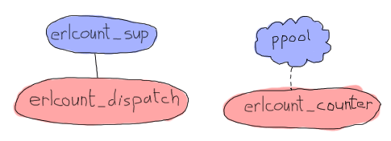
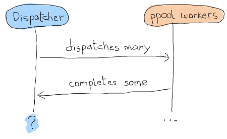

# The Count of Applications

## [From OTP Application to Real Application]


Our ppool app has become a valid OTP application and we are now able to understand what this means. It would be nice to build something that actually uses our process pool to do anything useful, though. To push our knowledge of applications a bit further, we will write a second application. This one will depend on `ppool`, but will be able to benefit from some more automation than our 'nagger'.
我们的ppool应用程序已经成为一个有效的OTP应用程序，我们现在能够理解这意味着什么。不过，如果能构建一些真正使用我们的流程池来做任何有用的事情，那就太好了。为了进一步加深我们对应用程序的了解，我们将编写第二个应用程序。这一个将依赖于“ppool”，但将能够受益于比我们的“唠叨者”更多的自动化。

This application, that I will name `erlcount`, will have a somewhat simple objective: recursively look into some directory, find all Erlang files (ending in `.erl`) and then run a regular expression over it to count all instances of a given string within the modules. The results are then accumulated to give the final result, which will be output to the screen.
我将把这个应用程序命名为“erlcount”，它有一个简单的目标：递归地查找某个目录，找到所有Erlang文件（以`。erl`），然后在其上运行正则表达式，以计算模块中给定字符串的所有实例。然后将结果累加，得出最终结果，并输出到屏幕上。

This specific application will be relatively simple, relying heavily on our process pool instead. It will have a structure as follows:
这个特定的应用程序将相对简单，主要依赖于我们的流程池。其结构如下：


!['erlcount'u sup'监督'erlcount'u dispatch'，'ppool'站成一个云状，监督'erlcount'u counter'](。。/静态/img/erlcount sups。（巴布亚新几内亚）

In the diagram above, `ppool` represents the whole application, but only means to show that `erlcount_counter` will be the worker for the process pool. This one will open files, run the regular expression and return the count. The process/module `erlcount_sup` will be our supervisor, and `erlcount_dispatch` will be a single server in charge of browsing the directories, asking `ppool` to schedule workers and compiling the results. We'll also add an `erlcount_lib` module, taking charge of hosting all the functions to read directories, compile data and whatnot, leaving the other modules with the responsibility of coordinating these calls. Last will be an `erlcount` module with the single purpose of being the application callback module.
在上图中，`ppool`代表整个应用程序，但仅表示表明`erlcount_counter`将是进程池的工作进程。这个将打开文件，运行正则表达式并返回计数。流程/模块“erlcount_sup”将是我们的主管，“erlcount_dispatch”将是一台服务器，负责浏览目录，要求“ppool”安排工作人员并汇编结果。我们还将添加一个“erlcount_lib”模块，负责托管所有用于读取目录、编译数据等的函数，让其他模块负责协调这些调用。最后是一个“erlcount”模块，其唯一目的是作为应用程序回调模块。

The first step, as for our last app, is to create the directory structure needed. You can also add a few file stubs if you feel like doing so:
第一步，就像我们上一个应用一样，是创建所需的目录结构。如果愿意，还可以添加一些文件存根：

``` expand
ebin/
 - erlcount.app
include/
priv/
src/
 - erlcount.erl
 - erlcount_counter.erl
 - erlcount_dispatch.erl
 - erlcount_lib.erl
 - erlcount_sup.erl
test/
Emakefile
```

Nothing too different from what we had before, you can even copy the Emakefile we had before.

We can probably start writing most parts of the application pretty quickly. The `.app` file, the counter, library and supervisor should be relatively simple. On the other hand, the dispatch module will have to accomplish some complex tasks if we want things to be worth it. Let's start with [the app file](static/erlang/erlcount-1.0/ebin/erlcount.app.html):
我们可以很快开始编写应用程序的大部分内容。那个`。应用程序文件、柜台、图书馆和管理员应该相对简单。另一方面，如果我们想要物有所值，调度模块必须完成一些复杂的任务。让我们从[应用程序文件]（static/erlang/erlcount-1）开始。0/ebin/erlcount。应用程序。html）：

```erl
{application, erlcount,
 [,
  {modules, [erlcount, erlcount_sup, erlcount_lib,
             erlcount_dispatch, erlcount_counter]},
  ,
  ,
  ,
  {env,
   [,
    ,
    
 ]}.
```

This app file is a bit more complex than the `ppool` one. We can still recognize some of the fields as being the same: this app will also be in version 1.0.0, the modules listed are all the same as above. The next part is something we didn't have: an application dependency. As explained earlier, the `applications` tuple gives a list of all the applications that should be started before `erlcount`. If you try to start it without that, you'll get an error message. We then have to count the registered processes with ``. Technically none of our modules started as part of the `erlcount` app will need a name. Everything we do can be anonymous. However, because we know `ppool` registers the `ppool_serv` to the name we give it and because we know we will use a process pool, then we're going to call it `erlcount` and note it there. If all applications that use `ppool` do the same, we should be able to detect conflicts in the future. The `mod` tuple is similar as before; we define the application behaviour callback module there.
这个应用程序文件比“ppool”文件要复杂一些。我们仍然可以识别出一些字段是相同的：这个应用程序也将在版本1中。0。0，所列模块均与上述相同。下一部分是我们没有的：应用程序依赖关系。如前所述，“applications”元组给出了在“erlcount”之前应该启动的所有应用程序的列表`。如果你试图在没有这个的情况下启动它，你会收到一条错误消息。然后，我们必须使用``。从技术上讲，作为“erlcount”应用程序的一部分启动的所有模块都不需要名称。我们所做的一切都可以匿名。然而，因为我们知道'ppool'将'ppool_serv'注册到我们给它的名称，并且因为我们知道我们将使用一个进程池，所以我们将把它命名为'erlcount'，并在那里记录它。如果所有使用“ppool”的应用程序都这样做，我们将来应该能够检测到冲突。“mod”元组与以前类似；我们在这里定义了应用程序行为回调模块。


), then we have `max_files` telling us how many file descriptors should be opened at once. We don't want to open 10,000 files at once if we end up have that many, so this variable will match the maximum number of workers in `ppool`. Then the most complex variable is `regex`. This one will contain a list of all regular expressions we want to run over each of the files to count the results.
在本例中，我们定义了三个变量：`directory`，它告诉应用程序在哪里查找`。erl`文件（假设我们从erlcount-1运行应用程序。0目录，这意味着[`learn you some erlang`root]（static/erlang/learn you some erlang）。然后我们有“max_files”告诉我们一次应该打开多少个文件描述符。如果我们最终有那么多文件，我们不想一次打开10000个文件，所以这个变量将匹配“ppool”中的最大工作人数`。那么最复杂的变量是`regex`。这一个将包含我们想要在每个文件上运行的所有正则表达式的列表，以计算结果。

I won't get into the long explaining of the syntax of [Perl Compatible Regular Expressions](http://en.wikipedia.org/wiki/PCRE) (if you're interested, the `re` module contains some documentation), but will still explain what we're doing here. In this case, the first regular expression says \"look for a string that contains 'if' followed by any single white space character (`\s`, with a second backslash for escaping purposes), and finishes with `->`. Moreover there can be anything in between the 'if' and the `->` (`.+`)\". The second regular expression says \"look for a string that contains 'case' followed by any single whitespace character (`\s`), and finishes with 'of' preceded by single whitespace character. Between the 'case ' and the ' of', there can be anything (`.+`)\". To make things simple, we'll try to count how many times we use `case ... of` vs. how many times we use `if ... end` in our libraries.
我不会详细解释[Perl兼容正则表达式]的语法(http://en。维基百科。org/wiki/PCRE）（如果你感兴趣，re模块包含一些文档），但仍将解释我们在这里做什么。在本例中，第一个正则表达式表示“查找一个包含“if”的字符串，该字符串后跟任何一个空格字符（“\s”，第二个反斜杠用于转义），并以“->`。此外，在“如果”和“->”之间可以有任何东西(`。+`)\"。第二个正则表达式表示“查找一个字符串，该字符串包含'case'，后跟任何一个空格字符（`s`），并以'of'结尾，后跟一个空格字符。”。在“case”和“of”之间，可以有任何东西(`。+`)\"。为了让事情变得简单，我们将尝试计算使用“case”的次数。。。关于vs。我们用了多少次“如果”。。。在我们的图书馆结束。

::: 
**Don't Drink Too Much Kool-Aid:**\
Using regular expressions is not an optimal choice to analyse Erlang code. The problem is there are lots of cases that will make our results inaccurate, including strings in the text and comments that match the patterns we're looking for but are technically not code.
使用正则表达式不是分析Erlang代码的最佳选择。问题是有很多情况会使我们的结果不准确，包括文本中的字符串和注释与我们正在寻找的模式匹配，但从技术上讲不是代码。

To get more accurate results, we would need to look at the parsed and the expanded version of our modules, directly in Erlang. While more complex (and outside the scope of this text), this would make sure that we handle everything like macros, exclude comments, and just generally do it the right way.
为了获得更准确的结果，我们需要直接在Erlang中查看模块的解析版本和扩展版本。虽然更复杂（并且超出了本文的范围），但这将确保我们像处理宏一样处理所有事情，排除注释，并且通常以正确的方式处理。
:::

With this file out of the way, we can start the [application callback module](static/erlang/erlcount-1.0/src/erlcount.erl.html). It won't be complex, basically only starting the supervisor:
有了这个文件，我们就可以启动[application callback module]（static/erlang/erlcount-1）。0/src/erlcount。呃。（html）。这不会很复杂，基本上只是启动主管：

```erl
-module(erlcount).
-behaviour(application).
-export([start/2, stop/1]).

start(normal, _Args) ->
    erlcount_sup:start_link().

stop(_State) ->
    ok.
```

And now [the supervisor itself](static/erlang/erlcount-1.0/src/erlcount_sup.erl.html):

```erl
-module(erlcount_sup).
-behaviour(supervisor).
-export([start_link/0, init/1]).

start_link() ->
    supervisor:start_link(?MODULE, []).

init([]) ->
    MaxRestart = 5,
    MaxTime = 100,
    ,
     [{dispatch,
       ,
        transient,
        60000,
        worker,
        [erlcount_dispatch]}]}}.
```

This is a standard supervisor, which will be in charge of only `erlcount_dispatch`, as it was shown on the previous little schema. The `MaxRestart` and the 60 seconds value for shutdown were chosen pretty randomly, but in real cases you'd want to study the needs you have. Because this is a demo application, it didn't seem that important at the time. The author keeps himself the right to laziness.
这是一个标准的主管，它将只负责“erlcount_dispatch”，如前一个小模式所示。“MaxRestart”和“shutdown”的60秒值是随机选择的，但在实际情况下，您需要研究您的需求。因为这是一个演示应用程序，所以当时它似乎并不那么重要。懒惰是作者自己的权利。

We can get to the next process and module in the chain, the dispatcher. The dispatcher will have a few complex requirements to fulfill for it to be useful:
我们可以进入链中的下一个进程和模块，调度器。调度员需要满足一些复杂的要求才能发挥作用：

-   When we go through directories to find files ending in `.erl`, we should only go through the whole list of directories once, even when we apply multiple regular expressions;
-当我们在目录中查找以`。erl`，我们应该只浏览一次整个目录列表，即使我们应用了多个正则表达式；
-   We should be able to start scheduling files for result counting as soon as we find there's one that matches our criteria. We should not need to wait for a complete list to do so.
-一旦我们发现有一个符合我们的标准，我们就应该能够开始安排文件进行结果计数。我们不需要等待一份完整的清单。
-   We need to hold a counter per regular expression so we can compare the results in the end
-   It is possible we start getting results from the `erlcount_counter` workers before we're done looking for `.erl` files
-在我们完成寻找之前，我们可能会从“erlcount_计数器”的工作人员那里得到结果`。呃`文件
-   It is possible that many `erlcount_counter`s will be running at once
-   It is likely we will keep getting result after we finished looking files up in the directories (especially if we have many files or complex regular expressions).
-在目录中查找完文件后（尤其是当我们有许多文件或复杂的正则表达式时），我们可能会继续得到结果。

The two big points we have to consider right now is how we're going to go through a directory recursively while still being able to get results from there in order to schedule them, and then accept results back while that goes on, without getting confused.
我们现在要考虑的两个要点是，我们将如何递归地遍历一个目录，同时仍然能够从那里获得结果，以便对它们进行调度，然后在继续时接受结果，而不会感到困惑。


, and then a function that will allow us to keep going after that. In our case, our function will basically have two possible return values:
这是一种编程风格，称为延续传递风格*。它背后的基本思想是采用一个通常是深度递归的函数，并分解每一步。我们返回每一步（通常是累加器），然后返回一个函数，允许我们继续执行这一步。在我们的例子中，我们的函数基本上有两个可能的返回值：

``` expand

done
```

Whenever we receive the first one, we can schedule `FileName`:

```erl
-module(erlcount_lib).
-export([find_erl/1]).
-include_lib("kernel/include/file.hrl").

%% Finds all files ending in .erl
find_erl(Directory) ->
    find_erl(Directory, queue:new()).
```

Ah, something new there! What a surprise, my heart is racing and my blood is pumping. The include file up there is something given to us by the `file` module. It contains a record (`#file_info`) with a bunch of fields explaining details about the file, including its type, size, permissions, and so on.
啊，有新东西！真令人惊讶，我的心脏在跳动，血液在跳动。上面的include文件是“file”模块提供给我们的。它包含一条记录（“#file_info”），其中有一系列字段解释有关该文件的详细信息，包括其类型、大小、权限等。

Our design here includes a queue. Why is that? Well it is entirely possible that a directory contains more than one file. So when we hit a directory and it contains something like 15 files, we want to handle the first one (and if it's a directory, open it, look inside, etc.) and then handle the 14 others later. In order to do so, we will just store their names in memory until we have the time process them. We use a queue for that, but a stack or any other data structure would still be fine given we don't really care about the order in which we read files. Anyway, the point is, this queue acts a bit like a to-do list for files in our algorithm.
我们在这里的设计包括一个队列。为什么？一个目录完全可能包含多个文件。所以当我们点击一个目录，它包含15个文件时，我们想要处理第一个（如果它是一个目录，打开它，查看内部，等等）。)然后再处理另外14个。为了做到这一点，我们将把它们的名字存储在内存中，直到我们有时间处理它们。我们使用了一个队列，但是堆栈或任何其他数据结构仍然可以，因为我们并不真正关心读取文件的顺序。无论如何，关键是，在我们的算法中，这个队列有点像文件的待办事项列表。

Alright so let's start by reading the first file passed from the first call:

```erl
%%% Private
%% Dispatches based on file type
find_erl(Name, Queue) ->
     = file:read_file_info(Name),
    case F#file_info.type of
        directory -> handle_directory(Name, Queue);
        regular -> handle_regular_file(Name, Queue);
        _Other -> dequeue_and_run(Queue)
    end.
```

This function tells us few things: we only want to deal with regular files and directories. In each case we will write ourselves a function to handle these specific occurrences (`handle_directory/2` and `handle_regular_file/2`). For other files, we will dequeue anything we had prepared before with the help of `dequeue_and_run/1` (we'll see what this one is about soon). For now, we first start dealing with directories:
这个函数告诉我们一些事情：我们只想处理常规文件和目录。在每种情况下，我们都将为自己编写一个函数来处理这些特定事件（“handle_directory/2”和“handle_regular_file/2”）。对于其他文件，我们将在“dequeue_和_run/1”的帮助下，将之前准备好的所有文件都排出来（我们很快就会看到这篇文章的内容）。现在，我们首先开始处理目录：

```erl
%% Opens directories and enqueues files in there
handle_directory(Dir, Queue) ->
    case file:list_dir(Dir) of
         ->
            dequeue_and_run(Queue);
         ->
            dequeue_and_run(enqueue_many(Dir, Files, Queue))
    end.
```

So if there are no files, we keep searching with `dequeue_and_run/1`, and if there are many, we enqueue them before doing so. Let me explain this. The function `dequeue_and_run` will take the queue of file names and get one element out of it. The file name it fetches out from there will be used by calling `find_erl(Name, Queue)` and we just keep going as if we were just getting started:
因此，如果没有文件，我们会继续使用“dequeue”和“run/1”进行搜索，如果有很多文件，我们会在搜索之前将它们排队。让我解释一下。函数'dequeue_and_run'将获取文件名队列并从中获取一个元素。它从那里获取的文件名将通过调用'find_erl（name，Queue）'来使用，我们就像刚刚开始一样继续：

```erl
%% Pops an item from the queue and runs it.
dequeue_and_run(Queue) ->
    case queue:out(Queue) of
         -> done;
         -> find_erl(File, NewQueue)
    end.
```

Note that if the queue is empty (``), the function considers itself `done` (a keyword chosen for our CPS function), otherwise we keep going over again.
请注意，如果队列是空的（``），则函数会认为自己是“完成的”（为我们的CPS函数选择的关键字），否则我们会继续重复。

The other function we had to consider was `enqueue_many/3`. This one is designed to enqueue all the files found in a given directory and works as follows:
我们必须考虑的另一个功能是“排队”`。这一功能旨在将给定目录中找到的所有文件排队，其工作原理如下：

```erl
%% Adds a bunch of items to the queue.
enqueue_many(Path, Files, Queue) ->
    F = fun(File, Q) -> queue:in(filename:join(Path,File), Q) end,
    lists:foldl(F, Queue, Files).
```

Basically, we use the function `filename:join/2` to merge the directory's path to each file name (so that we get a complete path). We then add this new full path to a file to the queue. We use a fold to repeat the same procedure with all the files in a given directory. The new queue we get out of it is then used to run `find_erl/2` again, but this time with all the new files we found added to the to-do list.
基本上，我们使用函数'filename:join/2'将目录路径合并到每个文件名（这样我们就得到了完整的路径）。然后，我们将这个新的完整路径添加到队列中的一个文件中。我们使用折叠对给定目录中的所有文件重复相同的过程。然后，我们从队列中取出的新文件被再次用于运行“find_erl/2”，但这一次，我们找到的所有新文件都被添加到了待办事项列表中。

Whoa, we digressed a bit. Where were we? Oh yes, we were handling directories and now we're done with them. We then need to check for regular files and whether they end in `.erl` or not.
哇，我们有点离题了。我们在哪里？哦，是的，我们在处理目录，现在我们已经处理完了。然后我们需要检查常规文件，以及它们是否以`。呃`还是不。

```erl
%% Checks if the file finishes in .erl
handle_regular_file(Name, Queue) ->
    case filename:extension(Name) of
        ".erl" ->
            ;
        _NonErl ->
            dequeue_and_run(Queue)
    end.
```

You can see that if the name matches (according to `filename:extension/1`), we return our continuation. The continuation gives the `Name` to the caller, and then wraps the operation `dequeue_and_run/1` with the queue of files left to visit into a fun. That way, the user can call that fun and keep going as if we were still in the recursive call, while still getting results in the mean time. In the case where the file name doesn't end in `.erl`, then the user has no interest in us returning yet and we keep going by dequeuing more files. That's it.
您可以看到，如果名称匹配（根据`filename:extension/1`），我们将返回继续。继续符将“Name”提供给调用者，然后将“dequeue_和_run/1”操作与要访问的文件队列打包成一个有趣的窗口。这样，用户就可以称之为乐趣，并像我们仍在递归调用中一样继续进行，同时仍能得到结果。如果文件名不以`。erl`，那么用户对我们返回不感兴趣，我们继续排更多文件的队。就这样。

Hooray, the CPS thing is done. We can then focus on the other issue. How are we going to design the dispatcher so that it can both dispatch and receive at once? My suggestion, which you will no doubt accept because I'm the one writing the text, is to use a finite state machine. It will have two states. The first one will be the 'dispatching' state. It's the one used whenever we're waiting for our `find_erl` CPS function to hit the `done` entry. While we're in there, we will never think about us being done with the counting. That will only happen in the second and final state, 'listening', but we will still receive notices from ppool all the time:
万岁，CPS的事结束了。然后我们可以关注另一个问题。我们将如何设计调度器，使其能够同时发送和接收？我的建议是使用有限状态机，你肯定会接受，因为我是写这篇文章的人。它将有两个州。第一个是“派遣”状态。它是我们在等待“find_erl”CPS函数点击“done”条目时使用的。当我们在那里的时候，我们永远不会想到我们已经完成了计数。这只会发生在第二个也是最后一个状态“监听”中，但我们仍然会一直收到来自ppool的通知：


:
我们将慢慢开始构建[gen_fsm]（static/erlang/erlcount-1）。0/src/erlcount\u调度。呃。html）：

```erl
-module(erlcount_dispatch).
-behaviour(gen_fsm).
-export([start_link/0, complete/4]).
-export([init/1, dispatching/2, listening/2, handle_event/3,
        handle_sync_event/4, handle_info/3, terminate/3, code_change/4]).

-define(POOL, erlcount).
```

Our API will thus have two functions: one for the supervisor (`start_link/0`) and one for the ppool callers (`complete/4`, we'll see the arguments when we get there). The other functions are the standard gen_fsm callbacks, including our `listening/2` and `dispatching/2` asynchronous state handlers. I also defined a `?POOL` macro, used to give our ppool server the name 'erlcount'.
因此，我们的API将有两个函数：一个用于主管（`start_link/0`），另一个用于ppool调用程序（`complete/4`，我们到达那里后会看到参数）。其他功能是标准gen_fsm回调，包括“监听/2”和“调度/2”异步状态处理程序。我还定义了`？POOL`macro，用于为我们的ppool服务器命名为`erlcount`。

What should the gen_fsm's data look like, though? Because we're going asynchronous and we are going to always call `ppool:run_async/2` instead of anything else, we will have no real way of knowing if we're ever done scheduling files or not. Basically we could have a timeline like this:
不过，gen_fsm的数据应该是什么样的呢？因为我们正在进行异步，并且总是调用'ppool:run_async/2'而不是其他任何东西，所以我们无法真正知道我们是否完成了文件调度。基本上我们可以有这样一个时间表：


.
```

The first list will be tuples of the form ``, while the second will be a list of some kind of references to the messages. Anything will do, as long as it's unique. We can then add the two following API functions:
第一个列表是``形式的元组，而第二个列表是对消息的某种引用。只要是独一无二的，什么都可以。然后，我们可以添加以下两个API函数：

```erl
%%% PUBLIC API
start_link() ->
    gen_fsm:start_link(?MODULE, [], []).

complete(Pid, Regex, Ref, Count) ->
    gen_fsm:send_all_state_event(Pid, ).
```

And here is our secret `complete/4` function. Unsurprisingly, the workers will only have to send back 3 pieces of data: what regular expression they were running, what their associated score was, and then the reference mentioned above. Awesome, we can get into the real interesting stuff!
这是我们的秘密“完整/4”功能。毫不奇怪，工作人员只需返回3条数据：他们运行的是什么正则表达式，他们的相关分数是多少，然后是上面提到的引用。太棒了，我们可以进入真正有趣的东西！

```erl
init([]) ->
    %% Move the get_env stuff to the supervisor's init.
     = application:get_env(regex),
     = application:get_env(directory),
     = application:get_env(max_files),
    ppool:start_pool(?POOL, MaxFiles, ),
    case lists:all(fun valid_regex/1, Re) of
        true ->
            self() ! ,
            ;
        false ->
           
    end.
```

The init function first loads all the info we need to run from the application file. Once that's done, we plan on starting the process pool with `erlcount_counter` as a callback module. The last step before actually going is to make sure all regular expressions are valid. The reason for this is simple. If we do not check it right now, then we will have to add error handling call somewhere else instead. This is likely going to be in the `erlcount_counter` worker. Now if it happens there, we now have to define what do we do when the workers start crashing because of that and whatnot. It's just simpler to handle when starting the app. Here's the `valid_regex/1` function:
init函数首先加载我们需要从应用程序文件运行的所有信息。完成后，我们计划使用“erlcount_counter”作为回调模块启动进程池。真正开始之前的最后一步是确保所有正则表达式都有效。原因很简单。如果我们现在不检查它，那么我们将不得不在其他地方添加错误处理呼叫。这很可能是“erlcount_counter”工作人员的问题。如果发生在那里，我们现在必须定义，当工人们因为这个或其他原因开始崩溃时，我们该怎么做。它只是在启动应用程序时更容易处理。下面是'valid_regex/1'函数：

```erl
valid_regex(Re) ->
    try re:run("", Re) of
        _ -> true
    catch
        error:badarg -> false
    end.
```

We only try to run the regular expression on an empty string. This will take no time and let the `re` module try and run things. So the regexes are valid and we start the app by sending ourselves `]`, the idea being to add a counter to each of the regular expressions.
我们只尝试在空字符串上运行正则表达式。这将不需要时间，让're'模块尝试运行。因此正则表达式是有效的，我们通过发送“]`来启动应用程序，其目的是为每个正则表达式添加一个计数器。

The first message we have to handle is `` in `handle_info/2`. Remember, because Erlang's behaviours are pretty much all based on messages, we have to do the ugly step of sending ourselves messages if we want to trigger a function call and do things our way. Annoying, but manageable:
我们要处理的第一条信息是“在”handle_info/2中`。请记住，因为Erlang的行为基本上都是基于消息的，所以如果我们想触发函数调用并按自己的方式行事，我们必须向自己发送消息这一丑陋的步骤。恼人但易于管理：

```erl
handle_info(, State, Data) ->
    gen_fsm:send_event(self(), erlcount_lib:find_erl(Dir)),
    .
```

We send ourselves the result of `erlcount_lib:find_erl(Dir)`. It will be received in the `dispatching`, given that's the value of `State``. We will also be in the 'dispatching' state, because that's what we put as the initial state in the init function:
我们向自己发送'erlcount_lib:find_erl（Dir）的结果`。它将在'dispatching'中接收，因为这是'State'的值``。我们也将处于“调度”状态，因为这是我们在init函数中作为初始状态设置的：

```erl
dispatching() ->
    F = fun(, NewRefs) ->
        Ref = make_ref(),
        ppool:async_queue(?POOL, [self(), Ref, File, Regex]),
        [Ref|NewRefs]
    end,
    NewRefs = lists:foldl(F, Refs, Re),
    gen_fsm:send_event(self(), Continuation()),
    ;
```

That's a bit ugly. For each of the regular expressions, we create a unique reference, schedule a ppool worker that knows this reference, and then store this reference (to know if a worker has finished). I chose to do this in a foldl in order to make it easier to accumulate all the new references. Once that dispatching is done, we call the continuation again to get more results, and then wait for the next message with the new references as our state.
这有点难看。对于每个正则表达式，我们创建一个唯一的引用，安排一个知道该引用的ppool worker，然后存储该引用（以了解worker是否已完成）。我选择在foldl中这样做，以便更容易地积累所有新的参考资料。一旦分派完成，我们再次调用continuation以获得更多结果，然后等待下一条消息，新引用作为我们的状态。

What's the next kind of message we can get? We have two choices here. Either none of the workers have given us our results back (even though they have not been implemented yet) or we get the `done` message because all files have been looked up. Let's go the second type to finish implementing the `dispatching/2` function:
我们能得到的下一种信息是什么？我们有两个选择。要么没有一个工作人员将结果返回给我们（尽管他们还没有实现），要么我们收到“完成”消息，因为所有文件都已被查找。让我们使用第二种类型来完成'dispatching/2'功能的实现：

```erl
dispatching(done, Data) ->
    %% This is a special case. We can not assume that all messages have NOT
    %% been received by the time we hit 'done'. As such, we directly move to
    %% listening/2 without waiting for an external event.
    listening(done, Data).
```

The comment is pretty explicit as to what is going on, but let me explain anyway. When we schedule jobs, we can receive results while in `dispatching/2` or while in `listening/2`. This can take the following form:
关于发生了什么，评论相当明确，但还是让我解释一下。当我们安排作业时，我们可以在'dispatching/2'或'listening/2'中接收结果`。这可以采取以下形式：


![图中显示了FSM和工人之间的以下事件顺序。]。FSM从“调度”开始并添加工人（两次）。部分结果输入后，FSM完成调度并进入“监听”状态。在这一点上，其余的结果都是正确的，我们可以肯定地知道这一点。](。。/静态/img/erlcount-race1。（巴布亚新几内亚）

In this case, the 'listening' state can just wait for results and declare everything is in. But remember, this is Erlang Land (*Erland*) and we work in parallel and asynchronously! This scenario is as probable:
在这种情况下，“监听”状态可以只等待结果，并声明所有内容都处于正常状态。但请记住，这是Erlang Land（*Erland*），我们并行异步工作！这种情况很可能发生：


![图中显示了FSM和工人之间的以下事件顺序。]。FSM从“调度”开始并添加工人（两次）。FSM完成后，所有结果都会立即显示出来。然后进入“监听”状态。没有其他事件可以触发“侦听”中的最终检查](。。/静态/img/erlcount-race2。（巴布亚新几内亚）

Ouch. Our application would then be hanging forever, waiting for messages. This is the reason why we need to manually call `listening/2`: we will force it to do some kind of result detection to make sure everything has been received, just in case we already have all the results. Here's what this looks like:
哎哟。我们的应用程序将永远挂起，等待消息。这就是我们需要手动调用'listing/2'的原因：我们将强制它执行某种结果检测，以确保所有内容都已收到，以防我们已经收到所有结果。下面是它的样子：

```erl
listening(done, #data) -> % all received!
    [io:format("Regex ~s has ~p results~n", [R,C]) ||  <- Re],
    ;
listening(done, Data) -> % entries still missing
    .
```

If no *refs* are left, then everything was received and we can output the results. Otherwise, we can keep listening to messages. If you take another look at `complete/4` and this diagram:
如果没有留下*refs*，那么所有内容都已收到，我们可以输出结果。否则，我们可以继续收听信息。如果你再看看“完成/4”和这个图表：


 ->
     = lists:keyfind(Regex, 1, Re),
    NewRe = lists:keyreplace(Regex, 1, Re, ),
    NewData = Data#data,
    case State of
        dispatching ->
            ;
        listening ->
            listening(done, NewData)
    end.
```

The first thing this does is find the regular expression that just completed in the `Re` of the worker, and then send ourselves to the next state.
它要做的第一件事是找到刚刚在worker的'Re'中完成的正则表达式，然后将自己发送到下一个状态。

In normal FSMs, we would just have done ``, but here, because of the problem mentioned with regards to knowing when we're done or not, we have to manually call `listening/2` again. Such a pain, but alas, a necessary step.
在普通的FSM中，我们只需要执行``，但在这里，由于上面提到的关于何时完成或不完成的问题，我们必须再次手动调用'listening/2'。这是一种痛苦，但唉，这是必要的一步。

And that's it for the dispatcher. We just add in the rest of the filler behaviour functions:

```erl
handle_sync_event(Event, _From, State, Data) ->
    io:format("Unexpected event: ~p~n", [Event]),
    .

terminate(_Reason, _State, _Data) ->
    ok.

code_change(_OldVsn, State, Data, _Extra) ->
    .
```

And we can then move on to the counter. You might want to take a little break before then. Hardcore readers can go bench press their own weight a few times to relax themselves and then come back for more.
然后我们可以转到柜台。在那之前你可能想休息一下。铁杆读者可以去板凳上按压自己的体重几次来放松自己，然后回来索取更多。

### The Counter

The counter is simpler than the dispatcher. While we still need a behaviour to do things (in this case, a gen_server), it will be quite minimalist. We only need it to do three things:
计数器比调度器简单。虽然我们仍然需要一种行为来做事情（在本例中，是gen_服务器），但它将是非常简约的。我们只需要它做三件事：

1.  Open a file
2.  Run a regex on it and count the instances
3.  Give the result back.

For the first point, we have plenty of functions in `file` to help us do that. For the number 3, we defined `erlcount_dispatch:complete/4` to do it. For the number 2, we can use the `re` module with `run/2-3`, but it doesn't quite do what we need:
关于第一点，我们在“file”中有很多函数可以帮助我们做到这一点。对于数字3，我们定义了“erlcount_dispatch:complete/4”来完成它。对于数字2，我们可以将're'模块与'run/2-3'一起使用，但它并不能完全满足我们的需要：

```eshell
1> re:run(<<"brutally kill your children (in Erlang)">>, "a"). 

2> re:run(<<"brutally kill your children (in Erlang)">>, "a", [global]).

3> re:run(<<"brutally kill your children (in Erlang)">>, "a", [global, ]).

4> re:run(<<"brutally kill your children (in Erlang)">>, "child", [global, ]).

```

While it does take the arguments we need (`re:run(String, Pattern, Options)`), it doesn't give us the correct count. Let's add the following function to [erlcount_lib](static/erlang/erlcount-1.0/src/erlcount_lib.erl.html) so we can start writing the counter:
虽然它确实接受了我们需要的参数（`re:run（String，Pattern，Options）`），但它并没有给出正确的计数。让我们向[erlcount_lib]（static/erlang/erlcount-1）添加以下函数。0/src/erlcount_lib。呃。html）这样我们就可以开始编写计数器了：

```erl
regex_count(Re, Str) ->
    case re:run(Str, Re, [global]) of
        nomatch -> 0;
         -> length(List)
    end.
```

This one basically just counts the results and returns that. Don't forget to add it to the export form.
这个基本上只是计算结果并返回。别忘了将其添加到导出表单中。

Ok, on with [the worker](static/erlang/erlcount-1.0/src/erlcount_counter.erl.html):

```erl
-module(erlcount_counter).
-behaviour(gen_server).
-export([start_link/4]).
-export([init/1, handle_call/3, handle_cast/2, handle_info/2,
        terminate/2, code_change/3]).

-record(state, ).

start_link(DispatcherPid, Ref, FileName, Regex) ->
    gen_server:start_link(?MODULE, [DispatcherPid, Ref, FileName, Regex], []).

init([DispatcherPid, Ref, FileName, Regex]) ->
    self() ! start,
    {ok, #state{dispatcher=DispatcherPid,
                ref = Ref,
                file = FileName,
                re = Regex}}.

handle_call(_Msg, _From, State) ->
    .

handle_cast(_Msg, State) ->
    .

handle_info(start, S = #state) ->
     = file:read_file(S#state.file),
    Count = erlcount_lib:regex_count(Re, Bin),
    erlcount_dispatch:complete(S#state.dispatcher, Re, Ref, Count),
    .

terminate(_Reason, _State) ->
    ok.

code_change(_OldVsn, State, _Extra) ->
    .
```

The two interesting sections here are the `init/1` callback, where we order ourselves to start, and then a single `handle_info/2` clause where we open the file (`file:read_file(Name)`), get a binary back, which we pass to our new `regex_count/2` function, and then send it back with `complete/4`. We then stop the worker. The rest is just standard OTP callback stuff.
这里有两个有趣的部分是'init/1'回调，我们命令自己从中开始，然后是一个'handle_info/2'子句，我们在其中打开文件（'file:read_file（Name）`），返回一个二进制文件，将其传递给新的'regex_count/2'函数，然后用'complete/4'返回`。然后我们阻止工人。剩下的只是标准的OTP回调。

We can now compile and run the whole thing!

```eshell
$ erl -make
Recompile: src/erlcount_sup
Recompile: src/erlcount_lib
Recompile: src/erlcount_dispatch
Recompile: src/erlcount_counter
Recompile: src/erlcount
Recompile: test/erlcount_tests
```

Hell yes. Pop the champagne because we have no whine!

## [Run App Run]

There are many ways to get our app running. Make sure you're in a directory where you somehow have these two directories next to each other:
有很多方法可以让我们的应用程序运行。确保你所在的目录中有两个相邻的目录：

``` expand
erlcount-1.0
ppool-1.0
```

Now start Erlang the following way:

``` expand
$ erl -env ERL_LIBS "."
```

The `ERL_LIBS` variable is pretty useful, especially when installing libraries, so try to remember it!
“ERL_LIBS”变量非常有用，尤其是在安装库时，所以请记住它！

With the VM we started, we can test that the modules are all there:

```eshell
1> application:load(ppool).
ok
```

This function will try to load all the application modules in memory if they can be found. If you don't call it, it will be done automatically when starting the application, but this provides an easy way to test our paths. We can start the apps:
如果可以找到应用程序模块，此函数将尝试加载内存中的所有应用程序模块。如果您不调用它，它将在启动应用程序时自动完成，但这提供了一种简单的方法来测试我们的路径。我们可以启动应用程序：

```eshell
2> application:start(ppool), application:start(erlcount).
ok
Regex if\s.+-> has 20 results
Regex case\s.+\sof has 26 results
```

Your results may vary depending on what you have in your directories. Note that depending how many files you have, this can take longer.
根据目录中的内容，结果可能会有所不同。请注意，根据您拥有的文件数量，这可能需要更长的时间。


![被亵渎所震惊的教皇](。。/静态/img/pope。png“教皇感到震惊，因为这些大部分都不是圣经中的人物”）

What if we want different variables to be set for our applications, though? Do we need to change the application file all the time? No we don't! Erlang also supports that. So let's say I wanted to see how many times the Erlang programmers are angry in their source files?
但是，如果我们希望为应用程序设置不同的变量，该怎么办？我们需要一直更改应用程序文件吗？不，我们没有！Erlang也支持这一点。假设我想看看Erlang程序员在他们的源文件中愤怒了多少次？

The `erl` executable supports a special set of arguments of the form `-AppName Key1 Val1 Key2 Val2 ... KeyN ValN`. In this case, we could then run the following regular expression over the Erlang source code from the R14B02 distribution with 2 regular expressions as follows:
“erl”可执行文件支持一组特殊的参数，其格式为“-AppName Key1 Val1 Key2 Val2”。。。凯恩·瓦恩`。在本例中，我们可以在R14B02发行版的Erlang源代码上运行以下正则表达式，其中包含两个正则表达式，如下所示：

```eshell
$ erl -env ERL_LIBS "." -erlcount directory '"/home/ferd/otp_src_R14B02/lib/"' regex '["shit","damn"]'
$erl-环境erl_LIBS”。“-erlcount目录'/home/ferd/otp_src_R14B02/lib/“'regex'[“该死的”，“该死的”]
...
1> application:start(ppool), application:start(erlcount).
ok
Regex shit has 3 results
Regex damn has 1 results
2> q().
ok
```

Note that in this case, all expressions I give as arguments are wrapped in single quotation marks (`'`). That's because I want them to be taken literally by my Unix shell. Different shells might have different rules.
请注意，在本例中，我作为参数给出的所有表达式都用单引号（`。这是因为我希望我的Unix shell能够真正地使用它们。不同的shell可能有不同的规则。

We could also try our search with more general expressions (allowing values to start with capital letters) and with more file descriptors allowed:
我们还可以尝试使用更通用的表达式（允许值以大写字母开头）和更多允许的文件描述符进行搜索：

```eshell
$ erl -env ERL_LIBS "." -erlcount directory '"/home/ferd/otp_src_R14B02/lib/"' regex '["[Ss]hit","[Dd]amn"]' max_files 50
$erl-环境erl_LIBS”。“-erlcount directory'/home/ferd/otp_src_R14B02/lib/“'regex'[“[Ss]hit”，“[Dd]amn”]”max_files 50
...
1> application:start(ppool), application:start(erlcount).
ok
Regex [Ss]hit has 13 results
Regex [Dd]amn has 6 results
2> q().
ok
```

Oh, OTP programmers. What makes you so angry? (\"Working with Erlang\" not being an acceptable answer)
哦，OTP程序员。你为什么这么生气？（“使用Erlang”不是一个可接受的答案）

This one might take even longer to run due to the more complex checks required over the hundreds of files there. This all works pretty good, but there are a few annoying things there. Why are we always manually starting both applications? isn't there something better?
由于需要对那里的数百个文件进行更复杂的检查，因此这一次可能需要更长的时间才能运行。这一切都很好，但也有一些恼人的事情。为什么我们总是手动启动这两个应用程序？难道没有更好的吗？

## [Included Applications]

Included applications are one way to get things working. The basic idea of an included application is that you define an application (in this case `ppool`) as an application that is part of another one (`erlcount`, here). To do this, a bunch of changes need to be made to both applications.
包含的应用程序是让事情正常运行的一种方法。包含的应用程序的基本思想是将一个应用程序（在本例中为“ppool”）定义为另一个应用程序的一部分（此处为“erlcount”）。要做到这一点，需要对这两个应用程序进行大量更改。

The gist of it is that you modify your application file a bit, and then you need to add something called *start phases* to them, etc.
它的要点是你稍微修改一下你的应用程序文件，然后你需要添加一些叫做“开始阶段”的东西，等等。


It is more and more recommended **not** to use included applications for a simple reason: they seriously limit code reuse. Think of it this way. We've spent a lot of time working on ppool's architecture to make it so anybody can use it, get their own pool and be free to do whatever they want with it. If we were to push it into an included application, then it can no longer be included in any other application on this VM, and if erlcount dies, then ppool will be taken down with it, ruining the work of any third party application that wanted to use ppool.
越来越多的人建议**不要**使用包含的应用程序，原因很简单：它们严重限制了代码重用。这样想吧。我们已经花了很多时间在ppool的架构上，以便任何人都可以使用它，拥有自己的池，并可以自由地使用它做任何他们想做的事情。如果我们把它推到一个包含的应用程序中，那么它就不能再包含在这个虚拟机上的任何其他应用程序中，如果erlcount死了，那么ppool将与它一起被删除，毁掉任何想要使用ppool的第三方应用程序的工作。

For these reasons, included applications are usually excluded from many Erlang programmers' toolbox. As we will see in the following chapter, releases can basically help us do the same (and much more) in a more generic manner.
由于这些原因，包含的应用程序通常被排除在许多Erlang程序员的工具箱之外。正如我们将在下一章中看到的，发行版基本上可以帮助我们以更通用的方式做同样的事情（甚至更多）。

Before that, we have a one more topic left to discuss in applications though.

## [Complex Terminations]

There are cases where we need more steps to be done before terminating our application. The `stop/1` function from the application callback module might not be enough, especially since it gets called **after** the application has already terminated. What do we do if we need to clean things up before the application is actually gone?
在某些情况下，我们需要在终止应用程序之前执行更多步骤。来自应用程序回调模块的'stop/1'函数可能不够，尤其是因为它在**应用程序已经终止后被调用**。如果我们需要在应用程序真正消失之前清理东西，我们该怎么办？

The trick is simple. Just add a function `prep_stop(State)` to your application callback module. `State` will be the state returned by your `start/2` function, and whatever `prep_stop/1` returns will be passed to `stop/1`. The function `prep_stop/1` thus technically inserts itself between `start/2` and `stop/1` and is executed while your application is still alive, but just before it shuts down.
诀窍很简单。只需在应用程序回调模块中添加一个函数“prep_stop（State）”。`State`将是您的'start/2'函数返回的状态，而'prep_stop/1'返回的任何内容都将传递给'stop/1'`。因此，函数“prep_stop/1”从技术上讲会插入到“start/2”和“stop/1”之间，并在应用程序仍处于活动状态时执行，但就在它关闭之前。

This is the kind of callback that you will know when you need to use it, but that we don't require for our application right now.
这是一种回调，您将知道何时需要使用它，但我们的应用程序目前不需要这种回调。

::: 
**Don't drink too much Kool-Aid:**\
A real world use case of the `prep_stop/1` callback came to me when I was helping [Yurii Rashkosvkii (yrashk)](http://about.me/yrashk), a package manager for Erlang. The problems encountered are a bit complex and have to do with weird interactions between `simple_one_for_one` supervisors and the application master, so feel free to skip this part of the text.
当我在帮助[Yurii Rashkosvkii（yrashk）]时，我想到了一个真实的“prep_stop/1”回调用例(http://about。me/yrashk），Erlang的软件包经理。遇到的问题有点复杂，与“simple_one_for_one”主管和应用程序主控程序之间的奇怪交互有关，所以请跳过本文的这一部分。

Agner is basically structured in a way where the application is started, starts a top-level supervisor, which starts a server and another supervisor, which in turn spawns the dynamic children
Agner的结构基本上是这样的：应用程序启动，启动一个顶级管理器，它启动一个服务器和另一个管理器，然后生成动态子系统


![代表监督树的图表]。该应用程序监督一个名为“TopSup”的流程，该流程监督另一个主管“SomeWorker”和“Sup”。\“Sup”管理“简单的员工”，许多简单的一对一员工。](。。/静态/img/agner1。（巴布亚新几内亚）

Now the thing is that the documentation says the following:

> Important note on simple-one-for-one supervisors: The dynamically created child processes of a simple-one-for-one supervisor are not explicitly killed, regardless of shutdown strategy, but are expected to terminate when the supervisor does (that is, when an exit signal from the parent process is received).
>关于简单一对一管理器的重要注意事项：无论关闭策略如何，动态创建的简单一对一管理器的子进程都不会被明确终止，但当管理器终止时（即，当收到来自父进程的退出信号时），子进程将被终止。

And indeed they are not. The supervisor just kills its regular children and then disappears, leaving it to the simple-one-for-one children's behaviours to catch the exit message and leave. This, alone is fine.
事实并非如此。监管者只是杀死了正常的孩子，然后就消失了，只剩下简单的一对一孩子的行为来捕捉退出信息并离开。仅此一项就可以了。

As seen earlier, for each application, we have an application master. This application master acts as a group leader. As a reminder, the application master is linked both to its parent (the application controller) and its direct child (the app's top-level supervisor) and monitors both of them. When any of them fails, the master terminates its own execution, using its status as a group leader to terminate all of the leftover children. Again, this alone is fine.
如前所述，对于每个应用程序，我们都有一个应用程序主控程序。此应用程序主控程序充当小组组长。作为提醒，应用程序主控器与其父级（应用程序控制器）和直接子级（应用程序的顶级主管）都链接，并监视它们。当其中任何一个失败时，主节点终止自己的执行，使用其作为组长的状态终止所有剩余的子节点。再说一次，单凭这一点就可以了。

However, if you mix in both features, and then decide to shut the application down with `application:stop(agner)`, you end up in a very troublesome situation:
但是，如果您混合使用这两种功能，然后决定使用“application:stop（agner）”关闭应用程序，您最终会遇到非常麻烦的情况：


![代表监督树的图表]。该应用程序监督一个名为“TopSup”的流程，该流程监督另一个主管“SomeWorker”和“Sup”。\“Sup”管理“简单的员工”，许多简单的一对一员工。不过，在这种情况下，托普苏普、苏普和一些工人都死了。](。。/静态/img/agner2。（巴布亚新几内亚）

At this precise point in time, both supervisors are dead, as well as the regular worker in the app. The simple-one-for-one workers are currently dying, each catching the `EXIT` signal sent by their direct ancestor.
在这个精确的时间点上，两位主管以及应用程序中的普通工作人员都已死亡。简单的一对一的工人目前正在死亡，他们每个人都捕捉到了他们直系祖先发出的“退出”信号。

At the same time, though, The application master gets wind of its direct child dying and ends up killing every one of the simple-one-for-one workers that weren't dead yet.
然而，与此同时，应用程序管理员听到了其直接孩子死亡的风声，并最终杀死了所有尚未死亡的简单的一对一工人。

The result is a bunch of workers which managed to clean up after themselves, and a bunch of others that didn't manage to do so. This is highly timing dependent, hard to debug and easy to fix.
结果是一群工人自己清理干净了，还有一群人没有清理干净。这是高度依赖时间的，难以调试且易于修复。

Yurii and I basically fixed this by using the `ApplicationCallback:prep_stop(State)` function to fetch a list of all the dynamic simple-one-for-one children, monitor them, and then wait for all of them to die in the `stop(State)` callback function. This forces the application controller to stay alive until all of the dynamic children were dead. You can see the actual file on [Agner's github repository](https://github.com/agner/agner/blob/db2527cfa2133a0679d8da999d1c37567151b49f/src/agner_app.erl)
Yurii和我基本上通过使用“ApplicationCallback:prep_stop（State）`函数来获取所有动态简单一对一子对象的列表，监视它们，然后在“stop（State）`回调函数中等待它们全部死亡，从而解决了这个问题。这将迫使应用程序控制器保持活动状态，直到所有动态子对象都已死亡。您可以在[Agner的github存储库]上看到实际的文件(https://github。com/agner/agner/blob/db2527cfa2133a0679d8da999d1c37567151b49f/src/agner_应用程序。（erl）
:::


![一辆载有三辆货车的火车失事，一场火灾和飞溅的碎片](。。/静态/图像/列车残骸。png“这是我对整个苦难的看法”）

What an ugly thing! Hopefully, people very rarely run into this kind of issue and you hopefully won't. You can go put some soap in your eyes to wash away the terrible pictures of using `prep_stop/1` to get things working, even though it sometimes makes sense and is desirable. When you're back, we're going to start thinking about packaging our applications into releases.
多么丑陋的东西！希望人们很少遇到这种问题，希望你不会。你可以往眼睛里抹些肥皂，洗去那些用“prep_stop/1”让事情运转起来的可怕画面，尽管这有时是有道理的，也是可取的。当你回来的时候，我们将开始考虑将我们的应用程序打包成发行版。

::: 
**update:**\
Since version R15B, the issue above has been resolved. The termination of dynamic children appears to be synchronous in the case of a supervisor shutdown.
自R15B版本以来，上述问题已得到解决。在监控程序关闭的情况下，动态子项的终止似乎是同步的。
:::
