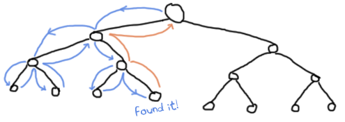

# Errors and Exceptions

## [Not so fast!]


!【一个骑着自行车、头大体小的绿男人】(。。/静态/img/骑自行车者。png“我不知道我为什么画这个”）

There's no right place for a chapter like this one. By now, you've learned enough that you're probably running into errors, but not yet enough to know how to handle them. In fact we won't be able to see all the error-handling mechanisms within this chapter. That's a bit because Erlang has two main paradigms: functional and concurrent. The functional subset is the one I've been explaining since the beginning of the book: referential transparency, recursion, higher order functions, etc. The concurrent subset is the one that makes Erlang famous: actors, thousands and thousands of concurrent processes, supervision trees, etc.
没有合适的地方写这样一章。到目前为止，你已经学到了足够多的知识，你可能会遇到错误，但还不足以知道如何处理它们。事实上，我们无法在本章中看到所有的错误处理机制。这是因为Erlang有两种主要的模式：函数模式和并发模式。函数子集是我从书一开始就解释的：引用透明、递归、高阶函数等等。并发子集使Erlang出名：参与者、成千上万的并发进程、监督树等等。

Because I judge the functional part essential to know before moving on to the concurrent part, I'll only cover the functional subset of the language in this chapter. If we are to manage errors, we must first understand them.
因为在继续讨论并发部分之前，我判断了需要了解的功能部分，所以在本章中，我将只讨论语言的功能子集。如果我们要管理错误，我们必须首先理解它们。

::: note
**Note:** Although Erlang includes a few ways to handle errors in functional code, most of the time you'll be told to just let it crash. I hinted at this in the [Introduction](introduction.html#what-is-erlang). The mechanisms that let you program this way are in the concurrent part of the language.
**注意：*尽管Erlang包含了一些处理函数代码错误的方法，但大多数时候你会被告知让它崩溃。我在[导言]（导言）中暗示了这一点。html#什么是erlang）。允许您以这种方式编程的机制位于语言的并发部分。
:::

## [A Compilation of Errors]

There are many kinds of errors: compile-time errors, logical errors, run-time errors and generated errors. I'll focus on compile-time errors in this section and go through the others in the next sections.
错误有很多种：编译时错误、逻辑错误、运行时错误和生成的错误。我将在本节中重点介绍编译时错误，并在接下来的几节中介绍其他错误。

Compile-time errors are often syntactic mistakes: check your function names, the tokens in the language (brackets, parentheses, periods, commas), the arity of your functions, etc. Here's a list of some of the common compile-time error messages and potential resolutions in case you encounter them:
编译时错误通常是语法错误：检查函数名、语言中的标记（括号、括号、句点、逗号）、函数的算术性等。下面列出了一些常见的编译时错误消息，以及在遇到它们时可能的解决方法：

module.beam: Module name 'madule' does not match file name 'module'
:   The module name you've entered in the `-module` attribute doesn't match the filename.

./module.erl:2: Warning: function some_function/0 is unused
:   You have not exported a function, or the place where it's used has the wrong name or arity. It's also possible that you've written a function that is no longer needed. Check your code!
：您尚未导出函数，或者使用函数的位置的名称或算术错误。也有可能您编写了一个不再需要的函数。检查你的代码！

./module.erl:2: function some_function/1 undefined
:   The function does not exist. You've written the wrong name or arity either in the `-export` attribute or when declaring the function. This error is also output when the given function could not be compiled, usually because of a syntax error like forgetting to end a function with a period.
：该函数不存在。您在`-export`属性或声明函数时写入了错误的名称或算术。当给定函数无法编译时，也会输出此错误，通常是因为语法错误，例如忘记用句点结束函数。

./module.erl:5: syntax error before: 'SomeCharacterOrWord'
:   This happens for a variety of reason, namely unclosed parentheses, tuples or wrong expression termination (like closing the last branch of a `case` with a comma). Other reasons might include the use of a reserved atom in your code or unicode characters getting weirdly converted between different encodings (I've seen it happen!)
：发生这种情况的原因多种多样，即未闭合的括号、元组或错误的表达式终止（如用逗号闭合“case”的最后一个分支）。其他原因可能包括在代码中使用保留的atom，或者unicode字符在不同编码之间进行奇怪的转换（我见过这种情况！）

./module.erl:5: syntax error before:
:   All right, that one is certainly not as descriptive! This usually comes up when your line termination is not correct. This is a specific case of the previous error, so just keep an eye out.
：好吧，那肯定不是那么有描述性的！当您的线路终端不正确时，通常会出现这种情况。这是之前错误的一个具体例子，所以请注意。

./module.erl:5: Warning: this expression will fail with a 'badarith' exception
:   Erlang is all about dynamic typing, but remember that the types are strong. In this case, the compiler is smart enough to find that one of your arithmetic expressions will fail (say, `llama + 5`). It won't find type errors much more complex than that, though.
：Erlang是关于动态类型的，但请记住类型是强大的。在这种情况下，编译器足够聪明，可以发现其中一个算术表达式将失败（例如，'llama+5'）。不过，它不会发现比这更复杂的类型错误。

./module.erl:5: Warning: variable 'Var' is unused
:   You declared a variable and never use it afterwards. This might be a bug with your code, so double-check what you have written. Otherwise, you might want to switch the variable name to `_` or just prefix it with an underscore (something like `_Var`) if you feel the name helps make the code readable.
：您声明了一个变量，以后再也不用它了。这可能是您的代码中的一个错误，所以请仔细检查您编写的代码。否则，如果您觉得变量名有助于代码的可读性，您可能希望将变量名切换为``，或者在其前面加一个下划线（类似于`Var`）。

./module.erl:5: Warning: a term is constructed, but never used
:   In one of your functions, you're doing something such as building a list, declaring a tuple or an anonymous function without ever binding it to a variable or returning it. This warning tells you you're doing something useless or that you have made some mistake.
：在你的一个函数中，你正在做一些事情，比如建立一个列表，声明一个元组或一个匿名函数，而从来没有将它绑定到一个变量或返回它。这个警告告诉你你正在做一些无用的事情，或者你犯了一些错误。

./module.erl:5: head mismatch
:   It's possible your function has more than one head, and each of them has a different arity. Don't forget that different arity means different functions, and you can't interleave function declarations that way. This error is also raised when you insert a function definition between the head clauses of another function.
：你的函数可能不止一个头，而且每一个头都有不同的算术。别忘了不同的算术意味着不同的函数，你不能以这种方式交错函数声明。在另一个函数的head子句之间插入函数定义时，也会出现此错误。

./module.erl:5: Warning: this clause cannot match because a previous clause at line 4 always matches
:   A function defined in the module has a specific clause defined after a catch-all one. As such, the compiler can warn you that you'll never even need to go to the other branch.
：模块中定义的函数在catch all one之后定义了一个特定子句。因此，编译器可以警告您，您甚至不需要转到另一个分支。

./module.erl:9: variable 'A' unsafe in 'case' (line 5)
:   You're using a variable declared within one of the branches of a `case ... of` outside of it. This is considered unsafe. If you want to use such variables, you'd be better of doing `MyVar = case ... of`\...
：您正在使用一个在` case'的一个分支中声明的变量。。。在它之外。这被认为是不安全的。如果你想使用这样的变量，最好使用'MyVar=case。。。关于`\。。。

This should cover most errors you get at compile-time at this point. There aren't too many and most of the time the hardest part is finding which error caused a huge cascade of errors listed against other functions.
这应该涵盖编译时出现的大多数错误。没有太多的错误，大多数时候，最困难的部分是找出哪个错误导致了针对其他函数列出的大量错误。
It is better to resolve compiler errors in the order they were reported to avoid being misled by errors which may not actually be errors at all. Other kinds of errors sometimes appear and if you've got one I haven't included, send me an email and I'll add it along with an explanation as soon as possible.
最好按照报告的顺序解决编译器错误，以避免被错误误导，这些错误可能根本不是错误。有时会出现其他类型的错误，如果你有一个我没有包括在内的错误，请给我发一封电子邮件，我会尽快添加它并解释。

## [No, YOUR logic is wrong!]


, etc. Testing your code is likely your best defense. Sadly, there are enough of these kinds of errors in every programmer's career to write a few dozen books about so I'll avoid spending too much time here. It's easier to focus on those that make your programs crash, because it happens right there and won't bubble up 50 levels from now. Note that this is pretty much the origin of the 'let it crash' ideal I mentioned a few times already.
说到这一点，你很可能只能靠自己，但Erlang有很多设施可以帮助你，包括测试框架、打字机和透析器（如[types]一章中所述）（类型或缺乏）。html#适用于瘾君子），等等。测试代码可能是你最好的防御。可悲的是，在每个程序员的职业生涯中，这些错误已经足够多了，我可以写几十本关于它们的书，所以我将避免在这里花费太多时间。更容易把注意力集中在那些让你的程序崩溃的东西上，因为它就发生在那里，而且从现在起不会上升到50级。请注意，这几乎就是我已经提到过几次的“让它崩溃”理想的起源。

## [Run-time Errors]

Run-time errors are pretty destructive in the sense that they crash your code. While Erlang has ways to deal with them, recognizing these errors is always helpful. As such, I've made a little list of common run-time errors with an explanation and example code that could generate them.
运行时错误是相当具有破坏性的，因为它们会使代码崩溃。虽然Erlang有办法处理这些错误，但认识到这些错误总是有帮助的。因此，我列出了一些常见的运行时错误，并给出了解释和可能产生这些错误的示例代码。

function_clause

:   ```eshell
    1> lists:sort([3,2,1]). 
    [1,2,3]
    2> lists:sort(fffffff). 
    ** exception error: no function clause matching lists:sort(fffffff)
            
    ```

:   All the guard clauses of a function failed, or none of the function clauses' patterns matched.

case_clause

:   ```eshell
    3> case "Unexpected Value" of 
    3>    expected_value -> ok;
    3>    other_expected_value -> 'also ok'
    3> end.
    ** exception error: no case clause matching "Unexpected Value"
            
    ```

:   Looks like someone has forgotten a specific pattern in their `case`, sent in the wrong kind of data, or needed a catch-all clause!
：看起来有人忘记了“case”中的特定模式，发送了错误类型的数据，或者需要一个catch-all子句！

if_clause

:   ```eshell
    4> if 2 > 4 -> ok;
    4>    0 > 1 -> ok
    4> end.
    ** exception error: no true branch found when evaluating an if expression
            
    ```

:   This is pretty similar to `case_clause` errors: it can not find a branch that evaluates to `true`. Ensuring you consider all cases or add the catch-all `true` clause might be what you need.
：这与“case_子句”错误非常相似：它找不到计算结果为“true”的分支`。确保你考虑了所有的情况，或者添加了catch all'true'子句，这可能是你所需要的。

badmatch

:   ```eshell
    5> [X,Y] = .
    ** exception error: no match of right hand side value 
            
    ```

:   Badmatch errors happen whenever pattern matching fails. This most likely means you're trying to do impossible pattern matches (such as above), trying to bind a variable for the second time, or just anything that isn't equal on both sides of the `=` operator (which is pretty much what makes rebinding a variable fail!). Note that this error sometimes happens because the programmer believes that a variable of the form `_MyVar` is the same as `_`. Variables with an underscore are normal variables, except the compiler won't complain if they're not used. It is not possible to bind them more than once.
：当模式匹配失败时，就会发生错误匹配。这很可能意味着你正在尝试进行不可能的模式匹配（如上文所述），尝试第二次绑定变量，或者只是在“=”运算符的两侧不相等的任何操作（这几乎就是重新绑定变量失败的原因！）。请注意，这种错误有时会发生，因为程序员认为形式为“_MyVar”的变量与`_`。带下划线的变量是普通变量，除非编译器不会抱怨没有使用它们。不可能将它们绑定多次。

badarg

:   ```eshell
    6> erlang:binary_to_list("heh, already a list").
    ** exception error: bad argument
         in function  binary_to_list/1
            called as binary_to_list("heh, already a list")
            
    ```

:   This one is really similar to `function_clause` as it's about calling functions with incorrect arguments. The main difference here is that this error is usually triggered by the programmer after validating the arguments from within the function, outside of the guard clauses. I'll show how to throw such errors later in this chapter.
：这个与“function_子句”非常相似，因为它是关于用错误的参数调用函数的。这里的主要区别是，这个错误通常是由程序员在验证函数内部的参数后触发的，而不是由guard子句触发的。我将在本章后面介绍如何抛出此类错误。

undef

:   ```eshell
    7> lists:random([1,2,3]).
    ** exception error: undefined function lists:random/1
            
    ```

:   This happens when you call a function that doesn't exist. Make sure the function is exported from the module with the right arity (if you're calling it from outside the module) and double check that you did type the name of the function and the name of the module correctly. Another reason to get the message is when the module is not in Erlang's search path. By default, Erlang's search path is set to be in the current directory. You can add paths by using `code:add_patha/1` or `code:add_pathz/1`. If this still doesn't work, make sure you compiled the module to begin with!
：调用不存在的函数时会发生这种情况。确保函数以正确的arity从模块导出（如果您是从模块外部调用它），并再次检查您是否正确键入了函数名和模块名。获取消息的另一个原因是模块不在Erlang的搜索路径中。默认情况下，Erlang的搜索路径设置为当前目录。可以使用“code:add_patha/1”或“code:add_pathz/1”添加路径`。如果这仍然不起作用，请确保首先编译了模块！

badarith

:   ```eshell
    8> 5 + llama.
    ** exception error: bad argument in an arithmetic expression
         in operator  +/2
            called as 5 + llama
            
    ```

:   This happens when you try to do arithmetic that doesn't exist, like divisions by zero or between atoms and numbers.
：当你尝试做一些不存在的算术时就会发生这种情况，比如用零除法或原子与数字之间的除法。

badfun

:   ```eshell
    9> hhfuns:add(one,two).
    ** exception error: bad function one
    in function  hhfuns:add/2
            
    ```

:   The most frequent reason why this error occurs is when you use variables as functions, but the variable's value is not a function. In the example above, I'm using the `hhfuns` function from the [previous chapter](higher-order-functions.html) and using two atoms as functions. This doesn't work and `badfun` is thrown.
：发生此错误的最常见原因是当您使用变量作为函数，但变量的值不是函数时。在上面的例子中，我使用的是[上一章]（高阶函数）中的'hhfuns'函数。使用两个原子作为函数。这不起作用，会抛出“badfun”。

badarity

:   ```eshell
    10> F = fun(_) -> ok end.
    #Fun<erl_eval.6.13229925>
    11> F(a,b).
    ** exception error: interpreted function with arity 1 called with two arguments
            
    ```

:   The `badarity` error is a specific case of `badfun`: it happens when you use higher order functions, but you pass them more (or fewer) arguments than they can handle.
：badarity错误是badfun的一种特殊情况：当使用高阶函数时，会发生这种情况，但传递的参数比它们能处理的要多（或少）。

system_limit
:   There are many reasons why a `system_limit` error can be thrown: too many processes (we'll get there), atoms that are too long, too many arguments in a function, number of atoms too large, too many nodes connected, etc. To get a full list in details, read the [Erlang Efficiency Guide](http://www.erlang.org/doc/efficiency_guide/advanced.html#id2265856) on system limits. Note that some of these errors are serious enough to crash the whole VM.
：抛出“system_limit”错误的原因有很多：进程太多（我们会做到的）、原子太长、函数中的参数太多、原子数太大、连接的节点太多等等。要获得完整的详细列表，请阅读[Erlang效率指南](http://www。二郎。组织/文件/效率指南/高级。关于系统限制的html#id2265856）。请注意，其中一些错误严重到足以使整个VM崩溃。

## [Raising Exceptions]


In trying to monitor the execution of code and protect against logical errors, it's often a good idea to provoke run-time crashes so problems will be spotted early.
在试图监控代码的执行并防止逻辑错误时，引发运行时崩溃通常是个好主意，这样问题就可以及早发现。

There are three kinds of exceptions in Erlang: *errors*, *throws* and *exits*. They all have different uses (kind of):
Erlang中有三种异常：*错误*、*抛出*和*退出*。它们都有不同的用途（某种程度上）：

### Errors

Calling `erlang:error(Reason)` will end the execution in the current process and include a stack trace of the last functions called with their arguments when you catch it. These are the kind of exceptions that provoke the run-time errors above.
调用`erlang:error（Reason）`将结束当前进程中的执行，并在捕获时包含最后调用的函数及其参数的堆栈跟踪。这些异常会引发上述运行时错误。

Errors are the means for a function to stop its execution when you can't expect the calling code to handle what just happened. If you get an `if_clause` error, what can you do? Change the code and recompile, that's what you can do (other than just displaying a pretty error message). An example of when not to use errors could be our tree module from the [recursion chapter](recursion.html#more-than-lists "More than lists")` or an atom like `undefined` rather than raising errors.
错误是当调用代码无法处理刚刚发生的事情时，函数停止执行的手段。如果出现“If_子句”错误，你能做什么？更改代码并重新编译，这是您可以做的（而不仅仅是显示一条漂亮的错误消息）。什么时候不使用错误的一个例子是[recursion chapter]（递归）中的树模块。html#多于列表“多于列表”）`或类似原子的“未定义”，而不是引发错误。

Now, errors aren't limited to the examples above. You can define your own kind of errors too:

```eshell
1> erlang:error(badarith).
** exception error: bad argument in an arithmetic expression
2> erlang:error(custom_error).
** exception error: custom_error
```

Here, `custom_error` is not recognized by the Erlang shell and it has no custom translation such as \"bad argument in \...\", but it's usable in the same way and can be handled by the programmer in an identical manner (we'll see how to do that soon).
在这里，`custom_error`不被Erlang shell识别，并且它没有自定义的翻译，例如中的\“bad argument”\。。。\“，但它的可用性是相同的，程序员可以以相同的方式处理它（我们很快就会看到如何做到这一点）。

### Exits

There are two kinds of exits: 'internal' exits and 'external' exits. Internal exits are triggered by calling the function `exit/1` and make the current process stop its execution. External exits are called with `exit/2` and have to do with multiple processes in the concurrent aspect of Erlang; as such, we'll mainly focus on internal exits and will visit the external kind later on.
出口有两种：“内部”出口和“外部”出口。通过调用函数“exit/1”触发内部退出，并使当前进程停止执行。外部出口用'exit/2'调用，与Erlang并发方面的多个进程有关；因此，我们将主要关注内部出口，稍后将访问外部出口。

Internal exits are pretty similar to errors. In fact, historically speaking, they were the same and only `exit/1` existed. They've got roughly the same use cases. So how to choose one? Well the choice is not obvious. To understand when to use one or the other, there's no choice but to start looking at the concepts of actors and processes from far away.
内部退出与错误非常相似。事实上，从历史上讲，它们是相同的，只有“退出/1”存在。它们拥有大致相同的用例。那么如何选择呢？这个选择并不明显。为了理解何时使用其中一种，我们别无选择，只能从远处开始研究参与者和过程的概念。

In the introduction, I've compared processes as people communicating by mail. There's not a lot to add to the analogy, so I'll go to diagrams and bubbles.
在引言中，我比较了人们通过邮件交流的过程。这个类比没有太多的补充，所以我将讨论图表和气泡。


![由圆圈表示的进程“A”，向进程“B”（另一个圆圈）发送消息（由箭头表示）](。。/静态/img/a-b-msg。png“哇！”）

Processes here can send each other messages. A process can also listen for messages, wait for them. You can also choose what messages to listen to, discard some, ignore others, give up listening after a certain time etc.
这里的进程可以相互发送消息。进程也可以监听消息，等待它们。你也可以选择要听的信息，放弃一些，忽略其他，在一段时间后放弃听等等。


![进程A向进程B发送“你好”，进程B将消息C转换为“A说你好！”](。。/静态/img/a-b-c-hello。png“B是这里的第三个轮子”）

These basic concepts let the implementors of Erlang use a special kind of message to communicate exceptions between processes. They act a bit like a process' last breath; they're sent right before a process dies and the code it contains stops executing. Other processes that were listening for that specific kind of message can then know about the event and do whatever they please with it. This includes logging, restarting the process that died, etc.
这些基本概念允许Erlang的实现者使用一种特殊的消息在进程之间传递异常。它们的行为有点像一个过程“最后一口气”；它们在一个进程死亡和它包含的代码停止执行之前被发送。其他监听这种特定消息的进程可以知道事件的情况，并随心所欲地处理它。这包括记录日志、重新启动已停止的进程等。


![一个死进程（一个破裂的泡沫）将“我死了”发送到一个进程“B”](。。/静态/img/a-b-dead。（巴布亚新几内亚）

With this concept explained, the difference in using `erlang:error/1` and `exit/1` is easier to understand. While both can be used in an extremely similar manner, the real difference is in the intent. You can then decide whether what you've got is 'simply' an error or a condition worthy of killing the current process. This point is made stronger by the fact that `erlang:error/1` returns a stack trace and `exit/1` doesn't. If you were to have a pretty large stack trace or lots of arguments to the current function, copying the exit message to every listening process would mean copying the data. In some cases, this could become unpractical.
解释了这个概念后，使用“erlang:error/1”和“exit/1”的区别就更容易理解了。虽然两者可以以极其相似的方式使用，但真正的区别在于意图。然后，你可以决定你得到的是一个“简单的”错误，还是一个值得终止当前进程的条件。“erlang:error/1”返回堆栈跟踪，而“exit/1”不返回，这一点更加突出了。如果当前函数有相当大的堆栈跟踪或大量参数，那么将退出消息复制到每个侦听进程将意味着复制数据。在某些情况下，这可能变得不切实际。

### Throws

A throw is a class of exceptions used for cases that the programmer can be expected to handle. In comparison with exits and errors, they don't really carry any 'crash that process!' intent behind them, but rather control flow. As you use throws while expecting the programmer to handle them, it's usually a good idea to document their use within a module using them.
throw是一类异常，用于程序员可以处理的情况。与退出和错误相比，它们并没有真正带来任何“进程崩溃！”他们背后的意图，而是控制流动。当您在使用throws的同时希望程序员处理它们时，通常最好在使用throws的模块中记录它们的使用。

The syntax to throw an exception is:

```eshell
1> throw(permission_denied).
** exception throw: permission_denied
```

Where you can replace `permission_denied` by anything you want (including `'everything is fine'`, but that is not helpful and you will lose friends).
在这里，你可以用你想要的任何东西（包括“一切都很好”，但这并没有帮助，你会失去朋友）来代替“被拒绝的许可”。

Throws can also be used for non-local returns when in deep recursion. An example of that is the `ssl` module which uses `throw/1` as a way to push `` tuples back to a top-level function. This function then simply returns that tuple to the user. This lets the implementer only write for the successful cases and have one function deal with the exceptions on top of it all.
在深度递归中，抛出也可用于非局部返回。其中一个例子是“ssl”模块，它使用“throw/1”作为将“tuple”推回顶级函数的方法。然后，该函数将该元组简单地返回给用户。这让实现者只为成功的案例编写代码，并让一个函数处理所有异常。

Another example could be the array module, where there is a lookup function that can return a user-supplied default value if it can't find the element needed. When the element can't be found, the value `default` is thrown as an exception, and the top-level function handles that and substitutes it with the user-supplied default value. This keeps the programmer of the module from needing to pass the default value as a parameter of every function of the lookup algorithm, again focusing only on the successful cases.
另一个例子是数组模块，其中有一个查找函数，如果找不到所需的元素，它可以返回用户提供的默认值。当找不到元素时，值'default'作为异常抛出，顶级函数处理该值并用用户提供的默认值替换它。这使得模块的程序员不需要将默认值作为查找算法的每个函数的参数传递，再次只关注成功的案例。


As a rule of thumb, try to limit the use of your throws for non-local returns to a single module in order to make it easier to debug your code. It will also let you change the innards of your module without requiring changes in its interface.
根据经验，尝试将非本地返回的抛出限制为单个模块，以便更容易调试代码。它还允许您更改模块的内部结构，而无需更改其界面。

## [Dealing with Exceptions]

I've already mentioned quite a few times that throws, errors and exits can be handled. The way to do this is by using a `try ... catch` expression.
我已经多次提到可以处理抛出、错误和退出。这样做的方法是使用“try”。。。捕捉表情。

A `try ... catch` is a way to evaluate an expression while letting you handle the successful case as well as the errors encountered. The general syntax for such an expression is:
试试看。。。catch`是一种计算表达式的方法，同时允许您处理成功的案例和遇到的错误。此类表达式的一般语法为：

```erl
try Expression of
    SuccessfulPattern1 [Guards] ->
        Expression1;
    SuccessfulPattern2 [Guards] ->
        Expression2
catch
    TypeOfError:ExceptionPattern1 ->
        Expression3;
    TypeOfError:ExceptionPattern2 ->
        Expression4
end.
```

The `Expression` by either `error`, `throw` or `exit`, for each respective type we've seen in this chapter. If no type is provided, a `throw` is assumed. So let's put this in practice.
对于我们在本章中看到的每种类型，“表达式”都可以通过“error”、“throw”或“exit”来表示。如果没有提供类型，则假定为“throw”。让我们把它付诸实践。

First of all, let's start a module named `exceptions`. We're going for simple here:

```erl
-module(exceptions).
-compile(export_all).

throws(F) ->
    try F() of
        _ -> ok
    catch
        Throw -> 
    end.
```

We can compile it and try it with different kinds of exceptions:

```eshell
1> c(exceptions).

2> exceptions:throws(fun() -> throw(thrown) end).

3> exceptions:throws(fun() -> erlang:error(pang) end).
** exception error: pang
```

As you can see, this `try ... catch` is only receiving throws. As stated earlier, this is because when no type is mentioned, a throw is assumed. Then we have functions with catch clauses of each type:
正如你所看到的，这个“试试看”。。。接球只是接发球。如前所述，这是因为当没有提到类型时，会假定抛出。然后我们有各种类型的带有catch子句的函数：

```erl
errors(F) ->
    try F() of
        _ -> ok
    catch
        error:Error -> 
    end.

exits(F) ->
    try F() of
        _ -> ok
    catch
        exit:Exit -> 
    end.
```

And to try them:

```eshell
4> c(exceptions).

5> exceptions:errors(fun() -> erlang:error("Die!") end).

6> exceptions:exits(fun() -> exit(goodbye) end).

```

The next example on the menu shows how to combine all the types of exceptions in a single `try ... catch`. We'll first declare a function to generate all the exceptions we need:
菜单上的下一个示例显示了如何在一次“尝试”中组合所有类型的异常。。。接住`。我们将首先声明一个函数来生成我们需要的所有异常：

```erl
sword(1) -> throw(slice);
sword(2) -> erlang:error(cut_arm);
sword(3) -> exit(cut_leg);
sword(4) -> throw(punch);
sword(5) -> exit(cross_bridge).

black_knight(Attack) when is_function(Attack, 0) ->
    try Attack() of
        _ -> "None shall pass."
    catch
        throw:slice -> "It is but a scratch.";
        error:cut_arm -> "I've had worse.";
        exit:cut_leg -> "Come on you pansy!";
        _:_ -> "Just a flesh wound."
    end.
```

Here `is_function/2` is a BIF which makes sure the variable `Attack` is a function of arity 0. Then we add this one for good measure:
这里的'is_function/2'是一个BIF，它确保变量'Attack'是一个arity 0的函数。对于这一点，我们加上：

```erl
talk() -> "blah blah".
```

And now for something completely different:

```eshell
7> c(exceptions).

8> exceptions:talk().
"blah blah"
9> exceptions:black_knight(fun exceptions:talk/0).
"None shall pass."
10> exceptions:black_knight(fun() -> exceptions:sword(1) end).
"It is but a scratch."
11> exceptions:black_knight(fun() -> exceptions:sword(2) end).
"I've had worse."
12> exceptions:black_knight(fun() -> exceptions:sword(3) end).
"Come on you pansy!"
13> exceptions:black_knight(fun() -> exceptions:sword(4) end).
"Just a flesh wound."
14> exceptions:black_knight(fun() -> exceptions:sword(5) end).
"Just a flesh wound."
```


The expression on line 9 demonstrates normal behavior for the black knight, when function execution happens normally. Each line that follows that one demonstrates pattern matching on exceptions according to their class (throw, error, exit) and the reason associated with them (`slice`, `cut_arm`, `cut_leg`).
第9行的表达式演示了当函数正常执行时，黑骑士的正常行为。接下来的每一行都根据异常的类别（抛出、错误、退出）和与异常相关的原因（slice、cut_arm、cut_leg）演示了异常的模式匹配。

One thing shown here on expressions 13 and 14 is a catch-all clause for exceptions. The `_:_` pattern is what you need to use to make sure to catch any exception of any type. In practice, you should be careful when using the catch-all patterns: try to protect your code from what you can handle, but not any more than that. Erlang has other facilities in place to take care of the rest.
这里在表达式13和14中显示的一件事是一个catch all子句，用于异常。“\：\”模式是确保捕获任何类型的异常所需的。在实践中，在使用catch-all模式时应该小心：尽量保护代码不受您能处理的内容的影响，但不能超过这一点。其他设施由Erlang负责。

There's also an additional clause that can be added after a `try ... catch` that will always be executed. This is equivalent to the 'finally' block in many other languages:
还有一个附加条款可以在“try”之后添加。。。这将永远被执行。这相当于许多其他语言中的“finally”块：

```erl
try Expr of
    Pattern -> Expr1
catch
    Type:Exception -> Expr2
after % this always gets executed
    Expr3
end
```

No matter if there are errors or not, the expressions inside the `after` part are guaranteed to run. However, you can not get any return value out of the `after` construct. Therefore, `after` is mostly used to run code with side effects. The canonical use of this is when you want to make sure a file you were reading gets closed whether exceptions are raised or not.
不管是否有错误，`after`部分中的表达式都保证运行。但是，不能从'after'构造中获取任何返回值。因此，“after”主要用于运行有副作用的代码。这种方法的规范用法是，无论是否引发异常，都要确保正在读取的文件被关闭。

We now know how to handle the 3 classes of exceptions in Erlang with catch blocks. However, I've hidden information from you: it's actually possible to have more than one expression between the `try` and the `of`!
现在我们知道了如何使用catch块处理Erlang中的3类异常。然而，我向你隐瞒了一些信息：在“try”和“of”之间实际上可能有不止一个表达式！

```erl
whoa() ->
    try
        talk(),
        _Knight = "None shall Pass!",
        _Doubles = [N*2 || N <- lists:seq(1,100)],
        throw(up),
        _WillReturnThis = tequila
    of
        tequila -> "hey this worked!"
    catch
        Exception:Reason -> 
    end.
```

By calling `exceptions:whoa()`, we'll get the obvious ``, because of `throw(up)`. So yeah, it's possible to have more than one expression between `try` and `of`\...
通过调用“exceptions:whoa（）”，我们将得到明显的“`”，因为“throw（up）`。所以是的，在“try”和“of”之间可能有不止一个表达式`\。。。

What I just highlighted in `exceptions:whoa/0` and that you might have not noticed is that when we use many expressions in that manner, we might not always care about what the return value is. The `of` part thus becomes a bit useless. Well good news, you can just give it up:
我刚才在“exceptions:whoa/0”中强调的是，您可能没有注意到，当我们以这种方式使用许多表达式时，我们可能并不总是关心返回值是什么。“of”部分因此变得有点无用。好消息，你可以放弃：

```erl
im_impressed() ->
    try
        talk(),
        _Knight = "None shall Pass!",
        _Doubles = [N*2 || N <- lists:seq(1,100)],
        throw(up),
        _WillReturnThis = tequila
    catch
        Exception:Reason -> 
    end.
```

And now it's a bit leaner!

::: note
**Note:** It is important to know that the protected part of an exception can't be tail recursive. The VM must always keep a reference there in case there's an exception popping up.
**注意：*重要的是要知道异常的受保护部分不能是尾部递归的。虚拟机必须始终保留一个引用，以防出现异常。

Because the `try ... catch` construct without the `of` part has nothing but a protected part, calling a recursive function from there might be dangerous for programs supposed to run for a long time (which is Erlang's niche). After enough iterations, you'll go out of memory or your program will get slower without really knowing why. By putting your recursive calls between the `of` and `catch`, you are not in a protected part and you will benefit from Last Call Optimisation.
因为“试试看”。。。catch`construct没有`of`部分，它只有一个受保护的部分，从那里调用递归函数可能会对本应长期运行的程序（这是Erlang的小生境）造成危险。在足够多的迭代之后，你的内存会耗尽，或者你的程序会变得更慢，而不知道为什么。通过将递归调用放在“of”和“catch”之间，您就不在受保护的部分，您将从上次调用优化中受益。

Some people use `try ... of ... catch` rather than `try ... catch` by default to avoid unexpected errors of that kind, except for obviously non-recursive code with results that won't be used by anything. You're most likely able to make your own decision on what to do!
有些人用try。。。属于。。。抓住而不是尝试。。。catch`默认情况下可以避免这类意外错误，除非是明显的非递归代码，其结果不会被任何东西使用。你很有可能自己决定做什么！
:::

## [Wait, there's more!]

As if it wasn't enough to be on par with most languages already, Erlang's got yet another error handling structure. That structure is defined as the keyword `catch` and basically captures all types of exceptions on top of the good results. It's a bit of a weird one because it displays a different representation of exceptions:
似乎这还不足以与大多数语言媲美，Erlang还有另一种错误处理结构。该结构被定义为关键字'catch'，基本上在良好结果的基础上捕获所有类型的异常。这有点奇怪，因为它显示了不同的异常表示：

```eshell
1> catch throw(whoa).
whoa
2> catch exit(die).

3> catch 1/0.
,
                   ,
                   ,
                   ,
                   ,
                   
4> catch 2+2.
4
```

What we can see from this is that throws remain the same, but that exits and errors are both represented as ``. That's due to errors being bolted to the language after exits (they kept a similar representation for backwards compatibility).
我们可以从中看到，抛出保持不变，但退出和错误都表示为``。这是因为退出后错误被固定到语言上（为了向后兼容，他们保留了类似的表示）。

The way to read this stack trace is as follows:

```eshell
5> catch doesnt:exist(a,4).              
,
                ,
                ,
                ,
                ,
                
```

-   The type of error is `undef`, which means the function you called is not defined (see the list at the beginning of this chapter)
-错误类型为“unde”，这意味着您调用的函数未定义（请参阅本章开头的列表）
-   The list right after the type of error is a stack trace
-   The tuple on top of the stack trace represents the last function to be called (``). That's your undefined function.
-堆栈跟踪顶部的元组表示要调用的最后一个函数（``）。这就是你未定义的函数。
-   The tuples after that are the functions called before the error. This time they're of the form ``.
-之后的元组是错误之前调用的函数。这一次，他们的形式``。
-   That's all there is to it, really.

You can also manually get a stack trace by calling `erlang:get_stacktrace/0` in the process that crashed.
也可以在崩溃的进程中通过调用`erlang:get_stacktrace/0`手动获取堆栈跟踪。

You'll often see `catch` written in the following manner (we're still in [exceptions.erl](static/erlang/exceptions.erl.html)):
你经常会看到“catch”是用下面的方式写的（我们仍然在[例外情况]）。erl]（静态/erlang/exceptions。呃。html）：

```erl
catcher(X,Y) ->
    case catch X/Y of
         -> "uh oh";
        N -> N
    end.
```

And as expected:

```eshell
6> c(exceptions).

7> exceptions:catcher(3,3).
1.0
8> exceptions:catcher(6,3).
2.0
9> exceptions:catcher(6,0).
"uh oh"
```

This sounds compact and easy to catch exceptions, but there are a few problems with `catch`. The first of it is operator precedence:
这听起来很紧凑，也很容易捕获异常，但是“catch”有一些问题`。第一个是运算符优先级：

```eshell
10> X = catch 4+2.
* 1: syntax error before: 'catch'
10> X = (catch 4+2).
6
```

That's not exactly intuitive given that most expressions do not need to be wrapped in parentheses this way. Another problem with `catch` is that you can't see the difference between what looks like the underlying representation of an exception and a real exception:
考虑到大多数表达式不需要以这种方式包装在括号中，这并不完全是直观的。“catch”的另一个问题是，您看不到异常的底层表示形式与真实异常之间的区别：

```eshell
11> catch erlang:boat().
,
                ,
                ,
                ,
                ,
                
12> catch exit(). 
,
                ,
                ,
                ,
                ,
                
```

And you can't know the difference between an error and an actual exit. You could also have used `throw/1` to generate the above exception. In fact, a `throw/1` in a `catch` might also be problematic in another scenario:
你无法知道错误和实际退出之间的区别。您还可以使用'throw/1'生成上述异常。事实上，“catch”中的“throw/1”在另一种情况下也可能有问题：

```erl
one_or_two(1) -> return;
one_or_two(2) -> throw(return).
```

And now the killer problem:

```eshell
13> c(exceptions).

14> catch exceptions:one_or_two(1).
return
15> catch exceptions:one_or_two(2).
return
```

Because we're behind a `catch`, we can never know if the function threw an exception or if it returned an actual value! This might not really happen a whole lot in practice, but it's still a wart big enough to have warranted the addition of the `try ... catch` construct in the R10B release.
因为我们在“catch”后面，所以我们永远无法知道函数是否抛出了异常，或者它是否返回了实际值！这在实践中可能不会经常发生，但它仍然是一个足够大的疣子，需要添加“try”。。。R10B版本中的catch`construct。

## [Try a try in a tree]

To put exceptions in practice, we'll do a little exercise requiring us to dig for our `tree` module. We're going to add a function that lets us do a lookup in the tree to find out whether a value is already present in there or not. Because the tree is ordered by its keys and in this case we do not care about the keys, we'll need to traverse the whole thing until we find the value.
为了将异常付诸实践，我们将做一个小练习，要求我们挖掘“树”模块。我们将添加一个函数，让我们在树中进行查找，以确定其中是否已经存在值。因为树是按键排序的，在这种情况下，我们不关心键，我们需要遍历整个过程，直到找到值为止。

The traversal of the tree will be roughly similar to what we did in `tree:lookup/2`, except this time we will always search down both the left branch and the right branch. To write the function, you'll just need to remember that a tree node is either `` when empty. With this in hand, we can write a basic implementation without exceptions:
树的遍历大致与我们在“tree:lookup/2”中所做的相似，只是这次我们将始终向下搜索左分支和右分支。要编写函数，只需记住树节点为空时为``。有了它，我们就可以毫无例外地编写一个基本实现：

```erl
%% looks for a given value 'Val' in the tree.
has_value(_, ) ->
    false;
has_value(Val, ) ->
    true;
has_value(Val, ) ->
    case has_value(Val, Left) of
        true -> true;
        false -> has_value(Val, Right)
    end.
```

The problem with this implementation is that every node of the tree we branch at has to test for the result of the previous branch:
这个实现的问题是，我们分支的树的每个节点都必须测试前一个分支的结果：


 -> 
    try has_value1(Val, Tree) of
        false -> false
    catch
        true -> true
    end.

has_value1(_, ) ->
    false;
has_value1(Val, ) ->
    throw(true);
has_value1(Val, ) ->
    has_value1(Val, Left),
    has_value1(Val, Right).
```

The execution of the code above is similar to the previous version, except that we never need to check for the return value: we don't care about it at all. In this version, only a throw means the value was found. When this happens, the tree evaluation stops and it falls back to the `catch` on top. Otherwise, the execution keeps going until the last `false` is returned and that's what the user sees:
上面代码的执行与上一个版本类似，只是我们不需要检查返回值：我们根本不关心它。在这个版本中，只有一次抛出意味着找到了该值。当这种情况发生时，树评估停止，并返回到顶部的“catch”。否则，执行会一直进行，直到返回最后一个'false'，这就是用户看到的：


![树的图表，在遍历树时，每个节点后面都有一个箭头，然后在返回的过程中跳过所有节点（由于抛出）](。。/静态/img/树掷。（巴布亚新几内亚）

Of course, the implementation above is longer than the previous one. However, it is possible to realize gains in speed and in clarity by using non-local returns with a throw, depending on the operations you're doing. The current example is a simple comparison and there's not much to see, but the practice still makes sense with more complex data structures and operations.
当然，上面的实现比上一个要长。然而，根据你所做的操作，通过使用非本地返回和抛出，可以实现速度和清晰度的提高。当前的示例只是一个简单的比较，没有太多可看的内容，但对于更复杂的数据结构和操作，这种做法仍然是有意义的。

That being said, we're probably ready to solve real problems in sequential Erlang.
