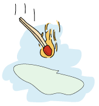
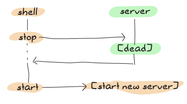

# Bears, ETS, Beets


Something we've been doing time and time again has been to implement some kind of storage device as a process. We've done fridges to store things, built `regis` to register processes, seen key/value stores, etc. If we were programmers doing object-oriented design, we would be having a bunch of singletons floating around, and special storage classes and whatnot. In fact, wrapping data structures like `dict`s and `gb_trees` in processes is a bit like that.
我们一次又一次地做的事情是将某种存储设备作为一个过程来实现。我们用冰箱来储存东西，用“regis”来注册进程，用钥匙/价值商店等等。如果我们是做面向对象设计的程序员，我们会有一堆单件，以及特殊的存储类等等。事实上，在进程中包装像'dict'和'gb_树'这样的数据结构有点像这样。

Holding data structures in a process is actually fine for a lot of cases --- whenever we actually need that data to do some task within the process, as internal state, and so on. We've had plenty of valid uses and we shouldn't change that. However, there is one case where it is possibly not the best choice: when the process holds a data structure for the sake of sharing it with other processes and little more.
在很多情况下，在流程中保存数据结构实际上是很好的——只要我们确实需要这些数据在流程中执行某些任务，比如内部状态，等等。我们有很多有效的用途，我们不应该改变这一点。然而，有一种情况下，它可能不是最佳选择：当进程持有一个数据结构，以便与其他进程共享它时，等等。

One of the applications we've written is guilty of that. Can you guess which? Of course you can; I've mentioned it at the end of last chapter: regis needs to be rewritten. It's not that it doesn't work or can't do its job well, but because it acts as a gateway to share data with potentially *a lot* of other processes, there is an architectural problem with it.
我们写的一份申请书就是这样的。你能猜出是哪个吗？当然可以；我在上一章末尾提到过：瑞吉斯需要重写。因为它的工作和其他的流程不一样，所以它的工作也有很多潜在的问题。

See, regis is this central application to do messaging in Process Quest (and anything else that would use it), and pretty much every message going to a named process has to go through it. This means that even though we took great care to make our applications very concurrent with independent actors and made sure our supervision structure was right to scale up, all of our operations will depend on a central regis process that will need to answer messages one by one:
请看，regis是在Process Quest（以及其他任何使用它的应用程序）中执行消息传递的中心应用程序，几乎所有发送到命名进程的消息都必须经过它。这意味着，尽管我们非常小心地使我们的应用程序与独立参与者非常并行，并确保我们的监管结构能够正确地扩大规模，但我们的所有操作都将依赖于一个中央regis流程，该流程将需要逐一回复信息：


![显示6个客户端（绿色气泡），箭头指向中央regis服务器（蓝色矩形）](。。/静态/图像/中央区域。（巴布亚新几内亚）

If we have a lot of message passing going on, regis risks getting busier and busier, and if the demand is high enough our whole system will become sequential and slow. That's pretty bad.
如果我们有大量的信息传递，regis可能会变得越来越忙，如果需求足够高，我们的整个系统将变得有序而缓慢。那太糟糕了。

::: note
**Note:** we have no direct proof that regis is a bottleneck within Process Quest --- In fact, Process Quest does very little messaging compared to many other applications in the wild. If we were using regis for something that requires a lot more messaging and lookups, then the problems would be more apparent.
**注：*我们没有直接证据表明regis是Process Quest中的瓶颈——事实上，与野外的许多其他应用程序相比，Process Quest的消息传递功能非常有限。如果我们将regis用于需要更多消息和查找的事情，那么问题就会更加明显。
:::

The few ways we'd have to get around that would be to either split regis into subprocesses to make lookups faster by sharding the data, or find a way to store the data in some database that will allow for parallel and concurrent access of the data. While the first way to do it would be very interesting to explore, we'll go through an easier path by doing the latter.
我们必须绕开的几种方法是，要么将regi拆分为子进程，通过数据切分来加快查找速度，要么找到一种方法将数据存储在某个数据库中，允许并行和并发地访问数据。虽然探索第一种方法会非常有趣，但我们将通过后一种方法走一条更容易的道路。

Erlang has something called ETS (Erlang Term Storage) tables. ETS tables are an efficient in-memory database included with the Erlang virtual machine. It sits in a part of the virtual machine where destructive updates are allowed and where garbage collection dares not approach. They're generally fast, and a pretty easy way for Erlang programmers to optimize some of their code when parts of it get too slow.
Erlang有一种叫做ETS（Erlang术语存储）表的东西。ETS表是Erlang虚拟机附带的高效内存数据库。它位于虚拟机的一部分，允许进行破坏性更新，而垃圾收集则不敢进行。它们通常都很快，对于Erlang程序员来说，当部分代码变得太慢时，这是一种非常简单的优化代码的方法。

ETS tables allow limited concurrency in reads and writes (much better than none at all for a process' mailbox) in a way that could let us optimize away a lot of the pain.
ETS表允许有限的读写并发性（对于一个进程的邮箱来说，这比完全并没有要好得多），这可以让我们通过优化消除很多痛苦。

::: 
**Don't Drink Too Much Kool-Aid:**\
While ETS tables are a nice way to optimize, they should still be used with some care. By default, the VM is limited to 1400 ETS tables. While it is possible to change that number (`erl -env ERL_MAX_ETS_TABLES Number`), this default low level is a good sign that you should try to avoid having one table per process in general
虽然ETS表格是一种很好的优化方法，但在使用时仍应小心谨慎。默认情况下，VM限制为1400个ETS表。虽然可以更改该数字（`erl-env erl_MAX_ETS_TABLES number`），但这个默认的低级别是一个很好的迹象，表明您应该尽量避免每个进程都有一个表
:::

But before we rewrite regis to use ETS, we should try to understand a bit of ETS' principles beforehand.
但在我们重写regis以使用ETS之前，我们应该先了解一下ETS的原理。

## [The Concepts of ETS]

ETS tables are implemented as BIFs in the `ets` module. The main design objectives ETS had was to provide a way to store large amounts of data in Erlang with constant access time (functional data structures usually tend to flirt with logarithmic access time) and to have such storage look as if it were implemented as processes in order to keep their use simple and idiomatic.
ETS表格在“ETS”模块中作为BIF实现。ETS的主要设计目标是提供一种在Erlang中以恒定访问时间存储大量数据的方法（功能数据结构通常倾向于使用对数访问时间），并使这种存储看起来像是作为过程实现的，以保持其使用简单和习惯。

::: note
**Note:** having tables look like processes doesn't mean that you can spawn them or link to them, but that they can respect semantics of nothing-shared, wrapping calls behind functional interfaces, having them handle any native data type for Erlang, and having the possibility to give them names (in a separate registry), etc.
**注意：*让表看起来像进程并不意味着你可以生成它们或链接到它们，但它们可以尊重任何共享的语义，将调用包装在函数接口后面，让它们处理Erlang的任何本机数据类型，并有可能给它们命名（在单独的注册表中），等等。
:::

All ETS tables natively store Erlang tuples containing whatever you want, where one of the tuple elements will act as a primary key that you use to sort things. That is to say, having tuples of people of the form `` will let you have a table that looks like:
所有ETS表本机存储包含任意内容的Erlang元组，其中一个元组元素将充当主键，用于排序。也就是说，拥有“人形”的元组将使您拥有一张如下所示的表格：

```erl
,
,
,
,
,
...
```

So if we say that we want to have the table's index be the e-mail addresses, we can do this by telling ETS to set the key position to 4 (we'll see how to do this in a bit, when we get to actual ETS function calls). Once you've decided on a key, you can choose different ways to store data into tables:
因此，如果我们说希望表的索引是电子邮件地址，我们可以通过告诉ETS将键位置设置为4来实现这一点（我们将在稍后了解如何在实际的ETS函数调用时实现这一点）。一旦决定了一个键，就可以选择不同的方式将数据存储到表中：

set
:   A set table will tell you that each key instance must be unique. There can be no duplicate e-mail in the database above. Sets are great when you need to use a standard key/value store with constant time access.
：一个集合表将告诉您每个键实例必须是唯一的。上面的数据库中不能有重复的电子邮件。当您需要使用具有恒定时间访问的标准键/值存储时，集合非常有用。

ordered_set
:   There can still only be one key instance per table, but `ordered_set` adds a few other interesting properties. The first is that elements in an `ordered_set` table will be ordered (who would have thought?!). The first element of the table is the smallest one, and the last element is the largest one. If you traverse a table iteratively (jumping to the next element over and over again), the values should be increasing, which is not necessarily true of `set` tables. Ordered set tables are great when you frequently need to operate on ranges (I want entries 12 to 50 !). They will, however, have the downside of being slower in their access time (`O(log N)` where `N` is the number of objects stored).
：每个表仍然只能有一个键实例，但“ordered_set”添加了一些其他有趣的属性。第一个是“ordered_set”表中的元素将被排序（谁会想到？！）。表的第一个元素是最小的，最后一个元素是最大的。如果以迭代方式遍历一个表（一次又一次地跳到下一个元素），则值应该是递增的，这对于“set”表来说不一定是真的。当您经常需要对范围进行操作（我想要12到50个条目）时，有序的集合表非常棒。然而，它们的缺点是访问时间较慢（`O（logn）`N`是存储的对象数）。

bag
:   A bag table can have multiple entries with the same key, as long as the tuples themselves are different. This means that the table can have `` twice in the table as they would be entirely identical.
：一个bag表可以有多个具有相同键的条目，只要元组本身不同。这意味着这个表中可以有两个“`”，因为它们完全相同。

duplicate_bag
:   The tables of this type work like `bag` tables, with the exception that they do allow entirely identical tuples to be held multiple time within the same table.
：这种类型的表与“bag”表类似，只是它们允许在同一个表中多次保存完全相同的元组。

::: note
**Note:** ordered_set tables will see the values 1 and 1.0 as identical for all operations. Other tables will see them as different.
**注：*有序集合表将显示值1和1。0表示所有操作都相同。其他表格则会将其视为不同。
:::

The last general concept to learn about is that ETS tables will have the concept of a controlling process, much like sockets do. When a process calls a function that starts a new ETS table, that process is the owner of the table.
要了解的最后一个一般概念是，ETS表将具有控制过程的概念，就像套接字一样。当进程调用启动新ETS表的函数时，该进程是表的所有者。

By default, only the owner of the table can write to it, but everyone can read from it. This is known as the *protected* level of permissions. You can also choose to set the permissions to *public*, where everyone can read and write, or *private*, where only the owner can read or write.
默认情况下，只有表的所有者可以对其进行写入，但每个人都可以从中读取。这就是所谓的“受保护”权限级别。您还可以选择将权限设置为*public*（每个人都可以读写）或*private*（只有所有者可以读写）。


The concept of table ownership goes a bit further. The ETS table is intimately linked to the process. If the process dies, the table disappears (and so does all of its content). However, the table can be given away, much like we did with sockets and their controlling processes, or a heir can be determined so that if the owner process dies, the table is automatically given away to the heir process.
表所有权的概念更进一步。ETS表格与流程密切相关。如果进程终止，表将消失（其所有内容也将消失）。然而，表可以被送出，就像我们对套接字及其控制进程所做的那样，或者可以确定继承人，这样，如果所有者进程死亡，表就会自动被送出给继承人进程。

## [ETS Phone Home]

To start an ETS table, the function `ets:new/2` has to be called. The function takes the argument `Name` and then a list of options. In return, what you get is a unique identifier necessary to use the table, comparable to a Pid for processes. The options can be any of these:
要启动ETS表，必须调用函数“ETS:new/2”。该函数接受参数'Name'，然后是选项列表。作为回报，您得到的是使用该表所需的唯一标识符，相当于进程的Pid。选项可以是以下任一选项：

`Type = set | ordered_set | bag | duplicate_bag`
:   Sets the type of table you want to have, as described in the previous section. The default value is `set`.
：设置您想要的表格类型，如前一节所述。默认值为“set”`。

`Access = private | protected | public`
:   Lets us set the permissions on the table as described earlier. The default option is `protected`.
：让我们如前所述设置表上的权限。默认选项为“受保护”`。

`named_table`
:   Funnily enough, if you call `ets:new(some_name, [])`, you'll be starting a protected set table, without a name. For the name to be used as a way to contact a table (and to be made unique), the option `named_table` has to be passed to the function. Otherwise, the name of the table will purely be for documentation purposes and will appear in functions such as `ets:i()`, which print information about all ETS tables in the system.
：有趣的是，如果你调用'ets:new（some_name，[]）`，你将启动一个没有名字的受保护集合表。要将名称用作联系表的方式（并使其唯一），必须将选项“named_table”传递给函数。否则，该表的名称将纯粹用于文档目的，并将出现在诸如“ets:i（）”之类的函数中，这些函数将打印系统中所有ets表的信息。

``
:   As you may (and should) recall, ETS tables work by storing tuples. The `Position` within the record's tuple representation.
：您可能（也应该）记得，ETS表是通过存储元组工作的。位置中的元组表示法。

``
:   As mentioned in the previous section, ETS tables have a process that acts as their parent. If the process dies, the table disappears. If the data attached to a table is something you might want to keep alive, then defining a heir can be useful. If the process attached to a table dies, the heir receives a message saying `)`. If you simply want to give the table away, call `ets:give_away/3`.
：如前一节所述，ETS表格有一个充当其父级的进程。如果进程终止，表将消失。如果附加到表中的数据是您可能希望保留的内容，那么定义继承人可能会很有用。如果附加到表的进程终止，继承人会收到一条消息，说`）`。如果你只是想把桌子让给别人，打电话给'ets:give_away/3`。

``
:   This is an option to optimize the table for read concurrency. Setting this option to true means that reads become way cheaper to do, but then make switching to writes a lot more expensive. Basically, this option should be enabled when you do a lot of reading and little writing and need an extra kick of performance. If you do some reading, some writing and they are interleaved, using this option might even hurt performance.
：这是一个选项，用于优化表的读取并发性。将此选项设置为true意味着读取变得更加便宜，但之后切换到写入会更加昂贵。基本上，当你大量阅读和少量写作并且需要额外提升性能时，应该启用此选项。如果你做一些阅读，一些写作，并且它们是交错的，使用这个选项甚至可能会影响性能。

``
:   Usually, writing to a table will lock the whole thing and nobody else can access it, either for reading or writing to it, until the write is done. Setting this option to 'true' lets both reads and writes be done concurrently, without affecting the [ACID](http://en.wikipedia.org/wiki/ACID) properties of ETS. Doing this, however, will reduce the performance of sequential writes by a single process and also the capacity of concurrent reads. You can combine this option with 'read_concurrency' when both writes and reads come in large bursts.
：通常情况下，写入表会锁定整个内容，在写入完成之前，其他人无法访问它，无论是读取还是写入。将此选项设置为“true”可以同时执行读写操作，而不会影响[ACID](http://en。维基百科。org/wiki/ACID）ETS的属性。然而，这样做会降低单进程顺序写入的性能以及并发读取的容量。当写入和读取都以大突发的方式进行时，您可以将此选项与“读取并发”结合使用。

`compressed`
:   Using this option will allow the data in the table to be compressed for most fields, but not the primary key. This comes at the cost of performance when it comes to inspecting entire elements of the table, as we will see with the next functions.
：使用此选项将允许对大多数字段压缩表中的数据，但不允许对主键进行压缩。在检查表的整个元素时，这是以性能为代价的，我们将在接下来的函数中看到这一点。

Then, the opposite of table creation is table destruction. For that one, all that's needed is to call `ets:delete(Table)` where `Table` is either a table id or the name of a named table. If you want to delete a single entry from the table, a very similar function call is required: `ets:delete(Table, Key)`.
然后，表创建的反面是表销毁。对于这个问题，只需要调用`ets:delete（Table）`其中`Table`是一个表id或一个命名表的名称。如果要从表中删除单个条目，则需要一个非常类似的函数调用：`ets:delete（表，键）`。

Two more functions are required for very basic table handling: `insert(Table, ObjectOrObjects)` and `lookup(Table, Key)`. In the case of `insert/2`, `ObjectOrObjects` can be either a single tuple or a list of tuples to insert:
非常基本的表处理还需要另外两个函数：`insert（table，ObjectOrObjects）`和`lookup（table，Key）`。在'insert/2'的情况下，'ObjectOrObjects'可以是一个元组，也可以是要插入的元组列表：

```eshell
1> ets:new(ingredients, [set, named_table]).
ingredients
2> ets:insert(ingredients, ).
true
3> ets:lookup(ingredients, bacon).
[]
4> ets:insert(ingredients, []).
true
5> ets:lookup(ingredients, bacon).
[]
6> ets:lookup(ingredients, cabbage).
[]
7> ets:delete(ingredients, cabbage).
true
8> ets:lookup(ingredients, cabbage).
[]
```

You'll notice that the `lookup` function returns a list. It will do that for all types of tables, even though set-based tables will always return at most one item. It just means that you should be able to use the `lookup` function in a generic way even when you use bags or duplicate bags (which may return many values for a single key).
您会注意到'lookup'函数返回一个列表。对于所有类型的表，它都会这样做，即使基于集合的表总是最多返回一项。这只是意味着，即使使用包或重复包（一个键可能返回多个值），也应该能够以通用方式使用“lookup”功能。

Another thing that takes place in the snippet above is that inserting the same key twice overwrites it. This will always happen in sets and ordered sets, but not in bags or duplicate bags. If you want to avoid this, the function `ets:insert_new/2` might be what you want, as it will only insert elements if they are not in the table already.
在上面的代码片段中发生的另一件事是，插入同一个键两次会覆盖它。这将始终以成套和订购的方式进行，但不会以袋装或重复袋装的方式进行。如果要避免这种情况，函数“ets:insert_new/2”可能就是您想要的，因为它只会在元素不在表中时插入元素。

::: note
**Note:** The tuples do not have to all be of the same size in an ETS table, although it should be seen as good practice to do so. It is however necessary that the tuple is at least of the same size (or greater) than whatever the key position is.
**注：**在ETS表中，元组不必都具有相同的大小，尽管这样做应该被视为良好的实践。然而，元组必须至少与键的位置相同（或更大）。
:::

There's another lookup function available if you need to only fetch part of a tuple. The function is `lookup_element(TableID, Key, PositionToReturn)` and it will either return the element that matched (or a list of them if there is more than one with a bag or duplicate bag table). If the element isn't there, the function errors out with `badarg` as a reason.
如果只需要获取元组的一部分，还有另一个查找函数可用。函数是“lookup_element（TableID、Key、PositionToReturn）”，它将返回匹配的元素（如果有多个元素与一个包或重复的包表匹配，则返回它们的列表）。如果元素不存在，则函数会以“badarg”作为原因出错。

In any case let's try again with a bag:

```eshell
9> TabId = ets:new(ingredients, [bag]).
16401
10> ets:insert(TabId, ).
true
11> ets:insert(TabId, ).
true
12> ets:insert(TabId, ).
true
13> ets:lookup(TabId, bacon).
[]
```

As this is a bag, ` to use the table.

::: note
**Note:** if at any point while copying these examples your shell crashes, the tables are going to disappear as their parent process (the shell) has disappeared.
**注意：*如果在复制这些示例时，您的shell崩溃，那么表将随着父进程（shell）的消失而消失。
:::

The last basic operations we can make use of will be about traversing tables one by one. If you're paying attention, `ordered_set` tables are the best fit for this:
我们可以使用的最后一个基本操作是逐个遍历表。如果你注意的话，'ordered_set'表格最适合：

```eshell
14> ets:new(ingredients, [ordered_set, named_table]).
ingredients
15> ets:insert(ingredients, []).
true
16> Res1 = ets:first(ingredients).
cheese
17> Res2 = ets:next(ingredients, Res1).
ketchup
18> Res3 = ets:next(ingredients, Res2).
mustard
19> ets:last(ingredients).
patty
20> ets:prev(ingredients, ets:last(ingredients)).
onions
```

As you can see, elements are now in sorting order, and they can be accessed one after the other, both forwards and backwards. Oh yeah, and then we need to see what happens in boundary conditions:
正如您所看到的，元素现在是按排序顺序排列的，可以向前和向后一个接一个地访问它们。哦，是的，然后我们需要看看在边界条件下会发生什么：

```eshell
21> ets:next(ingredients, ets:last(ingredients)).
'$end_of_table'
22> ets:prev(ingredients, ets:first(ingredients)).
'$end_of_table'
```

When you see atoms starting with a `$`, you should know that they're some special value (chosen by convention) by the OTP team telling you about something. Whenever you're trying to iterate outside of the table, you'll see these `$end_of_table` atoms.
当你看到原子以“$”开头时，你应该知道它们是OTP团队告诉你的一些特殊值（按惯例选择）。每当你试图在表外迭代时，你会看到这些“$end\u of_table”原子。

So we know how to use ETS as a very basic key-value store. There are more advanced uses now, when we need more than just matching on keys.
所以我们知道如何使用ETS作为一个非常基本的键值存储。当我们需要的不仅仅是匹配钥匙时，现在有了更高级的用途。

## [Meeting Your Match]



There are plenty of functions to be used with ETS when it comes to finding records from more special mechanisms.
当涉及到从更特殊的机制中查找记录时，ETS有很多功能可供使用。

When we think about it, the best way to select things would be with pattern matching, right? The ideal scenario would be to be able to somehow store a pattern to match on within a variable (or as a data structure), pass that to some ETS function and let the said function do its thing.
当我们思考这个问题时，选择事物的最佳方式是模式匹配，对吗？理想的情况是能够以某种方式在变量（或作为数据结构）中存储匹配的模式，将其传递给某个ETS函数，并让所述函数完成其任务。

This is called *higher order pattern matching* and sadly, it is not available in Erlang. In fact, very few languages have it. Instead, Erlang has some kind of sublanguage that Erlang programmers have agreed to that is being used to describe pattern matching as a bunch of regular data structures.
这被称为“高阶模式匹配”，遗憾的是，它在Erlang中不可用。事实上，很少有语言有它。相反，Erlang有一些Erlang程序员同意的子语言，用于将模式匹配描述为一组规则数据结构。

This notation is based on tuples to fit nicely with ETS. It simply lets you specify variables (regular and \"don't care\" variables), that can be mixed with the tuples to do pattern matching. Variables are written as `'$0'`, `'$1'`, `'$2'`, and so on (the number has no importance except in how you'll get the results) for regular variables. The \"don't care\" variable can be written as `'_'`. All these atoms can take form in a tuple like:
这种表示法基于元组，非常适合ETS。它只允许您指定变量（常规变量和“不在乎”变量），这些变量可以与元组混合以进行模式匹配。对于正则变量，变量被写为“$0”、“$1”、“$2”等等（除了如何得到结果外，这个数字并不重要）。“don't care”变量可以写为“'”`。所有这些原子都可以形成一个元组，如：

```erl

```

This is roughly equivalent to saying `` with regular pattern matching. As such, you can guess that the first element needs to be the atom `items`, that the second and fifth slots of the tuple need to be identical, etc.
这大致相当于使用规则模式匹配说`。因此，您可以猜测第一个元素需要是原子'items'，元组的第二个和第五个槽需要相同，等等。

To make use of this notation in a more practical setting, two functions are available: `match/2` and `match_object/2` (there are `match/3` and `match_object/3` available as well, but their use is outside the scope of this chapter and readers are encouraged to check the docs for details.) The former will return the variables of the pattern, while the later will return the whole entry that matched the pattern.
为了在更实际的环境中使用这种表示法，有两个功能可用：`match/2`和`match_object/2`（也有`match/3`和`match_object/3`可用，但它们的使用超出了本章的范围，鼓励读者查看文档的详细信息）。)前者将返回模式的变量，而后者将返回与模式匹配的整个条目。

```eshell
1> ets:new(table, [named_table, bag]).
table
2> ets:insert(table, []).
true
3> ets:match(table, ).
[[a,b],[1,2]]
4> ets:match(table, ).
[[d,a,b],[a,a,b],[1,1,2]]
5> ets:match_object(table, ).
[]
6> ets:delete(table).
true
```

The nice thing about `match/2-3` as a function is that it only returns what is strictly necessary to be returned. This is useful because as mentioned earlier, ETS tables are following the nothing-shared ideals. If you have very large records, only copying the necessary fields might be a good thing to do. Anyway, you'll also notice that while the numbers in variables have no explicit meaning, their order is important. In the final list of values returned, the value bound to `$114` will always come after the values bound to `$6` by the pattern. If nothing matches, empty lists are returned.
“match/2-3”作为函数的好处在于，它只返回严格需要返回的内容。这很有用，因为如前所述，ETS表格遵循的是“没有共同的理想”。如果您有非常大的记录，只复制必要的字段可能是一件好事。无论如何，你也会注意到，虽然变量中的数字没有明确的含义，但它们的顺序很重要。在返回的最后一个值列表中，绑定到“$114”的值总是在模式绑定到“$6”的值之后。如果没有匹配项，则返回空列表。

It is also possible you might want to delete entries based on such a pattern match. In these cases, the function `ets:match_delete(Table, Pattern)` is what you want.
还可能需要根据这种模式匹配删除条目。在这些情况下，函数“ets:match_delete（Table，Pattern）”就是您想要的。


This is all fine and lets us put any kind of value to do basic pattern matching in a weird way. It would be pretty neat if it were possible to have things like comparisons and ranges, explicit ways to format the output (maybe lists isn't what we want), and so on. Oh wait, you can!
这一切都很好，让我们以一种奇怪的方式来进行基本的模式匹配。如果能够有比较和范围、明确的输出格式（可能列表不是我们想要的），等等，那就相当不错了。等等，你可以！

## [You Have Been Selected]

This is when we get something more equivalent to true function heads-level pattern matching, including very simple guards. If you've ever used a SQL database before, you might have seen ways to do queries where you compare elements that are greater, equal, smaller, etc. than other elements. This is the kind of good stuff we want here.
这是当我们得到一些更等同于真正的函数级模式匹配，包括非常简单的保护。如果您以前使用过SQL数据库，那么您可能已经看到了执行查询的方法，其中比较了较大、相等、较小等元素。而不是其他元素。这是我们想要的好东西。

The people behind Erlang thus took the syntax we've seen for matches and augmented it in crazy ways until it was powerful enough. Sadly, they also made it unreadable. Here's what it can look like:
因此，Erlang背后的人采用了我们在比赛中看到的语法，并以疯狂的方式对其进行了扩充，直到它足够强大。可悲的是，他们也让它无法阅读。下面是它的样子：

```erl
[,
  [,
   ],
  ['$1']},
 ,
  [],
  ['$1']}]
```

This is pretty ugly, not the data structure you would want your children to look like. Believe it or not, we'll learn how to write these things called *match specifications*. Not under that form, no, that would be a bit too hard for no reason. We'll still learn how to read them though! Here's what it looks like a bit from a higher level view:
这很难看，不是你希望你的孩子看起来像的数据结构。信不信由你，我们将学习如何编写这些叫做*匹配规范的东西*。不是在那种形式下，不，那会无缘无故地有点太难。不过，我们仍将学习如何阅读它们！下面是从更高的角度来看它的样子：

```erl
[,
 ].
```

Or from a yet higher view:

```erl
[Clause1,
 Clause2]
```

So yeah, things like that represent, roughly, the pattern in a function head, then the guards, then the body of a function. The format is still limited to `'$N'` variables for the initial pattern, exactly the same to what it was for match functions. The new sections are the guard patterns, allowing to do something quite similar to regular guards. If we look closely to the guard `[]`, we can see that it is quite similar to `... when Var < 4.0, is_float(Var) -> ...` as a guard.
是的，这样的东西大致代表函数头的模式，然后是守卫，然后是函数体。对于初始模式，格式仍然限制为“%$N”变量，与匹配函数的格式完全相同。新的部分是守卫模式，允许做一些与常规守卫非常相似的事情。如果我们仔细观察警卫【】，我们会发现它与`。。。当Var<4时。0，是_float（Var）->。。。`当警卫。

The next guard, more complex this time, is:

```erl
[,
 ]
```

Translating it gives us a guard that looks like `... when Var4 > 150 andalso Var4 < 500, Var2 == meat orelse Var2 == dairy -> ...`. Got it?
翻译它给了我们一个看起来像`。。。当Var4>150且Var4<500时，Var2==肉类或LSE Var2==乳制品->。。。`。知道了？

Each operator or guard function works with a prefix syntax, meaning that we use the order ``, and so on. Reserved keywords such as `andalso`, `orelse` and operators like `==` need to be put into atoms so the Erlang parser won't choke on them.
每个运算符或保护函数都使用前缀语法，这意味着我们使用了顺序``，等等。需要将保留关键字（如'andalso'、'orelse'和运算符（如`=='）放入原子中，以便Erlang解析器不会阻塞它们。

The last section of the pattern is what you want to return. Just put the variables you need in there. If you want to return the full input of the match specification, use the variable `'$_'` to do so. A [full specification of match specifications](http://www.erlang.org/doc/apps/erts/match_spec.html) can be found in the Erlang Documentation.
模式的最后一部分是您想要返回的内容。把你需要的变量放进去。如果要返回匹配规范的完整输入，请使用变量“$\”。A[匹配规格的完整规格](http://www。二郎。org/doc/apps/erts/match_spec。html）可以在Erlang文档中找到。

As I said before, we won't learn how to write patterns that way, there's something nicer to do it. ETS comes with what is called a *parse transform*. Parse transforms are an undocumented (thus not supported by the OTP team) way of accessing the Erlang parse tree halfway through the compiling phase. They let ballsy Erlang programmers transform the code in a module to a new alternative form. Parse transforms can be pretty much anything and change existing Erlang code to almost anything else, as long as it doesn't change the language's syntax or its tokens.
正如我之前所说，我们不会学习如何以这种方式编写模式，有更好的方法可以做到这一点。ETS附带了所谓的*解析转换*。解析转换是一种未经记录（因此OTP团队不支持）的方式，可以在编译阶段的中途访问Erlang解析树。他们让有胆识的Erlang程序员将模块中的代码转换为新的替代形式。只要不改变语言的语法或标记，解析转换几乎可以是任何东西，并将现有的Erlang代码更改为几乎任何其他东西。

The parse transform coming with ETS needs to be enabled manually for each module that needs it. The way to do it in a module is as follows:
ETS附带的解析转换需要为每个需要它的模块手动启用。在模块中执行此操作的方法如下：

```erl
-module(SomeModule).
-include_lib("stdlib/include/ms_transform.hrl").
...
some_function() ->
    ets:fun2ms(fun(X) when X > 4 -> X end).
```

The line `-include_lib("stdlib/include/ms_transform.hrl").` contains some special code that will override the meaning of `ets:fun2ms(SomeLiteralFun)` whenever it's being used in a module. Rather than being a higher order function, the parse transform will analyse what is in the fun (the pattern, the guards and the return value), remove the function call to `ets:fun2ms/1`, and replace it all with an actual match specification. Weird, huh? The best is that because this happens at compile time, there is no overhead to using this way of doing things.
“-include_-lib”行（“stdlib/include/ms_-transform。hrl“。`包含一些特殊代码，在模块中使用时，这些代码将覆盖“ets:fun2ms（SomeLiteralFun）”的含义。解析转换不是一个高阶函数，而是分析其中的乐趣（模式、保护和返回值），删除对“ets:fun2ms/1”的函数调用，并用一个实际的匹配规范替换它。奇怪吧？最好的情况是，因为这发生在编译时，所以使用这种方式没有开销。

We can try it in the shell, without the include file this time:

```eshell
1> ets:fun2ms(fun(X) -> X end).
[]
2> ets:fun2ms(fun() -> X+Y end).
[]
3> ets:fun2ms(fun() when X < Y -> X+Y end).
[]
4> ets:fun2ms(fun() when X < Y, X rem 2 == 0 -> X+Y end).
[,
  [],
  []
5> ets:fun2ms(fun() when X < Y, X rem 2 == 0; Y == 0 -> X end).
[,
  [],
  ['$1']},
 ]
```

All of these! They are written so easily now! And of course the funs are much simpler to read. How about that complex example from the beginning of the section? Here's what it would be like as a fun:
所有这些！他们现在写得很容易！当然，funs的阅读要简单得多。本节开头的那个复杂的例子怎么样？下面是一个有趣的故事：

```eshell
6> ets:fun2ms(fun() when Calories > 150 andalso Calories < 500, Type == meat orelse Type == dairy; Price < 4.00, is_float(Price) -> Food end).
6> ets:fun2ms（当卡路里>150且卡路里<500时，fun（），类型==肉类或乳制品；价格<4。00，是浮动（价格）->食物结束）。
[,
  [,
   ],
  ['$1']},
 ,
  [],
  ['$1']}]
```

It doesn't exactly make sense at first glance, but at least it's much simpler to figure out what it means when variables can actually have a name rather than a number. One thing to be careful about is that not all funs are valid match specifications:
乍一看，这并没有什么意义，但至少当变量实际上可以有一个名称而不是一个数字时，弄清楚这意味着什么要简单得多。需要注意的一点是，并非所有FUN都是有效的匹配规范：

```eshell
7> ets:fun2ms(fun(X) -> my_own_function(X) end).
Error: fun containing the local function call 'my_own_function/1' (called in body) cannot be translated into match_spec
错误：包含本地函数调用“my_own_function/1”（在正文中调用）的fun无法转换为match_spec

8> ets:fun2ms(fun(X,Y) -> ok end).
Error: ets:fun2ms requires fun with single variable or tuple parameter

9> ets:fun2ms(fun([X,Y]) -> ok end).
Error: ets:fun2ms requires fun with single variable or tuple parameter

10> ets:fun2ms(fun() -> ok end).
Error: fun head contains bit syntax matching of variable 'X', which cannot be translated into match_spec
错误：fun head包含变量“X”的位语法匹配，无法转换为match_spec

```

The function head needs to match on a single variable or a tuple, no non-guard functions can be called as part of the return value, assigning values from within binaries is not allowed, etc. Try stuff in the shell, see what you can do.
函数头需要匹配单个变量或元组，返回值中不能调用非保护函数，不允许从二进制文件中赋值，等等。试试贝壳里的东西，看看你能做些什么。

::: 
**Don't Drink Too Much Kool-Aid:**\
A function like `ets:fun2ms` sounds totally awesome, right! You have to be careful with it. A problem with it is that if `ets:fun2ms` can handle dynamic funs when in the shell (you can pass funs around and it will just eat them up), this isn't possible in compiled modules.
像“ets:fun2ms”这样的函数听起来非常棒，对吧！你必须小心。它的一个问题是，如果'ets:fun2ms'在shell中可以处理动态fun（你可以传递fun，它只会吃掉它们），这在编译模块中是不可能的。

This is due to the fact that Erlang has two kinds of funs: shell funs and module funs. Module funs are compiled down to some compact format understood by the virtual machine. They're opaque and cannot be inspected to know how they are on the inside.
这是因为Erlang有两种功能：shell功能和module功能。模块FUN被编译成虚拟机可以理解的紧凑格式。它们不透明，无法通过检查来了解内部情况。

On the other hand, shell funs are abstract terms not yet evaluated. They're made in a way that the shell can call the evaluator on them. The function `fun2ms` will thus have two versions of itself: one for when you're getting compiled code, and one from when you're in the shell.
另一方面，shell Fun是尚未评估的抽象术语。它们的制造方式使外壳可以调用评估器。因此，函数“fun2ms”将有两个版本：一个用于编译代码时，另一个用于在shell中时。

This is fine, except that the funs aren't interchangeable with different types of funs. This means that you can't take a compiled fun and try to call `ets:fun2ms` on it while in the shell, and you can't take a dynamic fun and send it over to a compiled bit of code that's calling `fun2ms` in there. Too bad!
这很好，只是FUN不能与不同类型的FUN互换。这意味着你不能在shell中享受编译的乐趣并尝试在其上调用'ets:fun2ms'，你也不能享受动态乐趣并将其发送到一段编译后的代码中，在其中调用'fun2ms'。太糟糕了！
:::

To make match specifications useful, it would make sense to use them. This can be done by using the functions `ets:select/2` to fetch results, `ets:select_reverse/2` to get results in reverse in `ordered_set` tables (for other types, it's the same as `select/2`), `ets:select_count/2` to know how many results match the specification, and `ets:select_delete(Table, MatchSpec)` to delete records matching a match specification.
为了使匹配规范有用，使用它们是有意义的。这可以通过使用函数“ets:select/2”获取结果，“ets:select_reverse/2”在“ordered_set”表中反向获取结果（对于其他类型，它与“select/2”相同），“ets:select_count/2”知道有多少结果与规范匹配，以及“ets:select_delete（Table，MatchSpec）`删除与规范匹配的记录”。

Let's try it, first defining a record for our tables, and then populating them with various goods:

```eshell
11> rd(food, ).
food
12> ets:new(food, [ordered_set, , named_table]).
food
13> ets:insert(food, [#food,
13>  #food,
13>  #food,
13>  #food,
13>  #food,
13>  #food]).
true
```

We can then try to select food items under a given number of calories:

```eshell
14> ets:select(food, ets:fun2ms(fun(N = #food) when C < 600 -> N end)).
[#food,
 #food,
 #food,
 #food]
15> ets:select_reverse(food, ets:fun2ms(fun(N = #food) when C < 600 -> N end)).
[#food,
 #food,
 #food,
 #food]
```

Or maybe what we want is just delicious food:

```eshell
16> ets:select(food, ets:fun2ms(fun(N = #food) -> N end)).
[#food]
```

Deleting has a little special twist to it. You have to return `true` in the pattern instead of any kind of value:
删除有一点特别之处。您必须在模式中返回'true'，而不是任何类型的值：

```eshell
17> ets:select_delete(food, ets:fun2ms(fun(#food) when P > 5 -> true end)).
3
18> ets:select_reverse(food, ets:fun2ms(fun(N = #food) when C < 600 -> N end)).
[#food,
 #food,
 #food]
```

And as the last selection shows, items over \$5.00 were removed from the table.

There are way more functions inside ETS, such as ways to convert the table to lists or files (`ets:tab2list/1`, `ets:tab2file/1`, `ets:file2tab/1`), get information about all tables (`ets:i/0`, `ets:info(Table)`). Heading over to the official documentation is strongly recommended in this case.
ETS中有更多函数，例如将表转换为列表或文件的方法（`ETS:tab2list/1`、`ETS:tab2file/1`、`ETS:file2tab/1`），获取所有表的信息（`ETS:i/0`、`ETS:info（table）`）。在这种情况下，强烈建议阅读官方文件。

There's also an application called `observer` that has a tab which can be used to visually manage the ETS tables on a given Erlang VM. If you have Erlang built with `wx` support, just call `observer:start()` and select the table viewer tab. On older Erlang releases, `observer` did not exist and you may have to use the now deprecated `tv` application instead (`tv:start()`).
还有一个名为“observer”的应用程序，它有一个选项卡，可以用来直观地管理给定Erlang虚拟机上的ETS表。如果您有使用“wx”支持构建的Erlang，只需调用“observer:start（）”，然后选择表查看器选项卡。在较旧的Erlang版本中，`observer`不存在，您可能需要使用现在不推荐使用的`tv`应用程序（`tv:start（）`）。

## [DETS]

DETS is a disk-based version of ETS, with a few key differences.

There are no longer `ordered_set` tables, there is a disk-size limit of 2GB for DETS files, and operations such as `prev/1` and `next/1` are not nearly as safe or fast.
不再有“ordered_set”表，DETS文件的磁盘大小限制为2GB，像“prev/1”和“next/1”这样的操作几乎没有那么安全或快速。

Starting and stopping tables has changed a bit. A new database table is created by calling `dets:open_file/2`, and is closed by doing `dets:close/1`. The table can later be re-opened by calling `dets:open_file/1`.
开始和停止表已经发生了一些变化。通过调用'dets:open_file/2'创建一个新的数据库表，并通过执行'dets:close/1'关闭该表`。稍后可以通过调用'dets:open_file/1'重新打开该表`。

Otherwise, the API is nearly the same, and it is thus possible to have a very simple way to handle writing and looking for data inside of files.
否则，API几乎是一样的，因此可以用一种非常简单的方法来处理文件中的数据写入和查找。

::: 
**Don't Drink Too Much Kool-Aid:**\
DETS risks being slow as it is a disk-only database. It is possible you might feel like coupling ETS and DETS tables into a somewhat efficient database that stores both in RAM and on disk.
由于DETS是一个只有磁盘的数据库，因此它的速度很慢。您可能想要将ETS和DETS表耦合到一个效率较高的数据库中，该数据库既存储在RAM中，也存储在磁盘上。

If you feel like doing so, it might be a good idea to look into *[Mnesia](http://www.erlang.org/doc/apps/mnesia/Mnesia_chap1.html)* as a database, which does exactly the same thing, while adding support for sharding, transactions, and distribution.
如果你想这样做，不妨研究一下*[Mnesia](http://www。二郎。org/doc/apps/mnesia/mnesia_chap1。html）*作为一个数据库，它做着完全相同的事情，同时增加了对分片、事务和分发的支持。
:::

## [A Little Less Conversation, A Little More Action Please]


Following this rather long section title (and long previous sections), we'll turn to the practical problem that brought us here in the first place: updating regis so that it uses ETS and gets rid of a few potential bottlenecks.
在这个相当长的章节标题（以及之前的章节）之后，我们将首先转向将我们带到这里的实际问题：更新regis，使其使用ETS，并消除一些潜在的瓶颈。

Before we get started, we have to think of how we're going to handle operations, and what is safe and unsafe. Things that should be safe are those that modify nothing and are limited to one query (not 3-4 over time). They can be done by anyone at any time. Everything else that has to do with writing to a table, updating records, deleting them, or reading in a way that requires consistency over many requests are to be considered unsafe.
在开始之前，我们必须考虑如何处理操作，以及什么是安全和不安全的。应该安全的是那些不修改任何内容且仅限于一个查询的内容（而不是随时间变化的3-4个）。任何人都可以在任何时候完成。所有与写入表、更新记录、删除记录或以需要在许多请求上保持一致的方式读取记录有关的其他内容都被认为是不安全的。

Because ETS has no transactions whatsoever, all unsafe operations should be performed by the process that owns the table. The safe ones should be allowed to be public, done outside of the owner process. We'll keep this in mind as we update regis.
由于ETS没有任何事务，所有不安全的操作都应该由拥有该表的进程执行。安全的应该是公开的，在所有者程序之外进行。在更新regis时，我们会记住这一点。

The first step will be to make a copy of `regis-1.0.0` as `regis-1.1.0`. I'm bumping the second number and not the third one here because our changes shouldn't break the existing interface, are technically not bugfixes, and so we're only going to consider it to be a feature upgrade.
第一步是复制“regis-1”。0。0`as`regis-1。1.。0`。我在这里强调的是第二个数字，而不是第三个，因为我们的更改不应该破坏现有的界面，从技术上讲不是错误修复，所以我们只将其视为功能升级。

In that new directory, we'll need to operate only on [regis_server.erl](static/erlang/processquest/apps/regis-1.0.0/src/regis_server.erl.html) at first: we'll keep the interface intact so all the rest, in terms of structure, should not need to change too much:
在这个新目录中，我们只需要在[regis_]服务器上操作。erl]（静态/erlang/processquest/apps/regis-1）。0。0/src/regis_服务器。呃。html）首先：我们将保持界面的完整性，以便在结构方面，所有其他内容都不需要太多更改：

```erl
%%% The core of the app: the server in charge of tracking processes.
-module(regis_server).
-behaviour(gen_server).
-include_lib("stdlib/include/ms_transform.hrl").

-export([start_link/0, stop/0, register/2, unregister/1, whereis/1,
         get_names/0]).
-export([init/1, handle_call/3, handle_cast/2, handle_info/2,
         code_change/3, terminate/2]).

%%%%%%%%%%%%%%%%%
%%% INTERFACE %%%
%%%%%%%%%%%%%%%%%
start_link() ->
    gen_server:start_link(, ?MODULE, [], []).

stop() ->
    gen_server:call(?MODULE, stop).

%% Give a name to a process
register(Name, Pid) when is_pid(Pid) ->
    gen_server:call(?MODULE, ).

%% Remove the name from a process
unregister(Name) ->
    gen_server:call(?MODULE, ).

%% Find the pid associated with a process
whereis(Name) -> ok.

%% Find all the names currently registered.
get_names() -> ok.
```

For the public interface, only `whereis/1` and `get_names/0` will change and be rewritten. That's because, as mentioned earlier, those are single-read safe operations. The rest will require to be serialized in the process owning the table. That's it for the API so far. Let's head for the inside of the module.
对于公共接口，只有“whereis/1”和“get_names/0”会更改并重写。这是因为，如前所述，这些是单读安全操作。所属的表需要序列化进程中的其余部分。到目前为止，API就是这样。让我们进入模块内部。

We're going to use an ETS table to store stuff, so it makes sense to put that table into the `init` function. Moreover, because our `whereis/1` and `get_names/0` functions will give public access to the table (for speed reasons), naming the table will be necessary for it to be accessible to the outside world. By naming the table, much like what happens when we name processes, we can hardcode the name in the functions, compared to needing to pass an id around.
我们将使用一个ETS表来存储内容，因此将该表放入'init'函数是有意义的。此外，由于我们的'whereis/1'和'get_names/0'函数将允许公众访问该表（出于速度原因），因此命名该表对于外部世界访问它是必要的。通过命名表，就像我们命名进程时发生的那样，我们可以在函数中硬编码名称，而不需要四处传递id。

```erl
%%%%%%%%%%%%%%%%%%%%%%%%%%%%
%%% GEN_SERVER CALLBACKS %%%
%%%%%%%%%%%%%%%%%%%%%%%%%%%%
init([]) ->
    ?MODULE = ets:new(?MODULE, [set, named_table, protected]),
    .
```

The next function will be `handle_call/3`, handling the message `` as defined in `register/2`.

```erl
handle_call(, _From, Tid) ->
    %% Neither the name or the pid can already be in the table
    %% so we match for both of them in a table-long scan using this.
    MatchSpec = ets:fun2ms(fun( end),
    case ets:select(Tid, MatchSpec) of
        [] -> % free to insert
            Ref = erlang:monitor(process, Pid),
            ets:insert(Tid, ),
            ;
        [|_] -> % maybe more than one result, but name matches
            ;
        [|_] -> % maybe more than one result, but Pid matches
            
    end;
```

This is by far the most complex function in the module. There are three basic rules to respect:

1.  A process cannot be registered twice
2.  A name cannot be taken twice
3.  A process can be registered if it doesn't break rules 1 and 2

This is what the code above does. The match specification derived from `fun( end` will look through the whole table for entries that match either the name or the pid that we're trying to register. If there's a match, we return both the name and pids that were found. This may be weird, but it makes sense to want both when we look at the patterns for the `case ... of` after that.
以上代码就是这么做的。源自“fun（end）”的匹配规范将在整个表中查找与我们试图注册的名称或pid匹配的条目。如果存在匹配项，我们将返回找到的名称和PID。这可能有点奇怪，但当我们研究案例的模式时，两者都想要是有道理的。。。当然，在那之后。

The first pattern means nothing was found, and so insertions are good. We monitor the process we have registered (to unregister it in case of failure) and then add the entry to the table. In case the name we are trying to register was already in the table, the pattern `[]`. If that happens, then a pattern match of the form `[Tuple]` will crash the process in charge of the table and ruin your day.
第一种模式意味着没有发现任何东西，因此插入是好的。我们监视已注册的进程（在失败时取消注册），然后将条目添加到表中。如果我们试图注册的名称已经在表中，那么模式`[]`。如果发生这种情况，那么一个形式为“[Tuple]”的模式匹配将使管理表的过程崩溃，并毁了你的一天。

Oh yeah, don't forget to add the `-include_lib("stdlib/include/ms_transform.hrl").` in the module, otherwise, `fun2ms` will die with a weird error message:
哦，是的，别忘了添加`-include_-lib（“stdlib/include/ms_转换”）。hrl“。`否则，在模块中，“fun2ms”将消失，并显示一条奇怪的错误消息：

```erl
** {badarg,{ets,fun2ms,
                [function,called,with,real,'fun',should,be,transformed,with,
                 parse_transform,'or',called,with,a,'fun',generated,in,the,
                 shell]}}
```

That's what happens when you forget the include file. Consider yourself warned. Look before crossing the streets, don't cross the streams, and don't forget your include files.
这就是当您忘记包含文件时发生的情况。认为自己受到了警告。过马路前要仔细看一看，不要穿过小溪，不要忘记你的文件。

The next bit to do is when we ask to manually unregister a process:

```erl
handle_call(, _From, Tid) ->
    case ets:lookup(Tid, Name) of
        [] ->
            erlang:demonitor(Ref, [flush]),
            ets:delete(Tid, Name),
            ;
        [] ->
            
    end;
```

If you looked at the old version of the code, this is still similar. The idea is simple: find the monitor reference (with a lookup on the name), cancel the monitor, then delete the entry and keep going. If the entry's not there, we pretend we deleted it anyway and everybody's going to be happy. Oh, how dishonest we are.
如果你看的还是旧版本的代码。想法很简单：找到监视器引用（查找名称），取消监视器，然后删除条目并继续。如果条目不存在，我们假装已经删除了它，每个人都会很高兴。哦，我们真不诚实。

Next bit is about stopping the server:

```erl
handle_call(stop, _From, Tid) ->
    %% For the sake of being synchronous and because emptying ETS
    %% tables might take a bit longer than dropping data structures
    %% held in memory, dropping the table here will be safer for
    %% tricky race conditions, especially in tests where we start/stop
    %% servers a lot. In regular code, this doesn't matter.
    ets:delete(Tid),
    ;
handle_call(_Event, _From, State) ->
    .
```

As the comments in the code say, we could have been fine just ignoring the table and letting it be garbage collected. However, because the test suite we have written for last chapter starts and stops the server all the time, delays can be a bit dangerous. See, this is what the timeline of the process looks like with the old one:
正如代码中的注释所说，我们可以忽略表，让它被垃圾收集。然而，因为我们为上一章编写的测试套件一直在启动和停止服务器，所以延迟可能有点危险。看，这就是旧流程的时间表：


![显示shell和regis服务器之间发生的情况的序列图]。shell向服务器发送“stop”，服务器回复客户端，然后停止。然后，shell启动一个新服务器来替换旧服务器。](。。/静态/img/shell-server-1。（巴布亚新几内亚）

And here's what sometimes happens with the new one:


 ->
    .

handle_info(, Tid) ->
    ets:match_delete(Tid, ),
    ;
handle_info(_Event, State) ->
    .

code_change(_OldVsn, State, _Extra) ->
    .

terminate(_Reason, _State) ->
    ok.
```

We don't care about any of them, except receiving a `DOWN` message, meaning one of the processes we were monitoring died. When that happens, we delete the entry based on the reference we have in the message, then move on.
我们不关心它们中的任何一个，只关心接收到一条“关闭”消息，这意味着我们监视的一个进程已死亡。当这种情况发生时，我们根据消息中的引用删除条目，然后继续。

You'll notice that `code_change/3` could actually work as a transition between the old `regis_server` and the new `regis_server`. Implementing this function is left as an exercise to the reader. I always hate books that give exercises to the reader without solutions, so here's at least a little pointer so I'm not just being a jerk like all the other writers out there: you have to take either of the two `gb_trees` from the older version, and use `gb_trees:map/2` or the `gb_trees` iterators to populate a new table before moving on. The downgrade function can be written by doing the opposite.
你会注意到，'code_change/3'实际上可以作为旧的'regis_服务器'和新的'regis_服务器'之间的转换`。实现此功能留给读者作为练习。我总是讨厌那些给读者提供没有答案的练习的书，所以这里至少有一个小指针，这样我就不会像其他作家一样只是个混蛋：在继续之前，你必须从旧版本的两个“gb_树”中选择一个，并使用“gb_树：map/2”或“gb_树”迭代器填充一个新表。降级功能可以通过执行相反的操作来编写。

All that's left to do is fix the two public functions we have left unimplemented before. Of course, we could write a `%% TODO` comment, call it a day and go drink until we forget we're programmers, but that would be a tiny bit irresponsible. Let's fix stuff:
剩下要做的就是修复我们之前没有实现的两个公共功能。当然，我们可以写一篇`%%TODO`评论，今天到此为止，喝一杯，直到我们忘记自己是程序员，但这有点不负责任。让我们来解决问题：

```erl
%% Find the pid associated with a process
whereis(Name) ->
    case ets:lookup(?MODULE, Name) of
        [] -> Pid;
        [] -> undefined
    end.
```

This one looks for a name, returns the `Pid` or `undefined` depending on whether the entry has been found or not. Note that we do use `regis_server` (`?MODULE`) as the table name there; that's why we made it protected and named in the first place. For the next one:
这个函数查找名称，根据是否找到条目返回'Pid'或'undefined'。注意，我们确实使用'regis_server'（'MODULE'）作为表名；这就是为什么我们一开始就让它受到保护和命名。下一个：

```erl
%% Find all the names currently registered.
get_names() ->
    MatchSpec = ets:fun2ms(fun() -> Name end),
    ets:select(?MODULE, MatchSpec).
```

We use `fun2ms` again to match on the `Name` and keep only that. Selecting from the table will return a list and do what we need.
我们再次使用“fun2ms”来匹配“Name”，并且只保留该名称。从表中选择将返回一个列表并执行我们需要的操作。

That's it! You can run the test suite in `test/` to make things go:

```eshell
$ erl -make
...
Recompile: src/regis_server
$ erl -pa ebin 
...
1> eunit:test(regis_server).
  All 13 tests passed.
ok
```

Hell yes. I think we can consider ourselves pretty good at ETS'ing now.

You know what would be really nice to do next? Actually exploring the distributed aspects of Erlang. Maybe we can bend our minds in a few more twisted ways before being done with the Erlang beast. Let's see.
你知道下一步该做什么吗？实际探索Erlang的分布式方面。也许我们可以在处理Erlang beast之前，用一些更扭曲的方式来弯曲我们的思想。让我看看。
