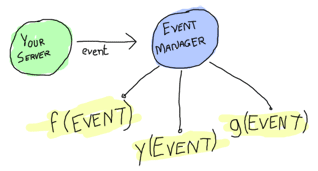

# Event Handlers

## [Handle This! \*pumps shotgun\*]

There is a certain thing that I've avoided getting into in a few of the previous examples. If you look back at the [reminder app](designing-a-concurrent-application.html), our trading system used `io:format/2` to notify people of what was going on.
在前面的几个例子中，有一件事我一直避免涉及。如果你回顾一下[提醒应用程序]（设计并发应用程序）。我们的交易系统使用'io:format/2'通知人们发生了什么。

You can probably see the common link between both cases. They're all about letting people (or some process or application) know about an event that happened at some point in time. In one case, we only output the results while in the other, we took the Pid of subscribers before sending them a message.
你可能会看到这两种情况之间的共同联系。它们都是关于让人们（或某些流程或应用程序）知道某个时间点发生的事件。在一种情况下，我们只输出结果，而在另一种情况下，我们在向订阅者发送消息之前获取订阅者的Pid。

The output approach is minimalist and can not be extended with ease. The one with subscribers is certainly valid. In fact, it's pretty useful when each of the subscribers has a long-running operation to do after receiving an event. In simpler cases, where you do not necessarily want a standby process waiting for events for each of the callbacks, a third approach can be taken.
输出方法是最简单的，不能轻易扩展。有订户的那个当然有效。事实上，当每个订阅者在收到一个事件后都有一个长时间运行的操作要做时，它非常有用。在更简单的情况下，如果您不一定需要一个备用进程等待每个回调的事件，那么可以采用第三种方法。

This third approach simply takes a process which accepts functions and lets them run on any incoming event. This process is usually called an *event manager* and it might end up looking a bit like this:
第三种方法只需要接受函数并允许它们在任何传入事件上运行的进程。这个过程通常被称为“事件管理器”，它可能最终看起来有点像这样：


![显示一个标签为'your server'、另一个标签为'event manager'的气泡]。一个箭头（代表一个事件）从服务器指向事件管理器，该事件管理器在回调函数中运行（如f、y和g所示）](。。/静态/img/事件管理器。（巴布亚新几内亚）

Doing things that way has a few advantages:

-   If your server has many subscribers, it can keep going because it only needs to forward events once
-如果您的服务器有许多订阅者，它可以继续运行，因为它只需要转发一次事件
-   If there is a lot of data to be transferred, it's only done once and all callbacks operate on that same instance of the data
-如果有大量数据需要传输，那么只需传输一次，所有回调都会对同一个数据实例进行操作
-   You don't need to spawn processes for short lived tasks

And of course there are a few downsides too:

-   If all functions need to run for a long time, they're going to block each other. This can be prevented by actually having the function forward the event to a process, basically turning the event manager as an event forwarder (something similar to what we did for the reminder app)
-如果所有函数都需要长时间运行，它们会相互阻塞。这可以通过让函数将事件转发到流程来防止，基本上是将事件管理器作为事件转发器（类似于我们为提醒应用程序所做的事情）
-   In fact, a function that loops indefinitly can prevent any new event from being handled until something crashes.
-事实上，一个不确定循环的函数可以防止任何新事件被处理，直到某个事件崩溃。

There is a way to solve these downsides, which is a bit underwhelming. Basically, you have to turn the event manager approach into the subscriber one. Luckily, the event manager approach is flexible enough to do it with ease and we'll see how to do it later in this chapter.
有一种方法可以解决这些缺点，但这有点令人失望。基本上，您必须将事件管理器方法转变为订阅服务器方法。幸运的是，事件管理器方法足够灵活，可以轻松地完成这项工作，我们将在本章后面看到如何完成这项工作。

I usually write a very basic version of the OTP behaviour we'll see in pure Erlang beforehand, but in this case, I'll instead come straight to the point. Here comes `gen_event`.
我通常会编写一个非常基本的OTP行为版本，我们将在pure Erlang中看到它，但在本例中，我将直接切入要点。“gen_事件”来了`。

## [Generic Event Handlers]

The `gen_event` behaviour differs quite a bit from the `gen_server` and `gen_fsm` behaviours in that you are never really starting a process. The whole part I've described above about 'accepting a callback' is the reason for this. The `gen_event` behaviour basically runs the process that accepts and calls functions, and you only provide a module with these functions. This is to say, you have nothing to do with regards to event manipulation except give your callback functions in a format that pleases the *event manager*. All managing is done for free; you only provide what's specific to your application. This is not really surprising given OTP is, again, all about separating what's generic from specific.
“gen_事件”行为与“gen_服务器”和“gen_fsm”行为有很大不同，因为您从未真正启动过一个流程。我在上面描述的关于“接受回调”的整个部分就是原因。“gen_event”行为基本上运行接受和调用函数的过程，您只提供一个包含这些函数的模块。也就是说，除了以*事件管理器满意的格式提供回调函数外，您与事件操纵无关*。所有的管理都是免费的；您只提供特定于应用程序的内容。这并不奇怪，因为OTP再次强调了区分泛型和特定型的重要性。

This separation, however, means that the standard `spawn -> init -> loop -> terminate` pattern will only be applied to event handlers. Now if you recall what has been said before, event handlers are a bunch of functions running in the manager. This means the currently presented model:
然而，这种分离意味着标准的`spawn->init->loop->terminate`模式将只应用于事件处理程序。现在，如果您还记得之前说过的话，事件处理程序是管理器中运行的一组函数。这意味着当前呈现的模型：


Switches to something more like this for the programmer:


` function is more or less the core of `gen_event`'s callback modules. It works like `gen_server`'s `handle_cast/2` in that it works asynchronously. It differs with regards to what it can return though:
handle_event（event，State）`函数或多或少是gen_event回调模块的核心。它的工作原理类似于“gen_server”的“handle_cast/2”，因为它是异步工作的。不过，它可以返回的内容有所不同：

-   ``
-   ``, which puts the event manager itself into hibernation until the next event
-   `remove_handler`
-   ``


` and removing the current handler, then adding a new one by calling `NewHandler:init(Args2, ResultFromTerminate)`. This can be useful in the cases where you know some specific event happened and you're better of giving control to a new handler. This is likely the kind of thing where you'll simply know when you need it. Again, it's not that frequently used.
元组``。这个并不是经常使用，但它所做的是删除当前的事件处理程序，并用一个新的事件处理程序替换它。首先调用'CurrentHandler:terminate（Args1，NewState）'并删除当前处理程序，然后通过调用'NewHandler:init（Args2，ResultFromTerminate）添加一个新的处理程序，即可完成此操作`。当你知道某个特定的事件发生了，并且你最好将控制权交给一个新的处理程序时，这会很有用。这很可能是那种你只需知道何时需要它的东西。再说一次，它没有那么频繁地被使用。

All incoming events can come from `gen_event:notify/2` which is asynchronous like `gen_server:cast/2` is. There is also `gen_event:sync_notify/2` which is synchronous. This is a bit funny to say, because `handle_event/2` remains asynchronous. The idea here is that the function call only returns once all event handlers have seen and treated the new message. Until then, the event manager will keep blocking the calling process by not replying.
所有传入事件都可以来自'gen_event:notify/2'，它与'gen_server:cast/2'是异步的。还有同步的“gen_event:sync_notify/2”。说起来有点可笑，因为“handle_event/2”仍然是异步的。这里的想法是，只有在所有事件处理程序都看到并处理了新消息后，函数调用才会返回。在此之前，事件管理器将通过不应答来阻止调用过程。

### handle_call

This is similar to a `gen_server`'s `handle_call` callback, except that it can return ``. The `gen_event:call/3-4` function is used to make the call.
这类似于“gen\u server”的“handle\u call”回调，只是它可以返回``。“gen_event:call/3-4”函数用于拨打电话。

This raises a question. How does this work when we have something like 15 different event handlers? Do we expect 15 replies or just one that contains them all? Well, in fact we'll be forced to choose only one handler to reply to us. We'll get into the details of how this is done when we actually see how to attach handlers to our event manager, but if you're impatient, you can look at how the function `gen_event:add_handler/3` works to try to figure it out.
这就提出了一个问题。当我们有15个不同的事件处理程序时，这是如何工作的？我们希望收到15封回复，还是只收到一封包含所有回复的回复？事实上，我们只能选择一个处理程序来回复我们。当我们真正了解如何将处理程序附加到事件管理器时，我们将详细介绍如何实现这一点，但如果您不耐烦，可以看看函数“gen_event:add_handler/3”是如何工作的，以尝试解决这个问题。

### handle_info

The `handle_info/2` callback is pretty much the same as `handle_event` (same return values and everything), with the exception that it only treats out of band messages, such as exit signals, messages sent directly to the event manager with the `!` operator, etc. It has use cases similar to those of `handle_info` in `gen_server` and in `gen_fsm`.
“handle_info/2”回调与“handle_event”（返回值和所有内容都相同）几乎相同，只是它只处理带外消息，例如退出信号，以及直接发送到带有“！”的事件管理器的消息接线员等。它的用例与gen_server和gen_fsm中的handle_info类似`。

### code_change

Code change works in exactly the same manner as it does for `gen_server`s, except it's for each individual event handler. It takes 3 arguments, `OldVsn``.
代码更改的工作方式与“gen_server”完全相同，只是它适用于每个单独的事件处理程序。它需要3个参数，`OldVsn``。

## [It's Curling Time!]

With the callbacks seen, we can start looking at implementing something with `gen_event`. For this part of the chapter, I've chosen to make a set of event handlers used to track game updates of one of the most entertaining sports in the world: curling.
看到回调后，我们可以开始考虑使用“gen_事件”实现一些东西`。在本章的这一部分中，我选择制作一组事件处理程序，用于跟踪世界上最有趣的运动之一：冰壶的游戏更新。

If you've never seen or played curling before (which is a shame!), the rules are relatively simple:


You have two teams and they try to send a [curling stone](../img/curling-stone.png) sliding on the ice, trying to get to the middle of the red circle. They do this with 16 stones and the team with the stone closest to the center wins a point at the end of the round (called an *end*). If the team has the two closest stones, it earns two points, and so on. There are 10 ends and the team with the most points at the end of the 10 ends wins the game.
你有两个团队，他们试图发送一个[冰壶石](。。/静电/img/冰壶石。（巴布亚新几内亚）在冰上滑行，试图到达红色圆圈的中间。他们用16块石头做到这一点，石头离中间最近的队伍在回合结束时赢得一分（称为“结束”）。如果球队拥有两块最接近的石头，它将获得两分，以此类推。共有10场比赛，10场比赛结束时得分最高的球队获胜。

There are more rules making the game more fascinating, but this is a book on Erlang, not extremely fascinating winter sports. If you want to learn more about the rules, I suggest you head up to the [Wikipedia article on curling](http://en.wikipedia.org/wiki/Curling).
有更多的规则使比赛更吸引人，但这是一本关于二郎的书，不是非常吸引人的冬季运动。如果你想了解更多关于冰壶的规则，我建议你浏览一下[维基百科关于冰壶的文章](http://en。维基百科。org/wiki/Curling）。

For this entirely real-world-relevant scenario, we'll be working for the next winter Olympic Games. The city where everything happens are just done building the arena where the matches will take place and they're working on getting the scoreboard ready. It turns out that we have to program a system that will let some official enter game events, such as when a stone has been thrown, when a round ends or when a game is over, and then route these events to the scoreboard, a stats system, news reporters' feeds, etc.
对于这个完全与现实世界相关的场景，我们将为下一届冬奥会而努力。发生一切的城市刚刚建成了比赛场地，他们正在准备好记分牌。事实证明，我们必须编程一个系统，允许一些官方人员输入游戏事件，例如当掷石头、一轮比赛结束或比赛结束时，然后将这些事件发送到记分板、统计系统、新闻记者的订阅源等。

Being as clever as we are, we know this is a chapter on gen_event and deduce we will likely use it to accomplish our task. We won't implement all the rules given this is more of an example, but feel free to do so when we're done with the chapter. I promise not to be mad.
尽管我们很聪明，但我们知道这是关于gen_事件的一章，并推断我们可能会用它来完成我们的任务。我们不会执行所有的规则，因为这更像是一个例子，但是当我们完成这一章时，请随意执行。我保证不会生气。

We'll start with the scoreboard. Because they're installing it right now, we'll make use of a fake module that would usually let us interact with it, but for now it'll only use standard output to show what's going on. This is where [curling_scoreboard_hw.erl](static/erlang/curling_scoreboard_hw.erl.html) comes in:
我们从记分牌开始。因为他们现在正在安装它，我们将使用一个假模块，它通常会让我们与之交互，但目前它只使用标准输出来显示发生了什么。这就是[冰壶]记分板。erl]（静态/二郎/冰壶/记分板）。呃。html）进入：

```erl
-module(curling_scoreboard_hw).
-export([add_point/1, next_round/0, set_teams/2, reset_board/0]).

%% This is a 'dumb' module that's only there to replace what a real hardware
%% controller would likely do. The real hardware controller would likely hold
%% some state and make sure everything works right, but this one doesn't mind.

%% Shows the teams on the scoreboard.
set_teams(TeamA, TeamB) ->
    io:format("Scoreboard: Team ~s vs. Team ~s~n", [TeamA, TeamB]).

next_round() ->
    io:format("Scoreboard: round over~n").

add_point(Team) ->
    io:format("Scoreboard: increased score of team ~s by 1~n", [Team]).

reset_board() ->
    io:format("Scoreboard: All teams are undefined and all scores are 0~n").
```

So this is all the functionality the scoreboard has. They usually have a timer and other awesome functionalities, but whatever. Seems like the Olympics committee didn't feel like having us implementing trivialities for a tutorial.
这就是记分板的全部功能。它们通常有计时器和其他很棒的功能，但不管怎样。似乎奥林匹克委员会不想让我们为一个指导实施琐事。

This hardware interface lets us have a little bit of design time to ourselves. We know that there are a few events to handle for now: adding teams, going to the next round, setting the number of points. We will only use the `reset_board` functionality when starting a new game and won't need it as part of our protocol. The events we need might take the following form in our protocol:
这个硬件接口让我们有一点自己的设计时间。我们知道目前有几个事件需要处理：增加团队、进入下一轮、设定分数。我们只在开始新游戏时使用“重置棋盘”功能，不需要将其作为我们协议的一部分。我们需要的活动可能在我们的协议中采用以下形式：

-   ``, where this is translated to a single call to `curling_scoreboard_hw:set_teams(TeamA, TeamB)`;
-“在这里，这被转化为对‘冰壶’记分板的一次调用：设置团队（TeamA，TeamB）’；
-   ` calls to `curling_scoreboard_hw:add_point(Team)`;
-   `next_round`, which gets translated to a single call with the same name.

We can start our implementation with this basic event handler skeleton:

```erl
-module(curling_scoreboard).
-behaviour(gen_event).

-export([init/1, handle_event/2, handle_call/2, handle_info/2, code_change/3,
   terminate/2]).

init([]) ->
    .

handle_event(_, State) ->
    .

handle_call(_, State) ->
    .

handle_info(_, State) ->
    .

code_change(_OldVsn, State, _Extra) ->
    .

terminate(_Reason, _State) ->
    ok.
```

This is a skeleton that we can use for every `gen_event` callback module out there. For now, the scoreboard event handler itself won't need to do anything special except forward the calls to the hardware module. We expect the events to come from `gen_event:notify/2`, so the handling of the protocol should be done in `handle_event/2`. The file [curling_scoreboard.erl](static/erlang/curling_scoreboard.erl.html) shows the updates:
这是一个框架，我们可以用于每个“gen_事件”回调模块。目前，记分板事件处理程序本身不需要做任何特殊的事情，只需要将调用转发到硬件模块。我们希望事件来自'gen_event:notify/2'，因此协议的处理应该在'handle_event/2'中完成`。档案[冰壶]记分板。erl]（静态/二郎/冰壶记分板）。呃。html）显示更新：

```erl
-module(curling_scoreboard).
-behaviour(gen_event).

-export([init/1, handle_event/2, handle_call/2, handle_info/2, code_change/3,
   terminate/2]).

init([]) ->
    .

handle_event(, State) ->
    curling_scoreboard_hw:set_teams(TeamA, TeamB),
    ;
handle_event(, State) ->
    [curling_scoreboard_hw:add_point(Team) || _ <- lists:seq(1,N)],
    ;
handle_event(next_round, State) ->
    curling_scoreboard_hw:next_round(),
    ;
handle_event(_, State) ->
    .

handle_call(_, State) ->
    .

handle_info(_, State) ->
    .
```

You can see the updates done to the `handle_event/2` function. Trying it:

```eshell
1> c(curling_scoreboard_hw).

2> c(curling_scoreboard).

3>  = gen_event:start_link().

4> gen_event:add_handler(Pid, curling_scoreboard, []).
ok
5> gen_event:notify(Pid, ).
Scoreboard: Team Pirates vs. Team Scotsmen
ok
6> gen_event:notify(Pid, ). 
ok
Scoreboard: increased score of team Pirates by 1
Scoreboard: increased score of team Pirates by 1
Scoreboard: increased score of team Pirates by 1
7> gen_event:notify(Pid, next_round). 
Scoreboard: round over
ok
8> gen_event:delete_handler(Pid, curling_scoreboard, turn_off).
ok
9> gen_event:notify(Pid, next_round). 
ok
```

A few things are going on here. The first of them is that we're starting the `gen_event` process as a standalone thing. We then attach our event handler to it dynamically with `gen_event:add_handler/3`. This can be done as many times as you want. However, as mentioned in the `handle_call` part earlier, this might cause problems when you want to work with a particular event handler. If you want to call, add or delete a specific handler when there's more than one instance of it, you'll have to find a way to uniquely identify it. My favorite way of doing it (one that works great if you don't have anything more specific in mind) is to just use `make_ref()` as a unique value. To give this value to the handler, you add it by calling `add_handler/3` as `gen_event:add_handler(Pid, ` to talk to that specific handler. Problem solved.
这里发生了一些事情。首先，我们将启动“gen_事件”流程作为一个独立的东西。然后，我们使用“gen_event:add_handler/3”动态地将事件处理程序附加到它`。你想做多少次都可以。但是，正如前面的“handle_call”部分所提到的，当您想要使用特定的事件处理程序时，这可能会导致问题。如果你想在有多个实例的情况下调用、添加或删除一个特定的处理程序，你必须找到一种唯一标识它的方法。我最喜欢的方法（如果你没有更具体的想法，那么这个方法非常有效）就是使用“make_ref（）”作为唯一的值。要将该值赋予处理程序，可以通过调用'add_handler/3'将其添加为'gen_event:add_handler（Pid，'以与该特定处理程序对话。问题解决了。


Anyway, you can then see that we send messages to the event handler, which successfully calls the hardware module. We then remove the handler. Here, `turn_off` is an argument to the `terminate/2` function, which our implementation currently doesn't care about. The handler is gone, but we can still send events to the event manager. Hooray.
不管怎样，您可以看到我们向事件处理程序发送消息，它成功地调用了硬件模块。然后我们移除处理器。这里，`turn_off`是`terminate/2`函数的一个参数，我们的实现目前并不关心这个函数。处理程序已经消失，但我们仍然可以将事件发送到事件管理器。好极了。

One awkward thing with the code snippet above is that we're forced to call the `gen_event` module directly and show everyone what our protocol looks like. A better option would be to provide an [abstraction module](static/erlang/curling.erl.html "curling abstraction module") on top of it that just wraps all we need. This will look a lot nicer to everyone using our code and will, again, let us change the implementation if (or when) we need to do it. It will also let us specify what handlers are necessary to include for a standard curling game:
上面的代码片段有一个尴尬的地方，那就是我们被迫直接调用'gen_event'模块，向大家展示我们的协议是什么样子的。更好的选择是提供[abstraction module]（static/erlang/curling）。呃。html“卷曲抽象模块”），它只包装了我们所需要的一切。对于使用我们的代码的每个人来说，这看起来都会好得多，而且如果需要（或在什么时候）让我们更改实现。它还将让我们指定标准冰壶游戏需要包含哪些处理程序：

```erl
-module(curling).
-export([start_link/2, set_teams/3, add_points/3, next_round/1]).

start_link(TeamA, TeamB) ->
     = gen_event:start_link(),
    %% The scoreboard will always be there
    gen_event:add_handler(Pid, curling_scoreboard, []),
    set_teams(Pid, TeamA, TeamB),
    .

set_teams(Pid, TeamA, TeamB) ->
    gen_event:notify(Pid, ).

add_points(Pid, Team, N) ->
    gen_event:notify(Pid, ).

next_round(Pid) ->
    gen_event:notify(Pid, next_round).
```

And now running it:

```eshell
1> c(curling).

2>  = curling:start_link("Pirates", "Scotsmen").
Scoreboard: Team Pirates vs. Team Scotsmen

3> curling:add_points(Pid, "Scotsmen", 2). 
Scoreboard: increased score of team Scotsmen by 1
Scoreboard: increased score of team Scotsmen by 1
ok
4> curling:next_round(Pid). 
Scoreboard: round over
ok
```


.
这看起来并不是什么优势，但实际上是为了更好地使用代码（并减少错误编写消息的可能性）。

## [Alert the Press!]

We've got the basic scoreboard done, now we want international reporters to be able to get live data from our official in charge of updating our system. Because this is an example program, we won't go through the steps of setting up a socket and writing a protocol for the updates, but we'll put the system in place to do it by putting an intermediary process in charge of it.
我们已经完成了基本的记分板，现在我们希望国际记者能够从负责更新我们系统的官员那里获得实时数据。因为这是一个示例程序，我们将不经历设置套接字和编写更新协议的步骤，但我们将通过让一个中间进程来管理系统来实现这一点。

Basically, whenever a news organization feels like getting into the game feed, they'll register their own handler that just forwards them the data they need. We'll effectively going to turn our gen_event server into some kind of message hub, just routing them to whoever needs them.
基本上，每当新闻机构想要进入游戏提要时，他们都会注册自己的处理程序，只向他们转发所需的数据。我们将有效地将gen_事件服务器变成某种消息中心，只需将它们路由到需要它们的人。

The first thing to do is update the [curling.erl](static/erlang/curling.erl.html) module with the new interface. Because we want things to be easy to use, we'll only add two functions, `join_feed/2` and `leave_feed/2`. Joining the feed should be doable just by inputting the right Pid for the event manager and the Pid to forward all the events to. This should return a unique value that can then be used to unsubscribe from the feed with `leave_feed/2`:
首先要做的是更新[curling]。erl]（静态/erlang/卷曲）。呃。带有新界面的html）模块。因为我们希望东西易于使用，所以我们只会添加两个函数，'join_feed/2'和'leave_feed/2'`。加入提要应该是可行的，只需为事件管理器输入正确的Pid，并将所有事件转发给Pid即可。这将返回一个唯一的值，该值可用于使用“leave_feed/2”取消订阅订阅源：

```erl
%% Subscribes the pid ToPid to the event feed.
%% The specific event handler for the newsfeed is
%% returned in case someone wants to leave
join_feed(Pid, ToPid) ->
    HandlerId = ,
    gen_event:add_handler(Pid, HandlerId, [ToPid]),
    HandlerId.

leave_feed(Pid, HandlerId) ->
    gen_event:delete_handler(Pid, HandlerId, leave_feed).
```

Note that I'm using the technique described earlier for multiple handlers (` press leaving the place won't disconnect a journalist from *The Economist* (no idea why they'd do a report on curling, but what do you know). Anyway, here is the implementation I've made of the `curling_feed` module:
请注意，我使用的是前面描述的针对多个处理者的技巧（“记者离开现场不会切断记者与《经济学人》*（不知道他们为什么要做卷发报告，但你知道什么）。总之，下面是我对“curling_feed”模块的实现：

```erl
-module(curling_feed).
-behaviour(gen_event).

-export([init/1, handle_event/2, handle_call/2, handle_info/2, code_change/3,
   terminate/2]).

init([Pid]) ->
    .

handle_event(Event, Pid) ->
    Pid ! ,
    .

handle_call(_, State) ->
    .

handle_info(_, State) ->
    .

code_change(_OldVsn, State, _Extra) ->
    .

terminate(_Reason, _State) ->
    ok.
```

The only interesting thing here is still the `handle_event/2` function, which blindly forwards all events to the subscribing Pid. Now when we use the new modules:
这里唯一有趣的事情仍然是'handle_event/2'函数，它会盲目地将所有事件转发给订阅Pid。现在，当我们使用新模块时：

```eshell
1> c(curling), c(curling_feed).

2>  = curling:start_link("Saskatchewan Roughriders", "Ottawa Roughriders").
Scoreboard: Team Saskatchewan Roughriders vs. Team Ottawa Roughriders

3> HandlerId = curling:join_feed(Pid, self()). 

4> curling:add_points(Pid, "Saskatchewan Roughriders", 2). 
Scoreboard: increased score of team Saskatchewan Roughriders by 1
ok
Scoreboard: increased score of team Saskatchewan Roughriders by 1
5> flush().
Shell got 
ok
6> curling:leave_feed(Pid, HandlerId).
ok
7> curling:next_round(Pid). 
Scoreboard: round over
ok
8> flush().
ok
```

And we can see that we added ourselves to the feed, got the updates, then left and stopped receiving them. You can actually try to add many processes many times and it will work fine.
我们可以看到，我们把自己添加到feed中，得到了更新，然后离开并停止接收它们。实际上，您可以多次尝试添加多个进程，它会很好地工作。

This introduces a problem though. What if one of the curling feed subscribers crashes? Do we just keep the handler going on there? Ideally, we wouldn't have to. In fact, we don't have to. All that needs to be done is to change the call from `gen_event:add_handler/3` to `gen_event:add_sup_handler/3`. If you crash, the handler is gone. Then on the opposite end, if the `gen_event` manager crashes, the message `` is sent back to you so you can handle it. Easy enough, right? Think again.
但这也带来了一个问题。如果其中一个冰壶订阅服务器崩溃了怎么办？我们是不是让处理人员继续在那里工作？理想情况下，我们不必这么做。事实上，我们不必这么做。只需将调用从'gen_event:add_handler/3'更改为'gen_event:add_sup_handler/3'`。如果你撞车，处理器就不见了。然后在另一端，如果“gen_事件”管理器崩溃，消息“将被发送回”给您，以便您可以处理它。很简单，对吧？再想想。

### Don't Drink Too Much Kool-Aid


It might have happened at some time in your childhood that you went to your aunt or grandmother's place for a party or something. If you were mischievous in any way, you would have several adults looking over you, on top of your parents. Now if you ever did something wrong, you would get scolded by your mom, dad, aunt, grandmother and then everyone would keep telling you after that even though you already clearly knew you had done something wrong. Well `gen_event:add_sup_handler/3` is a bit like that; no, seriously.
这可能发生在你童年的某个时候，你去你阿姨或祖母家参加派对或其他什么的。如果你在任何方面淘气，你都会有几个成年人在你父母之上看着你。现在，如果你做错了什么，你会被你的妈妈、爸爸、阿姨、奶奶责骂，然后每个人都会继续告诉你，即使你已经清楚地知道你做错了什么。“gen_事件：add_sup_handler/3”有点像这样；不，说真的。

Whenever you use `gen_event:add_sup_handler/3`, a link is set up between your process and the event manager so both of them are supervised and the handler knows if its parent process fails. If you recall the [Errors and Processes](errors-and-processes.html#monitors) chapter and its section on monitors, I have mentioned that monitors are great for writing libraries which need to know what's going on with other processes because they can be stacked, at the opposite of links. Well `gen_event` predates the appearance of monitors in Erlang and a strong commitment to backwards compatibility introduced this pretty bad wart. Basically, because you could have the same process acting as the parent of many event handlers, so the library doesn't ever unlink the processes (except when it terminates for good) just in case. Monitors would actually solve the problem, but they aren't being used there.
无论何时使用“gen_event:add_sup_handler/3”，都会在流程和事件管理器之间建立一个链接，以便对它们进行监督，并且处理程序知道其父流程是否失败。如果您回忆起[错误和过程]（错误和过程。html#monitors（监视器）一章及其关于监视器的部分，我已经提到，监视器非常适合编写需要知道其他进程发生了什么的库，因为它们可以堆叠在链接的相反位置。“gen_事件”早于Erlang显示器的出现，对向后兼容性的强烈承诺带来了这个非常糟糕的问题。基本上，因为可以让同一个进程充当许多事件处理程序的父进程，所以库永远不会取消进程的链接（除非它永久终止），以防万一。监视器实际上可以解决这个问题，但它们在那里没有被使用。

This mean that everything goes alright when your own process crashes: the supervised handler is terminated (with the call to `YourModule:terminate(`. When the event manager is shut down though, you will either:
这意味着，当您自己的进程崩溃时，一切都会正常进行：受监督的处理程序被终止（调用'YourModule:terminate(`。但是，当事件管理器关闭时，您将：

-   Receive the `` message then crash because you're not trapping exits;
-   Receive the `` message, then a standard `'EXIT'` message that is either superfluous or confusing.
-接收“消息”，然后是一条标准的“退出”消息，它要么是多余的，要么是令人困惑的。

That's quite a wart, but at least you know about it. You can try and switch your event handler to a supervised one if you feel like it. It'll be safer even if it risks being more annoying in some cases. Safety first.
这是一个很大的缺点，但至少你知道。如果您愿意，可以尝试将事件处理程序切换到受监督的事件处理程序。即使在某些情况下可能会更烦人，它也会更安全。安全第一。

We're not done yet! what happens if some member of the media is not there on time? We need to be able to tell them from the feed what the current state of the game is. For this, we'll write an additional event handler named [curling_accumulator](static/erlang/curling_accumulator.erl.html). Again, before writing it entirely, we might want to add it to the `curling` module with the few calls we want:
我们还没完呢！如果一些媒体成员没有准时到场，会发生什么？我们需要能够从feed中告诉他们游戏的当前状态。为此，我们将编写一个名为[curling_acculator]（static/erlang/curling_acculator）的附加事件处理程序。呃。（html）。同样，在完全编写之前，我们可能希望通过几个调用将其添加到“curling”模块中：

```erl
-module(curling).
-export([start_link/2, set_teams/3, add_points/3, next_round/1]).
-export([join_feed/2, leave_feed/2]).
-export([game_info/1]).

start_link(TeamA, TeamB) ->
     = gen_event:start_link(),
    %% The scoreboard will always be there
    gen_event:add_handler(Pid, curling_scoreboard, []),
    %% Start the stats accumulator
    gen_event:add_handler(Pid, curling_accumulator, []),
    set_teams(Pid, TeamA, TeamB),
    .

%% skipping code here

%% Returns the current game state.
game_info(Pid) ->
    gen_event:call(Pid, curling_accumulator, game_data).
```

A thing to notice here is that the `game_info/1` function uses only `curling_accumulator` as a handler id. In the cases where you have many versions of the same handler, the hint about using `make_ref()` (or any other means) to ensure you write to the right handler still holds. Also note that I made the `curling_accumulator` handler start automatically, much like the scoreboard. Now for the module itself. It should be able to hold state for the curling game: so far we have teams, score and rounds to track. This can all be held in a state record, changed on each event received. Then, we will only need to reply to the `game_data` call, as below:
这里需要注意的是，`game_info/1`函数只使用`curling_acculator`作为处理程序id。在同一个处理程序有多个版本的情况下，关于使用“make_ref（）”（或任何其他方法）确保写入正确的处理程序的提示仍然有效。还要注意的是，我让“curling_累加器”处理程序自动启动，很像记分板。现在是模块本身。它应该能够保持冰壶比赛的状态：到目前为止，我们有球队、得分和轮次要追踪。所有这些都可以保存在状态记录中，在收到每个事件时进行更改。然后，我们只需要回复“game_data”呼叫，如下所示：

```erl
-module(curling_accumulator).
-behaviour(gen_event).

-export([init/1, handle_event/2, handle_call/2, handle_info/2, code_change/3,
   terminate/2]).

-record(state, ).

init([]) ->
    .

handle_event() ->
    Teams = orddict:store(TeamA, 0, orddict:store(TeamB, 0, T)),
    ;
handle_event() ->
    Teams = orddict:update_counter(Team, N, T),
    ;
handle_event(next_round, S=#state) ->
    ;
handle_event(_Event, Pid) ->
    .

handle_call(game_data, S=#state) ->
    ;
handle_call(_, State) ->
    .

handle_info(_, State) ->
    .

code_change(_OldVsn, State, _Extra) ->
    .

terminate(_Reason, _State) ->
    ok.
```

So you can see we basically just update the state until someone asks for game details, at which point we'll be sending them back. We did this in a very basic way. A perhaps smarter way to organize the code would have been to simply keep a list of all the events to ever happen in the game so we could send them back at once each time a new process subscribes to the feed. This won't be needed here to show how things work, so let's focus on using our new code:
所以你可以看到，我们基本上只是更新状态，直到有人要求提供游戏细节，在这一点上，我们将把他们发回。我们以一种非常基本的方式做到了这一点。组织代码的一种可能更聪明的方法是简单地保留游戏中发生的所有事件的列表，这样我们就可以在每次新进程订阅提要时立即将它们发回。这里不需要用这个来展示事情是如何工作的，所以让我们集中精力使用我们的新代码：

```eshell
1> c(curling), c(curling_accumulator).

2>  = curling:start_link("Pigeons", "Eagles").
Scoreboard: Team Pigeons vs. Team Eagles

3> curling:add_points(Pid, "Pigeons", 2).
Scoreboard: increased score of team Pigeons by 1
ok
Scoreboard: increased score of team Pigeons by 1
4> curling:next_round(Pid).
Scoreboard: round over
ok
5> curling:add_points(Pid, "Eagles", 3).
Scoreboard: increased score of team Eagles by 1
ok
Scoreboard: increased score of team Eagles by 1
Scoreboard: increased score of team Eagles by 1
6> curling:next_round(Pid).
Scoreboard: round over
ok
7> curling:game_info(Pid).

```

Enthralling! Surely the Olympic committee will love our code. We can pat ourselves on the back, cash in a fat check and go play videogames all night now.
迷人的奥林匹克委员会肯定会喜欢我们的规则。我们可以拍拍自己的背，兑现一张大额支票，然后整晚玩电子游戏。

We haven't seen all there is to do with gen_event as a module. In fact, we haven't seen the most common use of event handlers: logging and system alarms. I decided against showing them because pretty much any other source on Erlang out there uses `gen_event` strictly for that. If you're interested in going there, check out [error_logger](http://www.erlang.org/doc/man/error_logger.html "Erlang's default logging application") first.
我们还没有看到所有与gen_事件有关的模块。事实上，我们还没有看到最常用的事件处理程序：日志和系统警报。我决定不展示它们，因为Erlang上几乎所有其他源都严格使用“gen_事件”。如果你有兴趣去那里，请查看[error_logger](http://www。二郎。org/doc/man/error_logger。html“Erlang的默认日志应用程序”）首先。

Even if we've not seen the most common uses of `gen_event`, it's important to say that we've seen all the concepts necessary to understanding them, building our own and integrating them into our applications. More importantly, we've finally covered the three main OTP behaviours used in active code development. We still have a few behaviours left to visit---those that act as a bunch of glue between all of our worker processes---such as the supervisor.
即使我们还没有看到“gen_事件”最常见的用法，但重要的是，我们已经看到了理解它们、构建自己的概念并将它们集成到应用程序中所需的所有概念。更重要的是，我们最终讨论了在活动代码开发中使用的三种主要OTP行为。我们仍有一些行为有待观察——那些在我们所有员工流程之间起到粘合作用的行为——比如主管。
