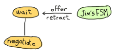

# Rage Against The Finite-State Machines

## [What Are They?]

A finite-state machine (FSM) is not really a machine, but it does have a finite number of states. I've always found finite-state machines easier to understand with graphs and diagrams. For example, the following would be a simplistic diagram for a (very dumb) dog as a state machine:
有限状态机（FSM）并不是真正的机器，但它的状态数是有限的。我总是发现用图形和图表更容易理解有限状态机。例如，对于一只（非常笨的）狗作为状态机来说，以下是一个过于简单的图表：


. In the real world that would be a freaky event, but your dog would come back after being ran over by a car, so it's not all bad.
在这里，狗有三种状态：坐着、吠叫或摇尾巴。不同的事件或输入可能会迫使它改变状态。如果你看到一只松鼠在安静地叫，它就不会停下来。然而，如果狗坐着，你抚摸它，我们不知道会发生什么。在Erlang世界中，狗可能会崩溃（最终会被它的主管重新启动）。在现实世界中，这将是一个奇怪的事件，但你的狗会在被汽车辗过后回来，所以这并不都是坏事。

Here's a cat's state diagram for a comparison:


 in Erlang is a fun and simple task:
实现[cat state machine]（静态/erlang/cat_fsm）。呃。html）在Erlang中是一项有趣而简单的任务：

```erl
-module(cat_fsm).
-export([start/0, event/2]).

start() ->
    spawn(fun() -> dont_give_crap() end).

event(Pid, Event) ->
    Ref = make_ref(), % won't care for monitors here
    Pid ! ,
    receive
        
    after 5000 ->
        
    end.

dont_give_crap() ->
    receive
        ;
        _ -> ok
    end,
    io:format("Switching to 'dont_give_crap' state~n"),
    dont_give_crap().
```

We can try the module to see that the cat really never gives a crap:

```eshell
1> c(cat_fsm).

2> Cat = cat_fsm:start().
<0.67.0>
3> cat_fsm:event(Cat, pet).
Switching to 'dont_give_crap' state

4> cat_fsm:event(Cat, love).
Switching to 'dont_give_crap' state

5> cat_fsm:event(Cat, cherish).
Switching to 'dont_give_crap' state

```

The same can be done for the [dog FSM](static/erlang/dog_fsm.erl.html), except more states are available:
对于[dog FSM]（静态/erlang/dog_FSM）也可以这样做。呃。html），除了更多可用状态：

```erl
-module(dog_fsm).
-export([start/0, squirrel/1, pet/1]).

start() ->
    spawn(fun() -> bark() end).

squirrel(Pid) -> Pid ! squirrel.

pet(Pid) -> Pid ! pet.

bark() ->
    io:format("Dog says: BARK! BARK!~n"),
    receive
        pet ->
            wag_tail();
        _ ->
            io:format("Dog is confused~n"),
            bark()
    after 2000 ->
        bark()
    end.

wag_tail() ->
    io:format("Dog wags its tail~n"),
    receive
        pet ->
            sit();
        _ ->
            io:format("Dog is confused~n"),
            wag_tail()
    after 30000 ->
        bark()
    end.

sit() ->
    io:format("Dog is sitting. Gooooood boy!~n"),
    receive
        squirrel ->
            bark();
        _ ->
            io:format("Dog is confused~n"),
            sit()
    end.
```

It should be relatively simple to match each of the states and transitions to what was on the diagram above. Here's the FSM in use:
将每个状态和转换与上图中的匹配应该相对简单。以下是正在使用的FSM：

```eshell
6> c(dog_fsm).

7> Pid = dog_fsm:start().
Dog says: BARK! BARK!
<0.46.0>
Dog says: BARK! BARK!
Dog says: BARK! BARK!
Dog says: BARK! BARK!
8> dog_fsm:pet(Pid).
pet
Dog wags its tail
9> dog_fsm:pet(Pid).
Dog is sitting. Gooooood boy!
pet
10> dog_fsm:pet(Pid).
Dog is confused
pet
Dog is sitting. Gooooood boy!
11> dog_fsm:squirrel(Pid).
Dog says: BARK! BARK!
squirrel
Dog says: BARK! BARK!    
12> dog_fsm:pet(Pid).
Dog wags its tail
pet
13> %% wait 30 seconds
Dog says: BARK! BARK!
Dog says: BARK! BARK!
Dog says: BARK! BARK!     
13> dog_fsm:pet(Pid).     
Dog wags its tail
pet
14> dog_fsm:pet(Pid).
Dog is sitting. Gooooood boy!
pet
```

You can follow along with the schema if you want (I usually do, it helps being sure that nothing's wrong).
如果你愿意，你可以遵循这个模式（我通常会这样做，这有助于确保没有任何问题）。

That's really the core of FSMs implemented as Erlang processes. There are things that could have been done differently: we could have passed state in the arguments of the state functions in a way similar to what we do with servers' main loop. We could also have added an `init` and `terminate` functions, handled code updates, etc.
这是作为Erlang进程实现的FSM的核心。有些事情本来可以做得不同：我们可以在状态函数的参数中传递状态，方式类似于我们对服务器的主循环所做的。我们还可以添加'init'和'terminate'函数，处理代码更新等。

Another difference between the dog and cat FSMs is that the cat's events are *synchronous* and the dog's events are *asynchronous*. In a real FSM, both could be used in a mixed manner, but I went for the simplest representation out of pure untapped laziness. There are other forms of event the examples do not show: global events that can happen in any state.
狗和猫FSM的另一个区别是猫的事件是“同步的”，狗的事件是“异步的”*。在真正的FSM中，两者都可以混合使用，但我选择了最简单的表示法，纯粹是出于未开发的懒惰。还有一些例子没有显示的其他形式的事件：在任何状态下都可能发生的全局事件。

One example of such an event could be when the dog gets a sniff of food. Once the `smell food` event is triggered, no matter what state the dog is in, he'd go looking for the source of food.
这种情况的一个例子可能是狗闻到食物的味道。一旦“闻到食物”事件被触发，无论狗处于何种状态，它都会去寻找食物的来源。

Now we won't spend too much time implementing all of this in our 'written-on-a-napkin' FSM. Instead we'll move directly to the `gen_fsm` behaviour.
现在，我们不会花太多时间在我们的“餐巾纸书写”FSM中实现所有这些。相反，我们将直接讨论“gen_fsm”行为。

## [Generic Finite-State Machines]

The `gen_fsm` behaviour is somewhat similar to `gen_server` in that it is a specialised version of it. The biggest difference is that rather than handling *calls* and *casts*, we're handling *synchronous* and *asynchronous* *events*. Much like our dog and cat examples, each state is represented by a function. Again, we'll go through the callbacks our modules need to implement in order to work.
“gen_fsm”的行为有点类似于“gen_server”，因为它是它的一个专门版本。最大的区别在于，我们处理的不是*调用*和*强制转换*，而是*同步*和*异步**事件*。就像我们的狗和猫的例子一样，每个状态都由一个函数表示。同样，我们将讨论我们的模块为了工作需要实现的回调。

### init

This is the same [init/1](http://erldocs.com/18.0/stdlib/gen_fsm.html#init/1) keep the same semantics.
这是相同的[init/1](http://erldocs。com/18。0/stdlib/gen_fsm。html#init/1）保持相同的语义。

What's new here is that `StateName` is an atom and represents the next callback function to be called.
这里的新功能是，‘StateName’是一个原子，代表下一个要调用的回调函数。


### StateName

The functions [StateName/2](http://erldocs.com/18.0/stdlib/gen_fsm.html#StateName/2)`. This means the finite state machine will be in a `sitting` state. This is not the same kind of state as we had seen with `gen_server`; it is rather equivalent to the `sit`, `bark` and `wag_tail` states of the previous dog FSM. These states dictate a context in which you handle a given event.
函数[StateName/2](http://erldocs。com/18。0/stdlib/gen_fsm。html#StateName/2）`。这意味着有限状态机将处于“静坐”状态。这与我们在“gen_server”中看到的状态不同；它相当于前一代狗FSM的“坐”、“吠”和“摇尾巴”状态。这些状态决定了处理给定事件的上下文。

An example of this would be someone calling you on your phone. If you're in the state 'sleeping on a Saturday morning', your reaction might be to yell in the phone. If your state is 'waiting for a job interview', chances are you'll pick the phone and answer politely. On the other hand, if you're in the state 'dead', then I am surprised you can even read this text at all.
例如有人打电话给你。如果你处于“周六早上睡觉”的状态，你的反应可能是对着电话大喊大叫。如果你所在的州正在等待工作面试，你很可能会拿起电话，礼貌地接听。另一方面，如果你处于“死亡”状态，那么我很惊讶你居然能读到这篇文章。

Back to our FSM. The `init/1` function said we should be in the `sitting` state. Whenever the `gen_fsm` process receives an event, either the function `sitting/2` or `sitting/3` will be called. The `sitting/2` function is called for asynchronous events and `sitting/3` for synchronous ones.
回到我们的FSM。'init/1'函数说我们应该处于'siting'状态。每当'gen_fsm'进程接收到事件时，就会调用函数'siting/2'或'siting/3'。异步事件调用'siting/2'函数，同步事件调用'siting/3'。

The arguments for `sitting/2` (or generally `StateName/2`) are `Event``.

The arguments for `sitting/3` are similar, except there is a `From`. The `StateName/3` functions can return the following tuples:
“siting/3”的论点相似，只是有一个“From”`。“StateName/3”函数可以返回以下元组：

``` expand


```

Note that there's no limit on how many of these functions you can have, as long as they are exported. The atoms returned as `NextStateName` in the tuples will determine whether the function will be called or not.
请注意，只要这些函数被导出，您就可以拥有多少函数，这是没有限制的。元组中返回为“NextStateName”的原子将决定是否调用该函数。

### handle_event

In the last section, I mentioned global events that would trigger a specific reaction no matter what state we're in (the dog smelling food will drop whatever it is doing and will instead look for food). For these events that should be treated the same way in every state, the [handle_event/3](http://erldocs.com/18.0/stdlib/gen_fsm.html#handle_event/3) variable in between them, telling you what the state was when the event was received. It returns the same values as `StateName/2`.
在上一节中，我提到了无论我们处于何种状态，都会触发特定反应的全球事件（嗅到食物的狗会放下正在做的任何事情，转而寻找食物）。对于这些在每个状态下都应该以相同方式处理的事件，[handle_event/3](http://erldocs。com/18。0/stdlib/gen_fsm。html#handle_event/3）变量，告诉您收到事件时的状态。它返回的值与'StateName/2'相同`。

### handle_sync_event

The [handle_sync_event/4](http://erldocs.com/18.0/stdlib/gen_fsm.html#handle_sync_event/4) callback is to `StateName/3` what `handle_event/2` is to `StateName/2`. It handles synchronous global events, takes the same parameters and returns the same kind of tuples as `StateName/3`.
[handle_sync_事件/4](http://erldocs。com/18。0/stdlib/gen_fsm。html#handle_sync_event/4）回调是对'StateName/3'的调用，就像'handle_event/2'是对'StateName/2'的调用一样`。它处理同步全局事件，采用与“StateName/3”相同的参数并返回相同类型的元组`。

Now might be a good time to explain how we know whether an event is global or if it's meant to be sent to a specific state. To determine this we can look at the function used to send an event to the FSM. Asynchronous events aimed at any `StateName/2` function are sent with [send_event/2](http://erldocs.com/18.0/stdlib/gen_fsm.html#send_event/2).
现在也许是解释我们如何知道一个事件是全球性的，还是应该发送到特定状态的好时机。为了确定这一点，我们可以查看用于向FSM发送事件的函数。针对任何“StateName/2”函数的异步事件都会与[send_event/2]一起发送(http://erldocs。com/18。0/stdlib/gen_fsm。html#发送_事件/2）。

The two equivalent functions for global events are [send_all_state_event/2](http://erldocs.com/18.0/stdlib/gen_fsm.html#send_all_state_event/2) (quite a long name).
全局事件的两个等效函数是[send_all_state_event/2](http://erldocs。com/18。0/stdlib/gen_fsm。html#发送_所有_状态_事件/2）（相当长的名称）。

### code_change

This works exactly the same as it did for `gen_server`s except that it takes an extra state parameter when called like `code_change(OldVersion, StateName, Data, Extra)`, and returns a tuple of the form ``.
它的工作原理与'gen_server'完全相同，只是当调用'code_change（OldVersion，StateName，Data，extra）'时，它会使用一个额外的状态参数，并返回表单的元组``。

### terminate

This should, again, act a bit like what we have for generic servers. [terminate/3](http://erldocs.com/18.0/stdlib/gen_fsm.html#terminate/3) should do the opposite of `init/1`.
同样，这应该有点像通用服务器。[终止/3](http://erldocs。com/18。0/stdlib/gen_fsm。html#terminate/3）应该与init/1相反`。

## [A Trading System Specification]

It's time to put all of this in practice. Many Erlang tutorials about finite-state machines use examples containing telephone switches and similar things. It's my guess that most programmers will rarely have to deal with telephone switches for state machines. Because of that, we're going to look at an example which is more fitting for many developers: we'll design and implement an item trading system for some fictional and non-existing video game.
是时候把这一切付诸实践了。许多关于有限状态机的Erlang教程都使用了包含电话交换机和类似内容的示例。我猜大多数程序员很少需要处理状态机的电话交换机。我们将为一些非虚构的开发者设计一个更适合的游戏，比如说，我们将为那些非虚构的开发者设计一个游戏。

The design I have picked is somewhat challenging. Rather than using a broker through which players route items and confirmations (which, frankly, would be easier), we're going to implement a server where both players speak to each other directly (which would have the advantage of being distributable).
我选择的设计有点挑战性。我们将实现一个服务器，让两个玩家直接相互交谈（这将具有可分发的优势），而不是使用一个代理，玩家通过该代理传递项目和确认信息（坦率地说，这会更容易）。

Because the implementation is tricky, I'll spend a good while describing it, the kind of problems to be faced and the ways to fix them.
由于实现过程比较复杂，我将花大量时间来描述它、要面对的问题以及解决这些问题的方法。

First of all, we should define the actions that can be done by our players when trading. The first is asking for a trade to be set up. The other user should also be able to accept that trade. We won't give them the right to deny a trade, though, because we want to keep things simple. It will be easy to add this feature once the whole thing is done.
首先，我们应该定义玩家在交易时可以采取的行动。第一个是要求建立贸易。其他用户也应该能够接受这种交易。不过，我们不会给他们拒绝交易的权利，因为我们想让事情变得简单。一旦全部完成，添加此功能就很容易了。

Once the trade is set up, our users should be able to negotiate with each other. This means they should be able to make offers and then retract them if they want. When both players are satisfied with the offer, they can each declare themselves as ready to finalise the trade. The data should then be saved somewhere on both sides. At any point in time, it should also make sense for any of the players to cancel the whole trade. Some [pleb] could be offering only items deemed unworthy to the other party (who might be very busy) and so it should be possible to backhand them with a well-deserved cancellation.
一旦交易建立起来，我们的用户应该能够相互协商。这意味着他们应该能够提出报价，如果愿意的话，可以撤回报价。当两名球员都对报价感到满意时，他们可以各自宣布自己已准备好完成交易。然后，数据应该保存在两侧的某个地方。在任何时候，任何一名球员取消整个交易都是有意义的。一些[公众]可能只提供被认为对另一方（可能非常忙）不值得的物品，因此应该可以用一个当之无愧的取消反手。

In short, the following actions should be possible:

-   ask for a trade
-   accept a trade
-   offer items
-   retract an offer
-   declare self as ready
-   brutally cancel the trade

Now, when each of these actions is taken, the other player's FSM should be made aware of it. This makes sense, because when Jim tells his FSM to send an item to Carl, Carl's FSM has to be made aware of it. This means both players can talk to their own FSM, which will talk to the other's FSM. This gives us something a bit like this:
现在，当每一个动作都被执行时，另一个玩家的FSM应该被告知。这是有道理的，因为当Jim告诉他的FSM将物品发送给Carl时，Carl的FSM必须知道这一点。这意味着两个玩家都可以与自己的FSM对话，后者将与另一方的FSM对话。这让我们有点像这样：


The first thing to notice when we have two identical processes communicating with each other is that we have to avoid synchronous calls as much as possible. The reason for this is that if Jim's FSM sends a message to Carl's FSM and then waits for its reply while at the same time Carl's FSM sends a message over to Jim's FSM and waits for its own specific reply, both end up waiting for the other without ever replying. This effectively freezes both FSMs. We have a deadlock.
当我们有两个相同的进程相互通信时，首先要注意的是，我们必须尽可能避免同步调用。其原因是，如果Jim的FSM向Carl的FSM发送消息，然后等待其回复，而Carl的FSM同时向Jim的FSM发送消息，并等待其自己的特定回复，则两者最终都会等待对方而不回复。这有效地冻结了两个FSM。我们陷入了僵局。

One solution to this is to wait for a timeout and then move on, but then there will be leftover messages in both processes' mailboxes and the protocol will be messed up. This certainly is a can of worms, and so we want to avoid it.
解决这个问题的一个方法是等待一个超时，然后继续，但是这两个进程的邮箱中都会有剩余的消息，协议也会混乱。这肯定是一罐虫子，所以我们想避免它。

The simplest way to do it is to avoid all synchronous messages and go fully asynchronous. Note that Jim might still make a synchronous call to his own FSM; there's no risk here because the FSM won't need to call Jim and so no deadlock can occur between them.
最简单的方法是避免所有同步消息并完全异步。请注意，Jim可能仍然会同步调用自己的FSM；这里没有风险，因为FSM不需要打电话给Jim，所以他们之间不会出现僵局。

When two of these FSMs communicate together, the whole exchange might look a bit like this:


![存在两个FSM，每个FSM都有一个客户：您的FSM和Jim的FSM。你让你的FSM让Jim沟通。Jim接受了，两个FSM都进入了提供和撤回物品的状态。当两名球员都准备好了，交易就完成了](。。/静态/img/fsm\U概述。（巴布亚新几内亚）

Both FSMs are in an idle state. When you ask Jim to trade, Jim has to accept before things move on. Then both of you can offer items or withdraw them. When you are both declaring yourself ready, the trade can take place. This is a simplified version of all that can happen and we'll see all possible cases with more detail in the next paragraphs.
两个FSM都处于空闲状态。当你要求吉姆交易时，吉姆必须在事情发展之前接受。然后你们两个都可以提供或撤回物品。当你们都宣布自己准备好了，交易就可以进行了。这是所有可能发生的情况的简化版本，我们将在接下来的段落中详细介绍所有可能的情况。

Here comes the tough part: defining the state diagram and how state transitions happen. Usually a good bit of thinking goes into this, because you have to think of all the small things that could go wrong. Some things might go wrong even after having reviewed it many times. Because of this, I'll simply put the one I decided to implement here and then explain it.
困难的部分来了：定义状态图以及状态转换是如何发生的。通常情况下，你会仔细考虑这一点，因为你必须考虑所有可能出错的小事。有些事情可能会出问题，即使在多次审阅之后。正因为如此，我将简单地把我决定实现的一个放在这里，然后解释它。


. Your FSM asks the other FSM to negotiate and switches to the idle_wait state.](../img/fsm_initiate_nego.png)
![您的客户可以向其FSM发送一条消息，要求与Jim的FSM（另一方）进行协商]。您的FSM要求另一个FSM协商并切换到idle\u wait状态。](。。/静态/img/fsm_initiate_nego。（巴布亚新几内亚）

We go into `idle_wait` mode in order to wait for an eventual reply after our FSM forwarded the demand. Once the other FSM sends the reply, ours can switch to `negotiate`:
我们进入“空闲等待”模式，以便在FSM转发请求后等待最终回复。一旦另一个FSM发送回复，我们可以切换到“协商”：


![两个客户都要求自己的FSM与对方协商，并立即切换到“空闲等待”状态。这两个谈判问题都将在空闲等待状态下处理。无需进一步沟通，两个金融服务管理机构都开始协商[州](。。/静态/img/fsm_启动_竞赛。（巴布亚新几内亚）

What happens here is that both clients ask their own FSM to negotiate with the other one. As soon as the *ask negotiate* messages are sent, both FSMs switch to `idle_wait` state. Then they will be able to process the negotiation question. If we review the previous state diagrams, we see that this combination of events is the only time we'll receive *ask negotiate* messages while in the `idle_wait` state. Consequently, we know that getting these messages in `idle_wait` means that we hit the race condition and can assume both users want to talk to each other. We can move both of them to `negotiate` state. Hooray.
这里发生的事情是，两个客户都要求自己的FSM与另一个进行协商。一旦发送了“请求协商”消息，两个FSM就会切换到“空闲等待”状态。然后他们将能够处理谈判问题。如果我们回顾前面的状态图，我们会发现这种事件组合是我们在“空闲等待”状态下唯一一次收到“询问协商”消息。因此，我们知道，在“idle_wait”中获取这些消息意味着我们达到了竞争条件，并且可以假设两个用户都想彼此交谈。我们可以让他们两个都进入“谈判”状态。好极了。

So now we're negotiating. According to the list of actions I listed earlier, we must support users offering items and then retracting the offer:
我们正在谈判。根据我前面列出的行动列表，我们必须支持用户提供物品，然后撤销该提议：


![我们的玩家发送报价或撤回，由我们的FSM转发，FSM仍处于协商状态](。。/静态/img/fsm_商品提供。（巴布亚新几内亚）

All this does is forward our client's message to the other FSM. Both finite-state machines will need to hold a list of items offered by either player, so they can update that list when receiving such messages. We stay in the `negotiate` state after this; maybe the other player wants to offer items too:
所有这一切只是将我们客户的信息转发给另一个FSM。两个有限状态机都需要保存一个由任一玩家提供的项目列表，以便在收到此类消息时更新该列表。此后，我们一直处于“谈判”状态；也许其他玩家也想提供物品：


![Jim的FSM向我们发送了一封尚未回复的邮件。我们的FSM一直在等待](。。/静态/img/fsm\u等一下\u你准备好了吗。（巴布亚新几内亚）

He's not ready, but we are. We can't do much but keep waiting. While waiting after Jim, who's still negotiating by the way, it is possible that he will try to send us more items or maybe cancel his previous offers:
他还没准备好，但我们已经准备好了。我们只能继续等待。在等待Jim的过程中，他可能会尝试向我们发送更多商品，或者取消之前的报价：


![Jim的FSM修改交易项目（要约或撤回）。我们的FSM立即切换回协商状态。](。。/静态/img/fsm\u等待\u商品\u提供。（巴布亚新几内亚）

Of course, we want to avoid Jim removing all of his items and then clicking \"I'm ready!\", screwing us over in the process. As soon as he changes the items offered, we go back into the `negotiate` state so we can either modify our own offer, or examine the current one and decide we're ready. Rinse and repeat.
当然，我们希望避免Jim移除所有物品，然后点击“我准备好了！”，在这个过程中欺骗我们。一旦他更改了报价，我们就会回到“协商”状态，这样我们就可以修改自己的报价，或者检查当前的报价，并确定我们已经准备好了。冲洗并重复。

At some point, Jim will be ready to finalise the trade too. When this happens, his finite-state machine will ask ours if we are ready:
总有一天，吉姆也会准备好完成交易。当这种情况发生时，他的有限状态机将询问我们是否准备好：


. Your FSM turns to 'wait'. The other player declares himself ready slightly before your 'are you ready?' message is sent. At the same time as your FSM goes to 'wait', it receives the other player's offer and switches back to 'negotiate' state. Meanwhile, the other player (now in 'wait') receives your 'are you ready?' message and assumes it's a race condition. It automatically switches to 'ready'. Your FSM then receives the other's 'are you ready?' message, replies 'not yet', which is caught by the other player's FSM in 'ready' state. Nothing can happen from now on](../img/fsm_race_wait.png)
, he'd be caught waiting indefinitely while we wouldn't know what the hell to do. This could also happen the other way around! Ugh.
这有点复杂，所以我会解释。由于信息的接收方式，我们可能只能在我们宣布自己准备好之后，以及吉姆宣布自己准备好之后，才能处理商品报价。这意味着，我们一读到报价信息，就会切换回“协商”状态。在那期间，吉姆会告诉我们他准备好了。如果他在那里改变状态，然后转到“准备就绪”（如上所示），他就会被抓住无限期地等待，而我们却不知道该怎么办。这种情况也可能反过来发生！啊。

One way to solve this is by adding one layer of indirection (Thanks to [David Wheeler](http://en.wikipedia.org/wiki/David_Wheeler_(computer_scientist))). This is why we stay in `wait` mode and send 'ready!' (as shown in our previous state diagram). Here's how we deal with that 'ready!' message, assuming we were already in the `ready` state because we told our FSM we were ready beforehand:
解决这个问题的一种方法是添加一层间接寻址（感谢[David Wheeler](http://en。维基百科。org/wiki/David_Wheeler（计算机科学家）。这就是为什么我们保持“等待”模式并发送“准备就绪！”\（如我们之前的状态图所示）。以下是我们如何应对“准备就绪！”\信息，假设我们已经处于“准备就绪”状态，因为我们告诉FSM我们已经准备就绪：


 before moving to `ready` state. The reason why this 'ack' message exists is due to some implementation details about synchronising clients. I've put it in the diagram for the sake of being correct, but I won't explain it until later. Forget about it for now. We finally managed to synchronise both players. Whew.
当我们收到“准备就绪！”从另一个FSM，我们发送“准备就绪！”又回来了。这是为了确保我们不会有上面提到的“双重竞争条件”。这将产生多余的“准备就绪！”在两个FSM中的一个中显示消息，但在这种情况下，我们只能忽略它。然后，在进入“就绪”状态之前，我们会发送一条“确认”消息（吉姆的FSM也会这样做）。此“确认”消息之所以存在，是因为有关同步客户端的一些实现细节。为了正确起见，我把它放在了图表中，但我以后再解释。暂时忘掉它吧。我们终于成功地让两位选手同步。呼。

So now there's the `ready` state. This one is a bit special. Both players are ready and have basically given the finite-state machines all the control they need. This lets us implement a bastardized version of a [two-phase commit](http://en.wikipedia.org/wiki/Two-phase_commit) to make sure things go right when making the trade official:
现在是“就绪”状态。这个有点特别。两位玩家都准备好了，基本上已经给了有限状态机所有他们需要的控制。这让我们可以实现[两阶段提交](http://en。维基百科。org/wiki/Two-phase_commit）确保交易正式化时一切顺利：


 will be rather simplistic. Writing a truly correct two-phase commit would require a lot more code than what is necessary for us to understand finite-state machines.
我们的版本（如上所述）将相当简单。编写一个真正正确的两阶段提交需要比我们理解有限状态机所需的代码多得多的代码。

Finally, we only have to allow the trade to be cancelled at any time. This means that somehow, no matter what state we're in, we're going to listen to the 'cancel' message from both sides and quit the transaction. It should also be common courtesy to let the other side know we're gone before leaving.
最后，我们只需要允许交易在任何时候被取消。这意味着，不管我们处于何种状态，我们都会听到双方发出的“取消”消息，然后退出交易。在离开前让对方知道我们已经走了，这也是一种常见的礼貌。

Alright! It's a whole lot of information to absorb at once. Don't worry if it takes a while to fully grasp it. It took a bunch of people to look over my protocol to see if it was right, and even then we all missed a few race conditions that I then caught a few days later when reviewing the code while writing this text. It's normal to need to read it more than once, especially if you are not used to asynchronous protocols. If this is the case, I fully encourage you to try and design your own protocol. Then ask yourself \"what happens if two people do the same actions very fast? What if they chain two other events quickly? What do I do with messages I don't handle when changing states?\" You'll see that the complexity grows real fast. You might find a solution similar to mine, possibly a better one (let me know if this is the case!) No matter the outcome, it's a very interesting thing to work on and our FSMs are still relatively simple.
好吧一下子要吸收的信息太多了。如果需要一段时间才能完全掌握，不要担心。我花了很多人来查看我的协议，看看它是否正确，尽管如此，我们都错过了一些比赛条件，几天后我在写这篇文章时查看代码时发现了这些条件。需要多次阅读是很正常的，尤其是在不习惯异步协议的情况下。如果是这样，我完全鼓励你尝试设计自己的协议。然后扪心自问：“如果两个人快速地做同样的事情会发生什么？如果他们快速地链接其他两个事件会发生什么？我该如何处理我在改变状态时无法处理的消息？”你会发现复杂性增长得非常快。你可能会找到一个类似于我的解决方案，可能更好（如果是这样，请告诉我！）不管结果如何，这是一件非常有趣的事情，我们的FSM仍然相对简单。

Once you've digested all of this (or before, if you're a rebel reader), you can go to the next section, where we implement the gaming system. For now you can take a nice coffee break if you feel like doing so.
一旦你消化了所有这些（或者之前，如果你是一个叛逆的读者），你可以进入下一部分，在那里我们实现游戏系统。现在，如果你想休息的话，可以好好喝杯咖啡。


![一杯带饼干和勺子的咖啡]。短信上写着“休息一下”(。。/静态/模拟/休息。（巴布亚新几内亚）

## [Game trading between two players]

The first thing that needs to be done to implement our protocol with OTP's `gen_fsm` is to create the interface. There will be 3 callers for our module: the player, the `gen_fsm` behaviour and the other player's FSM. We will only need to export the player function and `gen_fsm` functions, though. This is because the other FSM will also run within the [trade_fsm](static/erlang/trade_fsm.erl.html) module and can access them from the inside:
使用OTP的“gen_fsm”实现我们的协议需要做的第一件事是创建接口。第三代玩家：玩家的行为。不过，我们只需要导出player函数和'gen_fsm'函数。这是因为另一个FSM也将在[trade_FSM]（static/erlang/trade_FSM）中运行。呃。html）模块，并可以从内部访问它们：

```erl
-module(trade_fsm).
-behaviour(gen_fsm).

%% public API
-export([start/1, start_link/1, trade/2, accept_trade/1, 
         make_offer/2, retract_offer/2, ready/1, cancel/1]).
%% gen_fsm callbacks
-export([init/1, handle_event/3, handle_sync_event/4, handle_info/3,
         terminate/3, code_change/4,
         % custom state names
         idle/2, idle/3, idle_wait/2, idle_wait/3, negotiate/2,
         negotiate/3, wait/2, ready/2, ready/3]).
```

So that's our API. You can see I'm planning on having some functions being both synchronous and asynchronous. This is mostly because we want our client to call us synchronously in some cases, but the other FSM can do it asynchronously. Having the client synchronous simplifies our logic a whole lot by limiting the number of contradicting messages that can be sent one after the other. We'll get there. Let's first implement the actual public API according to the protocol defined above:
这就是我们的API。你可以看到，我正计划让一些函数既同步又异步。这主要是因为我们希望我们的客户在某些情况下同步调用我们，但另一个FSM可以异步调用。通过限制可以一个接一个地发送的相互矛盾的消息的数量，让客户机同步大大简化了我们的逻辑。我们会到的。让我们首先根据上面定义的协议实现实际的公共API：

```erl
%%% PUBLIC API
start(Name) ->
    gen_fsm:start(?MODULE, [Name], []).

start_link(Name) ->
    gen_fsm:start_link(?MODULE, [Name], []).

%% ask for a begin session. Returns when/if the other accepts
trade(OwnPid, OtherPid) ->
    gen_fsm:sync_send_event(OwnPid, , 30000).

%% Accept someone's trade offer.
accept_trade(OwnPid) ->
    gen_fsm:sync_send_event(OwnPid, accept_negotiate).

%% Send an item on the table to be traded
make_offer(OwnPid, Item) ->
    gen_fsm:send_event(OwnPid, ).

%% Cancel trade offer
retract_offer(OwnPid, Item) ->
    gen_fsm:send_event(OwnPid, ).

%% Mention that you're ready for a trade. When the other
%% player also declares being ready, the trade is done
ready(OwnPid) ->
    gen_fsm:sync_send_event(OwnPid, ready, infinity).

%% Cancel the transaction.
cancel(OwnPid) ->
    gen_fsm:sync_send_all_state_event(OwnPid, cancel).
```

This is rather standard; all these 'gen_fsm' functions have been covered before (except [start/3-4](http://erldocs.com/18.0/stdlib/gen_fsm.html#start/3) which I believe you can figure out) in this chapter.
这是相当标准的；所有这些“gen_fsm”功能之前都已介绍过（除了[start/3-4](http://erldocs。com/18。0/stdlib/gen_fsm。html#start/3），我相信你可以在本章中找到）。

Next we'll implement the FSM to FSM functions. The first ones have to do with trade setups, when we first want to ask the other user to join us in a trade:
接下来我们将实现FSM到FSM的功能。第一个与交易设置有关，当我们第一次希望其他用户加入我们的交易时：

```erl
%% Ask the other FSM's Pid for a trade session
ask_negotiate(OtherPid, OwnPid) ->
    gen_fsm:send_event(OtherPid, ).

%% Forward the client message accepting the transaction
accept_negotiate(OtherPid, OwnPid) ->
    gen_fsm:send_event(OtherPid, ).
```

The first function asks the other pid if they want to trade, and the second one is used to reply to it (asynchronously, of course).
第一个函数询问另一个pid是否想要交易，第二个函数用于回复它（当然是异步的）。

We can then write the functions to offer and cancel offers. According to our protocol above, this is what they should be like:
然后我们可以编写函数来提供和取消提供。根据我们上面的协议，他们应该是这样的：

```erl
%% forward a client's offer
do_offer(OtherPid, Item) ->
    gen_fsm:send_event(OtherPid, ).

%% forward a client's offer cancellation
undo_offer(OtherPid, Item) ->
    gen_fsm:send_event(OtherPid, ).
```

So, now that we've got these calls done, we need to focus on the rest. The remaining calls relate to being ready or not and handling the final commit. Again, given our protocol above, we have three calls: `are_you_ready`, which can have the replies `not_yet` or `ready!`:
所以，现在我们已经完成了这些通话，我们需要关注其余的通话。其余的调用与是否准备就绪以及处理最终提交有关。同样，考虑到上面的协议，我们有三个调用：'are_you_ready'，其中可以有回复'not_yet'或'ready！'：

```erl
%% Ask the other side if he's ready to trade.
are_you_ready(OtherPid) ->
    gen_fsm:send_event(OtherPid, are_you_ready).

%% Reply that the side is not ready to trade
%% i.e. is not in 'wait' state.
not_yet(OtherPid) ->
    gen_fsm:send_event(OtherPid, not_yet).

%% Tells the other fsm that the user is currently waiting
%% for the ready state. State should transition to 'ready'
am_ready(OtherPid) ->
    gen_fsm:send_event(OtherPid, 'ready!').
```

The only functions left are those which are to be used by both FSMs when doing the commit in the `ready` state. Their precise usage will be described more in detail later, but for now, the names and the sequence/state diagram from earlier should be enough. Nonetheless, you can still transcribe them to your own version of [trade_fsm](static/erlang/trade_fsm.erl.html):
剩下的功能只有两个FSM在“就绪”状态下进行提交时使用的功能。它们的确切用法将在后面进行更详细的描述，但现在，前面的名称和序列/状态图应该足够了。尽管如此，您仍然可以将它们转录到自己的[trade_fsm]（static/erlang/trade_fsm）版本中。呃。html）：

```erl
%% Acknowledge that the fsm is in a ready state.
ack_trans(OtherPid) ->
    gen_fsm:send_event(OtherPid, ack).

%% ask if ready to commit
ask_commit(OtherPid) ->
    gen_fsm:sync_send_event(OtherPid, ask_commit).

%% begin the synchronous commit
do_commit(OtherPid) ->
    gen_fsm:sync_send_event(OtherPid, do_commit).
```

Oh and there's also the courtesy function allowing us to warn the other FSM we cancelled the trade:

```erl
notify_cancel(OtherPid) ->
    gen_fsm:send_all_state_event(OtherPid, cancel).
```

We can now move to the really interesting part: the `gen_fsm` callbacks. The first callback is `init/1`. In our case, we'll want each FSM to hold a name for the user it represents (that way, our output will be nicer) in the data it keeps passing on to itself. What else do we want to hold in memory? In our case, we want the other's pid, the items we offer and the items the other offers. We're also going to add the reference of a monitor (so we know to abort if the other dies) and a `from` field, used to do delayed replies:
现在我们可以进入真正有趣的部分：“gen_fsm”回调。第一个回调是'init/1`。在我们的例子中，我们希望每个FSM在不断传递给自身的数据中为它所代表的用户保留一个名称（这样，我们的输出会更好）。我们还想记住什么？在我们的例子中，我们想要对方的pid、我们提供的项目和其他人提供的项目。我们还将添加一个监视器的引用（这样我们就知道如果另一个监视器死了会中止）和一个'from'字段，用于执行延迟回复：

```erl
-record(state, {name="",
                other,
                ownitems=[],
                otheritems=[],
                monitor,
                from}).
```

In the case of `init/1`, we'll only care about our name for now. Note that we'll begin in the `idle` state:
对于'init/1'，我们现在只关心我们的名字。请注意，我们将从“空闲”状态开始：

```erl
init(Name) ->
    . 
```

The next callbacks to consider would be the states themselves. So far I've described the state transitions and calls that can be made, but We'll need a way to make sure everything goes alright. We'll write a few utility functions first:
接下来要考虑的是各州自己。到目前为止，我已经描述了可以进行的状态转换和调用，但是我们需要一种方法来确保一切正常。我们将首先编写几个实用函数：

```erl
%% Send players a notice. This could be messages to their clients
%% but for our purposes, outputting to the shell is enough.
notice(#state, Str, Args) ->
    io:format("~s: "++Str++"~n", [N|Args]).

%% Unexpected allows to log unexpected messages
unexpected(Msg, State) ->
    io:format("~p received unknown event ~p while in state ~p~n",
              [self(), Msg, State]).
```

And we can start with the idle state. For the sake of convention, I'll cover the asynchronous version first. This one shouldn't need to care for anything but the other player asking for a trade given our own player, if you look at the API functions, will use a synchronous call:
我们可以从空闲状态开始。出于惯例，我将首先介绍异步版本。这一个不需要关心任何事情，但是另一个玩家要求交易给我们自己的玩家，如果您查看API函数，将使用同步调用：

```erl
idle() ->
    Ref = monitor(process, OtherPid),
    notice(S, "~p asked for a trade negotiation", [OtherPid]),
    ;
idle(Event, Data) ->
    unexpected(Event, idle),
    .
```


A monitor is set up to allow us to handle the other dying, and its ref is stored in the FSM's data along with the other's pid, before moving to the `idle_wait` state. Note that we will report all unexpected events and ignore them by staying in the state we were already in. We can have a few out of band messages here and there that could be the result of race conditions. It's usually safe to ignore them, but we can't easily get rid of them. It's just better not to crash the whole FSM on these unknown, but somewhat expected messages.
设置了一个监视器，允许我们处理另一个正在死亡的人，它的ref与另一个pid一起存储在FSM的数据中，然后进入“空闲等待”状态。请注意，我们将报告所有意外事件，并通过保持我们已经处于的状态来忽略它们。我们可以看到一些带外信息，这可能是比赛条件的结果。忽略它们通常是安全的，但我们无法轻易摆脱它们。最好不要让整个FSM崩溃在这些未知的、但多少是预期的消息上。

When our own client asks the FSM to contact another player for a trade, it will send a synchronous event. The `idle/3` callback will be needed:
当我们自己的客户要求FSM联系其他玩家进行交易时，它将发送一个同步事件。需要“idle/3”回调：

```erl
idle() ->
    ask_negotiate(OtherPid, self()),
    notice(S, "asking user ~p for a trade", [OtherPid]),
    Ref = monitor(process, OtherPid),
    ;
idle(Event, _From, Data) ->
    unexpected(Event, idle),
    .
```

We proceed in a way similar to the asynchronous version, except we need to actually ask the other side whether they want to negotiate with us or not. You'll notice that we do *not* reply to the client yet. This is because we have nothing interesting to say, and we want the client locked and waiting for the trade to be accepted before doing anything. The reply will only be sent if the other side accepts once we're in `idle_wait`.
我们以一种类似于异步版本的方式进行，只是我们需要询问对方是否愿意与我们协商。你会注意到我们还没有回复客户。这是因为我们没有什么有趣的话要说，我们希望客户锁定，等待交易被接受后再做任何事情。只有当对方在“空闲”等待时接受，才会发送回复`。

When we're there, we have to deal with the other accepting to negotiate and the other asking to negotiate (the result of a race condition, as described in the protocol):
当我们在那里时，我们必须处理另一方接受谈判，另一方要求谈判（协议中描述的竞争条件的结果）：

```erl
idle_wait() ->
    gen_fsm:reply(S#state.from, ok),
    notice(S, "starting negotiation", []),
    ;
%% The other side has accepted our offer. Move to negotiate state
idle_wait() ->
    gen_fsm:reply(S#state.from, ok),
    notice(S, "starting negotiation", []),
    ;
idle_wait(Event, Data) ->
    unexpected(Event, idle_wait),
    .
```

This gives us two transitions to the `negotiate` state, but remember that we must use `gen_fsm:reply/2` reply to our client to tell it it's okay to start offering items. There's also the case of our FSM's client accepting the trade suggested by the other party:
这给了我们两个到“协商”状态的转换，但请记住，我们必须使用“gen_fsm:reply/2”回复我们的客户，告诉他们可以开始提供商品。还有一种情况是，我们的FSM客户接受另一方建议的交易：

```erl
idle_wait(accept_negotiate, _From, S=#state) ->
    accept_negotiate(OtherPid, self()),
    notice(S, "accepting negotiation", []),
    ;
idle_wait(Event, _From, Data) ->
    unexpected(Event, idle_wait),
    .
```

Again, this one moves on to the `negotiate` state. Here, we must handle asynchronous queries to add and remove items coming both from the client and the other FSM. However, we have not yet decided how to store items. Because I'm somewhat lazy and I assume users won't trade that many items, simple lists will do it for now. However, we might change our mind at a later point, so it would be a good idea to wrap item operations in their own functions. Add the following functions at the bottom of the file with `notice/3` and `unexpected/2`:
再一次，这一条进入了“谈判”状态。在这里，我们必须处理异步查询，以添加和删除来自客户机和其他FSM的项。然而，我们还没有决定如何储存物品。因为我有点懒，而且我假设用户不会交易那么多物品，所以现在简单的列表就可以了。然而，我们可能会在以后改变主意，所以最好将项操作包装到它们自己的函数中。在文件底部添加以下带有“notice/3”和“unexpected/2”的函数：

```erl
%% adds an item to an item list
add(Item, Items) ->
    [Item | Items].

%% remove an item from an item list
remove(Item, Items) ->
    Items -- [Item].
```

Simple, but they have the role of isolating the actions (adding and removing items) from their implementation (using lists). We could easily move to proplists, arrays or whatever data structure without disrupting the rest of the code.
简单，但它们的作用是将操作（添加和删除项）与其实现隔离（使用列表）。我们可以轻松地转移到PropList、数组或任何数据结构，而不会中断其余的代码。

Using both of these functions, we can implement offering and removing items:

```erl
negotiate() ->
    do_offer(S#state.other, Item),
    notice(S, "offering ~p", [Item]),
    ;
%% Own side retracting an item offer
negotiate() ->
    undo_offer(S#state.other, Item),
    notice(S, "cancelling offer on ~p", [Item]),
    ;
%% other side offering an item
negotiate() ->
    notice(S, "other player offering ~p", [Item]),
    ;
%% other side retracting an item offer
negotiate() ->
    notice(S, "Other player cancelling offer on ~p", [Item]),
    ;
```

This is an ugly aspect of using asynchronous messages on both sides. One set of message has the form 'make' and 'retract', while the other has 'do' and 'undo'. This is entirely arbitrary and only used to differentiate between player-to-FSM communications and FSM-to-FSM communications. Note that on those coming from our own player, we have to tell the other side about the changes we're making.
这是在两侧使用异步消息的一个丑陋的方面。一组消息的形式为“make”和“retract”，而另一组消息的形式为“do”和“undo”。这完全是武断的，仅用于区分玩家与FSM之间的通信和FSM与FSM之间的通信。请注意，对于那些来自我们自己的球员，我们必须告诉对方我们正在做的改变。

Another responsibility is to handle the `are_you_ready` message we mentioned in the protocol. This one is the last asynchronous event to handle in the `negotiate` state:
另一项职责是处理我们在协议中提到的“你准备好了吗”信息。这是在“协商”状态下要处理的最后一个异步事件：

```erl
negotiate(are_you_ready, S=#state) ->
    io:format("Other user ready to trade.~n"),
    notice(S,
           "Other user ready to transfer goods:~n"
           "You get ~p, The other side gets ~p",
           [S#state.otheritems, S#state.ownitems]),
    not_yet(OtherPid),
    ;
negotiate(Event, Data) ->
    unexpected(Event, negotiate),
    .
```

As described in the protocol, whenever we're not in the `wait` state and receive this message, we must reply with `not_yet`. Were also outputting trade details to the user so a decision can be made.
如协议中所述，每当我们没有处于“等待”状态并收到此消息时，我们必须用“尚未”回复`。我们还在向用户输出交易细节，以便做出决定。

When such a decision is made and the user is ready, the `ready` event will be sent. This one should be synchronous because we don't want the user to keep modifying his offer by adding items while claiming he's ready:
当做出这样的决定并且用户准备就绪时，将发送“就绪”事件。这一个应该是同步的，因为我们不希望用户在声称自己准备好的同时通过添加项目来不断修改他的报价：

```erl
negotiate(ready, From, S = #state) ->
    are_you_ready(OtherPid),
    notice(S, "asking if ready, waiting", []),
    ;
negotiate(Event, _From, S) ->
    unexpected(Event, negotiate),
    .
```

At this point a transition to the `wait` state should be made. Note that just waiting for the other is not interesting. We save the `From` variable so we can use it with `gen_fsm:reply/2` when we have something to tell to the client.
此时应过渡到“等待”状态。请注意，仅仅等待对方并不有趣。我们保存'From'变量，这样当我们有事情要告诉客户时，就可以将它与'gen_fsm:reply/2'一起使用。

The `wait` state is a funny beast. New items might be offered and retracted because the other user might not be ready. It makes sense, then, to automatically rollback to the negotiating state. It would suck to have great items offered to us, only for the other to remove them and declare himself ready, stealing our loot. Going back to negotiation is a good decision:
“等待”状态是一个有趣的野兽。由于其他用户可能还没有准备好，新项目可能会被提供和收回。因此，自动回滚到谈判状态是有道理的。如果有好东西提供给我们，而另一方却把它们拿走，宣称自己准备好了，偷走了我们的战利品，那就太糟糕了。回到谈判上来是个好决定：

```erl
wait() ->
    gen_fsm:reply(S#state.from, offer_changed),
    notice(S, "other side offering ~p", [Item]),
    ;
wait() ->
    gen_fsm:reply(S#state.from, offer_changed),
    notice(S, "Other side cancelling offer of ~p", [Item]),
    ;
```

Now that's something meaningful and we reply to the player with the coordinates we stored in `S#state.from` The next set of messages we need to worry about are those related to with synchronising both FSMs so they can move to the `ready` state and confirm the trade. For this one we should really focus on the protocol defined earlier.
现在这是有意义的事情，我们用存储在's#state'中的坐标回复玩家。从“我们需要担心的下一组消息是与同步两个FSM相关的消息，以便它们可以移动到“就绪”状态并确认交易。对于这一点，我们应该真正关注前面定义的协议。

The three messages we could have are `are_you_ready` (because the other user just declared himself ready), `not_yet` (because we asked the other if he was ready and he was not) and `ready!` (because we asked the other if he was ready and he was).
我们可能收到的三条消息是：“你准备好了吗”（因为另一个用户刚刚声明自己准备好）、“还没有准备好”（因为我们问另一个用户是否准备好了）和“准备好了！”（因为我们问对方是否准备好了，他是否准备好了）。

We'll start with `are_you_ready`. Remember that in the protocol we said that there could be a race condition hidden there. The only thing we can do is send the `ready!` message with `am_ready/1` and deal with the rest later:
我们先从“你准备好了吗？”`。请记住，在协议中，我们说过可能隐藏着一个种族条件。我们唯一能做的就是发送“准备好！”用“am_ready/1”留言，稍后再处理其他问题：

```erl
wait(are_you_ready, S=#state) ->
    am_ready(S#state.other),
    notice(S, "asked if ready, and I am. Waiting for same reply", []),
    ;
```

We'll be stuck waiting again, so it's not worth replying to our client yet. Similarly, we won't reply to the client when the other side sends a `not_yet` to our invitation:
我们将再次被困在等待中，因此还不值得回复我们的客户。同样，当另一方向我们的邀请发送“尚未”时，我们不会回复客户：

```erl
wait(not_yet, S = #state) ->
    notice(S, "Other not ready yet", []),
    ;
```

On the other hand, if the other is ready, we send an extra `ready!` message to the other FSM, reply to our own user and then move to the `ready` state:
另一方面，如果另一个准备好了，我们会额外发送一个“准备好！”向另一个FSM发送消息，回复我们自己的用户，然后进入“就绪”状态：

```erl
wait('ready!', S=#state) ->
    am_ready(S#state.other),
    ack_trans(S#state.other),
    gen_fsm:reply(S#state.from, ok),
    notice(S, "other side is ready. Moving to ready state", []),
    ;
%% DOn't care about these!
wait(Event, Data) ->
    unexpected(Event, wait),
    .
```

You might have noticed that I've used `ack_trans/1`. In fact, both FSMs should use it. Why is this? To understand this we have to start looking at what goes on in the `ready!` state.
你可能已经注意到我使用了'ack_trans/1'`。事实上，两个FSM都应该使用它。这是为什么？要理解这一点，我们必须先看看“准备好了！”中的内容状态。


. We won't care about new item offers. This gives us some liberty. Basically, both FSMs can freely talk to each other without worrying about the rest of the world. This lets us implement our bastardization of a two-phase commit. To begin this commit without either player acting, we'll need an event to trigger an action from the FSMs. The `ack` event from `ack_trans/1` is used for that. As soon as we're in the ready state, the message is treated and acted upon; the transaction can begin.
当处于就绪状态时，两个玩家的动作都将无效（取消除外）。我们不关心新产品的报价。这给了我们一些自由。基本上，两个FSM都可以自由地相互交谈，而不用担心世界其他地方。这让我们实现了两阶段承诺的巴斯德化。要在两个玩家都不采取行动的情况下开始此提交，我们需要一个事件来触发FSMs的操作。来自'ack_trans/1'的'ack'事件用于此目的。一旦我们处于就绪状态，信息就会被处理和执行；交易可以开始了。

Two-phase commits require synchronous communications, though. This means we can't have both FSMs starting the transaction at once, because they'll end up deadlocked. The secret is to find a way to decide that one finite state machine should initiate the commit, while the other will sit and wait for orders from the first one.
不过，两阶段提交需要同步通信。这意味着我们不能让两个FSM同时启动交易，因为它们最终会陷入僵局。秘密在于找到一种方法来决定一个有限状态机应该启动提交，而另一个将静坐等待第一个有限状态机的命令。

It turns out that the engineers and computer scientists who designed Erlang were pretty smart (well, we knew that already). The pids of any process can be compared to each other and sorted. This can be done no matter when the process was spawned, whether it's still alive or not, or if it comes from another VM (we'll see more about this when we get into distributed Erlang).
事实证明，设计Erlang的工程师和计算机科学家非常聪明（我们早就知道了）。任何流程的PID都可以相互比较和排序。无论进程是在什么时候产生的，无论它是否仍处于活动状态，或者它是否来自另一个VM，都可以这样做（当我们进入分布式Erlang时，我们将看到更多关于这一点的信息）。

Knowing that two pids can be compared and one will be greater than the other, we can write a function `priority/2` that will take two pids and tell a process whether it's been elected or not:
我们知道两个PID可以比较，其中一个会比另一个大，所以我们可以编写一个函数'priority/2'，它将接受两个PID，并告诉一个进程它是否被选中：

```erl
priority(OwnPid, OtherPid) when OwnPid > OtherPid -> true;
priority(OwnPid, OtherPid) when OwnPid < OtherPid -> false.
```

And by calling that function, we can have one process starting the commit and the other following the orders.
通过调用该函数，我们可以让一个进程开始提交，另一个进程遵循命令。

Here's what this gives us when included in the `ready` state, after receiving the `ack` message:

```erl
ready(ack, S=#state) ->
    case priority(self(), S#state.other) of
        true ->
            try 
                notice(S, "asking for commit", []),
                ready_commit = ask_commit(S#state.other),
                notice(S, "ordering commit", []),
                ok = do_commit(S#state.other),
                notice(S, "committing...", []),
                commit(S),
                
            catch Class:Reason -> 
                %% abort! Either ready_commit or do_commit failed
                notice(S, "commit failed", []),
                
            end;
        false ->
            
    end;
ready(Event, Data) ->
    unexpected(Event, ready),
    .
```

This big `try ... catch` expression is the leading FSM deciding how the commit works. Both `ask_commit/1` and `do_commit/1` are synchronous. This lets the leading FSM call them freely. You can see that the other FSM just goes and wait. It will then receive the orders from the leading process. The first message should be `ask_commit`. This is just to make sure both FSMs are still there; nothing wrong happened, they're both dedicated to completing the task:
这么大的`试试看。。。catch`expression是决定提交工作方式的主要FSM。ask_commit/1和do_commit/1都是同步的。这让领先的FSM可以自由地呼叫他们。你可以看到另一个FSM只是去等待。然后它将接收来自领先流程的命令。第一条信息应该是“请确认”`。这只是为了确保两个FSM仍然存在；没有发生任何错误，他们都致力于完成任务：

```erl
ready(ask_commit, _From, S) ->
    notice(S, "replying to ask_commit", []),
    ;
```

Once this is received, the leading process will ask to confirm the transaction with `do_commit`. That's when we must commit our data:
一旦收到此信息，主导流程将要求用“do_commit”确认交易`。这时我们必须提交数据：

```erl
ready(do_commit, _From, S) ->
    notice(S, "committing...", []),
    commit(S),
    ;
ready(Event, _From, Data) ->
    unexpected(Event, ready),
    .
```

And once it's done, we leave. The leading FSM will receive `ok` as a reply and will know to commit on its own end afterwards. This explains why we need the big `try ... catch`: if the replying FSM dies or its player cancels the transaction, the synchronous calls will crash after a timeout. The commit should be aborted in this case.
一旦完成，我们就离开。主要的FSM将收到“ok”作为回复，并知道在事后自行做出承诺。这就解释了为什么我们需要大的尝试。。。catch`：如果应答的FSM死亡或其播放机取消事务，则同步调用将在超时后崩溃。在这种情况下，应该中止提交。

Just so you know, I defined the commit function as follows:

```erl
commit(S = #state) ->
    io:format("Transaction completed for ~s. "
              "Items sent are:~n~p,~n received are:~n~p.~n"
              "This operation should have some atomic save "
              "in a database.~n",
              [S#state.name, S#state.ownitems, S#state.otheritems]).
```

Pretty underwhelming, eh? It's generally not possible to do a true safe commit with only two participants---a third party is usually required to judge if both players did everything right. If you were to write a true commit function, it should contact that third party on behalf of both players, and then do the safe write to a database for them or rollback the whole exchange. We won't go into such details and the current `commit/1` function will be enough for the needs of this book.
很不起眼吧？通常情况下，只有两名参与者才能做出真正的安全承诺是不可能的——通常需要第三方来判断两名参与者是否都做对了。如果要编写一个真正的提交函数，它应该代表两个玩家联系第三方，然后为他们安全地写入数据库，或者回滚整个交换。我们将不深入讨论这些细节，当前的'commit/1'函数将足以满足本书的需要。

We're not done yet. We have not yet covered two types of events: a player cancelling the trade and the other player's finite state machine crashing. The former can be dealt with by using the callbacks `handle_event/3` and `handle_sync_event/4`. Whenever the other user cancels, we'll receive an asynchronous notification:
我们还没做完。我们还没有报道两类事件：一个玩家取消交易，另一个玩家的有限状态机崩溃。前者可以通过使用回调“handle_event/3”和“handle_sync_event/4”来处理`。每当其他用户取消时，我们将收到一个异步通知：

```erl
%% The other player has sent this cancel event
%% stop whatever we're doing and shut down!
handle_event(cancel, _StateName, S=#state) ->
    notice(S, "received cancel event", []),
    ;
handle_event(Event, StateName, Data) ->
    unexpected(Event, StateName),
    .
```

When we do it we must not forget to tell the other before quitting ourselves:

```erl
%% This cancel event comes from the client. We must warn the other
%% player that we have a quitter!
handle_sync_event(cancel, _From, _StateName, S = #state) ->
    notify_cancel(S#state.other),
    notice(S, "cancelling trade, sending cancel event", []),
    ;
%% Note: DO NOT reply to unexpected calls. Let the call-maker crash!
handle_sync_event(Event, _From, StateName, Data) ->
    unexpected(Event, StateName),
    .
```

And voilà! The last event to take care of is when the other FSM goes down. Fortunately, we had set a monitor back in the `idle` state. We can match on this and react accordingly:
瞧！最后一个需要注意的事件是另一个FSM崩溃时。幸运的是，我们将一个监视器设置回“空闲”状态。我们可以对此进行匹配，并做出相应的反应：

```erl
handle_info() ->
    notice(S, "Other side dead", []),
    ;
handle_info(Info, StateName, Data) ->
    unexpected(Info, StateName),
    .
```

Note that even if the `cancel` or `DOWN` events happen while we're in the commit, everything should be safe and nobody should get its items stolen.
请注意，即使“取消”或“关闭”事件在我们进行提交时发生，一切都应该是安全的，任何人都不应该让其物品被盗。

::: note
**Note:** we used `io:format/2` for most of our messages to let the FSMs communicate with their own clients. In a real world application, we might want something more flexible than that. One way to do it is to let the client send in a Pid, which will receive the notices sent to it. That process could be linked to a GUI or any other system to make the player aware of the events. The `io:format/2` solution was chosen for its simplicity: we want to focus on the FSM and the asynchronous protocols, not the rest.
**注：*我们对大多数消息使用'io:format/2'，让FSM与他们自己的客户进行通信。在现实世界的应用程序中，我们可能需要比这更灵活的东西。一种方法是让客户端发送一个Pid，它将接收发送给它的通知。该过程可以链接到GUI或任何其他系统，以使玩家了解事件。之所以选择“io:format/2”解决方案是因为它的简单性：我们希望关注FSM和异步协议，而不是其他协议。
:::

Only two callbacks left to cover! They're `code_change/4` and `terminate/3`. For now, we don't have anything to do with `code_change/4` and only export it so the next version of the FSM can call it when it'll be reloaded. Our terminate function is also really short because we didn't handle real resources in this example:
只剩下两次回电了！它们是“代码更改/4”和“终止/3”`。目前，我们与'code_change/4'没有任何关系，只需将其导出，以便下一版本的FSM在重新加载时调用它。我们的terminate函数也很短，因为在本例中我们没有处理实际资源：

```erl
code_change(_OldVsn, StateName, Data, _Extra) ->
 .

%% Transaction completed.
terminate(normal, ready, S=#state) ->
    notice(S, "FSM leaving.", []);
terminate(_Reason, _StateName, _StateData) ->
    ok.
```

Whew.

We can now try it. Well, trying it is a bit annoying because we need two processes to communicate to each other. To solve this, I've written the tests in the file [trade_calls.erl](static/erlang/trade_calls.erl.html), which can run 3 different scenarios. The first one is `main_ab/0`. It will run a standard trade and output everything. The second one is `main_cd/0` and will cancel the transaction halfway through. The last one is `main_ef/0` and is very similar to `main_ab/0`, except it contains a different race condition. The first and third tests should succeed, while the second one should fail (with a crapload of error messages, but that's how it goes). You can try it if you feel like it.
我们现在可以试试了。嗯，尝试它有点烦人，因为我们需要两个进程来相互通信。为了解决这个问题，我在文件[trade_calls]中编写了测试。erl]（静态/erlang/trade_调用）。呃。html），可以运行3种不同的场景。第一个是“main_ab/0”`。它将进行标准贸易并输出所有产品。第二个是'main_cd/0'，中途将取消交易。最后一个是'main_ef/0'，与'main_ab/0'非常相似，只是它包含不同的竞争条件。第一个和第三个测试应该成功，而第二个测试应该失败（有大量错误消息，但就是这样）。如果你喜欢，可以试试。

## [That Was Quite Something]


If you've found this chapter a bit harder than the others, I must remind you that it's entirely normal. I've just gone crazy and decided to make something hard out of the generic finite-state machine behaviour. If you feel confused, ask yourself these questions: Can you understand how different events are handled depending on the state your process is in? Do you understand how you can transition from one state to the other? Do you know when to use `send_event/2` and `sync_send_event/2-3` as opposed to `send_all_state_event/2` and `sync_send_all_state_event/3`? If you answered yes to these questions, you understand what `gen_fsm` is about.
如果你觉得这一章比其他章节难一点，我必须提醒你，这是完全正常的。我简直疯了，决定把一般的有限状态机行为变成一件难事。如果你感到困惑，问自己以下问题：你能理解根据你的流程所处的状态如何处理不同的事件吗？你知道如何从一种状态过渡到另一种状态吗？你知道什么时候使用'send_event/2'和'sync_send_event/2-3'而不是'send_all_state_event/2'和'sync_send_all_state_event/3'吗？如果你对这些问题的回答是肯定的，那么你就明白“gen_fsm”是关于什么的。

The rest of it with the asynchronous protocols, delaying replies and carrying the `From` variable, giving a priority to processes for synchronous calls, bastardized two-phase commits and whatnot *are not essential to understand*. They're mostly there to show what can be done and to highlight the difficulty of writing truly concurrent software, even in a language like Erlang. Erlang doesn't excuse you from planning or thinking, and Erlang won't solve your problems for you. It'll only give you tools.
其余的都是异步协议、延迟回复和携带'From'变量、优先处理同步调用、bastardized两阶段提交等等，这些都不是必须理解的*。它们主要是为了展示可以做什么，并强调编写真正并发软件的困难，即使是在Erlang这样的语言中。Erlang不会让你放弃计划或思考，Erlang也不会帮你解决问题。它只会给你工具。

That being said, if you understood everything about these points, you can be proud of yourself (especially if you had never written concurrent software before). You are now starting to really think concurrently.
也就是说，如果你了解这些要点的所有内容，你可以为自己感到自豪（尤其是如果你以前从未编写过并发软件）。你现在真的开始同时思考了。

## [Fit for the Real World?]

In a real game, there is a lot more stuff going on that could make trading even more complex. Items could be worn by the characters and damaged by enemies while they're being traded. Maybe items could be moved in and out of the inventory while being exchanged. Are the players on the same server? If not, how do you synchronise commits to different databases?
在一个真实的游戏中，有更多的事情发生，可能会使交易变得更加复杂。物品可能会被角色磨损，并在交易时被敌人损坏。也许物品可以在交换时进出库存。玩家在同一台服务器上吗？如果没有，如何同步对不同数据库的提交？

Our trade system is sane when detached from the reality of any game. Before trying to fit it in a game (if you dare), make sure everything goes right. Test it, test it, and test it again. You'll likely find that testing concurrent and parallel code is a complete pain. You'll lose hair, friends and a piece of your sanity. Even after this, you'll have to know your system is always as strong as its weakest link and thus potentially very fragile nonetheless.
我们的贸易体系在脱离任何游戏的现实时都是健全的。在尝试将其融入游戏之前（如果你敢的话），确保一切正常。测试它，测试它，再测试一次。你可能会发现测试并发和并行代码是一件非常痛苦的事情。你将失去头发、朋友和一部分理智。即使在这之后，你也必须知道你的系统总是和它最薄弱的环节一样强大，因此可能非常脆弱。

::: 
**Don't Drink Too Much Kool-Aid:**\
While the model for this trade system seems sound, subtle concurrency bugs and race conditions can often rear their ugly heads a long time after they were written, and even if they've been running for years. While my code is generally bullet proof (yeah, right), you sometimes have to face swords and knives. Beware the dormant bugs.
虽然这个交易系统的模型似乎是合理的，但微妙的并发错误和竞争条件往往会在编写之后很长一段时间内出现，即使它们已经运行了多年。虽然我的代码通常是防弹的（是的，没错），但有时你不得不面对刀剑。小心休眠的虫子。
:::

Fortunately, we can put all of this madness behind us. We'll next see how OTP allows you to handle various events, such as alarms and logs, with the help of the `gen_event` behaviour.
幸运的是，我们可以把所有这些疯狂抛在脑后。接下来，我们将看到OTP如何允许您在“gen_事件”行为的帮助下处理各种事件，例如警报和日志。
