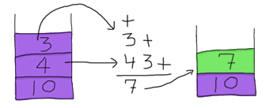
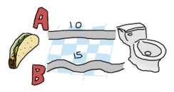
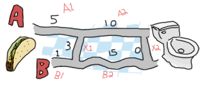

# Functionally Solving Problems

::: 
Sounds like we're ready to do something practical with all that Erlang juice we drank. Nothing new is going to be shown but how to apply bits of what we've seen before. The problems in this chapter were taken from Miran's [Learn You a Haskell](http://learnyouahaskell.com/functionally-solving-problems "Miran's chapter"). I decided to take the same solutions so curious readers can compare solutions in Erlang and Haskell as they wish. If you do so, you might find the final results to be pretty similar for two languages with such different syntaxes. This is because once you know functional concepts, they're relatively easy to carry over to other functional languages.
听起来我们已经准备好用我们喝的Erlang果汁做些实际的事情了。除了如何应用我们之前所看到的东西之外，我们不会展示任何新的东西。本章中的问题取自米兰的[Learn You a Haskell](http://learnyouahaskell。com/功能性解决问题“米兰章节”）。我决定采用相同的解决方案，以便好奇的读者可以随心所欲地比较Erlang和Haskell中的解决方案。如果你这样做，你可能会发现两种语法如此不同的语言的最终结果非常相似。这是因为一旦你知道了函数式概念，它们就相对容易被其他函数式语言继承。
:::

## [Reverse Polish Notation Calculator]

Most people have learned to write arithmetic expressions with the operators in-between the numbers (`(2 + 2) / 5`). This is how most calculators let you insert mathematical expressions and probably the notation you were taught to count with in school. This notation has the downside of needing you to know about operator precedence: multiplication and division are more important (have a higher *precedence*) than addition and subtraction.
大多数人已经学会了在数字（`（2+2）/5`）之间使用运算符编写算术表达式。这就是大多数计算器让你插入数学表达式的方式，可能还有你在学校里学过的计数法。这种表示法的缺点是需要了解运算符的优先级：乘法和除法比加法和减法更重要（具有更高的*优先级*）。

Another notation exists, called *prefix notation* or *Polish notation*, where the operator comes before the operands. Under this notation, `(2 + 2) / 5` would become `(/ (+ 2 2) 5)`. If we decide to say `+` and `/` always take two arguments, then `(/ (+ 2 2) 5)` can simply be written as `/ + 2 2 5`.
存在另一种表示法，称为*前缀表示法*或*波兰表示法*，其中运算符位于操作数之前。在这个符号下，`（2+2）/5`将变成`（/（+2）5）`。如果我们决定说“+”和“/”总是取两个参数，那么“（/（+2）5）”可以简单地写成“/+2 5”`。

However, we will instead focus on *Reverse Polish notation* (or just *RPN*), which is the opposite of prefix notation: the operator follows the operands. The same example as above in RPN would be written `2 2 + 5 /`. Other example expressions could be `9 * 5 + 7` or `10 * 2 * (3 + 4) / 2` which get translated to `9 5 * 7 +` and `10 2 * 3 4 + * 2 /`, respectively. This notation was used a whole lot in early models of calculators as it would take little memory to use. In fact some people still carry RPN calculators around. We'll write one of these.
然而，我们将转而关注*Reverse-Polish notation*（或仅仅是*RPN*），它与前缀表示法相反：运算符跟随操作数。在RPN中，与上面相同的示例将被写为'2+5'/`。其他示例表达式可能是'9*5+7'或'10*2*（3+4）/2'，它们分别被翻译成'95*7+'和'102*34+*2/'。这种符号在早期的计算器模型中被大量使用，因为它几乎不需要内存。事实上，有些人仍然随身携带RPN计算器。我们将写一个。

First of all, it might be good to understand how to read RPN expressions. One way to do it is to find the operators one by one and then regroup them with their operands by arity:
首先，了解如何读取RPN表达式可能会很好。一种方法是一个接一个地找到运算符，然后按算术将它们与操作数重新组合：

``` expand
10 4 3 + 2 * -
10 (4 3 +) 2 * -
10 ((4 3 +) 2 *) -
(10 ((4 3 +) 2 *) -)
(10 (7 2 *) -)
(10 14 -)
-4
```

However, in the context of a computer or a calculator, a simpler way to do it is to make a *stack* of all the operands as we see them. Taking the mathematical expression `10 4 3 + 2 * -`, the first operand we see is `10`; let's push that one on the stack too. Our stack should now look like this:
然而，在计算机或计算器的环境中，一种更简单的方法是将我们看到的所有操作数生成一个*堆栈*。以数学表达式'104 3+2*-'为例，我们看到的第一个操作数是'10'；让我们把它也推到堆栈上。我们的堆栈现在应该如下所示：

![A stack showing the values \[3 4 10\]](../img/stack1.png)

The next character to parse is a `+`. That one is a function of arity 2. In order to use it we will need to feed it two operands, which will be taken from the stack:
下一个要分析的字符是`+`。这是算术2的函数。为了使用它，我们需要向它提供两个操作数，这两个操作数将取自堆栈：



 instead.
所以我们有了结果。这种基于堆栈的方法相对简单，在开始计算结果之前需要进行的解析量很低，这解释了为什么旧计算器使用这种方法是个好主意。使用RPN还有其他原因，但这有点超出了本指南的范围，所以您可能想点击[Wikipedia文章](http://en。维基百科。org/wiki/Reverse_Polish_notation）。

Writing this solution in Erlang is not too hard once we've done the complex stuff. It turns out the tough part is figuring out what steps need to be done in order to get our end result and we just did that. Neat. Open a file named `calc.erl`.
一旦我们完成了复杂的工作，用Erlang编写这个解决方案就不难了。事实证明，最困难的部分是找出需要采取哪些步骤才能得到最终结果，而我们就是这么做的。整洁的。打开一个名为“calc”的文件。呃`。

The first part to worry about is how we're going to represent a mathematical expression. To make things simple, we'll probably input them as a string: `"10 4 3 + 2 * -"`. This string has whitespace, which isn't part of our problem-solving process, but is necessary in order to use a simple tokenizer. What would be usable then is a list of terms of the form `["10","4","3","+","2","*","-"]` after going through the tokenizer. Turns out the function `string:tokens/2` does just that:
我们首先要担心的是，数学表达式是如何表示的。为了简单起见，我们可能会将它们作为字符串输入：`“10 4 3+2*-”`。这个字符串有空格，这不是我们解决问题过程的一部分，但对于使用简单的标记器来说是必要的。然后，在经过标记器之后，可用的是一个形式为“[“10”、“4”、“3”、“+”、“2”、“*”、“-”]”的术语列表。原来函数'string:tokens/2'就是这样做的：

```eshell
1> string:tokens("10 4 3 + 2 * -", " ").
["10","4","3","+","2","*","-"]
```

That will be a good representation for our expression. The next part to define is the stack. How are we going to do that? You might have noticed that Erlang's lists act a lot like a stack. Using the cons (`|`) operator in `[Head|Tail]` effectively behaves the same as pushing `Head`, in this case). Using a list for a stack will be good enough.
这将是一个很好的表达方式。下一个要定义的部分是堆栈。我们要怎么做？您可能已经注意到，Erlang的列表的行为非常像一个堆栈。使用“[Head | Tail]”中的cons（“|”操作符有效地表现出与按下“Head”相同的行为，在本例中）。使用列表作为堆栈就足够了。

To read the expression, we just have to do the same as we did when solving the problem by hand. Read each value from the expression, if it's a number, put it on the stack. If it's a function, pop all the values it needs from the stack, then push the result back in. To generalize, all we need to do is go over the whole expression as a loop only once and accumulate the results. Sounds like the perfect job for a fold!
要阅读这个表达式，我们只需要做与手工解决问题相同的事情。从表达式中读取每个值，如果是数字，则将其放入堆栈中。如果它是一个函数，从堆栈中弹出它需要的所有值，然后将结果推回。为了推广，我们只需要把整个表达式作为一个循环遍历一次，然后积累结果。听起来是一份完美的工作！

What we need to plan for is the function that `lists:foldl/3` will apply on every operator and operand of the expression. This function, because it will be run in a fold, will need to take two arguments: the first one will be the element of the expression to work with and the second one will be the stack.
我们需要计划的是一个函数，`lists:foldl/3`将应用于表达式的每个运算符和操作数。由于该函数将在折叠中运行，因此需要接受两个参数：第一个参数是要使用的表达式的元素，第二个参数是堆栈。

We can start writing our code in the `calc.erl` file. We'll write the function responsible for all the looping and also the removal of spaces in the expression:
我们可以开始在calc中编写代码了。文件。我们将编写一个函数，负责表达式中的所有循环和空格的删除：

```erl
-module(calc).
-export([rpn/1]).

rpn(L) when is_list(L) ->
    [Res] = lists:foldl(fun rpn/2, [], string:tokens(L, " ")),
    Res.
```

We'll implement `rpn/2` next. Note that because each operator and operand from the expression ends up being put on top of the stack, the solved expression's result will be on that stack. We need to get that last value out of there before returning it to the user. This is why we pattern match over `[Res]` and only return `Res`.
下一步我们将实现'rpn/2'。请注意，因为表达式中的每个运算符和操作数最终都被放在堆栈的顶部，所以已求解表达式的结果将在该堆栈上。在返回给用户之前，我们需要得到最后一个值。这就是为什么我们在“[Res]”上进行模式匹配，并且只返回“Res”`。

Alright, now to the harder part. Our `rpn/2` function will need to handle the stack for all values passed to it. The head of the function will probably look like `rpn(Op,Stack)` and its return value like `[NewVal|Stack]`. When we get regular numbers, the operation will be:
好了，现在来看看更难的部分。我们的`rpn/2`函数需要处理传递给它的所有值的堆栈。函数的头部可能看起来像`rpn（Op，Stack）`而其返回值则像`[NewVal | Stack]`。当我们得到常规数字时，操作将是：

```erl
rpn(X, Stack) -> [read(X)|Stack].
```

Here, `read/1` is a function that converts a string to an integer or floating point value. Sadly, there is no built-in function to do this in Erlang (only one or the other). We'll add it ourselves:
在这里，`read/1`是一个将字符串转换为整数或浮点值的函数。遗憾的是，在Erlang中没有内置函数来实现这一点（只有一个或另一个）。我们将自己添加：

```erl
read(N) ->
    case string:to_float(N) of
         -> list_to_integer(N);
         -> F
    end.
```

Where `string:to_float/1` does the conversion from a string such as `"13.37"``. When that happens, we need to call `list_to_integer/1` instead.
其中，`string:to_float/1`执行从字符串（如`“13”）的转换。37"``。当这种情况发生时，我们需要调用'list_to_integer/1'。

Now back to `rpn/2`. The numbers we encounter all get added to the stack. However, because our pattern matches on anything (see [Pattern Matching](syntax-in-functions.html#pattern-matching)), operators will also get pushed on the stack. To avoid this, we'll put them all in preceding clauses. The first one we'll try this with is the addition:
现在回到`rpn/2`。我们遇到的数字都被添加到堆栈中。然而，因为我们的模式匹配任何东西（参见[pattern Matching]（函数中的语法）。html#模式匹配），操作符也会被推到堆栈上。为了避免这种情况，我们将把它们全部放在前面的条款中。我们将尝试的第一个方法是添加：

```erl
rpn("+", [N1,N2|S]) -> [N2+N1|S];
rpn(X, Stack) -> [read(X)|Stack].
```

We can see that whenever we encounter the `"+"` string, we take two numbers from the top of the stack (`N1`) and add them before pushing the result back onto that stack. This is exactly the same logic we applied when solving the problem by hand. Trying the program we can see that it works:
我们可以看到，每当遇到“+”字符串时，我们都会从堆栈顶部（`N1`）取两个数字，然后将它们相加，然后再将结果推回到该堆栈上。这与我们手工解决问题时采用的逻辑完全相同。尝试这个程序我们可以看到它是有效的：

```eshell
1> c(calc).

2> calc:rpn("3 5 +").
8
3> calc:rpn("7 3 + 5 +").
15
```

The rest is trivial, as you just need to add all the other operators:

```erl
rpn("+", [N1,N2|S]) -> [N2+N1|S];
rpn("-", [N1,N2|S]) -> [N2-N1|S];
rpn("*", [N1,N2|S]) -> [N2*N1|S];
rpn("/", [N1,N2|S]) -> [N2/N1|S];
rpn("^", [N1,N2|S]) -> [math:pow(N2,N1)|S];
rpn("ln", [N|S])    -> [math:log(N)|S];
rpn("log10", [N|S]) -> [math:log10(N)|S];
rpn(X, Stack) -> [read(X)|Stack].
```

Note that functions that take only one argument such as logarithms only need to pop one element from the stack. It is left as an exercise to the reader to add functions such as 'sum' or 'prod' which return the sum of all the elements read so far or the products of them all. To help you out, they are implemented in my version of `calc.erl` already.
请注意，只接受一个参数（例如对数）的函数只需要从堆栈中弹出一个元素。读者可以通过添加“sum”或“prod”等函数来练习，这些函数返回到目前为止读取的所有元素的总和或它们的乘积。为了帮助您，它们在我的“calc”版本中实现。呃，已经。

To make sure this all works fine, we'll write very simple unit tests. Erlang's `=` operator can act as an *assertion* function. Assertions should crash whenever they encounter unexpected values, which is exactly what we need. Of course, there are more advanced testing frameworks for Erlang, including [Common Test](http://erlang.org/doc/apps/common_test/write_test_chapter.html "Common Test's user guide"). We'll check them out later, but for now the basic `=` will do the job:
为了确保一切正常，我们将编写非常简单的单元测试。Erlang的`=`运算符可以充当*断言*函数。断言在遇到意外值时就会崩溃，这正是我们所需要的。当然，还有更高级的Erlang测试框架，包括[Common Test](http://erlang。org/doc/apps/common_test/write_test_章。html“通用测试用户指南”）。我们稍后会查看它们，但目前基本的“=”将完成这项工作：

```erl
rpn_test() ->
    5 = rpn("2 3 +"),
    87 = rpn("90 3 -"),
    -4 = rpn("10 4 3 + 2 * -"),
    -2.0 = rpn("10 4 3 + 2 * - 2 /"),
    ok = try
        rpn("90 34 12 33 55 66 + * - +")
    catch
        error: -> ok
    end,
    4037 = rpn("90 34 12 33 55 66 + * - + -"),
    8.0 =  rpn("2 3 ^"),
    true = math:sqrt(2) == rpn("2 0.5 ^"),
    true = math:log(2.7) == rpn("2.7 ln"),
    true = math:log10(2.7) == rpn("2.7 log10"),
    50 = rpn("10 10 10 20 sum"),
    10.0 = rpn("10 10 10 20 sum 5 /"),
    1000.0 = rpn("10 10 20 0.5 prod"),
    ok.
```

The test function tries all operations; if there's no exception raised, the tests are considered successful. The first four tests check that the basic arithmetic functions work right. The fifth test specifies behaviour I have not explained yet. The `try ... catch` expects a badmatch error to be thrown because the expression can't work:
测试函数尝试所有操作；如果没有出现异常，则认为测试成功。前四个测试检查基本的算术函数是否正常工作。第五个测试指定了我尚未解释的行为。“试试看。。。catch`由于表达式无法工作，因此期望抛出错误匹配错误：

``` expand
90 34 12 33 55 66 + * - +
90 (34 (12 (33 (55 66 +) *) -) +)
```

At the end of `rpn/1`, the values `-3947` that hangs there. Two ways to handle this problem are possible: either ignore it and only take the value on top of the stack (which would be the last result calculated) or crash because the arithmetic is wrong. Given Erlang's policy is to let it crash, it's what was chosen here. The part that actually crashes is the `[Res]` in `rpn/1`. That one makes sure only one element, the result, is left in the stack.
在“rpn/1”的末尾，挂起的值是“-3947”。有两种方法可以处理这个问题：要么忽略它，只取堆栈顶部的值（这将是最后计算的结果），要么因为算法错误而崩溃。考虑到Erlang的政策是让它崩溃，这里选择了它。真正崩溃的部分是rpn/1中的“[Res]”`。这样可以确保堆栈中只剩下一个元素，即结果。

The few tests that are of the form `true = FunctionCall1 == FunctionCall2` are there because you can't have a function call on the left hand side of `=`. It still works like an assert because we compare the comparison's result to `true`.
这里有几个形式为'true=functionall1==functionall2'的测试，因为您不能在`=`。它仍然像断言一样工作，因为我们将比较的结果与'true'进行比较`。

I've also added the test cases for the sum and prod operators so you can exercise yourselves implementing them. If all tests are successful, you should see the following:
我还添加了sum和prod运算符的测试用例，这样您就可以练习如何实现它们了。如果所有测试都成功，您应该看到以下内容：

```eshell
1> c(calc).

2> calc:rpn_test().
ok
3> calc:rpn("1 2 ^ 2 2 ^ 3 2 ^ 4 2 ^ sum 2 -").
28.0
```

Where `28` is indeed equal to `sum(1² + 2² + 3² + 4²) - 2`. Try as many of them as you wish.

One thing that could be done to make our calculator better would be to make sure it raises `badarith` errors when it crashes because of unknown operators or values left on the stack, rather than our current `badmatch` error. It would certainly make debugging easier for the user of the calc module.
要使我们的计算器更好，可以做的一件事是确保它在因堆栈上的未知运算符或值而崩溃时引发“badarith”错误，而不是当前的“badmatch”错误。这肯定会让calc模块的用户更容易调试。

## [Heathrow to London]

Our next problem is also taken from [Learn You a Haskell](http://learnyouahaskell.com/functionally-solving-problems#heathrow-to-london). You're on a plane due to land at Heathrow airport in the next hours. You have to get to London as fast as possible; your rich uncle is dying and you want to be the first there to claim dibs on his estate.
我们的下一个问题也是从[Learn You a Haskell](http://learnyouahaskell。com/功能性解决问题#希思罗机场至伦敦）。你在一架将在未来几个小时降落在希思罗机场的飞机上。你必须尽快到达伦敦；你富有的叔叔快死了，你想成为第一个在他的财产上有发言权的人吗。

There are two roads going from Heathrow to London and a bunch of smaller streets linking them together. Because of speed limits and usual traffic, some parts of the roads and smaller streets take longer to drive on than others. Before you land, you decide to maximize your chances by finding the optimal path to his house. Here's the map you've found on your laptop:
从希思罗机场到伦敦有两条路，还有一些较小的街道将它们连接在一起。由于速度限制和通常的交通状况，一些路段和较小街道的行驶时间比其他路段要长。在你降落之前，你决定通过找到通往他家的最佳路径来最大化你的机会。这是你在笔记本电脑上找到的地图：


:
在阅读了在线书籍之后，你成为了Erlang的超级粉丝，你决定用这种语言来解决这个问题。为了更方便地使用地图，可以按照以下方式在名为[road]的文件中输入数据。txt]（静态/二郎/道路）。txt）：

``` expand
50
10
30
5
90
20
40
2
25
10
8
0
```

The road is laid in the pattern: `A1, B1, X1, A2, B2, X2, ..., An, Bn, Xn`, where `X``.

The next thing you realize is that it's worth nothing to try to solve this problem in Erlang when you don't know how to solve it by hand to begin with. In order to do this, we'll use what recursion taught us.
接下来你会意识到，当你不知道如何用手解决这个问题时，在Erlang中尝试解决这个问题是毫无价值的。为了做到这一点，我们将使用递归教给我们的东西。

When writing a recursive function, the first thing to do is to find our base case. For our problem at hand, this would be if we had only one tuple to analyze, that is, if we only had to choose between `A`, which in this case is useless because we're at destination):
编写递归函数时，首先要做的是找到基本情况。对于我们手头的问题，这将是如果我们只有一个元组要分析，也就是说，如果我们只需要在'A'之间进行选择，在这种情况下，它是无用的，因为我们在目的地）：



Then the choice is only between picking which of path A or path B is the shortest. If you've learned your recursion right, you know that we ought to try and converge towards the base case. This means that on each step we'll take, we'll want to reduce the problem to choosing between A and B for the next step.
然后，我们只能选择路径A或路径B中最短的一条。如果你已经正确地学习了递归，你就会知道我们应该努力向基本情况收敛。这意味着，在我们将要采取的每一步中，我们都希望将问题简化为下一步在A和B之间进行选择。

Let's extend our map and start over:




Ah! It gets interesting! How can we reduce the triple `).

Alright! What we've got is a length `4`). To make a decision, I suggest we do the same as before. Now you don't have much choice but to obey, given I'm the guy writing this text. Here we go!
好吧我们得到的长度是'4'）。为了做出决定，我建议我们像以前一样做。现在你别无选择，只能服从，因为我是写这篇文章的人。开始！

All possible paths to take in this case can be found in the same way as the previous one. We can get to the next point A by either taking the path `A2` (`16 = 1 + 15 + 0`). In this case, the path `[B, X, A]` is better than `[B, B, X]`.
在这种情况下，所有可能的路径都可以通过与前一条相同的方式找到。我们可以通过路径'A2'（'16=1+15+0'）到达下一个点A。在本例中，路径“[B，X，A]”比“[B，B，X]好`。


We can also get to the next point B by either taking the path `A2` (`16 = 1 + 15`). Here, the best path is to pick the first option, `[B, X, A, X]`.
我们也可以通过路径'A2'（'16=1+15'）到达下一个点B。在这里，最好的方法是选择第一个选项，`[B，X，A，X]`。

So when this whole process is done, we're left with two paths, A or B, both of length `14`. Either of them is the right one. The last selection will always have two paths of the same length, given the last X segment has a length 0. By solving our problem recursively, we've made sure to always get the shortest path at the end. Not too bad, eh?
所以当整个过程完成后，我们剩下两条路径，A或B，长度都是14`。他们中的任何一个都是对的。如果最后一个X段的长度为0，则最后一个选择将始终具有相同长度的两条路径。通过递归地解决我们的问题，我们确保在最后总是得到最短的路径。还不错吧？

Subtly enough, we've given ourselves the basic logical parts we need to build a recursive function. You can implement it if you want, but I promised we would have very few recursive functions to write ourselves. We'll use a fold.
非常微妙的是，我们已经为自己提供了构建递归函数所需的基本逻辑部分。如果你想的话，你可以实现它，但我保证我们自己编写的递归函数很少。我们将使用折叠。

::: note
**Note:** while I have shown folds being used and constructed with lists, folds represent a broader concept of iterating over a data structure with an accumulator. As such, folds can be implemented over trees, dictionaries, arrays, database tables, etc.
**注：*虽然我已经展示了折叠的使用和列表构造，但折叠代表了一个更广泛的概念，即使用累加器在数据结构上迭代。因此，折叠可以在树、字典、数组、数据库表等上实现。

It is sometimes useful when experimenting to use abstractions like maps and folds; they make it easier to later change the data structure you use to work with your own logic.
在尝试使用地图和折叠等抽象概念时，它有时很有用；它们使以后更容易更改用于处理自己逻辑的数据结构。
:::

So where were we? Ah, yes! We had the file we're going to feed as input ready. To do file manipulations, the [file module](http://erldocs.com/18.0/kernel/file.html) is our best tool. It contains many functions common to many programming languages in order to deal with files themselves (setting permissions, moving files around, renaming and deleting them, etc.)
我们去哪了？啊，是的！我们准备好了要输入的文件。要进行文件操作，[file module](http://erldocs。com/18。0/内核/文件。html）是我们最好的工具。它包含许多编程语言通用的功能，用于处理文件本身（设置权限、移动文件、重命名和删除文件等）。)

It also contains the usual functions to read and/or write from files such as: `file:open/2` and `file:close/1` to do as their names say (opening and closing files!), `file:read/2` to get the content a file (either as string or a binary), `file:read_line/1` to read a single line, `file:position/3` to move the pointer of an open file to a given position, etc.
它还包含从文件中读取和/或写入的常用函数，例如：`file:open/2`和`file:close/1`以按照其名称执行（打开和关闭文件！）`file:read/2`获取文件内容（字符串或二进制文件），`file:read_line/1`读取单行，`file:position/3`将打开文件的指针移动到给定位置，等等。

There's a bunch of shortcut functions in there too, such as `file:read_file/1` (opens and reads the contents as a binary), `file:consult/1` (opens and parses a file as Erlang terms) or `file:pread/2` (changes a position and then reads) and `pwrite/2` (changes the position and writes content).
其中还有一系列快捷功能，例如“file:read_file/1”（以二进制形式打开并读取内容）、“file:consult/1”（以Erlang术语打开并解析文件）或“file:pread/2”（更改位置然后读取）和“pwrite/2”（更改位置并写入内容）。

With all these choices available, it's going to be easy to find a function to read our [road.txt](static/erlang/road.txt) file. Because we know our road is relatively small, we're going to call `file:read_file("road.txt").'`:
有了所有这些选项，就很容易找到一个函数来读取我们的[road]。txt]（静态/二郎/道路）。txt）文件。因为我们知道我们的道路相对较小，所以我们将称之为'file:read_file（“道路”）。txt“）。'`:

```eshell
1>  = file:read_file("road.txt").

2> S = string:tokens(binary_to_list(Binary), "\r\n\t ").
["50","10","30","5","90","20","40","2","25","10","8","0"]
```

Note that in this case, I added a space (`" "`) and a tab (`"\t"`) to the valid tokens so the file could have been written in the form `"50 10 30 5 90 20 40 2 25 10 8 0"` too. Given that list, we'll need to transform the strings into integers. We'll use a similar manner to what we used in our RPN calculator:
请注意，在本例中，我在有效令牌中添加了一个空格（``）和一个制表符（`\t`），这样文件也可以以“50 10 30 5 90 20 40 2 25 10 8 0”的形式写入。根据这个列表，我们需要将字符串转换成整数。我们将使用与RPN计算器类似的方式：

```eshell
3> [list_to_integer(X) || X <- S].
[50,10,30,5,90,20,40,2,25,10,8,0]
```

Let's start a new module called [road.erl](static/erlang/road.erl.html) and write this logic down:

```erl
-module(road).
-compile(export_all).

main() ->
    File = "road.txt",
     = file:read_file(File),
    parse_map(Bin).

parse_map(Bin) when is_binary(Bin) ->
    parse_map(binary_to_list(Bin));
parse_map(Str) when is_list(Str) ->
    [list_to_integer(X) || X <- string:tokens(Str,"\r\n\t ")].
```

The function `main/0` is here responsible for reading the content of the file and passing it on to `parse_map/1`. Because we use the function `file:read_file/1` to get the contents out of [road.txt](static/erlang/road.txt), the result we obtain is a binary. For this reason, I've made the function `parse_map/1` match on both lists and binaries. In the case of a binary, we just call the function again with the string being converted to a list (our function to split the string works on lists only.)
函数“main/0”在这里负责读取文件的内容，并将其传递给“parse_map/1”`。因为我们使用函数'file:read_file/1'将内容从[road]中取出。txt]（静态/二郎/道路）。txt），我们得到的结果是二进制的。出于这个原因，我在列表和二进制文件中都使函数'parse_map/1'匹配。对于二进制文件，我们只需再次调用函数，将字符串转换为列表（拆分字符串的函数仅适用于列表）。)

The next step in parsing the map would be to regroup the data into the `` form described earlier. Sadly, there's no simple generic way to pull elements from a list 3 at a time, so we'll have to pattern match our way in a recursive function in order to do it:
解析映射的下一步是将数据重新组合成前面描述的``形式。遗憾的是，没有简单的通用方法一次从列表3中提取元素，因此我们必须在递归函数中进行模式匹配：

```erl
group_vals([], Acc) ->
    lists:reverse(Acc);
group_vals([A,B,X|Rest], Acc) ->
    group_vals(Rest, [ | Acc]).
```

That function works in a standard tail-recursive manner; there's nothing too complex going on here. We'll just need to call it by modifying `parse_map/1` a bit:
该函数以标准的尾部递归方式工作；这里没有太复杂的事情。我们只需要稍微修改一下'parse_map/1'即可调用它：

```erl
parse_map(Bin) when is_binary(Bin) ->
    parse_map(binary_to_list(Bin));
parse_map(Str) when is_list(Str) ->
    Values = [list_to_integer(X) || X <- string:tokens(Str,"\r\n\t ")],
    group_vals(Values, []).
```

If we try and compile it all, we should now have a road that makes sense:

```eshell
1> c(road).

2> road:main().
[]
```

Ah yes, that looks right. We get the blocks we need to write our function that will then fit in a fold. For this to work, finding a good accumulator is necessary.
啊，是的，看起来不错。我们得到了编写函数所需的模块，这些模块将适合折叠。要使其发挥作用，必须找到一个好的蓄能器。

To decide what to use as an accumulator, the method I find the easiest to use is to imagine myself in the middle of the algorithm while it runs. For this specific problem, I'll imagine that I'm currently trying to find the shortest path of the second triple (``). To decide on which path is the best, I need to have the result from the previous triple. Luckily, we know how to do it, because we don't need an accumulator and we got all that logic out already. So for A:
要决定使用什么作为累加器，我发现最容易使用的方法是想象自己在算法运行时处于中间。对于这个特定的问题，我将想象我正在努力寻找第二个三元组（``）的最短路径。为了决定哪条路径是最好的，我需要得到上一个三元组的结果。幸运的是，我们知道怎么做，因为我们不需要累加器，我们已经把所有的逻辑都弄出来了。所以对于一个：

 yet!")


So now we know that the current best path coming from A is `[B, X]`. We also know it has a length of 40. For B, the path is simply `[B]` and the length is 10. We can use this information to find the next best paths for A and B by reapplying the same logic, but counting the previous ones in the expression. The other data we need is the path traveled so we can show it to the user. Given we need two paths (one for A and one for B) and two accumulated lengths, our accumulator can take the form ``. That way, each iteration of the fold has access to all the state and we build it up to show it to the user in the end.
所以现在我们知道，当前来自A的最佳路径是“[B，X]`。我们也知道它的长度是40。对于B，路径就是“[B]”，长度是10。我们可以利用这些信息，通过重新应用相同的逻辑，但计算表达式中之前的路径，来找到A和B的次优路径。我们需要的另一个数据是经过的路径，这样我们就可以向用户显示它。考虑到我们需要两条路径（一条用于A，一条用于B）和两个累积长度，我们的累加器可以采用以下形式``。这样，折叠的每一次迭代都可以访问所有状态，我们构建它，最终向用户展示它。

This gives us all the parameters our function will need: the ``.

Putting this into code in order to get our accumulator can be done the following way:

```erl
shortest_step() ->
    OptA1 = ,
    OptA2 = ,
    OptB1 = ,
    OptB2 = ,
    .
```

Here, `OptA1` get the similar treatment for point B. Finally, we return the accumulator with the paths obtained.
这里，`OptA1`对B点进行类似的处理。最后，我们返回累加器和获得的路径。

About the paths saved in the code above, note that I decided to use the form `[`.) This is because we're in a fold, which is tail recursive: the whole list is reversed, so it is necessary to put the last one traversed before the others.
关于上面代码中保存的路径，请注意，我决定使用表单`[`。)这是因为我们处于一个尾部递归的折叠中：整个列表是反向的，所以有必要将最后一个遍历的列表放在其他列表之前。

Finally, I use `erlang:min/2` to find the shortest path. It might sound weird to use such a comparison function on tuples, but remember that every Erlang term can be compared to any other! Because the length is the first element of the tuple, we can sort them that way.
最后，我使用'erlang:min/2'来寻找最短路径。对元组使用这样的比较函数听起来可能很奇怪，但请记住，每个Erlang术语都可以与任何其他术语进行比较！因为长度是元组的第一个元素，所以我们可以这样对它们进行排序。

What's left to do is to stick that function into a fold:

```erl
optimal_path(Map) ->
    , Map),
     -> A;
                      hd(element(2,B)) =/=  -> B
                   end,
    lists:reverse(Path).
```

At the end of the fold, both paths should end up having the same distance, except one's going through the final ``. Picking the path with the fewest steps (compare with `length/1`) would also work. Once the shortest one has been selected, it is reversed (it was built in a tail-recursive manner; you **must** reverse it). You can then display it to the world, or keep it secret and get your rich uncle's estate. To do that, you have to modify the main function to call `optimal_path/1`. Then it can be compiled.
在折叠结束时，两条路径应该有相同的距离，除了一条通过最后一条``。选择步数最少的路径（与“长度/1”相比）也可以。一旦选择了最短的一个，它就会反转（它是以尾部递归的方式构建的；您**必须**反转它）。你可以把它展示给全世界，或者保守秘密，得到你富有叔叔的遗产。要做到这一点，必须修改main函数以调用'optimal_path/1'`。然后就可以编译了。

```erl
main() ->
    File = "road.txt",
     = file:read_file(File),
    optimal_path(parse_map(Bin)).
```

Oh, look! We've got the right answer! Great Job!

```eshell
1> c(road).

2> road:main().
[]
```

Or, to put it in a visual way:

![The shortest path, going through \[b,x,a,x,b,b\]](../img/road1.4.png)

But you know what would be really useful? Being able to run our program from outside the Erlang shell. We'll need to change our main function again:
但你知道什么才是真正有用的吗？能够在Erlang外壳之外运行我们的程序。我们需要再次更改主要功能：

```erl
main([FileName]) ->
     = file:read_file(FileName),
    Map = parse_map(Bin),
    io:format("~p~n",[optimal_path(Map)]),
    erlang:halt().
```

The main function now has an arity of 1, needed to receive parameters from the command line. I've also added the function `erlang:halt/0`, which will shut down the Erlang VM after being called. I've also wrapped the call to `optimal_path/1` into `io:format/2` because that's the only way to have the text visible outside the Erlang shell.
现在，main函数的arity为1，需要从命令行接收参数。我还添加了函数“erlang:halt/0”，它将在被调用后关闭erlang虚拟机。我还将对'optimal_path/1'的调用包装为'io:format/2'，因为这是让文本在Erlang shell之外可见的唯一方法。

With all of this, your [road.erl](static/erlang/road.erl.html) file should now look like this (minus comments):
有了这些，你的路。erl]（静态/二郎/道路）。呃。html）文件现在应该如下所示（减去注释）：

```erl
-module(road).
-compile(export_all).

main([FileName]) ->
     = file:read_file(FileName),
    Map = parse_map(Bin),
    io:format("~p~n",[optimal_path(Map)]),
    erlang:halt(0).

%% Transform a string into a readable map of triples
parse_map(Bin) when is_binary(Bin) ->
    parse_map(binary_to_list(Bin));
parse_map(Str) when is_list(Str) ->
    Values = [list_to_integer(X) || X <- string:tokens(Str,"\r\n\t ")],
    group_vals(Values, []).

group_vals([], Acc) ->
    lists:reverse(Acc);
group_vals([A,B,X|Rest], Acc) ->
    group_vals(Rest, [ | Acc]).

%% Picks the best of all paths, woo!
optimal_path(Map) ->
    , Map),
     -> A;
                      hd(element(2,B)) =/=  -> B
                   end,
    lists:reverse(Path).

%% actual problem solving
%% change triples of the form 
%% where A,B,X are distances and a,b,x are possible paths
%% to the form .
shortest_step() ->
    OptA1 = ,
    OptA2 = ,
    OptB1 = ,
    OptB2 = ,
    .
```

And running the code:

```eshell
$ erlc road.erl
$ erl -noshell -run road main road.txt
[]
```

And yep, it's right! It's pretty much all you need to do to get things to work. You could make yourself a bash/batch file to wrap the line into a single executable, or you could check out [escript](http://erlang.org/doc/man/escript.html) to get similar results.
是的，没错！这几乎是所有你需要做的事情来让事情运转起来。您可以创建一个bash/batch文件，将该行打包成一个可执行文件，也可以查看[escript](http://erlang。org/doc/man/escript。html）以获得类似的结果。

As we've seen with these two exercises, solving problems is much easier when you break them off in small parts that you can solve individually before piecing everything together. It's also not worth much to go ahead and program something without understanding it. Finally, a few tests are always appreciated. They'll let you make sure everything works fine and will let you change the code without changing the results at the end.
正如我们在这两个练习中所看到的，当你把问题分解成小部分，在把所有问题拼凑在一起之前，你可以单独解决问题，这样解决问题就容易多了。在不理解的情况下继续编写程序也没有多大价值。最后，一些测试总是值得赞赏的。他们会让你确保一切正常，并让你在不改变最终结果的情况下更改代码。
