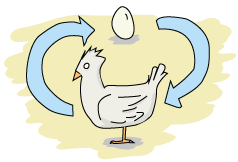

# Mnesia And The Art of Remembering

You're the closest friend of a man with friends. Many of them. Some for a very long time, much like you. They come from all around the world, ranging from Sicily to New York. Friends pay their respects, care about you and your friend, and you both care about them back.
你是一个有朋友的男人最亲密的朋友。其中很多。有些已经很长时间了，很像你。他们来自世界各地，从西西里岛到纽约。朋友们表达他们的敬意，关心你和你的朋友，你们也同样关心他们。


![模仿“教父”标识，而不是说“教父”](。。/静态/img/代码父亲。（巴布亚新几内亚）

In exceptional circumstances, they ask for favors because you're people of power, people of trust. They're your good friends, so you oblige. However, friendship has a cost. Each favor realized is duly noted, and at some point in the future, you may or may not ask for a service back.
在特殊情况下，他们会要求帮助，因为你是有权力的人，有信任的人。他们是你的好朋友，所以你很乐意。然而，友谊是有代价的。每一个得到的帮助都会被适当地记录下来，在未来的某个时刻，你可能会也可能不会要求回馈。

You always hold your promises, you're a pillar of reliability. That's why they call your friend *boss*, they call you *consigliere*, and why you're leading one of the most respected mafia families.
你的承诺永远是你的支柱。这就是为什么他们称你的朋友为“老板”，称你为“顾问”，以及为什么你领导着一个最受尊敬的黑手党家族。

However, it becomes a pain to remember all your friendships, and as your areas of influence grow across the world, it is increasingly harder to keep track of what friends owe to you, and what you owe to friends.
然而，记住你所有的友谊是一件痛苦的事情，随着你在世界各地的影响力不断扩大，记录朋友欠你什么，以及你欠朋友什么变得越来越困难。

Because you're a helpful counselor, you decide to upgrade the traditional system from notes secretly kept in various places to something using Erlang.
因为你是一位乐于助人的顾问，你决定将传统的系统从秘密保存在不同地方的笔记升级到使用Erlang的系统。

At first you figure using ETS and DETS tables will be perfect. However, when you're out on an overseas trip away from the boss, it becomes somewhat difficult to keep things synchronized.
起初，你认为使用ETS和DETS表格将是完美的。然而，当你在远离老板的海外旅行时，保持事情同步变得有些困难。

You could write a complex layer on top of your ETS and DETS tables to keep everything in check. You could do that, but being human, you know you would make mistakes and write buggy software. Such mistakes are to be avoided when friendship is so important, so you look online to find how to make sure your system works right.
你可以在你的ETS和DETS表上写一个复杂的图层来控制一切。你可以这么做，但作为人类，你知道你会犯错误并编写有缺陷的软件。当友谊如此重要的时候，这样的错误是要避免的，所以你可以上网寻找如何确保你的系统正常工作。

This is when you start reading this chapter, explaining Mnesia, an Erlang distributed database built to solve such problems.
这是你开始阅读本章的时候，解释Mnesia，一个为解决这些问题而构建的Erlang分布式数据库。

## [What's Mnesia]

Mnesia is a layer built on top of ETS and DETS to add a lot of functionality to these two databases. It mostly contains things many developers might end up writing on their own if they were to use them intensively. Features include the ability to write to both ETS and DETS automatically, to both have DETS' persistence and ETS' performance, or having the possibility to replicate the database to many different Erlang nodes automatically.
Mnesia是建立在ETS和DET之上的一个层，为这两个数据库添加了很多功能。它主要包含一些东西，如果开发人员大量使用这些东西，他们最终可能会自己编写。功能包括自动写入ETS和DET的能力，都具有DETS的“持久性和ETS”性能，或者可以将数据库自动复制到许多不同的Erlang节点。

Another feature we've seen to be useful is *transactions*. Transactions basically mean that you're going to be able to do multiple operations on one or more tables as if the process doing them were the only one to have access to the tables. This is going to prove vital as soon as we need to have concurrent operations that mix read and writes as part of a single unit. One example would be reading in the database to see if a username is taken, and then creating the user if it's free. Without transactions, looking inside the table for the value and then registering it counts as two distinct operations that can be messing with each other --- given the right timing, more than one process at a time might believe it has the right to create the unique user, which will lead to a lot of confusion. Transactions solve this problem by allowing many operations to act as a single unit.
我们看到的另一个有用的特性是*事务*。事务基本上意味着你将能够在一个或多个表上执行多个操作，就好像执行这些操作的进程是唯一可以访问这些表的进程一样。一旦我们需要将读写混合作为单个单元的一部分的并发操作，这将被证明是至关重要的。一个例子是读取数据库中的用户名，然后创建免费的用户。在没有事务的情况下，在表中查找值并注册它将被视为两个不同的操作，这两个操作可能会相互干扰——如果时间正确，一次不止一个进程可能会认为它有权创建唯一的用户，这将导致很多混乱。事务通过允许多个操作作为单个单元来解决这个问题。

The nice thing about Mnesia is that it's pretty much the only full-featured database you'll have that will natively store and return any Erlang term out of the box (at the time of this writing). The downside of that is that it will inherit all the limitations of DETS tables in some modes, such as not being able to store more than 2GB of data for a single table on disk (this can in fact be bypassed with a feature called [fragmentation](http://www.erlang.org/doc/apps/mnesia/Mnesia_chap5.html#id75194).)
Mnesia的好处在于，它几乎是您拥有的唯一一个功能齐全的数据库，可以在本机存储并返回任何现成的Erlang术语（在本文撰写时）。这样做的缺点是，在某些模式下，它将继承DETS表的所有限制，例如无法在磁盘上为单个表存储超过2GB的数据（事实上，这可以通过一个名为[碎片]的功能绕过）(http://www。二郎。org/doc/apps/mnesia/mnesia_第5章。html#id75194）。)

If we refer to the CAP theorem, Mnesia sits on the CP side, rather than the AP side, meaning that it won't do eventual consistency, will react rather badly to netsplits in some cases, but will give you strong consistency guarantees if you expect the network to be reliable (and you sometimes shouldn't).
如果我们参考CAP定理，Mnesia位于CP端，而不是AP端，这意味着它不会实现最终的一致性，在某些情况下会对netsplits做出非常糟糕的反应，但如果您希望网络可靠（有时您不应该这样做），它将为您提供强大的一致性保证。

Note that Mnesia is not meant to replace your standard SQL database, and it's also not meant to handle terabytes of data across a large number of data centers as often claimed by the giants of the NoSQL world. Mnesia is rather made for smaller amounts of data, on a limited number of nodes. While it is possible to use it on a ton of nodes, most people find that their practical limits seem to center around 10 or so. You will want to use Mnesia when you know it will run on a fixed number of nodes, have an idea of how much data it will require, and know that you will primarily need to access your data from Erlang in ways ETS and DETS would let you do it in usual circumstances.
请注意，Mnesia并不是要取代标准的SQL数据库，也不是要像NoSQL世界的巨头们经常声称的那样，在大量数据中心处理TB级的数据。Mnesia是为数量有限的节点上的少量数据而设计的。虽然可以在大量节点上使用它，但大多数人发现他们的实际限制似乎集中在10个左右。当您知道Mnesia将在固定数量的节点上运行时，您会想使用它，了解它需要多少数据，并且知道您主要需要以ETS和DETS允许的方式从Erlang访问数据。

Just how close to Erlang is it? Mnesia is centered around the idea of using a record to define a table's structure. Each table can thus store a bunch of similar records, and anything that goes in a record can thus be stored in a Mnesia table, including atoms, pids, references, and so on.
它离二郎有多近？Mnesia的中心思想是使用记录定义表的结构。因此，每个表都可以存储一组类似的记录，记录中的任何内容都可以存储在一个Mnesia表中，包括原子、PID、引用等等。

## [What Should the Store Store]


The first step in using Mnesia is to figure out what kind of table structure we'll want for our mafia friend-tracking application (which I decided to name `mafiapp`). The information we might want to store related to friends will be:
使用Mnesia的第一步是弄清楚我们的mafia friend tracking应用程序（我决定将其命名为“mafiapp”）需要什么样的表结构。我们可能希望存储与朋友相关的信息如下：

-   the friend's name, to know who we're talking to when we ask for a service or when we give one
-   the friend's contact information, to know how to reach them. It can be anything from an e-mail address, a cell phone number, or even notes of where that person likes to hang out
-朋友的联系信息，以了解如何联系他们。它可以是任何东西，从电子邮件地址、手机号码，甚至是那个人喜欢在哪里闲逛的笔记
-   additional information such as when the person was born, their occupation, hobbies, special traits, and so on
-其他信息，如此人的出生时间、职业、爱好、特殊特征等
-   a unique expertise, our friend's forte. This field stands on its own because it's something we want to know explicitly. If someone's expertise or forte is in cooking and we're in dire need of a caterer, we know who to call. If we are in trouble and need to disappear for a while, maybe we'll have friends with expertises such as being able to pilot a plane, being camouflage experts, or possibly being excellent magicians. This could come in handy.
-独特的专业知识，我们朋友的长处。这个领域是独立的，因为它是我们想要明确知道的东西。如果有人擅长烹饪，而我们急需一位餐饮服务商，我们知道该给谁打电话。如果我们遇到麻烦，需要消失一段时间，也许我们会有一些有专长的朋友，比如能够驾驶飞机，成为伪装专家，或者可能成为优秀的魔术师。这可能会派上用场。

Then we have to think of the services between our friends and us. What will we want to know about them? Here's a list of a few things I can think about:
然后我们必须考虑朋友和我们之间的服务。我们想知道关于他们的什么？以下是我能想到的几件事：

1.  Who gave the service. Maybe it's you, the consigliere. Maybe it's the padrino. Maybe it's a friend of a friend, on your behalf. Maybe it's someone who then becomes your friend. We need to know.
1.。谁提供了服务。也许是你，军师。也许是帕德里诺。也许是朋友的朋友，代表你。也许有人会成为你的朋友。我们需要知道。
2.  Who received the service. Pretty much the same as the previous one, but on the receiving end.
3.  When was the service given. It's generally useful to be able to refresh someone's memory, especially when asking for a favor back.
3.。服务是什么时候提供的。通常来说，能够刷新某人的记忆是很有用的，尤其是在要求别人帮个忙的时候。
4.  Related to the previous point, it would be nice to be able to store details regarding the services. It's much nicer (and more intimidating) to remember every tiny detail of the services we gave on top of the date.
4.。与前一点相关，如果能够存储有关服务的详细信息，那就太好了。记住我们在约会前提供的服务的每一个小细节会更好（也更可怕）。

As I mentioned in the previous section, Mnesia is based on records and tables (ETS and DETS). To be exact, you can define an Erlang record and tell Mnesia to turn its definition into a table. Basically, if we decided to have our record take the form:
正如我在上一节中提到的，Mnesia基于记录和表格（ETS和DET）。确切地说，您可以定义一个Erlang记录，并告诉Mnesia将其定义转换为一个表。基本上，如果我们决定以以下形式记录：

```erl
-record(recipe, ).
```

We can then tell Mnesia to create a `recipe` table, which would store any number of `#recipe` records as table rows. I could thus have a recipe for pizza noted as:
然后，我们可以告诉Mnesia创建一个“recipe”表，该表将任意数量的“recipe”记录存储为表行。因此，我可以有一份比萨饼的食谱，上面写着：

```erl
#recipe{name=pizza,
        ingredients=[sauce,tomatoes,meat,dough],
        instructions=["order by phone"]}
```

and a recipe for soup as:

```erl
#recipe{name=soup,
        ingredients=["who knows"],
        instructions=["open unlabeled can, hope for the best"]}
```

And I could insert both of these in the `recipe` table, as is. I could then fetch the same exact records from the table and use them as any other one.
我可以按原样把这两个都放在“菜谱”表中。然后，我可以从表中提取相同的精确记录，并将它们与其他任何记录一样使用。

The primary key, the field by which it is the fastest to look things up in a table, would be the recipe name. that's because `name` is the first item in the record definition for `#recipe`. You'll also notice that in the pizza recipe, I use atoms as ingredients, and in the soup recipe, I use a string. As opposed to SQL tables, Mnesia tables *have no built-in type constraints*, as long as you respect the tuple structure of the table itself.
主键是配方名称，它是在表中查找内容最快的字段。这是因为“name”是“recipe”记录定义中的第一项`。你还会注意到，在披萨食谱中，我使用原子作为配料，在汤食谱中，我使用一根绳子。与SQL表不同，Mnesia表*没有内置的类型约束*，只要您尊重表本身的元组结构。

Anyway, back to our mafia application. How should we represent our friends and services information? Maybe as one table doing everything?
总之，回到我们的黑手党申请。我们应该如何代表我们的朋友和服务信息？也许是一张桌子做所有的事？

```erl
-record(friends, {name,
                  contact=[],
                  info=[],
                  expertise,
                  service=[]}). %  for services?
```

This isn't the best choice possible though. Nesting the data for services within friend-related data means that adding or modifying service-related information will require us to change friends at the same time. This might be annoying to do, especially since services imply at least two people. For each service, we would need to fetch the records for two friends and update them, even if there is no friend-specific information that needs to be modified.
但这并不是最好的选择。将服务数据嵌套在与朋友相关的数据中意味着添加或修改与服务相关的信息将要求我们同时更换朋友。这样做可能会很烦人，尤其是因为服务至少包含两个人。对于每项服务，我们都需要获取两个朋友的记录并进行更新，即使没有需要修改的朋友特定信息。

A more flexible model would use one table for each kind of data we need to store:

```erl
-record(mafiapp_friends, {name,
                          contact=[],
                          info=[],
                          expertise}).
-record(mafiapp_services, {from,
                           to,
                           date,
                           description}).
```

Having two tables should give us all the flexibility we need to search for information, modify it, and with little overhead. Before getting into how to handle all that precious information, we must initialize the tables.
拥有两个表应该会给我们搜索信息、修改信息所需的所有灵活性，而且开销很小。在了解如何处理所有这些宝贵信息之前，我们必须初始化这些表。

::: 
**Don't Drink Too Much Kool-Aid:**\
you'll notice that I prefixed both the `friends` and `services` records with `mafiapp_`. The reason for this is that while records are defined locally within our module, Mnesia tables are global to all the nodes that will be part of its cluster. This implies a high potential for name clashes if you're not careful. As such, it is a good idea to manually namespace your tables.
你会注意到，我在'friends'和'services'记录前面加了'mafiapp'_`。原因是，虽然记录是在我们的模块中本地定义的，但Mnesia表对于将成为其集群一部分的所有节点都是全局的。这意味着如果你不小心，名字冲突的可能性很高。因此，手动命名表的名称空间是一个好主意。
:::

## [From Record to Table]

Now that we know what we want to store, the next logical step is to decide how we're going to store it. Remember that Mnesia is built using ETS and DETS tables. This gives us two means of storage: on disk, or in memory. We have to pick a strategy! Here are the options:
既然我们知道了要存储什么，接下来的逻辑步骤就是决定如何存储它。记住，Mnesia是使用ETS和DETS表构建的。这为我们提供了两种存储方式：磁盘存储或内存存储。我们必须选择一个策略！以下是选项：

ram_copies
:   This option makes it so all data is stored exclusively in ETS, so memory only. Memory should be limited to a theoretical 4GB (and practically around 3GB) for virtual machines compiled on 32 bits, but this limit is pushed further away on 64 bits virtual machines, assuming there is more than 4GB of memory available.
：此选项使所有数据都以独占方式存储在ETS中，因此仅存储在内存中。对于在32位上编译的虚拟机，内存应该限制在理论上的4GB（实际上约为3GB），但在64位虚拟机上，如果可用内存超过4GB，这个限制会被进一步取消。

disc_only_copies
:   This option means that the data is stored only in DETS. Disc only, and as such the storage is limited to DETS' 2GB limit.
：此选项表示数据仅存储在DETS中。仅限光盘，因此存储容量限制为2GB。

disc_copies
:   This option means that the data is stored both in ETS and on disk, so both memory and the hard disk. `disc_copies` tables are *not* limited by DETS limits, as Mnesia uses a complex system of transaction logs and checkpoints that allow to create a disk-based backup of the table in memory.
：此选项意味着数据同时存储在ETS和磁盘上，因此内存和硬盘都是如此。`disc_copies`表*不*受DETS限制，因为Mnesia使用一个复杂的事务日志和检查点系统，允许在内存中创建基于磁盘的表备份。

For our current application, we will go with with `disc_copies`. The reason for this is that we at least need the persistency to disk. The relationships we built with our friends need to be long-lasting, and as such it makes sense to be able to store things persistently. It would be quite annoying to wake up after a power failure, only to find out you've lost all the friendships you worked so hard for. Why just not use `disc_only_copies`, you might ask? Well, having copies in memory is usually nice when we want to do more somewhat complex queries and search, given they can be done without needing to access the disc, which is often the slowest part of any computer memory access, especially if they're hard discs.
对于我们目前的应用程序，我们将使用“光盘拷贝”`。原因是我们至少需要磁盘的持久性。我们与朋友建立的关系需要持久，因此能够持久地存储东西是有意义的。停电后醒来，却发现自己已经失去了所有辛勤工作的友谊，这会让人非常恼火。你可能会问，为什么不使用“光盘拷贝”？嗯，当我们想要进行更复杂的查询和搜索时，在内存中存储副本通常是很好的，因为它们可以在不需要访问光盘的情况下完成，这通常是任何计算机内存访问中最慢的部分，尤其是如果它们是硬盘的话。

There's another hurdle on our path to filling the database with our precious data. Because of how ETS and DETS work, we need to define a table type. The types available bear the same definition as their ETS and DETS counterparts. The options are `set`, `bag`, and `ordered_set`. `ordered_set` specifically is not supported for `disc_only_copies` tables. If you don't remember what these types do, I recommend you look them up in the [ETS chapter](ets.html).
在我们用宝贵的数据填充数据库的道路上还有另一个障碍。由于ETS和DET的工作方式，我们需要定义一个表类型。可用类型与ETS和DETS对应类型具有相同的定义。选项有“set”、“bag”和“ordered_set”`。`“仅光盘拷贝”表不支持“特别订购的拷贝集”。如果您不记得这些类型的功能，我建议您在[ETS章节]（ETS）中查找它们。（html）。

::: note
**Note:** Tables of type `duplicate_bag` are not available for any of the storage types. There is no obvious explanation as to why that is.
**注：*“duplicate_bag”类型的表格不适用于任何存储类型。没有明显的解释来解释为什么会这样。
:::

The good news is that we're pretty much done deciding how we're going to store things. The bad news is that there are still more things to understand about Mnesia before truly getting started.
好消息是，我们已经基本完成了如何储存物品的决定。坏消息是，在真正开始之前，还有更多关于记忆的事情需要了解。

## [Of Schemas and Mnesia]

Although Mnesia can work fine on isolated nodes, it does support distribution and replication to many nodes. To know how to store tables on disk, how to load them, and what other nodes they should be synchronized with, Mnesia needs to have something called a *schema*, holding all that information. By default, Mnesia creates a schema directly in memory when it's created. It works fine for tables that need to live in RAM only, but when your schema needs to survive across many VM restarts, on all the nodes part of the Mnesia cluster, things get a bit more complex.
尽管Mnesia可以在孤立的节点上正常工作，但它确实支持分发和复制到许多节点。为了知道如何在磁盘上存储表，如何加载表，以及它们应该与哪些其他节点同步，Mnesia需要有一个名为*schema*的东西来保存所有这些信息。默认情况下，Mnesia在创建模式时直接在内存中创建模式。它适用于只需要驻留在RAM中的表，但当您的模式需要在多个VM重启中生存时，在Mnesia集群的所有节点上，事情会变得更复杂。


` *before* starting Mnesia. It will create a bunch of files on each node, storing all the table information required. You don't need to be connected to the other nodes when calling it, but they need to be running; the function will set the connections up and get everything working for you.
记忆依赖于模式，但记忆也应该创建模式。这造成了一种奇怪的情况，即模式需要由Mnesia创建，而不需要先运行Mnesia！在实践中作为一个问题来解决是相当简单的。我们只需要在启动mnesia之前调用函数“mnesia:create_schema（ListOfNodes）”。它将在每个节点上创建一组文件，存储所需的所有表信息。调用时不需要连接到其他节点，但它们需要正在运行；该功能将设置连接，让一切为您服务。

By default, the schema will be created in the current working directory, wherever the Erlang node is running. To change this, the Mnesia application has a `dir` variable that can be set to pick where the schema will be stored. You can thus start your node as `erl -name SomeName -mnesia dir where/to/store/the/db` or set it dynamically with `application:set_env(mnesia, dir, "where/to/store/the/db").`
默认情况下，模式将在当前工作目录中创建，无论Erlang节点在哪里运行。为了改变这一点，Mnesia应用程序有一个'dir'变量，可以设置该变量来选择模式存储的位置。因此，您可以将节点启动为`erl-name SomeName-mnesia dir where/to/store/the/db`或使用`application:set_env（mnesia，dir，“where/to/store/the/db”）动态设置它。`

::: note
**Note:** Schemas may fail to be created for the following reasons: one already exists, Mnesia is running on one of the nodes the schema should be on, you can't write to the directory Mnesia wants to write to, and so on.
**注意：*由于以下原因，架构可能无法创建：一个已经存在，Mnesia正在该架构应该位于的一个节点上运行，您无法写入Mnesia想要写入的目录，等等。
:::

Once the schema has been created, we can start Mnesia and begin creating tables. The function `mnesia:create_table/2` is what we need to use. It takes two arguments: the table name and a list of options, some of which are described below.
一旦创建了模式，我们就可以启动Mnesia并开始创建表。我们需要使用函数“mnesia:create_table/2”。它有两个参数：表名和选项列表，下面将介绍其中一些参数。

``
:   This is a list of all the items in a table. By default it takes the form `[key, value]`, meaning you would need a record of the form `-record(TableName, `.
：这是表格中所有项目的列表。默认情况下，它的格式为“[key，value]”，这意味着您需要一个格式为“-record（TableName`。

``,\
``,\
``
:   This is where you specify how to store the tables, as explained in [From Record to Table](mnesia.html#from-record-to-table). Note that you can have many of these options present at once. As an example, I could define a table X to be stored on disk and RAM on my master node, only in RAM on all of the slaves, and only on disk on a dedicated backup node by using all three of the options.
：这是指定如何存储表的地方，如[From Record to Table]（从记录到表）中所述。html#从记录到表）。请注意，您可以同时拥有许多这样的选项。例如，我可以使用这三个选项来定义一个表X，该表X存储在主节点上的磁盘和RAM中，仅存储在所有从节点上的RAM中，并且仅存储在专用备份节点上的磁盘上。

``
:   Mnesia tables let you have *indexes* on top of the basic ETS and DETS functionality. This is useful in cases where you are planning to build searches on record fields other than the primary key. As an example, our friends table will need an index for the expertise field. We can declare such an index as ` groups of ten or less elements, as an example, would be more useful for the resources it uses. Note that you do not need to put an index on the first field of the record, as this is done for you by default.
：Mnesia表格在基本ETS和DETS功能的基础上提供*索引*。如果您计划在主键以外的记录字段上构建搜索，这将非常有用。例如，我们的friends表需要专门知识字段的索引。我们可以将这样一个索引声明为“例如，由十个或更少元素组成的组对它所使用的资源更有用。”。请注意，您不需要在记录的第一个字段上放置索引，因为这是默认情况下为您完成的。

``
:   This is useful if you want to have a table that has a different name than the one your record uses. However, doing so then forces you to use different functions to operate on the table than those commonly used by everyone. I wouldn't recommend using this option, unless you really know you want to.
：如果希望表的名称与记录使用的名称不同，则此选项非常有用。然而，这样做会迫使您使用不同的功能来操作桌面，而不是每个人都常用的功能。我不建议你使用这个选项，除非你真的知道你想这么做。

``
:   `Type`.

``
:   By default, all Mnesia tables have this option set to `false`. You will want to leave it that way if you want the tables and their data replicated on all nodes part of the schema (and those specified in the `disc_copies`, `disc_only_copies` and `ram_copies` options). Setting this option to `true` will create all the tables on all the nodes, but the content will be the local content only; nothing will be shared. In this case, Mnesia becomes an engine to initialize similar empty tables on many nodes.
：默认情况下，所有Mnesia表格都将此选项设置为“false”`。如果希望在模式的所有节点上复制表及其数据（以及在“disc_copies”、“disc_only_copies”和“ram_copies”选项中指定的那些节点），则可以不使用这种方式。将此选项设置为'true'将在所有节点上创建所有表，但内容将仅为本地内容；什么都不会分享。在这种情况下，Mnesia成为一个引擎，可以在许多节点上初始化类似的空表。

To make things short, this is the sequence of events that can happen when setting up your Mnesia schema and tables:
简而言之，以下是设置Mnesia模式和表格时可能发生的一系列事件：

-   Starting Mnesia for the first time creates a schema in memory, which is good for `ram_copies`. Other kinds of tables won't work with it.
-第一次启动Mnesia会在内存中创建一个模式，这有利于“ram_拷贝”`。其他类型的桌子无法使用它。
-   If you create a schema manually before starting Mnesia (or after stopping it), you will be able to create tables that sit on disk.
-如果在启动Mnesia之前（或停止之后）手动创建模式，则可以创建位于磁盘上的表。
-   Start Mnesia, and you can then start creating tables. Tables can't be created while Mnesia is not running
-启动Mnesia，然后就可以开始创建表了。Mnesia未运行时无法创建表

::: note
**Note:** there is a third way to do things. Whenever you have a Mnesia node running and tables created that you would want to port to disk, the function `mnesia:change_table_copy_type(Table, Node, NewType)` can be called to move a table to disk.
**注：*还有第三种方法。每当运行Mnesia节点并创建要移植到磁盘的表时，都可以调用函数“Mnesia:change_table_copy_type（table，node，NewType）”，将表移动到磁盘。

More particularly, if you forgot to create the schema on disk, by calling `mnesia:change_table_copy_type(schema, node(), disc_copies)`, you'll be taking your RAM schema and turning it to a disk schema.
更具体地说，如果您忘记在磁盘上创建模式，通过调用“mnesia:change_table_copy_type（schema，node（），disc_copies）”，您将获得RAM模式并将其转换为磁盘模式。
:::

We now have a vague idea of how to create tables and schemas. This might be enough for us to get started.
我们现在对如何创建表和模式有了模糊的概念。这可能足以让我们开始。

## [Creating Tables for Real]

We'll handle creating the application and its tables with some weak TDD-style programming, using Common Test. Now you might dislike the idea of TDD, but stay with me, we'll do it in a relaxed manner, just as a way to guide our design more than anything else. None of that 'run tests to make sure they fail' business (although you can feel free to do it if you want). That we have tests in the end will just be a nice side-effect, not an end in itself. We'll mostly care about defining the interface of how `mafiapp` should behave and look like, without doing it all from the Erlang shell. The tests won't even be distributed, but it will still be a decent opportunity to get some practical use out of Common Test while learning Mnesia at the same time.
我们将使用一些弱TDD风格的编程，使用公共测试来创建应用程序及其表。现在你可能不喜欢TDD的想法，但请和我在一起，我们将以一种轻松的方式来做这件事，作为指导我们设计的一种方式。这些“运行测试以确保它们失败”的业务都没有（尽管如果你愿意，你可以随意这么做）。我们最终进行测试只是一个很好的副作用，而不是目的本身。我们主要关心的是如何定义“mafiapp”的行为和外观的接口，而不是从Erlang shell中完成所有工作。这些测试甚至不会被分发，但它仍然是一个很好的机会，可以在学习记忆的同时，从普通测试中获得一些实际用途。

For this, we should start a directory named [mafiapp-1.0.0](static/erlang/mafiapp-1.0.0.zip) following the standard OTP structure:
为此，我们应该启动一个名为[mafiapp-1]的目录。0。0]（静态/erlang/mafiapp-1）。0。0。zip）遵循标准OTP结构：

``` expand
ebin/
logs/
src/
test/
```

We'll start by figuring out how we want to install the database. Because there is a need for a schema and initializing tables the first time around, we'll need to set up all the tests with an install function that will ideally install things in Common Test's `priv_dir` directory. Let's begin with a basic test suite, `mafiapp_SUITE`, stored under the `test/` directory:
我们首先要弄清楚如何安装数据库。因为第一次需要一个模式和初始化表，所以我们需要用一个安装函数来设置所有的测试，理想情况下，这个函数将把东西安装在Common Test的“priv_dir”目录中。让我们从一个基本的测试套件“mafiapp_suite”开始，它存储在“test/”目录下：

```erl
-module(mafiapp_SUITE).
-include_lib("common_test/include/ct.hrl").
-export([init_per_suite/1, end_per_suite/1,
         all/0]).
all() -> [].

init_per_suite(Config) ->
    Priv = ?config(priv_dir, Config),
    application:set_env(mnesia, dir, Priv),
    mafiapp:install([node()]),
    application:start(mnesia),
    application:start(mafiapp),
    Config.

end_per_suite(_Config) ->
    application:stop(mnesia),
    ok.
```

This test suite has no test yet, but it gives us our first specification of how things should be done. We first pick where to put the Mnesia schema and database files by setting the `dir` variable to the value of `priv_dir`. This will put each instance of the schema and database in a private directory generated with Common Test, guaranteeing us not to have problems and clashes from earlier test runs. You can also see that I decided to name the install function `install` and to give it a list of nodes to install to. Such a list is generally a better way to do things than hard coding it within the `install` function, as it is more flexible. Once this is done, Mnesia and mafiapp should be started.
这个测试套件还没有测试，但它为我们提供了第一个应该如何做的规范。我们首先通过将'dir'变量的值设置为'priv_dir'来选择将Mnesia模式和数据库文件放在何处`。这将把模式和数据库的每个实例放在使用公共测试生成的私有目录中，保证我们不会遇到早期测试运行中的问题和冲突。您还可以看到，我决定将安装函数命名为“install”，并给它一个要安装的节点列表。这样的列表通常比在“install”函数中硬编码更好，因为它更灵活。一旦完成，就应该启动Mnesia和mafiapp。

We can now get into [src/mafiapp.erl](static/erlang/mafiapp-1.0.0/src/mafiapp.erl.html) and start figuring out how the install function should work. First of all, we'll need to take the record definitions we had earlier and bring them back in:
我们现在可以进入[src/mafiapp]。erl]（静态/erlang/mafiapp-1）。0。0/src/mafiapp。呃。然后开始计算安装函数应该如何工作。首先，我们需要获取之前的记录定义，并将其带回：

```erl
-module(mafiapp).
-export([install/1]).

-record(mafiapp_friends, {name,
                          contact=[],
                          info=[],
                          expertise}).
-record(mafiapp_services, {from,
                           to,
                           date,
                           description}).
```

This looks good enough. Here's the `install/1` function:

```erl
install(Nodes) ->
    ok = mnesia:create_schema(Nodes),
    application:start(mnesia),
    mnesia:create_table(mafiapp_friends,
                        [,
                         ,
                         ]),
    mnesia:create_table(mafiapp_services,
                        [,
                         ,
                         ,
                         ]),
    application:stop(mnesia).
```

First, we create the schema on the nodes specified in the `Nodes``. There's an index on the expertise because we do expect to search friends by expertise in case of need, as mentioned earlier.
首先，我们在`节点'中指定的节点上创建模式``。有一个关于专业知识的索引，因为我们确实希望在需要的情况下根据专业知识搜索朋友，如前所述。


You'll also see that the services table is of type `bag`. This is because It's possible to have multiple services with the same senders and receivers. Using a `set` table, we could only deal with unique senders, but bag tables handle this fine. Then you'll notice there's an index on the `to` field of the table. That's because we expect to look services up either by who received them or who gave them, and indexes allow us to make any field faster to search.
您还会看到服务表的类型是“bag”`。这是因为可以使用相同的发送方和接收方提供多个服务。使用“set”表，我们只能处理唯一的发送者，但包表可以处理这个问题。然后你会注意到在表的“to”字段中有一个索引。这是因为我们希望通过谁接收或提供服务来查找服务，而索引允许我们更快地搜索任何字段。

Last thing to note is that I stop Mnesia after creating the tables. This is just to fit whatever I wrote in the test in terms of behaviour. What was in the test is how I expect to use the code, so I'd better make the code fit that idea. There is nothing wrong with just leaving Mnesia running after the install, though.
最后要注意的是，我在创建表之后停止了记忆。这只是为了符合我在测试中所写的行为。测试内容是我希望如何使用代码，所以我最好让代码符合这个想法。不过，让Mnesia在安装后继续运行并没有什么错。

Now, if we had successful test cases in our Common Test suite, the initialization phase would succeed with this install function. However, trying it with many nodes would bring failure messages to our Erlang shells. Any idea why? Here's what it would look like:
现在，如果我们的公共测试套件中有成功的测试用例，那么这个安装函数的初始化阶段就会成功。然而，在许多节点上尝试它会给我们的Erlang shell带来失败消息。知道为什么吗？下面是它的样子：

```erl
Node A                     Node B
------                     ------
create_schema -----------> create_schema
start Mnesia
creating table ----------> ???
creating table ----------> ???
stop Mnesia
```

For the tables to be created on all nodes, Mnesia needs to run on all nodes. For the schema to be created, Mnesia needs to run on no nodes. Ideally, we could start Mnesia and stop it remotely. The good thing is we can. Remember the RPC module from the [Distribunomicon](distribunomicon.html#rpc)? We have the function `rpc:multicall(Nodes, Module, Function, Args)` to do it for us. Let's change the `install/1` function definition to this one:
对于要在所有节点上创建的表，Mnesia需要在所有节点上运行。要创建模式，Mnesia不需要在任何节点上运行。理想情况下，我们可以启动Mnesia并远程停止它。好在我们可以。还记得[DistributionMicon]（DistributionMicon）中的RPC模块吗。html#rpc）？我们有“rpc:multicall（Nodes，Module，function，Args）”函数来为我们做这件事。让我们将'install/1'函数定义更改为：

```erl
install(Nodes) ->
    ok = mnesia:create_schema(Nodes),
    rpc:multicall(Nodes, application, start, [mnesia]),
    mnesia:create_table(mafiapp_friends,
                        [,
                         ,
                         ]),
    mnesia:create_table(mafiapp_services,
                        [,
                         ,
                         ,
                         ]),
    rpc:multicall(Nodes, application, stop, [mnesia]).
```

Using RPC allows us to do the Mnesia action on all nodes. The scheme now looks like this:

```erl
Node A                     Node B
------                     ------
create_schema -----------> create_schema
start Mnesia ------------> start Mnesia
creating table ----------> replicating table
creating table ----------> replicating table
stop Mnesia -------------> stop Mnesia
```

Good, very good.

The next part of the `init_per_suite/1` function we have to take care of is starting `mafiapp`. Properly speaking, there is no need to do it because our entire application depends on Mnesia: starting Mnesia is starting our application. However, there can be a noticeable delay between the time Mnesia starts and the time it finishes loading all tables from disk, especially if they're large. In such circumstances, a function such as `mafiapp`'s `start/2` might be the perfect place to do that kind of waiting, even if we need no process at all for normal operations.
“init_per_suite/1”函数的下一部分是启动“mafiapp”`。正确地说，没有必要这样做，因为我们的整个应用程序都依赖于Mnesia：启动Mnesia就是启动我们的应用程序。然而，从Mnesia启动到它完成从磁盘加载所有表之间可能会有明显的延迟，尤其是当它们很大的时候。在这种情况下，像“mafiapp”的“start/2”这样的函数可能是进行这种等待的最佳场所，即使我们不需要任何流程来进行正常操作。

We'll make [mafiapp.erl](static/erlang/mafiapp-1.0.0/src/mafiapp.erl.html) implement the application behaviour (`-behaviour(application).`) and add the two following callbacks in the file (remember to export them):
我们将制造[黑手党]。erl]（静态/erlang/mafiapp-1）。0。0/src/mafiapp。呃。html）实现应用程序行为（`-behavior（应用程序）。`)并在文件中添加以下两个回调（记住导出它们）：

```erl
start(normal, []) ->
    mnesia:wait_for_tables([mafiapp_friends,
                            mafiapp_services], 5000),
    mafiapp_sup:start_link().

stop(_) -> ok.
```

The secret is the `mnesia:wait_for_tables(TableList, TimeOut)` function. This one will wait for at most 5 seconds (an arbitrary number, replace it with what you think fits your data) or until the tables are available.
秘密在于'mnesia:wait_for_tables（TableList，TimeOut）'函数。这一个将等待最多5秒（任意数字，替换为您认为适合您的数据）或直到表格可用。

This doesn't tell us much regarding what the supervisor should do, but that's because `mafiapp_sup` doesn't have much to do at all:
这并没有告诉我们主管应该做什么，但那是因为“mafiapp_sup”根本没有什么事情要做：

```erl
-module(mafiapp_sup).
-behaviour(supervisor).
-export([start_link/0]).
-export([init/1]).

start_link() ->
    supervisor:start_link(?MODULE, []).

%% This does absolutely nothing, only there to
%% allow to wait for tables.
init([]) ->
    .
```

The supervisor does nothing , but because the starting of OTP applications is synchronous, it's actually one of the best places to put such synchronization points.
主管什么也不做，但因为OTP应用程序的启动是同步的，所以它实际上是放置此类同步点的最佳位置之一。

Last, add the following `mafiapp.app` file in the `ebin/` directory to make sure the application can be started:
最后，添加以下“mafiapp”。app`file位于`ebin/`目录中，以确保应用程序可以启动：

```erl
{application, mafiapp,
 [,
  ,
  ,
  .
```

We're now ready to write actual tests and implement our application. Or are we?

## [Access And Context]

It might be worthwhile to have an idea of how to use Mnesia to work with tables before getting to the implementation of our app.
在开始实现我们的应用程序之前，了解一下如何使用Mnesia来处理表格可能是值得的。

All modifications or even reads to a database table need to be done in something called *activity access context*. Those are different types of transactions or 'ways' to run queries. Here are the options:
对数据库表的所有修改甚至读取都需要在名为*activity access context的环境中完成*。这些是不同类型的事务或运行查询的“方式”。以下是选项：

### transaction

A Mnesia transaction allows to run a series of database operations as a single functional block. The whole block will run on all nodes or none of them; it succeeds entirely or fails entirely. When the transaction returns, we're guaranteed that the tables were left in a consistent state, and that different transactions didn't interfere with each other, even if they tried to manipulate the same data.
Mnesia事务允许作为单个功能块运行一系列数据库操作。整个块将在所有节点上运行，或者不在任何节点上运行；它要么完全成功，要么完全失败。当事务返回时，我们保证表处于一致状态，并且不同的事务不会相互干扰，即使它们试图操作相同的数据。

This type of activity context is partially asynchronous: it will be synchronous for operations on the local node, but it will only wait for the confirmation from other nodes that they *will* commit the transaction, not that they *have* done it. The way Mnesia works, if the transaction worked locally and everyone else agreed to do it, it should work everywhere else. If it doesn't, possibly due to failures in the network or hardware, the transaction will be reverted at a later point in time; the protocol tolerates this for some efficiency reasons, but might give you confirmation that a transaction succeeded when it will be rolled back later.
这种类型的活动上下文部分是异步的：对于本地节点上的操作，它是同步的，但它只会等待其他节点确认它们*将*提交事务，而不是它们*已*完成事务。按照Mnesia的工作方式，如果交易在本地进行，并且其他人都同意这样做，那么它应该在其他任何地方进行。如果没有，可能是由于网络或硬件故障，事务将在稍后的时间点恢复；出于某些效率原因，协议允许这样做，但当事务稍后回滚时，它可能会确认事务成功。

### sync_transaction

This activity context is pretty much the same as `transaction`, but it is synchronous. If the guarantees of `transaction` aren't enough for you because you don't like the idea of a transaction telling you it succeeded when it may have failed due to weird errors, especially if you want to do things that have side effects (like notifying external services, spawning processes, and so on) related to the transaction's success, using `sync_transaction` is what you want. Synchronous transactions will wait for the final confirmation for all other nodes before returning, making sure everything went fine 100% of the way.
此活动上下文与“transaction”几乎相同，但它是同步的。如果“transaction”的保证对你来说还不够，因为你不喜欢一个交易在它可能由于奇怪的错误而失败时告诉你它成功了，特别是如果你想做一些与交易成功相关的副作用（比如通知外部服务、生成流程等），那么使用“sync_transaction”就是你想要的。同步事务将在返回之前等待所有其他节点的最终确认，确保在返回过程中一切正常。

An interesting use case is that if you're doing a lot of transactions, enough to overload other nodes, switching to a synchronous mode should force things go at a slower pace with less backlog accumulation, pushing the problem of overload up a level in your application.
一个有趣的用例是，如果你正在做大量的事务，足以使其他节点过载，那么切换到同步模式应该会迫使事情以较慢的速度进行，同时减少积压的累积，从而将应用程序中的过载问题推高一个级别。

### async_dirty

The `async_dirty` activity context basically bypasses all the transaction protocols and locking activities (note that it will, however, wait for active transactions to finish before proceeding). It will however keep on doing everything that includes logging, replication, etc. An `async_dirty` activity context will try to perform all actions locally, and then return, leaving other nodes' replication take place asynchronously.
“async_dirty”活动上下文基本上绕过了所有事务协议和锁定活动（请注意，它将在继续之前等待活动事务完成）。不过，它将继续做所有事情，包括日志记录、复制等。“async_dirty”活动上下文将尝试在本地执行所有操作，然后返回，让其他节点的复制以异步方式进行。

### sync_dirty

This activity context is to `async_dirty` what `sync_transaction` was to `transaction`. It will wait for the confirmation that things went fine on remote nodes, but will still stay out of all locking or transaction contexts. Dirty contexts are generally faster than transactions, but absolutely riskier by design. Handle with care.
此活动上下文与'async_dirty'的关系就像'sync_transaction'与'transaction'的关系一样`。它将等待确认远程节点上一切正常，但仍将不参与所有锁定或事务上下文。肮脏的环境通常比交易更快，但从设计上看，绝对风险更大。小心处理。

### ets

The last possible activity context is `ets`. This is basically a way to bypass everything Mnesia does and do series of raw operations on the underlying ETS tables, if there are any. No replication will be done. The `ets` activity context isn't something you usually *need* to use, and thus you shouldn't want to use it. It's yet another case of \"if in doubt, don't use it, and you'll know when you need it.\"
最后一种可能的活动上下文是“ets”`。这基本上是一种绕过Mnesia所做的一切，并对底层ETS表进行一系列原始操作（如果有）的方法。不会进行复制。“ets”活动上下文不是你通常需要使用的，因此你不应该想使用它。这是“如果有疑问，不要使用它，你会知道什么时候需要它”。\"

These are all the contexts within which common Mnesia operations can be run. These operations themselves are to be wrapped in a `fun` and executed by calling `mnesia:activity(Context, Fun).`. The `fun` can contain any Erlang function call, though be aware that it is possible for a transaction to be executed many times in case of failures or interruption by other transactions.
这些都是可以运行常见记忆操作的上下文。这些操作本身将被包装在一个'fun'中，并通过调用'mnesia:activity（Context，fun）来执行。`。“fun”可以包含任何Erlang函数调用，不过请注意，在其他事务失败或中断的情况下，事务可以多次执行。

This means that if a transaction that reads a value from a table also sends a message before writing something back in, it is entirely possible for the message to be sent dozens of times. As such, *no side effects of the kind should be included in the transaction*.
这意味着，如果从表中读取值的事务在写回某些内容之前也会发送一条消息，那么该消息完全有可能被发送几十次。因此，*交易中不应包含此类副作用*。


## [Reads, Writes, and More]

I've referred to these table-modifying functions a lot and it is now time to define them. Most of them are unsurprisingly similar to what ETS and DETS gave us.
我经常提到这些表修改函数，现在是定义它们的时候了。它们中的大多数与ETS和DETS提供给我们的东西毫不奇怪地相似。

### write

By calling `mnesia:write(Record)`, where the name of the record is the name of the table, we're able to insert `Record` in the table. If the table is of type `set` or `ordered_set` and the primary key (the second field of the record, not its name, under a tuple form), the element will be replaced. For `bag` tables, the whole record will need to be similar.
通过调用'mnesia:write（Record）'（其中记录的名称是表的名称），我们可以在表中插入'Record'。如果表的类型为“set”或“ordered_set”，并且主键（元组形式下记录的第二个字段，而不是其名称），则元素将被替换。对于“bag”表，整个记录需要相似。

If the write operation is successful, `write/1` will return `ok`. Otherwise it throws an exception that will abort the transaction. Throwing such an exception shouldn't be something frequent. It should mostly happen when Mnesia is not running, the table cannot be found, or the record is invalid.
如果写入操作成功，`write/1`将返回`ok`。否则，它会抛出一个异常，该异常将中止事务。抛出这样的异常不应该是经常发生的事情。它通常发生在Mnesia未运行、找不到表或记录无效时。

### delete

The function is called as `mnesia:delete(TableName, Key)`. The record(s) that share this key will be removed from the table. It either returns `ok` or throws an exception, with semantics similar to `mnesia:write/1`.
函数名为'mnesia:delete（TableName，Key）`。共享此键的记录将从表中删除。它要么返回'ok'，要么抛出异常，语义类似于'mnesia:write/1'`。

### read

Called as `mnesia:read(. Much like `ets:lookup/2`, it will always return a list, even with tables of type `set` that can never have more than one result that matches the key. If no record matches, an empty list is returned. Much like it is done for delete and write operations, in case of a failure, an exception is thrown.
被称为“记忆：阅读”(。与“ets:lookup/2”非常相似，它总是会返回一个列表，即使是“set”类型的表，也不能有多个与键匹配的结果。如果没有匹配的记录，则返回一个空列表。就像删除和写入操作一样，如果失败，会抛出异常。

### match_object

This function is similar to ETS' `match_object` function. It uses patterns such as those described in [Meeting Your Match](ets.html#meeting-your-match))`. It will then return a list of all matching entries in the table. Once again, failures end up in exceptions being thrown.
此函数类似于ETS'match_object'函数。它使用[Meeting Your Match]中描述的模式。html#遇见你的对手）`。然后，它将返回表中所有匹配项的列表。同样，失败最终会引发异常。

### select

This is similar to the ETS `select` function. It works using match specifications or `ets:fun2ms` as a way to do queries. If you don't remember how this works, I recommend you look back at [You Have Been Selected](ets.html#you-have-been-selected) to brush up on your matching skills. The function can be called as `mnesia:select(TableName, MatchSpec)`, and it will return a list of all items that fit the match specification. And again, in case of failure, an exception will be thrown.
这类似于ETS的“选择”功能。它使用匹配规范或“ets:fun2ms”作为查询方式。如果你不记得这是怎么回事，我建议你回头看看[你已被选中]（ets）。html#你已经被选中）来复习你的匹配技能。该函数可以被称为“mnesia:select（TableName，MatchSpec）”，它将返回符合匹配规范的所有项目的列表。同样，如果失败，将抛出一个异常。

### Other Operations

There are many other operations available for Mnesia tables. However, those explained before constitute a solid base for us to move forward. If you're interested in other operations, you can head to the [Mnesia reference manual](http://www.erlang.org/doc/man/mnesia.html) to find functions such as `first`, `last`, `next`, `prev` for individual iterations, `foldl` and `foldr` for folds over entire tables, or other functions to manipulate tables themselves such as `transform_table` (especially useful to add or remove fields to a record and a table) or `add_table_index`.
有许多其他操作可用于Mnesia表。然而，前面所解释的内容为我们向前迈进奠定了坚实的基础。如果您对其他操作感兴趣，可以参考[Mnesia参考手册](http://www。二郎。org/doc/man/mnesia。html）查找诸如“first”、“last”、“next”、“prev”等函数（用于单个迭代）、用于整个表的折叠的“foldl”和“foldr”，或用于操作表本身的其他函数，如“transform_table”（尤其适用于向记录和表添加或删除字段）或“add_table_index”`。

That makes for a lot of functions. To see how to use them realistically, we'll drive the tests forward a bit.
这就产生了很多功能。为了了解如何实际使用它们，我们将把测试向前推进一点。

## [Implementing The First Requests]

To implement the requests, we'll first write a somewhat simple test demonstrating the behavior we'll want from our application. The test will be about adding services, but will contain implicit tests for more functionality:
为了实现这些请求，我们将首先编写一个简单的测试，演示我们希望从应用程序中获得的行为。该测试将涉及添加服务，但将包含更多功能的隐式测试：

```erl
[...]
-export([init_per_suite/1, end_per_suite/1,
         init_per_testcase/2, end_per_testcase/2,
         all/0]).
-export([add_service/1]).

all() -> [add_service].
[...]

init_per_testcase(add_service, Config) ->
    Config.

end_per_testcase(_, _Config) ->
    ok.
```

This is the standard initialization stuff we need to add in most CT suites. Now for the test itself:

```erl
%% services can go both way: from a friend to the boss, or
%% from the boss to a friend! A boss friend is required!
add_service(_Config) ->
     = mafiapp:add_service("from name",
                                                  "to name",
                                                  ,
                                                  "a fake service"),
    ok = mafiapp:add_friend("Don Corleone", [], [boss], boss),
    ok = mafiapp:add_friend("Alan Parsons",
                            [],
                            [,
                             musician, 'audio engineer',
                             producer, "has projects"],
                            mixing),
    ok = mafiapp:add_service("Alan Parsons", "Don Corleone",
                             ,
                             "Helped release a Pink Floyd album").
```

Because we're adding a service, we should add both of the friends that will be part of the exchange. The function `mafiapp:add_friend(Name, Contact, Info, Expertise)` is going to be used for that. Once the friends are added, we can actually add the service.
因为我们正在添加一项服务，所以我们应该添加将成为交换一部分的两个好友。“mafiapp:add_friend（姓名、联系人、信息、专业知识）”功能将用于此目的。一旦添加了好友，我们就可以添加服务了。

::: note
**Note:** If you've ever read other Mnesia tutorials, you'll find that some people are very eager to use records directly in the functions (say `mafiapp:add_friend(#mafiapp_friend)`). This is something that this guide tries to actively avoid as records are often better kept private. Changes in implementation might break the underlying record representation. This is not a problem in itself, but whenever you'll be changing the record definition, you'll need to recompile and, if possible, atomically update all modules that use that record so that they can keep working in a running application.
**注意：*如果你曾经阅读过其他的记忆教程，你会发现有些人非常渴望直接在函数中使用记录（比如“mafiapp:add\u friend（#mafiapp\u friend）`）。这是本指南试图积极避免的事情，因为记录通常更好地保密。实现中的更改可能会破坏底层的记录表示。这本身不是问题，但无论何时更改记录定义，都需要重新编译，如果可能的话，还需要自动更新使用该记录的所有模块，以便它们可以在运行的应用程序中继续工作。

Simply wrapping things in functions gives a somewhat cleaner interface that won't require any module using your database or application to include records through `.hrl` files, which is frankly annoying.
简单地把东西包装在函数中，就可以提供一个更干净的界面，不需要任何使用数据库或应用程序的模块通过函数包含记录`。hrl文件，坦白说这很烦人。
:::

You'll note that the test we just defined doesn't actually look for services. This is because what I actually plan on doing with the application is to instead search for them when looking up users. For now we can try to implement the functionality required for the test above using Mnesia transactions. The first function to be added to [mafiapp.erl](static/erlang/mafiapp-1.0.0/src/mafiapp.erl.html) will be used to add a user to the database:
您会注意到，我们刚刚定义的测试实际上并不寻找服务。这是因为我实际上计划在应用程序中做的是在查找用户时搜索它们。目前，我们可以尝试使用Mnesia事务实现上述测试所需的功能。要添加到[mafiapp]的第一个函数。erl]（静态/erlang/mafiapp-1）。0。0/src/mafiapp。呃。html）将用于向数据库添加用户：

```erl
add_friend(Name, Contact, Info, Expertise) ->
    F = fun() ->
        mnesia:write(#mafiapp_friends{name=Name,
                                      contact=Contact,
                                      info=Info,
                                      expertise=Expertise})
    end,
    mnesia:activity(transaction, F).
```

We're defining a single function that writes the record `#mafiapp_friends`. This is a somewhat simple transaction. `add_services/4` should be a little bit more complex:
我们正在定义一个函数来写入记录`#mafiapp_friends ``。这是一个有点简单的交易。`add_services/4`应该更复杂一点：

```erl
add_service(From, To, Date, Description) ->
    F = fun() ->
            case mnesia:read() =:= [] orelse
                 mnesia:read() =:= [] of
                true ->
                    ;
                false ->
                    mnesia:write(#mafiapp_services{from=From,
                                                   to=To,
                                                   date=Date,
                                                   description=Description})
            end
    end,
    mnesia:activity(transaction,F).
```

You can see that in the transaction, I first do one or two reads to try to see if the friends we're trying to add are to be found in the database. If either friend is not there, the tuple `` is returned, as per the test specification. If both members of the transaction are found, we'll instead write the service to the database.
您可以看到，在事务中，我首先进行一次或两次读取，以查看我们试图添加的朋友是否在数据库中找到。如果任何一个朋友都不在那里，则根据测试规范返回元组``。如果找到了事务的两个成员，我们将把服务写入数据库。

::: note
**Note:** validating the input is left to your discretion. Doing so requires only writing custom Erlang code like anything else you'd be programming with the language. If it is possible, doing as much validation as possible outside of the transaction context is a good idea. Code in the transaction might run many times and compete for database resources. Doing as little as possible there is always a good idea.
**注：*验证输入由您自行决定。这样做只需要编写自定义Erlang代码，就像使用该语言编程的其他任何东西一样。如果可能的话，在事务上下文之外尽可能多地进行验证是一个好主意。事务中的代码可能会运行多次并争夺数据库资源。尽可能少地做总是有一个好主意。
:::

Based on this, we should be able to run the first test batch. To do so, I'm using the following test specification, [mafiapp.spec](static/erlang/mafiapp-1.0.0/src/mafiapp.spec.html) (placed at the root of the project):
基于此，我们应该能够运行第一批测试。为此，我使用以下测试规范，[mafiapp。规格]（静态/erlang/mafiapp-1。0。0/src/mafiapp。规格。html）（放在项目的根目录下）：

```erl
.
.
.
```

And the following Emakefile (also at the root):

```erl
{["src/*", "test/*"],
 [.
```

Then, we can run the tests:

```eshell
$ erl -make
Recompile: src/mafiapp_sup
Recompile: src/mafiapp
$ ct_run -pa ebin/ -spec mafiapp.spec
...
Common Test: Running make in test directories...
Recompile: mafiapp_SUITE
...
Testing learn-you-some-erlang.wiptests: Starting test, 1 test cases
...
Testing learn-you-some-erlang.wiptests: TEST COMPLETE, 1 ok, 0 failed of 1 test cases
...
```

Alright, it passes. That's good. On to the next test.

::: note
**Note:** when running the CT suite, you might get errors saying that some directories are not found. solution is to use `ct_run -pa ebin/` or to use `` erl -name ct -pa `pwd`/ebin `` (or full paths). While starting the Erlang shell makes the current working directory the node's current working directory, calling `ct:run_test/1` changes the current working directory to a new one. This breaks relative paths such as `./ebin/`. Using absolute paths solves the problem.
**注意：**在运行CT套件时，您可能会收到错误消息，表示找不到某些目录。解决方案是使用`ct_run-pa ebin/`或`erl-name ct-pa`pwd`/ebin`（或完整路径）。启动Erlang shell时，当前工作目录将成为节点的当前工作目录，调用'ct:run_test/1'将当前工作目录更改为新目录。这会打断相对路径，例如`。/埃宾/`。使用绝对路径解决了这个问题。
:::

The `add_service/1` test lets us add both friends and services. The next tests should focus on making it possible to look things up. For the sake of simplicity, we'll add the boss to all possible future test cases:
“添加服务/1”测试允许我们同时添加朋友和服务。接下来的测试应该专注于使查找内容成为可能。为了简单起见，我们将把boss添加到所有可能的未来测试用例中：

```erl
init_per_testcase(add_service, Config) ->
    Config;
init_per_testcase(_, Config) ->
    ok = mafiapp:add_friend("Don Corleone", [], [boss], boss),
    Config.
```

The use case we'll want to emphasize is looking up friends by their name. While we could very well search through services only, in practice we might want to look up people by name more than actions. Very rarely will the boss ask \"who delivered that guitar to whom, again?\" No, he'd more likely ask \"Who is it who delivered the guitar to our friend Pete Cityshend?\" and try to look up his history through his name to find details about the service.
我们要强调的用例是按朋友的名字查找朋友。虽然我们完全可以只通过服务进行搜索，但实际上，我们可能更希望通过名字而不是行为来查找人。老板很少会问“谁又把吉他交给了谁？”不，他更可能会问“是谁把吉他交给了我们的朋友皮特·Cityshend？”并通过他的名字查找他的历史，以了解服务的详细信息。

As such, the next test is going to be `friend_by_name/1`:

```erl
-export([add_service/1, friend_by_name/1]).

all() -> [add_service, friend_by_name].
...
friend_by_name(_Config) ->
    ok = mafiapp:add_friend("Pete Cityshend",
                            [,
                             ,
                             ],
                            [,
                             musician, popular],
                            music),
    {"Pete Cityshend",
     _Contact, _Info, music,
     _Services} = mafiapp:friend_by_name("Pete Cityshend"),
    undefined = mafiapp:friend_by_name(make_ref()).
```

This test verifies that we can insert a friend and look him up, but also what should be returned when we know no friend by that name. We'll have a tuple structure returning all kinds of details, including services, which we do not care about for now --- we mostly want to find people, although duplicating the info would make the test stricter.
这个测试验证了我们可以插入一个朋友并查找他，但也验证了当我们不认识这个名字的朋友时应该返回什么。我们将有一个元组结构，返回各种各样的细节，包括我们现在不关心的服务——我们主要想找到人，尽管复制信息会使测试更加严格。

The implementation of `mafiapp:friend_by_name/1` can be done using a single Mnesia read. Our record definition for `#mafiapp_friends)`, we can get things going easily, with minimal wrapping to make it fit the test:
“mafiapp:friend_by_name/1”的实现可以通过一次记忆读取完成。我们对#mafiapp_friends#的记录定义是，我们可以轻松地完成工作，只需最少的包装即可满足测试要求：

```erl
friend_by_name(Name) ->
    F = fun() ->
        case mnesia:read() of
            [#mafiapp_friends] ->
                ;
            [] ->
                undefined
        end
    end,
    mnesia:activity(transaction, F).
```

This function alone should be enough to get the tests to pass, as long as you remember to export it. We do not care about `find_services(Name)` for now, so we'll just stub it out:
只要你记得导出它，这个函数就足以让测试通过。我们现在不关心“find_services（Name）”，所以我们将把它删掉：

```erl
%%% PRIVATE FUNCTIONS
find_services(_Name) -> undefined.
```

That being done, the new test should also pass:

```eshell
$ erl -make
...
$ ct_run -pa ebin/ -spec mafiapp.spec
...
Testing learn-you-some-erlang.wiptests: TEST COMPLETE, 2 ok, 0 failed of 2 test cases
...
```

It would be nice to put a bit more details into the services area of the request. Here's the test to do it:
如果能在请求的服务领域提供更多细节，那就太好了。以下是测试方法：

```erl
-export([add_service/1, friend_by_name/1, friend_with_services/1]).

all() -> [add_service, friend_by_name, friend_with_services].
...
friend_with_services(_Config) ->
    ok = mafiapp:add_friend("Someone", [],
                            [weird, mysterious], shadiness),
    ok = mafiapp:add_service("Don Corleone", "Someone",
                             , "Increased business"),
    ok = mafiapp:add_service("Someone", "Don Corleone",
                             , "Gave a Christmas gift"),
    %% We don't care about the order. The test was made to fit
    %% whatever the functions returned.
    {"Someone",
     _Contact, _Info, shadiness,
     [,
       =
    mafiapp:friend_by_name("Someone").
```

In this test, Don Corleone helped a shady person with a fruit stand to grow his business. Said shady person at the fruit stand later gave a Christmas gift to the boss, who never forgot about it.
在这次测试中，堂·科利昂帮助一个有水果摊的阴凉的人发展他的生意。水果摊上的黑心人后来给了老板一份圣诞礼物，老板从未忘记。

You can see that we still use `friend_by_name/1` to search entries. Although the test is overly generic and not too complete, we can probably figure out what we want to do; fortunately, the total absence of maintainability requirements kind of makes it okay to do something this incomplete.
你可以看到，我们仍然使用'friend_by_name/1'来搜索条目。虽然测试过于笼统，也不太完整，但我们可能知道我们想要做什么；幸运的是，完全没有可维护性要求，所以可以做这样不完整的事情。

The `find_service/1` implementation will need to be a bit more complex than the previous one. While `friend_by_name/1` could work just by querying the primary key, the friends names in services is only the primary key when searching in the `from` field. We still need to deal with the `to` field. There are many ways to handle this one, like using `match_object` many times or reading the entire table and filtering things manually. I chose to use Match Specifications and the `ets:fun2ms/1` parse transform:
“find_service/1”的实现需要比前一个更复杂一些。虽然“friend_by_name/1”只需查询主键即可工作，但在“from”字段中搜索时，服务中的好友名称仅为主键。我们还需要处理“to”字段。有很多方法可以处理这个问题，比如多次使用“match_object”，或者读取整个表并手动过滤。我选择使用匹配规范和'ets:fun2ms/1'解析转换：

```erl
-include_lib("stdlib/include/ms_transform.hrl").
...
find_services(Name) ->
    Match = ets:fun2ms(
            fun(#mafiapp_services)
                when From =:= Name ->
                    ;
               (#mafiapp_services)
                when To =:= Name ->
                    
            end
    ),
    mnesia:select(mafiapp_services, Match).
```

This match specification has two clauses: whenever `From``, allowing us to have a single operation that includes both services given and received.
这个match规范有两个子句：where`From`，允许我们有一个包含给定和接收的服务的操作。

You'll note that `find_services/1` does not run in any transaction. That's because the function is only called within `friend_by_name/1`, which runs in a transaction already. Mnesia can in fact run nested transactions, but I chose to avoid it because it was useless to do so in this case.
您会注意到，“find_services/1”不会在任何事务中运行。这是因为该函数只在“friend”by_name/1”中调用，该函数已经在事务中运行。Mnesia实际上可以运行嵌套事务，但我选择避免它，因为在这种情况下这样做没有用。

Running the tests again should reveal that all three of them do, in fact, work.

The last use case we had planned for was the idea of searching for friends through their expertise. The following test case, for example, illustrates how we might find our friend the red panda when we need climbing experts for some task:
我们计划的最后一个用例是通过他们的专业知识搜索朋友。例如，下面的测试案例说明了当我们需要攀岩专家完成某些任务时，我们如何找到我们的朋友小熊猫：

```erl
-export([add_service/1, friend_by_name/1, friend_with_services/1,
         friend_by_expertise/1]).

all() -> [add_service, friend_by_name, friend_with_services,
          friend_by_expertise].
...
friend_by_expertise(_Config) ->
    ok = mafiapp:add_friend("A Red Panda",
                            [],
                            [animal,cute],
                            climbing),
    [{"A Red Panda",
      _Contact, _Info, climbing,
     _Services}] = mafiapp:friend_by_expertise(climbing),
    [] = mafiapp:friend_by_expertise(make_ref()).
```

To implement that one, we'll need to read something else than the primary key. We could use match specifications for that one, but we've already done that. Plus, we only need to match on one field. The `mnesia:match_object/1` function is well adapted to this:
要实现这一点，我们需要阅读主键以外的内容。我们可以使用匹配的规格，但我们已经做到了。另外，我们只需要在一个领域进行匹配。“mnesia:match_object/1”函数很好地适应了以下情况：

```erl
friend_by_expertise(Expertise) ->
    Pattern = #mafiapp_friends{_ = '_',
                               expertise = Expertise},
    F = fun() ->
            Res = mnesia:match_object(Pattern),
            [ ||
                #mafiapp_friends{name=Name,
                                 contact=C,
                                 info=I} <- Res]
    end,
    mnesia:activity(transaction, F).
```

In this one, we first declare the pattern. We need to use `_ = '_'` to declare all undefined values as a match-all specification (`'_'`). Otherwise, the `match_object/1` function will look only for entries where everything but the expertise is the atom `undefined`.
在本例中，我们首先声明模式。我们需要使用“=''`将所有未定义的值声明为匹配所有规范（“'`）”。否则，“match_object/1”函数将只查找除专业知识之外的所有内容都是“未定义的”原子的条目`。

Once the result is obtained, we format the record into a tuple, in order to respect the test. Again, compiling and running the tests will reveal that this implementation works. Hooray, we implemented the whole specification!
一旦得到结果，我们将记录格式化为一个元组，以尊重测试。同样，编译和运行测试将显示此实现是有效的。万岁，我们实现了整个规范！

## [Accounts And New Needs]

No software project is ever really done. Users using the system bring new needs to light or break it in unexpected ways. The Boss, even before using our brand new software product, decided that he wants a feature letting us quickly go through all of our friends and see who we owe things to, and who actually owes us things.
没有一个软件项目是真正完成的。使用该系统的用户带来了新的需求，或者以意想不到的方式破坏了它。老板甚至在使用我们全新的软件产品之前就决定，他想要一个功能，让我们快速浏览所有的朋友，看看我们欠谁的东西，以及谁真正欠我们的东西。

Here's the test for that one:

```erl
...
init_per_testcase(accounts, Config) ->
    ok = mafiapp:add_friend("Consigliere", [], [you], consigliere),
    Config;
...
accounts(_Config) ->
    ok = mafiapp:add_friend("Gill Bates", [],
                            [clever,rich], computers),
    ok = mafiapp:add_service("Consigliere", "Gill Bates",
                             , "Bought 15 copies of software"),
    ok = mafiapp:add_service("Gill Bates", "Consigliere",
                             , "Made computer faster"),
    ok = mafiapp:add_friend("Pierre Gauthier", [],
                            [], sports),
    ok = mafiapp:add_service("Pierre Gauthier", "Consigliere", ,
                             "Took on a huge, bad contract"),
    ok = mafiapp:add_friend("Wayne Gretzky", [],
                            [, "hockey legend"],
                            hockey),
    ok = mafiapp:add_service("Consigliere", "Wayne Gretzky", ,
                             "Gave first pair of ice skates"),
    %% Wayne Gretzky owes us something so the debt is negative
    %% Gill Bates are equal
    %% Gauthier is owed a service.
    [,
     ,
     ] = mafiapp:debts("Consigliere"),
    [] = mafiapp:debts("Wayne Gretzky").
```

We're adding three test friends in the persons of Gill Bates, Pierre Gauthier, and hockey hall of famer Wayne Gretzky. There is an exchange of services going between each of them and you, the consigliere (we didn't pick the boss for that test because he's being used by other tests and it would mess with the results!)
我们将在吉尔·贝茨、皮埃尔·高蒂尔和曲棍球名人堂成员韦恩·格雷茨基中增加三位测试朋友。他们每个人和你，即顾问之间都在进行服务交换（我们没有选择老板进行测试，因为他正在被其他测试使用，这会影响测试结果！）

The `mafiapp:debts(Name)` function looks for a name, and counts all the services where the name is involved. When someone owes us something, the value is negative. When we're even, it's 0, and when we owe something to someone, the value is one. We can thus say that the `debt/1` function returns the number of services owed to different people.
“mafiapp:deborts（Name）`函数查找一个名称，并统计涉及该名称的所有服务。当有人欠我们东西时，价值是负的。当我们相等时，它是0；当我们欠某人某件东西时，它的价值是1。因此，我们可以说'debt/1'函数返回欠不同用户的服务数量。

The implementation of that function is going to be a bit more complex:

```erl
-export([install/1, add_friend/4, add_service/4, friend_by_name/1,
         friend_by_expertise/1, debts/1]).
...
debts(Name) ->
    Match = ets:fun2ms(
            fun(#mafiapp_services) when From =:= Name ->
                ;
                (#mafiapp_services) when To =:= Name ->
                
            end),
    F = fun() -> mnesia:select(mafiapp_services, Match) end,
    Dict = lists:foldl(fun(, Dict) ->
                        dict:update(Person, fun(X) -> X + N end, N, Dict)
                       end,
                       dict:new(),
                       mnesia:activity(transaction, F)),
    lists:sort([ <- dict:to_list(Dict)]).
```

Whenever Mnesia queries get to be complex, match specifications are usually going to be part of your solution. They let you run basic Erlang functions and they thus prove invaluable when it comes to specific result generation. In the function above, the match specification is used to find that whenever the service given comes from `Name`, the value returned will be 1 (we received a service, we owe one). In both cases, the value is coupled to a tuple containing the name.
每当Mnesia查询变得复杂时，匹配规范通常会成为解决方案的一部分。它们可以让您运行基本的Erlang函数，因此在生成特定结果时，它们是非常宝贵的。在上面的函数中，match规范用于发现，无论何时给定的服务来自'Name'，返回的值都将是1（我们收到了一个服务，我们欠了一个）。在这两种情况下，值都耦合到包含名称的元组。


![一张写着我的纸]。O。U。1个马头-弗雷德'写在上面](。。/静态/img/iou。png“P。s。当我拿到它的时候，它会在你的床上

Including the name is necessary for the second step of the computation, where we'll try to count all the services given for each person and give a unique cumulative value. Again, there are many ways to do it. I picked one that required me to stay as little time as possible within a transaction to allow as much of my code to be separated from the database. This is useless for mafiapp, but in high performance cases, this can reduce the contention for resources in major ways.
计算的第二步需要包含名称，我们将尝试计算每个人提供的所有服务，并给出一个唯一的累积值。同样，有很多方法可以做到这一点。我选择了一个要求我在一个事务中停留尽可能少的时间，以允许尽可能多的代码与数据库分离的代码。这对mafiapp来说是无用的，但在高性能的情况下，这可以在很大程度上减少对资源的争夺。

Anyway, the solution I picked is to take all the values, put them in a dictionary, and use dictionaries' `dict:update(Key, Operation)` function to increment or decrement the value based on whether a move is for us or from us. By putting this into a fold over the results given by Mnesia, we get a list of all the values required.
无论如何，我选择的解决方案是将所有值放入字典，然后使用字典'dict:update（Key，Operation）`函数根据移动是为我们还是来自我们来增加或减少值。通过将其与Mnesia给出的结果进行叠加，我们得到了所有所需值的列表。

The final step is to flip the values around (from ``) and sort based on this. This will give the results desired.
最后一步是翻转值（从``），并基于此进行排序。这将得到所需的结果。

## [Meet The Boss]

Our software product should at least be tried once in a production. We'll do this by setting up the node the boss will use, and then yours.
我们的软件产品应该至少在生产中试用一次。我们将通过设置boss将使用的节点来实现这一点，然后是您的节点。

```eshell
$ erl -name corleone -pa ebin/
```

```eshell
$ erl -name genco -pa ebin/
```

Once both nodes are started, you can connect them and install the app:

```eshell
(corleone@ferdmbp.local)1> net_kernel:connect_node('genco@ferdmbp.local').
true
(corleone@ferdmbp.local)2> mafiapp:install([node()|nodes()]).

(corleone@ferdmbp.local)3> 
=INFO REPORT==== 8-Apr-2012::20:02:26 ===
    application: mnesia
    exited: stopped
    type: temporary
```

You can then start running Mnesia and Mafiapp on both nodes by calling `application:start(mnesia), application:start(mafiapp)`. Once it's done, you can try and see if everything is running fine by calling `mnesia:system_info()`, which will display status information about your whole setup:
然后，您可以通过调用`application:start（Mnesia），application:start（Mafiapp），在两个节点上开始运行Mnesia和Mafiapp`。完成后，您可以通过调用“mnesia:system_info（）”，尝试查看是否一切正常，它将显示有关整个设置的状态信息：

```eshell
(genco@ferdmbp.local)2> mnesia:system_info().
===> System info in version "4.7", debug level = none <===
opt_disc. Directory "/Users/ferd/.../Mnesia.genco@ferdmbp.local" is used.
use fallback at restart = false
running db nodes   = ['corleone@ferdmbp.local','genco@ferdmbp.local']
stopped db nodes   = [] 
master node tables = []
remote             = []
ram_copies         = []
disc_copies        = [mafiapp_friends,mafiapp_services,schema]
disc_only_copies   = []
[] = [schema,
                                                            mafiapp_friends,
                                                            mafiapp_services]
 5 transactions committed, 0 aborted, 0 restarted, 2 logged to disc
 0 held locks, 0 in queue; 0 local transactions, 0 remote
 0 transactions waits for other nodes: []
yes
```

You can see that both nodes are in the running DB nodes, that both tables and the schema are written to disk and in RAM (`disc_copies`). We can start writing and reading data from the database. Of course, getting the Don part inside the DB is a good starting step:
您可以看到这两个节点都在运行的DB节点中，表和模式都被写入磁盘和RAM（“disc_copies”）。我们可以开始从数据库中写入和读取数据。当然，将Don部分放在DB中是一个很好的开始：

```eshell
(corleone@ferdmbp.local)4> ok = mafiapp:add_friend("Don Corleone", [], [boss], boss).
ok
(corleone@ferdmbp.local)5> mafiapp:add_friend(
(corleone@ferdmbp.local)5>    "Albert Einstein",
(corleone@ferdmbp.local)5>    [],
(corleone@ferdmbp.local)5>    [physicist, savant,
(corleone@ferdmbp.local)5>        []],
(corleone@ferdmbp.local)5>    physicist).
ok
```

Alright, so friends were added from the `corleone` node. Let's try adding a service from the `genco` node:
好吧，朋友是从“corleone”节点添加的。让我们尝试从“genco”节点添加服务：

```eshell
(genco@ferdmbp.local)3> mafiapp:add_service("Don Corleone",
(genco@ferdmbp.local)3>                     "Albert Einstein",
(genco@ferdmbp.local)3>                     ,
(genco@ferdmbp.local)3>                     "Added the square to E = MC").
ok
(genco@ferdmbp.local)4> mafiapp:debts("Albert Einstein").
[]
```

And all these changes can also be reflected back to the `corleone` node:

```eshell
(corleone@ferdmbp.local)6> mafiapp:friend_by_expertise(physicist).
[{"Albert Einstein",
  [],
  [physicist,savant,[]],
  physicist,
  [{from,"Don Corleone",
         ,
         "Added the square to E = MC"}]}]
```

Great! Now if you shut down one of the nodes and start it again, things should still be fine:

```eshell
(corleone@ferdmbp.local)7> init:stop().
ok

$ erl -name corleone -pa ebin
...
(corleone@ferdmbp.local)1> net_kernel:connect_node('genco@ferdmbp.local').
true
(corleone@ferdmbp.local)2> application:start(mnesia), application:start(mafiapp).
ok
(corleone@ferdmbp.local)3> mafiapp:friend_by_expertise(physicist).
[{"Albert Einstein",
  ...
         "Added the square to E = MC"}]}]
```

Isn't it nice? We're now knowledgeable about Mnesia!

::: note
**Note:** if you end up working on a system where tables begin being messy or are just curious about looking at entire tables, call the function `observer:start()`. It will start a graphical interface with table viewer tab letting you interact with tables visually, rather than through code. On older Erlang releases where the `observer` application did not yet exist, calling `tv:start()` will start its predecessor.
**注意：**如果您最终使用的系统中的表开始变得凌乱，或者只是想查看整个表，请调用函数`observer:start（）`。它将启动一个带有“表查看器”选项卡的图形界面，让您可以直观地与表交互，而不是通过代码。在较早的Erlang版本中，如果还不存在“observer”应用程序，则调用“tv:start（）”将启动其前身。
:::

## [Deleting Stuff, Demonstrated]

Wait. Did we just entirely skip over *deleting* records from a database? Oh no! Let's add a table for that.
等待。我们是否完全跳过了从数据库中删除记录？哦不！让我们为它添加一个表。

We'll do it by creating a little feature for you and the boss that lets you store your own personal enemies, for personal reasons:
我们将为你和老板创建一个小功能，让你出于个人原因存储自己的个人敌人：

```erl
-record(mafiapp_enemies, {name,
                          info=[]}).
```

Because this will be personal enemies, we'll need to install the table by using slightly different table settings, using `local_content` as an option when installing the table. This will let the table be private to each node, so that nobody can read anybody else's personal enemies accidentally (although RPC would make it trivial to circumvent).
因为这将是个人敌人，我们需要使用稍微不同的表设置来安装表，在安装表时使用“local_content”作为选项。这将使表对每个节点都是私有的，这样就没有人可以意外地读取其他任何人的个人敌人（尽管RPC会使绕过它变得微不足道）。

Here's the new install function, preceded by mafiapp's `start/2` function, changed for the new table:
以下是新的安装函数，前面是mafiapp的'start/2'函数，为新表更改：

```erl
start(normal, []) ->
    mnesia:wait_for_tables([mafiapp_friends,
                            mafiapp_services,
                            mafiapp_enemies], 5000),
    mafiapp_sup:start_link().
...
install(Nodes) ->
    ok = mnesia:create_schema(Nodes),
    application:start(mnesia),
    mnesia:create_table(mafiapp_friends,
                        [,
                         ,
                         ]),
    mnesia:create_table(mafiapp_services,
                        [,
                         ,
                         ,
                         ]),
    mnesia:create_table(mafiapp_enemies,
                        [,
                         ,
                         ]),
    application:stop(mnesia).
```

The `start/2` function now sends `mafiapp_enemies` through the supervisor to keep things alive there. The `install/1` function will be useful for tests and fresh installs, but if you're doing things in production, you can straight up call `mnesia:create_table/2` in production to add tables. Depending on the load on your system and how many nodes you have, you might want to have a few practice runs in staging first, though.
“开始/2”功能现在通过主管发送“mafiapp_敌人”，以保持那里的事物活跃。“install/1”函数对于测试和新安装很有用，但如果您在生产环境中进行操作，可以直接在生产环境中调用“mnesia:create_table/2”来添加表。不过，根据系统上的负载和节点数量，您可能希望先在staging中进行一些实践运行。

Anyway, this being done, we can write a simple test to work with our DB and see how it goes, still in [mafiapp_SUITE](static/erlang/mafiapp-1.0.0/test/mafiapp_SUITE.erl.html):
无论如何，在完成这项工作后，我们可以编写一个简单的测试来使用我们的数据库，并查看它的运行情况，仍然在[mafiapp_SUITE]（static/erlang/mafiapp-1）中。0。0/测试/mafiapp_套件。呃。html）：

```erl
...
-export([add_service/1, friend_by_name/1, friend_by_expertise/1,
         friend_with_services/1, accounts/1, enemies/1]).

all() -> [add_service, friend_by_name, friend_by_expertise,
          friend_with_services, accounts, enemies].
...
enemies(_Config) ->
    undefined = mafiapp:find_enemy("Edward"),
    ok = mafiapp:add_enemy("Edward", [,
                                  ]),
    ,
                 =
       mafiapp:find_enemy("Edward"),
    ok = mafiapp:enemy_killed("Edward"),
    undefined = mafiapp:find_enemy("Edward").
```

This is going to be similar to previous runs for `add_enemy/2` and `find_enemy/1`. All we'll need to do is a basic insertion for the former and a `mnesia:read/1` based on the primary key for the latter:
这将与之前的“添加敌人/2”和“查找敌人/1”类似`。我们只需要为前者插入一个基本字符，然后根据后者的主键插入一个'mnesia:read/1'：

```erl
add_enemy(Name, Info) ->
    F = fun() -> mnesia:write(#mafiapp_enemies) end,
    mnesia:activity(transaction, F).

find_enemy(Name) ->
    F = fun() -> mnesia:read() end,
    case mnesia:activity(transaction, F) of
        [] -> undefined;
        [#mafiapp_enemies
    end.
```

The `enemy_killed/1` function is the one that's a bit different:

```erl
enemy_killed(Name) ->
    F = fun() -> mnesia:delete() end,
    mnesia:activity(transaction, F).
```

And that's pretty much it for basic deletions. You can export the functions, run the test suite and all the tests should still pass.
这基本上就是基本的删除。您可以导出函数，运行测试套件，所有测试仍然应该通过。

When trying it on two nodes (after deleting the previous schemas, or possibly just calling the `create_table` function), we should be able to see that data between tables isn't shared:
在两个节点上尝试时（删除之前的模式后，或者可能只是调用“create_table”函数），我们应该能够看到表之间的数据没有共享：

```eshell
$ erl -name corleone -pa ebin
```

```eshell
$ erl -name genco -pa ebin
```

With the nodes started, I reinstall the DB:

```eshell
(corleone@ferdmbp.local)1> net_kernel:connect_node('genco@ferdmbp.local').
true
(corleone@ferdmbp.local)2> mafiapp:install([node()|nodes()]).

=INFO REPORT==== 8-Apr-2012::21:21:47 ===
...

```

Start the apps and get going:

```eshell
(genco@ferdmbp.local)1> application:start(mnesia), application:start(mafiapp).
ok
```

```eshell
(corleone@ferdmbp.local)3> application:start(mnesia), application:start(mafiapp).
ok
(corleone@ferdmbp.local)4> mafiapp:add_enemy("Some Guy", "Disrespected his family").
ok
(corleone@ferdmbp.local)5> mafiapp:find_enemy("Some Guy").

```

```eshell
(genco@ferdmbp.local)2> mafiapp:find_enemy("Some Guy").
undefined
```

And you can see, no data shared. Deleting the entry is also as simple:

```eshell
(corleone@ferdmbp.local)6> mafiapp:enemy_killed("Some Guy").
ok
(corleone@ferdmbp.local)7> mafiapp:find_enemy("Some Guy").
undefined
```

Finally!

## [Query List Comprehensions]

If you've silently followed this chapter (or worse, skipped right to this part!) thinking to yourself \"Damn, I don't like the way Mnesia looks\", you might like this section. If you liked how Mnesia looked, you might also like this section. Then if you like list comprehensions, you'll definitely like this section too.
如果你默读了这一章（或者更糟，直接跳到这一部分！）想一想“该死，我不喜欢Mnesia的样子”，你可能会喜欢这一部分。如果你喜欢Mnesia的样子，你可能也会喜欢这个部分。如果你喜欢列表理解，你肯定也会喜欢这一部分。

Query List Comprehensions are basically a compiler trick using parse transforms that let you use list comprehensions for any data structure that can be searched and iterated through. They're implemented for Mnesia, DETS, and ETS, but can also be implemented for things like `gb_trees`.
查询列表理解基本上是一种编译器技巧，使用解析转换，可以对任何可以搜索和迭代的数据结构使用列表理解。它们是为Mnesia、DETS和ETS实现的，但也可以为“gb_树”之类的东西实现`。

Once you add `-include_lib("stdlib/include/qlc.hrl").` to your module, you can start using list comprehensions with something called a *query handle* as a generator. The query handle is what allows any iterable data structure to work with QLC. In the case of Mnesia, what you can do is use `mnesia:table(TableName)` as a list comprehension generator, and from that point on, you can use list comprehensions to query any database table by wrapping them in a call to `qlc:q(...)`.
一旦你添加了“-include_lib”（“stdlib/include/qlc。hrl“。`对于您的模块，您可以开始使用名为*查询句柄*的列表理解作为生成器。查询句柄是允许任何iterable数据结构与QLC一起使用的。在Mnesia的情况下，您可以使用`Mnesia:table（TableName）`作为列表理解生成器，从那时起，您可以使用列表理解来查询任何数据库表，方法是将它们包装在对`qlc:q'的调用中(。。。)`。

This will in turn return a modified query handle, with more details than the one returned by the table. This newest one can subsequently be modified some more by using functions like `qlc:sort/1-2`, and can be evaluated by using `qlc:eval/1` or `qlc:fold/1`.
这将反过来返回一个修改过的查询句柄，其细节比表返回的要多。随后，可以使用诸如“qlc:sort/1-2”之类的函数对这个最新版本进行更多修改，并可以使用“qlc:eval/1”或“qlc:fold/1”对其进行评估`。

Let's get straight to practice with it. We'll rewrite a few of the mafiapp functions. You can make a copy of [mafiapp-1.0.0](static/erlang/mafiapp-1.0.0.zip) (don't forget to bump the version in the `.app` file).
让我们直接开始练习。我们将重写一些mafiapp函数。你可以复制一份[mafiapp-1]。0。0]（静态/erlang/mafiapp-1）。0。0。（zip）（别忘了把这个版本放到`。应用程序（文件）。

The first function to rework will be `friend_by_expertise`. That one is currently implemented using `mnesia:match_object/1`. Here's a version using QLC:
重做的第一个功能将是“friend_by_”`。目前，该方法是使用“mnesia:match_object/1”实现的`。下面是一个使用QLC的版本：

```erl
friend_by_expertise(Expertise) ->
    F = fun() ->
        qlc:eval(qlc:q(
            [ ||
             #mafiapp_friends{name=Name,
                              contact=C,
                              info=I,
                              expertise=E} <- mnesia:table(mafiapp_friends),
             E =:= Expertise]))
    end,
    mnesia:activity(transaction, F).
```

You can see that except for the part where we call `qlc:eval/1` and `qlc:q/1`, this is a normal list comprehension. You have the final expression in ` <- mnesia:table(...)`, and finally, a condition with `E =:= Expertise`. Searching through database tables is now a bit more natural, Erlang-wise.
你可以看到，除了我们称之为'qlc:eval/1'和'qlc:q/1'的部分，这是一个正常的列表理解。在`<-mnesia:table中有最后一个表达式(。。。)`，最后是一个条件，条件为`E=：=E`。从Erlang的角度来看，搜索数据库表现在有点自然了。

That's pretty much all there is to query list comprehensions. Really. However, I think we should try a slightly bit more complex example. Let's take a look at the `debts/1` function. It was implemented using a match specification and then a fold over to a dictionary. Here's how that could look using QLC:
这几乎就是查询列表理解的全部内容。真正地。然而，我认为我们应该尝试一个稍微复杂一点的例子。让我们看看'deborts/1'函数。它是使用匹配规范实现的，然后是对字典的折叠。以下是使用QLC时的效果：

```erl
debts(Name) ->
    F = fun() ->
        QH = qlc:q(
            [if Name =:= To -> ;
                Name =:= From -> 
             end || #mafiapp_services <-
                      mnesia:table(mafiapp_services),
                    Name =:= To orelse Name =:= From]),
        qlc:fold(fun(, Dict) ->
                  dict:update(Person, fun(X) -> X + N end, N, Dict)
                 end,
                 dict:new(),
                 QH)
    end,
    lists:sort([ <- dict:to_list(mnesia:activity(transaction, F))]).
```

The match specification is no longer necessary. The list comprehension (saved to the `QH` query handle) does that part. The fold has been moved into the transaction and is used as a way to evaluate the query handle. The resulting dictionary is the same as the one that was formerly returned by `lists:foldl/3`. The last part, sorting, is handled outside of the transaction by taking whatever dictionary `mnesia:activity/1` returned and converting it to a list.
不再需要匹配规范。列表理解（保存到'QH'查询句柄）完成这一部分。折叠已被移动到事务中，并用作评估查询句柄的方法。生成的字典与以前由'lists:foldl/3返回的字典相同`。最后一部分排序是在事务之外处理的，方法是获取返回的任何字典'mnesia:activity/1'，并将其转换为列表。

And there you go. If you write these functions in your mafiapp-1.0.1 application and run the test suite, all 6 tests should still pass.
就这样。如果你在mafiapp-1中写下这些函数。0。1个应用程序并运行测试套件，所有6个测试仍应通过。


## [Remember Mnesia]

That's it for Mnesia. It's quite a complex database and we've only seen a moderate portion of everything it can do. Pushing further ahead will require you to read the Erlang manuals and dive into the code. The programmers that have true production experience with Mnesia in large, scalable systems that have been running for years are rather rare. You can find a few of them on mailing lists, sometimes answering a few questions, but they're generally busy people.
这就是记忆。这是一个相当复杂的数据库，我们只看到了它所能做的事情的一小部分。进一步推进需要阅读Erlang手册并深入研究代码。在已经运行多年的大型可扩展系统中，拥有Mnesia真正生产经验的程序员相当罕见。你可以在邮件列表中找到他们中的一些人，有时会回答一些问题，但他们通常都很忙。

Otherwise, Mnesia is always a very nice tool for smaller applications where you find picking a storage layer to be very annoying, or even larger ones where you will have a known number of nodes, as mentioned earlier. Being able to store and replicate Erlang terms directly is a very neat thing --- something other languages tried to write for years using Object-Relational Mappers.
否则，对于较小的应用程序来说，Mnesia总是一个非常好的工具，在这些应用程序中，你会发现选择一个存储层非常烦人，或者更大的应用程序中，你会有已知数量的节点，如前所述。能够直接存储和复制Erlang术语是一件非常巧妙的事情——其他语言多年来一直试图使用对象关系映射器来编写它。

Interestingly enough, someone putting his mind to it could likely write QLC selectors for SQL databases or any other kind of storage that allows iteration.
有趣的是，如果有人专心研究，可能会为SQL数据库或任何其他允许迭代的存储编写QLC选择器。

Mnesia and its tool chain have all the potential to be very useful in some of your future applications. For now though, we'll move to additional tools to help you develop Erlang systems with Dialyzer.
Mnesia及其工具链在您未来的一些应用中具有非常有用的潜力。不过现在，我们将使用其他工具来帮助您开发带有透析器的Erlang系统。
