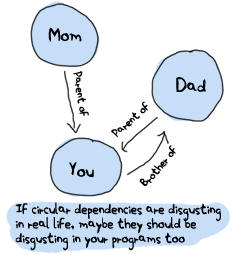

# Modules

## [What are modules]


Working with the interactive shell is often considered a vital part of using dynamic programming languages. It is useful to test all kinds of code and programs. Most of the basic data types of Erlang were used without even needing to open a text editor or saving files. You could drop your keyboard, go play ball outside and call it a day, but you would be a terrible Erlang programmer if you stopped right there. Code needs to be saved somewhere to be used!
使用交互式shell通常被认为是使用动态编程语言的一个重要部分。它对测试各种代码和程序都很有用。使用Erlang的大多数基本数据类型时，甚至不需要打开文本编辑器或保存文件。你可以放下键盘，出去打球，结束一天的工作，但如果你就停在那里，你将是一个糟糕的Erlang程序员。代码需要保存在某个地方才能使用！

This is what modules are for. Modules are a bunch of functions regrouped in a single file, under a single name. Additionally, all functions in Erlang must be defined in modules. You have already used modules, perhaps without realizing it. The BIFs mentioned in the previous chapter, like `hd` or `tl`, actually belong to the `erlang` module, as well as all of the arithmetic, logic and Boolean operators. BIFs from the `erlang` module differ from other functions as they are automatically imported when you use Erlang. Every other function defined in a module you will ever use needs to be called with the form `Module:Function(Arguments)`.
这就是模块的用途。模块是在单个文件中以单个名称重新组合的一组函数。此外，Erlang中的所有函数都必须在模块中定义。您已经使用了模块，可能还没有意识到。上一章中提到的BIF，如'hd'或'tl'，实际上属于'erlang'模块，以及所有算术、逻辑和布尔运算符。“erlang”模块中的BIF与其他函数不同，因为它们是在使用erlang时自动导入的。在模块中定义的所有其他函数都需要以“module:function（Arguments）”的形式调用`。

You can see for yourself:

```eshell
1> erlang:element(2, ).
b
2> element(2, ).
b
3> lists:seq(1,4).
[1,2,3,4]
4> seq(1,4).
** exception error: undefined shell command seq/2
```

Here, the `seq` function from the list module was not automatically imported, while `element` was. The error 'undefined shell command' comes from the shell looking for a shell command like `f()` and not being able to find it. There are some functions from the `erlang` module which are not automatically imported, but they're not used too frequently.
在这里，列表模块中的'seq'函数不是自动导入的，而'element'是自动导入的。错误“undefined shell command”来自于shell查找类似“f（）”的shell命令，但找不到它。“erlang”模块中的一些函数不是自动导入的，但它们没有被频繁使用。

Logically, you should put functions about similar things inside a single module. Common operations on lists are kept in the `lists` module, while functions to do input and output (such as writing to the terminal or in a file) are regrouped in the `io` module. One of the only modules you will encounter which doesn't respect that pattern is the aforementioned `erlang` module that has functions which do math, conversions, deal with multiprocessing, fiddle with the virtual machine's settings, etc. They have no point in common except being built-in functions. You should avoid creating modules like `erlang` and instead focus on clean logical separations.
从逻辑上讲，您应该将类似的功能放在一个模块中。列表上的常见操作保存在'lists'模块中，而输入和输出功能（如写入终端或文件）在'io'模块中重新组合。您将遇到的唯一不尊重该模式的模块之一是前面提到的“erlang”模块，该模块具有进行数学运算、转换、处理多处理、篡改虚拟机设置等功能。除了内置功能外，它们没有任何共同点。您应该避免创建像“erlang”这样的模块，而是关注干净的逻辑分隔。

## [Module Declaration]


.`. Only one of them is necessary for your module to be compilable:
目前世界各地的Erlang代码中使用了大量的模块属性；事实上，你甚至可以随心所欲地声明自己的属性。有些预定义属性在代码中会比其他属性更频繁地出现。所有模块属性都遵循`-Name（Attribute）格式。`。要使模块可编译，只需要其中一个：

-module(Name).
:   This is always the first attribute (and statement) of a file, and for good reason: it's the name of the current module, where `Name` the arguments.
：这始终是文件的第一个属性（和语句），理由很充分：它是当前模块的名称，其中'name'是参数。

It's time to code already! Our first module will be very simple and useless. Open your text editor and type in the following, then save it under `useless.erl`:
是时候编码了！我们的第一个模块将非常简单和无用。打开文本编辑器，输入以下内容，然后将其保存在“无用”下。呃`:

```erl
-module(useless).
```

This line of text is a valid module. Really! Of course it's useless without functions. Let's first decide what functions will be exported from our 'useless' module. To do this, we will use another attribute:
这行文本是有效的模块。真正地当然，没有功能是没有用的。让我们首先决定从“无用”模块中导出哪些函数。为此，我们将使用另一个属性：

-export(\[Function1/Arity, Function2/Arity, \..., FunctionN/Arity\]).
:   This is used to define what functions of a module can be called by the outside world. It takes a list of functions with their respective arity. The arity of a function is an integer representing how many arguments can be passed to the function. This is critical information, because different functions defined within a module can share the same name if and only if they have a different arity. The functions `add(X,Y)` and `add(X,Y,Z)` would thus be considered different and written in the form `add/2` and `add/3` respectively.
：用于定义外部世界可以调用模块的哪些功能。它需要一系列函数及其各自的算术运算。函数的arity是一个整数，表示可以向函数传递多少个参数。这是关键信息，因为在一个模块中定义的不同函数可以共享同一个名称，当且仅当它们具有不同的算术数时。因此，`add（X，Y）`和`add（X，Y，Z）`将被视为不同的函数，并分别以`add/2`和`add/3`的形式编写。

::: note
**Note:** Exported functions represent a module's interface. It is important to define an interface revealing strictly what is necessary for it to be used and nothing more. Doing so lets you fiddle with all the other \[hidden\] details of your implementation without breaking code that might depend on your module.
**注：*导出的函数代表模块的接口。重要的是定义一个接口，严格说明使用该接口所需的内容，仅此而已。这样做可以让您在不破坏可能依赖于您的模块的代码的情况下处理实现的所有其他\[隐藏\]细节。
:::

Our useless module will first export a useful function named 'add', which will take two arguments. The following `-export` attribute can be added after the module declaration:
我们的无用模块将首先导出一个名为“add\”的有用函数，该函数将包含两个参数。在模块声明之后可以添加以下`-export`属性：

```erl
-export([add/2]).
```

And now write the function:

```erl
add(A,B) ->
    A + B.
```

The syntax of a function follows the form `Name(Args) -> Body.`, where `Name` can be one or more Erlang expressions separated by commas. The function is ended with a period. Note that Erlang doesn't use the 'return' keyword. 'Return' is useless! Instead, the last logical expression of a function to be executed will have its value returned to the caller automatically without you having to mention it.
函数的语法遵循`Name（Args）->Body的形式。`，其中'Name'可以是一个或多个用逗号分隔的Erlang表达式。函数以句点结束。请注意，Erlang没有使用“return”关键字。\“返回”没用！相反，要执行的函数的最后一个逻辑表达式将自动将其值返回给调用方，而无需您提及它。

Add the following function (why yes, every tutorial needs a 'Hello world' example! Even at the fourth chapter!), without forgetting to add it to the `-export` attribute.
添加以下功能（为什么是的，每个教程都需要一个“Hello world”示例！即使在第四章中也是如此！），不要忘记将其添加到`-export`属性中。

```erl
%% Shows greetings.
%% io:format/1 is the standard function used to output text.
hello() ->
    io:format("Hello, world!~n").
```

What we see from this function is that comments are single-line only and begin with a `%` sign (using `%%` is purely a question of style.) The `hello/0` function also demonstrates how to call functions from foreign modules inside yours. In this case, `io:format/1` is the standard function to output text, as written in the comments.
我们从这个函数中看到的是，注释只有一行，并且以“%”符号开头（使用“%”纯粹是一个风格问题）。)“hello/0”函数还演示了如何从内部的外部模块调用函数。在本例中，`io:format/1`是输出文本的标准函数，如注释中所述。

A last function will be added to the module, using both functions `add/2` and `hello/0`:

```erl
greet_and_add_two(X) ->
    hello(),
    add(X,2).
```


Do not forget to add `greet_and_add_two/1` to the exported function list. The calls to `hello/0` and `add/2` don't need to have the module name prepended to them because they were declared in the module itself.
不要忘记将“问候”和“添加两个/1”添加到导出的功能列表中。对“hello/0”和“add/2”的调用不需要预先添加模块名，因为它们是在模块本身中声明的。

Had you wanted to be able to call `io:format/1` in the same manner as `add/2` or any other function defined within the module, you could have added the following module attribute at the beginning of the file: `-import(io, [format/1]).`. Then you could have called `format("Hello, World!~n").` directly. More generally, the `-import` attribute follows this recipe:
如果希望能够以与“add/2”或模块中定义的任何其他函数相同的方式调用“io:format/1”，则可以在文件开头添加以下模块属性：`-import（io，[format/1]）。`。然后你可以调用“格式”（“你好，世界！~n”）。`直接。一般来说，“-import”属性遵循以下方法：

```erl
-import(Module, [Function1/Arity, ..., FunctionN/Arity]).
```

Importing a function is not much more than a shortcut for programmers when writing their code. Erlang programmers are often discouraged from using the `-import` attribute as some people find it reduces the readability of code. In the case of `io:format/2`, the function `io_lib:format/2` also exists. Finding which one is used means going to the top of the file to see from which module it was imported. Consequently, leaving the module name in is considered good practice. Usually, the only functions you'll see imported come from the lists module: its functions are used with a higher frequency than those from most other modules.
导入函数只不过是程序员编写代码时的一种捷径。Erlang程序员经常被劝阻不要使用“-import”属性，因为有些人发现它会降低代码的可读性。对于'io:format/2'，函数'io_lib:format/2'也存在。查找所使用的模块意味着转到文件的顶部，查看它是从哪个模块导入的。因此，保留模块名称被认为是良好的做法。通常，你会看到导入的功能都来自列表模块：它的功能使用频率高于其他大多数模块。

Your `useless` module should now look like the following file:

```erl
-module(useless).
-export([add/2, hello/0, greet_and_add_two/1]).

add(A,B) ->
    A + B.

%% Shows greetings.
%% io:format/1 is the standard function used to output text.
hello() ->
    io:format("Hello, world!~n").

greet_and_add_two(X) ->
    hello(),
    add(X,2).
```

We are done with the \"useless\" module. You can save the file under the name `useless.erl`. The file name should be the module name as defined in the `-module` attribute, followed by '.erl', which is the standard Erlang source extension.
我们已经完成了“无用”模块。你可以用“无用”这个名字保存文件。呃`。文件名应该是在`-module`属性中定义的模块名，后跟\。erl '，这是标准的Erlang源扩展。

Before showing how to compile the module and finally try all its exciting functions, we will see how to define and use macros. Erlang macros are really similar to C's '#define' statements, mainly used to define short functions and constants. They are simple expressions represented by text that will be replaced before the code is compiled for the VM. Such macros are mainly useful to avoid having magic values floating around your modules. A macro is defined as a module attribute of the form: `-define(MACRO, some_value).` and is used as `?MACRO` inside any function defined in the module. A 'function' macro could be written as `-define(sub(X,Y), X-Y).` and used like `?sub(23,47)`, later replaced by `23-47` by the compiler. Some people will use more complex macros, but the basic syntax stays the same.
在展示如何编译模块并最终尝试其所有令人兴奋的功能之前，我们将了解如何定义和使用宏。Erlang宏与C的\#define '语句非常相似，主要用于定义短函数和常量。它们是由文本表示的简单表达式，在为VM编译代码之前，这些文本将被替换。这样的宏主要用于避免在模块周围浮动魔法值。宏定义为以下形式的模块属性：`-define（宏，一些_值）。`用作“？宏`在模块中定义的任何函数中。“函数”宏可以写成“-define（sub（X，Y），X-Y）。`用起来像`？sub（23,47）`，后来被编译器替换为`23-47`。有些人会使用更复杂的宏，但基本语法保持不变。

## [Compiling the code]

Erlang code is compiled to bytecode in order to be used by the virtual machine. You can call the compiler from many places: `$ erlc flags file.erl` when in the command line, `compile:file(FileName)` when in the shell or in a module, `c()` when in the shell, etc.
Erlang代码被编译成字节码，以便虚拟机使用。您可以从许多地方调用编译器：`$erlc标志文件。erl`在命令行中，`compile:file（FileName）`在shell或模块中，`c（）`在shell中，等等。

It's time to compile our useless module and try it. Open the Erlang shell, type in:

```eshell
1> cd("/path/to/where/you/saved/the-module/").
"Path Name to the directory you are in"
ok
```

By default, the shell will only look for files in the same directory it was started in and the standard library: `cd/1` is a function defined exclusively for the Erlang shell, telling it to change the directory to a new one so it's less annoying to browse for our files. Windows users should remember to use forward slashes. When this is done, do the following:
默认情况下，shell只会在启动时所在的目录和标准库中查找文件：`cd/1`是专门为Erlang shell定义的函数，告诉它将目录更改为新目录，这样浏览文件就不那么麻烦了。Windows用户应该记住使用前斜杠。完成后，请执行以下操作：

```eshell
2> c(useless).

```

If you have another message, make sure the file is named correctly, that you are in the right directory and that you've made no mistake in your [module](static/erlang/useless.erl.html "check against THIS!"). Once you successfully compile code, you'll notice that a `useless.beam` file was added next to `useless.erl` in your directory. This is the compiled module. Let's try our first functions ever:
如果您有另一条消息，请确保文件的名称正确，您位于正确的目录中，并且您在[module]（static/erlang/untible）中没有出错。呃。html“对照检查！”）。一旦你成功编译了代码，你会发现。在“无用”旁边添加了beam“文件”。在你的目录里。这是编译模块。让我们尝试我们的第一个功能：

```eshell
3> useless:add(7,2).
9
4> useless:hello().
Hello, world!
ok
5> useless:greet_and_add_two(-3).
Hello, world!
-1
6> useless:not_a_real_function().
** exception error: undefined function useless:not_a_real_function/0
```

The functions work as expected: `add/2` adds numbers, `hello/0` outputs \"Hello, world!\", and `greet_and_add_two/1` does both! Of course, you might be asking why `hello/0` returns the atom 'ok' after outputting text. This is because Erlang functions and expressions must **always** return something, even if they would not need to in other languages. As such, `io:format/1` returns 'ok' to denote a normal condition, the absence of errors.
这些函数按预期工作：`add/2`添加数字，`hello/0`输出\“hello，world！\”，而`greet_和'u add_two/1`两者都做！当然，您可能会问为什么“hello/0”在输出文本后返回atom“ok”。这是因为Erlang函数和表达式必须**始终**返回某些内容，即使它们不需要在其他语言中返回。因此，'io:format/1'返回'ok'以表示正常情况，即没有错误。

Expression 6 shows an error being thrown because a function doesn't exist. If you have forgotten to export a function, this is the kind of error message you will have when trying it out.
表达式6显示由于函数不存在而引发的错误。如果忘记导出函数，则在尝试时会出现这种错误消息。

::: note
**Note:** If you were ever wondering, '.beam' stands for *Bogdan/Björn's Erlang Abstract Machine*, which is the VM itself. Other virtual machines for Erlang exist, but they're not really used anymore and are history: JAM (Joe's Abstract Machine, inspired by Prolog's [WAM](http://en.wikipedia.org/wiki/Warren_Abstract_Machine "Warren Abstract Machin") and old BEAM, which attempted to compile Erlang to C, then to native code. Benchmarks demonstrated little benefits in this practice and the concept was given up.
**注：*如果你想知道，'。beam'代表*Bogdan/Björn的Erlang抽象机器*，即虚拟机本身。Erlang的其他虚拟机也存在，但它们不再真正被使用，而是历史：JAM（Joe的抽象机，受Prolog的[WAM]启发）(http://en。维基百科。org/wiki/Warren_Abstract_Machine“Warren Abstract Machin”）和old BEAM，他们试图将Erlang编译成C，然后再编译成本机代码。基准测试在这种实践中几乎没有什么好处，因此放弃了这个概念。
:::

There are a whole lot of compilation flags existing to get more control over how a module is compiled. You can get a list of all of them in the [Erlang documentation](http://erlang.org/doc/man/compile.html). The most common flags are:
为了更好地控制模块的编译方式，存在大量编译标志。您可以在[Erlang文档]中获得所有这些文件的列表(http://erlang。org/doc/man/compile。（html）。最常见的标志是：

-debug_info
:   Erlang tools such as debuggers, code coverage and static analysis tools will use the debug information of a module in order to do their work.
：Erlang工具，如调试器、代码覆盖率和静态分析工具，将使用模块的调试信息来完成工作。

-
:   By default, the Erlang compiler will create the 'beam' files in the current directory. This will let you choose where to put the compiled file.
：默认情况下，Erlang编译器将在当前目录中创建“beam”文件。这将允许您选择将编译文件放在何处。

-export_all
:   Will ignore the `-export` module attribute and will instead export all functions defined. This is mainly useful when testing and developing new code, but should not be used in production.
：将忽略“-export”模块属性，而是导出定义的所有函数。这在测试和开发新代码时非常有用，但不应用于生产。

-
:   Defines a macro to be used in the module, where `Macro` is 'true' if it's not defined as the third element of the tuple.
：定义要在模块中使用的宏，如果没有定义为元组的第三个元素，“macro”则为“true”。

To compile our `useless` module with some flags, we could do one of the following:

```eshell
7> compile:file(useless, [debug_info, export_all]).

8> c(useless, [debug_info, export_all]).

```

You can also be sneaky and define compile flags from within a module, with a module attribute. To get the same results as from expressions 7 and 8, the following line could be added to the module:
您也可以偷偷地从模块中定义编译标志，并使用模块属性。为了得到与表达式7和8相同的结果，可以在模块中添加以下行：

```erl
-compile([debug_info, export_all]).
```

Then just compile and you'll get the same results as if you manually passed flags. Now that we're able to write down functions, compile them and execute them, it's time to see how far we can take them!
然后只需编译，就会得到与手动传递标志相同的结果。现在我们已经能够写下函数，编译它们并执行它们，现在是时候看看我们能走多远了！

::: note
**Note:** another option is to compile your Erlang module to native code. Native code compiling is **not** available for every platform and OS, but on those that support it, it can make your programs go faster (about 20% faster, based on anecdotal evidence). To compile to native code, you need to use the `hipe` module and call it the following way: `hipe:c(Module,OptionsList).` You could also use `c(Module,[native]).` when in the shell to achieve similar results. Note that the .beam file generated will contain both native and non-native code, and the native part will not be portable across platforms.
**注：**另一个选项是将Erlang模块编译为本机代码。本机代码编译**不**适用于所有平台和操作系统，但在支持本机代码编译的平台和操作系统上，本机代码编译可以使您的程序运行更快（根据轶事证据，大约快20%）。要编译为本机代码，需要使用'hipe'模块，并按以下方式调用它：'hipe:c（模块，选项列表）。`你也可以使用'c（Module，[native]）。`当在壳中达到类似的效果。请注意。生成的beam文件将包含本机代码和非本机代码，本机部分将无法跨平台移植。
:::

## [More About Modules]

Before moving on to learning more about writing functions and barely useful snippets of code, there are a few other miscellaneous bits of information that might be useful to you in the future that I'd like to discuss.
在进一步学习编写函数和几乎没有用处的代码片段之前，我想讨论一下其他一些对您将来可能有用的信息。

The first one concerns metadata about modules. I mentioned in the beginning of this chapter that module attributes are metadata describing the module itself. Where can we find this metadata when we don't have an access to the source? Well the compiler plays nice with us: when compiling a module, it will pick up most module attributes and store them (along with other information) in a `module_info/0` function. You can see the metadata of the `useless` module the following way:
第一个是关于模块的元数据。我在本章开头提到，模块属性是描述模块本身的元数据。当我们无法访问源时，在哪里可以找到这些元数据？编译器对我们很好：编译模块时，它会提取大多数模块属性，并将它们（以及其他信息）存储在“module_info/0”函数中。您可以通过以下方式查看“无用”模块的元数据：

```eshell
9> useless:module_info().
[,
           ,
           ,
           ,
           ,
 ,
 ,
 ,
           ,
           ,
           ]
10> useless:module_info(attributes).
[]
```

The snippet above also shows an additional function, `module_info/1` which will let you grab one specific piece of information. You can see exported functions, imported functions (none in this case!), attributes (this is where your custom metadata would go), and compile options and information. Had you decided to add `-author("An Erlang Champ").` to your module, it would have ended up in the same section as `vsn`. There are limited uses to module attributes when it comes to production stuff, but they can be nice when doing little tricks to help yourself out: I'm using them in my [testing script](static/erlang/tester.erl.html "Automatic testing module. See warnings/0.") for this book to annotate functions for which unit tests could be better; the script looks up module attributes, finds the annotated functions and shows a warning about them.
上面的代码片段还显示了一个附加函数“module_info/1”，它可以让您获取一条特定的信息。您可以看到导出的函数、导入的函数（本例中没有！），属性（这是自定义元数据的位置），以及编译选项和信息。你是否决定添加`-author（“一个二郎冠军”）。`对于你的模块来说，它应该和“vsn”放在同一个部分`。当涉及到生产内容时，模块属性的用途有限，但在做一些小技巧来帮助自己时，它们可能会很好：我在我的[testing script]（static/erlang/tester）中使用它们。呃。“html”自动测试模块。请参阅警告/0。），以便本书对单元测试可能更好的函数进行注释；脚本将查找模块属性，找到注释的函数，并显示有关它们的警告。

::: note
**Note:** `vsn` is an automatically generated unique value differentiating each version of your code, excluding comments. It is used in code hot-loading (upgrading an application while it runs, without stopping it) and by some tools related to release handling. You can also specify a `vsn` value yourself if you want: just add `-vsn(VersionNumber)` to your module.
**注：*`vsn`是自动生成的唯一值，用于区分代码的每个版本，不包括注释。它用于代码热加载（在应用程序运行时升级应用程序，而不停止它）以及一些与版本处理相关的工具。如果需要，您也可以自己指定一个'vsn'值：只需将`-vsn（VersionNumber）`添加到模块中即可。
:::




Another point that would be nice to approach regards general module design: avoid circular dependencies! A module `A`. Such dependencies usually end up making code maintenance difficult. In fact, depending on too many modules even if they're not in a circular dependency can make maintenance harder. The last thing you want is to wake up in the middle of the night only to find a maniac software engineer or computer scientist trying to gouge your eyes out because of terrible code you have written.
另一个很好的方法是关于通用模块设计：避免循环依赖！A模块'A`。这种依赖性通常会导致代码维护困难。事实上，依赖太多的模块，即使它们不是循环依赖的，也会使维护变得更加困难。你最不想做的事就是半夜醒来，却发现一个疯狂的软件工程师或计算机科学家因为你写的糟糕代码而试图挖出你的眼睛。

For similar reasons (maintenance and fear for your eyes), it is usually considered a good practice to regroup functions that have similar roles close together. Starting and stopping an application or creating and deleting a record in some database are examples of such a scenario.
出于类似的原因（维护和眼睛的恐惧），通常认为将具有相似角色的功能重新组合在一起是一种很好的做法。启动和停止应用程序，或在某些数据库中创建和删除记录就是这种情况的例子。

Well, that's enough for the pedantic moralizations. How about we explore Erlang a little more?
