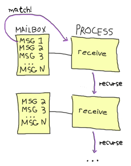

# More On Multiprocessing

## [State Your State]


The examples shown in the previous chapter were all right for demonstrative purposes, but you won't go far with only that in your toolkit. It's not that the examples were bad, it's mostly that there is not a huge advantage to processes and actors if they're just functions with messages. To fix this, we have to be able to hold state in a process.
上一章中显示的示例可以用于演示目的，但在工具箱中仅此而已。这并不是因为例子不好，主要是因为如果流程和参与者只是带有消息的函数，那么它们就没有太大的优势。为了解决这个问题，我们必须能够在一个过程中保持状态。

Let's first create a function in a new [kitchen.erl](static/erlang/kitchen.erl.html) module that will let a process act like a fridge. The process will allow two operations: storing food in the fridge and taking food from the fridge. It should only be possible to take food that has been stored beforehand. The following function can act as the base for our process:
让我们首先在一个新的[厨房]中创建一个功能。（静态/二郎/厨房）。呃。html）模块，让一个进程像冰箱一样工作。该过程将允许两种操作：在冰箱中储存食物和从冰箱中取出食物。只能吃事先储存好的食物。以下功能可以作为我们流程的基础：

```erl
-module(kitchen).
-compile(export_all).

fridge1() ->
    receive
         ->
            From ! ,
            fridge1();
         ->
            %% uh....
            From ! ,
            fridge1();
        terminate ->
            ok
    end.
```

Something's wrong with it. When we ask to store the food, the process should reply with `ok`. In order to store and take food items, we'll need to add state to the function.
有点不对劲。当我们要求储存食物时，这个过程应该回答“ok”`。为了储存和携带食物，我们需要在函数中添加状态。

With the help of recursion, the state to a process can then be held entirely in the parameters of the function. In the case of our fridge process, a possibility would be to store all the food as a list, and then look in that list when someone needs to eat something:
在递归的帮助下，进程的状态可以完全保存在函数的参数中。在我们的冰箱制作过程中，一种可能是将所有食物存储为一个列表，然后在有人需要吃东西时查看该列表：

```erl
fridge2(FoodList) ->
    receive
         ->
            From ! ,
            fridge2([Food|FoodList]);
         ->
            case lists:member(Food, FoodList) of
                true ->
                    From ! ,
                    fridge2(lists:delete(Food, FoodList));
                false ->
                    From ! ,
                    fridge2(FoodList)
            end;
        terminate ->
            ok
    end.
```

The first thing to notice is that `fridge2/1` takes one argument, `FoodList` is sent back otherwise:

```eshell
1> c(kitchen).

2> Pid = spawn(kitchen, fridge2, [[baking_soda]]).
<0.51.0>
3> Pid ! .

4> flush().
Shell got 
ok
```

Storing items in the fridge seems to work. We'll try with some more stuff and then try to take it from the fridge.
将物品存放在冰箱里似乎有效。我们再试试别的东西，然后从冰箱里拿出来。

```eshell
5> Pid ! .

6> Pid ! .

7> Pid ! .

8> flush().
Shell got 
Shell got 
Shell got 
ok
```

As expected, we can take bacon from the fridge because we have put it in there first (along with the milk and baking soda), but the fridge process has no turkey to find when we request some. This is why we get the last `` message.
正如预期的那样，我们可以从冰箱中取出培根，因为我们已经先把培根（连同牛奶和小苏打一起）放进去了，但是当我们需要一些培根时，冰箱里没有火鸡。这就是我们收到最后一条“信息”的原因。

## [We love messages, but we keep them secret]

Something annoying with the previous example is that the programmer who's going to use the fridge has to know about the protocol that's been invented for that process. That's a useless burden. A good way to solve this is to abstract messages away with the help of functions dealing with receiving and sending them:
前一个例子中令人恼火的是，要使用冰箱的程序员必须知道为这个过程发明的协议。这是一个无用的负担。解决这一问题的一个好方法是借助处理接收和发送消息的函数将消息抽象出来：

```erl
store(Pid, Food) ->
    Pid ! ,
    receive
         -> Msg
    end.

take(Pid, Food) ->
    Pid ! ,
    receive
         -> Msg
    end.
```

Now the interaction with the process is much cleaner:

```eshell
9> c(kitchen).

10> f().
ok
11> Pid = spawn(kitchen, fridge2, [[baking_soda]]).
<0.73.0>
12> kitchen:store(Pid, water).
ok
13> kitchen:take(Pid, water).

14> kitchen:take(Pid, juice).
not_found
```

We don't have to care about how the messages work anymore, if sending `self()` or a precise atom like `take` or `store` is needed: all that's needed is a pid and knowing what functions to call. This hides all of the dirty work and makes it easier to build on the fridge process.
如果需要发送“self（）”或像“take”或“store”这样的精确原子，我们就不必再关心消息是如何工作的：只需要一个pid，知道调用什么函数。这就隐藏了所有的脏活，并且更容易建立在冰箱流程上。

One thing left to do would be to hide that whole part about needing to spawn a process. We dealt with hiding messages, but then we still expect the user to handle the creation of the process. I'll add the following `start/1` function:
剩下要做的一件事是隐藏关于需要生成一个进程的全部内容。我们处理了隐藏消息的问题，但我们仍然希望用户能够处理流程的创建。我将添加以下'start/1'函数：

```erl
start(FoodList) ->
    spawn(?MODULE, fridge2, [FoodList]).
```


!【两个带弦的锡罐，其中锡罐以某种方式代表了振动弦和声音之间的抽象层】(。。/静态/img/抽象。（巴布亚新几内亚）

Here, `?MODULE` is a macro returning the current module's name. It doesn't look like there are any advantages to writing such a function, but there really are some. The essential part of it would be consistency with the calls to `take/2` and `store/2`: everything about the fridge process is now handled by the [kitchen](static/erlang/kitchen.erl.html) module. If you were to add logging when the fridge process is started or start a second process (say a freezer), it would be really easy to do inside our `start/1` function. However if the spawning is left for the user to do through `spawn/3`, then every place that starts a fridge now needs to add the new calls. That's prone to errors and errors suck.
这里，`？MODULE`是返回当前模块名称的宏。写这样一个函数似乎没有什么好处，但确实有一些好处。它的关键部分是与“take/2”和“store/2”的调用保持一致：冰箱过程的所有内容现在都由[厨房]（static/erlang/kitchen）处理。呃。html）模块。如果要在冰箱进程启动时添加日志记录，或者启动第二个进程（比如冷冻柜），那么在我们的“启动/1”功能中就很容易做到。然而，如果通过“spawn/3”让用户进行产卵，那么每个启动冰箱的地方现在都需要添加新的呼叫。这很容易出错，而且错误很糟糕。

Let's see this function put to use:

```eshell
15> f().
ok
16> c(kitchen).

17> Pid = kitchen:start([rhubarb, dog, hotdog]).
<0.84.0>
18> kitchen:take(Pid, dog).

19> kitchen:take(Pid, dog).
not_found
```

Yay! The dog has got out of the fridge and our abstraction is complete!

## [Time Out]

Let's try a little something with the help of the command `pid(A,B,C)`, which lets us change the 3 integers `A` into a pid. Here we'll deliberately feed `kitchen:take/2` a fake one:
让我们在命令'pid（a，B，C）'的帮助下尝试一下，它让我们把3个整数'a'变成一个pid。在这里，我们会故意给“厨房：拿/2”一个假的：

```eshell
20> kitchen:take(pid(0,250,0), dog).
```

Woops. The shell is frozen. This happened because of how `take/2` was implemented. To understand what goes on, let's first revise what happens in the normal case:
呜呜声。壳冻住了。这是因为“take/2”是如何实现的。为了了解发生了什么，让我们首先修改一下正常情况下发生的情况：

1.  A message to take food is sent from you (the shell) to the fridge process;
2.  Your process switches to receive mode and waits for a new message;
3.  The fridge removes the item and sends it to your process;
4.  Your process receives it and moves on with its life.


 to an unknown process;
2.  Your process switches to receive mode and waits for a new message;
3.  The unknown process either doesn't exist or doesn't expect such a message and does nothing with it;
3.。未知的进程要么不存在，要么不期待这样的消息，并且对它不做任何处理；
4.  Your shell process is stuck in receive mode.

That's annoying, especially because there is no error handling possible here. Nothing illegal happened, the program is just waiting. In general, anything dealing with asynchronous operations (which is how message passing is done in Erlang) needs a way to give up after a certain period of time if it gets no sign of receiving data. A web browser does it when a page or image takes too long to load, you do it when someone takes too long before answering the phone or is late at a meeting. Erlang certainly has an appropriate mechanism for that, and it's part of the `receive` construct:
这很烦人，尤其是因为这里不可能进行错误处理。没有违法的事情发生，程序正在等待。一般来说，任何处理异步操作（在Erlang中就是这样完成消息传递的）的操作都需要在一段时间后，如果没有收到数据的迹象，就放弃。当网页或图像加载时间过长时，网络浏览器会执行此操作；当有人接听电话前花费时间过长或开会迟到时，您会执行此操作。Erlang当然有一个合适的机制来实现这一点，它是“接收”结构的一部分：

```erl
receive
    Match -> Expression1
after Delay ->
    Expression2
end.
```

The part in between `receive` and `after` is exactly the same that we already know. The `after` part will be triggered if as much time as `Delay` is executed.
“receive”和“after”之间的部分与我们已知的完全相同。如果执行“延迟”的时间与“延迟”的时间相同，则会触发“之后”部分。

We'll write two new interface functions, `store2/2` and `take2/2`, which will act exactly like `store/2` and `take/2` with the exception that they will stop waiting after 3 seconds:
我们将编写两个新的接口函数'store2/2'和'take2/2'，它们的行为与'store/2'和'take/2'完全相同，只是它们会在3秒钟后停止等待：

```erl
store2(Pid, Food) ->
    Pid ! ,
    receive
         -> Msg
    after 3000 ->
        timeout
    end.

take2(Pid, Food) ->
    Pid ! ,
    receive
         -> Msg
    after 3000 ->
        timeout
    end.
```

Now you can unfreeze the shell with `^G` and try the new interface functions:

```erl
User switch command
 --> k 
 --> s
 --> c
Eshell V5.7.5  (abort with ^G)
1> c(kitchen).

2> kitchen:take2(pid(0,250,0), dog).
timeout
```

And now it works.

::: note
**Note:** I said that `after` only takes milliseconds as a value, but it is actually possible to use the atom `infinity`. While this is not useful in many cases (you might just remove the `after` clause altogether), it is sometimes used when the programmer can submit the wait time to a function where receiving a result is expected. That way, if the programmer really wants to wait forever, he can.
**注：**我说过'after'只需要毫秒作为一个值，但实际上可以使用原子的无穷大`。虽然这在很多情况下并不有用（您可能只是完全删除'after'子句），但有时当程序员可以将等待时间提交给预期会收到结果的函数时，会使用它。这样，如果程序员真的想永远等待，他可以。
:::

There are uses to such timers other than giving up after too long. One very simple example is how the `timer:sleep/1` function we've used before works. Here's how it is implemented (let's put it in a new [multiproc.erl](static/erlang/multiproc.erl.html) module):
除了在太长时间后放弃之外，这类计时器还有其他用途。一个非常简单的例子是我们以前使用过的'timer:sleep/1'函数是如何工作的。下面是它是如何实现的（让我们把它放在一个新的[multiproc]中）。erl]（静态/erlang/multiproc）。呃。html）模块）：

```erl
sleep(T) ->
    receive
    after T -> ok
    end.
```

In this specific case, no message will ever be matched in the `receive` part of the construct because there is no pattern. Instead, the `after` part of the construct will be called once the delay `T` has passed.
在这种特定情况下，构造的“接收”部分永远不会匹配任何消息，因为没有模式。相反，一旦延迟'T'过去，就会调用构造的'after'部分。

Another special case is when the timeout is at 0:

```erl
flush() ->
    receive
        _ -> flush()
    after 0 ->
        ok
    end.
```

When that happens, the Erlang VM will try and find a message that fits one of the available patterns. In the case above, anything matches. As long as there are messages, the `flush/0` function will recursively call itself until the mailbox is empty. Once this is done, the `after 0 -> ok` part of the code is executed and the function returns.
当这种情况发生时，Erlang VM将尝试找到符合可用模式之一的消息。在上面的例子中，任何匹配项都匹配。只要有消息，“flush/0”函数就会递归地调用自己，直到邮箱为空。完成此操作后，将执行代码的'after 0->ok'部分，并返回函数。

## [Selective Receives]

This 'flushing' concept makes it possible to implement a *selective receive* which can give a priority to the messages you receive by nesting calls:
这种“刷新”的概念使实现“选择性接收”成为可能，它可以通过嵌套呼叫优先接收您收到的消息：

```erl
important() ->
    receive
         when Priority > 10 ->
            [Message | important()]
    after 0 ->
        normal()
    end.

normal() ->
    receive
         ->
            [Message | normal()]
    after 0 ->
        []
    end.
```

This function will build a list of all messages with those with a priority above 10 coming first:

```eshell
1> c(multiproc).

2> self() ! .       

3> multiproc:important().
[high,high,low,low]
```

Because I used the `after 0` bit, every message will be obtained until none is left, but the process will try to grab all those with a priority above 10 before even considering the other messages, which are accumulated in the `normal/0` call.
因为我使用了'after 0'位，所以每个消息都将被获取，直到没有消息剩下，但进程将尝试获取所有优先级高于10的消息，甚至在考虑其他消息之前，这些消息都是在'normal/0'调用中累积的。

If this practice looks interesting, be aware that is is sometimes unsafe due to the way selective receives work in Erlang.
如果这种做法看起来很有趣，请注意，由于selective在Erlang中接收工作的方式，is有时是不安全的。

When messages are sent to a process, they're stored in the mailbox until the process reads them and they match a pattern there. As said in the [previous chapter](the-hitchhikers-guide-to-concurrency.html), the messages are stored in the order they were received. This means every time you match a message, it begins by the oldest one.
当消息被发送到一个进程时，它们会被存储在邮箱中，直到进程读取它们并匹配那里的模式。正如[上一章]（搭便车者指南）中所述。html），消息按接收顺序存储。这意味着每次匹配一条消息时，它都以最早的消息开始。

That oldest message is then tried against every pattern of the `receive` until one of them matches. When it does, the message is removed from the mailbox and the code for the process executes normally until the next `receive`. When this next `receive` is evaluated, the VM will look for the oldest message currently in the mailbox (the one after the one we removed), and so on.
然后，对“receive”的每一种模式尝试最古老的消息，直到其中一种模式匹配为止。当它这样做时，邮件将从邮箱中删除，进程的代码将正常执行，直到下一个“接收”`。当计算下一个“receive”时，VM将查找邮箱中当前最旧的邮件（在我们删除的邮件之后的邮件），以此类推。



.
这让你只关心有用的信息。忽略一些消息，以便稍后以上述方式处理它们，这是*选择性接收的本质*。虽然它们很有用，但问题是，如果你的流程中有很多你从不关心的消息，那么阅读有用的消息实际上需要越来越长的时间（而且流程的规模也会越来越大）。

In the drawing above, imagine we want the 367th message, but the first 366 are junk ignored by our code. To get the 367th message, the process needs to try to match the 366 first ones. Once it's done and they've all been put in the queue, the 367th message is taken out and the first 366 are put back on top of the mailbox. The next useful message could be burrowed much deeper and take even longer to be found.
在上图中，假设我们想要第367条消息，但前366条消息被我们的代码忽略了。要获取第367条消息，流程需要尝试匹配前366条消息。一旦完成并将它们全部放入队列，第367条消息将被取出，第一条366将被放回邮箱顶部。下一条有用的信息可能会被挖掘得更深，甚至需要更长的时间才能找到。

This kind of receive is a frequent cause of performance problems in Erlang. If your application is running slow and you know there are lots of messages going around, this could be the cause.
这种接收是Erlang中性能问题的常见原因。如果你的应用程序运行缓慢，并且你知道有很多消息在传递，这可能是原因。

If such selective receives are effectively causing a massive slowdown in your code, the first thing to do is to ask yourself is why you are getting messages you do not want. Are the messages sent to the right processes? Are the patterns correct? Are the messages formatted incorrectly? Are you using one process where there should be many? Answering one or many of these questions could solve your problem.
如果这样的选择性接收实际上导致了代码的大幅放缓，那么首先要问自己为什么会收到不想要的消息。消息是否发送到了正确的流程？模式正确吗？消息的格式是否不正确？您是否使用了一个应该有多个流程的流程？回答其中一个或多个问题可以解决你的问题。

Because of the risks of having useless messages polluting a process' mailbox, Erlang programmers sometimes take a defensive measure against such events. A standard way to do it might look like this:
由于存在无用消息污染进程邮箱的风险，Erlang程序员有时会对此类事件采取防御措施。这样做的标准方法可能如下所示：

```erl
receive
    Pattern1 -> Expression1;
    Pattern2 -> Expression2;
    Pattern3 -> Expression3;
    ...
    PatternN -> ExpressionN;
    Unexpected ->
        io:format("unexpected message ~p~n", [Unexpected])
end.
```

What this does is make sure any message will match at least one clause. The `Unexpected` variable will match anything, take the unexpected message out of the mailbox and show a warning. Depending on your application, you might want to store the message into some kind of logging facility where you will be able to find information about it later on: if the messages are going to the wrong process, it'd be a shame to lose them for good and have a hard time finding why that other process doesn't receive what it should.
这样做的目的是确保任何消息都至少匹配一个子句。'Unexpected'变量将匹配任何内容，将意外消息从邮箱中取出并显示警告。根据应用程序的不同，您可能希望将消息存储到某种类型的日志设施中，以便以后能够找到有关消息的信息：如果消息发送到错误的进程，那么永久丢失消息将是一件很遗憾的事情，并且很难找到为什么其他进程没有收到它应该收到的消息。

In the case you do need to work with a priority in your messages and can't use such a catch-all clause, a smarter way to do it would be to implement a [min-heap](http://en.wikipedia.org/wiki/Min-heap "Min heap description, but no implementation. If you want one, I could try to write one") or use the `gb_trees` module and dump every received message in it (make sure to put the priority number first in the key so it gets used for sorting the messages). Then you can just search for the `smallest` or `largest` element in the data structure according to your needs.
如果您确实需要在消息中使用优先级，并且不能使用这样一个catch-all子句，那么实现[min-heap]是一种更聪明的方法(http://en。维基百科。org/wiki/Min heap“Min heap说明，但没有实现。如果你想要一条，我可以尝试写一条），或者使用'gb_trees'模块转储其中收到的每一条消息（确保将优先级放在键的第一位，以便用于对消息进行排序）。然后，您可以根据需要搜索数据结构中的“最小”或“最大”元素。

In most cases, this technique should let you receive messages with a priority more efficiently than selective receives. However, it could slow you down if most messages you receive have the highest priority possible. As usual, the trick is to profile and measure before optimizing.
在大多数情况下，这种技术应该可以让您比选择性接收更有效地接收具有优先级的消息。然而，如果你收到的大多数信息都具有最高优先级，那么它可能会降低你的速度。和往常一样，诀窍是在优化之前进行分析和测量。

::: note
**Note:** Since R14A, a new optimization has been added to Erlang's compiler. It simplifies selective receives in very specific cases of back-and-forth communications between processes. An example of such a function is `optimized/1` in [multiproc.erl](static/erlang/multiproc.erl.html).
**注：*自R14A以来，Erlang的编译器中添加了一个新的优化。它简化了进程之间来回通信的特定情况下的选择性接收。这种函数的一个例子是[multiproc]中的“优化/1”。erl]（静态/erlang/multiproc）。呃。（html）。

To make it work, a reference (`make_ref()`) has to be created in a function and then sent in a message. In the same function, a selective receive is then made. If no message can match unless it contains the same reference, the compiler automatically makes sure the VM will skip messages received before the creation of that reference.
要使其工作，必须在函数中创建引用（`make_ref（）`），然后在消息中发送。在相同的功能中，然后进行选择性接收。如果没有消息可以匹配，除非它包含相同的引用，编译器会自动确保VM在创建该引用之前跳过收到的消息。

Note that you shouldn't try to coerce your code to fit such optimizations. The Erlang developers only look for patterns that are frequently used and then make them faster. If you write idiomatic code, optimizations should come to you. Not the other way around.
注意，你不应该试图强迫你的代码去适应这样的优化。Erlang开发人员只寻找经常使用的模式，然后让它们更快。如果你写的是惯用的代码，那么你就应该进行优化。而不是相反。
:::

With these concepts understood, the next step will be to do error handling with multiple processes.
