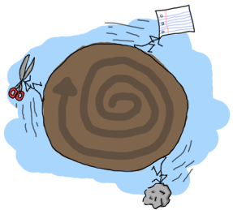

# Recursion

## [Hello recursion!]


![路上的汽车]。对话：'我们到了吗？-不我们到了吗？-不我们到了吗？-让你们这些孩子重现！](。。/静态/img/reCURSE。png“我为这个可怕的双关语道歉。没有什么好主意可以用来说明递归，所以你只能用这个。")

Some readers accustomed with imperative and object-oriented programming languages might be wondering why loops weren't shown already. The answer to this is \"what is a loop?\" Truth is, functional programming languages usually do not offer looping constructs like `for` and `while`. Instead, functional programmers rely on a silly concept named *recursion*.
一些熟悉命令式和面向对象编程语言的读者可能会想，为什么循环还没有显示出来。答案是“什么是循环？”事实是，函数式编程语言通常不提供“for”和“while”这样的循环结构`。相反，函数式程序员依赖一个叫做*递归的愚蠢概念*。

I suppose you remember how invariable variables were explained in the intro chapter. If you don't, you can [give them more attention](starting-out-for-real.html#invariable-variables "invariable variables, from Starting out (for real)") is the product of the sequence `1 x 2 x 3 x ... x n`, or alternatively `n x (n-1) x (n-2) x ... x 1`. To give some examples, the factorial of 3 is `3! = 3 x 2 x 1 = 6`. The factorial of 4 would be `4! = 4 x 3 x 2 x 1 = 24`. Such a function can be expressed the following way in mathematical notation:
我想你还记得在导论一章中对不变变量的解释吗。如果你不这样做，你可以[给予他们更多的关注]（真正开始）。html#conversate variables“conversate variables，from start out（for real）”）是序列'1x2x3x'的产物。。。xn`，或者“nx（n-1）x（n-2）x”。。。x1`。举几个例子，3的阶乘是'3！=3x2x1=6`。4的阶乘是'4！=4x3x2x1=24`。这种函数可以用数学符号表示如下：

![n! = 

What this tells us is that if the value of `n` multiplied by the factorial of `n-1`, which unfolds until it reaches 1:
这告诉我们，如果'n'的值乘以'n-1'的阶乘，它将展开，直到达到1：

``` expand
4! = 4 x 3!
4! = 4 x 3 x 2!
4! = 4 x 3 x 2 x 1!
4! = 4 x 3 x 2 x 1 x 1
```

How can such a function be translated from mathematical notation to Erlang? The conversion is simple enough. Take a look at the parts of the notation: `n!`, `1` and `n((n-1)!)`). We'll rename `n!` to `fac(N)` to restrict our syntax a bit and then we get the following:
如何将这样的函数从数学符号转换为Erlang？转换非常简单。看看符号的各个部分：`n！``1`和'n（（n-1）！）`）。我们将更名为'n！'到'fac（N）`来限制我们的语法，然后我们得到以下结果：

```erl
-module(recursive).
-export([fac/1]).

fac(N) when N == 0 -> 1;
fac(N) when N > 0  -> N*fac(N-1).
```

And this factorial function is now done! It's pretty similar to the mathematical definition, really. With the help of pattern matching, we can shorten the definition a bit:
这个阶乘函数现在完成了！这和数学定义非常相似，真的。借助模式匹配，我们可以将定义缩短一点：

```erl
fac(0) -> 1;
fac(N) when N > 0 -> N*fac(N-1).
```

So that's quick and easy for some mathematical definitions which are recursive in nature. We looped! A definition of recursion could be made short by saying \"a function that calls itself.\" However, we need to have a stopping condition (the real term is *base case*), because we'd otherwise loop infinitely. In our case, the stopping condition is when `n`. At that point we no longer tell our function to call itself and it stops its execution right there.
对于一些本质上是递归的数学定义来说，这是快速而简单的。我们循环！递归的定义可以简化为“一个调用自身的函数”。\“然而，我们需要有一个停止条件（实际条件是*基本情况*），因为否则我们将无限循环。在我们的例子中，停止条件是`。在这一点上，我们不再告诉我们的函数调用它自己，它就在那里停止执行。

## [Length]

Let's try to make it slightly more practical. We'll implement a function to count how many elements a list contains. So we know from the beginning that we will need:
让我们试着让它更实用一点。我们将实现一个函数来计算一个列表包含多少元素。因此，我们从一开始就知道，我们需要：

-   a base case;
-   a function that calls itself;
-   a list to try our function on.

With most recursive functions, I find the base case easier to write first: what's the simplest input we can have to find a length from? Surely an empty list is the simplest one, with a length of 0. So let's make a mental note that `[] = 0` when dealing with lengths. Then the next simplest list has a length of 1: `[_] = 1`. This sounds like enough to get going with our definition. We can write this down:
对于大多数递归函数，我发现先编写基本情况更容易：我们可以从中找到长度的最简单输入是什么？空列表肯定是最简单的，长度为0。所以，让我们记住，在处理长度时，“[]=0”。然后，下一个最简单的列表的长度为1:`[]=1`。这听起来足够符合我们的定义了。我们可以写下来：

```erl
len([]) -> 0;
len([_]) -> 1.
```

Awesome! We can calculate the length of lists, given the length is either 0 or 1! Very useful indeed. Well of course it's useless, because it's not yet recursive, which brings us to the hardest part: extending our function so it calls itself for lists longer than 1 or 0. It was [mentioned earlier](starting-out-for-real.html#lists "Starting Out (for real): lists") that lists are defined recursively as `[1 | [2| ... [n | []]]]`. This means we can use the `[H|T]` pattern to match against lists of one or more elements, as a list of length one will be defined as `[X|[]]` and a list of length two will be defined as `[X|[Y|[]]]`. Note that the second element is a list itself. This means we only need to count the first one and the function can call itself on the second element. Given each value in a list counts as a length of 1, the function can be rewritten the following way:
令人惊叹的我们可以计算列表的长度，给定长度为0或1！确实非常有用。当然，它是无用的，因为它还不是递归的，这就把我们带到了最困难的部分：扩展我们的函数，使它自己调用长度超过1或0的列表。这是[之前提到的]（开始是真的）。html#列表“开始（实际）：列表”），列表递归定义为“[1 |[2|。。。[n |[]]`。这意味着我们可以使用“[H | T]”模式来匹配一个或多个元素的列表，因为长度为1的列表将被定义为“[X |[]”，长度为2的列表将被定义为“[X |[Y |[]]`。请注意，第二个元素是列表本身。这意味着我们只需要计算第一个元素，函数就可以在第二个元素上调用自己。如果列表中的每个值的长度都为1，则可以通过以下方式重写该函数：

```erl
len([]) -> 0;
len([_|T]) -> 1 + len(T).
```

And now you've got your own recursive function to calculate the length of a list. To see how `len/1` would behave when ran, let's try it on a given list, say `[1,2,3,4]`:
现在你有了自己的递归函数来计算列表的长度。要了解“len/1”在运行时的行为，让我们在给定的列表上尝试一下，比如“[1,2,3,4]”：

``` expand
len([1,2,3,4]) = len([1 | [2,3,4])
               = 1 + len([2 | [3,4]])
               = 1 + 1 + len([3 | [4]])
               = 1 + 1 + 1 + len([4 | []])
               = 1 + 1 + 1 + 1 + len([])
               = 1 + 1 + 1 + 1 + 0
               = 1 + 1 + 1 + 1
               = 1 + 1 + 2
               = 1 + 3 
               = 4
```

Which is the right answer. Congratulations on your first useful recursive function in Erlang!


 to an iterative one (there is not really any growth). To have a function call being tail recursive, it needs to be 'alone'. Let me explain: what made our previous calls grow is how the answer of the first part depended on evaluating the second part. The answer to `1 + len(Rest)` needs the answer of `len(Rest)` to be found. The function `len(Rest)` itself then needed the result of another function call to be found. The additions would get stacked until the last one is found, and only then would the final result be calculated. Tail recursion aims to eliminate this stacking of operation by reducing them as they happen.
尾部递归是一种将上述线性过程（随着元素的增加而增加）转换为迭代过程（实际上没有任何增长）的方法。要使函数调用是尾部递归的，它需要是“单独的”。让我解释一下：让我们之前的电话增长的是第一部分的答案如何取决于对第二部分的评估。“1+len（Rest）”的答案需要找到“len（Rest）”的答案。然后，函数“len（Rest）”本身需要找到另一个函数调用的结果。添加的内容将被叠加，直到找到最后一个，然后才能计算最终结果。尾部递归的目的是在操作发生时减少它们，从而消除这种堆叠。

In order to achieve this, we will need to hold an extra temporary variable as a parameter in our function. I'll illustrate the concept with the help of the factorial function, but this time defining it to be tail recursive. The aforementioned temporary variable is sometimes called *accumulator* and acts as a place to store the results of our computations as they happen in order to limit the growth of our calls:
为了实现这一点，我们需要在函数中保留一个额外的临时变量作为参数。我将借助阶乘函数来说明这个概念，但这次将其定义为尾部递归。上述临时变量有时被称为“累加器”，用于存储计算结果，以限制调用的增长：

```erl
tail_fac(N) -> tail_fac(N,1).

tail_fac(0,Acc) -> Acc;
tail_fac(N,Acc) when N > 0 -> tail_fac(N-1,N*Acc).
```

Here, I define both `tail_fac/1` and `tail_fac/2`. The reason for this is that Erlang doesn't allow default arguments in functions (different arity means different function) so we do that manually. In this specific case, `tail_fac/1` acts like an abstraction over the tail recursive `tail_fac/2` function. The details about the hidden accumulator of `tail_fac/2` don't interest anyone, so we would only export `tail_fac/1` from our module. When running this function, we can expand it to:
在这里，我定义了'tail_fac/1'和'tail_fac/2'`。这样做的原因是Erlang不允许函数中的默认参数（不同的算术意味着不同的函数），所以我们手动执行。在这个特定的例子中，`tail_fac/1`就像是tail递归`tail_fac/2`函数上的抽象。关于'tail_fac/2'隐藏累加器的详细信息没有人感兴趣，因此我们只会从模块中导出'tail_fac/1'。运行此功能时，我们可以将其扩展为：

``` expand
tail_fac(4)    = tail_fac(4,1)
tail_fac(4,1)  = tail_fac(4-1, 4*1)
tail_fac(3,4)  = tail_fac(3-1, 3*4)
tail_fac(2,12) = tail_fac(2-1, 2*12)
tail_fac(1,24) = tail_fac(1-1, 1*24)
tail_fac(0,24) = 24
```

See the difference? Now we never need to hold more than two terms in memory: the space usage is constant. It will take as much space to calculate the factorial of 4 as it will take space to calculate the factorial of 1 million (if we forget 4! is a smaller number than 1M! in its complete representation, that is).
看到区别了吗？现在我们不需要在内存中保存超过两个项：空间使用是恒定的。计算4的阶乘所需的空间与计算100万的阶乘所需的空间一样大（如果我们忘记了4！在它的完整表示中，它是一个小于1M！的数字）。

With an example of tail recursive factorials under your belt, you might be able to see how this pattern could be applied to our `len/1` function. What we need is to make our recursive call 'alone'. If you like visual examples, just imagine you're going to put the `+1` part inside the function call by adding a parameter:
通过下面一个尾部递归阶乘的例子，您可能会看到这个模式如何应用于我们的'len/1'函数。我们需要的是让我们的递归调用“独自”。如果你喜欢直观的例子，想象一下你将通过添加一个参数把“+1”部分放在函数调用中：

```erl
len([]) -> 0;
len([_|T]) -> 1 + len(T).
```

becomes:

```erl
tail_len(L) -> tail_len(L,0).

tail_len([], Acc) -> Acc;
tail_len([_|T], Acc) -> tail_len(T,Acc+1).
```

And now your length function is tail recursive.

## [More recursive functions]


!【一个小小的星球，岩石紧跟着纸张，剪刀紧跟着岩石本身。】。](。。/静电/img/石头剪刀。png“我在这里把这个概念扩展得太多了。")

We'll write a few more recursive functions, just to get in the habit a bit more. After all, recursion being the only looping construct that exists in Erlang (except list comprehensions), it's one of the most important concepts to understand. It's also useful in every other functional programming language you'll try afterwards, so take notes!
我们将编写更多的递归函数，只是为了养成更多的习惯。毕竟，递归是Erlang中唯一存在的循环构造（列表理解除外），它是需要理解的最重要概念之一。它在以后尝试的所有其他函数式编程语言中都很有用，所以记下笔记吧！

The first function we'll write will be `duplicate/2`. This function takes an integer as its first parameter and then any other term as its second parameter. It will then create a list of as many copies of the term as specified by the integer. Like before, thinking of the base case first is what might help you get going. For `duplicate/2`, asking to repeat something 0 time is the most basic thing that can be done. All we have to do is return an empty list, no matter what the term is. Every other case needs to try and get to the base case by calling the function itself. We will also forbid negative values for the integer, because you can't duplicate something `-n` times:
我们将要编写的第一个函数是“复制/2”`。此函数将整数作为其第一个参数，然后将任何其他项作为其第二个参数。然后，它将创建一个包含整数指定的术语副本的列表。像以前一样，首先考虑基本情况可能有助于你行动起来。对于'replicate/2'，要求重复某件事0次是可以做的最基本的事情。我们所要做的就是返回一个空列表，不管它是什么术语。每一个其他情况都需要通过调用函数本身来尝试到达基本情况。我们还将禁止整数为负值，因为不能将某个值复制`-n`次：

```erl
duplicate(0,_) ->
    [];
duplicate(N,Term) when N > 0 ->
    [Term|duplicate(N-1,Term)].
```

Once the basic recursive function is found, it becomes easier to transform it into a tail recursive one by moving the list construction into a temporary variable:
一旦找到基本递归函数，通过将列表结构移动到临时变量中，将其转换为尾部递归函数就变得更容易了：

```erl
tail_duplicate(N,Term) ->
    tail_duplicate(N,Term,[]).

tail_duplicate(0,_,List) ->
    List;
tail_duplicate(N,Term,List) when N > 0 ->
    tail_duplicate(N-1, Term, [Term|List]).
```

Success! I want to change the subject a little bit here by drawing a parallel between tail recursion and a while loop. Our `tail_duplicate/2` function has all the usual parts of a while loop. If we were to imagine a while loop in a fictional language with Erlang-like syntax, our function could look a bit like this:
成功我想通过在尾部递归和while循环之间画一个平行线来稍微改变一下主题。我们的'tail_duplicate/2'函数具有while循环的所有常见部分。如果我们在一种虚构的语言中用类似Erlang的语法想象一个while循环，我们的函数可能看起来有点像这样：

```erl
function(N, Term) ->
    while N > 0 ->
        List = [Term|List],
        N = N-1
    end,
    List.
```

Note that all the elements are there in both the fictional language and in Erlang. Only their position changes. This demonstrates that a proper tail recursive function is similar to an iterative process, like a while loop.
请注意，所有元素都存在于虚构语言和Erlang中。只有他们的立场发生了变化。这表明一个适当的尾部递归函数类似于一个迭代过程，比如while循环。

There's also an interesting property that we can 'discover' when we compare recursive and tail recursive functions by writing a `reverse/1` function, which will reverse a list of terms. For such a function, the base case is an empty list, for which we have nothing to reverse. We can just return an empty list when that happens. Every other possibility should try to converge to the base case by calling itself, like with `duplicate/2`. Our function is going to iterate through the list by pattern matching `[H|T]` and then putting `H` after the rest of the list:
当我们通过编写一个“reverse/1”函数来比较递归函数和尾部递归函数时，我们还可以“发现”一个有趣的属性，它将反转一系列术语。对于这样一个函数，基本情况是一个空列表，对于它我们没有什么可反转的。发生这种情况时，我们可以返回一个空列表。所有其他的可能性都应该通过调用自己来尝试收敛到基本情况，比如使用“复制/2”`。我们的函数将通过模式匹配“[H | T]”遍历列表，然后将“H”放在列表的其余部分之后：

```erl
reverse([]) -> [];
reverse([H|T]) -> reverse(T)++[H].
```

On long lists, this will be a true nightmare: not only will we stack up all our append operations, but we will need to traverse the whole list for every single of these appends until the last one! For visual readers, the many checks can be represented as:
在很长的列表中，这将是一场真正的噩梦：我们不仅要把所有的append操作堆叠起来，还要遍历所有这些append操作的整个列表，直到最后一个！对于视觉阅读器，许多检查可以表示为：

``` expand
reverse([1,2,3,4]) = [4]++[3]++[2]++[1]
                      ↑    ↵
                   = [4,3]++[2]++[1]
                      ↑ ↑    ↵
                   = [4,3,2]++[1]
                      ↑ ↑ ↑    ↵
                   = [4,3,2,1]
```

This is where tail recursion comes to the rescue. Because we will use an accumulator and will add a new head to it every time, our list will automatically be reversed. Let's first see the implementation:
这就是尾部递归的作用所在。因为我们将使用累加器，并且每次都会添加一个新的头，所以我们的列表将自动反转。让我们先看看实现：

```erl
tail_reverse(L) -> tail_reverse(L,[]).

tail_reverse([],Acc) -> Acc;
tail_reverse([H|T],Acc) -> tail_reverse(T, [H|Acc]).
```

If we represent this one in a similar manner as the normal version, we get:

``` expand
tail_reverse([1,2,3,4]) = tail_reverse([2,3,4], [1])
                        = tail_reverse([3,4], [2,1])
                        = tail_reverse([4], [3,2,1])
                        = tail_reverse([], [4,3,2,1])
                        = [4,3,2,1]   
```

Which shows that the number of elements visited to reverse our list is now linear: not only do we avoid growing the stack, we also do our operations in a much more efficient manner!
这表明，为反转列表而访问的元素数量现在是线性的：我们不仅避免了堆栈的增长，而且以更高效的方式进行操作！

Another function to implement could be `sublist/2`, which takes a list `L`. Again, the base case is trying to obtain 0 elements from a list. Take care however, because `sublist/2` is a bit different. You've got a second base case when the list passed is empty! If we do not check for empty lists, an error would be thrown when calling `recursive:sublist([1],2).` while we want `[1]` instead. Once this is defined, the recursive part of the function only has to cycle through the list, keeping elements as it goes, until it hits one of the base cases:
另一个要实现的函数可以是'sublist/2'，它接受一个'L'列表`。同样，基本情况是尝试从列表中获取0个元素。但是要小心，因为'sublist/2'有点不同。当传递的列表为空时，您有了第二个基本情况！如果我们不检查空列表，调用`recursive:sublist（[1]，2]）时会抛出一个错误。`而我们想要的是“[1]”。一旦定义了这一点，函数的递归部分只需在列表中循环，并保持元素不变，直到它到达一个基本情况：

```erl
sublist(_,0) -> [];
sublist([],_) -> [];
sublist([H|T],N) when N > 0 -> [H|sublist(T,N-1)].
```

Which can then be transformed to a tail recursive form in the same manner as before:

```erl
tail_sublist(L, N) -> tail_sublist(L, N, []).

tail_sublist(_, 0, SubList) -> SubList;
tail_sublist([], _, SubList) -> SubList;
tail_sublist([H|T], N, SubList) when N > 0 ->
    tail_sublist(T, N-1, [H|SubList]).
```

There's a flaw in this function. *A fatal flaw!* We use a list as an accumulator in exactly the same manner we did to reverse our list. If you compile this function as is, `sublist([1,2,3,4,5,6],3)` would not return `[1,2,3]`. The only thing we can do is take the final result and reverse it ourselves. Just change the `tail_sublist/2` call and leave all our recursive logic intact:
这个函数有一个缺陷。*致命的缺陷！*我们使用列表作为累加器，使用的方式与反转列表时完全相同。如果按原样编译此函数，`sublist（[1,2,3,4,5,6]，3）`将不会返回`1,2,3]`。我们唯一能做的就是接受最终结果，自己扭转它。只需更改'tail_sublist/2'调用，并保持所有递归逻辑不变：

```erl
tail_sublist(L, N) -> reverse(tail_sublist(L, N, [])).
```

The final result will be ordered correctly. It might seem like reversing our list after a tail recursive call is a waste of time and you would be partially right (we still save memory doing this). On shorter lists, you might find your code is running faster with normal recursive calls than with tail recursive calls for this reason, but as your data sets grow, reversing the list will be comparatively lighter.
最终结果将被正确排序。在一个尾部递归调用之后，似乎反转我们的列表是浪费时间，您可能部分是对的（这样做仍然可以节省内存）。在较短的列表中，由于这个原因，您可能会发现使用常规递归调用比使用尾部递归调用运行的代码更快，但随着数据集的增长，反转列表会相对轻松。

::: note
**Note:** instead of writing your own `reverse/1` function, you should use `lists:reverse/1`. It's been used so much for tail recursive calls that the maintainers and developers of Erlang decided to turn it into a BIF. Your lists can now benefit from extremely fast reversal (thanks to functions written in C) which will make the reversal disadvantage a lot less obvious. The rest of the code in this chapter will make use of our own reversal function, but after that you should not use it ever again.
**注意：*不要编写自己的'reverse/1'函数，而应该使用'lists:reverse/1'`。它被大量用于尾部递归调用，以至于Erlang的维护人员和开发人员决定将其变成BIF。您的列表现在可以受益于极快的反转（多亏了用C编写的函数），这将使反转的缺点变得不那么明显。本章中的其余代码将使用我们自己的反转函数，但在此之后，您不应再次使用它。
:::

To push things a bit further, we'll write a zipping function. A zipping function will take two lists of same length as parameters and will join them as a list of tuples which all hold two terms. Our own `zip/2` function will behave this way:
为了更进一步，我们将编写一个压缩函数。压缩函数将两个长度相同的列表作为参数，并将它们连接为一个元组列表，所有元组都包含两个术语。我们自己的'zip/2'函数的行为如下：

```eshell
1> recursive:zip([a,b,c],[1,2,3]).
[]
```

Given we want our parameters to both have the same length, the base case will be zipping two empty lists:
考虑到我们希望参数都具有相同的长度，基本情况将压缩两个空列表：

```erl
zip([],[]) -> [];
zip([X|Xs],[Y|Ys]) -> [|zip(Xs,Ys)].
```

However, if you wanted a more lenient zip function, you could decide to have it finish whenever one of the two list is done. In this scenario, you therefore have two base cases:
然而，如果你想要一个更宽松的zip函数，你可以决定在两个列表中的一个完成时让它完成。因此，在这种情况下，有两种基本情况：

```erl
lenient_zip([],_) -> [];
lenient_zip(_,[]) -> [];
lenient_zip([X|Xs],[Y|Ys]) -> [|lenient_zip(Xs,Ys)].
```

Notice that no matter what our base cases are, the recursive part of the function remains the same. I would suggest you try and make your own tail recursive versions of `zip/2` and `lenient_zip/2`, just to make sure you fully understand how to make tail recursive functions: they'll be one of the central concepts of larger applications where our main loops will be made that way.
请注意，无论我们的基本情况是什么，函数的递归部分都保持不变。我建议您尝试制作自己的“zip/2”和“lenient_zip/2”的尾部递归版本，以确保您完全理解如何制作尾部递归函数：它们将是大型应用程序的核心概念之一，我们的主循环将以这种方式制作。

If you want to check your answers, take a look at my implementation of [recursive.erl](static/erlang/recursive.erl.html), more precisely the `tail_zip/2` and `tail_lenient_zip/3` functions.
如果您想检查您的答案，请查看我的[recursive]实现。erl]（静态/erlang/递归。呃。html），更准确地说是“tail_zip/2”和“tail_lenient_zip/3”函数。

::: note
**Note:** tail recursion as seen here is not making the memory grow because when the virtual machine sees a function calling itself in a tail position (the last expression to be evaluated in a function), it eliminates the current stack frame. This is called tail-call optimisation (TCO) and it is a special case of a more general optimisation named *Last Call Optimisation* (LCO).
**注意：**此处所示的尾部递归不会使内存增长，因为当虚拟机看到一个函数在尾部位置（函数中要计算的最后一个表达式）调用自己时，它会消除当前堆栈帧。这就是所谓的尾部呼叫优化（TCO），它是一种更通用的优化方法的特例，名为“最后一次呼叫优化”（LCO）。

LCO is done whenever the last expression to be evaluated in a function body is another function call. When that happens, as with TCO, the Erlang VM avoids storing the stack frame. As such tail recursion is also possible between multiple functions. As an example, the chain of functions `a() -> b().  b() -> c(). c() -> a().` will effectively create an infinite loop that won't go out of memory as LCO avoids overflowing the stack. This principle, combined with our use of accumulators is what makes tail recursion useful.
每当函数体中要计算的最后一个表达式是另一个函数调用时，就会执行LCO。当这种情况发生时，就像TCO一样，Erlang VM避免存储堆栈帧。因此，在多个函数之间也可以进行尾部递归。例如，函数链'a（）->b（）。b（）->c（）。c（）->a（）。`将有效地创建一个无限循环，不会耗尽内存，因为LCO避免堆栈溢出。这个原理，加上累加器的使用，使得尾部递归非常有用。
:::

## [Quick, Sort!]


 now assume recursion and tail recursion make sense to you, but just to make sure, I'm going to push for a more complex example, quicksort. Yes, the traditional \"hey look I can write short functional code\" canonical example. A naive implementation of quicksort works by taking the first element of a list, the *pivot*, and then putting all the elements smaller or equal to the pivot in a new list, and all those larger in another list. We then take each of these lists and do the same thing on them until each list gets smaller and smaller. This goes on until you have nothing but an empty list to sort, which will be our base case. This implementation is said to be naive because smarter versions of quicksort will try to pick optimal pivots to be faster. We don't really care about that for our example though.
现在我可以（也将）假设递归和尾部递归对您来说是有意义的，但为了确保这一点，我将推动一个更复杂的例子，快速排序。是的，传统的“hey look I can write short functional code”标准示例。一个简单的快速排序实现是，先获取列表中的第一个元素*pivot*，然后将所有小于或等于pivot的元素放在一个新列表中，将所有较大的元素放在另一个列表中。然后我们把这些列表中的每一个都拿出来，对它们做同样的事情，直到每个列表变得越来越小。这会一直持续下去，直到你只有一个空列表要排序，这将是我们的基本情况。这种实现被认为是幼稚的，因为更智能的quicksort版本会尝试选择最佳的支点来加快速度。然而，我们并不真正关心我们的例子。

We will need two functions for this one: a first function to partition the list into smaller and larger parts and a second function to apply the partition function on each of the new lists and to glue them together. First of all, we'll write the glue function:
我们需要两个函数来实现这一点：第一个函数将列表分成更小和更大的部分，第二个函数将分区函数应用于每个新列表，并将它们粘合在一起。首先，我们将编写glue函数：

```erl
quicksort([]) -> [];
quicksort([Pivot|Rest]) ->
     = partition(Pivot,Rest,[],[]),
    quicksort(Smaller) ++ [Pivot] ++ quicksort(Larger).
```

This shows the base case, a list already partitioned in larger and smaller parts by another function, the use of a pivot with both lists quicksorted appended before and after it. So this should take care of assembling lists. Now the partitioning function:
这显示了基本情况，一个列表已经被另一个函数分成了大小部分，使用了一个pivot，前后都附加了快速排序的列表。所以这应该考虑到集合列表。现在是分区函数：

```erl
partition(_,[], Smaller, Larger) -> ;
partition(Pivot, [H|T], Smaller, Larger) ->
    if H =< Pivot -> partition(Pivot, T, [H|Smaller], Larger);
       H >  Pivot -> partition(Pivot, T, Smaller, [H|Larger])
    end. 
```

And you can now run your quicksort function. If you've looked for Erlang examples on the Internet before, you might have seen another implementation of quicksort, one that is simpler and easier to read, but makes use of list comprehensions. The easy to replace parts are the ones that create new lists, the `partition/4` function:
现在可以运行快速排序功能了。如果您以前在Internet上查找过Erlang示例，您可能已经看到了quicksort的另一个实现，它更简单、更容易阅读，但使用了列表理解。易于更换的部件是创建新列表的部件，即“分区/4”功能：

```erl
lc_quicksort([]) -> [];
lc_quicksort([Pivot|Rest]) ->
    lc_quicksort([Smaller || Smaller <- Rest, Smaller =< Pivot])
    ++ [Pivot] ++
    lc_quicksort([Larger || Larger <- Rest, Larger > Pivot]).
```

The main differences are that this version is much easier to read, but in exchange, it has to traverse the list twice to partition it in two parts. This is a fight of clarity against performance, but the real loser here is you, because a function `lists:sort/1` already exists. Use that one instead.
主要区别在于，这个版本更容易阅读，但作为交换，它必须遍历列表两次才能将其划分为两部分。这是一场清晰性与性能的斗争，但真正的输家是您，因为“lists:sort/1”函数已经存在。改用那个。

::: 
**Don't drink too much Kool-Aid:**\
All this conciseness is good for educational purposes, but not for performance. Many functional programming tutorials never mention this! First of all, both implementations here need to process values that are equal to the pivot more than once. We could have decided to instead return 3 lists: elements smaller, larger and equal to the pivot in order to make this more efficient.
所有这些简洁都有利于教育目的，但不利于表现。许多函数式编程教程从未提到过这一点！首先，这里的两个实现都需要多次处理与枢轴相等的值。我们本可以决定返回3个列表：元素更小、更大、与枢轴相等，以提高效率。

Another problem relates to how we need to traverse all the partitioned lists more than once when attaching them to the pivot. It is possible to reduce the overhead a little by doing the concatenation while partitioning the lists in three parts. If you're curious about this, look at the last function (`bestest_qsort/1`) of [recursive.erl](static/erlang/recursive.erl.html) for an example.
另一个问题涉及如何在将所有分区列表附加到枢轴时多次遍历它们。在将列表划分为三个部分的同时进行连接，可以稍微减少开销。如果您对此感到好奇，请查看[recursive]的最后一个函数（'bestest_qsort/1'）。erl]（静态/erlang/递归。呃。例如html）。

A nice point about all of these quicksorts is that they will work on lists of any data type you've got, even tuples of lists and whatnot. Try them, they work!
所有这些快速排序的一个优点是，它们可以处理任何数据类型的列表，甚至是列表的元组等等。试试看，它们管用！
:::

## [More than lists]

By reading this chapter, you might be starting to think recursion in Erlang is mainly a thing concerning lists. While lists are a good example of a data structure that can be defined recursively, there's certainly more than that. For the sake of diversity, we'll see how to build binary trees, and then read data from them.
通过阅读本章，您可能会开始认为Erlang中的递归主要与列表有关。虽然列表是可以递归定义的数据结构的一个很好的例子，但肯定不止这些。为了多样性，我们将了解如何构建二叉树，然后从中读取数据。


First of all, it's important to define what a tree is. In our case, it's nodes all the way down. Nodes are tuples that contain a key, a value associated to the key, and then two other nodes. Of these two nodes, we need one that has a smaller and one that has a larger key than the node holding them. So here's recursion! A tree is a node containing nodes, each of which contains nodes, which in turn also contain nodes. This can't keep going forever (we don't have infinite data to store), so we'll say that our nodes can also contain empty nodes.
首先，定义什么是树很重要。在我们的例子中，它是一路向下的节点。节点是元组，包含一个键、一个与该键关联的值，然后是另外两个节点。在这两个节点中，我们需要一个密钥比持有它们的节点小，一个密钥比持有它们的节点大。这里是递归！树是一个包含节点的节点，每个节点都包含节点，而每个节点又包含节点。这不能永远持续下去（我们没有无限的数据要存储），所以我们可以说我们的节点也可以包含空节点。

To represent nodes, tuples are an appropriate data structure. For our implementation, we can then define these tuples as ``). We won't actually need a concept more complex than that.
为了表示节点，元组是一种合适的数据结构。对于我们的实现，我们可以将这些元组定义为``）。实际上，我们不需要比这更复杂的概念。

Let's start building a module for our [very basic tree implementation](static/erlang/tree.erl.html "tree.erl module"). The first function, `empty/0`, returns an empty node. The empty node is the starting point of a new tree, also called the *root*:
让我们开始为我们的[非常基本的树实现]（static/erlang/tree）构建一个模块。呃。“html”树。erl模块）。第一个函数“empty/0”返回一个空节点。空节点是新树的起点，也称为*root*：

```erl
-module(tree).
-export([empty/0, insert/3, lookup/2]).

empty() -> .
```

By using that function and then encapsulating all representations of nodes the same way, we hide the implementation of the tree so people don't need to know how it's built. All that information can be contained by the module alone. If you ever decide to change the representation of a node, you can then do it without breaking external code.
通过使用该函数，然后以相同的方式封装节点的所有表示，我们隐藏了树的实现，这样人们就不需要知道它是如何构建的。所有这些信息都可以单独包含在模块中。如果决定更改节点的表示形式，则可以在不破坏外部代码的情况下进行更改。

To add content to a tree, we must first understand how to recursively navigate through it. Let's proceed in the same way as we did for every other recursion example by trying to find the base case. Given that an empty tree is an empty node, our base case is thus logically an empty node. So whenever we'll hit an empty node, that's where we can add our new key/value. The rest of the time, our code has to go through the tree trying to find an empty node where to put content.
要向树中添加内容，我们必须首先了解如何递归地浏览它。让我们以与其他递归示例相同的方式继续，尝试找到基本情况。假设一棵空树是一个空节点，那么我们的基本情况在逻辑上就是一个空节点。因此，每当我们点击一个空节点时，我们就可以在那里添加新的键/值。剩下的时间里，我们的代码必须遍历树，试图找到一个空节点来放置内容。

To find an empty node starting from the root, we must use the fact that the presence of `Smaller`. There is one last case, though: what if the new key is equal to the current node's key? We have two options there: let the program fail or replace the value with the new one. This is the option we'll take here. Put into a function all this logic works the following way:
要找到从根开始的空节点，我们必须使用以下事实：存在较小的`。不过，还有最后一种情况：如果新密钥等于当前节点的密钥怎么办？我们有两种选择：让程序失败或用新的值替换该值。这是我们在这里要做的选择。在函数中，所有这些逻辑的工作方式如下：

```erl
insert(Key, Val, ) ->
    ;
insert(NewKey, NewVal, ) when NewKey < Key ->
    ;
insert(NewKey, NewVal, ) when NewKey > Key ->
    ;
insert(Key, Val, ) ->
    .
```

Note here that the function returns a completely new tree. This is typical of functional languages having only single assignment. While this can be seen as inefficient, most of the underlying structures of two versions of a tree sometimes happen to be the same and are thus shared, copied by the VM only when needed.
请注意，该函数返回一个全新的树。这是典型的函数式语言，只有一个赋值。虽然这可能被视为效率低下，但一棵树的两个版本的大多数底层结构有时碰巧是相同的，因此是共享的，只有在需要时才由VM复制。

What's left to do on this example tree implementation is creating a `lookup/2` function that will let you find a value from a tree by giving its key. The logic needed is extremely similar to the one used to add new content to the tree: we step through the nodes, checking if the lookup key is equal, smaller or larger than the current node's key. We have two base cases: one when the node is empty (the key isn't in the tree) and one when the key is found. Because we don't want our program to crash each time we look for a key that doesn't exist, we'll return the atom `'undefined'`, we would have no way to know if the tree did return the right value or failed to find it. By wrapping successful cases in such a tuple, we make it easy to understand which is which. Here's the implemented function:
在这个示例树实现中，剩下要做的事情是创建一个“lookup/2”函数，该函数将允许您通过给出树的键从树中查找值。所需的逻辑与用于向树中添加新内容的逻辑非常相似：我们逐步遍历节点，检查查找键是否等于、小于或大于当前节点的键。我们有两种基本情况：一种是节点为空（密钥不在树中），另一种是找到密钥。因为我们不希望程序在每次查找不存在的密钥时崩溃，我们将返回原子“undefined”，我们无法知道树是否返回了正确的值或未能找到它。通过将成功案例包装在这样一个元组中，我们可以很容易地理解哪个是哪个。以下是实现的功能：

```erl
lookup(_, ) ->
    undefined;
lookup(Key, ) ->
    ;
lookup(Key, ) when Key < NodeKey ->
    lookup(Key, Smaller);
lookup(Key, ) ->
    lookup(Key, Larger).
```

And we're done. Let's test it with by making a little email address book. Compile the file and start the shell:
我们结束了。让我们制作一个小的电子邮件地址簿来测试它。编译文件并启动shell：

```eshell
1> T1 = tree:insert("Jim Woodland", "jim.woodland@gmail.com", tree:empty()).
{node,{"Jim Woodland","jim.woodland@gmail.com",
       ,
       
2> T2 = tree:insert("Mark Anderson", "i.am.a@hotmail.com", T1).
{node,{"Jim Woodland","jim.woodland@gmail.com",
       ,
       {node,{"Mark Anderson","i.am.a@hotmail.com",
              ,
              
3> Addresses = tree:insert("Anita Bath", "abath@someuni.edu", tree:insert("Kevin Robert", "myfairy@yahoo.com", tree:insert("Wilson Longbrow", "longwil@gmail.com", T2))).
3> 地址=树：插入（“安妮塔·巴斯”abath@someuni。edu“，树：插入（“凯文·罗伯特”myfairy@yahoo。com”，树：插入（“Wilson Longbrow”longwil@gmail。com“，T2）））。
{node,{"Jim Woodland","jim.woodland@gmail.com",
       {node,{"Anita Bath","abath@someuni.edu",
              ,
              ,
       {node,{"Mark Anderson","i.am.a@hotmail.com",
              {node,{"Kevin Robert","myfairy@yahoo.com",
                     ,
                     ,
              {node,{"Wilson Longbrow","longwil@gmail.com",
                     ,
                     
```

And now you can lookup email addresses with it:

```eshell
4> tree:lookup("Anita Bath", Addresses).

5> tree:lookup("Jacques Requin", Addresses).
undefined
```

That concludes our functional address book example built from a recursive data structure other than a list! *Anita Bath* now\...
这就结束了我们的函数地址簿示例，它是由递归数据结构而不是列表构建的*现在是安妮塔·巴斯\。。。

::: note
**Note:** Our tree implementation is very naive: we do not support common operations such as deleting nodes or rebalancing the tree to make the following lookups faster. If you're interested in implementing and/or exploring these, studying the implementation of Erlang's `gb_trees` module (`otp_src_R<version>B<revision>/lib/stdlib/src/gb_trees.erl`) is a good idea. This is also the module you should use when dealing with trees in your code, rather than reinventing your own wheel.
**注意：*我们的树实现非常简单：我们不支持删除节点或重新平衡树等常见操作，以加快以下查找。如果你对实现和/或探索这些感兴趣，可以研究Erlang的“gb_trees”模块（`otp_src_R<version>B<revision>/lib/stdlib/src/gb_trees）的实现。呃`）是个好主意。这也是处理代码中的树时应该使用的模块，而不是重新发明自己的轮子。
:::

## [Thinking recursively]

If you've understood everything in this chapter, thinking recursively is probably becoming more intuitive. A different aspect of recursive definitions when compared to their imperative counterparts (usually in while or for loops) is that instead of taking a step-by-step approach (\"do this, then that, then this, then you're done\"), our approach is more declarative (\"if you get this input, do that, this otherwise\"). This property is made more obvious with the help of pattern matching in function heads.
如果你已经理解了本章中的所有内容，那么递归思考可能会变得更加直观。与命令式定义（通常在while或for循环中）相比，递归定义的另一个方面是，我们的方法更具声明性（“如果你得到这个输入，那么做那个，否则这个”）。借助于函数头中的模式匹配，这种特性变得更加明显。

If you still haven't grasped how recursion works, maybe reading [this](recursion.html) will help you.
如果你还没有掌握递归是如何工作的，也许可以阅读[这个]（递归）。html）将帮助您。

Joking aside, recursion coupled with pattern matching is sometimes an optimal solution to the problem of writing concise algorithms that are easy to understand. By subdividing each part of a problem into separate functions until they can no longer be simplified, the algorithm becomes nothing but assembling a bunch of correct answers coming from short routines (that's a bit similar to what we did with quicksort). This kind of mental abstraction is also possible with your everyday loops, but I believe the practice is easier with recursion. Your mileage may vary.
开玩笑的是，递归加上模式匹配有时是编写简单易懂的算法的最佳解决方案。通过将问题的每个部分细分为单独的函数，直到它们不再被简化，算法就变成了一堆来自简短例程的正确答案（这有点类似于我们使用quicksort所做的）。这种心理抽象在日常循环中也是可能的，但我相信递归更容易实现。你的里程可能会有所不同。

**And now ladies and gentlemen, a discussion: *the author vs. himself***

-   --- Okay, I think I understand recursion. I get the declarative aspect of it. I get it has mathematical roots, like with invariable variables. I get that you find it easier in some cases. What else?
----好吧，我想我理解递归。我理解它的声明性方面。我知道它有数学根源，比如不变的变量。我知道在某些情况下你会觉得更容易。还有什么？
-   --- It respects a regular pattern. Find the base cases, write them down, then every other cases should try to converge to these base cases to get your answer. It makes writing functions pretty easy.
----它尊重规律。找到基本情况，把它们写下来，然后每隔一个情况就应该尝试收敛到这些基本情况，以得到你的答案。它使编写函数变得非常简单。
-   --- Yeah, I got that, you repeated it a bunch of times already. My loops can do the same.
-   --- Yes they can. Can't deny that!
-   --- Right. A thing I don't get is why you bothered writing all these non-tail recursive versions if they're not as good as tail recursive ones.
----对。我不明白的是，如果这些非尾部递归版本不如尾部递归版本好，为什么还要费心编写它们呢。
-   --- Oh it's simply to make things easier to grasp. Moving from regular recursion, which is prettier and easier to understand, to tail recursion, which is theoretically more efficient, sounded like a good way to show all options.
----哦，这只是为了让事情更容易掌握。从更美观、更容易理解的常规递归到理论上更高效的尾部递归，听起来是展示所有选项的好方法。
-   --- Right, so they're useless except for educational purposes, I get it.
-   --- Not exactly. In practice you'll see little difference in the performance between tail recursive and normal recursive calls. The areas to take care of are in functions that are supposed to loop infinitely, like main loops. There's also a type of functions that will always generate very large stacks, be slow and possibly crash early if you don't make them tail recursive. The best example of this is the [Fibonacci function](http://en.wikipedia.org/wiki/Fibonacci_number "Wikipedia entry for the Fibonacci sequence") You should profile your code (I'll show how to do that at a later point, I promise), see what slows it down, and fix it.
----不完全是。在实践中，您将看到尾部递归调用和普通递归调用在性能上几乎没有差别。需要注意的区域是应该无限循环的函数，比如主循环。还有一类函数总是会生成非常大的堆栈，如果不让它们进行尾部递归，它们会很慢，可能会很早崩溃。最好的例子是[Fibonacci函数](http://en。维基百科。org/wiki/Fibonacci_number“Fibonacci序列的Wikipedia条目”）你应该分析你的代码（我保证，我会在以后展示如何做到这一点），看看是什么让它变慢，然后修复它。
-   --- But loops are always iterative and make this a non-issue.
-   --- Yes, but\... but\... my beautiful Erlang\...
-   --- Well isn't that great? All that learning because there is no 'while' or 'for' in Erlang. Thank you very much I'm going back to programming my toaster in C!
----那不是很好吗？所有这些学习都是因为Erlang中没有“while”或“for”。非常感谢我现在要用C语言编程我的烤面包机！
-   --- Not so fast there! Functional programming languages have other assets! If we've found some base case patterns to make our life easier when writing recursive functions, a bunch of smart people have found many more to the point where you will need to write very few recursive functions yourself. If you stay around, I'll show you how such abstractions can be built. But for this we will need more power. Let me tell you about higher order functions\...
----别那么快！函数式编程语言还有其他优势！如果我们已经找到了一些基本情况模式，让我们在编写递归函数时的生活变得更轻松，那么一群聪明的人已经发现了更多，以至于你需要自己编写很少的递归函数。如果你留下来，我将向你展示如何构建这样的抽象。但为此，我们需要更多的力量。让我告诉你关于高阶函数的事\。。。

```
<!-- -->
```