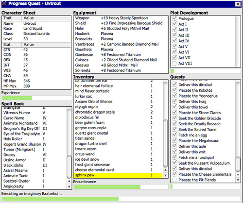

# Leveling Up in The Process Quest

## [The Hiccups of Appups and Relups]

Doing some code hot-loading is one of the simplest things in Erlang. You recompile, make a fully-qualified function call, and then enjoy. Doing it right and safe is much more difficult, though.
在Erlang中，执行一些代码热加载是最简单的事情之一。重新编译，进行完全限定的函数调用，然后享受。不过，正确、安全地操作要困难得多。

There is one very simple challenge that makes code reloading problematic. Let's use our amazing Erlang-programming brain and have it imagine a gen_server process. This process has a `handle_cast/2` function that accepts one kind of argument. I update it to one that takes a different kind of argument, compile it, push it in production. All is fine and dandy, but because we have an application that we don't want to shut down, we decide to load it on the production VM to make it run.
有一个非常简单的挑战使得代码重新加载成问题。让我们使用我们惊人的Erlang编程大脑，让它想象一个gen_服务器进程。这个进程有一个“handle_cast/2”函数，它接受一种参数。我将它更新为一个接受不同类型的参数的版本，编译它，并将其推送到生产环境中。一切都很好，但由于我们有一个不想关闭的应用程序，我们决定将其加载到生产虚拟机上，使其运行。


![一连串的演变/更新。第一个是猴子，第二个是类人生物，两者之间用一个写着“更新”的箭头隔开。然后出现了一支箭，箭上的爆炸声是“升级失败”，它指向一堆垃圾，墓碑上的爆炸声是“RIP，YOU\”(。。/静态/img/进化。（巴布亚新几内亚）

Then a bunch of error reports start pouring in. It turns out that your different `handle_cast` functions are incompatible. So when they were called a second time, no clause matched. The customer is pissed off, so is your boss. Then the operations guy is also angry because he has to get on location and rollback the code, extinguish fires, etc. If you're lucky, you're that operations guy. You're staying late and ruining the janitor's night (he usually loves to hum along with his music and dance a little bit, but he feels ashamed in your presence). You come home late, your family/friends/WoW raid party/children are mad at you, they yell, scream, slam the door and you're left alone. You had promised that nothing could go wrong, no downtime. You're using Erlang after all, right? Oh but it didn't happen so. You're left alone, curled up in a ball in the corner of the kitchen, eating a frozen hot pocket.
然后大量错误报告开始涌入。事实证明，不同的“handle_cast”函数是不兼容的。所以，当他们第二次被呼叫时，没有匹配的子句。顾客很生气，你的老板也很生气。然后，操作人员也很生气，因为他必须到达现场，回滚代码，灭火等等。如果你幸运的话，你就是那个做手术的人。你待得很晚，破坏了看门人的夜晚（他通常喜欢哼着音乐跳舞，但当着你的面他会感到羞愧）。你回家晚了，你的家人/朋友/魔兽世界突袭派对/孩子们对你很生气，他们大喊大叫，砰的一声关上门，只剩下你一个人了。你答应过不会出错，不会停机。毕竟你在使用Erlang，对吗？哦，但事实并非如此。你独自一人，蜷缩在厨房角落的一个球里，吃着冻热的口袋。

Of course things aren't always that bad, but the point stands. Doing live code upgrades on a production system can be very dangerous if you're changing the interface your modules give to the world: changing internal data structures, changing function names, modifying records (remember, they're tuples!), etc. They all have the potential to crash things.
当然事情并不总是那么糟糕，但关键是。在生产系统上进行实时代码升级可能非常危险，如果您正在更改模块提供给世界的接口：更改内部数据结构、更改函数名称、修改记录（记住，它们是元组！），等。它们都有可能导致崩溃。

When we were first playing with code reloading, we had a process with some kind of hidden message to handle doing a fully-qualified call. If you recall, a process could have looked like this:
当我们第一次玩代码重新加载时，我们有一个带有某种隐藏消息的过程来处理一个完全限定的调用。如果你还记得，一个过程可能是这样的：

```erl
loop(N) ->
    receive
        some_standard_message -> N+1;
        other_message -> N-1;
         ->
            Pid ! N,
            loop(N);
        update -> ?MODULE:loop(N);
    end.
```

However, this way of doing things wouldn't fix our problems if we were to change the arguments to `loop/1`. We'd need to extend it a bit like this:
然而，如果我们将参数改为'loop/1'，这种方法无法解决我们的问题`。我们需要像这样扩展它：

```erl
loop(N) ->
    receive
        some_standard_message -> N+1;
        other_message -> N-1;
         ->
            Pid ! N,
            loop(N);
        update -> ?MODULE:code_change(N);
    end.
```

And then `code_change/1` can take care of calling a new version of loop. But this kind of trick couldn't work with generic loops. See this example:
然后，'code_change/1'可以负责调用新版本的循环。但是这种技巧不能用于泛型循环。看这个例子：

```erl
loop(Mod, State) ->
    receive
         ->
             = Mod:handle_call(Msg, State),
            From ! Reply,
            loop(Mod, NewState);
        update ->
             = Mod:code_change(State),
            loop(Mod, NewState)
    end.
```

See the problem? If we want to update `Mod`` is received in between the time we reload the code and handle the `update` message. In that case, we'd update the module in an uncontrolled manner. Then we'd crash.
看到问题了吗？如果我们想更新'Mod'，则在重新加载代码和处理'update'消息之间收到。在这种情况下，我们将以不受控制的方式更新模块。然后我们就坠机了。

The secret to getting it right is buried within the entrails of OTP. We must freeze the sands of time! To do so, we require more secret messages: messages to put a process on hold, messages to change the code, and then messages to resume the actions you had before. Deep inside OTP behaviours is hidden a special protocol to take care of all that kind of management. This is done through something called the `sys` module and a second one called `release_handler`, part of the SASL (System Architecture Support Libraries) application. They take care of everything.
正确的秘诀就藏在OTP的内心深处。我们必须冻结时间之沙！为此，我们需要更多的秘密消息：暂停进程的消息、更改代码的消息，以及恢复之前操作的消息。OTP行为的内在深处隐藏着一个特殊的协议来处理所有此类管理。这是通过一个名为“sys”的模块和另一个名为“release_handler”的模块实现的，它是SASL（系统架构支持库）应用程序的一部分。他们照顾一切。

The trick is that you can suspend OTP processes by calling `sys:suspend(PidOrName)` (you can find all of the processes using the supervision trees and looking at the children each supervisor has). Then you use `sys:change_code(PidOrName, Mod, OldVsn, Extra)` to force the process to update itself, and finally, you call `sys:resume(PidOrName)` to make things go again.
诀窍在于，您可以通过调用'sys:suspend（PidOrName）'（您可以使用监控树查找所有进程，并查看每个监控程序的子进程）来挂起OTP进程。然后使用'sys:change_code（PidOrName，Mod，OldVsn，Extra）`强制进程更新自身，最后调用'sys:resume（PidOrName）`使事情再次进行。

It wouldn't be very practical for us to call these functions manually by writing ad-hoc scripts all the time. Instead, we can look at how relups are done.
对于我们来说，通过一直编写临时脚本来手动调用这些函数是不太实际的。相反，我们可以看看如何进行重新连接。

## [The 9th Circle of Erl]


 and *relups* (file containing instructions to update an entire release) quickly turns into a struggle through APIs and undocumented assumptions.
获取正在运行的版本、制作第二个版本并在运行时进行更新的行为是危险的。看似简单的*appups*（包含如何更新单个应用程序的说明的文件）和*relups*（包含更新整个版本的说明的文件）的组合，很快就通过API和未记录的假设变成了一场斗争。

We're getting into one of the most complex parts of OTP, difficult to comprehend and get right, on top of being time consuming. In fact, if you can avoid the whole procedure (which will be called *relup* from now on) and do simple rolling upgrades by restarting VMs and booting new applications, I would recommend you do so. Relups should be one of these 'do or die' tools. Something you use when you have few more choices.
我们正在进入OTP中最复杂的部分之一，除了耗时之外，很难理解和正确理解。事实上，如果您可以避免整个过程（从现在起称为“relup”），通过重启虚拟机和启动新应用程序来进行简单的滚动升级，我建议您这样做。Relups应该是这些“要么做，要么死”的工具之一。当你没有更多选择时，你会使用的东西。

There are a bunch of different levels to have when dealing with release upgrades:

-   Write OTP applications
-   Turn a bunch of them into a release
-   Create new versions of one or more of the OTP applications
-   Create an `appup` file that explains what to change to make the transition between the old and the new application work
-创建一个“appup”文件，解释如何更改以在新旧应用程序之间进行转换
-   Create a new release with the new applications
-   Generate a relup file from these releases
-   Install the new app in a running Erlang shell

Each of which can be more complex than the preceding one. We've only seen how to do the first 3 steps here. To be able to work with an application that is more adapted to long-running upgrades than the previous ones (eh, who cares about running regexes without restarting), we'll introduce a superb video game.
每一个都可能比前一个更复杂。我们在这里只看到了前3个步骤。为了能够使用比以前更适合长时间运行的升级的应用程序（呃，谁在乎在不重新启动的情况下运行regex），我们将推出一款出色的视频游戏。

## [Progress Quest]

[Progress Quest](http://progressquest.com) is a revolutionary Role Playing Game. I would call it the OTP of RPGs in fact. If you've ever played an RPG before, you'll notice that many steps are similar: run around, kill enemies, gain experience, get money, level up, get skills, complete quests. Rinse and repeat forever. Power players will have shortcuts such as macros or even bots to go around and do their bidding for them.
[进步探索](http://progressquest。是一款革命性的角色扮演游戏。我会称之为RPG的OTP。如果你以前玩过RPG，你会注意到很多步骤都是相似的：四处奔跑，杀死敌人，获得经验，获得金钱，升级，获得技能，完成任务。永远冲洗并重复。强大的玩家将有快捷方式，比如宏，甚至是机器人，可以四处走动，为他们出价。

Progress Quest took all of these generic steps and turned them into one streamlined game where all you have to do is sit back and enjoy your character doing all the work:
Progress Quest采用了所有这些通用步骤，并将其转化为一款流线型游戏，你只需坐下来享受角色完成所有工作的乐趣：



With the permission of the creator of this fantastic game, Eric Fredricksen, I've made a very minimal Erlang clone of it called *Process Quest*. Process Quest is similar in principle to Progress Quest, but rather than being a single-player application, it's a server able to hold many raw socket connections (usable through [telnet](http://en.wikipedia.org/wiki/Telnet#Telnet_clients)) to let someone use a terminal and temporarily play the game.
在这个神奇游戏的创造者埃里克·弗雷德里克森的许可下，我制作了一个非常简单的Erlang克隆版，名为*Process Quest*。Process Quest原则上与Progress Quest类似，但它不是一个单人应用程序，而是一个能够容纳许多原始套接字连接的服务器（可通过[telnet]使用）(http://en。维基百科。org/wiki/Telnet#Telnet_clients））允许某人使用终端并临时玩游戏。

The game is made of the following parts:

### regis-1.0.0

The regis application is a process registry. It has an interface somewhat similar to the regular Erlang process registry, but it can accept any term at all and is meant to be dynamic. It might make things slower because all the calls will be serialized when they enter the server, but it will be better than using the regular process registry, which is not made for that kind of dynamic work. If this guide could automatically update itself with external libraries (it's too much work), I would have used [gproc](https://github.com/uwiger/gproc). The first one is a wrapper around the two other ones (and an application callback module), `regis_server` is the main registration gen_server, and `regis_sup` is the application's supervisor.
regis应用程序是一个进程注册表。它有一个类似于常规Erlang进程注册表的接口，但它可以接受任何术语，并且是动态的。这可能会让事情变得更慢，因为所有调用在进入服务器时都会被序列化，但这比使用常规进程注册表要好，后者不适合这种动态工作。如果这个指南可以自动用外部库更新自己（这太麻烦了），我会使用[gproc](https://github。com/uwiger/gproc）。第一个是围绕另外两个（以及一个应用程序回调模块）的包装器，`regis_server`是主注册gen_服务器，`regis_sup`是应用程序的主管。

### processquest-1.0.0

This is the core of the application. It includes all the game logic. Enemies, market, killing fields and statistics. The player itself is a gen_fsm that sends messages to itself in order to keep going all the time. It contains more modules than `regis`:
这是应用程序的核心。它包含了所有的游戏逻辑。敌人、市场、杀戮场和统计数据。玩家本身就是一个gen_fsm，它会向自己发送消息，以便一直保持运行。它包含的模块比“regis”多：

[pq_enemy.erl](static/erlang/processquest/apps/processquest-1.0.0/src/pq_enemy.erl.html)
:   This module randomly picks an enemy to fight, of the form ``. This lets the player fight an enemy.
：本模块随机选择一个敌人进行战斗，形式如下``。这可以让玩家与敌人作战。

[pq_market.erl](static/erlang/processquest/apps/processquest-1.0.0/src/pq_market.erl.html)
:   This implements a market that allows to find items of a given value and a given strength. All items returned are of the form ``. There are functions to fetch weapons, armors, shields and helmets.
：这实现了一个市场，允许找到具有给定价值和强度的商品。所有退回的物品均为``。有获取武器、盔甲、盾牌和头盔的功能。

[pq_stats.erl](static/erlang/processquest/apps/processquest-1.0.0/src/pq_stats.erl.html)
:   This is a small attribute generator for your character.

[pq_events.erl](static/erlang/processquest/apps/processquest-1.0.0/src/pq_events.erl.html)
:   A wrapper around a gen_event event manager. This acts as a generic hub to which subscribers connect themselves with their own handlers to receive events from each player. It also takes care of waiting a given delay for the player's actions to avoid the game being instantaneous.
：gen_事件管理器的包装。它充当一个通用的中心，订阅者将自己与自己的处理程序连接起来，以接收来自每个玩家的事件。它还负责等待给定的延迟，等待玩家的动作，以避免游戏瞬间发生。

[pq_player.erl](static/erlang/processquest/apps/processquest-1.0.0/src/pq_player.erl.html)
:   The central module. This is a gen_fsm that goes through the state loop of killing, then going to the market, then killing again, etc. It uses all of the above modules to function.
：中央模块。这是一个gen_fsm，它经历了杀戮的状态循环，然后进入市场，然后再次杀戮，等等。它使用上述所有模块来运行。

[pq_sup.erl](static/erlang/processquest/apps/processquest-1.0.0/src/pq_sup.erl.html)
:   A supervisor that sits above a pair of `pq_event` and `pq_player` processes. They both need to be together in order to work, otherwise the player process is useless and isolated or the event manager will never get any events.
：坐在一对“pq_事件”和“pq_玩家”进程之上的主管。它们都需要在一起才能工作，否则玩家进程将毫无用处且孤立，或者事件管理器将永远无法获得任何事件。

[pq_supersup.erl](static/erlang/processquest/apps/processquest-1.0.0/src/pq_supersup.erl.html)
:   The top-level supervisor of the application. It sits over a bunch of `pq_sup` processes. This lets you spawn as many players as you'd like.
：应用程序的顶级主管。它涵盖了一系列“pq_sup”过程。这可以让你产生尽可能多的玩家。

[processquest.erl](static/erlang/processquest/apps/processquest-1.0.0/src/processquest.erl.html)
:   A wrapper and application callback module. It gives the basic interface to a player: you start one, then subscribe to events.
：包装器和应用程序回调模块。它为玩家提供了基本的界面：你启动一个，然后订阅事件。

### sockserv-1.0.0


A customized raw socket server, made to work only with the processquest app. It will spawn gen_servers each in charge of a TCP socket that will push strings to some client. Again, you may use telnet to work with it. Telnet was technically not made for raw socket connections and is its own protocol, but most modern clients accept it without a problem. Here are its modules:
定制的原始套接字服务器，仅用于processquest应用程序。它将产生gen_服务器，每个服务器负责一个TCP套接字，将字符串推送到某个客户端。同样，您可以使用telnet来处理它。Telnet在技术上不是为原始套接字连接而设计的，它是自己的协议，但大多数现代客户端都毫无问题地接受它。以下是它的模块：

[sockserv_trans.erl](static/erlang/processquest/apps/sockserv-1.0.0/src/sockserv_trans.erl.html)
:   This translates messages received from the player's event manager into printable strings.

[sockserv_pq_events.erl](static/erlang/processquest/apps/sockserv-1.0.0/src/sockserv_pq_events.erl.html)
[sockserv_pq_事件。erl]（static/erlang/processquest/apps/sockserv-1）。0。0/src/sockserv_pq_事件。呃。（html）
:   A simple event handler that takes whatever events come from a player and casts them to the socket gen_server.
：一个简单的事件处理程序，它接收来自玩家的任何事件，并将它们转换到socket gen_服务器。

[sockserv_serv.erl](static/erlang/processquest/apps/sockserv-1.0.0/src/sockserv_serv.erl.html)
:   A gen_server in charge of accepting a connection, communicating with a client and forwarding information to it.
：gen_服务器，负责接受连接、与客户端通信并将信息转发给客户端。

[sockserv_sup.erl](static/erlang/processquest/apps/sockserv-1.0.0/src/sockserv_sup.erl.html)
:   Supervises a bunch of socket servers.

[sockserv.erl](static/erlang/processquest/apps/sockserv-1.0.0/src/sockserv.erl.html)
:   Application callback module for the app as a whole.

### The release

I've set everything up in a directory called [processquest](static/erlang/processquest.zip) with the following structure:
我已经在一个名为[processquest]（static/erlang/processquest）的目录中设置了所有内容。zip）具有以下结构：

``` expand
apps/
 - processquest-1.0.0
   - ebin/
   - src/
   - ...
 - regis-1.0.0
   - ...
 - sockserv-1.0.0
   - ...
rel/
  (will hold releases)
processquest-1.0.0.config
```

Based on that, we can build a release.

::: note
**Note:** if you go look into [processquest-1.0.0.config](static/erlang/processquest/processquest-1.0.0.config.html) are included. Crypto is necessary to have good initialisation of pseudo-random number generators and SASL is mandatory to be able to do appups on a system. *If you forget to include SASL in your release, it will be impossible to upgrade the system*
**注：*如果你去查看[processquest-1]。0。0。配置]（静态/erlang/processquest/processquest-1。0。0。配置。html）包含在内。加密是对伪随机数生成器进行良好初始化所必需的，而SASL是在系统上执行应用程序所必需的。*如果您忘记将SASL包含在您的版本中，则无法升级系统*

A new filter has appeared in the config file: ``. This filter makes sure that no `.ez` file is generated, only regular files and directories. This is necessary because the tools we're going to use can not look into `.ez` files to find the items they need.
配置文件中出现了一个新过滤器：``。此过滤器确保`。生成ez`文件，只生成常规文件和目录。这是必要的，因为我们将要使用的工具无法查看`。ez`文件来找到他们需要的物品。

You will also see that there are no instructions asking to strip the `debug_info`. Without `debug_info`, doing an appup will fail for some reason.
您还将看到，没有要求删除“调试”信息的说明`。如果没有“debug_info”，则由于某些原因，进行应用程序升级将失败。
:::

Following last chapter's instructions, we start by calling `erl -make` for all applications. Once this is done, start an Erlang shell from the `processquest` directory and type in the following:
按照上一章的说明，我们首先为所有应用程序调用“erl-make”。完成此操作后，从“processquest”目录启动Erlang shell，并键入以下内容：

```eshell
1>  = reltool:get_target_spec(Conf), reltool:eval_target_spec(Spec, code:root_dir(), "rel").
ok
```

We should have a functional release. Let's try it. Start any version of the VM by doing `./rel/bin/erl -sockserv port 8888` (or any other port number you want. Default is 8082). This will show a lot of logs about processes being started (that's one of the functions of SASL), and then a regular Erlang shell. Start a telnet session on your localhost using whatever client you want:
我们应该有一个功能性的版本。让我们试试看。通过执行以下操作启动任何版本的VM`。/rel/bin/erl-sockserv端口8888`（或您想要的任何其他端口号。默认值为8082）。这将显示大量关于正在启动的进程的日志（这是SASL的功能之一），然后是一个常规的Erlang shell。使用您想要的任何客户端在本地主机上启动telnet会话：

``` expand
$ telnet localhost 8888
Trying 127.0.0.1...
Connected to localhost.
Escape character is '^]'.
What's your character's name?
hakvroot
Stats for your character:
  Charisma: 7
  Constitution: 12
  Dexterity: 9
  Intelligence: 8
  Strength: 5
  Wisdom: 16

Do you agree to these? y/n
```

That's a bit too much wisdom and charisma for me. I type in `n` then `<Enter>`:

``` expand
n
Stats for your character:
  Charisma: 6
  Constitution: 12
  Dexterity: 12
  Intelligence: 4
  Strength: 6
  Wisdom: 10

Do you agree to these? y/n
```

Oh yes, that's ugly, dumb and weak. Exactly what I'm looking for in a hero based on me:

``` expand
y
Executing a Wildcat...
Obtained Pelt.
Executing a Pig...
Obtained Bacon.
Executing a Wildcat...
Obtained Pelt.
Executing a Robot...
Obtained Chunks of Metal.
...
Executing a Ant...
Obtained Ant Egg.
Heading to the marketplace to sell loot...
Selling Ant Egg
Got 1 bucks.
Selling Goblin hair
Got 1 bucks.
...
Negotiating purchase of better equipment...
Bought a plastic knife
Heading to the killing fields...
Executing a Pig...
Obtained Bacon.
Executing a Ant...
```

OK, that's enough for me. Type in `quit` then `<Enter>` to close the connection:

``` expand
quit
Connection closed by foreign host.
```

If you want, you can leave it open, see yourself level up, gain stats, etc. The game basically works, and you can try with many clients. It should keep going without a problem.
如果你想的话，你可以把它打开，看到自己升级，获得数据等等。这个游戏基本上是有效的，你可以尝试与许多客户。它应该继续运行，没有问题。

Awesome right? Well\...

## [Making Process Quest Better]


There are a few issues with the current versions of the applications of Process Quest. First of all, we have very little variety in terms of enemies to beat. Second, we have text that looks a bit weird (what is it with `Executing a Ant...`). A third issue is that the game is a bit too simple; let's add a mode for quests! Another one is that the value of items is directly bound to your level in the real game, while our version doesn't do it. Last of all, and you couldn't see this unless you read the code and tried to close the client on your own end, a client closing their connection will leave the player process alive on the server. Uh oh, memory leaks!
Process Quest应用程序的当前版本存在一些问题。首先，我们要打败的敌人种类很少。第二，我们的文本看起来有点奇怪（执行蚂蚁是什么意思。。。`)。第三个问题是游戏有点太简单；让我们为任务添加一个模式！另一个问题是，道具的价值直接与你在真实游戏中的级别有关，而我们的版本没有做到这一点。最后，除非您阅读代码并尝试关闭自己端的客户端，否则您无法看到这一点。关闭连接的客户端将使服务器上的播放机进程保持活动状态。哦，哦，记忆泄露！

I'll have to fix this! First, I started by making a new copy of both applications that need fixes. I now have `processquest-1.1.0` and `sockserv-1.0.1` on top of the others (I use the version scheme of `MajorVersion.Enhancements.BugFixes`). Then I implemented all the changes I needed. I won't go through all of them, because the details are too many for the purpose of this chapter --- we're here to upgrade an app, not to know all its little details and intricacies. In the case you do want to know all the little intricacies, I made sure to comment all of the code in a decent way so that you might be able to find the information you need to understand it. First, the changes to `processquest-1.1.0`. All in all, changes were brought to [pq_enemy.erl](static/erlang/processquest/apps/processquest-1.1.0/src/pq_enemy.erl.html), that implements quests based on how many enemies were killed by a player. Of these files, only `pq_player.erl` had changes incompatible that will require a time suspension. The change I brought was to change the record:
我得把它修好！首先，我开始制作两个需要修复的应用程序的新副本。我现在有了'processquest-1'。1.。0'和'sockserv-1。0。1`在其他版本之上（我使用'MajorVersion'的版本方案。增强功能。修补程序`）。然后我实现了我需要的所有更改。我不会一一列举，因为就本章而言，细节太多了——我们在这里是为了升级一个应用程序，而不是为了了解它的所有小细节和复杂之处。如果你真的想知道所有的小细节，我确保以一种体面的方式对所有代码进行注释，以便你能够找到理解它所需的信息。首先是对“processquest-1”的更改。1.。0`。总而言之，对[pq_]敌人进行了改变。erl]（静态/erlang/processquest/apps/processquest-1。1.。0/src/pq_敌人。呃。html），根据玩家杀死多少敌人来执行任务。在这些文件中，只有“pq_播放器”。erl的更改不兼容，需要暂停一段时间。我带来的改变是改变记录：

```erl
-record(state, {name, stats, exp=0, lvlexp=1000, lvl=1,
                equip=[], money=0, loot=[], bought=[], time=0}).
```

To this one:

```erl
-record(state, {name, stats, exp=0, lvlexp=1000, lvl=1,
                equip=[], money=0, loot=[], bought=[],
                time=0, quest}).
```

Where the `quest` field will hold a value given by `pq_quest:fetch/0`. Because of that change, I'll need to modify the `code_change/4` function in the version 1.1.0. In fact I'll need to modify it twice: once in the case of an upgrade (moving from 1.0.0 to 1.1.0), and another time in the case of a downgrade (1.1.0 to 1.0.0). Fortunately, OTP will pass us different arguments in each case. When we upgrade, we get a version number for the module. We don't exactly care for that one at this point and we'll likely just ignore it. When we downgrade, we get ``. This lets us easily match on each operation:
其中'quest'字段将保存'pq_quest:fetch/0'给定的值`。由于这个变化，我需要修改版本1中的'code_change/4'函数。1.。0。事实上，我需要修改两次：一次是在升级的情况下（从1开始）。0。0比1。1.。0），降级情况下另一次（1）。1.。0比1。0。0)。幸运的是，检察官办公室在每种情况下都会给我们提供不同的理由。升级时，我们会得到模块的版本号。我们现在并不关心这个问题，我们很可能会忽略它。当我们降级时，我们会``。这让我们可以轻松匹配每项操作：

```erl
code_change(, StateName, State, _Extra) ->
    ...;
code_change(_OldVsn, StateName, State, _Extra) ->
    ....
```

But hold on a second right there! We can't just blindly take the state as we usually do. We need to upgrade it. The problem is, we can't do something like:
但请稍等！我们不能像平常那样盲目地对待国家。我们需要升级它。问题是，我们不能这样做：

```erl
code_change(_OldVsn, StateName, S = #state, _Extra) ->
   ....
```

We have two options. The first one is to declare a new state record that will have a new form. We'd end up having something like:
我们有两个选择。第一个是宣布一个新的州记录，它将有一个新的形式。我们最终会有这样的结果：

```erl
-record(state, ).
-record(new_state, ).
```

And then we'd have to change the record in each of the function clauses of the module. That's annoying and not worth the risk. It will be simpler, instead, to expand the record to its underlying tuple form (remember [A Short Visit to Common Data Structures](a-short-visit-to-common-data-structures.html)):
然后我们必须更改模块的每个函数子句中的记录。这很烦人，不值得冒险。相反，将记录扩展到其底层元组形式会更简单（记住[对公共数据结构的短暂访问]（对公共数据结构的短暂访问）。html）：

```erl
code_change(,
            StateName,
            #state{name=N, stats=S, exp=E, lvlexp=LE, lvl=L, equip=Eq,
                   money=M, loot=Lo, bought=B, time=T},
            _Extra) ->
    Old = ,
    ;
code_change(_OldVsn,
            StateName,
            {state, Name, Stats, Exp, LvlExp, Lvl, Equip, Money, Loot,
             Bought, Time},
             _Extra) ->
    State = #state{
        name=Name, stats=Stats, exp=Exp, lvlexp=LvlExp, lvl=Lvl, equip=Equip,
        money=Money, loot=Loot, bought=Bought, time=Time, quest=pq_quest:fetch()
    },
    .
```

And there's our `code_change/4` function! All it does is convert between both tuple forms. For new versions, we also take care of adding a new quest --- it would be boring to add quests but have all our existing players unable to use them. You'll notice that we still ignore the `_Extra` variable. This one is passed from the appup file (to be described soon), and you'll be the one to pick its value. For now, we don't care because we can only upgrade and downgrade to and from one release. In some more complex cases, you might want to pass release-specific information in there.
还有我们的“代码更改/4”功能！这两种形式都是元组转换。对于新版本，我们还负责添加一个新任务——添加任务会很无聊，但现有的所有玩家都无法使用它们。您会注意到，我们仍然忽略了`_Extra`变量。这一个是从appup文件（将很快描述）传递的，您将是选择其值的人。目前，我们不在乎，因为我们只能在一个版本之间升级和降级。在一些更复杂的情况下，您可能希望在其中传递特定于发布的信息。

For the `sockserv-1.0.1` application, only [sockserv_serv.erl](static/erlang/processquest/apps/sockserv-1.0.1/src/sockserv_serv.erl.html) required changes. Fortunately, they didn't need a restart, only a new message to match on.
对于“sockserv-1”。0。1`应用程序，仅限[sockserv_serv]。erl]（static/erlang/processquest/apps/sockserv-1）。0。1/src/sockserv_serv。呃。html）所需的更改。幸运的是，他们不需要重新启动，只需要一条新消息来匹配。

The two versions of the two applications have been fixed. That's not enough to go on our merry way though. We have to find a way to let OTP know what kind of changes require different kinds of actions.
两个应用程序的两个版本已经修复。但这还不足以让我们继续快乐的生活。我们必须想办法让检察官办公室知道什么样的变化需要采取不同的行动。

## [Appup Files]

Appup files are lists of Erlang commands that need to be done to upgrade a given application. They contain lists of tuples and atoms telling what to do and in what case. The general format for them is:
Appup文件是升级给定应用程序所需执行的Erlang命令列表。它们包含元组和原子的列表，告诉我们该做什么，在什么情况下做什么。它们的一般格式是：

```erl
{NewVersion,
 []
 [.
```

They ask for lists of versions because it's possible to upgrade and downgrade to many different versions. In our case, for `processquest-1.1.0`, this would be:
他们要求提供版本列表，因为可以升级和降级到许多不同的版本。在我们的例子中，对于'processquest-1。1.。0`，这将是：

```erl
{"1.1.0",
 [],
 [.
```

The instructions contain both high-level and low-level commands. We usually only need to care about high-level ones, though.
高级指令和低级指令都包含。不过，我们通常只需要关心高层的问题。


:   The module `Mod` is loaded for the first time.


:   The module `Mod` is already loaded in the VM and has been modified.


:   The module `Mod` is removed from the VM.


:   This will suspend all processes running `Mod` can be used to pass in arbitrary data to the `code_change` function, in case it's required for upgrades.
：这将暂停所有运行“Mod”的进程，以便在升级需要时将任意数据传递给“code_change”函数。


:   Calling this lets you re-define the `init` function of a supervisor to influence its restart strategy (`one_for_one`, `rest_for_one`, etc.) or change child specifications (this will not affect existing processes).
：调用此函数可以重新定义主管的'init'函数，以影响其重启策略（'one_for_one'，'rest_for_one'，等等）。)或更改子规范（这不会影响现有流程）。


:   Will call `apply(M,F,A)`.

Module dependencies
:   You can use ` and its dependencies are *not* part of the same application. There is sadly no way to give similar dependencies to `delete_module` instructions.
：您可以使用`并且它的依赖项*不是*同一应用程序的一部分。遗憾的是，没有办法为“delete_module”指令提供类似的依赖关系。

Adding or removing an application
:   When generating relups, we won't need any special instructions to remove or add applications. The function that generates `relup` files (files to upgrade releases) will take care of detecting this for us.
：生成重新注册时，我们不需要任何特殊说明来删除或添加应用程序。生成“relup”文件（用于升级版本的文件）的函数将为我们检测到这一点。

Using these instructions, we can write the two following appup files for our applications. The file must be named `NameOfYourApp.appup` and be put in the app's `ebin/` directory. Here's [processquest-1.1.0's appup file](static/erlang/processquest/apps/processquest-1.1.0/ebin/processquest.appup.html):
使用这些说明，我们可以为应用程序编写以下两个appup文件。文件名必须为'NameOfYourApp'。appup`并被放在app的`ebin/`目录中。下面是[processquest-1]。1.。0的appup文件]（静态/erlang/processquest/apps/processquest-1。1.。0/ebin/processquest。阿普普。html）：

```erl
{"1.1.0",
 [,
             ,
             ,
             ],
 [,
             ,
             ,
             .
```

You can see that we need to add the new module, load the two ones that require no suspension, and then update `pq_player` in a safe manner. When we downgrade the code, we do the exact same thing, but in reverse. The funny thing is that in one case, `` will load a new version, and in the other, it will load the old version. It all depends on the context between an upgrade and a downgrade.
您可以看到，我们需要添加新模块，加载两个不需要暂停的模块，然后以安全的方式更新'pq_player'。当我们降低代码等级时，我们会做完全相同的事情，但相反。有趣的是，在一种情况下，`将加载新版本，而在另一种情况下，它将加载旧版本。这完全取决于升级和降级之间的上下文。

Because `sockserv-1.0.1` had only one module to change and that it required no suspension, its [appup file](static/erlang/processquest/apps/sockserv-1.0.1/ebin/sockserv.appup.html) is only:
因为“sockserv-1”。0。1`只有一个模块需要更改，而且不需要暂停，它的[appup file]（static/erlang/processquest/apps/sockserv-1）。0。1/ebin/sockserv。阿普普。html）只是：

```erl
{"1.0.1",
 [],
 [.
```

Woo! The next step is to build a new release using the new modules. Here's the file [processquest-1.1.0.config](static/erlang/processquest/processquest-1.1.0.config.html):
求爱下一步是使用新模块构建新版本。这是文件[processquest-1]。1.。0。配置]（静态/erlang/processquest/processquest-1。1.。0。配置。html）：

```erl
{sys, [
    ,
    ,
            ,
    {rel, "processquest", "1.1.0",
     [kernel, stdlib, sasl, crypto, regis, processquest, sockserv]},
    ,
    ,
    ,
    ,
    ,
    ,
    ,
    ,
    ,
    ,
    ,
    ,
    ,
    
]}.
```

It's a copy/paste of the old one with a few versions changed. First, compile both new applications with `erl -make`. If you have downloaded the [zip file earlier](static/erlang/processquest.zip), they were already there for you. Then we can generate a new release. First, compile the two new applications, and then type in the following:
它是旧版本的复制/粘贴，有几个版本发生了变化。首先，用“erl-make”编译这两个新应用程序`。如果您之前下载了[zip文件]（static/erlang/processquest。他们已经在那里等你了。然后我们可以生成一个新版本。首先，编译两个新应用程序，然后键入以下内容：

```eshell
$ erl -env ERL_LIBS apps/
1>  = reltool:get_target_spec(Conf), reltool:eval_target_spec(Spec, code:root_dir(), "rel").
ok
```

::: 
**Don't Drink Too Much Kool-Aid:**\
Why didn't we just use `systools`? Well systools has its share of issues. First of all, it will generate appup files that sometimes have weird versions in them and won't work perfectly. It will also assume a directory structure that is barely documented, but somewhat close to what reltool uses. The biggest issue, though, is that it will use your default Erlang install as the root directory, which might create all kinds of permission issues and whatnot when the time comes to unpack stuff.
我们为什么不直接使用“系统工具”？当然，systools也有自己的问题。首先，它将生成appup文件，这些文件中有时有奇怪的版本，无法完美工作。它还将假定一个几乎没有文档记录的目录结构，但有点接近reltool使用的目录结构。不过，最大的问题是，它将使用默认的Erlang安装作为根目录，这可能会在解包时产生各种权限问题等等。

There's just no easy way with either tools and we'll require a lot of manual work for that. We thus make a chain of commands that uses both modules in a rather complex manner, because it ends up being a little bit less work.
这两种工具都没有简单的方法，我们需要大量的手工操作。因此，我们创建了一个命令链，以一种相当复杂的方式使用这两个模块，因为它最终会减少一点工作量。
:::

But wait, there's more manual work required!

1.  copy `rel/releases/1.1.0/processquest.rel` as `rel/releases/1.1.0/processquest-1.1.0.rel`.
2.  copy `rel/releases/1.1.0/processquest.boot` as `rel/releases/1.1.0/processquest-1.1.0.boot`.
3.  copy `rel/releases/1.1.0/processquest.boot` as `rel/releases/1.1.0/start.boot`.
4.  copy `rel/releases/1.0.0/processquest.rel` as `rel/releases/1.0.0/processquest-1.0.0.rel`.
5.  copy `rel/releases/1.0.0/processquest.boot` as `rel/releases/1.0.0/processquest-1.0.0.boot`.
6.  copy `rel/releases/1.0.0/processquest.boot` as `rel/releases/1.0.0/start.boot`.

Now we can generate the `relup` file. To do this, start an Erlang shell and call the following:

```eshell
$ erl -env ERL_LIBS apps/ -pa apps/processquest-1.0.0/ebin/ -pa apps/sockserv-1.0.0/ebin/
1> systools:make_relup("./rel/releases/1.1.0/processquest-1.1.0", ["rel/releases/1.0.0/processquest-1.0.0"], ["rel/releases/1.0.0/processquest-1.0.0"]).
1> 系统工具：重新启动（“。/rel/releases/1。1.。0/processquest-1。1.。0“，[”rel/releases/1。0。0/processquest-1。0。0“]，[“rel/releases/1。0。0/processquest-1。0。0"])。
ok
```

Because the `ERL_LIBS` env variable will only look for the newest versions of applications, we also need to add the `-pa <Path to older applications>` in there so that systools' relup generator will be able to find everything. Once this is done, move the relup file to `rel/releases/1.1.0/`. That directory will be looked into when updating the code in order to find the right stuff in there. One problem we'll have, though, is that the release handler module will depend on a bunch of files it assumes to be present, but won't necessarily be there.
因为'ERL_LIBS'env变量只会查找最新版本的应用程序，所以我们还需要在其中添加`-pa<Path to older applications>，以便systools'relup generator能够找到所有内容。完成后，将relup文件移动到'rel/releases/1。1.。0/`。更新代码时会查看该目录，以便在其中找到正确的内容。不过，我们会遇到的一个问题是，release handler模块将依赖于它假定存在但不一定存在的一组文件。


![一杯带饼干和勺子的咖啡]。短信上写着“休息一下”(。。/静态/模拟/休息。（巴布亚新几内亚）

## [Upgrading the Release]

Sweet, we've got a relup file. There's still stuff to do before being able to use it though. The next step is to generate a tar file for the whole new version of the release:
亲爱的，我们有一个更新文件。不过，在能够使用它之前，还有很多事情要做。下一步是为整个新版本的发行版生成一个tar文件：

```eshell
2> systools:make_tar("rel/releases/1.1.0/processquest-1.1.0").
ok
```

The file will be in `rel/releases/1.1.0/`. We now need to manually move it to `rel/releases`, and rename it to add the version number when doing so. More hard-coded junk! `$ mv rel/releases/1.1.0/processquest-1.1.0.tar.gz rel/releases/` is our way out of this.
该文件将位于'rel/releases/1'中。1.。0/`。我们现在需要手动将其移动到'rel/releases'，并重命名它以添加版本号。更多硬编码垃圾！“$mv rel/releases/1。1.。0/processquest-1。1.。0。焦油。gz rel/releases/`是我们的出路吗。

Now this is a step you want to do at *any time before you start the real production application*. This is a step that needs to be done *before* you start the application as it will allow you to rollback to the initial version after a relup. If you do not do this, you will be able to downgrade production applications only to releases newer than the first one, but not the first one!
现在，在启动真正的生产应用程序之前，您可以随时执行此步骤*。这是启动应用程序之前需要完成的一个步骤，因为它将允许您在重新启动后回滚到初始版本。如果不这样做，您将只能将生产应用程序降级到比第一个版本更新的版本，而不是第一个版本！

Open a shell and run this:

```eshell
1> release_handler:create_RELEASES("rel", "rel/releases", "rel/releases/1.0.0/processquest-1.0.0.rel", []).
1> 释放处理程序：创建释放（“rel”、“rel/RELEASES”、“rel/RELEASES/1”。0。0/processquest-1。0。0。rel“，[]）。
```

The general format of the function is `release_handler:create_RELEASES(RootDir, ReleasesDir, Relfile, [) that will contain basic information on your releases when relup is looking for files and modules to reload.
该函数的一般格式为“release\u handler:create_release（RootDir，ReleasesDir，Relfile，[]），当relup查找要重新加载的文件和模块时，它将包含有关您的发布的基本信息。

We can now start running the old version of the code. If you start `rel/bin/erl`, it will start the 1.1.0 release by default. That's because we built the new release before starting the VM. For this demonstration, we'll need to start the release with `./rel/bin/erl -boot rel/releases/1.0.0/processquest`. You should see everything starting up. Start a telnet client to connect to our socket server so we can see the live upgrade taking place.
我们现在可以开始运行旧版本的代码了。如果启动'rel/bin/erl'，它将启动1。1.。默认情况下为0版本。这是因为我们在启动VM之前构建了新版本。对于这个演示，我们需要从`。/rel/bin/erl-启动rel/releases/1。0。0/processquest`。你应该看到一切都开始了。启动telnet客户端连接到我们的socket服务器，这样我们就可以看到实时升级。

Whenever you feel ready for an upgrade, go to the Erlang shell currently running ProcessQuest, and call the following function:
每当您准备好升级时，请转到当前运行ProcessQuest的Erlang shell，并调用以下函数：

```eshell
1> release_handler:unpack_release("processquest-1.1.0").

2> release_handler:which_releases().
[{"processquest","1.1.0",
  ["kernel-2.14.4","stdlib-1.17.4","crypto-2.0.3",
   "regis-1.0.0","processquest-1.1.0","sockserv-1.0.1",
   "sasl-2.1.9.4"],
  unpacked},
 {"processquest","1.0.0",
  ["kernel-2.14.4","stdlib-1.17.4","crypto-2.0.3",
   "regis-1.0.0","processquest-1.0.0","sockserv-1.0.0",
   "sasl-2.1.9.4"],
  permanent}]
```

The second prompt here tells you that the release is ready to be upgraded, but not installed nor made permanent yet. To install it, do:
这里的第二个提示告诉您，该版本已准备好升级，但尚未安装或永久化。要安装它，请执行以下操作：

```eshell
3> release_handler:install_release("1.1.0").

4> release_handler:which_releases().
[{"processquest","1.1.0",
  ["kernel-2.14.4","stdlib-1.17.4","crypto-2.0.3",
   "regis-1.0.0","processquest-1.1.0","sockserv-1.0.1",
   "sasl-2.1.9.4"],
  current},
 {"processquest","1.0.0",
  ["kernel-2.14.4","stdlib-1.17.4","crypto-2.0.3",
   "regis-1.0.0","processquest-1.0.0","sockserv-1.0.0",
   "sasl-2.1.9.4"],
  permanent}]
```

So now, the release 1.1.0 should be running, but it's still not there forever. Still, you could keep your application just running that way. Call the following function to make things permanent:
那么现在，第1版。1.。0应该正在运行，但它还没有永远存在。尽管如此，您仍然可以保持应用程序以这种方式运行。调用以下函数使事物永久化：

```eshell
5> release_handler:make_permanent("1.1.0").
ok.
```

Ah damn. A bunch of our processes are dying now (error output removed from the sample above). Except that if you look at our telnet client, it did seem to upgrade fine. The issue is that all the gen_servers that were waiting for connections in sockserv could not listen to messages because accepting a TCP connection is a blocking operation. Thus, the servers couldn't upgrade when new versions of the code were loaded and were killed by the VM. See how we can confirm this:
该死。我们的一系列流程正在消亡（上面的示例中删除了错误输出）。不过，如果你看看我们的telnet客户端，它似乎确实升级得很好。问题是，所有在sockserv中等待连接的gen_服务器都无法侦听消息，因为接受TCP连接是一种阻塞操作。因此，当新版本的代码被加载并被VM杀死时，服务器无法升级。看看我们如何确认这一点：

```eshell
6> supervisor:which_children(sockserv_sup).
[]
7> [sockserv_sup:start_socket() || _ <- lists:seq(1,20)].
[,
 ,
 ...
 ,
 ]
8> supervisor:which_children(sockserv_sup).
[,
 ,
 ...
 ,
 ,
 ]
```

The first command shows that all children that were waiting for connections have already died. The processes left will be those with an active session going on. This shows the importance of keeping code responsive. Had our processes been able to receive messages and act on them, things would have been fine.
第一条命令显示，所有等待连接的孩子都已经死亡。剩下的进程将是那些正在进行活动会话的进程。这表明了保持代码响应的重要性。如果我们的流程能够接收消息并对其采取行动，事情就会好起来。


In the two last commands, I just start more workers to fix the problem. While this works, it requires manual action from the person running the upgrade. In any case, this is far from optimal. A better way to solve the problem would be to change the way our application works in order to have a monitor process watching how many children `sockserv_sup` has. When the number of children falls under a given threshold, the monitor starts more of them. Another strategy would be to change the code so accepting connections is done by blocking on intervals of a few seconds at a time, and keep retrying after pauses where messages can be received. This would give the gen_servers the time to upgrade themselves as required, assuming you'd wait the right delay between the installation of a release and making it permanent. Implementing either or both of these solutions is left as an exercise to the reader because I am somewhat lazy. These kinds of crashes are the reason why you want to test your code *before* doing these updates on a live system.
在最后两个命令中，我只是启动了更多的工作人员来解决问题。虽然这样做有效，但需要运行升级的人员手动操作。无论如何，这远远不是最优的。解决这个问题的更好方法是改变我们的应用程序的工作方式，以便让一个监视进程监视“sockserv_sup”有多少个孩子。当儿童数量低于给定阈值时，监视器会启动更多儿童。另一种策略是更改代码，以便通过一次几秒钟的间隔进行阻塞来接受连接，并在可以接收消息的暂停后继续重试。这将使gen_服务器有时间根据需要进行升级，前提是在安装版本和使其永久化之间等待适当的延迟。实现这两个解决方案中的一个或两个留给读者作为练习，因为我有点懒。这些类型的崩溃正是你想要在实时系统上进行这些更新之前测试代码的原因。

In any case, we've solved the problem for now and we might want to check how the upgrade procedure went:
无论如何，我们现在已经解决了这个问题，我们可能想检查一下升级过程是如何进行的：

```eshell
9> release_handler:which_releases().
[{"processquest","1.1.0",
  ["kernel-2.14.4","stdlib-1.17.4","crypto-2.0.3",
   "regis-1.0.0","processquest-1.1.0","sockserv-1.0.1",
   "sasl-2.1.9.4"],
  permanent},
 {"processquest","1.0.0",
  ["kernel-2.14.4","stdlib-1.17.4","crypto-2.0.3",
   "regis-1.0.0","processquest-1.0.0","sockserv-1.0.0",
   "sasl-2.1.9.4"],
  old}]
```

That's worth a fist pump. You can try downgrading an installation by doing `release_handler:install(OldVersion).`. This should work fine, although it could risk killing more processes that never updated themselves.
这值得一拳。您可以尝试通过执行“release_handler:install（OldVersion）”来降级安装。`。这应该可以很好地工作，尽管它可能会杀死更多从未自我更新的进程。

::: 
**Don't Drink Too Much Kool-Aid:**\
If for some reason, rolling back always fails when trying to roll back to the first version of the release using the techniques shown in this chapter, you have probably forgotten to create the RELEASES file. You can know this if you see an empty list in `` when calling `release_handler:which_releases()`. This is a list of where to find modules to load and reload, and it is first built when booting the VM and reading the RELEASES file, or when unpacking a new release.
如果由于某种原因，在尝试使用本章所示的技术回滚到发行版的第一个版本时，回滚总是失败，那么您可能忘记了创建发行版文件。如果调用'release\u handler:which\u releases（）时在``中看到一个空列表，就可以知道这一点`。这是一个查找要加载和重新加载的模块的列表，它首先是在引导VM和读取版本文件时，或者在解包新版本时生成的。
:::

Ok, so here's a list of all the actions that must be taken to have functional relups:

1.  Write OTP applications for your first software iteration
2.  Compile them
3.  Build a release (1.0.0) using Reltool. It must have debug info and no `.ez` archive.
4.  Make sure you create the RELEASES file at some point before starting your production application. You can do it with `release_handler:create_RELEASES(RootDir, ReleasesDir, Relfile, [])`.
4.。请确保在启动生产应用程序之前的某个时间点创建发布文件。您可以使用“release\u handler:create\u RELEASES（RootDir、ReleasesDir、Relfile、[]）来实现这一点`。
5.  Run the release!
6.  Find bugs in it
7.  Fix bugs in new versions of applications
8.  Write `appup` files for each of the applications
9.  Compile the new applications
10. Build a new release (1.1.0 in our case). It must have debug info and no `.ez` archive
11. Copy `rel/releases/NewVsn/RelName.rel` as `rel/releases/NewVsn/RelName-NewVsn.rel`
12. Copy `rel/releases/NewVsn/RelName.boot` as `rel/releases/NewVsn/RelName-NewVsn.boot`
13. Copy `rel/releases/NewVsn/RelName.boot` as `rel/releases/NewVsn/start.boot`
14. Copy `rel/releases/OldVsn/RelName.rel` as `rel/releases/OldVsn/RelName-OldVsn.rel`
15. Copy `rel/releases/OldVsn/RelName.boot` as `rel/releases/OldVsn/RelName-OldVsn.boot`
16. Copy `rel/releases/OldVsn/RelName.boot` as `rel/releases/OldVsn/start.boot`
17. Generate a relup file with `systools:make_relup("rel/releases/Vsn/RelName-Vsn", ["rel/releases/OldVsn/RelName-OldVsn"], ["rel/releases/DownVsn/RelName-DownVsn"]).`
17。使用“systools:make_relup”（“rel/releases/Vsn/RelName Vsn”、[“rel/releases/OldVsn/RelName OldVsn”]、[“rel/releases/DownVsn/RelName DownVsn”]）生成一个relup文件。`
18. Move the relup file to `rel/releases/Vsn`
19. Generate a tar file of the new release with `systools:make_tar("rel/releases/Vsn/RelName-Vsn").`
20. Move the tar file to `rel/releases/`
21. Have some shell opened that still runs the first version of the release
22. Call `release_handler:unpack_release("NameOfRel-Vsn").`
23. Call `release_handler:install_release(Vsn).`
24. Call `release_handler:make_permanent(Vsn).`
25. Make sure things went fine. If not, rollback by installing an older version.

You might want to write a few scripts to automate this.


![3个位置的讲台：1。你，2。关系，3。作者（第三人）](。。/静态/img/讲台。png“如果我自己写这些视觉双关语，我早就解雇自己了”）

Again, relups are a very messy part of OTP, a part that is hard to grasp. You will likely find yourself finding plenty of new errors, which are all more impossible to understand than the previous ones. Some assumptions are made about how you're going to run things, and choosing different tools when creating releases will change how things should be done. You might be tempted to write your own update code using the `sys` module's functions even! Or maybe use tools like *rebar3* which will automate some of the painful steps. In any case, this chapter and its examples have been written to the best knowledge of the author, a person who sometimes enjoys writing about himself in third person.
同样，在OTP中，重新连接是一个非常混乱的部分，一个很难理解的部分。你可能会发现自己发现很多新的错误，这些错误都比以前的错误更难理解。一些假设是关于你将如何运行的，在创建发布时选择不同的工具将改变事情应该如何完成。您甚至可能会尝试使用'sys'模块的函数编写自己的更新代码！或者可以使用像*rebar3*这样的工具，自动完成一些痛苦的步骤。在任何情况下，本章及其示例都是根据作者所知编写的，作者有时喜欢用第三人称来描述自己。

If it is possible to upgrade your application in ways that do not require relups, I would recommend doing so. It is said that divisions of Ericsson that do use relups spend as much time testing them as they do testing their applications themselves. They are a tool to be used when working with products that can imperatively never be shut down. You will know when you will need them, mostly because you'll be ready to go through the hassle of using them (got to love that circular logic!) When the need arises, relups are entirely useful.
如果可以以不需要重新连接的方式升级应用程序，我建议您这样做。据说，爱立信使用relups的部门花在测试relups上的时间和他们自己测试应用程序的时间一样多。它们是一种工具，用于处理无法强制关闭的产品。你会知道什么时候你会需要它们，主要是因为你已经准备好了使用它们的麻烦（一定要喜欢这种循环逻辑！）当需要时，重新连接是完全有用的。

How about we go learn about some friendlier features of Erlang, now?
