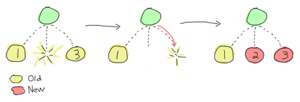

# Who Supervises The Supervisors?

## [From Bad to Good]


Supervisors are one of the most useful part of OTP you'll get to use. We've seen basic supervisors back in [Errors and Processes](errors-and-processes.html). We've seen them as a way to keep our software going in case of errors by just restarting the faulty processes.
主管是OTP中最有用的部分之一，你可以使用它。我们在[错误和流程]（错误和流程）中看到了基本的主管。（html）。我们已经将其视为一种在出现错误时保持软件运行的方法，只需重新启动有故障的进程。

To be more detailed, our supervisors would start a *worker* process, link to it, and trap exit signals with `process_flag(trap_exit,true)` to know when the process died and restart it. This is fine when we want restarts, but it's also pretty dumb. Let's imagine that you're using the remote control to turn the TV on. If it doesn't work the first time, you might try once or twice just in case you didn't press right or the signal went wrong. Our supervisor, if it was trying to turn that very TV on, would keep trying forever, even if it turned out that the remote had no batteries or didn't even fit the TV. A pretty dumb supervisor.
更详细地说，我们的主管会启动一个*worker*进程，链接到它，并用'process_flag（trap_exit，true）'捕捉退出信号，以了解进程何时停止并重新启动它。当我们想要重启时，这很好，但它也很愚蠢。让我们想象一下，你正在用遥控器打开电视。如果第一次不起作用，你可以尝试一两次，以防你没有按对或信号出错。如果我们的主管试图打开那台电视机，他会一直尝试，即使结果是遥控器没有电池，或者甚至连电视机都装不上。一个相当愚蠢的主管。

Something else that was dumb about our supervisors is that they could only watch one worker at a time. Don't get me wrong, it's sometimes useful to have one supervisor for a single worker, but in large applications, this would mean you could only have a chain of supervisors, not a tree. How would you supervise a task where you need 2 or 3 workers at once? With our implementation, it just couldn't be done.
我们的主管还有一个愚蠢的地方，那就是他们一次只能看一个工人。别误会我的意思，有时一个员工有一个主管是有用的，但在大型应用程序中，这意味着你只能有一个主管链，而不是一棵树。如果你同时需要2到3名员工，你会如何监督一项任务？在我们的实现中，这是无法实现的。

The OTP supervisors, fortunately, provide the flexibility to handle such cases (and more). They let you define how many times a worker should be restarted in a given period of time before giving up. They let you have more than one worker per supervisor and even let you pick between a few patterns to determine how they should depend on each other in case of a failure.
幸运的是，检察官办公室的主管提供了处理此类案件的灵活性（以及更多）。它们允许您定义在放弃之前，在给定的时间段内员工应该重新启动多少次。它们允许每个主管有多个工人，甚至允许您在几个模式中进行选择，以确定在出现故障时如何相互依赖。

## [Supervisor Concepts]

Supervisors are one of the simplest behaviours to use and understand, but one of the hardest behaviours to write a good design with. There are various strategies related to supervisors and application design, but before going there we need to understand more basic concepts because otherwise it's going to be pretty hard.
管理者是使用和理解最简单的行为之一，但也是编写良好设计最难的行为之一。有各种与管理者和应用程序设计相关的策略，但在开始之前，我们需要了解更多的基本概念，否则会非常困难。

One of the words I have used in the text so far without much of a definition is the word 'worker'. Workers are defined a bit in opposition of supervisors. If supervisors are supposed to be processes which do nothing but make sure their children are restarted when they die, workers are processes in charge of doing actual work, and that may die while doing so. They are usually not trusted.
到目前为止，我在文中使用的一个没有太多定义的词是“工人”。工人的定义有点与主管相反。如果监工应该是一个什么都不做的过程，只是确保他们的孩子死后重新启动，那么工人就是负责实际工作的过程，他们可能会在这样做时死亡。他们通常不受信任。

Supervisors can supervise workers and other supervisors, while workers should never be used in any position except under another supervisor:
主管可以监督工人和其他主管，而工人不得在任何职位上使用，除非在另一名主管的领导下：


![所有主管节点都位于工作节点（叶）上方的监督树](。。/静态/img/sup-tree。（巴布亚新几内亚）

Why should every process be supervised? Well the idea is simple: if for some reason you're spawning unsupervised processes, how can you be sure they are gone or not? If you can't measure something, it doesn't exist. Now if a process exists in the void away from all your supervision trees, how do you know it exists or not? How did it get there? Will it happen again?\
为什么每个过程都要受到监督？这个想法很简单：如果出于某种原因，你产生了无监督的过程，你怎么能确定它们是否消失了？如果你不能测量某个东西，它就不存在。现在，如果一个过程存在于远离你所有监督树的真空中，你怎么知道它存在与否？它是怎么到达那里的？这种事还会发生吗\
If it does happen, you'll find yourself leaking memory very slowly. So slowly your VM might suddenly die because it no longer has memory, and so slowly you might not be able to easily track it until it happens again and again. Of course, you might say \"If I take care and know what I'm doing, things will be fine\". Maybe they will be fine, yeah. Maybe they won't. In a production system, you don't want to be taking chances, and in the case of Erlang, it's why you have garbage collection to begin with. Keeping things supervised is pretty useful.
如果真的发生了，你会发现自己的内存泄漏非常缓慢。慢慢地，你的虚拟机可能会突然死亡，因为它不再有内存，慢慢地，你可能无法轻松地跟踪它，直到它一次又一次地发生。当然，你可能会说“如果我小心，知道我在做什么，事情会好起来的”。也许他们会没事的。也许他们不会。在生产系统中，你不想冒险，在Erlang的例子中，这就是为什么你要从垃圾收集开始。监督事情是非常有用的。

Another reason why it's useful is that it allows to terminate applications in good order. It will happen that you'll write Erlang software that is not meant to run forever. You'll still want it to terminate cleanly though. How do you know everything is ready to be shut down? With supervisors, it's easy. Whenever you want to terminate an application, you have the top supervisor of the VM shut down (this is done for you with functions like `init:stop/1`). Then that supervisor asks each of its children to terminate. If some of the children are supervisors, they do the same:
它之所以有用的另一个原因是它允许以良好的顺序终止应用程序。你可能会编写一个不打算永远运行的Erlang软件。不过，你仍然希望它干净地终止。你怎么知道一切都准备好关闭了？有了主管，这很容易。每当你想终止一个应用程序时，你都会让VM的最高管理者关闭（这是通过“init:stop/1”这样的函数为你完成的）。然后，该主管要求其每个子女终止合同。如果其中一些孩子是主管，他们也会这样做：


![与之前的管理者树相同，但消息是从上到下，然后再次备份。子节点在其父节点之前终止。](。。/静态/img/辅助树关闭。png“是的，不是最清晰的图画！”

This gives you a well-ordered VM shutdown, something that is very hard to do without having all of your processes being part of the tree.
这会让你有一个有序的VM关闭，如果你的所有进程都不是树的一部分，这是很难做到的。

Of course, there are times where your process will be stuck for some reason and won't terminate correctly. When that happens, supervisors have a way to brutally kill the process.
当然，有时您的流程会因某种原因而受阻，无法正确终止。当这种情况发生时，监管者有办法残忍地扼杀流程。

This is it for the basic theory of supervisors. We have workers, supervisors, supervision trees, different ways to specify dependencies, ways to tell supervisors when to give up on trying or waiting for their children, etc. This is not all that supervisors can do, but for now, this will let us cover the basic content required to actually use them.
这就是监管者的基本理论。我们有员工、主管、监督树、指定依赖关系的不同方式、告诉主管何时放弃尝试或等待孩子的方式，等等。这并不是主管所能做的全部，但就目前而言，这将让我们涵盖实际使用它们所需的基本内容。

## [Using Supervisors]

This has been a very violent chapter so far: parents spend their time binding their children to trees, forcing them to work before brutally killing them. We wouldn't be real sadists without actually implementing it all though.
到目前为止，这是一个非常暴力的篇章：父母把他们的孩子绑在树上，强迫他们工作，然后残忍地杀害他们。如果我们不真正实施这一切，我们就不会成为真正的虐待狂。

When I said supervisors were simple to use, I wasn't kidding. There is a single callback function to provide: `init/1`. It takes some arguments and that's about it. The catch is that it returns quite a complex thing. Here's an example return from a supervisor:
当我说管理人员很容易使用时，我不是在开玩笑。只有一个回调函数可以提供：`init/1`。这需要一些争论，仅此而已。问题是它返回的是一个相当复杂的东西。下面是一个来自主管的反馈示例：

```erl
,
      [{fake_id,
        ,
        permanent,
        5000,
        worker,
        [fake_mod]},
       {other_id,
        ,
        transient,
        infinity,
        worker,
        dynamic}]}}.
```

Say what? Yeah, that's pretty complex. A general definition might be a bit simpler to work with:

```erl
.
```

Where `ChildSpec` can be any of `one_for_one`, `rest_for_one`, `one_for_all` and `simple_one_for_one`.
其中'ChildSpec'可以是'one'u for one'、'rest'u for one'、'one'u for all'和'simple'u one'u for one'中的任意一个`。

### one_for_one

One for one is an intuitive restart strategy. It basically means that if your supervisor supervises many workers and one of them fails, only that one should be restarted. You should use `one_for_one` whenever the processes being supervised are independent and not really related to each other, or when the process can restart and lose its state without impacting its siblings.
一对一是一种直观的重启策略。这基本上意味着，如果你的主管管理着许多工人，而其中一个工人失败了，那么只有一个工人应该重新启动。当被监控的进程相互独立且没有真正的关联时，或者当进程可以重新启动并失去状态而不影响其兄弟进程时，应该使用“一对一”。


 chapter. It wouldn't actually make sense to restart only one of the two traders if one of them crashed because their state would be out of sync. Restarting both of them at once would be a saner choice and `one_for_all` would be the strategy for that.
一对一和火枪手没什么关系。当你的所有流程在同一个主管的领导下严重依赖彼此才能正常工作时，就可以使用它。假设你已经决定在我们在[愤怒反对有限状态机]（有限状态机）中实现的交易系统上添加一个监管者。（html）章节。如果两个交易者中的一个因为状态不同步而崩溃，那么只重启其中一个交易者实际上是没有意义的。同时重启这两个项目将是一个更明智的选择，“一对一”将是实现这一目标的策略。


. What a `rest_for_one` restarting strategy does, basically, is make it so if a process dies, all the ones that were started after it (depend on it) get restarted, but not the other way around.
这是一种更具体的策略。当你必须启动一个链中相互依赖的进程时（`a`依赖于两者）。基本上，“rest_for_one”重启策略的作用是，如果一个进程死亡，那么在它（依赖于它）之后启动的所有进程都会重新启动，但不是相反。


![3个子进程中，有一个进程从左到右，由一个主管负责，中间的一个进程死亡，最右边的一个进程死亡，然后两个进程都重新启动](。。/静态/img/重启休息一分钟。（巴布亚新几内亚）

### simple_one_for_one

The `simple_one_for_one` restart strategy isn't the most simple one. We'll see it in more details when we get to use it, but it basically makes it so it takes only one kind of children, and it's to be used when you want to dynamically add them to the supervisor, rather than having them started statically.
“简单的一对一”重启策略并不是最简单的。当我们开始使用它时，我们会看到更多的细节，但它基本上使它只需要一种类型的子项，当你想动态地将它们添加到管理器中，而不是让它们静态地启动时，就可以使用它。

To say it a bit differently, a `simple_one_for_one` supervisor just sits around there, and it knows it can produce one kind of child only. Whenever you want a new one, you ask for it and you get it. This kind of thing could theoretically be done with the standard `one_for_one` supervisor, but there are practical advantages to using the simple version.
换一种说法，一个“简单的一对一”的主管就在那里，它知道自己只能生一种孩子。无论何时你想要一个新的，你要求它，你得到它。理论上，这种事情可以通过标准的“一对一”管理器来完成，但使用简单版本有实际优势。

::: note
**Note:** one of the big differences between `one_for_one` and `simple_one_for_one` is that `one_for_one` holds a list of all the children it has (and had, if you don't clear it), started in order, while `simple_one_for_one` holds a single definition for all its children and works using a `dict` to hold its data. Basically, when a process crashes, the `simple_one_for_one` supervisor will be much faster when you have a large number of children.
**注：“'one_for_one'和'simple_one_for_one'之间的一个重大区别是，'one_for_one'包含一个列表，其中列出了它所拥有（如果不清楚的话，还有）的所有子项的顺序，而'simple_one_for_one'包含了所有子项的单一定义，并使用'dict'保存数据。基本上，当一个进程崩溃时，当你有大量的孩子时，“简单的一对一”管理者会快得多。
:::

### Restart limits

The last part of the `RestartStrategy` (in seconds), the supervisor just gives up on your code, shuts it down then kills itself to never return (that's how bad it is). Fortunately, that supervisor's supervisor might still have hope in its children and start them all over again.
在“重启策略”的最后一部分（以秒为单位），主管只是放弃你的代码，关闭它，然后自杀，再也不回来（这就是它的糟糕之处）。幸运的是，那个主管的主管可能仍然对孩子们抱有希望，并让他们重新开始。

## [Child Specifications]

And now for the `ChildSpec` stands for *Child Specification*. Earlier we had the following two ChildSpecs:
现在，对于'ChildSpec'来说，它代表了*Child规范*。之前我们有以下两个子规范：

```erl
[{fake_id,
    ,
    permanent,
    5000,
    worker,
    [fake_mod]},
 {other_id,
    ,
    transient,
    infinity,
    worker,
    dynamic}]
```

The child specification can be described in a more abstract form as:

```erl
.
```

### ChildId

The `ChildId` is just an internal name used by the supervisor internally. You will rarely need to use it yourself, although it might be useful for debugging purposes and sometimes when you decide to actually get a list of all the children of a supervisor. Any term can be used for the Id.
“ChildId”只是主管内部使用的内部名称。您几乎不需要自己使用它，尽管它对于调试目的可能很有用，有时当您决定实际获取一个主管的所有子级的列表时也很有用。Id可以使用任何术语。

### StartFunc

`StartFunc`` format we've used a few times already. Note that it is *very* important that the starting function here is OTP-compliant and links to its caller when executed (hint: use `gen_*:start_link()` wrapped in your own module, all the time).
`StartFunc``格式我们已经使用过几次了。请注意，这里的启动函数必须与OTP兼容，并在执行时链接到调用方，这一点非常重要（提示：始终使用“gen_*：start_link（）”包装在自己的模块中）。

### Restart

`Restart` tells the supervisor how to react when that particular child dies. This can take three values:
`Restart`告诉主管当某个孩子死亡时该如何反应。这可能需要三个值：

-   permanent
-   temporary
-   transient

A permanent process should always be restarted, no matter what. The supervisors we implemented in our previous applications used this strategy only. This is usually used by vital, long-living processes (or services) running on your node.
无论发生什么情况，永久性进程都应该重新启动。我们在以前的应用程序中实现的监控程序仅使用此策略。这通常用于节点上运行的重要、长期存在的流程（或服务）。

On the other hand, a temporary process is a process that should never be restarted. They are for short-lived workers that are expected to fail and which have few bits of code who depend on them.
另一方面，临时进程是一个永远不应该重新启动的进程。它们适用于那些预期会失败的短命员工，他们几乎没有依赖于它们的代码位。

Transient processes are a bit of an in-between. They're meant to run until they terminate normally and then they won't be restarted. However, if they die of abnormal causes (exit reason is anything but `normal`), they're going to be restarted. This restart option is often used for workers that need to succeed at their task, but won't be used after they do so.
瞬态过程介于两者之间。它们将一直运行，直到正常终止，然后就不会重新启动。然而，如果他们死于异常原因（退出原因绝不是“正常”），他们将被重新启动。此重新启动选项通常用于需要成功完成任务的工作人员，但在他们完成任务后不会使用。

You can have children of all three kinds mixed under a single supervisor. This might affect the restart strategy: a `one_for_all` restart won't be triggered by a temporary process dying, but that temporary process might be restarted under the same supervisor if a permanent process dies first!
你可以让三种类型的孩子在同一个主管的领导下混合。这可能会影响重新启动策略：“一对一”重新启动不会由临时进程终止触发，但如果永久进程先终止，该临时进程可能会在同一个主管下重新启动！

### Shutdown

Earlier in the text, I mentioned being able to shut down entire applications with the help of supervisors. This is how it's done. When the top-level supervisor is asked to terminate, it calls `exit(ChildPid, shutdown)` on each of the Pids. If the child is a worker and trapping exits, it'll call its own `terminate` function. Otherwise, it's just going to die. When a supervisor gets the `shutdown` signal, it will forward it to its own children the same way.
在本文前面，我提到了能够在主管的帮助下关闭整个应用程序。就是这样做的。当要求顶级主管终止时，它会在每个PID上调用“exit（ChildPid，shutdown）”。如果这个孩子是一个工作者，它将调用自己的'terminate'函数。否则，它就会死去。当主管收到“关机”信号时，它会以同样的方式将其转发给自己的孩子。

The `Shutdown` value of a child specification is thus used to give a deadline on the termination. On certain workers, you know you might have to do things like properly close files, notify a service that you're leaving, etc. In these cases, you might want to use a certain cutoff time, either in milliseconds or `infinity` if you are really patient. If the time passes and nothing happens, the process is then brutally killed with `exit(Pid, kill)`. If you don't care about the child and it can pretty much die without any consequences without any timeout needed, the atom `brutal_kill` is also an acceptable value. `brutal_kill` will make it so the child is killed with `exit(Pid, kill)`, which is untrappable and instantaneous.
因此，子规范的“Shutdown”值用于给出终止的截止日期。在某些员工身上，你知道你可能需要做一些事情，比如正确关闭文件，通知服务部门你要离开，等等。在这些情况下，如果你真的有耐心，你可能需要使用特定的截止时间，可以是毫秒，也可以是无穷大。如果时间过去了，什么也没有发生，那么进程就会被“exit（Pid，kill）”残酷地终止`。如果你不关心孩子，而且孩子几乎可以在不需要任何超时的情况下死去，那么原子“残暴的杀戮”也是一个可以接受的值。`残忍的杀戮会让孩子被“退出（Pid，杀戮）”杀死，这是不可惊吓的，是瞬间的。

Choosing a good `Shutdown` values like: `5000 -> 2000 -> 5000 -> 5000`, the two last ones will likely end up brutally killed, because the second one had a shorter cutoff time. It is entirely application dependent, and few general tips can be given on the subject.
选择一个好的“关机”值，比如：`5000->2000->5000->5000`，最后两个可能会被残忍地杀死，因为第二个的关机时间更短。它完全依赖于应用程序，关于这一主题几乎没有一般性的提示。

::: note
**Note:** it is important to note that `simple_one_for_one` children are *not* respecting this rule with the `Shutdown` time. In the case of `simple_one_for_one`, the supervisor will just exit and it will be left to each of the workers to terminate on their own, after their supervisor is gone.
**注：**需要注意的是，'simple_one_for_one'儿童在'Shutdown'时间内*不*遵守此规则。在“简单的一对一”的情况下，主管将直接退出，在他们的主管离开后，由每个工人自行终止。
:::

### Type

Type simply lets the supervisor know whether the child is a worker or a supervisor. This will be important when upgrading applications with more advanced OTP features, but you do not really need to care about this at the moment --- only tell the truth and everything should be alright. You've got to trust your supervisors!
输入只是让主管知道孩子是工人还是主管。在升级具有更高级OTP功能的应用程序时，这一点很重要，但目前你不需要真正关心这一点——只要说实话，一切都应该会好起来。你必须信任你的上司！

### Modules

`Modules`.

::: 
**update:**\
Since version 18.0, the supervisor structure can be provided as maps, of the form ``.

This is pretty much the same structure as the existing one, but with maps instead of tuples. The `supervisor` module defines some default values, but to be clear and readable for people who will maintain your code, having the whole specification explicit is a good idea.
这与现有的结构几乎相同，但使用的是映射而不是元组。“supervisor”模块定义了一些默认值，但为了让维护您的代码的人清楚易读，最好明确说明整个规范。
:::

Hooray, we now have the basic knowledge required to start supervised processes. You can take a break and digest it all, or move forward with more content!
万岁，我们现在有了启动监督流程所需的基本知识。你可以休息一下，消化一下，或者继续写更多的内容！


![一杯带饼干和勺子的咖啡]。短信上写着“休息一下”(。。/静态/模拟/休息。（巴布亚新几内亚）

## [Testing it Out]

Some practice is in order. And in term of practice, the perfect example is a band practice. Well not that perfect, but bear with me for a while, because we'll go on quite an analogy as a pretext to try our hand at writing supervisors and whatnot.
需要一些练习。就练习而言，最好的例子就是乐队练习。好吧，不是那么完美，但请耐心听我说一会儿，因为我们将继续进行一个相当类似的类比，作为一个借口，来尝试我们的写作指导和诸如此类的东西。

We're managing a band named *\*RSYNC*, made of programmers playing a few common instruments: a drummer, a singer, a bass player and a keytar player, in memory of all the forgotten 80's glory. Despite a few retro hit song covers such as 'Thread Safety Dance' and 'Saturday Night Coder', the band has a hard time getting a venue. Annoyed with the whole situation, I storm into your office with yet another sugar rush-induced idea of simulating a band in Erlang because \"at least we won't be hearing our guys\". You're tired because you live in the same apartment as the drummer (who is the weakest link in this band, but they stick together with him because they do not know any other drummer, to be honest), so you accept.
我们正在管理一个名为*\*RSYNC*的乐队，由程序员组成，他们演奏几种常见的乐器：鼓手、歌手、贝斯手和键盘手，以纪念所有被遗忘的80年代的荣耀。尽管有几首复古热门歌曲的封面，如《线程安全之舞》和《周六夜编码器》，但乐队很难找到合适的场地。整个情况让我很恼火，我带着另一个由糖潮引发的想法冲进了你的办公室，在二郎模拟一个乐队，因为“至少我们不会听到我们的人的声音”。你很累，因为你和鼓手住在同一套公寓里（他是乐队中最薄弱的一环，但老实说，他们和他在一起，因为他们不认识任何其他鼓手），所以你接受了。

### Musicians

The first thing we can do is write the individual band members. For our use case, the [musicians module](static/erlang/musicians.erl.html) will implement a `gen_server`. Each musician will take an instrument and a skill level as a parameter (so we can say the drummer sucks, while the others are alright). Once a musician has spawned, it shall start playing. We'll also have an option to stop them, if needed. This gives us the following module and interface:
我们能做的第一件事就是写下每个乐队成员的名字。对于我们的用例，[Musiners module]（static/erlang/Musines）。呃。html）将实现“gen_服务器”`。每个音乐家都会以一种乐器和一个技能水平作为参数（所以我们可以说鼓手很差劲，而其他人都很好）。一旦一个音乐家诞生了，它就会开始演奏。如果需要，我们也可以选择阻止他们。这为我们提供了以下模块和接口：

```erl
-module(musicians).
-behaviour(gen_server).

-export([start_link/2, stop/1]).
-export([init/1, handle_call/3, handle_cast/2,
         handle_info/2, code_change/3, terminate/2]).

-record(state, ).
-define(DELAY, 750).

start_link(Role, Skill) ->
    gen_server:start_link(, ?MODULE, [Role, Skill], []).

stop(Role) -> gen_server:call(Role, stop).
```

I've defined a `?DELAY` macro that we'll use as the standard time span between each time a musician will show himself as playing. As the record definition shows, we'll also have to give each of them a name:
我定义了一个`？延迟宏，我们将使用它作为音乐家每次表演之间的标准时间间隔。正如记录定义所示，我们还必须给他们每个人起一个名字：

```erl
init([Role, Skill]) ->
    %% To know when the parent shuts down
    process_flag(trap_exit, true),
    %% sets a seed for random number generation for the life of the process
    %% uses the current time to do it. Unique value guaranteed by now()
    random:seed(now()),
    TimeToPlay = random:uniform(3000),
    Name = pick_name(),
    StrRole = atom_to_list(Role),
    io:format("Musician ~s, playing the ~s entered the room~n",
              [Name, StrRole]),
    .
```

Two things go on in the `init/1` function. First we start trapping exits. If you recall the description of the `terminate/2` from the [Generic Servers chapter](clients-and-servers.html), we need to do this if we want `terminate/2` to be called when the server's parent shuts down its children. The rest of the `init/1` function is setting a random seed (so that each process gets different random numbers) and then creates a random name for itself. The functions to create the names are:
在'init/1'函数中有两件事。首先，我们开始捕捉出口。如果您还记得[General Servers chapter]（客户端和服务器）中对“terminate/2”的描述。如果我们想在服务器的父服务器关闭其子服务器时调用'terminate/2'，我们需要这样做。“init/1”函数的其余部分是设置一个随机种子（以便每个进程获得不同的随机数），然后为自己创建一个随机名称。创建名称的函数包括：

```erl
%% Yes, the names are based off the magic school bus characters'
%% 10 names!
pick_name() ->
    %% the seed must be set for the random functions. Use within the
    %% process that started with init/1
    lists:nth(random:uniform(10), firstnames())
    ++ " " ++
    lists:nth(random:uniform(10), lastnames()).

firstnames() ->
    ["Valerie", "Arnold", "Carlos", "Dorothy", "Keesha",
     "Phoebe", "Ralphie", "Tim", "Wanda", "Janet"].

lastnames() ->
    ["Frizzle", "Perlstein", "Ramon", "Ann", "Franklin",
     "Terese", "Tennelli", "Jamal", "Li", "Perlstein"].
```

Alright! We can move on to the implementation. This one is going to be pretty trivial for `handle_call` and `handle_cast`:
好吧我们可以继续实施。对于“handle_call”和“handle_cast”来说，这将是非常简单的：

```erl
handle_call(stop, _From, S=#state) ->
    ;
handle_call(_Message, _From, S) ->
    .

handle_cast(_Message, S) ->
    .
```

The only call we have is to stop the musician server, which we agree to do pretty quick. If we receive an unexpected message, we do not reply to it and the caller will crash. Not our problem. We set the timeout in the `` tuples, for one simple reason that we'll see right now:
我们唯一需要做的就是停止音乐服务器，我们同意尽快停止。如果我们收到一条意外消息，我们不会回复它，呼叫方将崩溃。不是我们的问题。我们在``元组中设置超时，原因很简单，我们现在将看到：

```erl
handle_info(timeout, S = #state) ->
    io:format("~s produced sound!~n",[N]),
    ;
handle_info(timeout, S = #state) ->
    case random:uniform(5) of
        1 ->
            io:format("~s played a false note. Uh oh~n",[N]),
            ;
        _ ->
            io:format("~s produced sound!~n",[N]),
            
    end;
handle_info(_Message, S) ->
    .
```

Each time the server times out, our musicians are going to play a note. If they're good, everything's going to be completely fine. If they're bad, they'll have one chance out of 5 to miss and play a bad note, which will make them crash. Again, we set the `?DELAY` timeout at the end of each non-terminating call.
每次服务器超时，我们的音乐家都会演奏一个音符。如果他们很好，一切都会很好。如果他们唱得不好，他们有五分之一的机会错过并演奏一个不好的音符，这会让他们崩溃。再一次，我们设定了`？DELAY `每次非终止呼叫结束时超时。

Then we add an empty `code_change/3` callback, as required by the 'gen_server' behaviour:

```erl
code_change(_OldVsn, State, _Extra) ->
    .
```

And we can set the terminate function:

```erl
terminate(normal, S) ->
    io:format("~s left the room (~s)~n",[S#state.name, S#state.role]);
terminate(bad_note, S) ->
    io:format("~s sucks! kicked that member out of the band! (~s)~n",
              [S#state.name, S#state.role]);
terminate(shutdown, S) ->
    io:format("The manager is mad and fired the whole band! "
              "~s just got back to playing in the subway~n",
              [S#state.name]);
terminate(_Reason, S) ->
    io:format("~s has been kicked out (~s)~n", [S#state.name, S#state.role]).
```


We've got many different messages here. If we terminate with a `normal` reason, it means we've called the `stop/1` function and so we display the the musician left of his/her own free will. In the case of a `bad_note` message, the musician will crash and we'll say that it's because the manager (the supervisor we'll soon add) kicked him out of the game.\
我们这里有很多不同的信息。如果我们以“正常”的理由终止，这意味着我们调用了“停止/1”函数，因此我们显示了音乐家的自由意志。如果出现“bad_note”（坏音符）消息，音乐家会崩溃，我们会说这是因为经理（我们将很快添加的主管）将他踢出了比赛。\
Then we have the `shutdown` message, which will come from the supervisor. Whenever that happens, it means the supervisor decided to kill all of its children, or in our case, fired all of his musicians. We then add a generic error message for the rest.
然后我们会收到“关机”的信息，这将来自主管。无论何时，这意味着主管决定杀死所有的孩子，或者在我们的情况下，解雇所有的音乐家。然后，我们为其余部分添加一条通用错误消息。

Here's a simple use case of a musician:

```eshell
1> c(musicians).

2> musicians:start_link(bass, bad).
Musician Ralphie Franklin, playing the bass entered the room

Ralphie Franklin produced sound!
Ralphie Franklin produced sound!
Ralphie Franklin played a false note. Uh oh
Ralphie Franklin sucks! kicked that member out of the band! (bass)
3> 
=ERROR REPORT==== 6-Mar-2011::03:22:14 ===
** Generic server bass terminating 
** Last message in was timeout
** When Server state == 
** Reason for termination == 
** bad_note
** exception error: bad_note
```

So we have Ralphie playing and crashing after a bad note. Hooray. If you try the same with a `good` musician, you'll need to call our `musicians:stop(Instrument)` function in order to stop all the playing.
所以我们有Ralphie在一个坏音符后演奏和崩溃。好极了。如果你对一个“优秀”的音乐家尝试同样的方法，你需要调用我们的“音乐家：停止（乐器）”功能来停止所有的演奏。

### Band Supervisor

We can now work with the supervisor. We'll have three grades of supervisors: a lenient one, an angry one, and a total jerk. The difference between them is that the lenient supervisor, while still a very pissy person, will fire a single member of the band at a time (`one_for_one`), the one who fails, until he gets fed up, fires them all and gives up on bands. The angry supervisor, on the other hand, will fire some of them (`rest_for_one`) on each mistake and will wait shorter before firing them all and giving up. Then the jerk supervisor will fire the whole band each time someone makes a mistake, and give up if the bands fail even less often.
我们现在可以和主管一起工作了。我们将有三个级别的主管：一个宽大的、一个愤怒的和一个彻头彻尾的混蛋。他们之间的区别是，宽大的主管虽然仍然是一个非常恼怒的人，但每次会解雇乐队中的一名成员（“一对一”），一名失败的成员，直到他受够了，才会解雇所有成员并放弃乐队。另一方面，愤怒的主管会在每一个错误上解雇其中一些人（rest_for_one），并在解雇所有人并放弃之前等待更短的时间。然后，每当有人犯错时，混蛋主管就会解雇整个乐队，如果乐队失败的次数更少，他就会放弃。

```erl
-module(band_supervisor).
-behaviour(supervisor).

-export([start_link/1]).
-export([init/1]).

start_link(Type) ->
    supervisor:start_link(, ?MODULE, Type).

%% The band supervisor will allow its band members to make a few
%% mistakes before shutting down all operations, based on what
%% mood he's in. A lenient supervisor will tolerate more mistakes
%% than an angry supervisor, who'll tolerate more than a
%% complete jerk supervisor
init(lenient) ->
    init();
init(angry) ->
    init();
init(jerk) ->
    init();
```

The init definition doesn't finish there, but this lets us set the tone for each of the kinds of supervisor we want. The lenient one will only restart one musician and will fail on the fourth failure in 60 seconds. The second one will accept only 2 failures and the jerk supervisor will have very strict standards there!
init的定义还没有结束，但这让我们可以为我们想要的每种类型的主管设定基调。宽大的一个只会重新启动一个音乐家，并在60秒内第四次失败时失败。第二个将只接受2次失败，挺举主管将有非常严格的标准！

Now let's finish the function and actually implement the band starting functions and whatnot:

```erl
init() ->
    ,
         [{singer,
           ,
           permanent, 1000, worker, [musicians]},
          {bass,
           ,
           temporary, 1000, worker, [musicians]},
          {drum,
           ,
           transient, 1000, worker, [musicians]},
          {keytar,
           ,
           transient, 1000, worker, [musicians]}
         ]}}.
```

So we can see we'll have 3 good musicians: the singer, bass player and keytar player. The drummer is terrible (which makes you pretty mad). The musicians have different `Restart`s (permanent, transient or temporary), so the band could never work without a singer even if the current one left of his own will, but could still play real fine without a bass player, because frankly, who gives a crap about bass players?
所以我们可以看到，我们将有三位优秀的音乐家：歌手、贝斯手和keytar手。鼓手很糟糕（这让你很生气）。音乐家们有不同的“重新开始”（永久的、暂时的或暂时的），因此乐队永远无法在没有歌手的情况下工作，即使现在的歌手是自愿离开的，但如果没有低音提琴手，乐队仍然可以演奏得很好，因为坦率地说，谁会对低音提琴手不屑一顾？

That gives us a functional [band_supervisor module](static/erlang/band_supervisor.erl.html), which we can now try:
这为我们提供了一个功能性的[band_supervisor module]（静态/erlang/band_supervisor）。呃。html），我们现在可以尝试：

```eshell
3> c(band_supervisor).             

4> band_supervisor:start_link(lenient).
Musician Carlos Terese, playing the singer entered the room
Musician Janet Terese, playing the bass entered the room
Musician Keesha Ramon, playing the drum entered the room
Musician Janet Ramon, playing the keytar entered the room

Carlos Terese produced sound!
Janet Terese produced sound!
Keesha Ramon produced sound!
Janet Ramon produced sound!
Carlos Terese produced sound!
Keesha Ramon played a false note. Uh oh
Keesha Ramon sucks! kicked that member out of the band! (drum)
... <snip> ...
Musician Arnold Tennelli, playing the drum entered the room
Arnold Tennelli produced sound!
Carlos Terese produced sound!
Janet Terese produced sound!
Janet Ramon produced sound!
Arnold Tennelli played a false note. Uh oh
Arnold Tennelli sucks! kicked that member out of the band! (drum)
... <snip> ...
Musician Carlos Frizzle, playing the drum entered the room
... <snip for a few more firings> ...
Janet Jamal played a false note. Uh oh
Janet Jamal sucks! kicked that member out of the band! (drum)
The manager is mad and fired the whole band! Janet Ramon just got back to playing in the subway
The manager is mad and fired the whole band! Janet Terese just got back to playing in the subway
The manager is mad and fired the whole band! Carlos Terese just got back to playing in the subway
** exception error: shutdown
```

Magic! We can see that only the drummer is fired, and after a while, everyone gets it too. And off to the subway (tubes for the UK readers) they go!
魔术我们可以看到，只有鼓手被解雇了，过了一段时间，每个人都被解雇了。然后去地铁（英国读者的地铁）他们去了！

You can try with other kinds of supervisors and it will end the same. The only difference will be the restart strategy:
你可以尝试与其他类型的主管合作，结果也一样。唯一的区别是重启策略：

```eshell
5> band_supervisor:start_link(angry).  
Musician Dorothy Frizzle, playing the singer entered the room
Musician Arnold Li, playing the bass entered the room
Musician Ralphie Perlstein, playing the drum entered the room
Musician Carlos Perlstein, playing the keytar entered the room
... <snip> ...
Ralphie Perlstein sucks! kicked that member out of the band! (drum)
...
The manager is mad and fired the whole band! Carlos Perlstein just got back to playing in the subway
```

For the angry one, both the drummer and the keytar players get fired when the drummer makes a mistake. This nothing compared to the jerk's behaviour:
对于愤怒的人来说，当鼓手犯错时，鼓手和keytar玩家都会被解雇。与这个混蛋的行为相比，这算不了什么：

```eshell
6> band_supervisor:start_link(jerk).
Musician Dorothy Franklin, playing the singer entered the room
Musician Wanda Tennelli, playing the bass entered the room
Musician Tim Perlstein, playing the drum entered the room
Musician Dorothy Frizzle, playing the keytar entered the room
... <snip> ...
Tim Perlstein played a false note. Uh oh
Tim Perlstein sucks! kicked that member out of the band! (drum)
The manager is mad and fired the whole band! Dorothy Franklin just got back to playing in the subway
The manager is mad and fired the whole band! Wanda Tennelli just got back to playing in the subway
The manager is mad and fired the whole band! Dorothy Frizzle just got back to playing in the subway
```

That's most of it for the restart strategies that are not dynamic.

## [Dynamic Supervision]

So far the kind of supervision we've seen has been static. We specified all the children we'd have right in the source code and let everything run after that. This is how most of your supervisors might end up being set in real world applications; they're usually there for the supervision of architectural components. On the other hand, you have supervisors who act over undetermined workers. They're usually there on a per-demand basis. Think of a web server that would spawn a process per connection it receives. In this case, you would want a dynamic supervisors to look over all the different processes you'll have.
到目前为止，我们看到的那种监督是静态的。我们在源代码中指定了所有我们有权使用的子项，然后让所有的子项都运行。这就是大多数监管者在现实世界中被设置的方式；它们通常用于监督建筑构件。另一方面，你的主管对未确定的工人采取行动。根据需求，他们通常在那里。设想一个web服务器，它会根据接收到的每个连接生成一个进程。在这种情况下，您需要一个动态的主管来检查您将拥有的所有不同流程。

Every time a worker is added to a supervisor using the `one_for_one`, `rest_for_one`, or `one_for_all` strategies, the child specification is added to a list in the supervisor, along with a pid and some other information. The child specification can then be used to restart the child and whatnot. Because things work that way, the following interface exists:
每次使用“一个代表一个”、“休息代表一个”或“一个代表所有”策略将工人添加到主管中时，子规范将与pid和其他一些信息一起添加到主管中的列表中。然后，可以使用子规范重新启动子系统等等。因为事情就是这样，所以存在以下接口：

start_child(SupervisorNameOrPid, ChildSpec)
:   This adds a child specification to the list and starts the child with it

terminate_child(SupervisorNameOrPid, ChildId)
:   Terminates or brutal_kills the child. The child specification is left in the supervisor

restart_child(SupervisorNameOrPid, ChildId)
:   Uses the child specification to get things rolling.

delete_child(SupervisorNameOrPid, ChildId)
:   Gets rid of the ChildSpec of the specified child

check_childspecs(\[ChildSpec\])
:   Makes sure a child specification is valid. You can use this to try it before using 'start_child/2'.
：确保子规范有效。您可以在使用“开始\u child/2”之前使用此功能进行尝试。

count_children(SupervisorNameOrPid)
:   Counts all the children under the supervisor and gives you a little comparative list of who's active, how many specs there are, how many are supervisors and how many are workers.
：统计主管下的所有孩子，并给你一个小的比较列表，列出谁是活跃的，有多少规格，有多少是主管，有多少是工人。

which_children(SupervisorNameOrPid)
:   gives you a list of all the children under the supervisor.

Let's see how this works with musicians, with the output removed (you need to be quick to outrace the failing drummer!)
让我们看看这是如何与音乐家一起工作的，输出被移除（你需要快速超越失败的鼓手！）

```eshell
1> band_supervisor:start_link(lenient).

2> supervisor:which_children(band_supervisor).
[,
 ,
 ,
 ]
3> supervisor:terminate_child(band_supervisor, drum).
ok
4> supervisor:terminate_child(band_supervisor, singer).
ok
5> supervisor:restart_child(band_supervisor, singer).

6> supervisor:count_children(band_supervisor).
[]
7> supervisor:delete_child(band_supervisor, drum).     
ok
8> supervisor:restart_child(band_supervisor, drum).  

9> supervisor:count_children(band_supervisor).     
[]
```

And you can see how you could dynamically manage the children. This works well for anything dynamic which you need to manage (I want to start this one, terminate it, etc.) and which are in little number. Because the internal representation is a list, this won't work very well when you need quick access to many children.
你可以看到如何动态管理孩子们。这适用于任何需要管理的动态（我想启动这个，终止它，等等）。)而且数量很少。因为内部表示是一个列表，所以当您需要快速访问许多子对象时，这将无法很好地工作。


![里面有一些钱的吉他盒](。。/静电/img/吉他盒。png“为什么是爸爸，这是我的退休计划”）

In these case, what you want is `simple_one_for_one`. The problem with `simple_one_for_one` is that it will not allow you to manually restart a child, delete it or terminate it. This loss in flexibility is fortunately accompanied by a few advantages. All the children are held in a dictionary, which makes looking them up fast. There is also a single child specification for all children under the supervisor. This will save you memory and time in that you will never need to delete a child yourself or store any child specification.
在这种情况下，你想要的是“简单的一对一”`。“simple_one_for_one”的问题在于，它不允许您手动重新启动、删除或终止子项。幸运的是，灵活性的丧失伴随着一些优势。所有的孩子都放在一本字典里，这样可以快速查找。此外，还为监管下的所有儿童制定了一个独生子女规范。这将节省您的内存和时间，因为您永远不需要自己删除一个子项或存储任何子项规范。

For the most part, writing a `simple_one_for_one` supervisor is similar to writing any other type of supervisor, except for one thing. The argument list in the `` tuple is not the whole thing, but is going to be appended to what you call it with when you do `supervisor:start_child(Sup, Args)`. That's right, `supervisor:start_child/2` changes API. So instead of doing `supervisor:start_child(Sup, Spec)`, which would call `erlang:apply(M,F,A)`, we now have `supervisor:start_child(Sup, Args)`, which calls `erlang:apply(M,F,A++Args)`.
在大多数情况下，写一个“简单的”主管与写任何其他类型的主管类似，除了一件事。“`tuple中的参数列表并不是全部，但当您执行`supervisor:start_child（Sup，Args）时，它将被附加到您所称的参数列表中`。没错，`supervisor:start_child/2`改变API。因此，我们不再使用“supervisor:start_child（Sup，Spec）”来调用“erlang:apply（M，F，A）”，而是使用“supervisor:start_child（Sup，Args）”来调用“erlang:apply（M，F，A++Args）`。

Here's how we'd write it for our [band_supervisor](static/erlang/band_supervisor.erl.html). Just add the following clause somewhere in it:
下面是我们如何为[band_supervisor]（静态/erlang/band_supervisor）编写的。呃。（html）。只需在其中添加以下条款：

```erl
init(jamband) ->
    ,
         [{jam_musician,
           ,
           temporary, 1000, worker, [musicians]}
         ]}};
```

I've made them all temporary in this case, and the supervisor is quite lenient:

```eshell
1> supervisor:start_child(band_supervisor, [djembe, good]).
Musician Janet Tennelli, playing the djembe entered the room

2> supervisor:start_child(band_supervisor, [djembe, good]).

```

Whoops! this happens because we register the djembe player as `djembe` as part of the start call to our `gen_server`. If we didn't name them or used a different name for each, it wouldn't cause a problem. Really, here's one with the name `drum` instead:
哎呀！之所以会发生这种情况，是因为我们将djembe播放器注册为“djembe”，作为对“gen_服务器”的开始调用的一部分`。如果我们不给它们命名，或者为每一个使用不同的名称，就不会产生问题。真的，这里有一个名字叫“鼓”：

```eshell
3> supervisor:start_child(band_supervisor, [drum, good]).
Musician Arnold Ramon, playing the drum entered the room

3> supervisor:start_child(band_supervisor, [guitar, good]).
Musician Wanda Perlstein, playing the guitar entered the room

4> supervisor:terminate_child(band_supervisor, djembe).

```

Right. As I said, no way to control children that way.

```eshell
5> musicians:stop(drum).
Arnold Ramon left the room (drum)
ok
```

And this works better.

As a general (and sometimes wrong) hint, I'd tell you to use standard supervisors dynamically only when you know with certainty that you will have few children to supervise and/or that they won't need to be manipulated with any speed and rather infrequently. For other kinds of dynamic supervision, use `simple_one_for_one` where possible.
作为一个一般性（有时是错误的）提示，我会告诉你，只有当你确信你会有很少的孩子需要监督和/或他们不需要以任何速度和非常罕见的方式被操纵时，才能动态地使用标准监督器。对于其他类型的动态监控，尽可能使用'simple_one_For_one'。

::: 
**update:**\
Since version R14B03, it is possible to terminate children with the function `supervisor:terminate_child(SupRef, Pid)`. Simple one for one supervision schemes are now possible to make fully dynamic and have become an all-around interesting choice for when you have many processes running a single type of process.
从R14B03版本开始，可以使用“supervisor:terminate_child（SupRef，Pid）”功能终止子项`。现在，简单的一对一监督方案可以使其完全动态化，并且在有许多流程运行单一类型的流程时，它已经成为一个全方位的有趣选择。
:::

That's about it for the supervision strategies and child specification. Right now you might be having doubts on 'how the hell am I going to get a working application out of that?' and if that's the case, you'll be happy to get to the next chapter, which actually builds a simple application with a short supervision tree, to see how it could be done in the real world.
这就是监督策略和儿童规范。现在，你可能会对“我该如何从中得到一个有效的应用程序”产生疑问如果是这样的话，你会很高兴进入下一章，它实际上构建了一个带有短监督树的简单应用程序，看看如何在现实世界中实现它。
