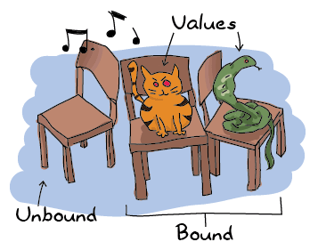
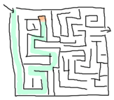

# Syntax in functions

## [Pattern Matching]


Now that we have the ability to store and compile our code, we can begin to write more advanced functions. Those that we have written so far were extremely simple and a bit underwhelming. We'll get to more interesting stuff. The first function we'll write will need to greet someone differently according to gender. In most languages you would need to write something similar to this:
既然我们有了存储和编译代码的能力，我们就可以开始编写更高级的函数了。到目前为止，我们所写的内容非常简单，有点令人不快。我们会看到更多有趣的东西。我们将要编写的第一个函数需要根据性别以不同的方式问候某人。在大多数语言中，你都需要写类似的东西：

```erl
function greet(Gender,Name)
    if Gender == male then
        print("Hello, Mr. %s!", Name)
    else if Gender == female then
        print("Hello, Mrs. %s!", Name)
    else
        print("Hello, %s!", Name)
end
```

With pattern-matching, Erlang saves you a whole lot of boilerplate code. A similar function in Erlang would look like this:
通过模式匹配，Erlang为您节省了大量样板代码。Erlang中的类似函数如下所示：

```erl
greet(male, Name) ->
    io:format("Hello, Mr. ~s!", [Name]);
greet(female, Name) ->
    io:format("Hello, Mrs. ~s!", [Name]);
greet(_, Name) ->
    io:format("Hello, ~s!", [Name]).
```

I'll admit that the printing function is a lot uglier in Erlang than in many other languages, but that is not the point. The main difference here is that we used pattern matching to define both what parts of a function should be used and bind the values we need at the same time. There was no need to first bind the values and then compare them! So instead of:
我承认Erlang中的打印功能比许多其他语言中的要丑陋得多，但这不是重点。这里的主要区别在于，我们使用模式匹配来定义应该使用函数的哪些部分，并同时绑定我们需要的值。没有必要先绑定这些值，然后再比较它们！因此，与其说：

```erl
function(Args)
   if X then
      Expression
   else if Y then
      Expression
   else
      Expression
```

We write:

```erl
function(X) ->
  Expression;
function(Y) ->
  Expression;
function(_) ->
  Expression.
```

in order to get similar results, but in a much more declarative style. Each of these `function` declarations is called a *function clause*. Function clauses must be separated by semicolons (`;`) and together form a *function declaration*. A function declaration counts as one larger statement, and it's why the final function clause ends with a period. It's a \"funny\" use of tokens to determine workflow, but you'll get used to it. At least you'd better hope so because there's no way out of it!
为了得到类似的结果，但是以一种更具声明性的风格。这些“function”声明中的每一个都称为*function子句*。函数子句必须用分号（`；`）分隔，并一起构成*函数声明*。一个函数声明算作一个较大的语句，这就是为什么最后一个函数子句以句点结尾。使用代币来确定工作流程是“有趣的”，但你会习惯的。因为至少你没有更好的出路！

::: note
**Note:** `io:format`'s formatting is done with the help of tokens being replaced in a string. The character used to denote a token is the tilde (`~`). Some tokens are built-in such as `~n`, which will be changed to a line-break. Most other tokens denote a way to format data. The function call `io:format("~s!~n",["Hello"]).` includes the token `~s`, which accepts strings and bitstrings as arguments, and `~n`. The final output message would thus be `"Hello!\n"`. Another widely used token is `~p`, which will print an Erlang term in a nice way (adding in indentation and everything).
**注意：*`io:format``的格式化是在字符串中替换标记的帮助下完成的。用于表示标记的字符是波浪号（`~`）。有些令牌是内置的，比如“~n”，它将被更改为换行符。大多数其他标记表示格式化数据的方式。函数调用'io:format（“~s！~n”，[“Hello”]）。`包括标记“~s”，它接受字符串和位字符串作为参数，以及“~n”`。因此，最终的输出消息将是“Hello！\n”`。另一个广泛使用的标记是`~p`，它可以很好地打印Erlang术语（添加缩进和所有内容）。

The `io:format` function will be seen in more details in later chapters dealing with input/output with more depth, but in the meantime you can try the following calls to see what they do: `io:format("~s~n",[<<"Hello">>])`, `io:format("~p~n",[<<"Hello">>])`, `io:format("~~~n")`, `io:format("~f~n", [4.0])`, `io:format("~30f~n", [4.0])`. They're a small part of all that's possible and all in all they look a bit like `printf` in many other languages. If you can't wait until the chapter about I/O, you can read the [online documentation](http://erlang.org/doc/man/io.html#format-3 "straight from the horse's mouth") to know more.
“io:format”函数将在后面的章节中以更深入的方式讨论输入/输出，但与此同时，您可以尝试以下调用来了解它们的作用：`io:format（~s~n'，[<“Hello”>>]）`、`io:format（~p~n'，[<“Hello”>>）`、`io:format（~n”）`、`io:format（~f~n'，[4。0]，'io:format（“~30f~n”，[4。0])`。它们只是可能的一小部分，总的来说，它们在许多其他语言中看起来有点像printf。如果你不能等到关于I/O的章节，你可以阅读[在线文档](http://erlang。org/doc/man/io。html#format-3“直接从马嘴里”）了解更多信息。
:::

Pattern matching in functions can get more complex and powerful than that. As you may or may not remember from a few chapters ago, we can pattern match on lists to get the heads and tails. Let's do this! Start a new module called `functions` in which we'll write a bunch of functions to explore many pattern matching avenues available to us:
函数中的模式匹配可能会变得更加复杂和强大。正如你可能记得或可能不记得前几章，我们可以在列表上模式匹配，以获得正面和反面。让我们开始吧！启动一个名为“functions”的新模块，我们将在其中编写一系列函数，探索我们可用的多种模式匹配途径：

```erl
-module(functions).
-compile(export_all). %% replace with -export() later, for God's sake!
```

The first function we'll write is `head/1`, acting exactly like `erlang:hd/1` which takes a list as an argument and returns its first element. It'll be done with the help of the cons operator (`|`):
我们将要编写的第一个函数是'head/1'，其作用与'erlang:hd/1'完全相同，后者将列表作为参数并返回其第一个元素。这将在cons操作员（“|”）的帮助下完成：

```erl
head([H|_]) -> H.
```

If you type `functions:head([1,2,3,4]).` in the shell (once the module is compiled), you can expect the value '1' to be given back to you. Consequently, to get the second element of a list you would create the function:
如果你输入'functions:head（[1,2,3,4]）。`在shell中（编译模块后），您可以期望值“1”返回给您。因此，要获得列表的第二个元素，您需要创建函数：

```erl
second([_,X|_]) -> X.
```

The list will just be deconstructed by Erlang in order to be pattern matched. Try it in the shell!

```eshell
1> c(functions).

2> functions:head([1,2,3,4]).
1
3> functions:second([1,2,3,4]).
2
```

This could be repeated for lists as long as you want, although it would be impractical to do it up to thousands of values. This can be fixed by writing recursive functions, which we'll see how to do later on. For now, let's concentrate on more pattern matching. The concept of free and bound variables we discussed in [Starting Out (for real)](starting-out-for-real.html#invariable-variables "Invariable Variables") still holds true for functions: we can then compare and know if two parameters passed to a function are the same or not. For this, we'll create a function `same/2` that takes two arguments and tells if they're identical:
这可以在列表中重复，只要你想，尽管要达到数千个值是不切实际的。这可以通过编写递归函数来解决，稍后我们将看到如何做。现在，让我们专注于更多的模式匹配。我们在[Starting Out（for real）]（Starting Out for real）中讨论的自由变量和有界变量的概念。html#不变变量“不变变量”）对函数仍然适用：然后我们可以比较并知道传递给函数的两个参数是否相同。为此，我们将创建一个函数'same/2'，它接受两个参数并判断它们是否相同：

```erl
same(X,X) ->
    true;
same(_,_) ->
    false.
```

And it's that simple. Before explaining how the function works, we'll go over the concept of bound and unbound variables again, just in case:
就这么简单。在解释函数如何工作之前，我们将再次讨论绑定变量和未绑定变量的概念，以防万一：


. Binding a variable is simply attaching a value to an unbound variable. In the case of Erlang, when you want to assign a value to a variable that is already bound, an error occurs *unless the new value is the same as the old one*. Let's imagine our snake on the right: if another snake comes around, it won't really change much to the game. You'll just have more angry snakes. If a different animal comes to sit on the chair (a honey badger, for example), things will go bad. Same values for a bound variable are fine, different ones are a bad idea. You can go back to the subchapter about [Invariable Variables](starting-out-for-real.html#invariable-variables "Starting Out (for real)") if this concept is not clear to you.
如果这个音乐椅游戏是Erlang，你会想坐在空椅子上。坐在一个已经被占用的地方不会有好下场！开玩笑的是，未绑定变量是没有附加任何值的变量（比如我们的空椅子）。绑定变量只是将值附加到未绑定的变量上。在Erlang的情况下，如果要为已绑定的变量赋值，则会发生错误*，除非新值与旧值相同*。让我们想象一下右边的蛇：如果另一条蛇出现，它对游戏不会有太大影响。你只会有更多愤怒的蛇。如果有另一种动物坐在椅子上（例如，一只蜜獾），事情就会变得糟糕。对于一个绑定变量，相同的值是可以的，不同的值是不好的。你可以回到关于[不变变量]的分章（从现实开始）。html#不变变量“开始（实际）”，如果您不清楚这个概念。

Back to our code: what happens when you call `same(a,a)` is that the first `X` is already bound. It then compares it to the `a` passed as the second argument and looks to see if it matches. The pattern matching succeeds and the function returns `true`. If the two values aren't the same, this will fail and go to the second function clause, which doesn't care about its arguments (when you're the last to choose, you can't be picky!) and will instead return false. Note that this function can effectively take any kind of argument whatsoever! It works for any type of data, not just lists or single variables. As a rather advanced example, the following function prints a date, but only if it is formatted correctly:
回到我们的代码：当你调用'same（a，a）'时，第一个'X'已经绑定了。然后将其与作为第二个参数传递的'a'进行比较，看看是否匹配。模式匹配成功，函数返回'true'`。如果两个值不相同，这将失败并转到第二个function子句，它不关心它的参数（当你是最后一个选择时，你不能挑剔！）而将返回false。请注意，这个函数可以有效地接受任何类型的参数！它适用于任何类型的数据，而不仅仅是列表或单个变量。作为一个高级示例，以下函数仅在格式正确的情况下打印日期：

```erl
valid_time() ->
    io:format("The Date tuple (~p) says today is: ~p/~p/~p,~n",[Date,Y,M,D]),
    io:format("The time tuple (~p) indicates: ~p:~p:~p.~n", [Time,H,Min,S]);
valid_time(_) ->
    io:format("Stop feeding me wrong data!~n").
```

Note that it is possible to use the `=` operator in the function head, allowing us to match both the content inside a tuple (`). The function can be tested the following way:
请注意，可以在函数头中使用“=”运算符，使我们能够匹配元组（`）中的两个内容。该功能可通过以下方式进行测试：

```eshell
4> c(functions).

5> functions:valid_time().
The Date tuple () says today is: 2011/9/6,
The time tuple () indicates: 9:4:43.
ok
6> functions:valid_time().
Stop feeding me wrong data!
ok
```

There is a problem though! This function could take anything for values, even text or atoms, as long as the tuples are of the form ` elements, or anything (`_` and unbound variables), etc. To solve this problem, we use guards.
不过有个问题！这个函数可以接受任何值，甚至文本或原子，只要元组的形式是`元素，或任何（``和未绑定变量），等等。为了解决这个问题，我们使用了警卫。

## [Guards, Guards!]

")
 -> false;
old_enough(1) -> false;
old_enough(2) -> false;
...
old_enough(14) -> false;
old_enough(15) -> false;
old_enough(_) -> true.
```

But it would be incredibly impractical. You can do it if you want, but you'll be alone to work on your code forever. If you want to eventually make friends, start a new `guards` module so we can type in the \"correct\" solution to the driving question:
但这将是难以置信的不切实际。如果你愿意，你可以这样做，但你将永远独自一人编写代码。如果你想最终结交朋友，启动一个新的“警卫”模块，这样我们就可以输入驾驶问题的“正确”解决方案：

```erl
old_enough(X) when X >= 16 -> true;
old_enough(_) -> false.
```

And you're done! As you can see, this is much shorter and cleaner. Note that a basic rule for guard expression is they must return `true` to succeed. The guard will fail if it returns `false` or if it throws an exception. Suppose we now forbid people who are over 104 years old to drive. Our valid ages for drivers is now from 16 years old up to 104 years old. We need to take care of that, but how? Let's just add a second guard clause:
你完了！正如你所看到的，这个要短得多，干净得多。注意，guard表达式的一个基本规则是，它们必须返回'true'才能成功。如果返回'false'或抛出异常，则该防护将失败。假设我们现在禁止104岁以上的人开车。我们的司机有效年龄从16岁到104岁。我们需要解决这个问题，但如何解决呢？让我们添加第二个保护条款：

```erl
right_age(X) when X >= 16, X =< 104 ->
    true;
right_age(_) ->
    false.
```

The comma (`,`) acts in a similar manner to the operator `andalso` and the semicolon (`;`) acts a bit like `orelse` (described in \"[Starting Out (for real)](starting-out-for-real.html#bool-and-compare)\"). Both guard expressions need to succeed for the whole guard to pass. We could also represent the function the opposite way:
逗号（`，`）的作用方式与运算符`andalso`类似，分号（`；`）的作用有点像`orelse`（如\“[Starting Out（for real）]（Starting Out for real）”所述）。html#bool and compare）\”）。两个守卫表情都需要成功才能让整个守卫通过。我们也可以用相反的方式表示函数：

```erl
wrong_age(X) when X < 16; X > 104 ->
    true;
wrong_age(_) ->
    false.
```


And we get correct results from that too. Test it if you want (you should always test stuff!). In guard expressions, the semi-colon (`;`) acts like the `orelse` operator: if the first guard fails, it then tries the second, and then the next one, until either one guard succeeds or they all fail.
我们也从中得到了正确的结果。如果你想测试它（你应该一直测试东西！）。在guard表达式中，分号（`；`）的作用类似于`orelse`运算符：如果第一个guard失败，它会尝试第二个，然后尝试下一个，直到其中一个guard成功或全部失败。

You can use a few more functions than comparisons and boolean evaluation in functions, including math operations (`A*B/C >= 0`) and functions about data types, such as `is_integer/1`, `is_atom/1`, etc. (We'll get back on them in the following chapter). One negative point about guards is that they will not accept user-defined functions because of side effects. Erlang is not a purely functional programming language (like [Haskell](http://learnyouahaskell.com/ "PURE! PURE! OH GOD SO PURELY FUNCTIONAL!") is) because it relies on side effects a lot: you can do I/O, send messages between actors or throw errors as you want and when you want. There is no trivial way to determine if a function you would use in a guard would or wouldn't print text or catch important errors every time it is tested over many function clauses. So instead, Erlang just doesn't trust you (and it may be right to do so!)
在函数中可以使用比比较和布尔求值更多的函数，包括数学运算（`a*B/C>=0`）和关于数据类型的函数，例如`is_integer/1`、`is_atom/1`，等等。（我们将在下一章中继续讨论）。卫兵的一个缺点是，由于副作用，他们不会接受用户定义的功能。Erlang不是一种纯粹的函数式编程语言（比如[Haskell](http://learnyouahaskell。com/“纯！纯！哦，上帝，真是纯功能！”）因为它非常依赖于副作用：你可以做I/O，在参与者之间发送消息，或者在你想要的时候抛出错误。每次对多个函数子句进行测试时，都有一种非常简单的方法来确定您在保护中使用的函数是否会打印文本或捕获重要错误。因此，Erlang只是不信任你（这样做可能是对的！）

That being said, you should be good enough to understand the basic syntax of guards to understand them when you encounter them.
也就是说，你应该足够好地理解警卫的基本语法，以便在遇到他们时理解他们。

::: note
**Note:** I've compared `,` and `;` in guards to the operators `andalso` and `orelse`. They're not exactly the same, though. The former pair will catch exceptions as they happen while the latter won't. What this means is that if there is an error thrown in the first part of the guard `X >= N; N >= 0`, the second part can still be evaluated and the guard might succeed; if an error was thrown in the first part of `X >= N orelse N >= 0`, the second part will also be skipped and the whole guard will fail.
**注：*我比较了`、`和`；`为了保护运营商“andalso”和“orelse”`。但它们并不完全相同。前者会在异常发生时捕捉异常，而后者则不会。这意味着，如果防护的第一部分出现错误，`X>=N；N>=0`，第二部分仍然可以评估，守卫可能会成功；如果`=Oren>的第一部分被抛出，那么第二部分也将被跳过。

However (there is always a 'however'), only `andalso` and `orelse` can be nested inside guards. This means `(A orelse B) andalso C` is a valid guard, while `(A; B), C` is not. Given their different use, the best strategy is often to mix them as necessary.
然而（总是有一个“However\”），只有“andalso”和“orelse”可以嵌套在警卫中。这意味着“（A或B）和C”是有效的守卫，而“（A；B），C”不是。鉴于它们的用途不同，最好的策略通常是在必要时将它们混合使用。
:::

## [What the If!?]

`If`s act like guards and share guards' syntax, but outside of a function clause's head. In fact, the `if` clauses are called *Guard Patterns*. Erlang's `if`s are different from the `if`s you'll ever encounter in most other languages; compared to them they're weird creatures that might have been more accepted had they had a different name. When entering Erlang's country, you should leave all you know about `if`s at the door. Take a seat because we're going for a ride.
`If's active like guards and share guards'语法，但在function子句的头部之外。事实上，`if`子句被称为*Guard模式*。Erlang的“if”不同于你在大多数其他语言中遇到的“if”；与它们相比，它们是奇怪的生物，如果它们有不同的名字，可能会被更多人接受。当进入二郎的国家时，你应该把你所知道的关于“如果”的一切都留在门口。请坐，我们要去兜风。

To see how similar to guards the if expression is, look at the following examples:

```erl
-module(what_the_if).
-export([heh_fine/0]).


heh_fine() ->
    if 1 =:= 1 ->
        works
    end,
    if 1 =:= 2; 1 =:= 1 ->
        works
    end,
    if 1 =:= 2, 1 =:= 1 ->
        fails
    end.
```

Save this as `what_the_if.erl` and let's try it:

```eshell
1> c(what_the_if).
./what_the_if.erl:12: Warning: no clause will ever match
./what_the_if.erl:12: Warning: the guard for this clause evaluates to 'false'

2> what_the_if:heh_fine().
** exception error: no true branch found when evaluating an if expression
     in function  what_the_if:heh_fine/0
```



Uh oh! the compiler is warning us that no clause from the if on line 12 (`1 =:= 2, 1 =:= 1`) will ever match because its only guard evaluates to `false`. Remember, in Erlang, everything has to return something, and `if` expressions are no exception to the rule. As such, when Erlang can't find a way to have a guard succeed, it will crash: it cannot *not* return something. As such, we need to add a catch-all branch that will always succeed no matter what. In most languages, this would be called an 'else'. In Erlang, we use 'true' (this explains why the VM has thrown \"no true branch found\" when it got mad):
哦！编译器警告我们，第12行的if（`1=：=2，1=：=1`）中的任何子句都不会匹配，因为它唯一的保护求值为`false`。请记住，在Erlang中，所有内容都必须返回某些内容，“if”表达式也不例外。因此，当Erlang找不到让一个守卫成功的方法时，它会崩溃：它不能*不*返回某些东西。因此，我们需要添加一个全面的分支，无论发生什么情况，它都会成功。在大多数语言中，这被称为“else”。在Erlang中，我们使用“true”（这解释了为什么VM在发疯时抛出“no true branch found”）：

```erl
oh_god(N) ->
    if N =:= 2 -> might_succeed;
       true -> always_does  %% this is Erlang's if's 'else!'
    end.
```

And now if we test this new function (the old one will keep spitting warnings, ignore them or take them as a reminder of what not to do):
现在，如果我们测试这个新功能（旧功能会不断发出警告，忽略它们，或者将它们作为提醒不应该做的事情）：

```eshell
3> c(what_the_if).
./what_the_if.erl:12: Warning: no clause will ever match
./what_the_if.erl:12: Warning: the guard for this clause evaluates to 'false'

4> what_the_if:oh_god(2).
might_succeed
5> what_the_if:oh_god(3).
always_does
```

Here's another function showing how to use many guards in an `if` expression. The function also illustrates how any expression must return something: `Talk` has the result of the `if` expression bound to it, and is then concatenated in a string, inside a tuple. When reading the code, it's easy to see how the lack of a `true` branch would mess things up, considering Erlang has no such thing as a null value (ie.: Lisp's NIL, C's NULL, Python's None, etc):
下面是另一个函数，它展示了如何在“if”表达式中使用多个卫士。该函数还说明了任何表达式必须如何返回某些内容：`Talk`具有绑定到它的`if`表达式的结果，然后在元组内连接成字符串。在阅读代码时，很容易看到缺少'true'分支会把事情搞得一团糟，因为Erlang没有空值（即。：Lisp的NIL、C的NULL、Python的None等）：

```erl
%% note, this one would be better as a pattern match in function heads!
%% I'm doing it this way for the sake of the example.
help_me(Animal) ->
    Talk = if Animal == cat  -> "meow";
              Animal == beef -> "mooo";
              Animal == dog  -> "bark";
              Animal == tree -> "bark";
              true -> "fgdadfgna"
           end,
    .
```

And now we try it:

```eshell
6> c(what_the_if).
./what_the_if.erl:12: Warning: no clause will ever match
./what_the_if.erl:12: Warning: the guard for this clause evaluates to 'false'

7> what_the_if:help_me(dog).

8> what_the_if:help_me("it hurts!").

```

You might be one of the many Erlang programmers wondering why 'true' was taken over 'else' as an atom to control flow; after all, it's much more familiar. Richard O'Keefe gave the following answer on the Erlang mailing lists. I'm quoting it directly because I couldn't have put it better:
你可能是许多Erlang程序员中的一员，他们想知道为什么“true”被“else”取代，成为控制流的原子；毕竟，这要熟悉得多。理查德·奥基夫在Erlang邮件列表上给出了以下答案。我直接引用它是因为我说得再好不过了：

> It may be more FAMILIAR, but that doesn't mean 'else' is a good thing. I know that writing '; true -\>' is a very easy way to get 'else' in Erlang, but we have a couple of decades of psychology-of-programming results to show that it's a bad idea. I have started to replace:
>它可能更熟悉，但这并不意味着“其他”是件好事。我知道写作；是的，\>'是在Erlang中获取“else”的一种非常简单的方法，但是我们有几十年的编程结果心理学证明这是个坏主意。我已经开始替换：
>
>                               by
>         if X > Y -> a()       if X > Y  -> a()
>          ; true  -> b()       ; X =< Y -> b()
>         end             end
>
>         if X > Y -> a()       if X > Y -> a()
>          ; X < Y -> b()        ; X < Y -> b()
>          ; true  -> c()       ; X ==Y -> c()
>         end         end
>         
>
> which I find mildly annoying when \_writing\_ the code but enormously helpful when \_reading\_ it.

'Else' or 'true' branches should be \"avoided\" altogether: `if`s are usually easier to read when you cover all logical ends rather than relying on a *\"catch all\"* clause.
\“Else”或“true”分支应该完全“避免”：“if”通常在涵盖所有逻辑目的时更容易阅读，而不是依赖于*“catch all”子句。

As mentioned before, there are only a limited set of functions that can be used in guard expressions (we'll see more of them in [Types (or lack thereof)](types-or-lack-thereof.html#type-conversions "Type conversions")). This is where the real conditional powers of Erlang must be conjured. I present to you: the `case` expression!
如前所述，在guard表达式中只能使用有限的函数集（我们将在[Types（或缺少）]（Types或缺少）中看到更多函数）。html#类型转换“类型转换”））。这就是Erlang真正有条件的力量必须被召唤出来的地方。我向你们展示：case的表达方式！

::: note
**Note:** All this horror expressed by the function names in `what_the_if.erl` is expressed in regards to the `if` language construct when seen from the perspective of any other languages' `if`. In Erlang's context, it turns out to be a perfectly logical construct with a confusing name.
**注：**所有这些恐惧都是通过“what_the_if”中的函数名来表达的。从任何其他语言的角度来看，erl`是关于'if'语言结构的`。在Erlang的上下文中，它被证明是一个完全逻辑的结构，名称令人困惑。
:::

## [In Case \... of]

If the `if` expression is like a guard, a `case ... of` expression is like the whole function head: you can have the complex pattern matching you can use with each argument, and you can have guards on top of it!
如果'If'表达式像一个警卫，则为'case。。。of`expression就像整个函数头：你可以有复杂的模式匹配，你可以使用每个参数，你可以在上面有守卫！

As you're probably getting pretty familiar with the syntax, we won't need too many examples. For this one, we'll write the append function for sets (a collection of unique values) that we will represent as an unordered list. This is possibly the worst implementation possible in terms of efficiency, but what we want here is the syntax:
由于您可能已经非常熟悉语法，我们不需要太多示例。对于本例，我们将为集合（唯一值的集合）编写append函数，这些集合将表示为无序列表。就效率而言，这可能是最差的实现，但我们想要的是语法：

```erl
insert(X,[]) ->
    [X];
insert(X,Set) ->
    case lists:member(X,Set) of
        true  -> Set;
        false -> [X|Set]
    end.
```

If we send in an empty set (list) and a term `X` as the list's first element.

In this case, the pattern matching was really simple. It can get more complex (you can compare your code with [mine](static/erlang/cases.erl.html "cases.erl")):
在这种情况下，模式匹配非常简单。它可能会变得更复杂（你可以将你的代码与[我的]（static/erlang/cases）进行比较）。呃。“html”案例。呃):

```erl
beach(Temperature) ->
    case Temperature of
         when N >= 20, N =< 45 ->
            'favorable';
         when N >= 293, N =< 318 ->
            'scientifically favorable';
         when N >= 68, N =< 113 ->
            'favorable in the US';
        _ ->
            'avoid beach'
    end.
```

Here, the answer of \"is it the right time to go to the beach\" is given in 3 different temperature systems: Celsius, Kelvins and Fahrenheit degrees. Pattern matching and guards are combined in order to return an answer satisfying all uses. As pointed out earlier, `case ... of` expressions are pretty much the same thing as a bunch of function heads with guards. In fact we could have written our code the following way:
在这里，“现在是去海滩的正确时间吗？”的答案在三种不同的温度系统中给出：摄氏度、开尔文度和华氏度。模式匹配和保护相结合，以返回满足所有用途的答案。正如前面所指出的，“情况是这样的。。。“of”表达式与一堆带警卫的函数头几乎是一样的。事实上，我们可以用以下方式编写代码：

```erl
beachf() when N >= 20, N =< 45 ->
    'favorable';
...
beachf(_) ->
    'avoid beach'.
```

This raises the question: when should we use `if`, `case ... of` or functions to do conditional expressions?
这就提出了一个问题：我们什么时候应该使用'if'，'case。。。还是函数做条件表达式？


## [Which to use?]

Which to use is rather hard to answer. The difference between function calls and `case ... of` are very minimal: in fact, they are represented the same way at a lower level, and using one or the other effectively has the same cost in terms of performance. One difference between both is when more than one argument needs to be evaluated: `function(A,B) -> ... end.` can have guards and values to match against `A`, but a case expression would need to be formulated a bit like:
用哪一个答案很难回答。函数调用和case之间的区别。。。事实上，它们在较低的级别上以相同的方式表示，有效地使用其中一种在性能方面具有相同的成本。两者之间的一个区别是，当需要计算多个参数时：`function（A，B）->。。。终止。`可以有与'A'匹配的保护和值，但大小写表达式需要有点类似：

```erl
case  of
    Pattern Guards -> ...
end.
```

This form is rarely seen and might surprise the reader a bit. In similar situations, using a function call might be more appropriate. On the other hand the `insert/2` function we had written earlier is arguably cleaner the way it is rather than having an immediate function call to track down on a simple `true` or `false` clause.
这种形式很少见，可能会让读者有点吃惊。在类似的情况下，使用函数调用可能更合适。另一方面，我们之前编写的'insert/2'函数可以说是更简洁的方式，而不是直接调用函数来跟踪简单的'true'或'false'子句。

Then the other question is why would you ever use `if`, given `case`s and functions are flexible enough to even encompass `if` through guards? The rationale behind `if` is quite simple: it was added to the language as a short way to have guards without needing to write the whole pattern matching part when it wasn't needed.
另一个问题是，既然“case”和函数足够灵活，甚至可以通过警卫来包含“if”，为什么还要使用“if”？“if”背后的原理非常简单：它被添加到语言中，作为一种简短的方式，在不需要的情况下无需编写整个模式匹配部分。

Of course, all of this is more about personal preferences and what you may encounter more often. There is no good solid answer. The whole topic is still debated by the Erlang community from time to time. Nobody's going to go try to beat you up because of what you've chosen, as long as it is easy to understand. As Ward Cunningham once put it, \"Clean code is when you look at a routine and it's pretty much what you expected.\"
当然，所有这些更多的是关于个人喜好和你可能会经常遇到的事情。没有可靠的答案。整个话题仍在Erlang社区不时进行辩论。没有人会因为你的选择而试图打败你，只要这很容易理解。正如沃德·坎宁安（Ward Cunningham）曾经说过的那样，“干净的代码就是当你查看一个例程时，它几乎就是你所期望的。”。\"
