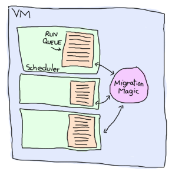

# The Hitchhiker's Guide to Concurrency

Far out in the uncharted backwaters of the unfashionable beginning of the 21st century lies a small subset of human knowledge.
在21世纪初这个不受欢迎的时代，人类知识的一小部分还远远地存在于未知的死水中。

Within this subset of human knowledge is an utterly insignificant little discipline whose Von Neumann-descended architecture is so amazingly primitive that it is still thought that RPN calculators are a pretty neat idea.
在人类知识的这一子集中，有一个完全无关紧要的小学科，其冯·诺依曼（Von Neumann）后裔的体系结构是如此原始，以至于人们仍然认为RPN计算器是一个非常巧妙的想法。

This discipline has --- or rather had --- a problem, which was this: most of the people studying it were unhappy for pretty much of the time when trying to write parallel software. Many solutions were suggested for this problem, but most of these were largely concerned with the handling of little pieces of logic called locks and mutexes and whatnot, which is odd because on the whole it wasn't the small pieces of logic that needed parallelism.
这门学科有一个问题，或者说是有一个问题，那就是：大多数研究它的人在试图编写并行软件时，大部分时间都不开心。对于这个问题，人们提出了许多解决方案，但其中大部分都与处理称为锁和互斥体之类的小逻辑块有关，这很奇怪，因为总的来说，需要并行性的不是小逻辑块。

And so the problem remained; lots of people were mean, and most of them were miserable, even those with RPN calculators.
因此问题依然存在；很多人都很刻薄，大多数人都很痛苦，即使是那些有RPN计算器的人。

Many were increasingly of the opinion that they'd all made a big mistake in trying to add parallelism to their programming languages, and that no program should have ever left its initial thread.
许多人越来越认为，他们在试图给自己的编程语言添加并行性时都犯了一个大错误，任何程序都不应该离开最初的线程。

::: note
**Note:** parodying The Hitchhiker's Guide to the Galaxy is fun. Read the book if you haven't already. It's good!
**注：*模仿《银河系漫游指南》很有趣。如果你还没有读过这本书，那就读一读。很好！
:::

## [Don't Panic]

Hi. Today (or whatever day you are reading this, even tomorrow), I'm going to tell you about concurrent Erlang. Chances are you've read about or dealt with concurrency before.  You might also be curious about the emergence of multi-core programming. Anyway, the probabilities are high that you're reading this book because of all this talk about concurrency going on these days.
你好。今天（或者无论你读到这篇文章的哪一天，甚至是明天），我将告诉你关于并发Erlang。很可能你以前读过或处理过并发。 or skip to the next one (where more practical knowledge is shown.)
不过这是一个警告；本章主要是理论性的。如果你头痛，不喜欢编程语言历史，或者只是想编程，你最好跳到[本章末尾]（《搭便车者并发指南》）。html#感谢所有的鱼）或跳到下一个（在那里展示更多实用知识）。)

I've already explained in the book's intro that Erlang's concurrency was based on message passing and the actor model, with the example of people communicating with nothing but letters. I'll explain it more in details again later, but first of all, I believe it is important to define the difference between *concurrency* and *parallelism*.
我已经在这本书的介绍中解释过，Erlang的并发性是基于消息传递和参与者模型的，例如人们只通过字母进行通信。稍后我将再次详细解释，但首先，我认为定义“并发性”和“并行性”之间的区别很重要*。

In many places both words refer to the same concept. They are often used as two different ideas in the context of Erlang. For many Erlangers, concurrency refers to the idea of having many actors running independently, but not necessarily all at the same time. Parallelism is having actors running exactly at the same time. I will say that there doesn't seem to be any consensus on such definitions around various areas of computer science, but I will use them in this manner in this text. Don't be surprised if other sources or people use the same terms to mean different things.
在许多地方，这两个词都指同一个概念。在Erlang的上下文中，它们通常被用作两个不同的概念。对于许多Erlanger来说，并发指的是让多个参与者独立运行的想法，但不一定同时运行所有参与者。并行性就是让参与者完全同时运行。我要说的是，在计算机科学的各个领域，对这些定义似乎没有任何共识，但我将在本文中以这种方式使用它们。如果其他来源或人使用相同的术语来表示不同的事情，不要感到惊讶。

This is to say Erlang had concurrency from the beginning, even when everything was done on a single core processor in the '80s. Each Erlang process would have its own slice of time to run, much like desktop applications did before multi-core systems.
这就是说，Erlang从一开始就有并发性，即使在80年代，一切都是在单核处理器上完成的。每个Erlang进程都有自己的运行时间，就像多核系统之前的桌面应用程序一样。

Parallelism was still possible back then; all you needed to do was to have a second computer running the code and communicating with the first one. Even then, only two actors could be run in parallel in this setup. Nowadays, multi-core systems allows for parallelism on a single computer (with some industrial chips having many dozens of cores) and Erlang takes full advantage of this possibility.
当时，平行性仍然是可能的；你所需要做的就是让第二台计算机运行代码并与第一台计算机通信。即便如此，在这种设置中，只有两个参与者可以并行运行。如今，多核系统允许在一台计算机上并行（一些工业芯片有几十个核），Erlang充分利用了这种可能性。

::: 
**Don't drink too much Kool-Aid:**\
The distinction between concurrency and parallelism is important to make, because many programmers hold the belief that Erlang was ready for multi-core computers years before it actually was. Erlang was only adapted to true [symmetric multiprocessing](http://en.wikipedia.org/wiki/Symmetric_multiprocessing) in the mid 2000s and only got most of the implementation right with the R13B release of the language in 2009. Before that, SMP often had to be disabled to avoid performance losses. To get parallelism on a multicore computer without SMP, you'd start many instances of the VM instead.
并发性和并行性之间的区别很重要，因为许多程序员认为Erlang早在实际使用多核计算机之前就已经准备好了。仅适用于对称的[symmetric Erlang](http://en。维基百科。org/wiki/Symmetric_multiprocessing），直到2009年R13B发布该语言后，才实现了大部分功能。在此之前，为了避免性能损失，通常必须禁用SMP。要在没有SMP的多核计算机上获得并行性，可以启动许多VM实例。

An interesting fact is that because Erlang concurrency is all about isolated processes, it took no conceptual change at the language level to bring true parallelism to the language. All the changes were transparently done in the VM, away from the eyes of the programmers.
一个有趣的事实是，因为Erlang并发性都是关于孤立进程的，所以不需要在语言级别进行概念上的更改就可以实现语言的并行性。所有的更改都是在虚拟机中透明地完成的，远离程序员的眼睛。
:::

## [Concepts of Concurrency]


![乔·阿姆斯特朗，如电影《二郎》(。。/静态/img/erlang电影。png“二郎，电影！”）

Back in the day, Erlang's development as a language was extremely quick with frequent feedback from engineers working on telephone switches in Erlang itself. These interactions proved processes-based concurrency and asynchronous message passing to be a good way to model the problems they faced. Moreover, the telephony world already had a certain culture going towards concurrency before Erlang came to be. This was inherited from PLEX, a language created earlier at Ericsson, and AXE, a switch developed with it. Erlang followed this tendency and attempted to improve on previous tools available.
当时，Erlang作为一种语言的发展非常迅速，工程师们经常在Erlang本身的电话交换机上进行反馈。这些交互证明，基于进程的并发和异步消息传递是对它们所面临的问题建模的好方法。此外，在Erlang出现之前，电话世界已经有了某种走向并发的文化。这是从爱立信早期创建的语言PLEX和用它开发的交换机AXE继承而来的。Erlang遵循了这一趋势，并试图改进以前可用的工具。

Erlang had a few requirements to satisfy before being considered good. The main ones were being able to scale up and support many thousands of users across many switches, and then to achieve high reliability---to the point of never stopping the code.
在被认为是好的之前，Erlang需要满足一些要求。主要的功能是能够跨多个交换机扩展并支持数千名用户，然后实现高可靠性——直到永远不会停止代码。

### Scalability

I'll focus on the scaling first. Some properties were seen as necessary to achieve scalability. Because users would be represented as processes which only reacted upon certain events (i.e.: receiving a call, hanging up, etc.), an ideal system would support processes doing small computations, switching between them very quickly as events came through. To make it efficient, it made sense for processes to be started very quickly, to be destroyed very quickly and to be able to switch them really fast. Having them lightweight was mandatory to achieve this. It was also mandatory because you didn't want to have things like process pools (a fixed amount of processes you split the work between.) Instead, it would be much easier to design programs that could use as many processes as they need.
我将首先关注缩放。一些属性被认为是实现可伸缩性所必需的。因为用户将被表示为只对某些事件做出反应的过程（i。E。：接电话、挂断电话等。)，一个理想的系统将支持进行小型计算的进程，在事件发生时在它们之间快速切换。为了提高效率，有必要快速启动流程，快速销毁流程，并能够快速切换流程。为了实现这一点，必须让它们变得轻量级。它也是强制性的，因为你不想拥有进程池（一个固定数量的进程，你可以在它们之间分配工作）。)相反，设计可以使用任意多个进程的程序会容易得多。

Another important aspect of scalability is to be able to bypass your hardware's limitations. There are two ways to do this: make the hardware better, or add more hardware. The first option is useful up to a certain point, after which it becomes extremely expensive (i.e.: buying a super computer). The second option is usually cheaper and requires you to add more computers to do the job. This is where distribution can be useful to have as a part of your language.
可伸缩性的另一个重要方面是能够绕过硬件的限制。有两种方法可以做到这一点：改进硬件，或添加更多硬件。第一个选项在一定程度上是有用的，之后它会变得非常昂贵（i。E。：购买超级计算机）。第二种选择通常更便宜，需要添加更多计算机来完成这项工作。在这里，作为语言的一部分，分发是很有用的。

Anyway, to get back to small processes, because telephony applications needed a lot of reliability, it was decided that the cleanest way to do things was to forbid processes from sharing memory. Shared memory could leave things in an inconsistent state after some crashes (especially on data shared across different nodes) and had some complications. Instead, processes should communicate by sending messages where all the data is copied. This would risk being slower, but safer.
无论如何，为了回到小进程，因为电话应用程序需要大量的可靠性，人们决定最干净的方法是禁止进程共享内存。在一些崩溃（尤其是在不同节点共享的数据上）之后，共享内存可能会使事物处于不一致的状态，并产生一些复杂问题。相反，进程应该通过发送所有数据都被复制的消息来进行通信。这样做可能会更慢，但更安全。

### Fault-tolerance

This leads us on the second type of requirements for Erlang: reliability. The first writers of Erlang always kept in mind that failure is common. You can try to prevent bugs all you want, but most of the time some of them will still happen. In the eventuality bugs don't happen, nothing can stop hardware failures all the time. The idea is thus to find good ways to handle errors and problems rather than trying to prevent them all.
这就引出了Erlang的第二类需求：可靠性。《二郎传》的第一批作者总是牢记失败是常见的。你可以随心所欲地防止bug，但大多数情况下，有些bug仍然会发生。在不发生漏洞的情况下，没有任何东西可以随时阻止硬件故障。因此，我们的想法是找到处理错误和问题的好方法，而不是试图阻止它们。

It turns out that taking the design approach of multiple processes with message passing was a good idea, because error handling could be grafted onto it relatively easily. Take lightweight processes (made for quick restarts and shutdowns) as an example. Some studies proved that the main sources of downtime in large scale software systems are intermittent or transient bugs ([source](http://dslab.epfl.ch/pubs/crashonly.pdf)). Then, there's a principle that says that errors which corrupt data should cause the faulty part of the system to die as fast as possible in order to avoid propagating errors and bad data to the rest of the system. Another concept here is that there exist many different ways for a system to terminate, two of which are clean shutdowns and crashes (terminating with an unexpected error).
事实证明，采用带有消息传递的多个进程的设计方法是一个好主意，因为错误处理可以相对容易地移植到它上面。以轻量级流程（用于快速重启和关闭）为例。一些研究证明，在大型软件系统中，导致停机的主要原因是间歇性或短暂的错误（[source](http://dslab。epfl。ch/酒吧/克拉索尼。（pdf格式）。然后，有一个原则是，损坏数据的错误应该导致系统的故障部分尽快消失，以避免错误和坏数据传播到系统的其他部分。这里的另一个概念是，系统终止有许多不同的方式，其中两种是完全关闭和崩溃（以意外错误终止）。

Here the worst case is obviously the crash. A safe solution would be to make sure all crashes are the same as clean shutdowns: this can be done through practices such as shared-nothing and single assignment (which isolates a process' memory), avoiding [locks](http://en.wikipedia.org/wiki/Lock_(computer_science)) chapter), in order to know when processes die and to decide what to do about it.
这里最糟糕的情况显然是坠机。一个安全的解决方案是确保所有的崩溃都和干净的关机一样：这可以通过无共享和单一分配（隔离进程的内存）等实践来实现，避免[锁定](http://en。维基百科。org/wiki/Lock_（计算机科学））章节），以了解进程何时死亡，并决定如何应对。

Supposing restarting processes real fast is enough to deal with crashes, the next problem you get is hardware failures. How do you make sure your program keeps running when someone kicks the computer it's running on?  Although a fancy defense mechanism comprising laser detection and strategically placed cacti could do the job for a while, it would not last forever. The hint is simply to have your program running on more than one computer at once, something that was needed for scaling anyway. This is another advantage of independent processes with no communication channel outside message passing. You can have them working the same way whether they're local or on a different computer, making fault tolerance through distribution nearly transparent to the programmer.
假设快速重启进程足以应对崩溃，那么下一个问题就是硬件故障。当有人踢正在运行的电脑时，你如何确保你的程序继续运行！[由仙人掌和激光保护的服务器（HAL）](。。/静电/img/仙人掌激光器。png“我很确定这会起作用”）虽然一种由激光探测和战略放置仙人掌组成的奇特防御机制可以在一段时间内完成这项工作，但它不会永远持续下去。提示就是让你的程序同时在多台计算机上运行，这是扩展所需要的。这是在消息传递之外没有通信通道的独立进程的另一个优点。你可以让它们以同样的方式工作，无论它们是本地的还是在另一台计算机上，通过分发使容错对程序员几乎透明。

Being distributed has direct consequences on how processes can communicate with each other. One of the biggest hurdles of distribution is that you can't assume that because a node (a remote computer) was there when you made a function call, it will still be there for the whole transmission of the call or that it will even execute it correctly. Someone tripping over a cable or unplugging the machine would leave your application hanging. Or maybe it would make it crash. Who knows?
分布式对进程之间的通信方式有直接影响。分发的最大障碍之一是，您不能假设，因为在您进行函数调用时，节点（远程计算机）就在那里，所以在整个调用传输过程中，它仍然在那里，或者它甚至会正确执行它。如果有人被电缆绊倒或拔掉机器插头，你的应用程序就会挂起。或者它会让它崩溃。谁知道呢？

Well it turns out the choice of asynchronous message passing was a good design pick there too. Under the processes-with-asynchronous-messages model, messages are sent from one process to a second one and stored in a *mailbox* inside the receiving process until they are taken out to be read. It's important to mention that messages are sent without even checking if the receiving process exists or not because it would not be useful to do so. As implied in the previous paragraph, it's impossible to know if a process will crash between the time a message is sent and received. And if it's received, it's impossible to know if it will be acted upon or again if the receiving process will die before that. Asynchronous messages allow safe remote function calls because there is no assumption about what will happen; the programmer is the one to know. If you need to have a confirmation of delivery, you have to send a second message as a reply to the original process. This message will have the same safe semantics, and so will any program or library you build on this principle.
事实证明，选择异步消息传递也是一个很好的设计选择。在具有异步消息的进程模型下，消息从一个进程发送到另一个进程，并存储在接收进程内的一个*邮箱*中，直到被取出进行读取。值得一提的是，发送消息时甚至不检查接收过程是否存在，因为这样做没有用。正如前一段所暗示的，我们不可能知道在发送和接收消息之间，进程是否会崩溃。如果它在接收之前就不可能了，如果它在接收之前就不可能了。异步消息允许安全的远程函数调用，因为没有关于将发生什么的假设；程序员才是应该知道的人。如果需要确认交付，则必须发送第二条消息作为对原始流程的回复。此消息将具有相同的安全语义，基于此原则构建的任何程序或库也将具有相同的安全语义。

### Implementation

Alright, so it was decided that lightweight processes with asynchronous message passing were the approach to take for Erlang. How to make this work? Well, first of all, the operating system can't be trusted to handle the processes. Operating systems have many different ways to handle processes, and their performance varies a lot. Most if not all of them are too slow or too heavy for what is needed by standard Erlang applications. By doing this in the VM, the Erlang implementers keep control of optimization and reliability. Nowadays, Erlang's processes take about 300 words of memory each and can be created in a matter of microseconds---not something doable on major operating systems these days.
好的，所以决定采用异步消息传递的轻量级进程作为Erlang的方法。如何做到这一点？首先，操作系统不能被信任来处理进程。操作系统有许多不同的处理流程的方法，它们的性能也有很大差异。对于标准的Erlang应用程序来说，大多数（如果不是全部的话）都太慢或太重。通过在VM中这样做，Erlang实现者可以控制优化和可靠性。如今，Erlang的进程每个占用大约300个字的内存，并且可以在几微秒的时间内创建——这在当今的主要操作系统上是行不通的。



To handle all these potential processes your programs could create, the VM starts one thread per core which acts as a *scheduler*. Each of these schedulers has a *run queue*, or a list of Erlang processes on which to spend a slice of time. When one of the schedulers has too many tasks in its run queue, some are migrated to another one. This is to say each Erlang VM takes care of doing all the load-balancing and the programmer doesn't need to worry about it. There are some other optimizations that are done, such as limiting the rate at which messages can be sent on overloaded processes in order to regulate and distribute the load.
为了处理程序可能创建的所有这些潜在进程，VM会在每个核心上启动一个线程，充当*调度器*。这些调度器中的每一个都有一个*运行队列*，或者一个要花费一定时间的Erlang进程列表。当其中一个调度程序的运行队列中有太多任务时，一些任务会迁移到另一个调度程序。也就是说，每个Erlang虚拟机负责完成所有的负载平衡，程序员不需要担心。还进行了一些其他优化，例如限制在过载进程上发送消息的速率，以便调节和分配负载。

All the hard stuff is in there, managed for you. That is what makes it easy to go parallel with Erlang. Going parallel means your program should go twice as fast if you add a second core, four times faster if there are 4 more and so on, right? It depends. Such a phenomenon is named *linear scaling* in relation to speed gain vs. the number of cores or processors (see the graph below.) In real life, there is no such thing as a free lunch (well, there are at funerals, but someone still has to pay, somewhere).
所有的困难都在里面，为你管理。这就是与Erlang并行的原因。并行意味着，如果你添加了第二个内核，你的程序应该运行两倍的速度，如果有4个内核，你的程序应该运行四倍的速度，以此类推，对吗？视情况而定。这种现象被称为“线性缩放”，与速度增益vs。核心或处理器的数量（见下图）。)在现实生活中，没有免费的午餐（嗯，葬礼上也有，但总有人要付钱，在某个地方）。

## [Not Entirely Unlike Linear Scaling]

The difficulty of obtaining linear scaling is not due to the language itself, but rather to the nature of the problems to solve. Problems that scale very well are often said to be *embarrassingly parallel*. If you look for embarrassingly parallel problems on the Internet, you're likely to find examples such as ray-tracing (a method to create 3D images), brute-forcing searches in cryptography, weather prediction, etc.
获得线性缩放的困难不在于语言本身，而在于要解决的问题的性质。规模非常大的问题通常被说成是令人尴尬的平行问题*。如果你在互联网上寻找令人尴尬的并行问题，你很可能会找到一些例子，比如光线追踪（一种创建3D图像的方法）、加密中的强制搜索、天气预报等。

From time to time, people then pop up in IRC channels, forums or mailing lists asking if Erlang could be used to solve that kind of problem, or if it could be used to program on a [GPU](http://en.wikipedia.org/wiki/Graphics_Processing_Unit "Graphics Processing Unit"). The answer is almost always 'no'. The reason is relatively simple: all these problems are usually about numerical algorithms with lots of data crunching. Erlang is not very good at this.
然后，人们不时会在IRC频道、论坛或邮件列表中出现，询问Erlang是否可以用于解决此类问题，或者是否可以用于在[GPU]上编程(http://en。维基百科。org/wiki/Graphics_Processing_Unit“图形处理单元”）。答案几乎总是“不”。原因相对简单：所有这些问题通常都与大量数据处理的数值算法有关。Erlang在这方面并不擅长。

Erlang's embarrassingly parallel problems are present at a higher level. Usually, they have to do with concepts such as chat servers, phone switches, web servers, message queues, web crawlers or any other application where the work done can be represented as independent logical entities (actors, anyone?). This kind of problem can be solved efficiently with close-to-linear scaling.
Erlang令人尴尬的并行问题在更高的层次上出现。通常，它们与聊天服务器、电话交换机、网络服务器、消息队列、网络爬虫或任何其他应用程序等概念有关，在这些应用程序中，所完成的工作可以表示为独立的逻辑实体（参与者、任何人？）。这种问题可以通过近似线性的缩放有效地解决。

Many problems will never show such scaling properties. In fact, you only need one centralized sequence of operations to lose it all. **Your parallel program only goes as fast as its slowest sequential part**. An example of that phenomenon is observable any time you go to a mall. Hundreds of people can be shopping at once, rarely interfering with each other. Then once it's time to pay, queues form as soon as there are fewer cashiers than there are customers ready to leave.
许多问题永远不会显示出这样的缩放特性。事实上，您只需要一个集中的操作序列就可以将其全部丢失。**并行程序的运行速度只与最慢的顺序部分一样快**。这种现象的一个例子是你每次去购物中心都能看到的。数百人可以同时购物，很少相互干扰。然后，一旦到了付款时间，当收银员少于准备离开的顾客时，就会排起长队。

It would be possible to add cashiers until there's one for each customer, but then you would need a door for each customer because they couldn't get inside or outside the mall all at once.
可以增加收银员，直到每个客户都有一个收银员为止，但是你需要为每个客户都设置一扇门，因为他们无法同时进出商场。

To put this another way, even though customers could pick each of their items in parallel and basically take as much time to shop whether they're alone or a thousand in the store, they would still have to wait to pay. Therefore their shopping experience can never be shorter than the time it takes them to wait in the queue and pay.
换言之，即使顾客可以同时挑选他们的每一件商品，并且基本上花同样多的时间购物，无论他们是独自一人还是在店里购物一千次，他们仍然需要等待付款。因此，他们的购物体验永远不会比排队付款的时间短。

A generalisation of this principle is called [Amdahl's Law](http://en.wikipedia.org/wiki/Amdahl's_law). It indicates how much of a speedup you can expect your system to have whenever you add parallelism to it, and in what proportion:
这一原则的概括称为[阿姆达尔定律](http://en。维基百科。org/wiki/Amdahl's_定律）。它表示每当向系统中添加并行性时，您可以期望系统具有多大的加速，以及加速的比例：


![显示一个程序相对于其在多个内核上的并行速度的图形](。。/静态/img/amdahl。png“感谢维基媒体用户Jgonion提供公共域图”）

According to Amdahl's law, code that is 50% parallel can never get faster than twice what it was before, and code that is 95% parallel can theoretically be expected to be about 20 times faster if you add enough processors. What's interesting to see on this graph is how getting rid of the last few sequential parts of a program allows a relatively huge theoretical speedup compared to removing as much sequential code in a program that is not very parallel to begin with.
根据阿姆达尔定律，50%并行的代码永远不会比以前快两倍，而95%并行的代码理论上可以预期，如果添加足够多的处理器，速度将提高20倍左右。在这张图上有趣的是，与从一开始就不是很并行的程序中删除尽可能多的顺序代码相比，删除程序的最后几个顺序部分可以获得相对巨大的理论加速。

::: 
**Don't drink too much Kool-Aid:**\
Parallelism is *not* the answer to every problem. In some cases, going parallel will even slow down your application. This can happen whenever your program is 100% sequential, but still uses multiple processes.
并行性并不是所有问题的答案。在某些情况下，并行甚至会降低应用程序的速度。只要程序是100%连续的，但仍然使用多个进程，就会发生这种情况。

One of the best examples of this is the *ring benchmark*. A ring benchmark is a test where many thousands of processes will pass a piece of data to one after the other in a circular manner. Think of it as a [game of telephone](http://en.wikipedia.org/wiki/Telephone_game) if you want. In this benchmark, only one process at a time does something useful, but the Erlang VM still spends time distributing the load accross cores and giving every process its share of time.
其中一个最好的例子是*环基准测试*。环形基准测试是一种测试，数千个进程将以循环的方式将一段数据依次传递给另一个进程。把它想象成[电话游戏](http://en。维基百科。org/wiki/Telephone_game）如果你愿意。在这个基准测试中，一次只有一个进程可以做一些有用的事情，但Erlang VM仍然会花时间在跨内核分配负载，并为每个进程分配时间。

This plays against many common hardware optimizations and makes the VM spend time doing useless stuff. This often makes purely sequential applications run much slower on many cores than on a single one. In this case, disabling symmetric multiprocessing (`$ erl -smp disable`) might be a good idea.
这与许多常见的硬件优化背道而驰，让虚拟机花时间做无用的事情。这通常会使纯顺序应用程序在多个内核上的运行速度比在单个内核上慢得多。在这种情况下，禁用对称多处理（“$erl-smp disable”）可能是个好主意。
:::

## [So long and thanks for all the fish!]

Of course, this chapter would not be complete if it wouldn't show the three primitives required for concurrency in Erlang: spawning new processes, sending messages, and receiving messages. In practice there are more mechanisms required for making really reliable applications, but for now this will suffice.
当然，如果本章不展示Erlang中并发所需的三个原语：生成新进程、发送消息和接收消息，那么本章就不完整。在实践中，需要更多的机制来实现真正可靠的应用程序，但目前这已经足够了。

I've skipped around the issue a whole lot and I have yet to explain what a process really is. It's in fact nothing but a function. That's it. It runs a function and once it's done, it disappears. Technically, a process also has some hidden state (such as a mailbox for messages), but functions are enough for now.
我已经跳过了很多关于这个问题的讨论，我还没有解释过程到底是什么。它实际上只是一个函数。就这样。它运行一个函数，一旦完成，它就会消失。从技术上讲，一个进程也有一些隐藏状态（比如一个邮件邮箱），但现在功能已经足够了。

To start a new process, Erlang provides the function `spawn/1`, which takes a single function and runs it:
为了启动一个新进程，Erlang提供了函数“spawn/1”，该函数接受一个函数并运行它：

```eshell
1> F = fun() -> 2 + 2 end.
#Fun<erl_eval.20.67289768>
2> spawn(F).
<0.44.0>
```

The result of `spawn/1` (`<0.44.0>`) is called a *Process Identifier*, often just written *PID*, *Pid*, or *pid* by the community. The process identifier is an arbitrary value representing any process that exists (or might have existed) at some point in the VM's life. It is used as an address to communicate with the process.
“spawn/1”的结果（`<0。44。0>`）被称为*Process Identifier*，社区通常只写*PID*、*PID*或*PID*。进程标识符是一个任意值，表示VM生命周期中某个时刻存在（或可能存在）的任何进程。它被用作与进程通信的地址。

You'll notice that we can't see the result of the function `F`. We only get its pid. That's because processes do not return anything.
你会注意到我们看不到函数F的结果`。我们只知道它的pid。这是因为进程不会返回任何内容。

How can we see the result of F then? Well, there are two ways. The easiest one is to just output whatever we get:
那么我们怎么能看到F的结果呢？有两种方法。最简单的方法就是输出我们得到的任何东西：

```eshell
3> spawn(fun() -> io:format("~p~n",[2 + 2]) end).
4
<0.46.0>
```

This isn't practical for a real program, but it is useful for seeing how Erlang dispatches processes. Fortunately, using `io:format/2` is enough to let us experiment. We'll start 10 processes real quick and pause each of them for a while with the help of the function `timer:sleep/1`, which takes an integer value `N` milliseconds before resuming code. After the delay, the value present in the process is output.
这对于一个真正的程序来说并不实用，但对于了解Erlang如何调度进程很有用。幸运的是，使用'io:format/2'足以让我们进行实验。我们将快速启动10个进程，并在函数'timer:sleep/1'的帮助下暂停每个进程一段时间，该函数在恢复代码之前需要一个整数值'N'毫秒。延迟后，输出过程中存在的值。

```eshell
4> G = fun(X) -> timer:sleep(10), io:format("~p~n", [X]) end.
#Fun<erl_eval.6.13229925>
5> [spawn(fun() -> G(X) end) || X <- lists:seq(1,10)].
[<0.273.0>,<0.274.0>,<0.275.0>,<0.276.0>,<0.277.0>,
 <0.278.0>,<0.279.0>,<0.280.0>,<0.281.0>,<0.282.0>]
2   
1   
4   
3   
5   
8   
7   
6   
10  
9   
```

The order doesn't make sense. Welcome to parallelism. Because the processes are running at the same time, the ordering of events isn't guaranteed anymore. That's because the Erlang VM uses many tricks to decide when to run a process or another one, making sure each gets a good share of time. Many Erlang services are implemented as processes, including the shell you're typing in. Your processes must be balanced with those the system itself needs and this might be the cause of the weird ordering.
这个命令毫无意义。欢迎来到parallelism。由于进程同时运行，事件的顺序不再得到保证。这是因为Erlang VM使用许多技巧来决定何时运行一个进程或另一个进程，确保每个进程都能得到很好的时间共享。许多Erlang服务都是作为进程实现的，包括您正在输入的shell。您的流程必须与系统本身需要的流程相平衡，这可能是导致这种奇怪排序的原因。

::: note
**Note:** the results are similar whether symmetric multiprocessing is enabled or not. To prove it, you can just test it out by starting the Erlang VM with `$ erl -smp disable`.
**注：*无论是否启用对称多处理，结果都是相似的。为了证明这一点，您可以通过使用“$erl-smp disable”启动Erlang VM来测试它`。

To see if your Erlang VM runs with or without SMP support in the first place, start a new VM without any options and look for the first line output. If you can spot the text `[smp:2:2] [rq:2]`, it means you're running with SMP disabled.
要查看您的Erlang虚拟机是否首先在有SMP支持的情况下运行，请在没有任何选项的情况下启动一个新的虚拟机，并查看第一行输出。如果你能看到文本“[smp:2:2][rq:2]”，这意味着你在运行时禁用了smp。

If you wanted to know, `[smp:2:2]` means there are two run queues active. In earlier versions of Erlang, you could have multiple schedulers, but with only one shared run queue. Since R13B, there is one run queue per scheduler by default; this allows for better parallelism.
如果你想知道，“[smp:2:2]”意味着有两个运行队列处于活动状态。在早期版本的Erlang中，可以有多个调度程序，但只有一个共享运行队列。从R13B开始，默认情况下每个调度器有一个运行队列；这允许更好的并行性。
:::

To prove the shell itself is implemented as a regular process, I'll use the BIF `self/0`, which returns the pid of the current process:
为了证明shell本身是作为一个常规进程实现的，我将使用BIF“self/0”，它返回当前进程的pid：

```eshell
6> self().
<0.41.0>
7> exit(self()).
** exception exit: <0.41.0>
8> self().
<0.285.0>
```

And the pid changes because the process has been restarted. The details of how this works will be seen later. For now, there's more basic stuff to cover. The most important one right now is to figure out how to send messages around, because nobody wants to be stuck with outputting the resulting values of processes all the time, and then entering them by hand in other processes (at least I know I don't.)
pid会发生变化，因为进程已重新启动。有关其工作原理的详细信息将在后面介绍。现在，有更多的基本内容需要涵盖。现在最重要的一点是要弄清楚如何发送消息，因为没有人希望总是输出进程的结果值，然后在其他进程中手工输入它们（至少我知道我没有）。)

The next primitive required to do message passing is the operator `!`, also known as the *bang* symbol. On the left-hand side it takes a pid and on the right-hand side it takes any Erlang term. The term is then sent to the process represented by the pid, which can access it:
执行消息传递所需的下一个原语是运算符“！”，也被称为“砰”的符号。左边是pid，右边是任何Erlang项。然后，该术语被发送到由pid表示的进程，该进程可以访问它：

```eshell
9> self() ! hello.
hello
```

The message has been put in the process' mailbox, but it hasn't been read yet. The second `hello` shown here is the return value of the send operation. This means it is possible to send the same message to many processes by doing:
消息已被放入进程的邮箱，但尚未读取。这里显示的第二个'hello'是send操作的返回值。这意味着可以通过执行以下操作向多个进程发送相同的消息：

```eshell
10> self() ! self() ! double.
double
```

Which is equivalent to `self() ! (self() ! double)`. A thing to note about a process' mailbox is that the messages are kept in the order they are received. Every time a message is read it is taken out of the mailbox. Again, this is a bit similar to the introduction's example with people writing letters.
这相当于“self（）！”！（自我）！双人）`。关于进程邮箱，需要注意的一点是，消息按接收顺序保存。每次阅读邮件时，邮件都会从邮箱中取出。同样，这有点类似于导言中人们写信的例子。


` command while in the shell:

```eshell
11> flush().
Shell got hello
Shell got double
Shell got double
ok
```

This function is just a shortcut that outputs received messages. This means we still can't bind the result of a process to a variable, but at least we know how to send it from a process to another one and check if it's been received.
此功能只是一个输出接收到的消息的快捷方式。这意味着我们仍然不能将一个进程的结果绑定到一个变量，但至少我们知道如何将它从一个进程发送到另一个进程，并检查它是否已被接收。

Sending messages that nobody will read is as useful as writing emo poetry; not a whole lot. This is why we need the `receive` statement. Rather than playing for too long in the shell, we'll write a [short program](static/erlang/dolphins.erl.html) about dolphins to learn about it:
发送没有人会读的信息和写emo诗歌一样有用；不是很多。这就是为什么我们需要“接收”声明。我们将编写一个[短程序]（static/erlang/dolphines），而不是在shell中玩太久。呃。html）关于海豚了解它：

```erl
-module(dolphins).
-compile(export_all).

dolphin1() ->
    receive
        do_a_flip ->
            io:format("How about no?~n");
        fish ->
            io:format("So long and thanks for all the fish!~n");
        _ ->
            io:format("Heh, we're smarter than you humans.~n")
    end.
```

As you can see, `receive` is syntactically similar to `case ... of`. In fact, the patterns work exactly the same way except they bind variables coming from messages rather than the expression between `case` and `of`. Receives can also have guards:
正如你所见，'receive'在语法上与'case'相似。。。关于`。事实上，这些模式的工作方式完全相同，只是它们绑定了来自消息的变量，而不是'case'和'of'之间的表达式`。你也可以有警卫：

```erl
receive
    Pattern1 when Guard1 -> Expr1;
    Pattern2 when Guard2 -> Expr2;
    Pattern3 -> Expr3
end
```

We can now compile the above module, run it, and start communicating with dolphins:

```eshell
11> c(dolphins).

12> Dolphin = spawn(dolphins, dolphin1, []).
<0.40.0>
13> Dolphin ! "oh, hello dolphin!".
Heh, we're smarter than you humans.
"oh, hello dolphin!"
14> Dolphin ! fish.                
fish
15> 
```

Here we introduce a new way of spawning with `spawn/3`. Rather than taking a single function, `spawn/3` takes the module, function and its arguments as its own arguments. Once the function is running, the following events take place:
在这里，我们将介绍一种使用“spawn/3”进行产卵的新方法`。“spawn/3”不使用单个函数，而是将模块、函数及其参数作为自己的参数。函数运行后，将发生以下事件：

1.  The function hits the `receive` statement. Given the process' mailbox is empty, our dolphin waits until it gets a message;
1.。函数点击'receive'语句。考虑到进程的邮箱是空的，我们的海豚会一直等到收到消息；
2.  The message `"oh, hello dolphin!"` is received. The function tries to pattern match against `do_a_flip`. This fails, and so the pattern `fish` is tried and also fails. Finally, the message meets the catch-all clause (`_`) and matches.
2.。“哦，你好，海豚！”收到。该函数尝试对“do_a_flip”进行模式匹配`。这失败了，因此尝试了“fish”模式，但也失败了。最后，消息满足catch all子句（“`”）并匹配。
3.  The process outputs the message `"Heh, we're smarter than you humans."`

Then it should be noted that if the first message we sent worked, the second provoked no reaction whatsoever from the process `<0.40.0>`. This is due to the fact once our function output `"Heh, we're smarter than you humans."`, it terminated and so did the process. We'll need to restart the dolphin:
然后需要注意的是，如果我们发送的第一条消息有效，那么第二条消息不会引起任何反应。40。0>`。这是因为一旦我们的函数输出“嘿，我们比你们人类更聪明。”。“`，它终止了，过程也终止了。我们需要重启海豚号：

```eshell
8> f(Dolphin).    
ok
9> Dolphin = spawn(dolphins, dolphin1, []).
<0.53.0>
10> Dolphin ! fish.
So long and thanks for all the fish!
fish
```

And this time the fish message works. Wouldn't it be useful to be able to receive a reply from the dolphin rather than having to use `io:format/2`? Of course it would (why am I even asking?) I've mentioned earlier in this chapter that the only manner to know if a process had received a message is to send a reply. Our dolphin process will need to know who to reply to. This works like it does with the postal service. If we want someone to know answer our letter, we need to add our address. In Erlang terms, this is done by packaging a process' pid in a tuple. The end result is a message that looks a bit like ``. Let's create a new dolphin function that will accept such messages:
这一次，鱼的信息起作用了。如果能够收到海豚的回复，而不必使用“io:format/2”，那不是很有用吗？当然会（我为什么还要问？）我在本章前面提到，知道进程是否收到消息的唯一方式是发送回复。我们的dolphin流程需要知道回复对象。这和邮政服务一样有效。如果我们想让别人知道我们的回信，我们需要添加我们的地址。在Erlang术语中，这是通过将进程的pid打包到一个元组中来实现的。最终的结果是一条看起来有点像``。让我们创建一个新的dolphin函数来接受这样的消息：

```erl
dolphin2() ->
    receive
         ->
            From ! "How about no?";
         ->
            From ! "So long and thanks for all the fish!";
        _ ->
            io:format("Heh, we're smarter than you humans.~n")
    end.
```

As you can see, rather than accepting `do_a_flip` and `fish` for messages, we now require a variable `From`. That's where the process identifier will go.
正如您所见，我们现在需要一个变量'From'，而不是接受消息的'do_a_flip'和'fish'`。这就是流程标识符的用途。

```eshell
11> c(dolphins).

12> Dolphin2 = spawn(dolphins, dolphin2, []).
<0.65.0>
13> Dolphin2 ! .          

14> flush().
Shell got "How about no?"
ok
```

It seems to work pretty well. We can receive replies to messages we sent (we need to add an address to each message), but we still need to start a new process for each call. Recursion is the way to solve this problem. We just need the function to call itself so it never ends and always expects more messages. Here's a function `dolphin3/0` that puts this in practice:
看起来效果不错。我们可以收到对我们发送的邮件的回复（我们需要为每条邮件添加地址），但我们仍然需要为每个通话启动一个新流程。递归是解决这个问题的方法。我们只需要函数调用它自己，这样它就永远不会结束，并且总是需要更多的消息。下面是一个函数“dolphin3/0”，它将这一点付诸实践：

```erl
dolphin3() ->
    receive
         ->
            From ! "How about no?",
            dolphin3();
         ->
            From ! "So long and thanks for all the fish!";
        _ ->
            io:format("Heh, we're smarter than you humans.~n"),
            dolphin3()
    end.
```

Here the catch-all clause and the `do_a_flip` clause both loop with the help of `dolphin3/0`. Note that the function will not blow the stack because it is tail recursive. As long as only these messages are sent, the dolphin process will loop indefinitely. However, if we send the `fish` message, the process will stop:
这里的catch all子句和dou_a_flip子句都是在dolphin3/0的帮助下循环的`。请注意，该函数不会破坏堆栈，因为它是尾部递归的。只要只发送这些消息，dolphin进程就会无限期地循环。但是，如果我们发送“fish”消息，该过程将停止：

```eshell
15> Dolphin3 = spawn(dolphins, dolphin3, []).
<0.75.0>
16> Dolphin3 ! Dolphin3 ! .

17> flush().
Shell got "How about no?"
Shell got "How about no?"
ok
18> Dolphin3 ! .     
Heh, we're smarter than you humans.

19> Dolphin3 ! Dolphin3 ! .

20> flush().
Shell got "So long and thanks for all the fish!"
ok
```

And that should be it for [dolphins.erl](static/erlang/dolphins.erl.html). As you see, it does respect our expected behavior of replying once for every message and keep going afterwards, except for the `fish` call. The dolphin got fed up with our crazy human antics and left us for good.
而这应该是[海豚]的目标。（静态/二郎/海豚）。呃。（html）。正如你所看到的，它尊重我们的预期行为，即每封邮件回复一次，然后继续回复，除了“fish”电话。海豚厌倦了我们疯狂的人类行为，永远离开了我们。


![一名男子要求海豚做翻转动作]。海豚（打扮得像火锅一样）回答：“不呢？”(。。/静态/img/海豚。（巴布亚新几内亚）

There you have it. This is the core of all of Erlang's concurrency. We've seen processes and basic message passing. There are more concepts to see in order to make truly useful and reliable programs. We'll see some of them in the next chapter, and more in the chapters after that.
给你。这是Erlang所有并发性的核心。我们已经看到了流程和基本的消息传递。为了制作真正有用和可靠的程序，还有更多的概念要看。我们将在下一章中看到其中的一些，并在接下来的章节中看到更多。
